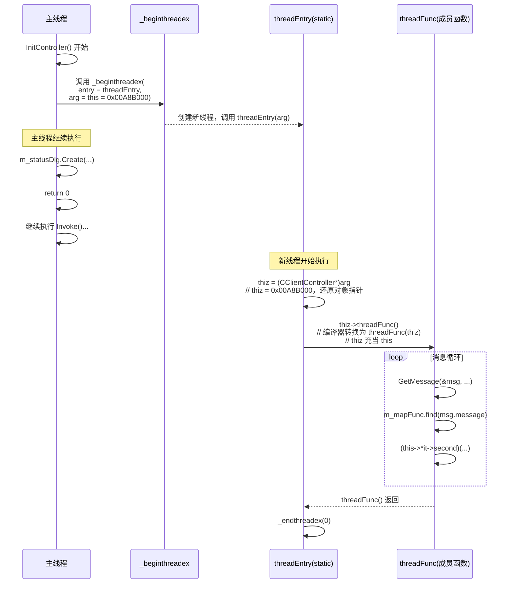
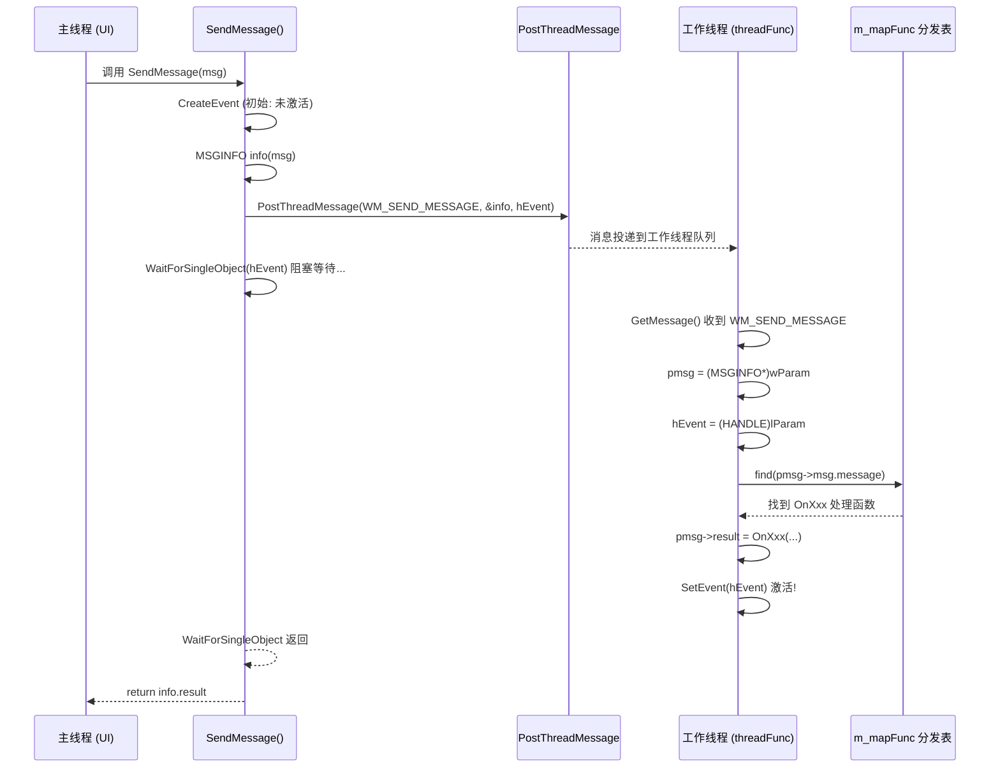
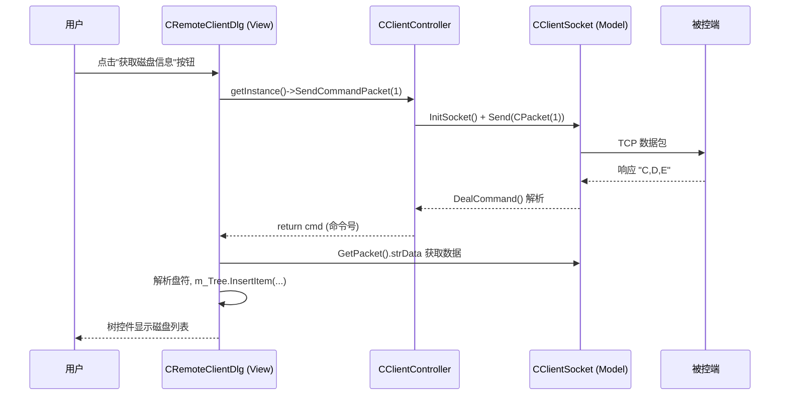

---
tags:
  - 项目/远控系统
heatmap_tracker: true
heatmap_group: 远控系统/6.网络与多线程问题
heatmap_weight: 1
git: "671505f"
---

# 6.1 初步完成控制层

> 按照 [[5.7 MVC设计模式]] 的重构思路，实现 `CClientController` 控制层：单例模式 + 工作线程 + 消息分发表 + 跨线程同步通信 + **网络操作门面**。Controller 承担了 MVC 中协调者的角色，View（对话框）不再直接调用网络层，而是通过 Controller 中转。

---

## 功能概述

| 功能                    | 说明                                                                           |
| --------------------- | ---------------------------------------------------------------------------- |
| **CClientController** | MVC 中的 Controller 层，单例模式，协调所有 View 和 Model                                   |
| **网络操作门面**            | 封装 `SendCommandPacket`、`DealCommand`、`CloseSocket` 等，View 通过 Controller 访问网络 |
| **工作线程**              | 独立线程运行消息循环，处理业务逻辑，不阻塞 UI                                                     |
| **消息分发表**             | 成员函数指针 + map，替代 switch-case 的命令分发                                            |
| **跨线程同步通信**           | 主线程发消息给工作线程，阻塞等待处理结果返回                                                       |
| **工具类**               | `CEdoyunTool` 提供字节流转图片等通用功能                                                  |

---

## 设计背景

### 从上帝类到 MVC

在 [[5.7 MVC设计模式]] 中分析了客户端的核心问题：`CRemoteClientDlg` 是一个上帝类，同时承担 View + Controller + Model 的职责。重构目标是**引入 Controller 层**，把业务协调逻辑从 Dialog 中剥离出来。

### Controller 需要解决的问题

| 问题 | 解决方案 |
|------|---------|
| 谁来管理所有 View 的生命周期？ | Controller 持有所有 Dialog 对象 |
| View 如何访问网络？ | Controller 提供门面方法，View 不直接操作 CClientSocket |
| UI 线程不能做耗时操作 | Controller 开工作线程处理业务 |
| 工作线程如何接收任务？ | Windows 消息循环 + `PostThreadMessage` |
| 主线程如何等待工作线程的处理结果？ | Event 事件对象同步 |

---

## 架构设计

### MVC 职责划分（当前实现）

```
┌─────────────────────────────────────────────────────────┐
│                    View 层 (对话框)                       │
│  CRemoteClientDlg   CWatchDialog   CStatusDlg           │
│  - UI 控件操作        - 远程桌面      - 进度显示           │
│  - 捕获用户事件       - 鼠标事件                          │
│  - 通过 Controller 访问网络（不再直接调 CClientSocket）    │
└───────────────────────┬─────────────────────────────────┘
                        │ 调用 CClientController::getInstance()->XXX()
                        ▼
┌─────────────────────────────────────────────────────────┐
│                 Controller 层 (控制器)                    │
│  CClientController (单例)                                │
│  - 持有所有 View 对象的生命周期                           │
│  - 网络操作门面: SendCommandPacket / DealCommand / ...   │
│  - 工作线程 + 消息分发表                                  │
│  - 跨线程同步通信 (SendMessage + Event)                   │
└───────────────────────┬─────────────────────────────────┘
                        │ 调用 CClientSocket::getInstance()->XXX()
                        ▼
┌─────────────────────────────────────────────────────────┐
│                   Model 层 (网络/数据)                    │
│  CClientSocket (单例)          CEdoyunTool (工具类)       │
│  - InitSocket / Send / recv   - Bytes2Image              │
│  - DealCommand / GetPacket    - Dump                     │
│  - CPacket 协议封装                                      │
└─────────────────────────────────────────────────────────┘
```

### 重构前后对比

| 维度 | 重构前 | 重构后 |
|------|--------|--------|
| **网络调用方式** | `CRemoteClientDlg` 直接调 `CClientSocket` | 通过 `CClientController::getInstance()->SendCommandPacket()` |
| **Dialog 持有** | Dialog 自己创建子对话框 | Controller 持有所有 Dialog |
| **图片处理** | 散布在 Dialog 代码中 | 提取到 `CEdoyunTool::Bytes2Image()` |
| **地址更新** | Dialog 直接设置 Socket 地址 | 通过 `Controller::UpdateAddress()` |

### 整体结构

```
RemoteClient.cpp (程序入口)
  │
  ├── CClientController::getInstance()   // 获取单例 + 注册分发表
  ├── InitController()                   // 创建工作线程 + 状态对话框
  └── Invoke(m_pMainWnd)                // 启动主界面 DoModal
        │
        ▼
CClientController (Controller 单例)
  │
  ├── 持有 View ─────────────────────────────────────────
  │   ├── m_remoteDlg   (CRemoteClientDlg)  // 主界面
  │   ├── m_watchDlg    (CWatchDialog)       // 监视界面
  │   └── m_statusDlg   (CStatusDlg)        // 状态界面
  │
  ├── 网络门面 ──────────────────────────────────────────
  │   ├── SendCommandPacket(nCmd, ...)   // 发命令 + 收响应
  │   ├── SendPacket(pack)               // 发送 CPacket
  │   ├── DealCommand()                  // 接收并解析响应
  │   ├── CloseSocket()                  // 关闭连接
  │   ├── UpdateAddress(nIP, nPort)      // 更新服务器地址
  │   └── GetImage(image)                // 字节流 → CImage
  │
  ├── 工作线程 ──────────────────────────────────────────
  │   ├── m_hThread / m_nThreadID
  │   └── threadFunc()                   // 消息循环
  │         ├── WM_SEND_MESSAGE → 同步处理 + SetEvent
  │         └── 其他消息 → m_mapFunc 查表调用
  │
  └── 消息处理函数 ──────────────────────────────────────
      ├── OnSendPack()    → pClient->Send(*pPacket)
      ├── OnSendData()    → pClient->Send(pBuffer, len)
      ├── OnShowStatus()  → m_statusDlg.ShowWindow()
      └── OnShowWatcher() → m_watchDlg.DoModal()
```

### 文件结构

> 📁 `RemoteClient/ClientController.h` : 控制器头文件（类定义 + 消息宏 + MSGINFO 结构体）
> 📁 `RemoteClient/ClientController.cpp` : 控制器实现（分发表注册 + 线程 + 消息处理函数）
> 📁 `RemoteClient/EdoyunTool.h` : 工具类（Dump 调试 + 字节流转图片）

---

## 核心实现

### 1. 单例模式与消息分发表注册

Controller 采用和 [[2.2 网络编程架构设计]] 中 `CServerSocket` 相同的单例模式：`protected` 构造函数 + `static getInstance()` + `CHelper` 自动释放。

**为什么构造函数是 `protected`？**

```cpp
protected:
    CClientController() :
        m_statusDlg(&m_remoteDlg), m_watchDlg(&m_remoteDlg)  // View 的父窗口都是主界面
    {
        m_hThread = INVALID_HANDLE_VALUE;
        m_nThreadID = -1;
    }
```

外部代码写 `CClientController controller;` 会编译报错，**强制所有人只能通过 `getInstance()` 获取唯一实例**。

构造函数中用**初始化列表**设置了 `m_statusDlg` 和 `m_watchDlg` 的父窗口为 `&m_remoteDlg`，这样 MFC 框架知道这些子对话框属于主界面。

**消息分发表的注册**：

`getInstance()` 在创建单例时，同时注册消息-处理函数的映射关系：

```cpp
CClientController* CClientController::getInstance()
{
    if (m_instance == NULL)
    {
        m_instance = new CClientController();

        // 消息分发表：消息 ID → 成员函数指针
        struct
        {
            UINT nMsg;
            MSGFUNC func;
        }MsgFuncs[] =
        {
            {WM_SEND_PACK,   &CClientController::OnSendPack},    // 发送包
            {WM_SEND_DATA,   &CClientController::OnSendData},    // 发送数据
            {WM_SHOW_STATUS, &CClientController::OnShowStatus},   // 显示状态
            {WM_SHOW_WATCH,  &CClientController::OnShowWatcher},  // 远程监控
            {(UINT)-1, NULL}  // 哨兵值，标记数组结束
        };

        // 循环注册到 map 中
        for (int i = 0; MsgFuncs[i].func != NULL; i++)
        {
            m_mapFunc.insert(std::pair<UINT, MSGFUNC>(
                MsgFuncs[i].nMsg, MsgFuncs[i].func));
        }
    }
    return m_instance;  // 返回单例指针
}
```

**关键点**：

1. **匿名结构体数组**：`MsgFuncs[]` 用临时数组列出所有"消息-函数"对应关系，`{(UINT)-1, NULL}` 作为哨兵标记结束
2. **注册到 map**：循环将每个消息 ID 和对应的成员函数指针插入 `m_mapFunc`，后续查表调用

> [!warning] getInstance() 必须返回 m_instance
> 早期版本误写为 `return nullptr`，导致调用方拿到空指针后调用 `InitController()`，`this` 为 NULL，`&this->m_nThreadID` 变成非法地址偏移量，`_beginthreadex` 写入时触发访问权限冲突。

### 2. 网络操作门面（MVC 的关键）

这是本次重构最重要的设计变化。Controller 作为**门面（Facade）**，封装了所有网络操作：

```cpp
// Controller 中的网络门面方法
int SendCommandPacket(int nCmd, bool bAutoClose = true,
    BYTE* pData = NULL, size_t nLength = 0)
{
    CClientSocket* pClient = CClientSocket::getInstance();
    if (pClient->InitSocket() == false)     // 1. 建立连接
        return false;
    pClient->Send(CPacket(nCmd, pData, nLength));  // 2. 发送命令
    int cmd = DealCommand();                 // 3. 接收响应
    TRACE("ack:%d\r\n", cmd);
    if (bAutoClose)
        CloseSocket();                       // 4. 自动关闭（可选）
    return cmd;                              // 5. 返回命令号
}
```

**View 层的调用方式变化**：

```cpp
// ❌ 重构前：Dialog 直接操作 CClientSocket
void CRemoteClientDlg::OnBnClickedBtnTest()
{
    CClientSocket* pClient = CClientSocket::getInstance();
    pClient->InitSocket();
    pClient->Send(CPacket(1981, NULL, 0));
    pClient->DealCommand();
    pClient->CloseSocket();
}

// ✅ 重构后：Dialog 通过 Controller 一行搞定
void CRemoteClientDlg::OnBnClickedBtnTest()
{
    CClientController::getInstance()->SendCommandPacket(1981);
}
```

**其他门面方法**：

| 方法 | 委托给 | 作用 |
|------|--------|------|
| `UpdateAddress(nIP, nPort)` | `CClientSocket::UpdateAddress()` | 更新服务器地址 |
| `DealCommand()` | `CClientSocket::DealCommand()` | 接收并解析响应 |
| `CloseSocket()` | `CClientSocket::CloseSocket()` | 关闭连接 |
| `SendPacket(pack)` | `CClientSocket::InitSocket()` + `Send()` | 发送 CPacket |
| `GetImage(image)` | `CEdoyunTool::Bytes2Image()` | 将响应字节流转为 CImage |

**为什么要这样封装？**

这是 [[5.7 MVC设计模式]] 中 MVC 原则的落地：**View 不应该直接做网络通信**。通过 Controller 门面，View 只需要知道"我要发什么命令"，不需要关心连接建立、数据发送、响应接收、连接关闭等细节。

### 3. 消息处理函数实现

四个消息处理函数对应四种业务操作：

```cpp
// 发送 CPacket 数据包
LRESULT CClientController::OnSendPack(UINT nMsg, WPARAM wParam, LPARAM lParam)
{
    CClientSocket* pClient = CClientSocket::getInstance();
    CPacket* pPacket = (CPacket*)wParam;    // wParam 传的是 CPacket 指针
    return pClient->Send(*pPacket);
}

// 发送原始字节数据
LRESULT CClientController::OnSendData(UINT nMsg, WPARAM wParam, LPARAM lParam)
{
    CClientSocket* pClient = CClientSocket::getInstance();
    char* pBuffer = (char*)wParam;          // wParam 传的是 buffer 指针
    return pClient->Send(pBuffer, (int)lParam);  // lParam 是数据长度
}

// 显示状态对话框
LRESULT CClientController::OnShowStatus(UINT nMsg, WPARAM wParam, LPARAM lParam)
{
    return m_statusDlg.ShowWindow(SW_SHOW);
}

// 显示远程监控对话框（模态）
LRESULT CClientController::OnShowWatcher(UINT nMsg, WPARAM wParam, LPARAM lParam)
{
    return m_watchDlg.DoModal();
}
```

### 4. 成员函数指针与 map 分发

这是整个设计中最难理解的部分。

#### 什么是成员函数指针

```cpp
typedef LRESULT(CClientController::* MSGFUNC)(UINT nMsg, WPARAM wParam, LPARAM lParam);
```

拆开理解：

| 部分 | 含义 |
|------|------|
| `LRESULT` | 返回值类型 |
| `(CClientController::* MSGFUNC)` | 指向 `CClientController` 成员函数的指针，别名叫 `MSGFUNC` |
| `(UINT, WPARAM, LPARAM)` | 参数列表 |

普通函数指针是 `void (*pFunc)(int)`，成员函数指针多了 `类名::*`，因为调用时需要知道是哪个类的方法，需要通过对象来调用。

#### 分发表结构

```
m_mapFunc (std::map<UINT, MSGFUNC>)
┌──────────────────┬────────────────────────────────────┐
│  消息 ID (Key)    │  处理函数 (Value)                   │
├──────────────────┼────────────────────────────────────┤
│  WM_SEND_PACK    │  &CClientController::OnSendPack    │
│  WM_SEND_DATA    │  &CClientController::OnSendData    │
│  WM_SHOW_STATUS  │  &CClientController::OnShowStatus  │
│  WM_SHOW_WATCH   │  &CClientController::OnShowWatcher │
└──────────────────┴────────────────────────────────────┘
```

#### 调用语法

```cpp
std::map<UINT, MSGFUNC>::iterator it = m_mapFunc.find(msg.message);
if (it != m_mapFunc.end())
{
    // this->*it->second 是成员函数指针的调用语法
    (this->*it->second)(msg.message, msg.wParam, msg.lParam);
}
```

`this->*it->second` 的含义：

| 部分 | 含义 |
|------|------|
| `it->second` | map 中存的函数指针（如 `&CClientController::OnSendPack`） |
| `this->*` | 通过当前对象调用该成员函数 |
| `(msg.message, ...)` | 传参 |

**效果**：根据消息 ID 动态选择调用哪个 `OnXxx` 方法，避免了一长串 `if-else` / `switch-case`。

### 5. 工作线程：static 桥接模式

#### 根本矛盾：C 函数签名 vs C++ 成员函数签名

`_beginthreadex` 是 C 运行时库函数，它要求线程入口函数的签名**严格**为：

```cpp
unsigned __stdcall func(void* arg);   // 只有 1 个参数
```

但普通（非 static）成员函数有一个**隐藏的 this 参数**（参见 [[12.1.4 类的成员函数#this 指针]]）。编译器看到的真实签名对比：

```
普通成员函数的真实签名：              static 成员函数的真实签名：
    unsigned func(                      unsigned func(
        CClientController* this,  ← 多了!       void* arg);
        void* arg);
```

更深层来看，两者的**调用约定**也不同：

| 维度 | 普通成员函数 | static 成员函数 |
|------|------------|----------------|
| 隐含参数 | 有 `this`（通过 ECX 寄存器传递） | 无 |
| 调用约定 | `__thiscall` | `__stdcall`（与 C 兼容） |
| 函数签名 | 2 个参数 | 1 个参数 |

`_beginthreadex` 内部调用线程函数时，只会把 `void* arg` 压栈，**不知道还需要通过 ECX 传 this**。如果强行传入普通成员函数指针，要么编译失败，要么运行时崩溃。

#### 解决方案：三步走

整个 static 桥接模式分三步完成，核心思想是**把 this 指针藏进 `void* arg`，在新线程中还原**。

**第一步：创建线程时，把 `this` 藏进 `void* arg`**

```cpp
int CClientController::InitController()
{
    m_hThread = (HANDLE)_beginthreadex(
        NULL,                               // 安全属性（默认）
        0,                                  // 栈大小（默认）
        &CClientController::threadEntry,    // 线程入口（必须是 static）
        this,                               // ← 关键！把当前对象地址作为参数传进去
        0,                                  // 创建后立即运行
        &m_nThreadID                        // 输出：线程 ID
    );
    m_statusDlg.Create(IDD_DLG_STATUS, &m_remoteDlg);  // 创建状态对话框（非模态）
    return 0;
}
```

`_beginthreadex` 的第 4 个参数 `void* arg` 会被原封不动地传给线程入口函数。我们把 `this`（当前 Controller 对象的地址）塞进去：

```
主线程执行 InitController() 时：

    this = 0x00A8B000  ──────────────────────┐
                                              │
    _beginthreadex(                           │
        ...,                                  │
        threadEntry,    // static 函数指针     │
        this,           // 把 0x00A8B000 传入 ─┘
        ...
    );
```

**第二步：Static 桥接函数接收 `void* arg`，还原为对象指针**

```cpp
unsigned __stdcall CClientController::threadEntry(void* arg)
//                                                ^^^^^^^^
//                 arg 的值就是第一步传入的 this = 0x00A8B000
{
    CClientController* thiz = (CClientController*)arg;
    //                        ^^^^^^^^^^^^^^^^^^^^^^^^^
    //                        把 void* 强转回原来的类型
    //                        thiz = 0x00A8B000，和原来的 this 指向同一个对象！

    thiz->threadFunc();     // 通过 thiz 调用非静态成员函数
    _endthreadex(0);
    return 0;
}
```

为什么叫"桥接"？因为它是 **C 世界和 C++ 世界之间的桥**：
- **对外**（对 `_beginthreadex`）：它是一个符合 C 签名的 static 函数，`__stdcall` 调用约定
- **对内**（对 `CClientController`）：它通过 `thiz` 还原了对象指针，可以调用任何成员函数

**第三步：进入真正的成员函数**

`thiz->threadFunc()` 等价于编译器生成的 `threadFunc(thiz)`，`thiz` 就充当了 `this` 的角色。从此刻起，`threadFunc()` 内部可以正常访问所有成员变量（`m_mapFunc`、`m_statusDlg` 等），和普通成员函数完全一样。

#### 完整流程图



#### 变量名 `thiz` 的由来

`this` 是 C++ 关键字不能用作变量名，常见替代命名：

| 命名 | 风格 |
|------|------|
| `thiz` | 谐音替代，本项目使用的方式 |
| `pThis` | 匈牙利命名法（p 表示 pointer） |
| `self` | 借鉴 Python/Objective-C 的叫法 |

本质上只是一个临时局部变量，作用就是暂存还原后的对象指针。

#### 这个模式在哪里还会遇到？

几乎所有 **C 回调接口 + C++ 对象**的场景都会用到这个套路。关于为什么会存在这个矛盾（C 回调只认裸函数指针、C++ 成员函数有隐含 this 参数导致调用约定不兼容），以及完整的解决方案和应用场景，详见 [[3.1 C回调接口与C++对象]]。

| 场景 | C 回调接口 | 同样的"static 桥接 + void* 传 this" |
|------|-----------|-----------------------------------|
| Linux 线程 | `pthread_create(tid, attr, func, arg)` | `arg` 传 `this` |
| Windows 定时器 | `SetTimer` 回调 | `LPARAM` 传 `this` |
| C 排序 | `qsort` 比较函数 | 需要全局/static 函数 |

> 📎 关于 this 指针的详细讲解，参见 [[12.1.4 类的成员函数#this 指针]]。static 成员函数没有 this 指针，参见 [[12.1.10 静态成员函数]]。

### 6. 工作线程消息循环

工作线程运行一个标准的 Windows 消息循环，等待并处理消息：

```cpp
void CClientController::threadFunc()
{
    MSG msg;
    // GetMessage: 阻塞等待消息，收到 WM_QUIT 时返回 FALSE 退出循环
    while (::GetMessage(&msg, NULL, 0, 0))
    {
        TranslateMessage(&msg);
        DispatchMessage(&msg);

        // 处理跨线程同步消息（SendMessage 发过来的）
        if (msg.message == WM_SEND_MESSAGE)
        {
            MSGINFO* pmsg = (MSGINFO*)msg.wParam;   // 还原消息结构体指针
            HANDLE hEvent = (HANDLE)msg.lParam;       // 还原事件句柄

            // 在分发表中查找处理函数
            std::map<UINT, MSGFUNC>::iterator it = m_mapFunc.find(msg.message);
            if (it != m_mapFunc.end())
            {
                // 调用对应的 OnXxx 处理函数，结果写回 pmsg->result
                pmsg->result = (this->*it->second)(
                    pmsg->msg.message, pmsg->msg.wParam, pmsg->msg.lParam);
            }
            else
            {
                pmsg->result = -1;  // 未找到处理函数
            }
            SetEvent(hEvent);  // 通知主线程：处理完毕！
        }
        else
        {
            // 普通消息：直接查表调用（不需要同步等待）
            std::map<UINT, MSGFUNC>::iterator it = m_mapFunc.find(msg.message);
            if (it != m_mapFunc.end())
            {
                (this->*it->second)(msg.message, msg.wParam, msg.lParam);
            }
        }
    }
}
```

**两种消息处理路径**：

| 消息类型              | 来源                       | 处理方式                       |
| ----------------- | ------------------------ | -------------------------- |
| `WM_SEND_MESSAGE` | 主线程通过 `SendMessage()` 发送 | 处理后写回结果 + `SetEvent` 通知主线程 |
| 其他消息              | 直接 `PostThreadMessage`   | 查表调用，无需同步                  |

### 7. 跨线程同步通信（核心难点）

这是本节最重要的设计：**用异步的 `PostThreadMessage` + Event 事件对象，模拟同步调用**。

#### 问题：为什么需要同步？

`PostThreadMessage` 是异步的（"丢下消息就走"），但很多场景下主线程**需要等到处理完才能继续**（比如发送网络包后需要拿到结果）。

#### 三个子问题与解决方案

| 问题 | 本质 | 解决方案 |
|------|------|---------|
| **消息参数** | `PostThreadMessage` 只能传 WPARAM/LPARAM 两个整数 | 用 `MSGINFO` 结构体包装，传指针 |
| **返回值** | 异步投递无法直接返回结果 | 工作线程写入 `pmsg->result`，两线程共享同一块内存 |
| **同步等待** | 主线程不知道工作线程何时处理完 | `CreateEvent` + `WaitForSingleObject` + `SetEvent` |

#### MSGINFO 结构体

```cpp
typedef struct MsgInfo {
    MSG msg;          // 完整的 Windows 消息
    LRESULT result;   // 处理结果（工作线程填写，主线程读取）

    MsgInfo(MSG m)
    {
        result = 0;
        memcpy(&msg, &m, sizeof(MSG));
    }
    // ... 拷贝构造、赋值运算符 ...
} MSGINFO;
```

`MSGINFO` 把"要处理的消息"和"处理结果"打包在一起，主线程和工作线程通过**指针**操作同一个 `MSGINFO` 对象。

#### SendMessage 实现

```cpp
LRESULT CClientController::SendMessage(MSG msg)
{
    // 1. 创建事件对象（初始: 未激活），失败返回 -2
    HANDLE hEvent = CreateEvent(NULL, TRUE, FALSE, NULL);
    if (hEvent == NULL)
        return -2;

    // 2. 打包消息和结果槽
    MSGINFO info(msg);

    // 3. 投递给工作线程（异步，立即返回）
    //    wParam = &info   → 消息结构体指针
    //    lParam = hEvent  → 事件句柄
    PostThreadMessage(m_nThreadID, WM_SEND_MESSAGE,
        (WPARAM)&info, (LPARAM)hEvent);

    // 4. 阻塞等待工作线程 SetEvent
    WaitForSingleObject(hEvent, -1);  // -1 = INFINITE，永久等待

    // 5. 工作线程已处理完毕，读取结果
    return info.result;
}
```

> 📎 `CreateEvent` / `WaitForSingleObject` / `SetEvent` 的详细讲解参见 [[3.6 事件对象与线程同步]]

#### 完整时序图



**关键设计点**：

1. **`info` 在主线程栈上**，工作线程通过指针 `pmsg` 写入 `result`，两个线程操作**同一块内存**
2. **Event 保证时序**：主线程在 `WaitForSingleObject` 处阻塞，直到工作线程 `SetEvent`，确保读取 `result` 时数据已经写好
3. **效果**：对调用者来说，`SendMessage` 就像一个普通的同步函数调用——传入消息，返回结果。但实际执行是在工作线程上完成的

### 8. 工具类 CEdoyunTool

新增的工具类，提供静态方法：

```cpp
class CEdoyunTool
{
public:
    // 十六进制 Dump 调试输出
    static void Dump(BYTE* pData, size_t nSize);

    // 将字节流（PNG 数据）转换为 CImage 对象
    static int Bytes2Image(CImage& image, const std::string& strBuffer)
    {
        BYTE* pData = (BYTE*)strBuffer.c_str();
        HGLOBAL hMem = GlobalAlloc(GMEM_MOVEABLE, 0);   // 分配全局内存
        IStream* pStream = NULL;
        HRESULT hRet = CreateStreamOnHGlobal(hMem, TRUE, &pStream);  // 创建内存流
        if (hRet == S_OK)
        {
            pStream->Write(pData, strBuffer.size(), &length);  // 写入 PNG 数据
            pStream->Seek(bg, STREAM_SEEK_SET, NULL);           // 回到流起点
            if ((HBITMAP)image != NULL)
                image.Destroy();   // 释放旧图像
            image.Load(pStream);   // 从流加载图像
        }
        return hRet;
    }
};
```

Controller 通过 `GetImage()` 方法封装了这个调用：

```cpp
int CClientController::GetImage(CImage& image)
{
    CClientSocket* pClient = CClientSocket::getInstance();
    return CEdoyunTool::Bytes2Image(image, pClient->GetPacket().strData);
}
```

这样 View 获取屏幕图像只需要调 `pCtrl->GetImage(m_image)`，不需要知道字节流转换的细节。

### 9. 程序启动流程

```cpp
// RemoteClient.cpp — InitInstance()
CClientController::getInstance()->InitController();  // 创建单例 + 工作线程
INT_PTR nResponse = CClientController::getInstance()->Invoke(m_pMainWnd);  // 启动主界面
```

```cpp
// ClientController.cpp
int CClientController::InitController()
{
    m_hThread = (HANDLE)_beginthreadex(NULL, 0,
        &CClientController::threadEntry, this, 0, &m_nThreadID);
    m_statusDlg.Create(IDD_DLG_STATUS, &m_remoteDlg);  // 创建状态对话框
    return 0;
}

int CClientController::Invoke(CWnd*& pMainWnd)
{
    pMainWnd = &m_remoteDlg;       // 把主对话框指针交给 MFC 框架
    return m_remoteDlg.DoModal();  // 启动模态对话框（阻塞直到关闭）
}
```

启动顺序：

```
1. getInstance()     → 创建 Controller 单例 + 注册消息分发表
2. InitController()  → 创建工作线程 + 创建状态对话框
3. Invoke()          → DoModal 启动主界面（阻塞在这里直到用户关闭窗口）
```

---

## 自定义消息定义

```cpp
#define WM_SEND_PACK    (WM_USER+1)       // 发送包数据
#define WM_SEND_DATA    (WM_USER+2)       // 发送数据
#define WM_SHOW_STATUS  (WM_USER+3)       // 展示状态
#define WM_SHOW_WATCH   (WM_USER+4)       // 远程监控
#define WM_SEND_MESSAGE (WM_USER+0x1000)  // 跨线程同步消息
```

`WM_USER` 是 Windows 保留给应用自定义消息的起始值，从它往后的编号都可以自己使用。`WM_SEND_MESSAGE` 特意偏移了 `0x1000`，避免和前面的业务消息冲突。

> [!warning] 宏定义末尾不能加分号
> `#define` 是文本替换，如果写成 `#define WM_SEND_MESSAGE (WM_USER+0x1000);`，展开后会变成 `PostThreadMessage(..., (WM_USER+0x1000);, ...)`，多出的分号导致编译错误。

---

## View 层如何通过 Controller 工作

### 典型调用流程：获取磁盘信息



### 典型调用流程：屏幕监控

```cpp
// View 层：threadWatchData (屏幕监控工作线程)
void CRemoteClientDlg::threadWatchData()
{
    CClientController* pCtrl = CClientController::getInstance();
    while (!m_isClosed)
    {
        if (m_isFull == false)
        {
            int ret = pCtrl->SendCommandPacket(6);  // 通过 Controller 发命令
            if (ret == 6)
            {
                if (pCtrl->GetImage(m_image) == 0)   // 通过 Controller 获取图像
                    m_isFull = true;
            }
        }
        else
        {
            Sleep(1);
        }
    }
}
```

**对比重构前**：View 直接调用 `CClientSocket::getInstance()->InitSocket()`、`Send()`、`DealCommand()` 等，网络操作散布在 Dialog 各个方法中。重构后统一通过 `CClientController` 中转。

### IP 地址和端口更新

```cpp
// View 层：用户修改 IP 地址时
void CRemoteClientDlg::OnIpnFieldchangedIpaddressServ(...)
{
    UpdateData();
    CClientController* pController = CClientController::getInstance();
    pController->UpdateAddress(m_server_address, atoi((LPCTSTR)m_nPort));
}
```

View 不直接操作 `CClientSocket`，而是告诉 Controller "地址变了"，由 Controller 转发给网络层。

---

## 易错点与调试

### 1. getInstance() 返回 nullptr

```cpp
// ❌ 早期 Bug：创建了 m_instance 却返回 nullptr
return nullptr;

// ✅ 修复后：返回正确的单例指针
return m_instance;
```

**后果**：调用方拿到 `nullptr` 后调用 `InitController()`，`this` 为 NULL，`&this->m_nThreadID` 变成成员偏移量 0xA08（非法地址），`_beginthreadex` 写入时触发**写入访问权限冲突**。

### 2. static 成员函数不能直接调用非静态成员

```cpp
// ❌ 编译错误：threadEntry 是 static，没有 this 指针
static unsigned __stdcall threadEntry(void* arg)
{
    threadFunc();  // 无法调用非静态成员函数
}

// ✅ 通过参数还原对象指针
static unsigned __stdcall threadEntry(void* arg)
{
    CClientController* thiz = (CClientController*)arg;
    thiz->threadFunc();  // 通过 thiz 提供 this
}
```

**原因**：非静态成员函数隐含 `this` 参数，static 函数没有 `this`，必须手动传入。详见 [[12.1.10 静态成员函数]] 和 [[12.1.4 类的成员函数#this 指针]]。

### 3. protected 构造函数阻止直接实例化

```cpp
// ❌ 编译错误：构造函数是 protected
CClientController controller;
controller.Invoke(m_pMainWnd);

// ✅ 通过单例获取
CClientController::getInstance()->Invoke(m_pMainWnd);
```

这是单例模式的标准写法，与 [[2.2 网络编程架构设计]] 中 `CServerSocket` / `CClientSocket` 的设计一致。

---

## 当前重构进度

对照 [[5.7 MVC设计模式#重构步骤建议]] 中的计划：

| 步骤 | 内容 | 状态 |
|------|------|------|
| 引入 Controller 层 | `CClientController` 单例 + 工作线程 + 消息循环 | ✅ 已完成 |
| 网络操作门面 | `SendCommandPacket` 等方法迁移到 Controller | ✅ 已完成 |
| View 调用迁移 | Dialog 通过 Controller 访问网络 | ✅ 已完成 |
| 工具类提取 | `CEdoyunTool::Bytes2Image` | ✅ 已完成 |
| 线程迁移 | 监控线程 + 下载线程迁移到 Controller | ✅ 已完成（[[6.2 优化RemoteDlg线程]]） |
| IP/Port 同步 | 控件变化实时通知 Controller | ✅ 已完成（[[6.2 优化RemoteDlg线程]]） |
| View 完全瘦身 | Dialog 中仍有部分直接调 `CClientSocket::GetPacket()` | ⏳ 进行中 |
| 提取 Model 层 | 独立的 `CClientModel` 封装数据解析 | 🔲 待实施 |

**当前状态**：Controller 已经承担了网络操作的协调职责，线程管理也已迁移完毕（见 [[6.2 优化RemoteDlg线程]]）。但 View 层仍有部分地方直接调用 `CClientSocket::getInstance()->GetPacket()` 获取数据（如 `OnBnClickedBtnFileinfo` 中解析盘符、`LoadFileInfo` 中解析文件列表）。后续可以把这些数据解析逻辑也收到 Controller 或 Model 中。

---

## 关联知识

- [[5.7 MVC设计模式]] — 本节是该重构方案的**落地实现**（引入 Controller 层 + 网络门面）
- [[2.2 网络编程架构设计]] — 相同的单例模式 + CHelper 自动释放机制
- [[3.6 事件对象与线程同步]] — `CreateEvent` / `WaitForSingleObject` / `SetEvent` 的详细讲解
- [[3.3 线程同步]] — 内核同步对象的概念基础
- [[12.1.4 类的成员函数#this 指针]] — this 指针的本质：编译器隐式传参
- [[12.1.10 静态成员函数]] — static 成员函数没有 this 指针，常用于 C 风格回调

---

## 代码索引

| 功能 | 文件 | 位置 |
|------|------|------|
| Controller 类定义 | ClientController.h | 全文 |
| 网络门面方法 | ClientController.h | 行 28-83 |
| MSGINFO 结构体 | ClientController.h | 行 111-140 |
| 成员函数指针 typedef | ClientController.h | 行 141 |
| 静态变量定义 | ClientController.cpp | 行 5-6 |
| 消息分发表注册 | ClientController.cpp | 行 8-39 |
| 工作线程创建 + 状态对话框 | ClientController.cpp | 行 41-55 |
| static 桥接函数 | ClientController.cpp | 行 63-69 |
| SendMessage 同步通信 | ClientController.cpp | 行 72-81 |
| 工作线程消息循环 | ClientController.cpp | 行 83-116 |
| OnSendPack / OnSendData | ClientController.cpp | 行 118-130 |
| OnShowStatus / OnShowWatcher | ClientController.cpp | 行 132-141 |
| CEdoyunTool 工具类 | EdoyunTool.h | 全文 |

---

## 更新记录

| 日期 | 变更 |
|------|------|
| 2026-03-16 | 初始版本：Controller 单例 + 工作线程 + 消息分发表 + 跨线程同步通信 |
| 2026-03-18 | 更新：新增网络操作门面 + MVC 职责划分 + 消息处理函数实现 + CEdoyunTool + Bug 修复记录 + 重构进度追踪 |
