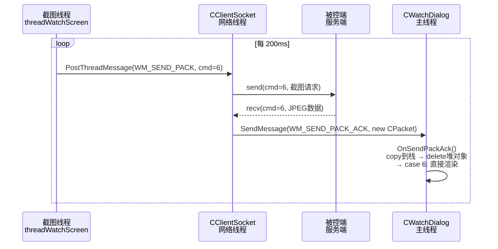

---
tags:
  - 项目/远控系统
heatmap_tracker: true
heatmap_group: 远控系统/6.网络与多线程问题
heatmap_weight: 1
git: "8d2e3c3"
git_msg: "1 解决远程显示的bug"
---

# 6.10 远程显示修复：ACK 陷阱复现与帧率控制

> 基于提交 `8d2e3c34f3e04c9d25196b4d111baf57b07e0208`（2026-03-25）。
> 上一节刚修好了 `RemoteClientDlg::OnSendPackAck`，满怀期待地跑起来，结果——监控窗口画面还是黑的。本节讲清楚为什么：同样的 bug 在 `CWatchDialog` 里原版复刻，加上一个 `m_isFull` 状态链断裂问题，共四处错误叠加，导致截图永远无法渲染。

---

## 先看清楚，这次改了什么

本次提交改动集中在控制端（`RemoteClient`）五个文件：

```
CClientSocket.cpp    ← SendPacket 增加失败路径内存回收
CWatchDialog.cpp     ← OnSendPackAck 大幅重写（核心修复）
ClientController.cpp ← threadWatchScreen 简化 + 帧率控制
ClientController.h   ← 添加 m_watchDlg 潜在内存泄漏注释
RemoteClientDlg.cpp  ← case 5 补上 break（消除 fall-through）
```

---

## 一、为什么画面是黑的

打开监控对话框后，屏幕截图请求确实在发，服务端也确实在响应，`WM_SEND_PACK_ACK` 消息也确实到达了 `CWatchDialog::OnSendPackAck`——但图像就是不渲染。

原因是**四个 bug 叠在一起**，每一个单独都能让渲染失效：

| # | 问题 | 在哪 |
|---|------|------|
| 1 | `switch (pPacket != NULL)` 布尔值分发 | `CWatchDialog::OnSendPackAck` |
| 2 | `case 5` fall-through 到 `case 6` | `CWatchDialog::OnSendPackAck` |
| 3 | `m_isFull` 状态链断裂，渲染永远跳过 | `OnSendPackAck` + `threadWatchScreen` |
| 4 | `CPacket` 堆对象无人回收 | `CWatchDialog::OnSendPackAck` |

Bug 1、2、4 和上节 [[6.9 线程启动握手模式与跨线程对象所有权]] 里修过的 `RemoteClientDlg` 一模一样——复制粘贴代码的时候把 bug 也一起复制来了，修主对话框忘了修监控对话框。Bug 3 是这次独有的，最值得仔细看。

---

## 二、Bug 1 & 2 & 4：经典三连错（再演一遍）

旧版 `CWatchDialog::OnSendPackAck` 关键路径：

```cpp
CPacket* pPacket = (CPacket*)wParam;
if (pPacket != NULL)
{
    switch (pPacket != NULL)   // ❌ 只会得到 0/1，cmd 根本用不上
    {
    case 5:                    // ❌ 没有 break，fall-through 进 case 6
    case 6:
    {
        if (m_isFull)          // ❌ 后面会讲，这里永远是 false
        {
            CEdoyunTool::Bytes2Image(m_image, pPacket->strData);
            ...
            m_isFull = false;
        }
        break;
    }
    // ← pPacket 从来没有 delete，一个包泄漏一个
    }
}
```

这三个问题的详细分析见 [[Bug目录/6.9-Bug-02 ACK 回调三连错：接线、分发与内存泄漏]]，这里不重复，只讲修法：

```cpp
// ✅ 修复后
CPacket head = *(CPacket*)wParam;   // 先值拷贝到栈
delete (CPacket*)wParam;            // 立即释放，所有权回收
switch (head.sCmd)                  // 用命令号分发
{
case 5:
    TRACE("mouse event ack\r\n");
    break;                          // case 5 独立处理，不 fall-through
case 6:
{
    // 直接渲染，不再有 m_isFull 条件
    CEdoyunTool::Bytes2Image(m_image, head.strData);
    ...
    break;
}
```

---

## 三、Bug 3：m_isFull 状态链断裂（这次的重点）

这个 bug 比较隐蔽，不是代码写错，而是**状态机的多个环节之间脱节**了。

### 原来的设计意图

`m_isFull` 是 `CWatchDialog` 的一个成员变量，设计上代表"当前图像是否已就绪"：

```
截图线程：
  if (isFull == false) → 发请求 → 服务端截图 → 收到图像数据
                                                      ↓
                                          SetImageStatus(true) ← isFull = true
OnSendPackAck case 6：
  if (m_isFull) → 渲染图像 → m_isFull = false → 截图线程再发下一帧
```

思路是：用 `m_isFull` 做截图线程和渲染回调之间的协调信号，防止还没处理完上一帧就发下一个请求。

设计本身没问题，问题是 **`SetImageStatus(true)` 的调用路径断了**。

### 为什么 isFull 永远是 false

旧版 `threadWatchScreen` 里本来有这段逻辑：

```cpp
int ret = SendCommandPacket(m_watchDlg.GetSafeHwnd(), 6, true, NULL, 0);
if (ret == 6)                   // ← ❌ 这里就断了！
{
    if (CEdoyunTool::Bytes2Image(m_watchDlg.GetImage(),
        lstPacks.front().strData) == 0)
    {
        m_watchDlg.SetImageStatus(true);   // ← 设置 isFull = true
    }
}
```

`SendCommandPacket` 返回的是 `bool`——`true`（1）表示发送成功，`false`（0）表示失败。`bool` 的值域只有 0 和 1，`ret == 6` **永远是 false**。

所以 `SetImageStatus(true)` 从来没被调用，`m_isFull` 从初始化（`false`）开始，一直就是 `false`。

连锁反应：

```
threadWatchScreen: isFull==false → 发请求 ✓
服务端: 截图、返回数据 ✓
OnSendPackAck: 到达 case 6
  → if (m_isFull)  ← m_isFull 永远是 false
  → 渲染代码永远跳过 ❌
```

截图来了，渲染逻辑跳过，画面黑屏。

### 修复思路：干掉 m_isFull，改用时间控制

`m_isFull` 这个状态机太脆了——两个组件之间要靠同一个标志位协调，任何一处出问题整体就瘫了。

新版的解法更简单：**直接用时间来控制截图频率，不依赖状态标志**。

```
截图线程：每 200ms 发一次请求（无论上一帧有没有处理完）
ACK 回调：收到截图数据就直接渲染（不检查任何状态）
```

两个组件完全解耦，互不依赖对方的状态。

---

## 四、截图线程的改造：帧率控制

新版 `threadWatchScreen` 整体变得很清爽：

```cpp
void CClientController::threadWatchScreen()
{
    Sleep(50);
    ULONGLONG nTick = GetTickCount64();   // 记录"上次发包时刻"
    while (!m_isClosed)
    {
        if (m_watchDlg.isFull() == false)   // 现在恒为 true（isFull 永不被设为 true）
        {
            // ===== 帧率控制：至少间隔 200ms =====
            if (GetTickCount64() - nTick < 200)
            {
                // 距上次发包不足 200ms，补眠剩余时间
                Sleep(200 - DWORD(GetTickCount64() - nTick));
            }
            nTick = GetTickCount64();   // 更新"上次发包时刻"

            // ===== 发送截图请求 =====
            int ret = SendCommandPacket(m_watchDlg.GetSafeHwnd(), 6, true, NULL, 0);
            if (ret == 1)   // bool true == 1，发包成功
            {
                TRACE("成功发送请求图片 %08X\r\n");
            }
            else
            {
                TRACE("获取图片失败！ret = %d \r\n", ret);
            }
        }
        Sleep(1);   // 让出 CPU，防止空转
    }
}
```

**帧率控制的实现细节**：

为什么不直接 `Sleep(200)` 了事，而要用 `GetTickCount64()` 算补偿时间？

```cpp
// 方案 A：固定睡眠（实际发包间隔 > 200ms）
Sleep(200);   // 200ms 睡眠 + 发包本身的时间 + 数据处理时间

// 方案 B：补偿睡眠（约束总周期 ≈ 200ms）
if (GetTickCount64() - nTick < 200)
{
    Sleep(200 - DWORD(GetTickCount64() - nTick));   // 只睡剩余时间
}
```

方案 B 把发包过程消耗的时间算进去，总节奏更稳定，不会因为每次处理耗时不均而让帧率越来越低。

`GetTickCount64()` 返回系统启动至今的毫秒数，单调递增，不受系统时间调整影响，适合用来做时间间隔计算。

---

## 五、SendPacket 失败路径的内存泄漏

这是这次提交里的另一处修复，相对独立。

**问题**：旧版 `CClientSocket::SendPacket` 里，`new PACKET_DATA` 直接嵌在函数参数里：

```cpp
// ❌ 旧版本
bool ret = PostThreadMessage(m_nThreadID, WM_SEND_PACK,
    (WPARAM)new PACKET_DATA(strOut.c_str(), strOut.size(), nMode, wParam),
    (LPARAM)hWnd);
// 如果 PostThreadMessage 返回 false，PACKET_DATA 就永远泄漏了
// 因为连变量名都没有，根本无法引用这个指针来 delete
```

`PostThreadMessage` 是可能失败的——比如目标线程的消息队列已满，或者线程已经退出。失败时消息没有投递出去，网络线程也就不会处理这条消息，自然不会 `delete PACKET_DATA`。

**修复**：先保存指针，失败时自己清理：

```cpp
// ✅ 新版本
PACKET_DATA* pData = new PACKET_DATA(strOut.c_str(), strOut.size(), nMode, wParam);
bool ret = PostThreadMessage(m_nThreadID, WM_SEND_PACK, (WPARAM)pData, (LPARAM)hWnd);
if (ret == false)
{
    delete pData;   // 发送失败，自己负责回收
}
```

> [!tip] 内联 new 的危险
> `func((WPARAM)new Foo(...))` 这种写法把 `new` 的结果藏在表达式里，一旦 `func` 失败，你甚至没有变量来引用这个指针。所以凡是 `new` 出来的对象要跨越函数调用边界传递，都应该先用变量保存，然后才考虑失败路径。

详细分析见 [[Bug目录/6.10-Bug-02 PostThreadMessage失败路径内存泄漏]]。

---

## 六、完整调用链

修复后，远程截图的完整数据流如下：



---

## 易错点

> [!warning] 同款 bug 不止在一处

`RemoteClientDlg` 和 `CWatchDialog` 都有 `OnSendPackAck`，修了一个忘了另一个。修 bug 时要全局搜索同名函数，别只看当前文件。

> [!warning] bool 函数的返回值不要和大整数比较

`SendCommandPacket` 返回 `bool`，`ret == 6` 永远是 false。碰到"逻辑走不进去"的 bug，先检查条件里的类型是否匹配。

> [!warning] 状态机要保证所有写入路径都能走到

`m_isFull` 的问题不是"写错了状态值"，而是"负责写 true 的代码因为另一个 bug 从来没有执行"。状态机调试时要顺着每个状态的"设置路径"逐一确认。

---

## 相关 Bug 详解

- [[Bug目录/6.10-Bug-01 CWatchDialog ACK三连错与isFull状态陷阱]] — 四个 Bug 的完整分析
- [[Bug目录/6.10-Bug-02 PostThreadMessage失败路径内存泄漏]] — 发包失败内存泄漏详解

---

## 关联知识

- [[6.9 线程启动握手模式与跨线程对象所有权]] — 上一节：同款三连错在 RemoteClientDlg 的修复
- [[Bug目录/6.9-Bug-02 ACK 回调三连错：接线、分发与内存泄漏]] — 对照阅读，理解两处相同 bug 的差异

---

## 代码索引

| 功能 | 文件 | 位置 |
|------|------|------|
| CWatchDialog ACK 重写 | `CWatchDialog.cpp` | `OnSendPackAck` |
| 截图线程帧率控制 | `ClientController.cpp` | `threadWatchScreen` |
| SendPacket 失败路径回收 | `CClientSocket.cpp` | `SendPacket` |
| RemoteClientDlg case 5 break | `RemoteClientDlg.cpp` | `OnSendPackAck` |

---

## 更新记录

| 日期 | 变更 |
|------|------|
| 2026-03-25 | 初始版本：基于提交 `8d2e3c3`，聚焦 ACK 陷阱复现与 m_isFull 状态链断裂修复 |
