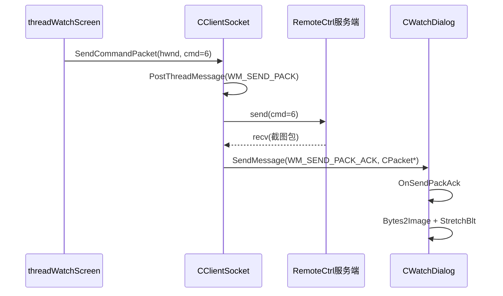

---
tags:
  - 项目/远控系统
heatmap_tracker: true
heatmap_group: 远控系统/6.网络与多线程问题
heatmap_weight: 1
git: "8d2e3c3"
git_msg: "1 解决远程显示的bug"
---

# 6.11 远程显示链路收口：回调渲染、请求节流与失败清理

> 基于提交 `8d2e3c34f3e04c9d25196b4d111baf57b07e0208`（2026-03-25）。  
> 这篇和 [[6.10 远程显示修复：ACK 陷阱复现与帧率控制]] 用的是同一个提交，但讲法不同：`6.10` 偏“把坑一个个挖出来看清楚”，本篇更像把整个远程显示链路重新捋顺，重点回答三个问题：
>
> 1. 图片请求现在到底是怎么发的  
> 2. 图片 ACK 回来之后是谁负责渲染  
> 3. 为什么这次除了修黑屏，还顺手补了失败路径的内存回收

---

## 这次改动可以浓缩成三句话

| 改动 | 代码位置 | 真正解决了什么 |
|------|------|------|
| `CWatchDialog::OnSendPackAck` 重写 | `CWatchDialog.cpp` | 截图 ACK 终于能直接解码并渲染，不再被错误的条件链卡死 |
| `threadWatchScreen` 改成定频发请求 | `ClientController.cpp` | 截图线程从“发一帧就乱成一团”变成“稳定地每隔一段时间请求一帧” |
| `SendPacket` 失败路径手动回收 `PACKET_DATA` | `CClientSocket.cpp` | `PostThreadMessage` 失败时，不再悄悄漏掉一块堆内存 |

这就是这次提交的核心定位：

> **它不是再发明一套新机制，而是在把远程显示这条已经接上的消息链路修到能稳定工作。**

---

## 和 [[6.10 远程显示修复：ACK 陷阱复现与帧率控制]] 的分工

如果你想先知道“到底错在哪”，先看 [[6.10 远程显示修复：ACK 陷阱复现与帧率控制]]。  
如果你想知道“修完之后整条链路现在怎么跑”，看这篇会更顺。

两篇的分工大致是这样：

| 笔记 | 更侧重什么 |
|------|------|
| [[6.10 远程显示修复：ACK 陷阱复现与帧率控制]] | 黑屏 bug 的拆解、ACK 陷阱、isFull 状态链断裂 |
| **本篇 6.11** | 远程显示链路的收口：请求怎么发、回调怎么渲染、节流怎么做、失败路径怎么清理 |

---

## 先把远程显示链路说顺

在这次提交之后，控制端远程显示的主链路可以简单理解成四步：

1. 监控线程按固定节奏发送 `cmd=6` 截图请求
2. 网络线程收到服务端响应后，通过 `WM_SEND_PACK_ACK` 把 `CPacket` 回投给 `CWatchDialog`
3. `CWatchDialog::OnSendPackAck` 判断命令号是 `6`
4. 直接把 PNG/图像数据解码成 `CImage`，然后 `StretchBlt` 到监控窗口

用时序图看会更清楚：



这张图里最重要的一点是：

> **渲染动作已经从 `threadWatchScreen` 挪到了 `CWatchDialog::OnSendPackAck`。**

也就是说，截图线程现在更像“定时发请求的人”，真正把图画出来的是监控对话框自己。

---

## 一、渲染逻辑终于回到了该在的地方

### 旧问题不在于“没收到包”，而在于“收到了也没画出来”

上一版的主要问题不是网络层断了，而是 ACK 到了监控对话框之后，后面的逻辑还在被这些错误拖住：

- `switch (pPacket != NULL)` 用错了分发条件
- `case 5` 和 `case 6` 混在一起
- `m_isFull` 这条状态链前面断掉，后面就一直等不到“允许渲染”的条件
- `CPacket*` 还没有释放

这次提交把 `CWatchDialog::OnSendPackAck` 改成了更直接的写法：

> 收到 ACK 以后，先把对象收进来，再按命令号分发，命中 `cmd=6` 就直接渲染。

### 现在的 `OnSendPackAck` 在做什么

> 📁 `RemoteClient/CWatchDialog.cpp` : `OnSendPackAck` (行 102-145)

```cpp
LRESULT CWatchDialog::OnSendPackAck(WPARAM wParam, LPARAM lParam)
{
    ...
    CPacket* pPacket = (CPacket*)wParam;
    if (pPacket != NULL)
    {
        CPacket head = *(CPacket*)wParam;
        delete (CPacket*)wParam;
        switch (head.sCmd)
        {
        case 5:
            TRACE("mouse event ack\r\n");
            break;
        case 6:
        {
            CEdoyunTool::Bytes2Image(m_image, head.strData);
            ...
            m_image.StretchBlt(...);
            m_picture.InvalidateRect(NULL);
            m_image.Destroy();
            break;
        }
        }
    }
}
```

这里有三个很重要的教学点：

1. **先拷贝、再 `delete`**
   这不是“写法习惯”，而是让对象所有权在入口就收口。后面所有分支都只处理栈上的 `head`，不用担心忘记释放。

2. **按 `head.sCmd` 分发**
   现在 ACK 到窗口以后，逻辑的第一判断标准终于是“这是什么命令的响应”，而不是“这个指针是不是空”。

3. **截图命令直接渲染**
   这一步没有再绕回 `threadWatchScreen`，也不再依赖 `m_isFull` 去做一层“是否允许渲染”的判断。窗口自己拿到图像数据，自己把图画出来，职责更清楚。

---

## 二、截图线程现在只做一件事：按节奏发请求

### 为什么要把 `threadWatchScreen` 简化

在远程显示这种场景里，最容易把代码写乱的方式，就是让“发送请求”“处理响应”“刷新窗口”“维护状态位”全挤在一个线程函数里。

这次提交做了一个很重要的收口：

- `threadWatchScreen` 不再负责解码图片
- 不再试图通过 `ret == 6` 这类旧逻辑判断“是不是拿到图片了”
- 它现在只负责：**隔一段时间，发一帧请求**

### 现在的节流逻辑

> 📁 `RemoteClient/ClientController.cpp` : `threadWatchScreen` (行 146-172)

```cpp
void CClientController::threadWatchScreen()
{
    Sleep(50);
    ULONGLONG nTick = GetTickCount64();
    while (!m_isClosed)
    {
        if (m_watchDlg.isFull() == false)
        {
            if (GetTickCount64() - nTick < 200)
            {
                Sleep(200 - DWORD(GetTickCount64() - nTick));
            }
            nTick = GetTickCount64();
            int ret = SendCommandPacket(m_watchDlg.GetSafeHwnd(), 6, true, NULL, 0);
            if (ret == 1)
            {
                TRACE("成功发送请求图片 %08X\r\n");
            }
        }
        Sleep(1);
    }
}
```

这段代码表达得很直接：

- 两次截图请求之间，至少留出 `200ms`
- `SendCommandPacket` 返回 `bool`
- 这里关心的不是“图片来了没有”，而只是“请求有没有成功投递出去”

### 为什么 `200ms` 这个节流是必要的

如果不做节流，会发生两类问题：

| 问题 | 后果 |
|------|------|
| 请求发得太快 | 网络线程和服务端持续堆积截图任务 |
| UI 刷新太频繁 | 控件不停重绘，CPU 占用会上升，体验也不稳定 |

所以这里的 `200ms` 本质上是在做一个很朴素的帧率控制：

- 大约每秒 5 帧
- 不追求流畅动画
- 先保证“稳定看到画面”

对于教学文档来说，这里最值得记住的不是“200ms 这个数字”，而是：

> **远程显示不是发得越快越好，先把请求节奏控制住，系统反而更稳定。**

---

## 三、网络层那个小改动，其实很关键

从 diff 体量看，`CClientSocket.cpp` 只改了几行。但这几行修的正好是“最容易被忽略，又最容易漏”的失败路径。

### 修复前的问题

旧代码是这样的：

```cpp
bool ret = PostThreadMessage(
    m_nThreadID,
    WM_SEND_PACK,
    (WPARAM)new PACKET_DATA(...),
    (LPARAM)hWnd
);
return ret;
```

如果 `PostThreadMessage()` 成功，没问题：

- 消息进入网络线程队列
- 之后 `SendPack` 里会负责 `delete (PACKET_DATA*)wParam`

但如果它失败：

- 消息根本没投进去
- 网络线程自然也不会再帮你回收
- 这块 `new PACKET_DATA(...)` 就直接漏掉

### 修复后的写法

> 📁 `RemoteClient/CClientSocket.cpp` : `SendPacket` (行 129-140)

```cpp
bool CClientSocket::SendPacket(HWND hWnd, const CPacket& pack, bool isAutoClosed, WPARAM wParam)
{
    UINT nMode = isAutoClosed ? CSM_AUTOCLOSE : 0;
    std::string strOut;
    pack.Data(strOut);
    PACKET_DATA* pData = new PACKET_DATA(strOut.c_str(), strOut.size(), nMode, wParam);
    bool ret = PostThreadMessage(m_nThreadID, WM_SEND_PACK, (WPARAM)pData, (LPARAM)hWnd);
    if (ret == false)
    {
        delete pData;
    }
    return ret;
}
```

这个改动背后的思路非常值得记：

> **谁创建对象，谁先负责失败路径；只有成功把所有权交出去之后，释放责任才算真正转移。**

这就是为什么我说，这一版不只是“修黑屏”，它还顺手把消息机制的资源边界补得更清楚了。

---

## bug 细节放到 Bug目录

这次提交里具体的 bug 拆解，我没有在主笔记里重复铺开，而是继续放在 `Bug目录`：

- [[Bug目录/6.10-Bug-01 CWatchDialog ACK三连错与isFull状态陷阱]]  
  这篇专门讲监控窗口黑屏为什么会出现，以及 `switch`、`break`、`m_isFull` 三条链是怎么一起断掉的。

- [[Bug目录/6.10-Bug-02 PostThreadMessage失败路径内存泄漏]]  
  这篇单独讲 `PostThreadMessage` 失败时为什么会漏 `PACKET_DATA`，以及为什么“把 `new` 写进函数参数里”很危险。

为了让笔记体系更好查，我也给这两篇 bug 笔记补回了到 `6.11` 的关联。

---

## 当前版本的准确结论

### 已经做对的部分

- 监控窗口的 ACK 回调终于能按命令号正常分发。
- 截图响应一回来就直接渲染，显示链路更短、更清楚。
- 截图线程职责收窄，只负责定频发送请求。
- `PostThreadMessage` 失败路径的 `PACKET_DATA` 能及时回收，不再静悄悄泄漏。

### 还没完全收口的部分

- `m_watchDlg.isFull() == false` 这层判断现在已经不再承担真正的渲染同步职责，更像残留状态位，后面还可以继续清理。
- `SendMessage(WM_SEND_PACK_ACK, ...)` 仍然是同步回调，如果窗口线程卡住，网络线程也会一起等。
- 当前帧率控制是固定 `200ms`，属于“够稳就行”的版本，还不是最终的显示调度模型。

> 本次提交的准确定位：**远程显示这条链路第一次真正从“能发请求”走到了“能稳定画出画面”，同时把失败路径的资源回收补齐。**

---

## Win32 / MFC / 渲染机制要点

### 1. `PostThreadMessage` 的返回值为什么不能忽略

```cpp
BOOL PostThreadMessage(
    DWORD idThread,
    UINT Msg,
    WPARAM wParam,
    LPARAM lParam
);
```

在这个项目里，`PostThreadMessage` 的语义很简单：

- `TRUE`：截图请求已经成功投进网络线程队列
- `FALSE`：这次请求根本没进去，后面也不会有人替你处理 `wParam`

所以一旦失败，当前函数就必须自己兜底回收 `pData`。

### 2. `GetTickCount64 + Sleep` 其实是在做一个简易帧率控制器

这一组写法的作用不是“让线程休息一下”这么简单，而是：

- 记录上一帧发出的时间
- 算出离 `200ms` 还差多少
- 不够就补睡

这是一种非常实用的基础限速方案，尤其适合教学阶段：

- 好理解
- 好调试
- 不需要先引入复杂的时间轮或调度器

### 3. `SendMessage` 回调让渲染天然留在 UI 线程

这次提交里，图像是在 `CWatchDialog::OnSendPackAck` 里 `StretchBlt` 的。  
这意味着渲染动作发生在窗口消息处理函数里，而不是在后台线程里乱改 UI。

这是正确方向，因为 MFC / Win32 控件更新本来就应该尽量留在窗口线程。

---

## 代码索引

| 功能 | 文件 | 位置 |
|------|------|------|
| `PostThreadMessage` 失败路径回收 | `RemoteClient/CClientSocket.cpp` | `SendPacket` (129-140) |
| 监控窗口 ACK 渲染入口 | `RemoteClient/CWatchDialog.cpp` | `OnSendPackAck` (102-145) |
| 截图线程的 200ms 节流 | `RemoteClient/ClientController.cpp` | `threadWatchScreen` (146-172) |
| 主窗口 `case 5` 防穿透 | `RemoteClient/RemoteClientDlg.cpp` | `OnSendPackAck` (518-521) |

---

## 更新记录

| 日期 | 变更 |
|------|------|
| 2026-03-25 | 初始版本：基于提交 `8d2e3c34f3e04c9d25196b4d111baf57b07e0208`，从“远程显示链路收口”的角度整理渲染回调、请求节流和失败清理 |
