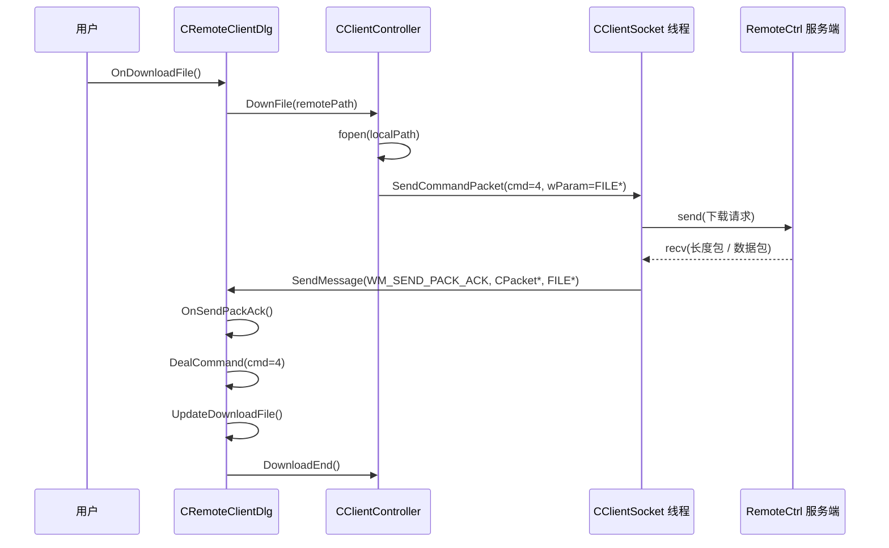

---
tags:
  - 项目/远控系统
heatmap_tracker: true
heatmap_group: 远控系统/6.网络与多线程问题
heatmap_weight: 1
git: "7278af3"
git_msg: "1 完善客户端代码 2 修复一个文件显示bug"
aliases:
  - 6.13 Client-side ACK dispatch consolidation and dialog-owned download state
---

# 6.13 客户端 ACK 分发收口与下载状态归属主对话框

> 基于提交 `7278af3ddbea3a061f2a20c6dbf1e503797c38fe`（2026-03-28）。  
> 这个提交延续了 [[6.12 文件树展示与下载缓冲区双 Bug 修复]] 之后的“消息驱动式清理”工作：控制器被进一步收缩为“命令发起 + 结束回调”，与文件相关的 ACK 处理被明确集中到 `CRemoteClientDlg` 中，同时通过移除一个过时的 UI 状态判断，修复了一个文件树显示 Bug。  
> 详细 Bug 记录见：[[Debug-024 目录节点无占位子项时文件列表无法刷新]]。

---

## 一眼看懂这次改了什么

|改动|代码位置|为什么重要|
|---|---|---|
|删除了控制器侧已经过时的下载辅助逻辑|`RemoteClient/ClientController.cpp/.h`|客户端不再在 controller 内部保留第二条“失效的下载消费路径”。控制器重新回到“发起者”角色，而不是第二个数据包消费者。|
|`OnSendPackAck` 被改造成一个轻量的入口与命令分发器|`RemoteClient/RemoteClientDlg.cpp`|数据包所有权在 ACK 入口处就被收口，后续再按命令交给具名 helper 处理，而不是塞在一个巨大 `switch` 里。|
|文件树刷新不再依赖“当前选中节点是否有子节点”|`CRemoteClientDlg::LoadFileInfo`|异步加载重新由协议驱动，而不是由树控件临时占位状态驱动。这正是本次提交里那个具体的文件显示 Bug 修复点。|

---

## 这篇笔记和 [[6.12 文件树展示与下载缓冲区双 Bug 修复]] 的关系

`6.12` 主要修的是现有异步文件链路里的“正确性问题”：缓冲区移动、完成时机、ACK 错误信号、树展开等。  
`6.13` 则是下一步清理：它让“职责归属边界”变得更清楚。

|维度|在 `6.12` 中|在 `6.13` 中|
|---|---|---|
|下载路径|正确性问题已经修掉，但代码看起来仍然像是“旧 controller 思路”和“新 dialog 侧 ACK 处理”混在一起|dialog 现在成了文件 ACK 分发的可见中心，旧的 controller 侧下载辅助代码被移除|
|ACK 处理器形态|主对话框里仍有一个很大的内联 `switch` 主体|`OnSendPackAck` 变成窄入口，后续由 `DealCommand` + helper 方法接管|
|树刷新判断|异步加载逻辑里还残留一个基于 UI 结构假设的过时提前返回条件|过时的 `GetChildItem(...) == NULL` 判断被删掉，因此合法刷新请求不再被误拦截|

所以，对这次提交更准确的定位是：

> **它没有发明一个新的传输模型；它只是让现有的消息驱动模型更容易跟踪，也更不容易被过时的 UI 假设卡住。**

---

## 先看主链路

对于文件下载，现在“线程分工”和“职责分工”更容易看清了：

1. UI 线程在 `OnDownloadFile()` 中收集选中的远程路径。
    
2. `CClientController::DownFile()` 打开本地文件，并发送 `cmd=4`，同时把 `FILE*` 作为回调上下文传出去。
    
3. socket 线程执行 `send/recv`，并通过 `SendMessage(WM_SEND_PACK_ACK, ...)` 把每个 ACK 包回传到目标窗口。
    
4. `CRemoteClientDlg::OnSendPackAck()` 会立刻复制并删除堆上的 `CPacket`，然后根据 `sCmd` 把包路由给对应处理逻辑。
    
5. `UpdateDownloadFile()` 把载荷写入磁盘，并决定传输是否结束。
    
6. `CClientController::DownloadEnd()` 负责最终的 UI 完成动作。
    

这意味着当前的多线程模型是：

- **socket 线程**：传输与数据包投递
    
- **主对话框线程**：文件树更新、下载状态更新、完成 UI
    
- **controller**：命令发起、最小生命周期胶水层
    



这里最关键的不只是“包到了”，而是：

> **这个包现在是在一个明显的 UI 侧入口里被消费掉的，而不是在脑子里被拆成“dialog 代码 + 老 controller 兜底代码”两条路径去理解。**

---

## 职责对比

<svg xmlns="http://www.w3.org/2000/svg" viewBox="0 0 1120 600" role="img" aria-labelledby="duty-compare-title duty-compare-desc" style="display:block; width:100%; max-width:1120px; height:auto; margin:0 auto;">
  <title id="duty-compare-title">职责对比</title>
  <desc id="duty-compare-desc">对比这次提交前后，controller、主对话框 ACK 处理入口，以及文件树刷新职责的收敛方式。</desc>
  <defs>
    <marker id="arrow-old" viewBox="0 0 10 10" refX="5" refY="5" markerWidth="8" markerHeight="8" orient="auto-start-reverse">
      <path d="M 0 0 L 10 5 L 0 10 z" fill="#B45309" />
    </marker>
    <marker id="arrow-new" viewBox="0 0 10 10" refX="5" refY="5" markerWidth="8" markerHeight="8" orient="auto-start-reverse">
      <path d="M 0 0 L 10 5 L 0 10 z" fill="#1D4ED8" />
    </marker>
    <style>
      .panel-title {
        font: 700 26px "Microsoft YaHei", "PingFang SC", "Noto Sans CJK SC", sans-serif;
        fill: #111827;
      }
      .card-text {
        font: 600 22px "Microsoft YaHei", "PingFang SC", "Noto Sans CJK SC", sans-serif;
        fill: #111827;
      }
      .panel-note {
        font: 500 18px "Microsoft YaHei", "PingFang SC", "Noto Sans CJK SC", sans-serif;
        fill: #4B5563;
      }
    </style>
  </defs>

  <rect x="30" y="30" width="500" height="540" rx="26" fill="#FFF7ED" stroke="#F59E0B" stroke-width="3" />
  <text x="280" y="78" text-anchor="middle" class="panel-title">这次提交前</text>
  <text x="280" y="108" text-anchor="middle" class="panel-note">职责仍有重叠，UI 状态会影响网络刷新</text>

  <rect x="90" y="140" width="380" height="76" rx="18" fill="#FFFFFF" stroke="#FDBA74" stroke-width="2.5" />
  <text x="280" y="171" text-anchor="middle" class="card-text">
    <tspan x="280" dy="0">Controller 仍保留</tspan>
    <tspan x="280" dy="28">旧下载 helper</tspan>
  </text>

  <line x1="280" y1="216" x2="280" y2="252" stroke="#B45309" stroke-width="4" marker-end="url(#arrow-old)" />

  <rect x="90" y="264" width="380" height="76" rx="18" fill="#FFFFFF" stroke="#FDBA74" stroke-width="2.5" />
  <text x="280" y="295" text-anchor="middle" class="card-text">
    <tspan x="280" dy="0">主对话框也塞着</tspan>
    <tspan x="280" dy="28">一个大 ACK switch</tspan>
  </text>

  <line x1="280" y1="340" x2="280" y2="376" stroke="#B45309" stroke-width="4" marker-end="url(#arrow-old)" />

  <rect x="90" y="388" width="380" height="76" rx="18" fill="#FFFFFF" stroke="#FDBA74" stroke-width="2.5" />
  <text x="280" y="419" text-anchor="middle" class="card-text">
    <tspan x="280" dy="0">树刷新受</tspan>
    <tspan x="280" dy="28">是否存在子节点限制</tspan>
  </text>

  <rect x="590" y="30" width="500" height="540" rx="26" fill="#EFF6FF" stroke="#3B82F6" stroke-width="3" />
  <text x="840" y="78" text-anchor="middle" class="panel-title">这次提交后</text>
  <text x="840" y="108" text-anchor="middle" class="panel-note">命令发起、ACK 收口、文件刷新边界更清楚</text>

  <rect x="650" y="130" width="380" height="72" rx="18" fill="#FFFFFF" stroke="#93C5FD" stroke-width="2.5" />
  <text x="840" y="160" text-anchor="middle" class="card-text">
    <tspan x="840" dy="0">Controller 负责发起 cmd=4</tspan>
    <tspan x="840" dy="28">与收尾 UI</tspan>
  </text>

  <line x1="840" y1="202" x2="840" y2="232" stroke="#1D4ED8" stroke-width="4" marker-end="url(#arrow-new)" />

  <rect x="650" y="244" width="380" height="72" rx="18" fill="#FFFFFF" stroke="#93C5FD" stroke-width="2.5" />
  <text x="840" y="274" text-anchor="middle" class="card-text">
    <tspan x="840" dy="0">主对话框拥有 ACK 入口</tspan>
    <tspan x="840" dy="28">与命令分发</tspan>
  </text>

  <line x1="840" y1="316" x2="840" y2="346" stroke="#1D4ED8" stroke-width="4" marker-end="url(#arrow-new)" />

  <rect x="650" y="358" width="380" height="72" rx="18" fill="#FFFFFF" stroke="#93C5FD" stroke-width="2.5" />
  <text x="840" y="388" text-anchor="middle" class="card-text">
    <tspan x="840" dy="0">文件 / 树处理拆成</tspan>
    <tspan x="840" dy="28">具名 helper</tspan>
  </text>

  <line x1="840" y1="430" x2="840" y2="460" stroke="#1D4ED8" stroke-width="4" marker-end="url(#arrow-new)" />

  <rect x="650" y="472" width="380" height="72" rx="18" fill="#FFFFFF" stroke="#93C5FD" stroke-width="2.5" />
  <text x="840" y="502" text-anchor="middle" class="card-text">
    <tspan x="840" dy="0">LoadFileInfo 总是发出</tspan>
    <tspan x="840" dy="28">合法刷新请求</tspan>
  </text>
</svg>


这也是为什么，虽然 diff 看上去大多发生在客户端侧，这个提交仍然属于“网络与多线程”章节：

- 它澄清了哪个线程发、哪个线程收、哪个线程做 UI 收尾。
    
- 它收窄了 controller 的职责。
    
- 它避免了 UI 控件结构意外阻断网络刷新路径。
    

---

## 核心实现

### 1. controller 被收缩为“发起 + 结束钩子”

现在 `RemoteClient/ClientController.cpp` 在文件下载上的形态清爽了很多：

- `SendCommandPacket` 只负责封包并转发命令。
    
- `DownFile` 打开本地文件、发送 `cmd=4`、并更新状态 UI。
    
- `DownloadEnd` 负责最终的完成 UI 动作。
    
- 旧的 `threadDownloadFile`、`threadDownloadEntry`、`SendMessage(MSG)`、`m_hThreadDownload` 成员都被移除了。
    

最重要的一行并不复杂，真正关键的是它隐藏的所有权决策：

```cpp
FILE* pFile = fopen(m_strLocal, "wb+");
SendCommandPacket(m_remoteDlg, 4, false,
    (BYTE*)(LPCSTR)m_strRemote, m_strRemote.GetLength(), (WPARAM)pFile);
```

这里的 `FILE*` 不是作为“文件数据”发送出去的，而是作为**回调上下文**发送。之后 socket 线程会通过 `lParam` 把这个同一个指针再带回目标窗口，于是 dialog 侧 ACK 处理函数就知道该把字节写到哪里去。

这是一种很有价值的设计清理，因为 controller 不再假装自己也是那个“应该消费每个下载数据包”的地方。

### 2. `OnSendPackAck` 成为主对话框文件命令的单一 ACK 入口

新的 `OnSendPackAck` 刻意写得很短：

```cpp
CPacket head = *(CPacket*)wParam;
delete (CPacket*)wParam;
DealCommand(head.sCmd, head.strData, lParam);
```

这个小改动重要在三点：

1. **所有权在入口处立刻收口。**  
    堆上的 `CPacket*` 一进来就先拷贝到栈对象，再马上删除。这延续了 [[6.11 远程显示链路收口：回调渲染、请求节流与失败清理]] 中已经强调过的所有权思路。
    
2. **分发从“函数体混装”变成“按命令分发”。**  
    `OnSendPackAck` 不再是每条命令实现都搅在一起的地方。
    
3. **回调上下文原样保留。**  
    `lParam` 仍然携带请求发出时附带的额外对象，比如下载时的 `FILE*`，或文件树插入时的 `HTREEITEM`。
    

这让 ACK 路径更容易审计：包进来，所有权收口，命令分发开始。

### 3. `DealCommand` 和 helper 方法终于把命令所有权显式化了

`RemoteClientDlg.h` 新增了这些 helper：

- `DealCommand`
    
- `InitUIData`
    
- `Str2Tree`
    
- `UpdateFileInfo`
    
- `UpdateDownloadFile`
    

这样的拆分是有价值的，因为每个 helper 现在都明确对应一个 UI 侧含义：

|Helper|作用|
|---|---|
|`Str2Tree`|把 `cmd=1` 的返回数据构造成驱动器树|
|`UpdateFileInfo`|把一条 `FILEINFO` 数据插入到 `cmd=2` 对应的树/列表中|
|`UpdateDownloadFile`|维护 `cmd=4` 的下载进度与完成状态|
|`InitUIData`|抽离启动时的 UI 和地址初始化|

注意，主对话框分发器里 `case 5` 和 `case 6` 是空的。这不是随手留空，而是在更清楚地表达当前的命令归属：

- 屏幕监控包属于 `CWatchDialog`
    
- 文件和树相关包属于 `CRemoteClientDlg`
    

所以，即使是空分支，也在帮助文档化当前消息图谱。

### 4. `UpdateDownloadFile` 把数据路径牢牢留在 dialog 侧

`UpdateDownloadFile()` 现在明确拥有逐包下载状态：

- 第一个包：读取总长度
    
- 中间包：`fwrite` 载荷，并增加 `index`
    
- 完成：关闭文件、重置状态、调用 `DownloadEnd`
    

这意味着“活跃下载状态”不再概念性地藏在某个旧的 controller worker 里；它就在 ACK 实际落地的地方。

不过这里仍有一个重要限制：

> `length` 和 `index` 是 `static` 局部变量，因此当前实现仍然默认**同一时刻只有一个活跃下载状态机**。

对于当前客户端行为，这个限制是可以接受的，但如果未来要支持并行下载，就必须记住这一点。

### 5. 文件显示 Bug 的修复：删掉错误的提前返回判断

这次提交里那个具体的 Bug 修复，虽然很小，但非常有代表性：

```cpp
if (hTreeSelected == NULL)
    return;

// removed:
// if (m_Tree.GetChildItem(hTreeSelected) == NULL)
//     return;
```

旧判断把“当前选中节点没有子项”错误地当成了“这个节点不应该发起文件信息请求”。在异步模型里，这个假设是错的。

一个选中节点之所以临时没有子项，可能是因为：

- 它本来就是一个合法的叶子目录
    
- 它旧的占位子项/子节点刚刚在刷新前被删掉
    
- 下一轮异步插入还没有发生
    

在这三种情况下，`cmd=2` 依然是一个合法请求。是否有目录内容，应该由网络层/协议来决定，而不是由当前树控件的瞬时形状来决定。

这也就是为什么，这个修复在概念上和 [[Debug-009 树控件未设置选中状态导致路径错误]]、[[Debug-022 文件树目录节点插入后未自动展开]] 属于同一类问题：根因依然是误解了树控件 API “告诉了你什么”，以及“没有告诉你什么”。

完整调试叙事见：[[Debug-024 目录节点无占位子项时文件列表无法刷新]]。

---

## 当前版本结论

### 已经改善的地方

- 主对话框中的文件/树 ACK 处理现在更容易读懂。
    
- controller 不再保留暗示“第二条包消费路径”的失效下载 worker 代码。
    
- ACK 入口处的包所有权再次变得明确：先拷贝、立刻删除、再分发。
    
- 文件树刷新不再被临时性的“占位子项状态”卡住。
    

### 还没有彻底收口的地方

- `CClientSocket::SendPack()` 仍然通过同步 `SendMessage` 回 ACK，因此 socket 线程会一直阻塞到 UI 处理器返回为止。
    
- `UpdateDownloadFile()` 仍使用 `static` 状态，这天然限制为一次只能跑一个活跃下载流程。
    
- `CClientController::threadFunc()` 里仍保留着 `WM_SEND_MESSAGE` 的遗留分支，尽管这次提交已经删掉了客户端侧可见的那层 wrapper。
    

所以，对当前版本更准确的状态描述是：

> **这里并没有从根本上重设计消息驱动客户端路径；它只是被清理到了一个足够清楚的程度，使得真实的线程边界和 ACK 所有权终于更容易看明白了。**

---

## 这里真正涉及的 Win32 / Winsock / MFC 机制

### 1. `PostThreadMessage` 仍然是进入 socket 线程的异步交接方式

在 `CClientSocket::SendPacket` 中，命令会被包装成 `PACKET_DATA` 并投递到 worker 线程队列。

|项目|在本项目中的含义|
|---|---|
|`wParam`|`PACKET_DATA*`，成功 post 后由 socket 线程接管所有权|
|`lParam`|目标 `HWND`，后面应接收 `WM_SEND_PACK_ACK` 的窗口|
|返回值|请求是否真的进入了 socket 线程队列|

这和 [[6.5 重构网络模块（线程事件机制→消息机制）]] 里引入的那条消息驱动网络方向是同一条主线。

### 2. `SendMessage(WM_SEND_PACK_ACK, ...)` 是同步返回 UI 的 ACK 路径

在 `CClientSocket::SendPack` 里，每个解码后的数据包都是这样返回的：

```cpp
::SendMessage(hWnd, WM_SEND_PACK_ACK, (WPARAM)new CPacket(pack), data.wParam);
```

这意味着：

- ACK 侧的 `wParam` 拥有一个堆上的 `CPacket*`
    
- `lParam` 是请求发起时附带的原始上下文对象，比如 `FILE*` 或 `HTREEITEM`
    
- socket 线程会一直等到 UI 窗口处理完这条消息才继续
    

为什么这里用 `SendMessage` 而不是 `PostMessage`？

- 它让回调路径是即时的，也更容易推理。
    
- 它保证 ACK 接收方处理结束后，worker 线程才继续往下跑。
    
- 但代价是：如果 UI 处理器慢，worker 线程也会被拖住。
    

这个权衡对当前这种教学/演示阶段的架构是可以接受的，但如果以后 UI 侧处理越来越重，它就会成为下一个很明显的压力点。

### 3. 树控件结构是“视图状态”，不是“协议真相”

这次提交很好地提醒了一点：MFC 树控件 API 暴露的是**当前控件结构**，不是远程文件系统的真相。

- `HitTest` 告诉你鼠标指到了哪个可视项
    
- `SelectItem` 改变选中状态
    
- `GetChildItem` 只告诉你当前控件里**此刻**是否存在子节点
    

它**并不能**证明远程目录是否应该被查询。

---

## 相关笔记

- [[6.5 重构网络模块（线程事件机制→消息机制）]]
    
- [[6.11 远程显示链路收口：回调渲染、请求节流与失败清理]]
    
- [[6.12 文件树展示与下载缓冲区双 Bug 修复]]
    
- [[Debug-009 树控件未设置选中状态导致路径错误]]
    
- [[Debug-022 文件树目录节点插入后未自动展开]]
    
- [[Debug-024 目录节点无占位子项时文件列表无法刷新]]
    

---

## 代码索引

|功能|文件|位置|
|---|---|---|
|命令发起|`RemoteClient/ClientController.cpp`|`SendCommandPacket` (72-76)|
|下载开始 + UI 启动|`RemoteClient/ClientController.cpp`|`DownFile` (87-109)|
|下载完成钩子|`RemoteClient/ClientController.cpp`|`DownloadEnd` (80-84)|
|helper 声明|`RemoteClient/RemoteClientDlg.h`|32-37 行|
|命令分发器|`RemoteClient/RemoteClientDlg.cpp`|`DealCommand` (199-233)|
|启动 UI 初始化|`RemoteClient/RemoteClientDlg.cpp`|`InitUIData` (235-248)|
|下载包状态处理|`RemoteClient/RemoteClientDlg.cpp`|`UpdateDownloadFile` (323-357)|
|文件树刷新入口|`RemoteClient/RemoteClientDlg.cpp`|`LoadFileInfo` (359-380)|
|下载命令入口|`RemoteClient/RemoteClientDlg.cpp`|`OnDownloadFile` (442-454)|
|ACK 入口|`RemoteClient/RemoteClientDlg.cpp`|`OnSendPackAck` (520-541)|
|worker 线程 send/ACK 桥接|`RemoteClient/CClientSocket.cpp`|`SendPacket` (129-139), `SendPack` (285-341)|

---

## 更新记录

|日期|变更|
|---|---|
|2026-03-28|初版：基于提交 `7278af3ddbea3a061f2a20c6dbf1e503797c38fe`，聚焦客户端 ACK 分发清理、下载状态归属主对话框，以及文件树刷新 Bug 修复|

如果你愿意，我下一条可以继续帮你把这篇翻译**再润色成更像你自己笔记风格的中文版本**，比如改成更短句、更像技术复盘。
