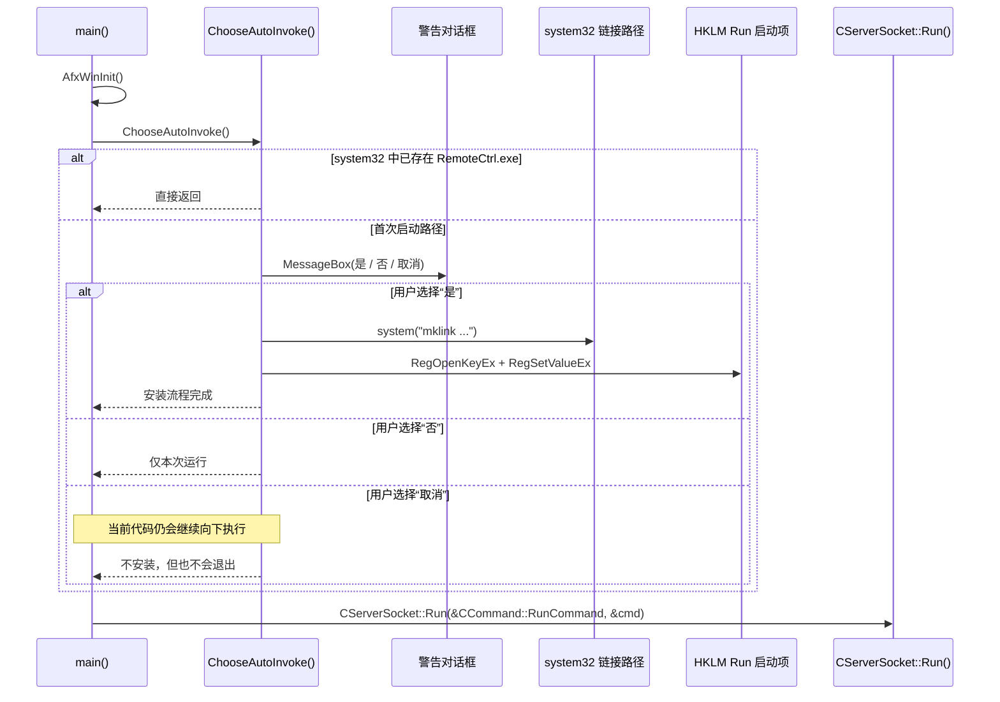

---
tags:
  - 项目/远控系统
  - Windows/UAC
  - Windows/注册表
heatmap_tracker: true
heatmap_group: 远控系统/6.网络与多线程问题
heatmap_weight: 1
git: c49dfbc
git_msg: "1.追加启动权限请求 / 2.完成了开机启动的功能"
aliases:
  - 启动权限请求与开机自启引导
  - Startup privilege prompt and auto-start bootstrap
  - 启动引导与注册表自启动
---

# 6.14 启动权限请求与开机自启

> 基于提交 `c49dfbcc3fd94f91d30bb6a7e628ca0ef5950e41`（2026-03-31）整理。
> 这个提交并没有直接改动数据包格式，也没有直接重构工作线程分发模型。它真正改变的是更靠前的生命周期阶段：在 `CServerSocket::Run()` 启动远控服务之前，程序先插入了一段与权限相关的引导逻辑，用来决定是否安装开机自启路径。

> [!note]
> 这篇笔记更适合从**服务可用性与启动引导**的角度来理解，而不是把它当成一篇纯粹的 socket 协议笔记。网络层当然仍然重要，但在新的执行路径下，只有当前置引导流程结束后，网络线程、socket 循环以及命令处理逻辑才有机会真正启动。

---

## 这次提交到底改了什么

| 改动 | 代码落点 | 实际含义 |
|------|------|------|
| 新增了 `ChooseAutoInvoke()` 函数 | `RemoteCtrl.cpp:20-69` | 服务在进入 socket 运行时之前，先多了一步“首次启动决策” |
| `main()` 现在会先调用 `ChooseAutoInvoke()`，再调用 `CServerSocket::Run()` | `RemoteCtrl.cpp:88-90` | 服务启动不再是直接跳进网络层，而是变成了一个带前置条件的启动链路 |
| 程序可能创建 `system32` 路径并写入 `HKLM\...\Run` 启动项 | `mklink`、`RegOpenKeyEx`、`RegSetValueEx` | 项目开始从“手工运行一次”转向“用户登录后可常驻自启” |
| 工程配置显式加入了 UAC 执行级别 | `RemoteCtrl.vcxproj:118-123`、`136-141` | 持久化方案正式和权限等级绑定，尤其是 `Release x64` |
| `Debug x64` 改为静态 MFC，而 `Release x64` 仍然是动态 MFC | `RemoteCtrl.vcxproj:44-57` | 作者在尝试降低启动环境依赖，但当前打包策略还没有完全统一 |

---

## 它和上一版是什么关系

> 在这个提交之前，服务端的启动路径很直接：初始化 MFC，创建 `CCommand`，启动 `CServerSocket`，然后等待网络任务到来。

| 维度 | `c49dfbc` 之前 | `c49dfbc` 之后 |
|------|------|------|
| 进程入口链路 | `AfxWinInit -> CServerSocket::Run()` | `AfxWinInit -> ChooseAutoInvoke() -> CServerSocket::Run()` |
| 持久化模型 | 只能手工启动 | 可选地通过 `HKLM\Software\Microsoft\Windows\CurrentVersion\Run` 开机自启 |
| 权限模型 | 没有显式的启动安装步骤 | `Debug x64` 为 `AsInvoker`，`Release x64` 请求 `RequireAdministrator` |
| 部署假设 | 只要求 EXE 当下能跑起来 | EXE 可能需要跨重启存活，并从稳定路径启动 |
| 网络启动前提 | MFC 初始化成功后立刻启动网络栈 | 只有前置引导决策完成后，网络栈才会启动 |

这次最重要的变化，不是多了一个线程，也不是多了一个 socket，而是给后续所有网络与线程行为加上了一个新的**前置条件**：进程必须先决定自己要不要变成持久化进程，以及当前权限是否足以完成这件事。

---

## 先把整条启动链讲清楚

用更直白的话说，现在的启动流程是：

1. `main()` 先初始化 MFC。
2. 程序询问是否要为自己安装后续的开机自启能力。
3. 如果用户同意，就尝试准备 `C:\Windows\system32\RemoteCtrl.exe` 这个路径，并写入 `Run` 注册表启动项。
4. 只有这些步骤处理完之后，代码才会进入 `CServerSocket::Run()`，真正启动远控服务。

这意味着网络子系统在启动顺序上被整体往后推了一步。从运行时视角来看，服务端不再只是一个“网络循环”，而是一个**经过启动引导后的网络循环**。它能否及时进入可用状态，已经开始依赖安装状态、权限等级以及启动路径是否稳定。

### 时序图



### 新旧启动策略对比

这张对比图是静态结构图，使用 SVG 比 Mermaid 更方便控制排版和强调重点。

<svg viewBox="0 0 980 490" xmlns="http://www.w3.org/2000/svg" width="100%">
  <defs>
    <marker id="arrow" viewBox="0 0 10 10" refX="8" refY="5" markerWidth="5" markerHeight="5" orient="auto-start-reverse">
      <path d="M2 1L8 5L2 9" fill="none" stroke="#666" stroke-width="1.4" stroke-linecap="round"/>
    </marker>
  </defs>

  <text x="490" y="26" text-anchor="middle" font-size="18" font-weight="600" font-family="Segoe UI, Arial, sans-serif" fill="#2f2f2f">
    启动链路对比
  </text>

  <rect x="24" y="52" width="412" height="410" rx="14" fill="#fff4ec" stroke="#d97b34" stroke-width="1.5"/>
  <text x="225" y="72" text-anchor="middle" font-size="17" font-weight="600" font-family="Segoe UI, Arial, sans-serif" fill="#8a4312">
    c49dfbc 之前
  </text>

  <rect x="105" y="138" width="240" height="40" rx="8" fill="#ffffff" stroke="#c66c2b" stroke-width="1.2"/>
  <text x="225" y="163" text-anchor="middle" font-size="13" font-family="Segoe UI, Arial, sans-serif" fill="#333">AfxWinInit</text>

  <rect x="105" y="208" width="240" height="40" rx="8" fill="#ffffff" stroke="#c66c2b" stroke-width="1.2"/>
  <text x="225" y="233" text-anchor="middle" font-size="13" font-family="Segoe UI, Arial, sans-serif" fill="#333">创建 CCommand</text>

  <rect x="105" y="278" width="240" height="40" rx="8" fill="#ffffff" stroke="#c66c2b" stroke-width="1.2"/>
  <text x="225" y="303" text-anchor="middle" font-size="13" font-family="Segoe UI, Arial, sans-serif" fill="#333">CServerSocket::Run</text>

  <rect x="105" y="348" width="240" height="40" rx="8" fill="#ffffff" stroke="#c66c2b" stroke-width="1.2"/>
  <text x="225" y="373" text-anchor="middle" font-size="13" font-family="Segoe UI, Arial, sans-serif" fill="#333">网络运行时启动</text>

  <line x1="225" y1="178" x2="225" y2="208" stroke="#666" stroke-width="1.4" marker-end="url(#arrow)"/>
  <line x1="225" y1="248" x2="225" y2="278" stroke="#666" stroke-width="1.4" marker-end="url(#arrow)"/>
  <line x1="225" y1="318" x2="225" y2="348" stroke="#666" stroke-width="1.4" marker-end="url(#arrow)"/>

  <rect x="544" y="52" width="412" height="410" rx="14" fill="#eef8f1" stroke="#3a8a57" stroke-width="1.5"/>
  <text x="750" y="72" text-anchor="middle" font-size="17" font-weight="600" font-family="Segoe UI, Arial, sans-serif" fill="#23663e">
    c49dfbc 之后
  </text>

  <rect x="628" y="90" width="244" height="38" rx="8" fill="#ffffff" stroke="#459562" stroke-width="1.2"/>
  <text x="750" y="114" text-anchor="middle" font-size="13" font-family="Segoe UI, Arial, sans-serif" fill="#333">AfxWinInit</text>

  <rect x="628" y="150" width="244" height="38" rx="8" fill="#ffffff" stroke="#459562" stroke-width="1.2"/>
  <text x="750" y="174" text-anchor="middle" font-size="13" font-family="Segoe UI, Arial, sans-serif" fill="#333">创建 CCommand</text>

  <rect x="628" y="210" width="244" height="38" rx="8" fill="#ffffff" stroke="#459562" stroke-width="1.2"/>
  <text x="750" y="234" text-anchor="middle" font-size="13" font-family="Segoe UI, Arial, sans-serif" fill="#333">ChooseAutoInvoke</text>

  <polygon points="750,270 805,305 750,340 695,305" fill="#ffffff" stroke="#459562" stroke-width="1.2"/>
  <text x="750" y="300" text-anchor="middle" font-size="12" font-family="Segoe UI, Arial, sans-serif" fill="#333">已完成</text>
  <text x="750" y="316" text-anchor="middle" font-size="12" font-family="Segoe UI, Arial, sans-serif" fill="#333">安装？</text>

  <rect x="580" y="340" width="110" height="34" rx="7" fill="#ffffff" stroke="#459562" stroke-width="1.2"/>
  <text x="635" y="362" text-anchor="middle" font-size="12" font-family="Segoe UI, Arial, sans-serif" fill="#333">跳过安装</text>

  <rect x="820" y="288" width="120" height="34" rx="7" fill="#ffffff" stroke="#459562" stroke-width="1.2"/>
  <text x="880" y="310" text-anchor="middle" font-size="11" font-family="Segoe UI, Arial, sans-serif" fill="#333">询问用户策略</text>

  <rect x="820" y="355" width="120" height="34" rx="7" fill="#ffffff" stroke="#459562" stroke-width="1.2"/>
  <text x="880" y="377" text-anchor="middle" font-size="11" font-family="Segoe UI, Arial, sans-serif" fill="#333">mklink + HKLM Run</text>

  <rect x="610" y="415" width="280" height="34" rx="7" fill="#ffffff" stroke="#459562" stroke-width="1.2"/>
  <text x="750" y="437" text-anchor="middle" font-size="12.5" font-family="Segoe UI, Arial, sans-serif" fill="#333">CServerSocket::Run -> 网络运行时启动</text>

  <line x1="750" y1="128" x2="750" y2="150" stroke="#666" stroke-width="1.4" marker-end="url(#arrow)"/>
  <line x1="750" y1="188" x2="750" y2="210" stroke="#666" stroke-width="1.4" marker-end="url(#arrow)"/>
  <line x1="750" y1="248" x2="750" y2="270" stroke="#666" stroke-width="1.4" marker-end="url(#arrow)"/>

  <polyline points="695,305 635,305 635,340" fill="none" stroke="#666" stroke-width="1.4" marker-end="url(#arrow)"/>
  <text x="665" y="298" text-anchor="middle" font-size="11" font-family="Segoe UI, Arial, sans-serif" fill="#4c4c4c">是</text>

  <line x1="805" y1="305" x2="820" y2="305" stroke="#666" stroke-width="1.4" marker-end="url(#arrow)"/>
  <text x="812" y="298" text-anchor="middle" font-size="11" font-family="Segoe UI, Arial, sans-serif" fill="#4c4c4c">否</text>

  <line x1="880" y1="322" x2="880" y2="355" stroke="#666" stroke-width="1.4" marker-end="url(#arrow)"/>
  <text x="885" y="342" text-anchor="start" font-size="10.5" font-family="Segoe UI, Arial, sans-serif" fill="#4c4c4c">同意</text>

  <polyline points="840,322 840,390 750,390 750,415" fill="none" stroke="#666" stroke-width="1.4" marker-end="url(#arrow)"/>
  <text x="835" y="345" text-anchor="end" font-size="10.5" font-family="Segoe UI, Arial, sans-serif" fill="#4c4c4c">拒绝 / 取消</text>

  <polyline points="635,374 635,400 740,400 740,415" fill="none" stroke="#666" stroke-width="1.4" marker-end="url(#arrow)"/>

  <polyline points="880,389 880,408 760,408 760,415" fill="none" stroke="#666" stroke-width="1.4" marker-end="url(#arrow)"/>
</svg>

#### 这张图该怎么读

左侧面板展示的是**旧版启动路径**，它是一条非常直接的直线：

1. `AfxWinInit` 初始化 MFC 运行时。
2. `Create CCommand` 创建命令处理对象。
3. `CServerSocket::Run` 启动服务端运行时。
4. 网络循环立刻进入活动状态。

旧版本里没有任何“安装决策”步骤。只要初始化成功，代码就会直接进入服务端运行时。

右侧面板展示的是提交 `c49dfbc` 之后的**新版启动路径**。

1. 程序依然从 `AfxWinInit` 和 `Create CCommand` 开始。
2. 但在进入 `CServerSocket::Run` 之前，会先调用 `ChooseAutoInvoke`。
3. `ChooseAutoInvoke` 先判断一个状态问题：**开机自启路径是否已经安装完成？**
4. 如果答案是**是**，程序就走“跳过安装”分支，继续进入服务端运行时。
5. 如果答案是**否**，程序就进入“询问用户策略”这一步。
6. 在“询问用户策略”这一步，用户需要决定程序是否应该安装开机自启能力。
7. 如果用户选择**是**，代码就会执行 `mklink + HKLM Run`，也就是尝试准备稳定的可执行文件路径，并写入注册表自启项。
8. 如果用户选择**否 / 取消**，就会跳过安装步骤。
9. 无论哪个分支，最后都会汇合到 `CServerSocket::Run -> 网络运行时启动`。

所以这张图真正想表达的是：这个提交**并没有替换服务端运行时本身**，而是在它前面插入了一层**启动引导决策层**。网络还是在同一个位置启动，但它现在必须在持久化与权限路径检查完成之后，才会真正开始。

这里还有一个很容易看漏的细节：菱形判断节点旁边的“是”，**不是用户点击了“是”按钮**，而是表示**“程序已经安装好了”**。用户真正做出选择的分支，是后面那一步“询问用户策略”。

这也正是它应该放在第 6 章的原因。虽然这段代码不是 socket 线程模型的重构，但它确实改变了网络子系统的**生命周期边界**：只有启动策略分支执行完，网络运行时才允许启动。

这一节真正想强调的是：服务端运行时现在被一层启动策略步骤“卡住”了。所以它虽然没有新增线程，却依然属于“网络与多线程问题”这一章，因为它改动的是整个网络子系统何时进入可运行状态的边界。

---

## 核心实现

### 1. `main()` 变成了一条带前置条件的启动链

> 文件：`RemoteCtrl/RemoteCtrl/RemoteCtrl.cpp`  
> 函数：`main`  
> 当前行号：`71-114`

`main()` 里的实际代码改动其实很小，但它改变了整个启动契约：

```cpp
CCommand cmd;
ChooseAutoInvoke();
int ret = CServerSocket::getInstance()->Run(&CCommand::RunCommand, &cmd);
```

在这个提交之前，`main()` 在 `AfxWinInit()` 之后几乎立刻就会进入网络服务。现在则是在服务真正启动之前，插入了一步策略判断。

这很关键，因为 `CServerSocket::Run()` 才是远控运行时真正“活起来”的地方。一旦代码走到这里，程序就可以开始接收数据包、分发命令，并继续依赖后续的网络与线程基础设施。新增的 `ChooseAutoInvoke()` 则意味着，服务端在进入这个状态之前，必须先处理一个部署层面的问题：这个进程只是普通地运行一次，还是要尝试变成一个能够跨重启长期存在的常驻进程？

### 2. `ChooseAutoInvoke()` 定义了首次启动策略

> 文件：`RemoteCtrl/RemoteCtrl/RemoteCtrl.cpp`  
> 函数：`ChooseAutoInvoke`  
> 当前行号：`20-69`

这个函数一开始会先检查 `C:\Windows\system32\RemoteCtrl.exe` 是否已经存在：

```cpp
CString strPath = CString(_T("C:\\Windows\\system32\\RemoteCtrl.exe"));
if (PathFileExists(strPath))
{
    return;
}
```

这让整个引导路径在一个很粗粒度的层面上具备了幂等性。只要这个目标路径已经存在，函数就什么都不做，程序继续进入网络服务。

如果这个路径不存在，代码就会弹出警告对话框，并向用户解释三个选项：

- “是”：安装开机自启
- “否”：只运行这一次
- “取消”：退出程序

安装路径的核心实现如下：

```cpp
GetCurrentDirectoryA(MAX_PATH, sPath);
GetSystemDirectoryA(sSys, sizeof(sSys));
std::string strCmd = "mklink " + std::string(sSys) + strExe + std::string(sPath) + strExe;
ret = system(strCmd.c_str());

ret = RegOpenKeyEx(HKEY_LOCAL_MACHINE, strSubKey, 0, KEY_ALL_ACCESS | KEY_WOW64_64KEY, &hKey);
ret = RegSetValueEx(hKey, _T("RemoteCtrl"), 0, REG_EXPAND_SZ,
    (BYTE*)(LPCTSTR)strPath,
    strPath.GetLength() * sizeof(TCHAR));
```

这里有两个很重要的实现决策。

第一，程序**并不是**直接把当前 EXE 路径写进注册表，而是先尝试在 `system32` 下构造一个稳定路径，再把这个稳定路径写入 `Run` 启动项。也就是说，作者想要的其实不是“从当前目录直接自启”，而是一个更不依赖当前工作目录的固定启动位置。

第二，程序选择的是 `Run` 注册表启动机制，而不是把服务端改造成 Windows Service。这两者差别很大：

| 机制 | 含义 |
|------|------|
| `HKLM\...\Run` | 用户登录后启动 |
| Windows Service | 由 SCM 管理的系统服务启动，不依赖普通桌面会话 |

所以这个提交实现的**并不是真正意义上的系统服务开机启动**，而是一种**登录时自动启动**的方案。

### 3. 工程配置本身就是功能的一部分，不只是“打包噪音”

> 文件：`RemoteCtrl/RemoteCtrl/RemoteCtrl.vcxproj`  
> 相关行号：`44-57`、`118-123`、`136-141`

如果只盯着 `RemoteCtrl.cpp` 看，这个功能其实是不完整的，因为工程文件里的改动，才解释了新启动流程背后的权限模型。

```xml
<UseOfMfc>Static</UseOfMfc>
...
<UACExecutionLevel>AsInvoker</UACExecutionLevel>
...
<UACExecutionLevel>RequireAdministrator</UACExecutionLevel>
```

它表达的含义是：

- `Debug|x64` 现在静态链接 MFC，并以 `AsInvoker` 运行
- `Release|x64` 会请求 `RequireAdministrator`

这个自启安装路径之所以需要提升权限，是因为它同时操作了 `system32` 和 `HKEY_LOCAL_MACHINE`。因此，`Release` 清单里加入提权要求并不是无关紧要的附带修改，而是这条启动路径能否成功执行的关键前提。没有提权，`RegOpenKeyEx(HKLM, ...)` 和 `mklink` 基本都很可能失败。

这里也正好把“网络”这个角度拉回来了。一个希望在重启后依然可访问的远控服务，只有在预期的权限环境和依赖环境下**稳定启动**，才有实际意义。因此，`.vcxproj` 里的这部分改动，本质上也是运行时设计的一部分，而不只是构建配置微调。

---

## 为什么它属于“网络与多线程问题”这一章

乍一看，这个提交更像是一篇 Windows 部署笔记，而不是网络或线程笔记。但第 6 章真正关心的，其实是**运行时稳健性**：远控进程如何启动、如何活下来、以及它怎样走到网络、消息和线程机制真正开始工作的那一刻。

这个提交把那个边界改了三件事：

- 在进程启动时插入了一个网络之前的阻塞步骤。
- 改变了服务端运行时所依赖的权限假设。
- 尝试把服务从“手工启动”推进为“可持久常驻”的模型。

所以，第 6 章后面所有线程模型的调整，都仍然建立在一个更早的事实上：**进程必须先正确启动，线程才有机会处理网络任务。**

---

## 当前版本里，哪些地方做对了，哪些地方还没收尾

### 这个提交做对了什么

- 它把启动策略显式写进了代码，而不是把持久化完全丢给外部人工配置。
- 它把安装决策放在 `CServerSocket::Run()` 之前，这让运行时顺序依然清晰、容易推理。
- 它使用了标准 Windows 自启机制 `HKLM\...\Run`，而不是再造一个自定义启动器。
- 它意识到了权限等级对这个功能的重要性，并在 `Release` 清单里体现了这一点。

### 还有哪些地方没有彻底闭环

- 对话框文案写的是**点击“取消”会退出程序**，但 `IDCANCEL` 分支实际上是空的。按当前代码看，“取消”并不会终止进程，而是直接回到 `main()`，服务照样继续启动。
- 对话框文案写的是程序会被**复制**，但实现用的是 `mklink`，这创建的是链接，不是拷贝真实文件。
- `RegSetValueEx()` 使用的是 `strPath.GetLength() * sizeof(TCHAR)`，没有把结尾的空字符算进去。更稳妥的写法应该是 `(strPath.GetLength() + 1) * sizeof(TCHAR)`。
- `mklink` 命令是用字符串直接拼出来的，而且路径没有加引号，因此对空格路径和 shell 行为都比较敏感。
- `Debug|x64` 已经切到了静态 MFC，但 `Release|x64` 仍然是动态 MFC。这意味着真正用于提权自启的那份构建，反而还不是最自包含的配置。

> 更准确地说，这个提交当前所处的阶段是：**项目已经有了“常驻服务启动引导”的第一版雏形，但还不是一个打磨完整、行为完全一致的启动子系统。**

---

## 这里涉及到的 Win32 / 平台机制

### `MessageBox`

```cpp
int MessageBox(
    HWND hWnd,
    LPCTSTR lpText,
    LPCTSTR lpCaption,
    UINT uType
);
```

在这个提交里，`MessageBox(..., MB_YESNOCANCEL | MB_ICONWARNING | MB_TOPMOST)` 是面向用户的策略闸门。它不是单纯的 UI 点缀，而是直接决定程序是否会在网络层启动之前尝试安装持久化能力。

### `RegOpenKeyEx` 与 `RegSetValueEx`

```cpp
LSTATUS RegOpenKeyEx(
    HKEY hKey,
    LPCTSTR lpSubKey,
    DWORD ulOptions,
    REGSAM samDesired,
    PHKEY phkResult
);

LSTATUS RegSetValueEx(
    HKEY hKey,
    LPCTSTR lpValueName,
    DWORD Reserved,
    DWORD dwType,
    const BYTE* lpData,
    DWORD cbData
);
```

这两个 API 才是“持久化”真正落地的地方。放到项目语境里看：

- `RegOpenKeyEx` 打开 `HKLM\Software\Microsoft\Windows\CurrentVersion\Run`
- `RegSetValueEx` 写入名为 `RemoteCtrl` 的启动命令

这里最值得强调的一点是：这不是数据包层面的工作，而是**平台生命周期层面的工作**。它决定的是，未来会话里这个基于数据包的服务端，能不能自动出现。

### UAC 执行级别

Manifest 里的这个设置决定了 Windows 如何启动进程：

- `AsInvoker`：以调用者当前令牌直接运行
- `RequireAdministrator`：启动前请求提权

在这个提交里，它和功能本身是强耦合的，因为无论写 `system32` 还是写 `HKLM`，都对权限非常敏感。

---

## 容易忽略的坑

> [!warning]
> 这个提交里最大的陷阱，并不是某个 C++ 语法细节，而是**功能宣称与实际控制流之间存在契约不一致**。

### 1. UI 文案和运行时行为没有完全对齐

```cpp
else if (ret == IDCANCEL)
{

}
```

警告框文案告诉用户，点击“取消”会退出程序；但实际上这个分支是空的。因此当前真实行为更接近于：

- “是” -> 安装持久化
- “否” -> 不安装，继续运行
- “取消” -> 也不安装，但同样继续运行

这不是“提示文字还没改”的小问题，而是功能契约层面的不一致。

### 2. 持久化能力依赖于打包假设

```xml
<UseOfMfc>Static</UseOfMfc>   <!-- Debug x64 -->
<UseOfMfc>Dynamic</UseOfMfc>  <!-- Release x64 -->
```

代码注释里已经显露出作者对 DLL 和环境变量问题的担忧，但 `Release x64` 仍然使用动态 MFC。也就是说，功能方向是在往“更自包含的启动模型”推进，但这件事目前还没有在各个配置上贯彻一致。

### 3. 这里的“开机自启”本质上是“登录自启”，不是“服务启动”

使用 `HKLM\...\Run` 的含义是：用户登录时启动进程。它**并不意味着**这个远控服务会像 Windows Service 一样，由系统服务管理器在更底层的生命周期里拉起。

这个区别在分析可用性、桌面交互以及权限上下文时，影响非常大。

---

## 相关笔记

- [[2.1 网络编程基本设计]] - 更早期的服务端基线设计，说明服务端原本如何启动并开始接收任务
- [[6.1 初步完成控制层]] - 第 6 章里控制层的早期里程碑，对比后续运行时演化很有帮助
- [[6.5 重构网络模块（线程事件机制→消息机制）]] - 同样属于第 6 章，但关注点是“进程已经启动之后”的运行时分发机制

---

## 代码索引

| 功能点 | 文件 | 位置 |
|------|------|------|
| 启动策略决策 | `RemoteCtrl/RemoteCtrl/RemoteCtrl.cpp` | `ChooseAutoInvoke`（`20-69`） |
| 服务启动链路 | `RemoteCtrl/RemoteCtrl/RemoteCtrl.cpp` | `main`（`71-114`） |
| `Debug x64` 的 MFC 配置 | `RemoteCtrl/RemoteCtrl/RemoteCtrl.vcxproj` | `44-50` |
| `Debug x64` 的 UAC 级别 | `RemoteCtrl/RemoteCtrl/RemoteCtrl.vcxproj` | `118-123` |
| `Release x64` 的 UAC 级别 | `RemoteCtrl/RemoteCtrl/RemoteCtrl.vcxproj` | `136-141` |

---

## 更新记录

| 日期 | 变更 |
|------|------|
| 2026-03-31 | 基于提交 `c49dfbc` 的首版笔记，聚焦新的启动引导路径、权限模型，以及它对网络服务启动前可用性的影响 |
