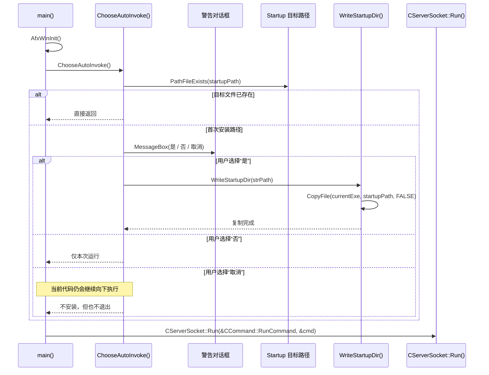

---
tags:
  - 项目/远控系统
  - Windows/Startup
  - Windows/开机启动
heatmap_tracker: true
heatmap_group: 远控系统/6.网络与多线程问题
heatmap_weight: 1
git: 07ab7d6
git_msg: "1 通过复制文件到startup文件夹来实现开机启动"
aliases:
  - Startup-folder based auto-start
  - 通过 Startup 文件夹实现开机自启
  - Startup 文件夹自启动方案
---

# 6.15 通过 Startup 文件夹实现开机自启

> 基于提交 `07ab7d6a878d60dd75896e0cd034c10402a1093a`（2026-04-01）整理。
> 这个提交可以看作 [[6.14 启动权限请求与开机自启]] 的直接后续版本。它没有改变“让远控服务在后续登录中自动出现”这个总目标，但把上一版依赖 **注册表 + `system32` + 提权** 的方案，改成了 **把程序复制到用户 Startup 文件夹** 的方案。

> [!note]
> 虽然改动仍然集中在 `RemoteCtrl.cpp`，但这并不只是一个 Windows 部署细节。它真正改变的是服务端的**网络启动前置条件**。网络循环依旧从 `CServerSocket::Run()` 开始，但在进入这个调用之前，程序前面的引导策略已经明显更偏向“当前用户会话”了。

---

## 这次提交到底改了什么

| 改动点 | 代码落点 | 实际含义 |
|------|------|------|
| 把旧的注册表安装逻辑抽成了 `WriteRegisterTable()` | `RemoteCtrl.cpp:21-51` | 上一版方案被保留下来了，但已经不再是当前真正启用的路径 |
| 新增了 `WriteStartupDir()` | `RemoteCtrl.cpp:53-63` | 开机自启现在改成了“把 EXE 复制到 Startup 文件夹” |
| `ChooseAutoInvoke()` 改成了 Startup 文件夹目标路径 | `RemoteCtrl.cpp:68-69` | 持久化位置从 `system32 + HKLM Run` 切换成了按用户生效的启动目录 |
| `ChooseAutoInvoke()` 的实际执行分支改成调用 `WriteStartupDir(strPath)` | `RemoteCtrl.cpp:81-84` | 自启动策略从偏管理员权限的方案，切换成了用户态方案 |
| `ServerSocket.h` 只有一处注释变化 | `ServerSocket.h:194-197` | 这次提交并没有真正修改网络核心逻辑 |

---

## 它和上一版是什么关系

> [[6.14 启动权限请求与开机自启]] 记录的是第一版自启动方案。这次提交不是平地起一个全新子系统，而是在**同一个启动阶段内部更换了实现策略**。

| 维度 | 6.14（`c49dfbc`） | 6.15（`07ab7d6`） |
|------|------|------|
| 持久化机制 | `mklink` 到 `system32` + `HKLM\\...\\Run` | `CopyFile` 复制到用户 Startup 文件夹 |
| 权限假设 | 强依赖提权环境 | 主要依赖当前用户会话 |
| 安装目标 | 机器级路径 + 注册表 | 用户配置目录下的 Startup 目录 |
| 运行时身份 | 更接近“整机常驻进程” | 更接近“随当前用户登录而启动的常驻进程” |
| 主要失败面 | UAC、`HKLM`、`system32`、路径拼接、DLL 环境假设 | 用户路径是否正确、复制是否成功、用户目录是否被写死 |

这次最重要的架构变化是：

- `6.14` 试图用一种**机器级启动模型**来解决持久化问题。
- `6.15` 则把这个设计降到了**用户级启动模型**。

这样做的好处是更容易落地、对权限要求更低；代价则是持久化范围被缩窄了，程序不再跟随整机启动策略，而是跟随某一个具体用户的登录环境。

---

## 先把整条启动链讲清楚

这次的启动链整体上和上一版很像：

1. `main()` 先初始化 MFC。
2. `ChooseAutoInvoke()` 在网络服务启动之前执行。
3. 程序先检查目标自启动文件是否已经存在。
4. 如果不存在，再询问用户是否要安装持久化能力。
5. 如果用户同意，程序就把当前可执行文件复制到 Startup 文件夹。
6. 等这个启动决策流程结束后，程序才会进入 `CServerSocket::Run()`，网络运行时才真正开始。

所以，网络子系统依然是在**启动策略分支执行完之后**才开始工作。改变的并不是网络入口位置，而是这条入口前面那段“启动引导逻辑”的实现方式。

### 时序图



### 新旧启动策略对比

这张图是固定结构对比图，使用 SVG 更容易控制两侧布局和层级关系。

<svg viewBox="0 0 980 360" xmlns="http://www.w3.org/2000/svg" width="100%">
  <defs>
    <marker id="compare-arrow" viewBox="0 0 10 10" refX="8" refY="5" markerWidth="5" markerHeight="5" orient="auto-start-reverse">
      <path d="M2 1L8 5L2 9" fill="none" stroke="#666" stroke-width="1.4" stroke-linecap="round"/>
    </marker>
  </defs>

  <text x="490" y="26" text-anchor="middle" font-size="18" font-weight="600" font-family="Segoe UI, Arial, sans-serif" fill="#2f2f2f">
    新旧启动策略对比
  </text>

  <rect x="28" y="48" width="420" height="284" rx="14" fill="#fff4ec" stroke="#d97b34" stroke-width="1.5"/>
  <text x="238" y="74" text-anchor="middle" font-size="17" font-weight="600" font-family="Segoe UI, Arial, sans-serif" fill="#8a4312">
    6.14 方案
  </text>

  <rect x="108" y="104" width="260" height="38" rx="8" fill="#ffffff" stroke="#c66c2b" stroke-width="1.2"/>
  <text x="238" y="128" text-anchor="middle" font-size="13" font-family="Segoe UI, Arial, sans-serif" fill="#333">
    机器级安装思路
  </text>

  <rect x="108" y="164" width="260" height="38" rx="8" fill="#ffffff" stroke="#c66c2b" stroke-width="1.2"/>
  <text x="238" y="188" text-anchor="middle" font-size="13" font-family="Segoe UI, Arial, sans-serif" fill="#333">
    mklink 到 system32
  </text>

  <rect x="108" y="224" width="260" height="38" rx="8" fill="#ffffff" stroke="#c66c2b" stroke-width="1.2"/>
  <text x="238" y="248" text-anchor="middle" font-size="13" font-family="Segoe UI, Arial, sans-serif" fill="#333">
    写入 HKLM Run 启动项
  </text>

  <rect x="108" y="284" width="260" height="30" rx="8" fill="#ffffff" stroke="#c66c2b" stroke-width="1.2"/>
  <text x="238" y="304" text-anchor="middle" font-size="12.5" font-family="Segoe UI, Arial, sans-serif" fill="#333">
    强依赖提权环境
  </text>

  <line x1="238" y1="142" x2="238" y2="164" stroke="#666" stroke-width="1.4" marker-end="url(#compare-arrow)"/>
  <line x1="238" y1="202" x2="238" y2="224" stroke="#666" stroke-width="1.4" marker-end="url(#compare-arrow)"/>
  <line x1="238" y1="262" x2="238" y2="284" stroke="#666" stroke-width="1.4" marker-end="url(#compare-arrow)"/>

  <rect x="532" y="48" width="420" height="284" rx="14" fill="#eef8f1" stroke="#3a8a57" stroke-width="1.5"/>
  <text x="742" y="74" text-anchor="middle" font-size="17" font-weight="600" font-family="Segoe UI, Arial, sans-serif" fill="#23663e">
    6.15 方案
  </text>

  <rect x="612" y="104" width="260" height="38" rx="8" fill="#ffffff" stroke="#459562" stroke-width="1.2"/>
  <text x="742" y="128" text-anchor="middle" font-size="13" font-family="Segoe UI, Arial, sans-serif" fill="#333">
    用户级安装思路
  </text>

  <rect x="612" y="164" width="260" height="38" rx="8" fill="#ffffff" stroke="#459562" stroke-width="1.2"/>
  <text x="742" y="188" text-anchor="middle" font-size="13" font-family="Segoe UI, Arial, sans-serif" fill="#333">
    CopyFile 到 Startup 文件夹
  </text>

  <rect x="612" y="224" width="260" height="38" rx="8" fill="#ffffff" stroke="#459562" stroke-width="1.2"/>
  <text x="742" y="248" text-anchor="middle" font-size="13" font-family="Segoe UI, Arial, sans-serif" fill="#333">
    跟随当前用户登录会话启动
  </text>

  <rect x="612" y="284" width="260" height="30" rx="8" fill="#ffffff" stroke="#459562" stroke-width="1.2"/>
  <text x="742" y="304" text-anchor="middle" font-size="12.5" font-family="Segoe UI, Arial, sans-serif" fill="#333">
    权限压力更低，但作用范围更窄
  </text>

  <line x1="742" y1="142" x2="742" y2="164" stroke="#666" stroke-width="1.4" marker-end="url(#compare-arrow)"/>
  <line x1="742" y1="202" x2="742" y2="224" stroke="#666" stroke-width="1.4" marker-end="url(#compare-arrow)"/>
  <line x1="742" y1="262" x2="742" y2="284" stroke="#666" stroke-width="1.4" marker-end="url(#compare-arrow)"/>
</svg>

这次真正改变的，不是 `CServerSocket::Run()` 本身，而是**程序如何走到 `CServerSocket::Run()`**。换句话说，这个提交把持久化策略从“机器级安装路径”降成了“用户级安装路径”。

---

## 核心实现

### 1. `WriteRegisterTable()` 变成了“旧方案的遗留实现”

> 文件：`RemoteCtrl/RemoteCtrl/RemoteCtrl.cpp`  
> 函数：`WriteRegisterTable`  
> 当前行号：`21-51`

这个函数基本保留了 `6.14` 里那套思路：

```cpp
std::string strCmd = "mklink " + std::string(sSys) + strExe + std::string(sPath) + strExe;
int ret = system(strCmd.c_str());
...
ret = RegOpenKeyEx(HKEY_LOCAL_MACHINE, strSubKey, 0, KEY_ALL_ACCESS | KEY_WOW64_64KEY, &hKey);
...
ret = RegSetValueEx(hKey, _T("RemoteCtrl"), 0, REG_EXPAND_SZ,
    (BYTE*)(LPCTSTR)strPath,
    strPath.GetLength() * sizeof(TCHAR));
```

关键点不在于它做了什么，而在于它**还存在，但已经不再被实际调用**。这说明作者并没有彻底删掉旧方案，而是让代码暂时处于一种“方案切换中”的状态：

- **旧的机器级持久化路径**还留在源码里；
- **新的激活路径**则已经变成了 Startup 文件夹复制方案。

从项目演进的角度看，这个状态很有信息量，因为它清楚地说明了：当前项目并不是已经收敛到最终设计，而是在尝试不同的持久化路径。

### 2. `WriteStartupDir()` 才是这次真正新增的核心机制

> 文件：`RemoteCtrl/RemoteCtrl/RemoteCtrl.cpp`  
> 函数：`WriteStartupDir`  
> 当前行号：`53-63`

新的实现非常短：

```cpp
CString strCmd = GetCommandLine();
strCmd.Replace(_T("\""), _T(""));
BOOL ret = CopyFile(strCmd, strPath, FALSE);
if (ret == FALSE)
{
    MessageBox(NULL, _T("复制文件失败，是否权限不足？\r\n"), _T("错误"), MB_ICONERROR | MB_TOPMOST);
    ::exit(0);
}
```

它的逻辑可以直接拆成四步：

1. 通过 `GetCommandLine()` 取到当前程序路径；
2. 手动去掉命令行里的双引号；
3. 把当前 EXE 复制到 Startup 文件夹目标路径；
4. 如果复制失败，就直接终止进程。

和上一版相比，这条持久化路径明显简单得多。它去掉了若干个高风险依赖点：

- 不再写 `HKLM` 注册表；
- 不再写 `system32`；
- 不再调用 `mklink`；
- 对提权环境的依赖也明显下降了。

而这，正是本次提交真正的主题：**用更简单的用户态方式，替代上一版更重、更硬的系统级安装方式。**

### 3. `ChooseAutoInvoke()` 的目标路径已经切换成“按用户生效”

> 文件：`RemoteCtrl/RemoteCtrl/RemoteCtrl.cpp`  
> 函数：`ChooseAutoInvoke`  
> 当前行号：`65-90`

最显眼的切换就在这里：

```cpp
// CString strPath = CString(_T("C:\\Windows\\system32\\RemoteCtrl.exe"));
CString strPath = _T("C:\\Users\\49522\\AppData\\Roaming\\Microsoft\\Windows\\Start Menu\\Programs\\Startup\\RemoteCtrl.exe");
```

实际启用的安装分支也变成了：

```cpp
if (ret == IDYES)
{
    //WriteRegisterTable(strPath);
    WriteStartupDir(strPath);
}
```

这意味着，代码不再试图把这个远控进程伪装成“整机级常驻组件”，而是把它改造成一个**标准的按用户登录自动启动程序**。

这会带来两个直接的架构后果：

- 安装更容易成功，不再那么依赖管理员权限；
- 运行时语义更强地绑定到某一个具体用户和某一次具体登录会话。

因此，这次改动是在“可用性”和“作用范围”之间做了一次明显的交换：更容易跑起来，但覆盖范围更窄。

---

## 这次提交解决了什么

- 当前启用的启动路径比上一版简单得多。
- 它绕开了 `6.14` 里最敏感的权限点。
- 它更容易解释，也更容易调试，因为安装步骤现在就是一个普通文件复制。
- 它仍然把启动决策放在 `CServerSocket::Run()` 之前，因此整条运行链在时序上依然清楚。

## 这次提交还留下了哪些风险

- Startup 文件夹路径被**硬编码成了某一个具体用户目录**：`C:\\Users\\49522\\...`，可移植性很差。
- `GetCommandLine()` 被当成了“当前 EXE 路径”来直接使用，但它本质上返回的是完整命令行；一旦以后带参数启动，这个假设就不再稳妥。
- 代码通过手动去掉双引号来解析路径，这在当前简单场景下能工作，但本质上仍然是脆弱的路径解析方式。
- `IDCANCEL` 分支依然是空的，因此 `6.14` 里那个“提示文案说会退出、实际代码不会退出”的契约不一致问题仍然存在。
- `WriteRegisterTable()` 仍然留在文件里，这让源码同时挂着两套竞争性的持久化方案，虽然有助于理解演化过程，但也会增加维护成本。
- `ServerSocket.h` 这次只是注释变化，网络和线程模型本身并没有更新。所以这篇笔记要聚焦的是**启动边界和运行时可达性**，而不是假装这次修改了 socket 处理逻辑。

> 更准确地说，这个提交当前所处的阶段是：**项目把一套更重的机器级持久化设计，临时回退成了一套更容易落地的用户级持久化设计，但它在运行链中的位置仍然保持不变，依旧属于网络服务启动前的引导层。**

---

## 这里涉及到的 Win32 / 平台机制

### `CopyFile`

```cpp
BOOL CopyFile(
    LPCTSTR lpExistingFileName,
    LPCTSTR lpNewFileName,
    BOOL bFailIfExists
);
```

在这次提交里，`CopyFile` 已经成了新的持久化原语。

| 参数 | 在本提交中的含义 |
|------|------|
| `lpExistingFileName` | 当前程序路径，由 `GetCommandLine()` 间接得到 |
| `lpNewFileName` | Startup 文件夹中的目标 EXE 路径 |
| `bFailIfExists = FALSE` | 如果目标文件已存在，允许覆盖 |

它为什么重要？因为和注册表安装比起来，`CopyFile` 的语义要直接得多。它把“持久化”这件事从“注册表 + 权限”的系统级动作，变成了一个更容易理解的“文件部署”动作。

### Startup 文件夹

Startup 文件夹是 Windows Shell 提供的、**按用户生效**的自动启动机制。它的设计语义是：

- 当这个用户登录时启动程序；
- 而不是在操作系统更底层的“整机启动阶段”就把程序拉起来。

所以，这次提交实现的依然是**登录时自启动**，不是服务式启动。

### `GetCommandLine`

```cpp
LPTSTR GetCommandLine(void);
```

这个 API 返回的是**完整命令行**，不是一个天然安全的“只有路径”的字符串。当前代码通过去掉双引号，默认剩余内容就是 EXE 路径。这个前提只有在“程序不带额外参数启动”的情况下才比较可靠。

---

## 关联笔记

- [[6.14 启动权限请求与开机自启]] - 上一版持久化设计，核心是 `system32` 与 `HKLM Run`
- [[2.1 网络编程基本设计]] - 更早期的服务端基线设计，说明启动流程结束后网络运行时如何开始工作
- [[6.5 重构网络模块（线程事件机制→消息机制）]] - 第 6 章里另一个重点笔记，关注的是“进程已经启动之后”的运行时分发机制

---

## 代码索引

| 功能点 | 文件 | 位置 |
|------|------|------|
| 旧的注册表持久化路径 | `RemoteCtrl/RemoteCtrl/RemoteCtrl.cpp` | `WriteRegisterTable`（`21-51`） |
| 新的 Startup 文件夹持久化路径 | `RemoteCtrl/RemoteCtrl/RemoteCtrl.cpp` | `WriteStartupDir`（`53-63`） |
| 启动策略切换点 | `RemoteCtrl/RemoteCtrl/RemoteCtrl.cpp` | `ChooseAutoInvoke`（`65-90`） |
| 服务端运行时入口 | `RemoteCtrl/RemoteCtrl/RemoteCtrl.cpp` | `main`（`92-135`） |
| 非功能性头文件改动 | `RemoteCtrl/RemoteCtrl/ServerSocket.h` | `releaseInstance` 注释（`194-197`） |

---

## 更新记录

| 日期 | 变更 |
|------|------|
| 2026-04-01 | 初始版本：基于提交 `07ab7d6`，记录自启动方案从“注册表 + system32”切换到“Startup 文件夹复制” |
| 2026-04-01 | 将本笔记定位为 [[6.14 启动权限请求与开机自启]] 的直接后续版本 |
