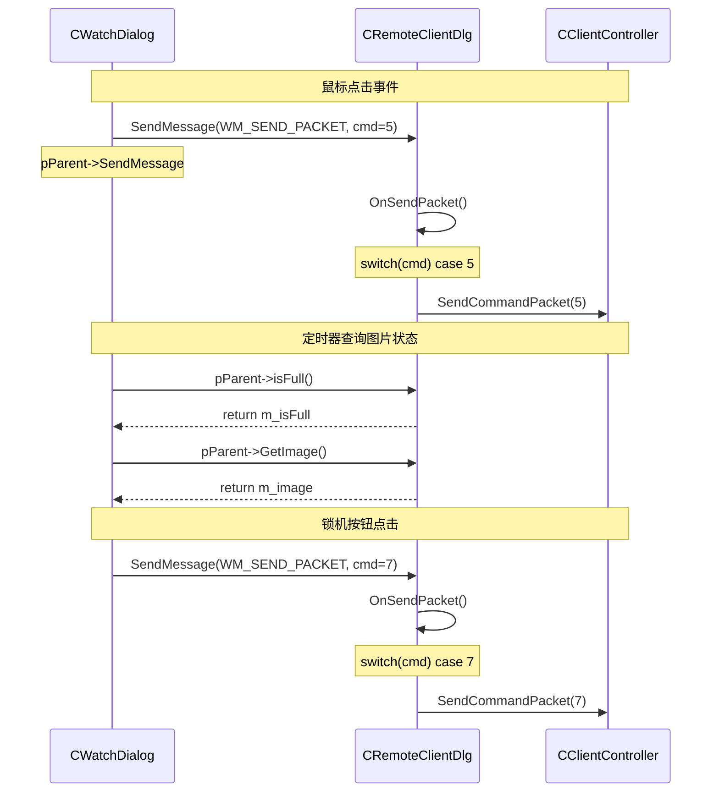
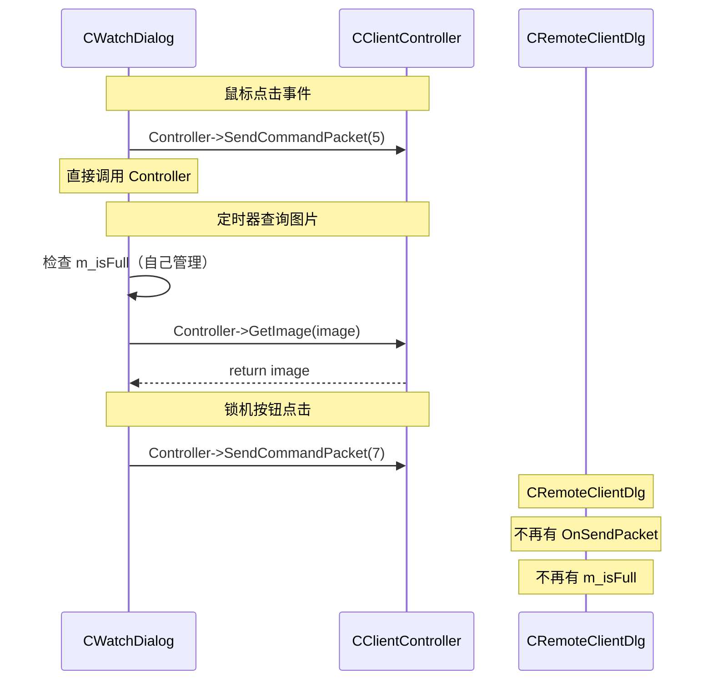

---
tags:
  - 项目/远控系统
heatmap_tracker: true
heatmap_group: 远控系统/6.网络与多线程问题
heatmap_weight: 1
git: "eb624f5"
---

# 6.3 重构监控对话框

> 将 `CWatchDialog` 从依赖父对话框 `CRemoteClientDlg` 改为依赖 `CClientController`，彻底解除 View 与 View 之间的耦合。同时删除 `WM_SEND_PACKET` 消息转发机制，图片缓存状态迁移到 `CWatchDialog` 自身管理。

---

## 功能概述

| 功能 | 说明 |
|------|------|
| **CWatchDialog 解耦** | 鼠标/锁机/解锁操作不再通过父对话框转发，直接调 Controller |
| **WM_SEND_PACKET 消除** | 删除 RemoteClientDlg 中的消息转发 switch-case（约 35 行） |
| **图片缓存迁移** | `m_isFull` 从 RemoteClientDlg 迁移到 CWatchDialog |
| **声明定义分离** | `SendCommandPacket` / `DownFile` 从头文件内联移到 .cpp |
| **m_watchDlg 复用** | `StartWatchScreen` 使用 Controller 成员变量而非临时局部变量 |

---

## 设计背景

### 上一步遗留的问题

在 [[6.2 优化RemoteDlg线程]] 中，监控线程和下载线程已经从 Dialog 迁移到了 Controller。但 `CWatchDialog` 内部的通信方式还没有改：

```
CWatchDialog (重构前)
  │
  ├── OnLButtonDown()
  │     └── pParent->SendMessage(WM_SEND_PACKET, 5<<1|1, &event)
  │           │  ↑ 通过 GetParent() 强转为 CRemoteClientDlg*
  │           ▼
  │     CRemoteClientDlg::OnSendPacket()
  │           └── switch(cmd)
  │                 case 5: Controller->SendCommandPacket(5, ...)
  │
  ├── OnBnClickedBtnLock()
  │     └── pParent->SendMessage(WM_SEND_PACKET, 7<<1|1)
  │           └── 同样绕回 RemoteClientDlg
  │
  └── OnTimer()
        └── pParent->isFull() / pParent->GetImage()
              ↑ 通过 GetParent() 强转为 CRemoteClientDlg*
              问题：图片缓存状态放在 RemoteClientDlg，但实际只有 CWatchDialog 使用
```

**三个问题**：

| 问题 | 说明 |
|------|------|
| **View 与 View 耦合** | CWatchDialog 通过 `GetParent()` 强转拿 CRemoteClientDlg 指针，两个 View 直接耦合 |
| **消息转发冗余** | `WM_SEND_PACKET` + `OnSendPacket()` 的 switch-case 只是做转发，没有业务逻辑 |
| **缓存位置不合理** | `m_isFull` 放在 RemoteClientDlg，但只有 CWatchDialog 的定时器在读写它 |

### 本次优化目标

1. CWatchDialog 直接调用 `CClientController::getInstance()` 发送命令
2. 删除 `WM_SEND_PACKET` 转发机制
3. 图片缓存状态 `m_isFull` 迁移到 CWatchDialog 自身

---

## 架构设计

### 重构前后对比

**重构前**：View → View → Controller → Model（三层转发）



**问题**：
- CWatchDialog 通过 `GetParent()` 强转获取 CRemoteClientDlg 指针（View 与 View 耦合）
- `WM_SEND_PACKET` 消息转发机制冗余，只做转发没有业务逻辑
- 图片缓存状态 `m_isFull` 放在 RemoteClientDlg，但只有 CWatchDialog 使用

---

**重构后**：View → Controller → Model（直接调用）



**改进**：
- CWatchDialog 直接调用 `CClientController::getInstance()`，解除 View 与 View 耦合
- 删除 `WM_SEND_PACKET` 转发机制（约 35 行代码）
- 图片缓存状态 `m_isFull` 迁移到 CWatchDialog 自身管理

---

## 核心实现

### 1. CWatchDialog 鼠标事件解耦

所有 8 个鼠标事件处理函数都做了相同的修改。以 `OnLButtonDown` 为例：

```cpp
// ❌ 重构前：通过父对话框强转 + SendMessage 转发
void CWatchDialog::OnLButtonDown(UINT nFlags, CPoint point)
{
    if (bindPoint != CPoint(-1, -1))
    {
        // ... 坐标转换 ...
        event.nButton = 0;    // 左键
        event.nAction = 2;    // 按下
        CRemoteClientDlg* pParent = (CRemoteClientDlg*)GetParent();
        //      ^^^^^^^^^^^^^^^^^^^^^^^^^^^^^^^^^^^^^^^^^^^^^^^^
        //      问题：CWatchDialog 硬编码依赖 CRemoteClientDlg
        //      如果父窗口不是 CRemoteClientDlg，强转后崩溃
        pParent->SendMessage(WM_SEND_PACKET, 5 << 1 | 1, (WPARAM)&event);
        //                   ^^^^^^^^^^^^^^  ^^^^^^^^^^
        //                   自定义消息       编码：cmd=5, bAutoClose=1
    }
    CDialog::OnLButtonDown(nFlags, point);
}

// ✅ 重构后：直接调用 Controller
void CWatchDialog::OnLButtonDown(UINT nFlags, CPoint point)
{
    if (bindPoint != CPoint(-1, -1))
    {
        // ... 坐标转换 ...
        event.nButton = 0;
        event.nAction = 2;
        CClientController::getInstance()->SendCommandPacket(
            5, true, (BYTE*)&event, sizeof(event));
        //  ^  ^^^^  ^^^^^^^^^^^^^^  ^^^^^^^^^^^^
        //  cmd  自动关闭  鼠标事件数据   数据长度
    }
    CDialog::OnLButtonDown(nFlags, point);
}
```

**消除了 `WM_SEND_PACKET` 的编码/解码开销**。重构前需要把 cmd 和 bAutoClose 编码到一个 WPARAM 里（`5 << 1 | 1`），RemoteClientDlg 再解码（`cmd = wParam >> 1`，`bAutoClose = wParam & 1`）。现在直接传参数，清晰明了。

涉及的所有鼠标事件（修改方式完全相同）：

| 事件 | 对应 `nButton` | 对应 `nAction` |
|------|---------|---------|
| `OnLButtonDblClk` | 0 (左) | 1 (双击) |
| `OnLButtonDown` | 0 (左) | 2 (按下) |
| `OnLButtonUp` | 0 (左) | 3 (弹起) |
| `OnRButtonDblClk` | 1 (右) | 1 (双击) |
| `OnRButtonDown` | 1 (右) | 2 (按下) |
| `OnRButtonUp` | 1 (右) | 3 (弹起) |
| `OnMouseMove` | 8 (无) | 0 (移动) |
| `OnStnClickedWatch` | 0 (左) | 0 (单击) |

### 2. 锁机/解锁解耦

```cpp
// ❌ 重构前
void CWatchDialog::OnBnClickedBtnLock()
{
    CRemoteClientDlg* pParent = (CRemoteClientDlg*)GetParent();
    pParent->SendMessage(WM_SEND_PACKET, 7 << 1 | 1);
}

// ✅ 重构后
void CWatchDialog::OnBnClickedBtnLock()
{
    CClientController::getInstance()->SendCommandPacket(7);
}
```

解锁（cmd=8）同理。不再需要通过父对话框转发。

### 3. 图片缓存状态迁移

**设计变更**：`m_isFull` 从 `CRemoteClientDlg` 搬到 `CWatchDialog`，因为只有 `CWatchDialog` 的定时器在使用它。

```cpp
// CWatchDialog.h — 新增
class CWatchDialog : public CDialog
{
protected:
    bool m_isFull;  // 图片缓存是否有数据（从 RemoteClientDlg 迁移过来）
public:
    void SetImageStatus(bool isFull = false) { m_isFull = isFull; }
    bool isFull() const { return m_isFull; }
};
```

构造函数和 `OnInitDialog` 中初始化为 `false`：

```cpp
CWatchDialog::CWatchDialog(CWnd* pParent)
    : CDialog(IDD_DIG_WATCH, pParent)
{
    m_isFull = false;  // ← 新增
    m_nObjWidth = -1;
    m_nObjHeight = -1;
}

BOOL CWatchDialog::OnInitDialog()
{
    CDialog::OnInitDialog();
    m_isFull = false;   // ← 新增：每次打开对话框重置
    SetTimer(0, 45, NULL);
    return TRUE;
}
```

### 4. OnTimer 定时器重构

定时器是屏幕监控的**显示驱动**——每 45ms 检查一次缓存，有新图片就绘制到控件上：

```cpp
void CWatchDialog::OnTimer(UINT_PTR nIDEvent)
{
    if (nIDEvent == 0)
    {
        CClientController* pParent = CClientController::getInstance();
        if (m_isFull)  // ← 改为查询自身的缓存状态
        {
            CRect rect;
            m_picture.GetWindowRect(rect);
            CImage image;  // ← 使用局部变量，而非引用 RemoteClientDlg 的成员
            pParent->GetImage(image);  // 从 Controller 获取图片数据
            if (m_nObjWidth == -1)
                m_nObjWidth = image.GetWidth();
            if (m_nObjHeight == -1)
                m_nObjHeight = image.GetHeight();
            // 缩放绘制到图片控件
            image.StretchBlt(
                m_picture.GetDC()->GetSafeHdc(),
                0, 0, rect.Width(), rect.Height(), SRCCOPY);
            m_picture.InvalidateRect(NULL);
            image.Destroy();
            m_isFull = false;  // ← 直接重置自身的缓存状态
        }
    }
    CDialog::OnTimer(nIDEvent);
}
```

**对比重构前**：

| 维度 | 重构前 | 重构后 |
|------|--------|--------|
| 缓存查询 | `pParent->isFull()`（查父对话框） | `m_isFull`（查自身） |
| 图片获取 | `pParent->GetImage()`（拿父对话框引用） | `pParent->GetImage(image)`（Controller 填充局部变量） |
| 状态重置 | `pParent->SetImageStatus()`（改父对话框） | `m_isFull = false`（改自身） |

### 5. 监控线程中的配套修改

Controller 的监控线程也做了配套修改，写入缓存状态时改为操作 `m_watchDlg`：

```cpp
void CClientController::threadWatchScreen()
{
    Sleep(50);
    while (!m_isClosed)
    {
        if (m_watchDlg.isFull() == false)  // ← 改为查询 watchDlg
        {
            int ret = SendCommandPacket(6);
            if (ret == 6)
            {
                if (GetImage(m_remoteDlg.GetImage()) == 0)
                {
                    m_watchDlg.SetImageStatus(true);  // ← 改为设置 watchDlg
                }
            }
        }
        Sleep(1);
    }
}
```

### 6. StartWatchScreen 使用成员变量

```cpp
// ❌ 重构前：每次创建临时的 CWatchDialog
void CClientController::StartWatchScreen()
{
    m_isClosed = false;
    CWatchDialog dlg(&m_remoteDlg);  // 临时对象，DoModal 返回后销毁
    m_hThreadWatch = (HANDLE)_beginthread(...);
    dlg.DoModal();
    // ...
}

// ✅ 重构后：使用 Controller 持有的成员变量
void CClientController::StartWatchScreen()
{
    m_isClosed = false;
    m_hThreadWatch = (HANDLE)_beginthread(...);
    m_watchDlg.DoModal();  // 使用成员变量，生命周期与 Controller 一致
    m_isClosed = true;
    WaitForSingleObject(m_hThreadWatch, 500);
}
```

**为什么要改？** 因为监控线程中需要调用 `m_watchDlg.isFull()` 和 `m_watchDlg.SetImageStatus()`。如果 `watchDlg` 是局部变量，线程访问的是 Controller 的成员 `m_watchDlg`，而实际显示的是另一个局部对象 `dlg`，两者不是同一个对象，缓存状态无法同步。

### 7. 删除 WM_SEND_PACKET 机制

从 `CRemoteClientDlg` 中彻底删除：

```cpp
// ❌ 删除的宏定义（RemoteClientDlg.h）
#define WM_SEND_PACKET (WM_USER + 1)   // 不再需要

// ❌ 删除的消息映射（RemoteClientDlg.cpp）
ON_MESSAGE(WM_SEND_PACKET, &CRemoteClientDlg::OnSendPacket)  // 不再需要

// ❌ 删除的处理函数（约 35 行 switch-case）
LRESULT CRemoteClientDlg::OnSendPacket(WPARAM wParam, LPARAM lParam)
{
    int cmd = wParam >> 1;
    switch (cmd)
    {
    case 4: /* 下载 */ break;
    case 5: /* 鼠标 */ break;
    case 6: case 7: case 8: /* 屏幕/锁机/解锁 */ break;
    }
    return ret;
}
```

这个 switch-case 纯粹是转发层，没有任何业务逻辑。每个 case 只是把参数重新组装后调用 `Controller->SendCommandPacket()`。现在调用方直接调 Controller，这层转发就没有存在的必要了。

### 8. 声明与定义分离

`SendCommandPacket` 和 `DownFile` 从头文件的内联实现移到了 `.cpp` 文件：

```cpp
// ClientController.h — 只保留声明
int SendCommandPacket(int nCmd, bool bAutoClose = true,
    BYTE* pData = NULL, size_t nLength = 0);
int DownFile(CString strPath);

// ClientController.cpp — 定义移到这里
int CClientController::SendCommandPacket(int nCmd, bool bAutoClose,
    BYTE* pData, size_t nLength)
{
    CClientSocket* pClient = CClientSocket::getInstance();
    if (pClient->InitSocket() == false)
        return false;
    pClient->Send(CPacket(nCmd, pData, nLength));
    int cmd = DealCommand();
    if (bAutoClose)
        CloseSocket();
    return cmd;
}
```

**为什么要分离？** 头文件中的内联函数会被每个 `#include` 该头文件的 `.cpp` 编译一份副本。`SendCommandPacket` 不是简短的 getter/setter，包含网络操作逻辑，放在头文件中会增加编译耦合和代码膨胀。分离后，修改实现不需要重新编译所有引用头文件的源文件。

---

## 删除代码统计

| 类别 | 文件 | 删除内容 |
|------|------|---------|
| `WM_SEND_PACKET` 宏 | RemoteClientDlg.h | 1 行 |
| `OnSendPacket` 函数 | RemoteClientDlg.cpp | ~35 行 switch-case |
| 消息映射注册 | RemoteClientDlg.cpp | 1 行 `ON_MESSAGE` |
| `m_isFull` / `isFull()` / `SetImageStatus()` | RemoteClientDlg.h | ~10 行 |
| `m_isFull` 初始化 | RemoteClientDlg.cpp | 1 行 |
| **合计** | | **~48 行** |

---

## 易错点与调试

### 1. GetParent() 强转的危险性

```cpp
// ❌ 危险：硬编码假设父窗口类型
CRemoteClientDlg* pParent = (CRemoteClientDlg*)GetParent();
```

这是 C 风格强转，编译器不做任何检查。如果 `CWatchDialog` 的父窗口不是 `CRemoteClientDlg`（比如重构后父窗口变了），强转后调用方法会导致**未定义行为**。使用 `CClientController::getInstance()` 消除了这个风险。

### 2. Bug 修复：CHelper 在 main 前调用 getInstance

本次提交同时修复了一个启动 Bug：`CHelper` 构造函数中的 `getInstance()` 调用在 `main()` 之前执行，此时 MFC 框架未初始化，创建包含 MFC 对话框的 `CClientController` 导致异常。

详见 [[Debug-012 CHelper在main前调用getInstance导致启动异常]]。

### 3. 已知问题：多线程消息冲突

commit 备注提到"发现了一个多线程发送消息会产生冲突的 bug"。当监控线程和 UI 线程同时调用 `SendCommandPacket` 时，两者共享同一个 `CClientSocket` 单例，可能产生竞态条件：

```
监控线程: SendCommandPacket(6)  → InitSocket → Send → DealCommand
UI 线程:  SendCommandPacket(1)  → InitSocket → Send → DealCommand
                                               ↑
                                     同一个 socket，数据交错！
```

这个 Bug 在本次提交中未修复，留待后续处理。

---

## 当前重构进度

对照 [[5.7 MVC设计模式#重构步骤建议]] 中的计划：

| 步骤 | 内容 | 状态 |
|------|------|------|
| 引入 Controller 层 | 单例 + 工作线程 + 消息循环 | ✅（[[6.1 初步完成控制层]]） |
| 网络操作门面 | SendCommandPacket 等迁移到 Controller | ✅（[[6.1 初步完成控制层]]） |
| 线程迁移 | 监控线程 + 下载线程迁移到 Controller | ✅（[[6.2 优化RemoteDlg线程]]） |
| **View 解耦** | **CWatchDialog 不再依赖 CRemoteClientDlg** | **✅ 本次完成** |
| **消除消息转发** | **删除 WM_SEND_PACKET + OnSendPacket** | **✅ 本次完成** |
| **缓存位置合理化** | **m_isFull 迁移到 CWatchDialog** | **✅ 本次完成** |
| View 完全瘦身 | Dialog 中仍有部分直接调 `CClientSocket::GetPacket()` | ⏳ 进行中 |
| 多线程安全 | 监控线程和 UI 线程共享 socket 的竞态问题 | 🔲 待修复 |

---

## 关联知识

- [[6.2 优化RemoteDlg线程]] — 线程迁移到 Controller（本次在此基础上解耦 View）
- [[6.1 初步完成控制层]] — Controller 的完整设计（单例 + 网络门面）
- [[5.7 MVC设计模式]] — MVC 重构方案的设计依据
- [[4.7 鼠标远程控制（控制端）]] — 鼠标事件处理的原始实现
- [[Debug-012 CHelper在main前调用getInstance导致启动异常]] — CHelper 启动 Bug 修复
- [[Debug-011 getInstance返回nullptr导致成员偏移量崩溃]] — CHelper 未定义导致内存泄漏

---

## 代码索引

| 功能 | 文件 | 说明 |
|------|------|------|
| 鼠标事件解耦（8个函数） | CWatchDialog.cpp | 从 `pParent->SendMessage` 改为 `Controller->SendCommandPacket` |
| 锁机/解锁解耦 | CWatchDialog.cpp | `OnBnClickedBtnLock` / `OnBnClickedBtnUnlock` |
| 图片缓存迁移 | CWatchDialog.h | 新增 `m_isFull` / `SetImageStatus()` / `isFull()` |
| OnTimer 重构 | CWatchDialog.cpp | 使用自身缓存状态 + Controller 获取图片 |
| 删除 WM_SEND_PACKET | RemoteClientDlg.h/cpp | 删除宏定义 + 消息映射 + OnSendPacket |
| 删除 m_isFull | RemoteClientDlg.h/cpp | 从 RemoteClientDlg 中移除 |
| SendCommandPacket 分离 | ClientController.h/cpp | 声明与定义分离 |
| StartWatchScreen 修改 | ClientController.cpp | 使用 m_watchDlg 成员变量 |
| CHelper 修复 | ClientController.h/cpp | 添加 m_helper 定义 + 注释掉构造中的 getInstance |

---

## 更新记录

| 日期 | 变更 |
|------|------|
| 2026-03-19 | 初始版本：CWatchDialog 解耦 + WM_SEND_PACKET 删除 + 缓存迁移 + Bug 修复 |
