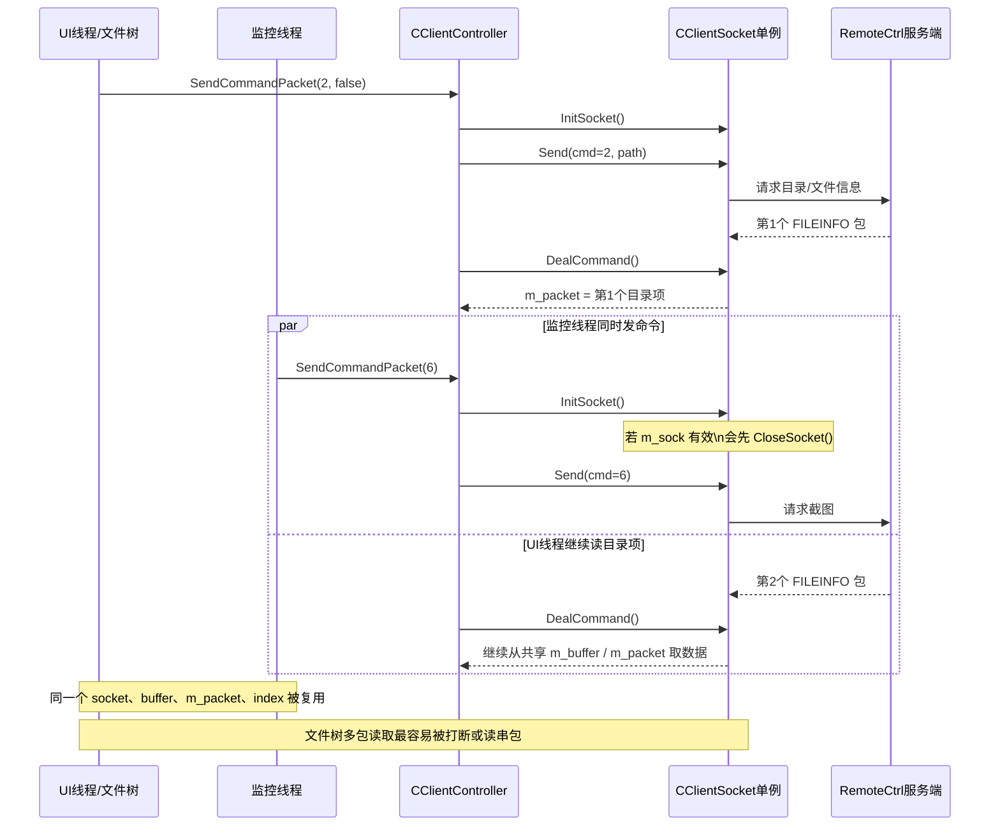
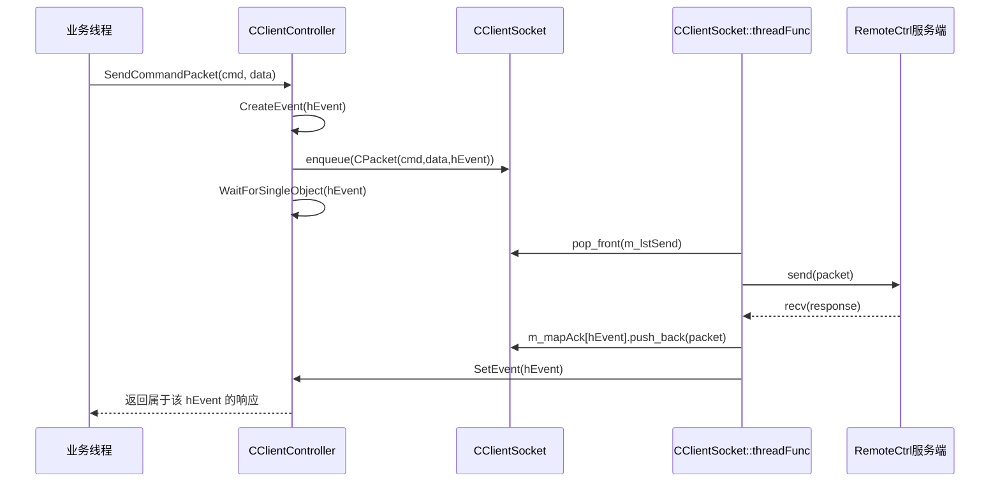

---
tags:
  - 项目/远控系统
heatmap_tracker: true
heatmap_group: 远控系统/6.网络与多线程问题
heatmap_weight: 1
git: "56ff64e"
---

# 6.4 网络模型线程完善

> 基于最新提交 `56ff64e`，客户端开始把网络通信从“多个业务线程直接共享 `CClientSocket` 单例”重构为“请求带事件标识、由网络层串行处理”的模型。但这次提交仍处于**半成品阶段**：请求关联机制已经出现，真正的发送队列和后台收发线程还没有接入主流程，因此文件/文件夹信息获取反而最先暴露出新的并发问题。

---

## 功能概述

| 功能 | 说明 |
|------|------|
| **请求绑定事件句柄** | `CPacket` 新增 `hEvent`，开始为“请求-应答匹配”做准备 |
| **网络线程骨架** | `CClientSocket` 新增 `threadEntry()` / `threadFunc()`、发送队列 `m_lstSend`、应答映射 `m_mapAck` |
| **Controller 入口改造** | `SendCommandPacket()` 在发包前创建 `HANDLE hEvent` 并写入 `CPacket` |
| **问题重新定位** | 多线程冲突的根因从“Send 冲突”进一步暴露到“共享 socket + 共享缓冲区 + 多包响应场景” |
| **新暴露场景** | 文件/文件夹信息获取（命令 `2`）是一请求多响应，最容易被监控线程或其他命令打断 |

---

## 设计背景

### 上一步重构已经把线程提到了 Controller

在 [[6.2 优化RemoteDlg线程]] 和 [[6.3 重构监控对话框]] 中：

- 屏幕监控线程已经迁移到 `CClientController`
- 文件下载线程已经迁移到 `CClientController`
- `CWatchDialog` 也不再绕回 `RemoteClientDlg`

这意味着当前客户端里至少存在下面几类会主动发网络命令的执行路径：

```text
UI线程
  ├── 查看磁盘分区        cmd = 1
  ├── 查看目录文件        cmd = 2
  ├── 打开文件/删除文件   cmd = 3 / 9
  └── 用户点击远程监控     -> StartWatchScreen()

监控线程
  └── 周期性请求截图      cmd = 6

下载线程
  └── 下载文件            cmd = 4
```

### 旧模型的核心问题：多个线程共享同一个网络单例

虽然业务线程变多了，但网络层仍然是一个全局单例 `CClientSocket`，关键状态全部共享：

- `m_sock`：当前连接
- `m_buffer`：接收缓存
- `m_packet`：最近一次解析出的包
- `DealCommand()` 中的 `static size_t index`

旧路径如下：

```text
线程A（监控）
  -> SendCommandPacket(6)
     -> InitSocket()
     -> Send()
     -> DealCommand()

线程B（文件树）
  -> SendCommandPacket(2, false)
     -> InitSocket()
     -> Send()
     -> DealCommand()
     -> DealCommand()
     -> DealCommand() ...
```

这里最大的问题不是“两个线程都调用了 `send()`”这么简单，而是：

1. **两个线程共用一个 `m_sock`**
2. **两个线程共用一个 `m_buffer`**
3. **两个线程共用一个 `m_packet`**
4. **`DealCommand()` 里的 `index` 还是静态局部变量**
5. **文件/目录获取是多包返回，比单次截图 ACK 更脆弱**

---

## 架构设计

### 本次提交想实现的目标模型

从新增代码可以看出，作者想把网络层改成“按请求串行发送，再按事件唤醒调用者”的结构：

```text
业务线程
  -> 创建 hEvent
  -> 构造 CPacket(cmd, data, hEvent)
  -> 放入发送队列 m_lstSend

CClientSocket 网络线程
  -> 取队首请求
  -> send()
  -> recv()
  -> 解析 CPacket
  -> 按 hEvent 放入 m_mapAck
  -> SetEvent(hEvent)

业务线程
  -> WaitForSingleObject(hEvent)
  -> 读取属于自己的响应
```

这个方向是对的，因为它要解决的是“**谁发出的请求，就该拿到谁的响应**”。

### 当前旧模型时序图：文件树请求与监控请求抢占同一个 `CClientSocket`



### 目标模型时序图：业务线程只提交请求，网络线程串行处理



### 但当前真正生效的仍然是旧模型

`ClientController.cpp` 里的 `SendCommandPacket()` 已经开始创建事件：

```cpp
int CClientController::SendCommandPacket(int nCmd, bool bAutoClose, BYTE* pData, size_t nLength)
{
    CClientSocket* pClient = CClientSocket::getInstance();
    if (pClient->InitSocket() == false)
        return false;

    HANDLE hEvent = CreateEvent(NULL, TRUE, FALSE, NULL);
    // TODO:不应该直接发送，而是投入队列
    pClient->Send(CPacket(nCmd, pData, nLength, hEvent));

    int cmd = DealCommand();
    if (bAutoClose)
        CloseSocket();
    return cmd;
}
```

**关键点**：

- `hEvent` 已经创建出来了
- `CPacket` 也已经能携带 `hEvent`
- 但请求仍然是**直接调用 `Send()`**
- 然后立刻在当前线程里**同步 `DealCommand()`**

也就是说，这次提交只是把“未来要用的请求标识”先塞进来了，**主执行路径仍然是旧的同步模式**。

### 当前实际状态：新旧两套模型并存，但只有旧模型真正跑起来

```text
已经写出来的骨架：
  CPacket.hEvent
  m_lstSend
  m_mapAck
  CClientSocket::threadFunc()

当前真正走的路径：
  SendCommandPacket()
    -> InitSocket()
    -> Send()
    -> DealCommand()
```

这也是为什么提交信息里说“尝试解决”，而不是“已经解决”。

### 当前实现与目标实现的分叉流程图

```mermaid
flowchart TD
    A[业务线程调用 SendCommandPacket] --> B[InitSocket]
    B --> C[CreateEvent(hEvent)]
    C --> D[构造 CPacket(cmd,data,hEvent)]
    D --> E{当前代码走哪条路?}

    E -->|实际主链路| F[直接调用 Send]
    F --> G[当前线程同步 DealCommand]
    G --> H{bAutoClose?}
    H -->|是| I[CloseSocket]
    H -->|否| J[保留连接继续读包]

    E -->|目标链路| K[压入 m_lstSend]
    K --> L[CClientSocket::threadFunc 串行发送]
    L --> M[m_mapAck[hEvent] 保存响应]
    M --> N[SetEvent(hEvent)]
    N --> O[业务线程 WaitForSingleObject 返回]

    style F fill:#fce5cd,stroke:#d35400
    style G fill:#fce5cd,stroke:#d35400
    style K fill:#d9ead3,stroke:#38761d
    style L fill:#d9ead3,stroke:#38761d
    style M fill:#d9ead3,stroke:#38761d
    style N fill:#d9ead3,stroke:#38761d
    style O fill:#d9ead3,stroke:#38761d
```

---

## 核心实现

### 1. `CPacket` 新增 `hEvent`，为请求关联做准备

**技术栈**：
- `HANDLE`：Win32 内核对象句柄，用于标识事件对象
- `CreateEvent`：创建事件对象，用于线程间同步
- `SetEvent`：将事件设置为有信号状态，唤醒等待线程

**设计思路**：

在多线程环境下，`sCmd` 只能表示”这是什么命令”，但无法区分”哪个线程发起的请求”。例如：
- 监控线程连续发送 `cmd=6` 截图请求
- UI 线程同时发送 `cmd=2` 文件树请求
- 如果只靠 `sCmd` 区分，无法把响应正确归还给发起方

因此需要**请求实例级别的标识** `hEvent`，实现”一个请求对应一个事件句柄”的关联机制。

`CClientSocket.h` 中，`CPacket` 的构造函数和成员变量扩展如下：

> 📁 `RemoteClient/CClientSocket.h` : CPacket 构造函数 (行 18-39)

```cpp
CPacket(WORD nCmd, const BYTE* pData, size_t nSize, HANDLE hEvent)
{
    // ===== 1. 设置包头标识 =====
    sHead = 0xFEFF;  // 固定包头，用于识别包边界

    // ===== 2. 计算包长度 =====
    nLength = nSize + 4;  // 数据长度 + sCmd(2字节) + sSum(2字节)

    // ===== 3. 设置命令号 =====
    sCmd = nCmd;

    // ===== 4. 拷贝数据 =====
    if (nSize > 0)
    {
        strData.resize(nSize);
        memcpy((void*)strData.c_str(), pData, nSize);
    }
    else
    {
        strData.clear();
    }

    // ===== 5. 计算校验和 =====
    sSum = 0;
    for (size_t j = 0; j < strData.size(); j++)
    {
        sSum += BYTE(strData[j]) & 0xFF;
    }

    // ===== 6. 关联事件句柄（关键！）=====
    this->hEvent = hEvent;  // 用于标识本次请求，网络线程完成后会 SetEvent(hEvent)
}

// 成员变量
HANDLE hEvent;  // 请求完成事件句柄
```

**关键点解析**：

1. **`hEvent` 的作用**
   - 每个请求创建独立的事件句柄
   - 网络线程处理完成后调用 `SetEvent(hEvent)` 唤醒等待方
   - 业务线程通过 `WaitForSingleObject(hEvent)` 等待响应

2. **`hEvent` 不进入网络协议**
   - `CPacket::Data()` 序列化时不包含 `hEvent`
   - `hEvent` 仅用于客户端内部的请求-响应关联
   - 服务端不需要知道客户端的同步机制

3. **为什么选择事件句柄**
   - Win32 事件对象天然支持跨线程等待/唤醒
   - 每个请求拥有独立句柄，不会混淆
   - 配合 `WaitForSingleObject` 实现同步等待

> 📎 相关：[[2.3 设计网络传输包协议]] 中讲解了 `CPacket` 的基础协议格式

### 2. `CClientSocket` 长出了”发送队列 + 应答映射 + 工作线程”骨架

**技术栈**：
- `std::list`：双向链表，支持高效的头尾插入删除
- `std::map`：红黑树实现的关联容器，按键快速查找
- `_beginthread`：C 运行时库线程创建函数
- `recv`：Winsock 接收数据函数
- `SetEvent`：Win32 API，将事件设置为有信号状态

**设计思路**：

旧模型中，每个业务线程直接调用 `Send()` 和 `DealCommand()`，导致多线程竞争同一个 socket。新模型要实现：
- **发送队列**：所有请求先入队，由网络线程串行发送
- **应答映射**：按 `hEvent` 分类存储响应，避免响应混淆
- **工作线程**：独立的网络线程负责收发，业务线程只需等待结果

`CClientSocket.h` 新增了两个重要成员：

> 📁 `RemoteClient/CClientSocket.h` : 队列和映射成员 (行 308-309)

```cpp
std::list<CPacket> m_lstSend;                      // 待发送请求队列
std::map<HANDLE, std::list<CPacket>> m_mapAck;    // 按事件句柄分类的响应映射
```

| 成员 | 数据结构 | 作用 |
|------|---------|------|
| `m_lstSend` | `std::list<CPacket>` | 等待发送的请求队列，FIFO 顺序 |
| `m_mapAck` | `std::map<HANDLE, std::list<CPacket>>` | 按事件句柄分类存储响应包，支持一请求多响应 |

同时新增了工作线程逻辑：

> 📁 `RemoteClient/CClientSocket.cpp` : threadFunc 网络线程 (行 41-91)

```cpp
void CClientSocket::threadEntry(void* arg)
{
    // ===== 线程入口函数 =====
    // _beginthread 要求的签名：void func(void*)
    CClientSocket* thiz = (CClientSocket*)arg;
    thiz->threadFunc();  // 转发到成员函数
}

void CClientSocket::threadFunc()
{
    // ===== 1. 初始化 socket =====
    if (InitSocket() == false)
    {
        return;  // 连接失败，线程退出
    }

    // ===== 2. 准备接收缓冲区 =====
    std::string strBuffer;
    strBuffer.resize(BUFFER_SIZE);  // 预分配 BUFFER_SIZE 字节
    char* pBuffer = (char*)strBuffer.c_str();
    int index = 0;  // 当前缓冲区已接收字节数

    // ===== 3. 主循环：处理发送队列 =====
    while (m_sock != INVALID_SOCKET)
    {
        if (m_lstSend.size() > 0)
        {
            // ===== 3.1 取队首请求 =====
            CPacket& head = m_lstSend.front();

            // ===== 3.2 发送请求 =====
            if (Send(head) == false)
            {
                TRACE(“发送失败!\r\n”);
                continue;  // 发送失败，跳过本次请求
            }

            // ===== 3.3 在应答映射中创建条目 =====
            // insert 返回 pair<iterator, bool>
            // pr.first 是指向新插入元素的迭代器
            // pr.first->second 是 std::list<CPacket>，用于存储该请求的所有响应包
            auto pr = m_mapAck.insert(
                std::pair<HANDLE, std::list<CPacket>>(head.hEvent, std::list<CPacket>()));

            // ===== 3.4 接收响应 =====
            int length = recv(m_sock, pBuffer + index, BUFFER_SIZE - index, 0);
            if (length > 0 || index > 0)
            {
                index += length;  // 更新已接收字节数
                size_t size = (size_t)index;

                // ===== 3.5 解析 CPacket =====
                CPacket pack((BYTE*)pBuffer, size);
                // size 被 CPacket 构造函数修改：
                // - 如果解析成功，size = 该包的总字节数
                // - 如果解析失败（包不完整），size = 0

                if (size > 0)
                {
                    // ===== 3.6 关联响应到请求 =====
                    pack.hEvent = head.hEvent;  // 标记响应属于哪个请求
                    pr.first->second.push_back(pack);  // 加入该请求的响应列表

                    // ===== 3.7 唤醒等待线程 =====
                    SetEvent(head.hEvent);  // 通知业务线程：响应已到达
                }
            }
            else if (length <= 0 && index <= 0)
            {
                // ===== 3.8 连接断开 =====
                CloseSocket();
            }

            // ===== 3.9 移除已处理的请求 =====
            m_lstSend.pop_front();
        }
    }
}
```

**关键点解析**：

1. **线程函数签名**
   - `_beginthread` 要求 `void func(void*)`
   - `threadEntry` 是静态函数，转发到成员函数 `threadFunc`

2. **接收缓冲区管理**
   - `strBuffer` 是线程局部变量，不与其他线程共享
   - `index` 记录当前缓冲区中未解析的字节数
   - 这避免了旧实现中 `static size_t index` 的跨线程共享问题

3. **`m_mapAck.insert` 的返回值**
   - 返回 `std::pair<iterator, bool>`
   - `pr.first` 是指向新插入元素的迭代器
   - `pr.first->second` 是 `std::list<CPacket>`，存储该请求的响应

4. **`CPacket` 构造函数的副作用**
   - 传入 `size` 是引用参数
   - 解析成功：`size` 被修改为该包的字节数
   - 解析失败：`size` 被设为 0

5. **为什么只收一个包就 `SetEvent`**
   - 当前实现假设”一请求一响应”
   - 对于文件树、下载等”一请求多响应”场景，这里还不完善
   - 这也是为什么文件/文件夹信息获取会出问题

### 3. 但这套骨架当前还没有真正接入主流程

这次提交最大的问题，不是“代码方向错了”，而是“**只写了一半**”。

当前还缺少至少三个闭环步骤：

#### 3.1 `Send(const CPacket&)` 仍然直接 `send()`

现在的 `Send(const CPacket&)` 还是旧实现：

```cpp
bool Send(const CPacket& pack)
{
    if (m_sock == -1)
        return false;
    std::string strOut;
    pack.Data(strOut);
    return send(m_sock, strOut.c_str(), strOut.size(), 0) > 0;
}
```

如果真正要走队列模型，这里应该做的是：

```text
把 pack 放进 m_lstSend
而不是立刻 send()
```

#### 3.2 `CClientSocket::threadFunc()` 没有被启动

虽然 `CClientSocket.cpp` 里已经有：

- `threadEntry(void*)`
- `threadFunc()`

但当前代码里**没有任何地方**创建这个网络线程。也就是说，`m_lstSend` / `m_mapAck` / `threadFunc()` 目前都还只是“待接线”的组件。

#### 3.3 `SendCommandPacket()` 也没有等待事件

当前代码创建了 `hEvent`，但没有：

- `WaitForSingleObject(hEvent, ...)`
- `CloseHandle(hEvent)`

因此目前的 `hEvent` 既没有真正参与同步，也造成了新的资源泄漏风险。

### 4. 文件/文件夹信息获取为什么最先出问题

提交说明里特别提到：

> 发现新的问题，对于文件/文件夹信息获取

这个现象不是偶然，原因正好和命令 `2` 的行为有关。

#### 4.1 文件树请求不是单次 ACK，而是连续多包返回

`LoadFileCurrent()` 和 `LoadFileInfo()` 都是这样写的：

```cpp
int cCmd = CClientController::getInstance()->SendCommandPacket(
    2, false, (BYTE*)(LPCTSTR)strPath, strPath.GetLength());

PFILEINFO pInfo = (PFILEINFO)CClientSocket::getInstance()->GetPacket().strData.c_str();

while (pInfo->HasNext == TRUE)
{
    ...
    int cmd = CClientController::getInstance()->DealCommand();
    ...
    pInfo = (PFILEINFO)CClientSocket::getInstance()->GetPacket().strData.c_str();
}

CClientSocket::getInstance()->CloseSocket();
```

这和单次测试命令、单次截图 ACK 完全不同：

- 它不是“发一次，收一次”
- 而是“发一次，循环收很多次”
- 并且 `bAutoClose = false`，说明它依赖**同一个连接持续存在**

#### 4.2 但 `InitSocket()` 会主动关闭已有连接

`CClientSocket::InitSocket()` 的第一句就是：

```cpp
if (m_sock != INVALID_SOCKET)
    CloseSocket();
```

这在单线程场景问题不大，但放到多线程里就变成了灾难：

```text
UI线程：正在 LoadFileInfo()
  -> SendCommandPacket(2, false)
  -> 循环 DealCommand() 读取目录项

监控线程：周期性抓屏
  -> SendCommandPacket(6)
  -> InitSocket()
  -> 发现 m_sock 已经有效
  -> 直接 CloseSocket()
```

结果就是：

- 文件树线程正在读的连接被别的线程关掉
- 后续 `DealCommand()` 读到的可能是断开的 socket
- 或者读到新建连接上的其他命令响应
- `GetPacket()` 里那份共享 `m_packet` 也会被覆盖

这正是“文件/文件夹信息获取”场景比截图 ACK 更容易炸的根本原因。

#### 4.3 `DealCommand()` 还共享 `m_buffer`、`m_packet` 和静态 `index`

`DealCommand()` 的实现里有两个高风险点：

```cpp
char* buffer = m_buffer.data();
static size_t index = 0;
m_packet = CPacket((BYTE*)buffer, len);
```

这意味着：

- 所有线程共用同一块接收缓冲区 `m_buffer`
- 所有线程共用同一个最近响应 `m_packet`
- 甚至连解析偏移 `index` 都是跨调用共享的

因此就算不考虑 `InitSocket()` 的断连问题，只要两个线程交替调用 `DealCommand()`，也会出现：

- 包边界错乱
- 上一个命令的尾部数据污染下一个命令
- `GetPacket()` 取到的不是当前调用者想要的结果

---

## 当前版本的真实结论

这次提交不是“网络模型已经完成”，而是：

### 已经完成的部分

- 意识到单纯把线程从 Dialog 挪到 Controller 还不够
- 开始给每个请求补充唯一的本地同步标识 `hEvent`
- 开始设计独立的网络工作线程和应答分流结构

### 还没有完成的部分

- 没有真正把请求投入 `m_lstSend`
- 没有真正启动 `CClientSocket::threadFunc()`
- 没有等待 `hEvent`
- 没有关闭 `hEvent`
- `LoadFileInfo()` / `LoadFileCurrent()` 依旧直接操作共享 `CClientSocket`
- 没有任何互斥机制保护 `m_lstSend` / `m_mapAck`

所以本次提交更准确的定位应该是：

> **网络模型的第一次补强尝试：已经找对了方向，但主链路仍然是旧实现。**

---

## Win32 API 详解

### CreateEvent - 创建事件对象

```cpp
HANDLE CreateEvent(
    LPSECURITY_ATTRIBUTES lpEventAttributes,  // 安全属性
    BOOL bManualReset,                        // 重置方式
    BOOL bInitialState,                       // 初始状态
    LPCTSTR lpName                            // 事件名称
);
```

**本次代码中的使用**：

> 📁 `RemoteClient/ClientController.cpp` : SendCommandPacket (行 84)

```cpp
HANDLE hEvent = CreateEvent(NULL, TRUE, FALSE, NULL);
```

| 参数 | 值 | 说明 |
|------|-----|------|
| `lpEventAttributes` | `NULL` | 使用默认安全属性，子进程不继承句柄 |
| `bManualReset` | `TRUE` | **手动重置事件**：调用 `SetEvent` 后保持有信号状态，直到显式调用 `ResetEvent` |
| `bInitialState` | `FALSE` | 初始为**无信号状态**，`WaitForSingleObject` 会阻塞 |
| `lpName` | `NULL` | **匿名事件**，不能跨进程共享 |

**手动重置 vs 自动重置**：

| 类型 | `bManualReset` | 行为 | 适用场景 |
|------|---------------|------|---------|
| 手动重置 | `TRUE` | `SetEvent` 后保持有信号，需手动 `ResetEvent` | 一次通知多个等待线程 |
| 自动重置 | `FALSE` | `SetEvent` 后只唤醒一个线程，自动变回无信号 | 一次只唤醒一个线程 |

**本次选择手动重置的原因**：
- 虽然当前只有一个业务线程等待
- 但未来可能需要多个地方检查同一个请求的完成状态
- 手动重置更灵活，避免事件被意外重置

**配套 API**：

```cpp
// 等待事件变为有信号状态
DWORD WaitForSingleObject(HANDLE hHandle, DWORD dwMilliseconds);
// 返回值：WAIT_OBJECT_0（成功）、WAIT_TIMEOUT（超时）

// 将事件设置为有信号状态
BOOL SetEvent(HANDLE hEvent);

// 将事件重置为无信号状态（手动重置事件需要）
BOOL ResetEvent(HANDLE hEvent);

// 关闭句柄，释放资源
BOOL CloseHandle(HANDLE hObject);
```

**易错点**：

```cpp
// ❌ 错误：忘记关闭句柄
HANDLE hEvent = CreateEvent(NULL, TRUE, FALSE, NULL);
// ... 使用完毕后没有 CloseHandle(hEvent)
// 结果：句柄泄漏，系统资源耗尽

// ✅ 正确：及时关闭句柄
HANDLE hEvent = CreateEvent(NULL, TRUE, FALSE, NULL);
// ... 使用事件
CloseHandle(hEvent);  // 释放资源
```

**当前版本的问题**：
- `SendCommandPacket()` 创建了 `hEvent`
- 但没有 `CloseHandle(hEvent)`
- 如果高频调用（如监控线程每秒抓屏），会导致句柄泄漏

### recv - 接收 TCP 数据

```cpp
int recv(
    SOCKET s,           // 套接字
    char* buf,          // 接收缓冲区
    int len,            // 缓冲区长度
    int flags           // 接收标志
);
```

**返回值**：
- `> 0`：成功接收的字节数
- `0`：连接已正常关闭
- `-1`（`SOCKET_ERROR`）：发生错误，调用 `WSAGetLastError()` 获取错误码

**关键特性**：

`recv()` 是**字节流读取**，不是”按包读取”：

| 特性 | 说明 | 影响 |
|------|------|------|
| **流式传输** | TCP 保证顺序，但不保证边界 | 一次 `send` 可能被多次 `recv` 接收 |
| **粘包** | 多个小包可能合并到一次 `recv` | 必须自己解析包边界 |
| **半包** | 一个大包可能分多次 `recv` | 必须维护接收状态，拼接完整包 |

**`DealCommand()` 必须自己维护的状态**：

```cpp
// 旧实现的问题
char* buffer = m_buffer.data();      // 共享缓冲区
static size_t index = 0;             // 共享解析偏移
m_packet = CPacket((BYTE*)buffer, len);  // 共享最近响应
```

这些状态在多线程下非常危险：
- 线程 A 正在解析文件树响应（多包）
- 线程 B 发送截图请求，覆盖了 `m_buffer`
- 线程 A 继续读取，得到的是截图数据，包边界错乱

**新实现的改进**：

```cpp
// threadFunc() 中的局部状态
std::string strBuffer;
strBuffer.resize(BUFFER_SIZE);
char* pBuffer = (char*)strBuffer.c_str();
int index = 0;  // 线程局部变量
```

这些状态由**单一网络线程独占**，不会被多个业务线程共享，避免了竞争条件。

### 3. MFC UI 线程和工作线程

当前设计中：

- `LoadFileInfo()` / `LoadFileCurrent()` 在 UI 线程执行
- `threadWatchScreen()` 在工作线程执行
- 两边都可能调用 `SendCommandPacket()`

只要网络层没有真正变成“单线程串行处理”，这两个线程就会继续争抢同一个 `CClientSocket`。

---

## 易错点与调试

> [!warning] 当前版本最容易误判的地方，不是“线程多了”，而是“共享状态还没有被隔离”。

### 1. `hEvent` 已经加上，不代表请求已经真正解耦

```cpp
HANDLE hEvent = CreateEvent(NULL, TRUE, FALSE, NULL);
pClient->Send(CPacket(nCmd, pData, nLength, hEvent));
int cmd = DealCommand();
```

**误区**：看到事件句柄就以为请求已经异步化了。  
**事实**：现在仍然是当前线程自己发、自己收，只是多带了一个还没用上的句柄。

### 2. `InitSocket()` 会把别的线程正在使用的连接直接关掉

```cpp
if (m_sock != INVALID_SOCKET)
    CloseSocket();
```

这是文件树和下载流程最危险的地方。只要另一个线程在此时发命令，就会打断当前长连接读取流程。

### 3. `DealCommand()` 的 `static size_t index` 会跨调用共享

```cpp
static size_t index = 0;
```

这意味着它不是“某个请求自己的解析偏移”，而是“整个进程里这个函数共享的一份解析偏移”。只要连接切换、线程切换或者包流交错，解析状态就会混乱。

### 4. 事件句柄当前存在泄漏风险

本次提交里：

- `SendMessage()` 创建了事件
- `SendCommandPacket()` 也创建了事件

但都没有 `CloseHandle(hEvent)`。如果后续高频抓屏，事件句柄会持续累积。

### 5. 即使未来真的开始用 `m_lstSend`，也还需要加锁

当前代码还没有 `CRITICAL_SECTION`、`CCriticalSection` 或其它互斥保护。如果未来多个业务线程同时 `push_back` / `pop_front`：

- `m_lstSend`
- `m_mapAck`

都会产生数据竞争。

---

## 下一步完善方向

如果要把这个网络模型真正做完，合理的顺序应该是：

1. **让 `CClientSocket` 真正拥有唯一的网络线程**  
   在构造或初始化阶段启动 `threadFunc()`，由它独占 `m_sock` / `m_buffer` / `m_packet` / `index`。

2. **改写 `Send(const CPacket&)`**  
   不再直接 `send()`，而是把请求压入 `m_lstSend`。

3. **让调用方等待自己的 `hEvent`**  
   `SendCommandPacket()` 不再直接 `DealCommand()`，而是等待网络线程处理完成。

4. **把响应结果从全局 `m_packet` 拆成按请求存储**  
   对单 ACK 命令可以只存一包；对命令 `2`、命令 `4` 这种多包响应，必须支持“一个请求对应多包”。

5. **收拢 `LoadFileInfo()` / `LoadFileCurrent()` 的读包逻辑**  
   这两处不应该再直接操作 `CClientSocket::GetPacket()` 和 `DealCommand()`，而应该改成通过 Controller 拿“已经分流好的结果”。

6. **补齐句柄生命周期管理**  
   `CreateEvent()` 后要在适当位置 `CloseHandle()`。

7. **为队列和映射补互斥保护**  
   如果继续用多线程 push/pop，就必须加锁；更理想的方式是把这些容器完全限制在网络线程内部访问。

---

## 关联知识

- [[6.1 初步完成控制层]] - Controller 的单例、消息循环、线程入口设计
- [[6.2 优化RemoteDlg线程]] - 监控线程和下载线程迁移到 Controller
- [[6.3 重构监控对话框]] - View 层解耦后，多线程网络冲突被进一步放大
- [[2.3 设计网络传输包协议]] - `CPacket` 的协议格式、包头、长度、校验和
- [[4.1 文件下载功能的实现]] - 下载命令 `4` 的原始流程
- [[4.4 远程桌面显示功能设计与数据接收发送]] - 截图命令 `6` 的业务背景

---

## 代码索引

| 功能 | 文件 | 位置 |
|------|------|------|
| `CPacket` 新增 `hEvent` | `RemoteClient/CClientSocket.h` | 行 17、37、46、110、144 |
| 发送队列与 ACK 映射 | `RemoteClient/CClientSocket.h` | 行 308-309 |
| 网络线程声明 | `RemoteClient/CClientSocket.h` | 行 343-344 |
| 网络线程实现骨架 | `RemoteClient/CClientSocket.cpp` | 行 41-91 |
| `SendCommandPacket()` 创建事件 | `RemoteClient/ClientController.cpp` | 行 84-99 |
| 监控线程持续抓屏 | `RemoteClient/ClientController.cpp` | 行 141-163 |
| 下载线程持续收文件 | `RemoteClient/ClientController.cpp` | 行 173-214 |
| 文件列表当前目录读取 | `RemoteClient/RemoteClientDlg.cpp` | 行 245-269 |
| 文件树子目录读取 | `RemoteClient/RemoteClientDlg.cpp` | 行 271-324 |

---

## 更新记录

| 日期 | 变更 |
|------|------|
| 2026-03-20 | 初始版本：基于提交 `56ff64e` 补充网络模型重构意图、半成品状态、文件/文件夹获取的新并发问题与后续完善方向 |
| 2026-03-20 | 补充 Mermaid 时序图与流程图，直观展示当前冲突路径和目标网络模型 |
