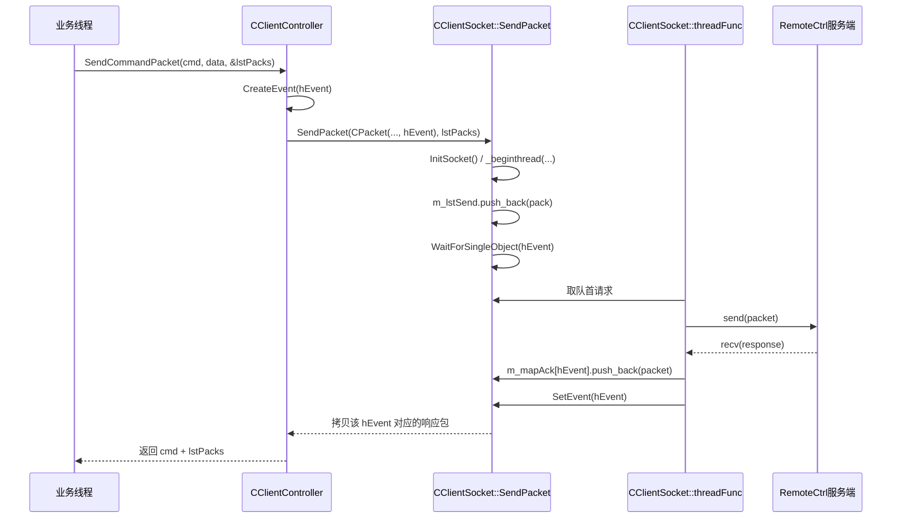
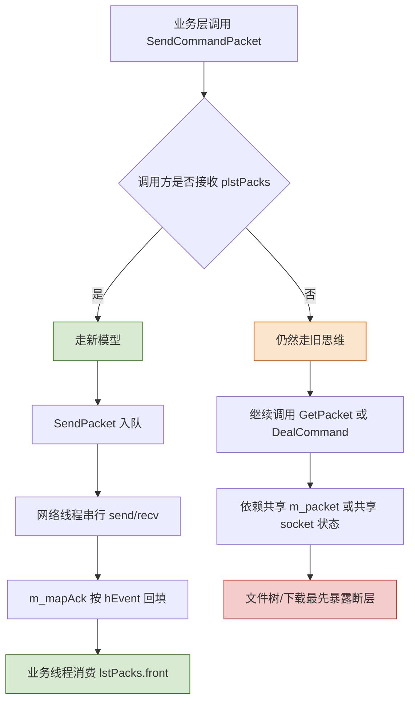

---
tags:
  - 项目/远控系统
heatmap_tracker: true
heatmap_group: 远控系统/6.网络与多线程问题
heatmap_weight: 1
git: "13584e1"
---

# 6.4 网络模型线程完善(2)

> 基于最新提交 `13584e1b4e5b1ecfca461ab84d5b465e3a43035a`。这一版的重点不再是“意识到要做网络线程”，而是开始把重构思路真正落到接口上：`CClientSocket` 逐步从“被多个业务线程直接调用的工具类”收口为“统一排队、统一收发、按请求归还结果”的网络中枢。`cmd=6` 截图链路已经开始吃到这套新模型，但 `cmd=2/4` 这类多包响应链路还没迁完，所以新的问题先在文件/文件夹场景暴露出来。

---

## 本次提交推进了什么

| 变化点 | 代码表现 | 真正含义 |
|------|------|------|
| `SendCommandPacket` 改接口 | 增加 `std::list<CPacket>* plstPacks` | 返回值不再只靠全局 `m_packet`，开始显式把响应交回调用方 |
| `CClientSocket` 增加 `SendPacket` 闭环 | 入队、等待 `hEvent`、拷贝 `m_mapAck` | 网络层第一次具备“请求 -> 等待 -> 取回应答”的完整路径 |
| 网络线程真正接上主流程 | `SendPacket()` 在首次发包时 `InitSocket()` 并启动 `threadEntry()` | 串行收发不再只是草图，至少单次请求已能走新通路 |
| 截图线程开始迁移 | `threadWatchScreen()` 改为消费 `lstPacks.front().strData` | 业务层开始摆脱 `GetPacket()` 这种共享结果读取方式 |
| Controller 去掉旧的发包消息入口 | 删除 `WM_SEND_PACK` / `WM_SEND_DATA` 相关映射与处理函数 | “发送串行化”不再由 Controller 消息线程承担，而是下沉到 Socket 层 |
| 文件树问题被放大 | `LoadFileCurrent()` / `LoadFileInfo()` 仍然走 `GetPacket()` + `DealCommand()` | 说明旧接口思维和新接口思维已经开始打架 |

---

## 与 [[6.4 网络模型线程完善(1)]] 的关系

上一版的核心结论是：

- 已经出现 `hEvent`
- 已经出现 `m_lstSend` 和 `m_mapAck`
- 但主链路还在 `Send()` + `DealCommand()`

这次提交真正往前迈了一步：

| 维度 | `6.4(1)` 阶段 | `6.4(2)` 阶段 |
|------|------|------|
| 请求标识 | `CPacket` 里已经带 `hEvent` | `hEvent` 开始参与实际等待与唤醒 |
| 网络线程 | `threadFunc()` 只是骨架 | `SendPacket()` 会启动线程并等待结果 |
| Controller 角色 | 仍然直接 `Send()` / `DealCommand()` | 改为调用 `SendPacket()`，开始把网络细节下沉 |
| 结果读取 | 主要依赖全局 `m_packet` | 新接口允许把响应放进 `plstPacks` |
| 适配范围 | 设计意图大于实际效果 | 单包命令已开始适配，多包命令仍未跟上 |

所以这次提交的准确定位不是“网络线程问题已经解决”，而是：

> **网络模型第一次真正接上线，但只闭环了一发一收的命令路径。**

---

## 重构思想

### 1. 把“谁能直接碰 socket”收口到 `CClientSocket`

旧设计里，`CClientController` 既像业务协调者，又像半个网络调度器：

- 有 `WM_SEND_PACK`
- 有 `WM_SEND_DATA`
- 有对应的 `OnSendPack()` / `OnSendData()`

这类设计的问题在于：**Controller 层知道得太多**。它不仅要组织业务，还要关心底层到底怎么发包、什么时候发包。

这次提交把这部分职责往下压：

```cpp
int CClientController::SendCommandPacket(int nCmd, bool bAutoClose,
    BYTE* pData, size_t nLength, std::list<CPacket>* plstPacks)
{
    CClientSocket* pClient = CClientSocket::getInstance();
    HANDLE hEvent = CreateEvent(NULL, TRUE, FALSE, NULL);
    std::list<CPacket> lstPacks;
    if (plstPacks == NULL)
        plstPacks = &lstPacks;
    pClient->SendPacket(CPacket(nCmd, pData, nLength, hEvent), *plstPacks);
    ...
}
```

现在 Controller 只表达一件事：

- 我想发什么命令
- 我附带什么数据
- 我想拿到哪些响应包

至于：

- 何时初始化 socket
- 何时启动网络线程
- 如何排队
- 如何等待
- 如何把响应按请求归类

这些都开始交给 `CClientSocket`。

这就是这次重构最核心的边界重画：**业务层描述请求，网络层负责调度请求。**

值得注意的是，这次并没有把上层业务全面改成“异步回调风格”，而是让 `SendPacket()` 内部通过 `WaitForSingleObject()` 把后台网络线程包装成一个对业务层仍然近似同步的接口。这是一种很典型的兼容式重构策略：

- 先稳住上层调用习惯
- 再替换底层实现方式
- 最后逐步清理旧接口残留

### 2. 用“请求级上下文”替代“全局共享结果”

这次接口改动最关键的地方，不是多了 `std::list<CPacket>* plstPacks` 这个参数本身，而是它代表的思路变化。

旧思路是：

```text
发命令
  -> 返回 cmd
  -> 再去全局 CClientSocket::GetPacket() 里拿数据
```

新思路是：

```text
发命令
  -> 把 hEvent 绑定进本次 CPacket
  -> 网络线程按 hEvent 收集响应
  -> 调用方拿回属于自己的 lstPacks
```

对应代码有两个支点：

```cpp
CPacket(WORD nCmd, const BYTE* pData, size_t nSize, HANDLE hEvent)
{
    ...
    this->hEvent = hEvent;
}
```

```cpp
auto pr = m_mapAck.insert(
    std::pair<HANDLE, std::list<CPacket>>(head.hEvent, std::list<CPacket>()));
pack.hEvent = head.hEvent;
pr.first->second.push_back(pack);
SetEvent(head.hEvent);
```

这里的设计含义非常明确：

- `sCmd` 用来区分命令类型
- `hEvent` 用来区分请求实例
- `m_mapAck` 用来把响应挂回正确的请求上下文

也就是说，这次重构已经不再把“最近一次收到的包”当作唯一事实来源，而是开始引入“**每个请求有自己的结果容器**”。

`plstPacks` 之所以设计成可选参数，也体现了这种“渐进迁移”思路：

- 老调用方暂时还能只关心返回的命令号
- 新调用方可以开始直接消费响应包列表
- 这样不需要一次性改掉所有业务入口

### 3. 把收包状态从共享成员挪进网络线程内部

`CClientSocket::threadFunc()` 里现在使用的是局部接收状态：

```cpp
std::string strBuffer;
strBuffer.resize(BUFFER_SIZE);
char* pBuffer = (char*)strBuffer.c_str();
int index = 0;
```

这和旧的 `DealCommand()` 很不一样。旧实现依赖：

- `m_buffer`
- `m_packet`
- `static size_t index`

这些状态一旦被多个线程交叉访问，就会把包边界、解析偏移、最近响应全部搅乱。

而当前的 `threadFunc()` 至少做对了一件关键事情：

> **让包解析状态跟着网络线程走，而不是继续暴露给所有业务线程共享。**

虽然这次迁移还没彻底做完，但方向已经很明确：

- 网络线程应该独占读 socket
- 网络线程应该独占解析缓冲区
- 业务线程不应该直接拼接字节流状态

### 4. 先迁“一发一收”路径，再逼出“一发多收”问题

这次提交没有一步到位解决所有命令，而是先把最容易闭环的路径迁进新模型。

目前最适合新模型的是 `cmd=6` 截图：

- 发一次命令
- 收一个截图包
- 唤醒等待线程
- 直接把 `strData` 转成图片

`threadWatchScreen()` 已经开始这样用：

```cpp
std::list<CPacket> lstPacks;
int ret = SendCommandPacket(6, true, NULL, 0, &lstPacks);
if (ret == 6)
{
    if (CEdoyunTool::Bytes2Image(m_remoteDlg.GetImage(),
        lstPacks.front().strData) == 0)
    {
        m_watchDlg.SetImageStatus(true);
    }
}
```

这一步的价值很大，因为它证明了：

- 新接口不是停留在设计图上
- 至少单响应命令已经能绕开 `GetPacket()` 工作

但也正因为截图路径先迁通了，文件树和下载这类复杂路径的断层就被立刻照出来了。

---

## 新模型调用链

### 单包命令已经开始走通



### 旧调用方式和新调用方式已经出现分叉



---

## 为什么文件/文件夹信息最先出问题

提交说明里提到“对于文件/文件夹信息获取发现新的问题”，原因并不神秘，本质上是：

> **新模型目前只完整覆盖了“一个请求换一个响应包”的场景，而文件树/下载属于“一个请求换多个响应包”的场景。**

### 1. `threadFunc()` 目前是“一次请求，先收一包再说”

当前代码里，网络线程对每个请求的处理流程是：

```cpp
CPacket& head = m_lstSend.front();
Send(head);
...
int length = recv(m_sock, pBuffer + index, BUFFER_SIZE - index, 0);
...
CPacket pack((BYTE*)pBuffer, size);
...
pr.first->second.push_back(pack);
SetEvent(head.hEvent);
m_lstSend.pop_front();
```

这里可以看出两个事实：

- 它现在只做了一次 `recv()`
- 解析出一个 `CPacket` 后就 `SetEvent()`

这对截图命令是够用的，对目录枚举和文件下载就不够了。

### 2. `RemoteClientDlg` 仍然按旧模式读文件树

`LoadFileCurrent()` 和 `LoadFileInfo()` 还保留着旧思路：

```cpp
int cCmd = CClientController::getInstance()->SendCommandPacket(
    2, false, (BYTE*)(LPCTSTR)strPath, strPath.GetLength());

PFILEINFO pInfo = (PFILEINFO)CClientSocket::getInstance()->GetPacket().strData.c_str();

while (pInfo->HasNext == TRUE)
{
    int cmd = CClientController::getInstance()->DealCommand();
    pInfo = (PFILEINFO)CClientSocket::getInstance()->GetPacket().strData.c_str();
}
```

问题在于，这段代码默认了两件事：

1. `SendCommandPacket()` 结束后，全局 `m_packet` 里已经放好了第一包结果
2. 后续还可以继续靠 `DealCommand()` 从同一个共享 socket 上把剩余结果读出来

但这次重构后的目标接口已经不是这个思路了。新接口要表达的是：

- `SendCommandPacket()` 应该把结果通过 `plstPacks` 交回来
- `threadFunc()` 应该按同一个请求持续收集多个包
- 调用方不该再去直接摸共享 `m_packet`

也就是说，**文件树代码之所以最先出问题，不是因为它写得差，而是因为它最依赖旧接口假设。**

### 3. 下载流程也处在同样的断层上

`threadDownloadFile()` 仍然是：

- 先 `SendCommandPacket(4, false, ...)`
- 再从 `GetPacket()` 里拿文件长度
- 然后循环 `DealCommand()` 读文件内容

这和文件树本质上一样，都是“发送入口开始重构了，但消费出口还没改”。

所以本次提交真正暴露出来的，是一个很典型的重构阶段性现象：

> **底层传输抽象已经变了，但高层业务还没全部切到新抽象上。**

---

## 当前版本的准确结论

### 已经做对的部分

- 把发送串行化的职责从 Controller 下沉到 `CClientSocket`
- 让 `SendCommandPacket()` 开始返回“属于本次请求的响应包”
- 让截图线程率先脱离 `GetPacket()` 的共享结果模型
- 让网络线程开始持有自己的接收缓冲和解析偏移

### 还没做完的部分

- `threadFunc()` 还只适配单包响应
- `LoadFileCurrent()` / `LoadFileInfo()` 还没有改成消费 `plstPacks`
- 下载流程仍然依赖 `GetPacket()` + `DealCommand()`
- `bAutoClose` 参数在新实现里基本退化成兼容性残留，语义还没有重新整理
- `m_lstSend` / `m_mapAck` 还没有互斥保护
- `CreateEvent()` 后没有看到 `CloseHandle(hEvent)`，存在句柄泄漏风险
- `GetImage()` 这种围绕全局 `m_packet` 的旧接口还没有彻底清理

因此，这次提交更准确的技术定位应该是：

> **网络层已经从“设计草图”进入“单包请求可运行”的阶段，但“一发多收”的命令族还没有完成迁移。**

---

## Win32 / Winsock 角度的重构意义

### 1. `CreateEvent` 在这里扮演的是“请求完成通知”

```cpp
HANDLE hEvent = CreateEvent(NULL, TRUE, FALSE, NULL);
```

它不是协议字段，也不是发给服务端的数据，而是客户端内部用来关联：

- 谁发起了请求
- 什么时候该唤醒等待方
- 应该去 `m_mapAck` 的哪一项里取结果

这说明当前网络层已经从“只看命令号”进入到“识别请求实例”的阶段。

### 2. `recv()` 仍然是字节流接口，所以多包问题不可能靠改一个函数签名自动消失

即使接口已经改成 `plstPacks`，底层仍然要面对：

- 一个 `recv()` 可能不够
- 一个请求可能对应多个 `CPacket`
- 包边界需要持续维护

这也是为什么本次重构先把单包命令迁通，而多包命令还得继续补完。

---

## 关联知识

- [[6.4 网络模型线程完善(1)]] - 上一版只把 `hEvent`、队列和 ACK 映射搭出骨架
- [[6.3 重构监控对话框]] - 监控线程已经迁到 Controller，这次继续把监控链路迁到新网络接口
- [[6.2 优化RemoteDlg线程]] - 多线程业务入口收口到 Controller 的前置步骤
- [[2.3 设计网络传输包协议]] - `CPacket` 的协议结构和包解析基础
- [[4.4 远程桌面显示功能设计与数据接收发送]] - `cmd=6` 截图链路的业务背景
- [[4.1 文件下载功能的实现]] - `cmd=4` 下载流程为什么天然是多包响应

---

## 代码索引

| 功能 | 文件 | 位置 |
|------|------|------|
| `CPacket` 携带 `hEvent` | `RemoteClient/CClientSocket.h` | 17-37, 144 |
| `SendPacket` 负责入队与等待 | `RemoteClient/CClientSocket.h` | 259-285 |
| 发送队列与 ACK 映射成员 | `RemoteClient/CClientSocket.h` | 323-324 |
| 网络线程收包与 `SetEvent` | `RemoteClient/CClientSocket.cpp` | 47-89 |
| `SendCommandPacket` 改为返回 `plstPacks` | `RemoteClient/ClientController.cpp` | 82-100 |
| 截图线程消费 `lstPacks` | `RemoteClient/ClientController.cpp` | 143-158 |
| 文件树仍然依赖 `GetPacket()` | `RemoteClient/RemoteClientDlg.cpp` | 245-319 |
| `SendCommandPacket` 新签名声明 | `RemoteClient/ClientController.h` | 53-58 |

---

## 更新记录

| 日期 | 变更 |
|------|------|
| 2026-03-21 | 初始版本：基于提交 `13584e1` 记录网络模型从骨架阶段进入“单包请求已接线”阶段，重点分析接口下沉、请求级结果回传和多包场景尚未迁完的重构断层 |
