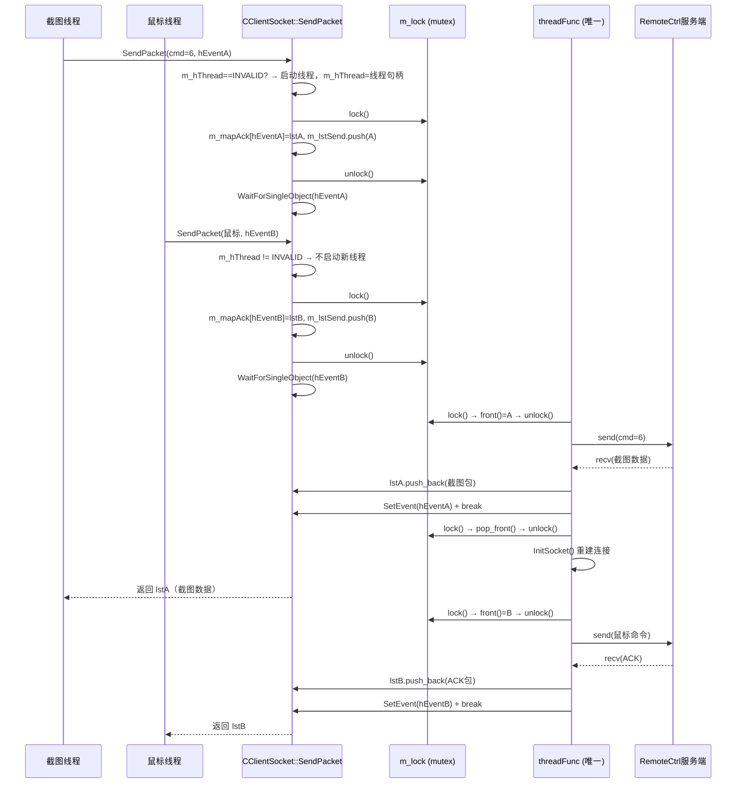

---
tags:
  - 项目/远控系统
heatmap_tracker: true
heatmap_group: 远控系统/6.网络与多线程问题
heatmap_weight: 1
git: "0893fd8"
---

# 6.4 网络模型线程完善(3)

> 基于提交 `0893fd8`。上一版（`13584e1`）已经让"单包请求"在新网络模型上跑通，但两个生产环境 Bug 随之暴露：截图命令与鼠标命令并发时程序卡死，以及截图数据量较大时接收线程不能正常退出。这次提交的核心工作是**修复这两个并发/循环逻辑 Bug，同时补齐 `SendPacket()` 的线程安全保护**，让单包命令路径真正稳定下来。

---

## 本次提交推进了什么

| 变化点 | 代码表现 | 真正含义 |
|------|------|------|
| `SendPacket()` 增加线程句柄判断 | `m_hThread == INVALID_HANDLE_VALUE` 双重检查 | 不再因 socket 重建间隙而重复启动网络线程 |
| `SendPacket()` 增加互斥锁 | `m_lock.lock()/unlock()` 包住队列/映射操作 | 多个业务线程并发调用不再产生数据竞争 |
| 修复重复 push_back | 删除 `m_lstSend.push_back(pack)` 的重复调用 | 每个请求只入队一次，不再被网络线程处理两遍 |
| `threadFunc()` 增加 break | `SetEvent(hEvent)` 后立即 `break` | isAutoClosed 命令收完单包即退出循环，不再阻塞 recv |
| `threadFunc()` 队列操作加锁 | `front()` 和 `pop_front()` 都在锁内执行 | 读写队首与出队操作与业务线程入队操作互斥 |
| 主循环增加 `Sleep(1)` | 队列为空时 `Sleep(1)` | 避免 CPU 空转，降低 busy-wait 消耗 |
| 每次请求后重连 | `pop_front()` 之后调用 `InitSocket()` | 为下一个请求预先建立新连接，复用线程不关闭 |

---

## 与 [[6.4 网络模型线程完善(2)]] 的关系

上一版的核心结论是：

> 网络模型第一次真正接上线，但只闭环了"一发一收"的命令路径。

这次提交是对这条已闭环路径的**加固**：

| 维度 | `6.4(2)` 阶段 | `6.4(3)` 阶段 |
|------|------|------|
| 线程安全 | `m_lstSend`/`m_mapAck` 无锁 | 所有共享容器操作加 `m_lock` |
| 多线程启动 | 多业务线程可同时启动多条网络线程 | 双重判断，全局只有一条网络线程 |
| recv 循环 | isAutoClosed 后无 break，可能继续阻塞 | 加 break，单包命令收完即退出 |
| 重复入队 | push_back 写了两次（疏漏） | 只入队一次，在锁内完成 |
| 请求间连接 | 每次 SendPacket 都可能重启线程 | 线程持续运行，每次请求后重建 socket |

---

## Bug 修复详解

### Bug 1：显示命令与鼠标命令冲突导致程序卡死

> 📎 详见 [[Debug-013 显示命令与鼠标命令冲突导致程序卡死]]

**根因**：`SendPacket()` 只用 `m_sock == INVALID_SOCKET` 判断是否启动线程，而 socket 在每次请求完成后都会被关闭重建，导致并发的业务线程同时看到 `INVALID_SOCKET` 并各自启动新线程，多线程无锁竞争队列。

**修复前**：

```cpp
bool CClientSocket::SendPacket(const CPacket& pack, ...)
{
    if (m_sock == INVALID_SOCKET)
    {
        _beginthread(&CClientSocket::threadEntry, 0, this);  // 不保存句柄
    }
    m_lstSend.push_back(pack);
    m_lstSend.push_back(pack);  // 重复入队（BUG）
    WaitForSingleObject(pack.hEvent, INFINITE);
    ...
}
```

**修复后**：

```cpp
bool CClientSocket::SendPacket(const CPacket& pack, std::list<CPacket>& lstPacks, bool isAutoClosed)
{
    // ===== 1. 双重判断：socket 无效 AND 线程不存在，才启动线程 =====
    // m_hThread 初始为 INVALID_HANDLE_VALUE
    // 每次请求间 socket 会关闭重建，但线程句柄保存了线程的存活状态
    if (m_sock == INVALID_SOCKET && m_hThread == INVALID_HANDLE_VALUE)
    {
        // 保存线程句柄，后续判断线程是否存活
        m_hThread = (HANDLE)_beginthread(&CClientSocket::threadEntry, 0, this);
        TRACE("start thread\r\n");
    }

    // ===== 2. 加锁后批量写入共享数据结构 =====
    m_lock.lock();
    // 将响应列表引用绑定到 hEvent
    auto pr = m_mapAck.insert(std::pair<HANDLE, std::list<CPacket>&>(pack.hEvent, lstPacks));
    // 记录该请求是否为自动关闭模式（isAutoClosed：单包响应后立即结束）
    m_mapAutoClosed.insert(std::pair<HANDLE, bool>(pack.hEvent, isAutoClosed));
    // 入队，只入一次
    m_lstSend.push_back(pack);
    m_lock.unlock();

    TRACE("cmd:%d event %08X thread id %d\r\n", pack.sCmd, pack.hEvent, GetCurrentThreadId());

    // ===== 3. 等待网络线程处理完成 =====
    WaitForSingleObject(pack.hEvent, INFINITE);
    ...
}
```

**关键点解析**：

1. **`m_hThread` 的作用**
   - `_beginthread` 返回值类型是 `uintptr_t`，转型为 `HANDLE` 保存
   - 每次请求间虽然 socket 被关闭，但线程仍在运行（`while(m_sock != INVALID_SOCKET)` 在 `InitSocket()` 重建后继续）
   - 业务线程只要检测到 `m_hThread != INVALID_HANDLE_VALUE` 就知道网络线程还活着

2. **为什么用双重判断而不是只判断线程**
   - 首次调用时，`m_hThread` 和 `m_sock` 都是 `INVALID_HANDLE_VALUE`/`INVALID_SOCKET`
   - 线程终止后（如网络断开），`m_hThread` 需要手动置回 `INVALID_HANDLE_VALUE`，否则也能判断
   - 双重判断更保守、更容易推理

3. **`m_lock` 的类型**
   - `m_lock` 是 `std::mutex`（见 `CClientSocket.h`）
   - `lock()/unlock()` 覆盖的区间包括了 `m_mapAck`、`m_mapAutoClosed`、`m_lstSend` 的写入

---

### Bug 2：显示内容变化过大导致接收程序卡死

> 📎 详见 [[Debug-014 显示内容变化过大导致接收程序卡死]]

**根因**：`threadFunc()` 的 recv 循环中，`isAutoClosed=true` 的命令在 `SetEvent()` 后没有 `break`，导致：
- 若数据量大、第一次 recv 只收到部分包：解析失败 → 不调用 SetEvent → do-while 因条件 false 直接退出 → 业务线程永远等待
- 若 recv 收到完整包：SetEvent 后没有 break，线程可能再次进入 recv 阻塞，队列积压

**修复前**：

```cpp
do {
    int length = recv(m_sock, pBuffer + index, BUFFER_SIZE - index, 0);
    if ((length > 0) || (index > 0))
    {
        ...
        if (size > 0)
        {
            ...
            if (it0->second)
            {
                SetEvent(head.hEvent);
                // ← 没有 break，do-while 继续判断条件
            }
        }
    }
    ...
} while (it0->second == false);  // isAutoClosed=true → 条件 false → 退出，但 SetEvent 之后已多做了一次判断
```

**修复后**：

```cpp
do {
    int length = recv(m_sock, pBuffer + index, BUFFER_SIZE - index, 0);
    TRACE("recv %d %d \r\n", length, index);
    if ((length > 0) || (index > 0))
    {
        index += length;
        size_t size = (size_t)index;

        // CPacket 构造函数解析缓冲区：
        // - 成功：size = 该包总字节数，pBuffer 中已消费部分被 memmove 移走
        // - 失败：size = 0，需要继续等更多数据
        CPacket pack((BYTE*)pBuffer, size);

        if (size > 0)
        {
            pack.hEvent = head.hEvent;
            it->second.push_back(pack);
            memmove(pBuffer, pBuffer + size, index - size);
            index -= size;
            TRACE("SetEvent %d %d\r\n", pack.sCmd, it0->second);

            if (it0->second)  // isAutoClosed == true（单包响应命令，如截图 cmd=6）
            {
                SetEvent(head.hEvent);   // 通知业务线程：包已到达
                break;                   // ← 修复：立即退出循环，不再阻塞 recv
            }
        }
        // 若 size == 0：数据不完整，继续 do-while（仅当 isAutoClosed=false 时进入下一轮）
    }
    else if (length <= 0 && index <= 0)
    {
        // 连接断开：关闭 socket，通知等待方
        CloseSocket();
        SetEvent(head.hEvent);
        m_mapAutoClosed.erase(it0);
        break;
    }
} while (it0->second == false);  // isAutoClosed=false（多包命令）才继续循环等更多包
```

**关键点解析**：

1. **`do-while` 与 `break` 的分工**

   ```
   do-while 控制"是否继续收包":
     - isAutoClosed=false（多包命令）: 收完一包继续等下一包
     - isAutoClosed=true（单包命令）: while 条件为 false，本应自然退出

   break 控制"提前退出":
     - 单包命令收到后: SetEvent + break，不让线程再次进入 recv()
   ```

2. **为什么 `break` 是必要的，而不是 `while` 条件已经够用**
   - 在 `SetEvent()` 和 `break` 之间，如果没有 `break`，`do-while` 会执行完本轮循环体，再去判断 `while(false)`
   - 如果本轮循环体还有其他代码或下一次 recv 调用，会造成不必要的阻塞
   - `break` 确保"刚好在 SetEvent 之后"退出，语义最清晰

3. **`isAutoClosed` 的语义**

   | `isAutoClosed` | 命令类型 | recv 行为 |
   |----------------|---------|---------|
   | `true` | 截图（cmd=6）、单包 ACK | 收到一包立即 SetEvent + break |
   | `false` | 文件树（cmd=2）、下载（cmd=4）| 循环收多包，直到 HasNext=false 再 SetEvent |

---

## `threadFunc()` 完整流程

```
threadFunc() 启动
  │
  ├── InitSocket() ← 建立连接
  │
  └── while(m_sock != INVALID_SOCKET) 主循环
        │
        ├── m_lstSend 为空 → Sleep(1) → 继续等待
        │
        └── m_lstSend 有请求
              │
              ├── m_lock.lock() → front() → m_lock.unlock()  ← 加锁取队首
              │
              ├── Send(head) ← 发送请求包到服务端
              │
              ├── m_mapAck.find(head.hEvent) ← 找到响应容器
              │
              └── do-while 收包循环
                    │
                    ├── recv() ← 读取服务端响应
                    │
                    ├── CPacket 解析
                    │     ├── 成功（size>0）→ push 到 it->second
                    │     │     ├── isAutoClosed=true → SetEvent + break
                    │     │     └── isAutoClosed=false → 继续 do-while
                    │     └── 失败（size=0）→ 继续 do-while（isAutoClosed=false 时）
                    │
                    └── 连接断开 → CloseSocket + SetEvent + break
              │
              ├── m_lock.lock() → pop_front() → m_lock.unlock()  ← 出队
              │
              └── InitSocket() ← 为下一次请求重建连接
```

---

## 完整 `threadFunc()` 代码

**技术栈**：
- `std::mutex::lock()/unlock()`：C++11 互斥锁，保护共享容器
- `recv()`：Winsock 字节流接收，可能返回部分数据
- `SetEvent()`：Win32 事件对象，唤醒 `WaitForSingleObject` 等待方
- `memmove()`：处理缓冲区中已解析数据的移除，保留剩余未解析字节
- `Sleep(1)`：礼让 CPU，防止空转

> 📁 `RemoteClient/CClientSocket.cpp` : threadFunc (行 88-145)

```cpp
void CClientSocket::threadFunc()
{
    // ===== 1. 接收缓冲区（线程私有，不与业务线程共享）=====
    std::string strBuffer;
    strBuffer.resize(BUFFER_SIZE);
    char* pBuffer = (char*)strBuffer.c_str();
    int index = 0;  // 当前缓冲区已积累的未解析字节数

    // ===== 2. 建立连接 =====
    InitSocket();

    // ===== 3. 主循环 =====
    while (m_sock != INVALID_SOCKET)
    {
        if (m_lstSend.size() > 0)
        {
            TRACE("lstSend size: %d\r\n", m_lstSend.size());

            // ===== 3.1 取队首（加锁）=====
            m_lock.lock();
            CPacket& head = m_lstSend.front();
            m_lock.unlock();

            // ===== 3.2 发送请求 =====
            if (Send(head) == false)
            {
                TRACE("send failed!\r\n");
                continue;
            }

            // ===== 3.3 找响应容器 =====
            std::map<HANDLE, std::list<CPacket>&>::iterator it;
            it = m_mapAck.find(head.hEvent);
            if (it != m_mapAck.end())
            {
                std::map<HANDLE, bool>::iterator it0 = m_mapAutoClosed.find(head.hEvent);
                do {
                    int length = recv(m_sock, pBuffer + index, BUFFER_SIZE - index, 0);
                    TRACE("recv %d %d \r\n", length, index);

                    if ((length > 0) || (index > 0))
                    {
                        index += length;
                        size_t size = (size_t)index;

                        // 尝试解析一个完整的 CPacket
                        CPacket pack((BYTE*)pBuffer, size);  // size 被修改为包长（或 0）
                        if (size > 0)
                        {
                            pack.hEvent = head.hEvent;
                            it->second.push_back(pack);     // 放入响应容器

                            // 移除已解析部分，保留剩余字节
                            memmove(pBuffer, pBuffer + size, index - size);
                            index -= size;

                            TRACE("SetEvent %d %d\r\n", pack.sCmd, it0->second);
                            if (it0->second)  // isAutoClosed=true
                            {
                                SetEvent(head.hEvent);  // 唤醒业务线程
                                break;                  // 退出 recv 循环
                            }
                        }
                        // size=0 时（包不完整），do-while 继续接收
                    }
                    else if (length <= 0 && index <= 0)
                    {
                        // 连接断开
                        CloseSocket();
                        SetEvent(head.hEvent);
                        m_mapAutoClosed.erase(it0);
                        TRACE("SetEvent %d %d\r\n", head.sCmd, it0->second);
                        break;
                    }
                } while (it0->second == false);  // isAutoClosed=false 时持续收多包
            }

            // ===== 3.4 出队（加锁）=====
            m_lock.lock();
            m_lstSend.pop_front();
            m_lock.unlock();

            // ===== 3.5 为下一请求重建连接 =====
            if (InitSocket() == false)
            {
                InitSocket();  // 重试一次
            }
        }
        Sleep(1);  // 队列为空时礼让 CPU
    }
    CloseSocket();
}
```

---

## 新模型调用链（修复后）



---

## 当前版本的准确结论

### 已经做对的部分

- 单条网络线程的唯一性得到保证（双重判断 + 句柄保存）
- 并发业务线程写入共享容器有互斥保护（`m_lock`）
- 单包响应命令（`isAutoClosed=true`）的 recv 循环能正确退出（`break`）
- 网络线程在请求间重建连接，持续服务后续命令
- `Sleep(1)` 避免队列为空时 CPU 空转

### 还没做完的部分

- `threadFunc()` 仍然只支持"每次 recv 要么收到完整包，要么解析失败退出"，**分多次 recv 才能拼完整包的场景**（大数据）还没有持续收包的逻辑
- `LoadFileCurrent()` / `LoadFileInfo()` 仍然依赖 `GetPacket()` + `DealCommand()` 的旧接口
- 下载流程（cmd=4）仍未迁移到 `plstPacks` 新模型
- `CreateEvent()` 创建的 `hEvent` 在 `SendCommandPacket()` 中仍未 `CloseHandle()`，存在句柄泄漏风险
- `m_hThread` 在线程自然退出后没有被重置为 `INVALID_HANDLE_VALUE`，重连时判断逻辑需要进一步完善

> 本次提交的准确定位：**把"单包请求已接线"阶段从"能跑但偶尔卡死"推进到"并发安全、稳定可用"。**

---

## Win32 API 详解

### `_beginthread` 的返回值与线程句柄

```cpp
uintptr_t _beginthread(
    void (_cdecl *start_address)(void*),  // 线程函数
    unsigned stack_size,                  // 栈大小（0=默认）
    void* arglist                         // 传给线程函数的参数
);
```

| 返回值 | 含义 |
|--------|------|
| `(uintptr_t)(-1)` | 创建失败 |
| 其他值 | 线程句柄（但注意：`_beginthread` 创建的线程结束时**自动关闭句柄**） |

**与 `_beginthreadex` 的区别**：

| API | 句柄管理 | 线程结束 |
|-----|---------|---------|
| `_beginthread` | 线程结束后**自动**关闭句柄，保存的句柄变为悬空句柄 | 需谨慎使用保存的句柄 |
| `_beginthreadex` | 线程结束后句柄仍有效，需手动 `CloseHandle` | 可安全等待线程结束 |

> 当前代码使用 `_beginthread`，`m_hThread` 在线程结束后可能成为悬空句柄，后续可考虑改为 `_beginthreadex` 并正确 `CloseHandle`。

### `std::mutex` 基本用法

```cpp
std::mutex m_lock;  // 成员变量

m_lock.lock();      // 阻塞等待锁可用，然后上锁
// ... 临界区操作
m_lock.unlock();    // 释放锁

// 更安全的 RAII 写法（当前代码未使用，但建议后续重构时采用）
{
    std::lock_guard<std::mutex> guard(m_lock);
    // ... 临界区操作
}  // 析构时自动 unlock，异常安全
```

---

## 易错点与调试

> [!warning] 多线程问题的核心：共享状态必须有明确的所有权或互斥保护

### 1. 用 socket 状态代替线程存活状态

```cpp
// ❌ 错误：socket 会在请求间短暂关闭，导致误判
if (m_sock == INVALID_SOCKET)
    _beginthread(...);

// ✅ 正确：用线程句柄判断线程是否存在
if (m_sock == INVALID_SOCKET && m_hThread == INVALID_HANDLE_VALUE)
    m_hThread = (HANDLE)_beginthread(...);
```

### 2. do-while 中 SetEvent 后未 break

```cpp
// ❌ 错误：SetEvent 后循环还可能继续执行
if (it0->second)
    SetEvent(head.hEvent);
// 此处缺少 break，即使 while 条件为 false，本轮循环体剩余代码仍会执行

// ✅ 正确：立即退出
if (it0->second)
{
    SetEvent(head.hEvent);
    break;
}
```

### 3. 忘记给容器操作加锁

```cpp
// ❌ 错误：多线程同时写，std::list/std::map 不是线程安全的
m_lstSend.push_back(pack);

// ✅ 正确：锁住整个"读-改-写"操作
m_lock.lock();
m_lstSend.push_back(pack);
m_lock.unlock();
```

---

## 关联知识

- [[Debug-013 显示命令与鼠标命令冲突导致程序卡死]] — Bug 1：多线程竞争导致卡死
- [[Debug-014 显示内容变化过大导致接收程序卡死]] — Bug 2：recv 循环缺少 break
- [[6.4 网络模型线程完善(2)]] — 上一版：新模型接线，但无锁、无 break
- [[6.4 网络模型线程完善(1)]] — 两版之前：骨架搭建，主链路仍走旧模式
- [[2.3 设计网络传输包协议]] — `CPacket` 的协议格式与解析逻辑
- [[4.4 远程桌面显示功能设计与数据接收发送]] — `cmd=6` 截图链路的业务背景

---

## 代码索引

| 功能 | 文件 | 位置 |
|------|------|------|
| `InitSocket()` 独立方法 | `RemoteClient/CClientSocket.cpp` | 行 43-71 |
| `SendPacket()` 双重判断 + 互斥锁 | `RemoteClient/CClientSocket.cpp` | 行 73-100 |
| `threadFunc()` 加锁取队首 | `RemoteClient/CClientSocket.cpp` | 行 115-118 |
| `threadFunc()` isAutoClosed break | `RemoteClient/CClientSocket.cpp` | 行 139-143 |
| `threadFunc()` 加锁出队 + 重连 | `RemoteClient/CClientSocket.cpp` | 行 152-160 |
| `m_hThread` 成员变量 | `RemoteClient/CClientSocket.h` | — |

---

## 更新记录

| 日期 | 变更 |
|------|------|
| 2026-03-23 | 初始版本：基于提交 `0893fd8`，记录两个并发 Bug 的修复、threadFunc 完整代码注解、以及与前两篇笔记的演进对比 |

---

## 三版演进汇总

> 以下对 [[6.4 网络模型线程完善(1)]]、[[6.4 网络模型线程完善(2)]]、本篇（3）的整体演进做一次汇总，方便回顾网络模型的完整重构过程。

### 三个阶段的核心主题

| 版本 | commit | 核心主题 | 用一句话描述 |
|------|--------|---------|------------|
| **(1)** | `56ff64e` | 意识到问题，搭骨架 | 找对方向，但主链路仍走旧模式 |
| **(2)** | `13584e1` | 第一次接线，单包跑通 | 新模型接上，截图命令可走新路径 |
| **(3)** | `0893fd8` | 修复并发 Bug，稳定单包路径 | 无锁问题和循环缺陷修复，单包命令真正稳定 |

---

### 关键设计决策的演进

#### 1. "谁负责发包"的演进

```
(1) 阶段: SendCommandPacket → Send() → DealCommand()（业务线程自己收发）

(2) 阶段: SendCommandPacket → SendPacket() → 入队 + 等待 hEvent
         threadFunc() 负责真正的 send/recv（网络线程串行）

(3) 阶段: 同 (2)，但增加了 m_lock 保护，保证线程安全
```

#### 2. "如何等待响应"的演进

```
(1) 阶段: DealCommand() 同步阻塞（当前线程自己 recv）
         hEvent 已出现但未参与实际等待

(2) 阶段: WaitForSingleObject(hEvent) 等待网络线程 SetEvent
         m_mapAck 按 hEvent 分流响应

(3) 阶段: 同 (2)，修复了 isAutoClosed 时 recv 循环缺少 break 的问题
```

#### 3. "多线程安全"的演进

```
(1) 阶段: 无任何互斥，共享 socket/buffer/m_packet 完全暴露
         主链路不走新模型，所以问题还没完全爆发

(2) 阶段: 新模型接上后，m_lstSend/m_mapAck 成为真正的共享状态
         但没有加锁，多业务线程并发时产生竞争

(3) 阶段: m_lock 覆盖所有共享容器的读写
         双重判断防止多网络线程启动
         每个共享数据结构的生命周期变得清晰
```

---

### 还在等待完成的工作

```
优先级高（影响功能正确性）:
  1. 分多次 recv 才能拼出完整包的处理（大数据、多包命令）
  2. LoadFileCurrent/LoadFileInfo 迁移到 plstPacks 接口
  3. 文件下载流程（cmd=4）迁移

优先级中（影响稳定性）:
  4. CreateEvent 之后的 CloseHandle（句柄泄漏）
  5. m_hThread 线程结束后的状态重置

优先级低（代码质量）:
  6. 用 std::lock_guard 替代手动 lock/unlock（异常安全）
  7. _beginthread 改为 _beginthreadex（句柄语义更清晰）
```

### 一张图看懂三版演进


