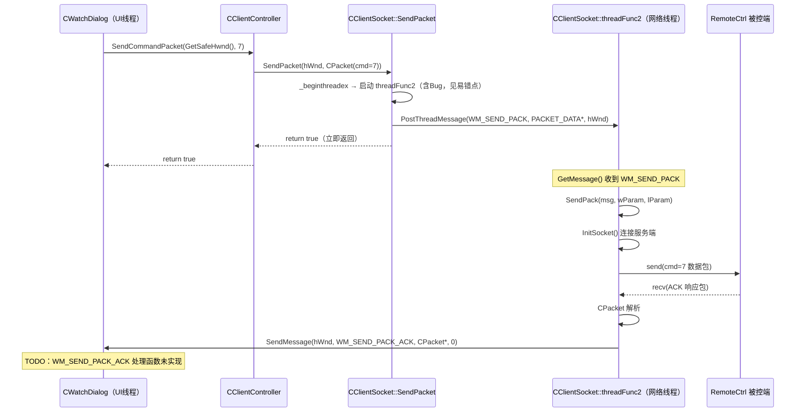

---
tags:
  - 项目/远控系统
heatmap_tracker: true
heatmap_group: 远控系统/6.网络与多线程问题
heatmap_weight: 1
git: "34aee5f"
---

# 6.5 重构网络模块（线程事件机制→消息机制）

> 基于提交 `34aee5f`。这次提交完成了一次根本性的架构转变：将 `CClientSocket` 的网络通信模型从**线程事件阻塞机制**（`WaitForSingleObject + SetEvent`）彻底重构为**Windows 消息机制**（`PostThreadMessage + WM_SEND_PACK_ACK`），让网络线程拥有一套标准的消息泵，上层调用不再阻塞，响应通过 `HWND` 回调窗口消息交付。

---

## 本次提交推进了什么

| 变化点 | 旧实现 | 新实现 |
|------|------|------|
| `SendPacket` 签名 | `(CPacket, lstPacks&, isAutoClosed)` - 阻塞等待 | `(HWND, CPacket, isAutoClosed)` - 投递消息立即返回 |
| 调用线程行为 | `WaitForSingleObject(hEvent)` 阻塞等响应 | `PostThreadMessage` 投递后立即返回，**完全非阻塞** |
| 结果传递方式 | `lstPacks` 引用 + `hEvent` 信号 | `SendMessage(hWnd, WM_SEND_PACK_ACK, CPacket*, 0)` |
| 网络线程循环 | `while(m_sock) { Sleep(1); 轮询队列 }` | `while(GetMessage(&msg)) { ... }` 消息泵 |
| 线程启动方式 | `_beginthread` | `_beginthreadex` + `_endthreadex` |
| 旧 `threadFunc()` | 负责收发的工作线程 | **完全注释掉**，由 `threadFunc2()` 取代 |
| `SendCommandPacket` 返回值 | `int`（命令号，< 0 则错误） | `bool`（true=投递成功，false=失败） |
| `SendCommandPacket` 参数 | `(nCmd, bAutoClose, pData, nLength, plstPacks)` | `(HWND, nCmd, bAutoClose, pData, nLength)` |

---

## 与 [[6.4 网络模型线程完善(3)]] 的关系

上一版（`0893fd8`）的结论：

> 线程事件模型已经稳定，单包路径并发安全，但仍有多包迁移、句柄泄漏等待完成。

这次提交选择了**更彻底的方向**——不是继续修补事件模型，而是直接换成消息机制：

| 维度 | `6.4(3)` 阶段（事件机制） | `6.5` 阶段（消息机制） |
|------|------|------|
| 调用方是否阻塞 | **是**，`WaitForSingleObject` 一直等到响应 | **否**，`PostThreadMessage` 投递后立即返回 |
| 结果传递 | `lstPacks` + `hEvent` 信号 | `SendMessage(hWnd, WM_SEND_PACK_ACK)` |
| 线程同步工具 | Win32 Event + `mutex` | 无锁，消息队列天然串行 |
| 线程数管理 | 双重判断防重复启动 | `_beginthreadex` 一次性创建（含 Bug，见下文） |
| 句柄泄漏风险 | `CreateEvent` 未 `CloseHandle` | 彻底移除 Event，不再泄漏 |

---

## 架构设计

### 两种机制的本质区别

**旧机制（线程事件）**：

```
业务线程                        网络线程(threadFunc)
─────────────                   ─────────────────────
SendPacket()
  → 创建 hEvent
  → 入队 m_lstSend
  → WaitForSingleObject(hEvent)  ←── 阻塞在这里
      ↓ 阻塞                     取队首 → send() → recv()
      ↓                          → m_mapAck[hEvent].push_back(pack)
      ↓                          → SetEvent(hEvent) ──────────────→ 唤醒
  → 读取 lstPacks
  → 返回
```

**新机制（消息机制）**：

```
业务线程                        网络线程(threadFunc2，消息泵)
─────────────                   ──────────────────────────────
SendPacket(hWnd, pack)
  → 序列化 pack 到 PACKET_DATA
  → PostThreadMessage(WM_SEND_PACK, PACKET_DATA*, hWnd)
  → 立即返回 ✓                   GetMessage() 收到 WM_SEND_PACK
                                  → SendPack(nMsg, wParam, lParam)
                                    → InitSocket() → send() → recv()
                                    → 解析 CPacket
                                    → SendMessage(hWnd, WM_SEND_PACK_ACK, CPacket*, 0)
                                       ↓
窗口 WndProc 收到 WM_SEND_PACK_ACK
  → 处理响应数据（TODO 待实现）
```

### 组件关系

| 组件 | 职责 | 变化 |
|------|------|------|
| `CClientSocket::SendPacket` | 序列化包 + 投递消息 | 参数从 `lstPacks` 改为 `HWND` |
| `CClientSocket::threadFunc2` | Windows 消息泵循环 | 新替换 `threadFunc` |
| `CClientSocket::SendPack` | 实际 send/recv 处理器 | 完善了结果回调逻辑 |
| `PACKET_DATA` | 传递"包数据 + 模式标志" | 新增结构体 |
| `WM_SEND_PACK_ACK` | 通知上层窗口响应已到达 | 新增消息定义 |
| `CClientController::SendCommandPacket` | 业务入口 | 签名变更，首参改为 `HWND` |

---

## 核心实现

### 1. 新数据结构：`PACKET_DATA`

**技术栈**：标准 C++ struct，POD 风格

**设计思路**：`PostThreadMessage` 的 `wParam` 只能传一个指针，但投递时需要同时携带**序列化后的包数据**和**模式标志**（是否自动关闭连接）。`PACKET_DATA` 是这两者的载体。

> 📁 `RemoteClient/CClientSocket.h`

```cpp
// CSM = Client Socket Mode，自动关闭模式标志
enum
{
    CSM_AUTOCLOSE = 1,
};

typedef struct PacketData
{
    std::string strData;  // 序列化后的完整包（含包头、命令码、数据、校验和）
    UINT nMode;           // 模式标志：CSM_AUTOCLOSE 表示收到响应后关闭连接

    PacketData(const char* pData, size_t nLen, UINT mode)
    {
        strData.resize(nLen);
        memcpy((char*)strData.c_str(), pData, nLen);
        nMode = mode;
    }

    PacketData(const PacketData& data)
    {
        strData = data.strData;
        nMode = data.nMode;
    }
}PACKET_DATA;
```

**关键点**：
- `strData` 存储的是 `CPacket::Data()` 序列化后的字节流，不是原始数据
- 通过 `new PACKET_DATA(...)` 在堆上分配，经 `wParam` 传递；**接收方必须 `delete`**
- `nMode` 传递 `isAutoClosed` 语义，告诉 `SendPack` 收完一包是否关闭 socket

---

### 2. `SendPacket`：从"阻塞等待"变为"投递消息"

**技术栈**：
- `PostThreadMessage`：向指定线程的消息队列投递消息（**不等待处理**）
- `_beginthreadex`：创建线程，比 `_beginthread` 多返回可控制的句柄

> 📁 `RemoteClient/CClientSocket.cpp` : SendPacket (行 119-131)

```cpp
bool CClientSocket::SendPacket(HWND hWnd, const CPacket& pack, bool isAutoClosed)
{
    // ===== 1. 启动网络线程（含 Bug：见易错点）=====
    if (m_hThread = INVALID_HANDLE_VALUE)   // ← ⚠️ Bug：= 应为 ==（见 Debug-015）
    {
        // _beginthreadex：创建线程，返回线程句柄（调用方负责 CloseHandle）
        // 第5参数：CREATE_SUSPENDED(挂起) 或 0(直接运行)
        // 第6参数：线程 ID 输出
        m_hThread = (HANDLE)_beginthreadex(NULL, 0, &CClientSocket::threadEntry, this, 0, &m_nThreadID);
    }

    // ===== 2. 准备消息负载 =====
    UINT nMode = isAutoClosed ? CSM_AUTOCLOSE : 0;
    std::string strOut;
    pack.Data(strOut);  // 将 CPacket 序列化为字节流（包头+命令码+数据+校验）

    // ===== 3. 投递消息到网络线程 =====
    // PostThreadMessage：异步投递，调用方立即返回
    // wParam：堆上分配的 PACKET_DATA 指针（接收方 SendPack 负责 delete）
    // lParam：响应的目标窗口句柄
    return PostThreadMessage(
        m_nThreadID,                                           // 目标线程 ID
        WM_SEND_PACK,                                          // 消息类型
        (WPARAM)new PACKET_DATA(strOut.c_str(), strOut.size(), nMode),  // 包数据
        (LPARAM)hWnd                                           // 回调窗口
    );
}
```

**`PostThreadMessage` 与 `SendMessage` 的区别**：

| API | 同步性 | 目标 | 失败条件 |
|-----|-------|------|---------|
| `PostThreadMessage` | **异步**，投递后立即返回 | 线程消息队列 | 目标线程无消息泵 |
| `SendMessage` | **同步**，等待处理完成才返回 | 窗口句柄 | 窗口不存在 |
| `PostMessage` | 异步 | 窗口句柄 | 消息队列满 |

> `PostThreadMessage` 适合"发出去就不管了"的场景；`SendMessage` 适合"需要等对方处理完才继续"。

---

### 3. `threadFunc2`：Windows 消息泵

**技术栈**：
- `GetMessage`：从消息队列取消息，无消息时**阻塞等待**，`WM_QUIT` 时返回 0
- `TranslateMessage`：将键盘虚键消息翻译为字符消息（对网络线程无实际作用，但保持标准结构）
- `DispatchMessage`：将消息分发给窗口过程（线程消息无关联窗口，此处 dispatch 为 NULL）

> 📁 `RemoteClient/CClientSocket.cpp` : threadFunc2

```cpp
void CClientSocket::threadFunc2()
{
    MSG msg;
    // GetMessage 返回 0 时（WM_QUIT）退出循环，线程结束
    while (::GetMessage(&msg, NULL, 0, 0))
    {
        TranslateMessage(&msg);     // 标准消息处理流程
        DispatchMessage(&msg);      // 线程消息无窗口，此处不分发给窗口过程

        // 查找消息号对应的处理函数
        if (m_mapFunc.find(msg.message) != m_mapFunc.end())
        {
            (this->*m_mapFunc[msg.message])(msg.message, msg.wParam, msg.lParam);
        }
        // 未注册的消息：忽略
    }
}
```

**消息注册机制**（在构造函数中完成）：

```cpp
struct
{
    UINT message;
    MSGFUNC func;
}funcs[] = {
    {WM_SEND_PACK, &CClientSocket::SendPack},  // WM_USER+1 → 调用 SendPack
    {0, NULL}
};

for (int i = 0; funcs[i].message != 0; i++)
{
    m_mapFunc.insert(std::pair<UINT, MSGFUNC>(funcs[i].message, funcs[i].func));
}
```

**关键点解析**：

1. **为什么用消息泵代替轮询？**
   - 旧 `threadFunc` 用 `while + Sleep(1)` 轮询 `m_lstSend`，CPU 即使空闲也在转
   - `GetMessage` 在无消息时让线程休眠（OS 级别调度），**零 CPU 空转**
   - 消息投递天然串行：`PostThreadMessage` 之间有序排队，无需 `mutex`

2. **`GetMessage(msg, NULL, 0, 0)` 的第二参数为 NULL**
   - 第二参数是窗口句柄过滤，`NULL` 表示接收**所有线程消息**（包括 `PostThreadMessage` 投递的）
   - 若填写具体 `HWND`，则只收该窗口的消息

3. **`DispatchMessage` 对线程消息无效**
   - `DispatchMessage` 找到消息关联的窗口过程并调用它
   - 通过 `PostThreadMessage` 投递的消息没有关联窗口（`hwnd` 字段为 `NULL`）
   - 所以消息分发完全依赖下面的 `m_mapFunc` 查表

---

### 4. `SendPack`：实际发包 + 接收 + 回调窗口

**技术栈**：
- `send()`：Winsock TCP 发送
- `recv()`：TCP 接收（可能多次才收完一个完整包）
- `::SendMessage(hWnd, WM_SEND_PACK_ACK, ...)`：同步通知上层窗口

> 📁 `RemoteClient/CClientSocket.cpp` : SendPack

```cpp
void CClientSocket::SendPack(UINT nMsg, WPARAM wParam, LPARAM lParam)
{
    // ===== 1. 取出包数据，释放堆内存 =====
    PACKET_DATA data = *(PACKET_DATA*)wParam;
    delete (PACKET_DATA*)wParam;        // 必须释放！发送方 new，接收方 delete
    HWND hWnd = (HWND)lParam;

    // ===== 2. 建立连接，发送请求 =====
    if (InitSocket() == true)
    {
        int ret = send(m_sock, (char*)data.strData.c_str(), (int)data.strData.size(), 0);

        if (ret > 0)
        {
            // ===== 3. 接收响应循环 =====
            size_t index = 0;
            std::string strBuffer;
            strBuffer.resize(BUFFER_SIZE);
            char* pBuffer = (char*)strBuffer.c_str();

            while (m_sock != INVALID_SOCKET)
            {
                int length = recv(m_sock, pBuffer + index, BUFFER_SIZE - index, 0);

                if (length > 0 || (index > 0))
                {
                    index += (size_t)length;
                    size_t nLen = index;

                    // 尝试解析一个完整包
                    CPacket pack((BYTE*)pBuffer, nLen);

                    if (nLen > 0)   // 解析成功，nLen 被修改为该包字节数
                    {
                        // ===== 4. 成功回调：把 CPacket 发给上层窗口 =====
                        // 在堆上分配，接收方（窗口 WndProc）负责 delete
                        ::SendMessage(hWnd, WM_SEND_PACK_ACK, (WPARAM)new CPacket(pack), NULL);

                        if (data.nMode & CSM_AUTOCLOSE)
                        {
                            // 单包命令（isAutoClosed=true）：收完立即关闭连接，退出
                            CloseSocket();
                            return;
                        }

                        // 多包命令：移除已解析部分，继续接收
                        index -= nLen;
                        memmove(pBuffer, pBuffer + index, nLen);
                    }
                    // 包不完整（nLen==0）：继续 while 等待更多数据
                }
                else
                {
                    // ===== 5. 连接断开/异常 =====
                    // TODO: 对方关闭连接/被控设备异常
                    CloseSocket();
                    ::SendMessage(hWnd, WM_SEND_PACK_ACK, NULL, 1);  // lParam=1 表示连接断开
                }
            }
        }
        else
        {
            // ===== 6. 发送失败 =====
            CloseSocket();
            ::SendMessage(hWnd, WM_SEND_PACK_ACK, NULL, -1);  // lParam=-1 表示发送失败
        }
    }
    else
    {
        // ===== 7. 连接失败 =====
        ::SendMessage(hWnd, WM_SEND_PACK_ACK, NULL, -2);  // lParam=-2 表示 InitSocket 失败
    }
}
```

**`WM_SEND_PACK_ACK` 消息语义约定**：

| `wParam` | `lParam` | 含义 |
|---------|---------|------|
| `CPacket*`（堆分配） | `0` | 成功接收一个完整响应包，接收方需 `delete` |
| `NULL` | `1` | 对方关闭连接或设备异常断线 |
| `NULL` | `-1` | `send()` 发送失败 |
| `NULL` | `-2` | `InitSocket()` 连接失败 |

**关键点解析**：

1. **`SendMessage` 而非 `PostMessage`**
   - `SendMessage(hWnd, ...)` 是**同步调用**，会进入目标窗口的消息处理函数并等待返回
   - 这意味着 `SendPack` 被网络线程调用时，网络线程会等待窗口处理完 `WM_SEND_PACK_ACK` 再继续
   - 如果窗口 UI 线程正忙或死锁，网络线程也会被卡住——这是潜在的问题

2. **`CPacket*` 的生命周期**
   - 网络线程：`new CPacket(pack)`，通过 `wParam` 传给窗口
   - 上层窗口：处理 `WM_SEND_PACK_ACK` 时，需要 `delete (CPacket*)wParam`
   - 当前代码 `WM_SEND_PACK_ACK` 处理函数尚未实现（TODO），存在内存泄漏风险

3. **粘包处理**
   - `index` 是接收缓冲区中已积累的未解析字节数
   - `CPacket(BYTE* pData, size_t& nSize)` 解析后 `nSize` 被修改为该包大小（失败则为 0）
   - `memmove` 移除已解析部分，为下一包腾出空间

---

### 5. `SendCommandPacket`：签名变更，非阻塞化

> 📁 `RemoteClient/ClientController.cpp` : SendCommandPacket

```cpp
// ===== 新签名 =====
// 返回值：true = 消息投递成功；false = PostThreadMessage 失败
bool CClientController::SendCommandPacket(HWND hWnd, int nCmd, bool bAutoClose,
    BYTE* pData, size_t nLength)
{
    TRACE("cmd:%d %s start %llu \r\n", nCmd, __FUNCTION__, GetTickCount64());
    CClientSocket* pClient = CClientSocket::getInstance();

    // 直接调用新 SendPacket，传入 HWND 作为回调目标
    // 不再 CreateEvent、不再 WaitForSingleObject、不再 plstPacks
    return pClient->SendPacket(hWnd, CPacket(nCmd, pData, nLength), bAutoClose);
}
```

**对比旧实现**（现已删除）：

```cpp
// ===== 旧签名（参考对比）=====
int CClientController::SendCommandPacket(int nCmd, bool bAutoClose,
    BYTE* pData, size_t nLength, std::list<CPacket>* plstPacks)
{
    HANDLE hEvent = CreateEvent(NULL, TRUE, FALSE, NULL);  // 创建 Event
    std::list<CPacket> lstPacks;
    if (plstPacks == NULL)
        plstPacks = &lstPacks;

    pClient->SendPacket(CPacket(nCmd, pData, nLength, hEvent), *plstPacks, bAutoClose);
    // ↑ 内部 WaitForSingleObject(hEvent) ← 阻塞当前线程

    CloseHandle(hEvent);  // 释放 Event 句柄
    if (plstPacks->size() > 0)
        return plstPacks->front().sCmd;  // 返回命令号
    return -1;
}
```

**变化的意义**：

| 维度 | 旧版 | 新版 |
|------|------|------|
| 调用方是否阻塞 | **是**（内部 WaitForSingleObject） | **否**（PostThreadMessage 立即返回） |
| 结果如何拿到 | 同步，函数返回后 `lstPacks` 里就有数据 | 异步，通过 `WM_SEND_PACK_ACK` 通知 `hWnd` |
| Event 句柄 | `CreateEvent` / `CloseHandle` 对配 | 彻底移除，无泄漏风险 |
| 所有调用方更新 | 不需要 | 所有调用处加 `GetSafeHwnd()` 作第一参数 |

---

### 6. `threadEntry`：从 `void` 改为 `unsigned`

**技术栈**：`_beginthreadex` 要求的函数签名

```cpp
// ===== 旧版（_beginthread 的签名，不兼容 _beginthreadex）=====
void CClientSocket::threadEntry(void* arg)
{
    CClientSocket* thiz = (CClientSocket*)arg;
    thiz->threadFunc();  // ← 调用旧的轮询线程
}

// ===== 新版（_beginthreadex 要求的签名）=====
unsigned CClientSocket::threadEntry(void* arg)
{
    CClientSocket* thiz = (CClientSocket*)arg;
    thiz->threadFunc2();    // ← 调用新的消息泵线程
    _endthreadex(0);        // 正确终止 _beginthreadex 创建的线程
    return 0;
}
```

**`_beginthread` vs `_beginthreadex` 的区别**：

| 特性 | `_beginthread` | `_beginthreadex` |
|------|---------------|-----------------|
| 线程函数签名 | `void(void*)` | `unsigned __stdcall (void*)` |
| 返回值 | `uintptr_t`（悬空风险） | `HANDLE`（需手动 `CloseHandle`） |
| 线程结束 | 线程自动释放句柄 | 句柄有效，可 `WaitForSingleObject` |
| 推荐用法 | 不推荐，遗留 API | **推荐**，语义清晰 |
| 与 `_endthreadex` | 不兼容 | **必须配对**使用 |

---

## 完整通信流程

### 以"锁机命令（cmd=7）"为例



### 调用链结构

```
UI 控件点击（如 OnBnClickedBtnLock）
  │
  └── CClientController::SendCommandPacket(GetSafeHwnd(), 7)
        │
        └── CClientSocket::SendPacket(hWnd, CPacket(7))
              │
              ├── _beginthreadex → CClientSocket::threadFunc2 [消息泵]
              │
              └── PostThreadMessage(m_nThreadID, WM_SEND_PACK, PACKET_DATA*, hWnd)
                    ↓（异步）
              threadFunc2::GetMessage 收到
                    │
                    └── m_mapFunc[WM_SEND_PACK] → SendPack()
                          │
                          ├── InitSocket() + send() + recv()
                          │
                          └── SendMessage(hWnd, WM_SEND_PACK_ACK, CPacket*, 0)
                                ↓
                          CWatchDialog::WndProc(WM_SEND_PACK_ACK)
                          [TODO: 未实现]
```

---

## Bug 修复详解

### `=` 赋值误写为条件判断（See [[Debug-015 SendPacket线程判断赋值误写]])

> 📎 详见 [[Debug-015 SendPacket线程判断赋值误写]]

```cpp
// ❌ 错误：= 是赋值，不是判断
if (m_hThread = INVALID_HANDLE_VALUE)   // 始终为 true
{
    m_hThread = (HANDLE)_beginthreadex(...);  // 每次调用都重新创建线程
}

// ✅ 正确：== 才是判断
if (m_hThread == INVALID_HANDLE_VALUE)
{
    m_hThread = (HANDLE)_beginthreadex(...);  // 只在线程不存在时创建
}
```

---

## 当前版本的准确结论

### 已经做对的部分

- 消息机制骨架搭建完成：`threadFunc2` 消息泵、`WM_SEND_PACK`/`WM_SEND_PACK_ACK` 消息定义
- `SendPacket` 完全非阻塞，调用方不再被卡住
- 旧的 `threadFunc`（轮询 + 事件等待）完全注释掉，代码结构清晰
- `SendCommandPacket` 签名同步更新，所有调用方（`CWatchDialog`、`RemoteClientDlg`）补上 `GetSafeHwnd()`
- `_beginthreadex` 配合 `_endthreadex`，线程生命周期语义正确
- 移除了 `CreateEvent`/`CloseHandle` 的旧逻辑，彻底消除 Event 句柄泄漏风险

### 还没做完的部分

- `WM_SEND_PACK_ACK` 处理函数**全部未实现**（TODO）：响应已发到窗口，但没有代码处理它
- `CPacket*` 由网络线程分配、响应处理函数负责释放，但响应处理函数未实现 → **内存泄漏**
- `SendPacket` 中 `m_hThread = INVALID_HANDLE_VALUE` 的 Bug 导致每次调用都重新创建线程（见 [[Debug-015 SendPacket线程判断赋值误写]]）
- `threadWatchScreen` 仍然使用旧接口 `ret` 和 `lstPacks.front().sSum`，与新签名不兼容
- `threadDownloadFile` 仍然使用旧接口 `GetPacket()`
- 文件树功能（`LoadFileCurrent`/`LoadFileInfo`）仍然依赖旧的 `DealCommand()` + `GetPacket()`

> 本次提交的准确定位：**新消息机制的骨架已搭建完成，调用方已全面适配；但响应接收端（`WM_SEND_PACK_ACK` 处理）尚未实现，功能链路仍不完整。**

---

## Win32 API 详解

### `PostThreadMessage` - 向线程消息队列投递消息

```cpp
BOOL PostThreadMessage(
    DWORD idThread,  // 目标线程 ID（通过 _beginthreadex 的第6参数获取）
    UINT Msg,        // 消息类型
    WPARAM wParam,   // 消息参数1（通常传指针或整数）
    LPARAM lParam    // 消息参数2
);
```

| 参数 | 说明 |
|------|------|
| `idThread` | 目标线程 ID，注意不是线程句柄 |
| 返回值 | `TRUE=投递成功`，`FALSE=线程无消息泵或已退出` |

> **陷阱**：目标线程必须有消息循环（`GetMessage`/`PeekMessage`），否则 `PostThreadMessage` 返回 `FALSE`。

### `GetMessage` - 从消息队列阻塞取消息

```cpp
BOOL GetMessage(
    LPMSG lpMsg,      // 消息结构指针（输出）
    HWND hWnd,        // NULL = 接收所有消息（含线程消息）
    UINT wMsgFilterMin,  // 最小消息过滤（0=不过滤）
    UINT wMsgFilterMax   // 最大消息过滤（0=不过滤）
);
```

| 返回值 | 含义 |
|-------|------|
| `非0` | 收到消息（不是 `WM_QUIT`） |
| `0` | 收到 `WM_QUIT`，应退出消息循环 |
| `-1` | 错误 |

### `_beginthreadex` / `_endthreadex`

```cpp
// 创建线程
uintptr_t _beginthreadex(
    void* security,                             // 安全属性（NULL=默认）
    unsigned stack_size,                        // 栈大小（0=默认）
    unsigned (__stdcall *start_address)(void*), // 线程函数
    void* arglist,                              // 传给线程函数的参数
    unsigned initflag,                          // 0=立即运行，CREATE_SUSPENDED=挂起
    unsigned* thrdaddr                          // 输出：线程 ID
);

// 正确终止线程
void _endthreadex(unsigned retval);  // 必须与 _beginthreadex 配对
```

---

## 易错点与调试

> [!warning] 消息机制常见陷阱

### 1. `=` vs `==` 导致线程不断重启

> 📎 详见 [[Debug-015 SendPacket线程判断赋值误写]]

```cpp
// ❌ 错误：赋值表达式，INVALID_HANDLE_VALUE=(void*)-1 非零，始终 true
if (m_hThread = INVALID_HANDLE_VALUE)
    m_hThread = _beginthreadex(...);  // 每次调用都创建新线程

// ✅ 正确：判断线程是否已存在
if (m_hThread == INVALID_HANDLE_VALUE)
    m_hThread = _beginthreadex(...);  // 只在线程未创建时才创建
```

### 2. `PostThreadMessage` 到无消息泵的线程

```cpp
// ❌ 错误：目标线程还没开始运行消息泵就投递
m_hThread = _beginthreadex(...);                // 线程还没运行到 GetMessage
PostThreadMessage(m_nThreadID, WM_SEND_PACK, ...);  // 可能丢失

// ✅ 正确：等线程进入消息泵后再投递（当前代码未处理此竞争，属于已知问题）
```

**原因**：线程创建后有短暂时间还未开始执行 `GetMessage`，此时投递的消息可能丢失。

### 3. `SendMessage` 回调时 UI 线程死锁

```cpp
// 网络线程中：
::SendMessage(hWnd, WM_SEND_PACK_ACK, ...);  // 同步等待 UI 处理完

// ❌ 危险：如果 UI 线程正在等网络线程完成（如旧代码中的 WaitForSingleObject）
// 网络线程等 UI → UI 等网络线程 → 死锁
```

**当前实现**用 `SendMessage` 而不是 `PostMessage`，如果将来 UI 代码有同步等待网络的逻辑，会产生死锁。

### 4. 忘记 `delete` 通过 wParam 传递的堆对象

```cpp
// 网络线程分配：
::SendMessage(hWnd, WM_SEND_PACK_ACK, (WPARAM)new CPacket(pack), NULL);

// ✅ UI 线程处理 WM_SEND_PACK_ACK 时必须释放：
case WM_SEND_PACK_ACK:
    if (wParam != NULL)
    {
        CPacket* pPack = (CPacket*)wParam;
        // 使用 pPack...
        delete pPack;  // 不可遗漏！
    }
    break;
```

---

## 关联知识

- [[6.4 网络模型线程完善(3)]] — 上一版：线程事件机制的最终稳定版，本次提交的出发点
- [[Debug-015 SendPacket线程判断赋值误写]] — 本次提交引入的 Bug
- [[2.3 设计网络传输包协议]] — `CPacket` 的协议格式与 `Data()` 序列化方法
- [[3.2 客户端网络编程模块]] — `CClientSocket` 最初设计背景

---

## 代码索引

| 功能 | 文件 | 位置 |
|------|------|------|
| `PACKET_DATA` 结构体定义 | `RemoteClient/CClientSocket.h` | — |
| `WM_SEND_PACK_ACK` 消息定义 | `RemoteClient/CClientSocket.h` | — |
| `SendPacket(HWND, ...)` | `RemoteClient/CClientSocket.cpp` | 行 119-131 |
| `threadEntry` 新签名 | `RemoteClient/CClientSocket.cpp` | 行 135-140 |
| `threadFunc2` 消息泵 | `RemoteClient/CClientSocket.cpp` | 行 253-267 |
| `SendPack` 完善的 recv 循环 | `RemoteClient/CClientSocket.cpp` | 行 273-330 |
| `SendCommandPacket` 新签名 | `RemoteClient/ClientController.cpp` | 行 82-90 |
| 调用方适配 `GetSafeHwnd()` | `RemoteClient/CWatchDialog.cpp` | 各鼠标消息处理函数 |
| 调用方适配 `GetSafeHwnd()` | `RemoteClient/RemoteClientDlg.cpp` | 各按钮/菜单处理函数 |

---

## 更新记录

| 日期 | 变更 |
|------|------|
| 2026-03-24 | 初始版本：基于提交 `34aee5f`，记录从线程事件机制到消息机制的完整重构 |
