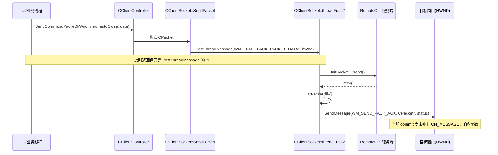

---
tags:
  - 项目/远控系统
heatmap_tracker: true
heatmap_group: 远控系统/6.网络与多线程问题
heatmap_weight: 1
git: "34aee5f"
git_msg: "1 重构网络模块（线程事件机制修改为消息机制）"
---

# 6.6 网络模块重构（线程事件机制改为消息机制）

> 基于提交 `34aee5f49e8d4f7420361a6b00c1b8383dd4391f`（2026-03-24）。这次提交把客户端网络层从“`HANDLE hEvent` + `WaitForSingleObject` + `lstPacks` 回填”的同步模型，切向“`PostThreadMessage` 投递网络任务 + `SendMessage(WM_SEND_PACK_ACK)` 回投窗口”的消息模型。底层 `CClientSocket` 已经具备消息线程和回包投递骨架，但 `RemoteClientDlg` / `CWatchDialog` 还没有真正消费 `WM_SEND_PACK_ACK`，旧的 `GetPacket()` / `DealCommand()` / `lstPacks` 用法也还残留，所以当前版本的准确定位是：**消息化网络框架第一次落地到底层接口，但端到端消费链还没有完全接通。**

---

## 本次提交推进了什么

| 变化点 | 代码表现 | 真正含义 |
|------|------|------|
| `CClientSocket` 改成消息线程 | 构造函数里建立 `m_mapFunc[WM_SEND_PACK] -> SendPack`，`threadEntry()` 改为 `_beginthreadex` + `threadFunc2()` | Socket 层第一次拥有自己的消息循环，不再依赖“业务线程自己等事件” |
| `SendPacket()` 改签名 | `bool SendPacket(HWND hWnd, const CPacket& pack, bool isAutoClosed)` | 请求上下文不再绑定 `hEvent`，而是直接指定“响应应该回到哪个窗口” |
| 旧事件模型被注释保留 | 旧版 `SendPacket(const CPacket&, std::list<CPacket>&, bool)` 和 `threadFunc()` 整段注释掉 | 说明这次不是小修，而是明确地从“事件等待”切到“消息分发” |
| `SendPack()` 接管真正收发 | `InitSocket()` -> `send()` -> `recv()` -> `CPacket` 解析 -> `SendMessage(hWnd, WM_SEND_PACK_ACK, ...)` | 网络线程开始对上层提供“包到达就投递消息”的服务 |
| Controller 变成薄包装 | `CClientController::SendCommandPacket()` 只负责把 `HWND + CPacket` 交给 `CClientSocket` | 发命令的入口开始被统一，业务层不再显式创建事件对象 |
| 调用点都补了 `GetSafeHwnd()` | `CWatchDialog` 和 `RemoteClientDlg` 的所有 `SendCommandPacket()` 调用都新增 `HWND` 参数 | 调用方归属被显式化，为“谁处理回包”做准备 |
| 上层仍有旧接口残留 | `threadWatchScreen()` 还在读 `lstPacks`，`LoadFileCurrent()` / `threadDownloadFile()` 还在读 `GetPacket()` | 当前 commit 处于过渡态，新旧两套结果返回语义正在打架 |

---

## 与 [[6.4 网络模型线程完善(3)]] 的关系

上一版的核心结论是：

> `hEvent + m_mapAck + lstPacks` 这套事件对象模型，已经能把“单包请求”稳定串起来，但调用方仍然要同步等待，结果也还挂在共享状态和事件句柄上。

这次提交真正改变的不是“线程多不多”，而是**结果归还方式**：

| 维度 | `6.4(3)` 阶段 | `6.6` 阶段 |
|------|------|------|
| 请求标识 | `HANDLE hEvent` | 目标 `HWND` |
| 唤醒方式 | `SetEvent(hEvent)` | `SendMessage(hWnd, WM_SEND_PACK_ACK, ...)` |
| 调用方语义 | 同步阻塞，等到事件触发再继续 | 异步投递，函数返回值只代表是否成功投递到网络线程 |
| 结果归属 | `std::list<CPacket>` / `m_packet` | 窗口消息参数 `CPacket*` |
| 网络线程形态 | 队列 + recv 循环 + 共享容器 | 线程消息循环 + `WM_SEND_PACK` 回调 |
| 迁移完成度 | 单包路径可用，逻辑闭环 | 底层切换完成，但上层窗口消费链尚未闭环 |

所以这次提交的准确定位不是“网络模型已经彻底稳定”，而是：

> **底层已经开始按 MFC/Win32 消息模型重新组织网络结果，但上层业务代码还没有完全接受这套新契约。**

---

## 重构思想

### 为什么要从事件对象改到窗口消息

事件模型的优点是容易在控制台式、同步式代码里理解：

- 发命令时创建 `hEvent`
- 网络线程收完包后 `SetEvent`
- 调用方 `WaitForSingleObject`
- 返回后再从 `lstPacks` 或 `m_packet` 里取结果

但在当前远控客户端里，越来越多的命令都带有明确的 UI 归属：

- 截图命令应该回到 `CWatchDialog`
- 文件树和测试按钮应该回到 `CRemoteClientDlg`
- 鼠标命令、锁机命令也天然属于某个窗口上下文

因此本次重构的核心设计决策是：

- `CClientController` 不再负责“等待结果”
- `CClientSocket` 不再把结果写进共享 `lstPacks`
- 每次发命令都显式告诉网络层：**收到包后把结果投递给哪个窗口**

### 新模型调用链

- 重构前：业务线程 `SendCommandPacket()` -> `SendPacket()` -> 等 `hEvent` -> 业务线程继续取 `lstPacks`
- 重构后：业务线程 `SendCommandPacket(hWnd, ...)` -> `PostThreadMessage(WM_SEND_PACK)` -> Socket 线程收发 -> `SendMessage(hWnd, WM_SEND_PACK_ACK, CPacket*)`

### 消息化之后的线程时序



### `CSM_AUTOCLOSE` 在新模型中的意义

```mermaid
flowchart TD
    A[SendPack 收到 WM_SEND_PACK] --> B[InitSocket + send]
    B --> C[recv + CPacket 解析]
    C --> D[SendMessage(WM_SEND_PACK_ACK)]
    D --> E{CSM_AUTOCLOSE?}
    E -->|是| F[CloseSocket + return]
    E -->|否| G[继续 recv 下一包]
    G --> C
```

- `CSM_AUTOCLOSE = true`：适合鼠标、锁机、测试连接、单次截图这类“一发一收”的命令
- `CSM_AUTOCLOSE = false`：适合文件树、文件下载这类“一个请求对应多个响应包”的命令

这正是本次提交想要补齐的方向：**单包命令用消息模型，多包命令也最终要迁到消息模型**。

---

## 核心实现

### 1. `SendPacket()`：请求不再等事件，而是投递到 Socket 线程

> 📁 `RemoteClient/CClientSocket.cpp` : `SendPacket` (行 122-131)

```cpp
bool CClientSocket::SendPacket(HWND hWnd, const CPacket& pack, bool isAutoClosed)
{
    if (m_hThread = INVALID_HANDLE_VALUE)
    {
        m_hThread = (HANDLE)_beginthreadex(NULL, 0, &CClientSocket::threadEntry, this, 0, &m_nThreadID);
    }
    UINT nMode = isAutoClosed ? CSM_AUTOCLOSE : 0;
    std::string strOut;
    pack.Data(strOut);
    return PostThreadMessage(m_nThreadID, WM_SEND_PACK,
        (WPARAM)new PACKET_DATA(strOut.c_str(), strOut.size(), nMode),
        (LPARAM)hWnd);
}
```

**关键点解析**：

1. **`HWND` 替代了 `hEvent`**：旧模型把“结果归谁”绑在事件对象上；新模型把“结果归谁”显式绑定到窗口句柄上。
2. **返回值语义彻底变了**：这里返回的是 `PostThreadMessage()` 的 `BOOL`，只表示“消息有没有成功投递到网络线程队列”，不代表远端命令是否执行成功，更不代表收到的命令号是多少。
3. **线程创建判断写错了**：`if (m_hThread = INVALID_HANDLE_VALUE)` 是赋值，不是比较。`INVALID_HANDLE_VALUE` 是非零值，这个判断会恒为真，导致每次发包都重新创建线程并覆盖 `m_hThread`。
4. **首包存在消息队列竞态**：`_beginthreadex()` 返回后立刻 `PostThreadMessage()`，如果新线程还没来得及进入 `GetMessage()` 创建消息队列，第一次投递可能失败。

> 📎 与旧版事件模型对比见 [[6.4 网络模型线程完善(3)]]

### 2. `SendPack()`：网络线程接管 send/recv，并把完整包回投给窗口

> 📁 `RemoteClient/CClientSocket.cpp` : `SendPack` (行 274-327)

```cpp
void CClientSocket::SendPack(UINT nMsg, WPARAM wParam, LPARAM lParam)
{
    PACKET_DATA data = *(PACKET_DATA*)wParam;
    delete (PACKET_DATA*)wParam;
    HWND hWnd = (HWND)lParam;

    if (InitSocket() == true)
    {
        int ret = send(m_sock, (char*)data.strData.c_str(), (int)data.strData.size(), 0);
        if (ret > 0)
        {
            size_t index = 0;
            std::string strBuffer;
            strBuffer.resize(BUFFER_SIZE);
            char* pBuffer = (char*)strBuffer.c_str();
            while (m_sock != INVALID_SOCKET)
            {
                int length = recv(m_sock, pBuffer + index, BUFFER_SIZE - index, 0);
                if (length > 0 || (index > 0))
                {
                    index += (size_t)length;
                    size_t nLen = index;
                    CPacket pack((BYTE*)pBuffer, nLen);
                    if (nLen > 0)
                    {
                        ::SendMessage(hWnd, WM_SEND_PACK_ACK, (WPARAM)new CPacket(pack), NULL);
                        if (data.nMode & CSM_AUTOCLOSE)
                        {
                            CloseSocket();
                            return;
                        }
                        index -= nLen;
                        memmove(pBuffer, pBuffer + index, nLen);
                    }
                }
                else
                {
                    CloseSocket();
                    ::SendMessage(hWnd, WM_SEND_PACK_ACK, NULL, 1);
                }
            }
        }
        else
        {
            CloseSocket();
            ::SendMessage(hWnd, WM_SEND_PACK_ACK, NULL, -1);
        }
    }
    else
    {
        ::SendMessage(hWnd, WM_SEND_PACK_ACK, NULL, -2);
    }
}
```

**关键点解析**：

1. **网络线程真正成了“收发中枢”**：`InitSocket()`、`send()`、`recv()`、`CPacket` 解析都落在 `SendPack()` 里，业务线程只负责发起命令。
2. **结果不再写回共享状态**：这条新路径里没有 `m_mapAck`、没有 `lstPacks`、也没有 `m_packet = pack`，所以旧的 `GetPacket()` 读取方式天然接不上这条链路。
3. **`WM_SEND_PACK_ACK` 是新的回包协议**：`wParam` 为 `new CPacket(pack)` 时表示收到完整包；`lParam` 为 `1/-1/-2` 时表示不同的错误状态。
4. **多包模式的缓冲区搬移写错了**：旧模型是 `memmove(pBuffer, pBuffer + size, index - size)`，表示“把未消费尾部搬到开头”。现在这句写成了 `index -= nLen; memmove(pBuffer, pBuffer + index, nLen);`，源地址和长度都反了，多包模式下可能把残留缓冲区破坏掉。

> 📎 `CPacket` 的半包解析与长度/校验和语义见 [[2.3 设计网络传输包协议]]

### 3. `SendCommandPacket()` 的语义已经变了，但上层调用方还按旧协议在用

> 📁 `RemoteClient/ClientController.cpp` : `SendCommandPacket` / `threadWatchScreen` (行 85-89, 131-159)  
> 📁 `RemoteClient/RemoteClientDlg.cpp` : `OnBnClickedBtnFileinfo` / `LoadFileInfo` (行 200-290)

```cpp
bool CClientController::SendCommandPacket(HWND hWnd, int nCmd, bool bAutoClose, BYTE* pData, size_t nLength)
{
    CClientSocket* pClient = CClientSocket::getInstance();
    return pClient->SendPacket(hWnd, CPacket(nCmd, pData, nLength), bAutoClose);
}

void CClientController::threadWatchScreen()
{
    ...
    std::list<CPacket> lstPacks;
    int ret = SendCommandPacket(m_watchDlg.GetSafeHwnd(), 6, true, NULL, 0);
    //TODO:添加消息响应函数 WM_SEND_ACK
    if (ret == 6)
    {
        CEdoyunTool::Bytes2Image(m_watchDlg.GetImage(), lstPacks.front().strData);
    }
}
```

```cpp
void CRemoteClientDlg::OnBnClickedBtnFileinfo()
{
    std::list<CPacket> lstPackets;
    int ret = CClientController::getInstance()->SendCommandPacket(GetSafeHwnd(), 1, true, NULL, 0);
    if (ret == -1 || (lstPackets.size() <= 0))
    {
        AfxMessageBox(_T("命令处理失败！！！"));
        return;
    }
    CPacket& head = lstPackets.front();
    ...
}
```

**关键点解析**：

1. **`bool` 不再等价于“命令号”**：`ret == 6` 这种判断在新模型里没有意义，`ret` 最多只会是 `0/1`。
2. **`lstPacks` / `lstPackets` 不会再被自动填充**：旧的 `SendPacket(pack, lstPacks, ...)` 已经被注释掉了，所以这些局部列表现在只是空壳。
3. **`GetPacket()` / `DealCommand()` 这条旧路径也被架空了**：例如 `LoadFileCurrent()`、`threadDownloadFile()` 仍然在读 `CClientSocket::GetPacket()`，但新 `SendPack()` 根本没有更新 `m_packet`。
4. **提交里自己已经暴露了断层**：`threadWatchScreen()` 直接写了 `//TODO:添加消息响应函数 WM_SEND_ACK`，说明作者已经意识到新契约的最后一环还没接。

> 📎 `cmd=6` 截图链路的旧背景见 [[4.4 远程桌面显示功能设计与数据接收发送]]

### 4. `WM_SEND_PACK_ACK` 还没有真正的接收者

> 📁 `RemoteClient/RemoteClientDlg.cpp` : `BEGIN_MESSAGE_MAP` (行 81-98)  
> 📁 `RemoteClient/CWatchDialog.cpp` : `BEGIN_MESSAGE_MAP` (行 33-45)

```cpp
BEGIN_MESSAGE_MAP(CRemoteClientDlg, CDialogEx)
    ON_BN_CLICKED(IDC_BTN_TEST, &CRemoteClientDlg::OnBnClickedBtnTest)
    ON_BN_CLICKED(IDC_BTN_FILEINFO, &CRemoteClientDlg::OnBnClickedBtnFileinfo)
    ON_NOTIFY(NM_DBLCLK, IDC_TREE_DIR, &CRemoteClientDlg::OnNMDblclkTreeDir)
    ...
END_MESSAGE_MAP()

BEGIN_MESSAGE_MAP(CWatchDialog, CDialog)
    ON_WM_TIMER()
    ON_WM_LBUTTONDBLCLK()
    ON_WM_LBUTTONDOWN()
    ...
END_MESSAGE_MAP()
```

**关键点解析**：

1. **消息回投已经存在，但窗口侧没有注册处理函数**：`SendPack()` 已经 `SendMessage(hWnd, WM_SEND_PACK_ACK, ...)`，但两个主要窗口都没有 `ON_MESSAGE(WM_SEND_PACK_ACK, ...)`。
2. **没有接收者就没有消费链**：即使网络线程收到了正确的 `CPacket`，窗口过程如果不处理，这个包对象也不会变成业务结果。
3. **还会产生内存泄漏**：`SendPack()` 在 `wParam` 里传的是 `new CPacket(pack)`；如果窗口没有 handler 去 `delete`，这个对象就泄漏了。

---

## 当前版本的准确结论

### 已经做对的部分

- `CClientSocket` 已经拥有独立消息线程、线程入口和 `WM_SEND_PACK -> SendPack` 的映射关系。
- 回包方向已经从“共享容器 + 事件对象”改成“指定 `HWND` 的窗口消息”，这是一次真正的模型切换。
- `CWatchDialog` 和 `RemoteClientDlg` 的发命令入口已经统一补上 `GetSafeHwnd()`，调用方归属被显式化。
- `CSM_AUTOCLOSE` 把单包命令和多包命令的接收语义区分开了，为后续继续迁移文件树/下载打下了接口基础。

### 还没做完的部分

- `RemoteClientDlg` 和 `CWatchDialog` 还没有 `WM_SEND_PACK_ACK` 响应函数，消息回来了但没人真正处理。
- `SendCommandPacket()` 的返回值语义已经变成“消息是否投递成功”，但 `threadWatchScreen()`、`OnBnClickedBtnFileinfo()`、`LoadFileInfo()` 等处还在按旧的“返回命令号 + 填充列表”接口来写。
- `LoadFileCurrent()` 和 `threadDownloadFile()` 仍然依赖 `GetPacket()` / `DealCommand()`，而新 `SendPack()` 并不会把数据写回 `m_packet`。
- `SendPacket()` 的线程判断写成了赋值表达式 `m_hThread = INVALID_HANDLE_VALUE`，会导致每次发包都重新创建线程。
- 第一次发包时直接 `PostThreadMessage()`，没有确保网络线程消息队列已建立，首包存在投递失败窗口。
- `SendPack()` 在多包模式下的缓冲区搬移参数不对，后续包解析可能出错。

> 本次提交的准确定位：**消息化网络模型已经替换了底层入口，但上层消费链、返回值契约和多包语义仍处在迁移中，当前版本更接近“重构中的过渡态骨架”。**

---

## Win32 / Winsock / MFC 关键机制

### 1. `PostThreadMessage()`

```cpp
BOOL PostThreadMessage(
    DWORD idThread,
    UINT Msg,
    WPARAM wParam,
    LPARAM lParam
);
```

| 关注点 | 在当前项目里的真实含义 |
|------|------|
| 异步投递 | 调用方不再阻塞等待结果，只是把任务放进网络线程消息队列 |
| 返回值 | 仅表示消息是否成功进入队列，不表示服务端是否成功响应 |
| 使用前提 | 目标线程必须已经拥有消息队列，一般需要先执行过 `GetMessage()` / `PeekMessage()` |

这也是为什么本次提交之后，`SendCommandPacket()` 的 `bool` 返回值不能再被当成业务命令结果。

### 2. `SendMessage(hWnd, WM_SEND_PACK_ACK, ...)`

```cpp
LRESULT SendMessage(
    HWND hWnd,
    UINT Msg,
    WPARAM wParam,
    LPARAM lParam
);
```

| 关注点 | 在当前项目里的真实含义 |
|------|------|
| 同步调用 | 网络线程会同步进入目标窗口所属线程的窗口过程 |
| UI 归属 | 可以把截图、文件树、测试连接的结果送回正确的对话框上下文 |
| MFC 约束 | 需要 `ON_MESSAGE(WM_SEND_PACK_ACK, ...)` 或自定义 `WindowProc()` 才能真正消费 |

这正是“事件模型”和“消息模型”最大的差别：**不是谁在等结果，而是谁拥有结果的处理权。**

### 3. `recv()` + `CPacket` 半包解析

- `recv()` 只保证“尽可能读到一些字节”，不保证一次就读到一个完整包。
- `CPacket((BYTE*)pBuffer, nLen)` 的语义是：如果缓冲区里能凑出完整包，就把 `nLen` 改成“本次消费掉的包长”；否则把 `nLen` 置 `0`。
- 所以每次成功解析后，必须把“未消费尾部”搬到缓冲区开头，等待下一轮 `recv()` 继续拼包。

这也是为什么新 `SendPack()` 里的 `memmove()` 顺序错误，会直接影响多包命令的正确性。

---

## 易错点与调试

> [!warning] 这次重构最容易误判的地方，不是“消息线程有没有跑起来”，而是“消息线程把结果投回去以后，结果是不是被正确消费了”。

### 1. 把 `SendCommandPacket()` 的返回值当成远端命令结果

```cpp
// ❌ 错误：ret 只是 PostThreadMessage 的 BOOL，不是 cmd=6 的业务应答
int ret = SendCommandPacket(m_watchDlg.GetSafeHwnd(), 6, true, NULL, 0);
if (ret == 6)
{
    ...
}

// ✅ 正确：这里只能判断“任务是否成功投递到网络线程”
bool posted = SendCommandPacket(m_watchDlg.GetSafeHwnd(), 6, true, NULL, 0);
if (!posted)
{
    TRACE("投递网络消息失败\r\n");
}
```

### 2. 以为传了 `HWND` 就已经完成了消息化改造

```cpp
// ❌ 错误：只有发消息，没有消费消息
SendMessage(hWnd, WM_SEND_PACK_ACK, (WPARAM)new CPacket(pack), NULL);

// ✅ 正确：窗口侧必须补上 ON_MESSAGE(WM_SEND_PACK_ACK, ...) 并负责释放 CPacket*
```

### 3. 线程句柄判断写成赋值

```cpp
// ❌ 错误：每次都会重新创建线程
if (m_hThread = INVALID_HANDLE_VALUE)
{
    ...
}

// ✅ 正确：应该比较句柄状态
if (m_hThread == INVALID_HANDLE_VALUE)
{
    ...
}
```

### 4. 多包缓冲区搬移方向写错

```cpp
// ❌ 错误：源地址和长度都不对
index -= nLen;
memmove(pBuffer, pBuffer + index, nLen);

// ✅ 正确：把“未消费尾部”搬到开头
memmove(pBuffer, pBuffer + nLen, index - nLen);
index -= nLen;
```

---

## 关联知识

- [[6.4 网络模型线程完善(3)]] - 事件对象模型的最后一个稳定版本
- [[2.3 设计网络传输包协议]] - `CPacket` 的包头、长度、校验和与半包解析
- [[4.4 远程桌面显示功能设计与数据接收发送]] - `cmd=6` 截图链路和监控对话框背景
- [[4.1 文件下载功能的实现]] - `cmd=4` 下载流程是本次多包语义仍未迁完的典型场景
- [[5.3 解耦命令处理和网络模块]] - Controller 与 Socket 层职责划分的前置设计

---

## 代码索引

| 功能 | 文件 | 位置 |
|------|------|------|
| `WM_SEND_PACK` / `WM_SEND_PACK_ACK` 宏 | `RemoteClient/CClientSocket.h` | 10-11 |
| `SendPacket()` 新入口 | `RemoteClient/CClientSocket.cpp` | 122-131 |
| Socket 线程消息循环 `threadFunc2()` | `RemoteClient/CClientSocket.cpp` | 250-262 |
| `SendPack()` 收发与回包 | `RemoteClient/CClientSocket.cpp` | 274-327 |
| Controller 薄包装 `SendCommandPacket()` | `RemoteClient/ClientController.cpp` | 85-89 |
| 截图线程的过渡态用法 | `RemoteClient/ClientController.cpp` | 131-159 |
| 文件信息按钮仍按旧契约读取 `lstPackets` | `RemoteClient/RemoteClientDlg.cpp` | 200-230 |
| 文件树 / 当前目录仍读 `GetPacket()` | `RemoteClient/RemoteClientDlg.cpp` | 243-290 |
| `CWatchDialog` 鼠标/锁机发命令入口 | `RemoteClient/CWatchDialog.cpp` | 101-256 |
| `RemoteClientDlg` 消息映射（无 `WM_SEND_PACK_ACK`） | `RemoteClient/RemoteClientDlg.cpp` | 81-98 |
| `CWatchDialog` 消息映射（无 `WM_SEND_PACK_ACK`） | `RemoteClient/CWatchDialog.cpp` | 33-45 |

---

## 更新记录

| 日期 | 变更 |
|------|------|
| 2026-03-24 | 初始版本：基于提交 `34aee5f49e8d4f7420361a6b00c1b8383dd4391f`，记录“线程事件机制改为消息机制”的设计意图、当前断层和后续迁移重点 |
