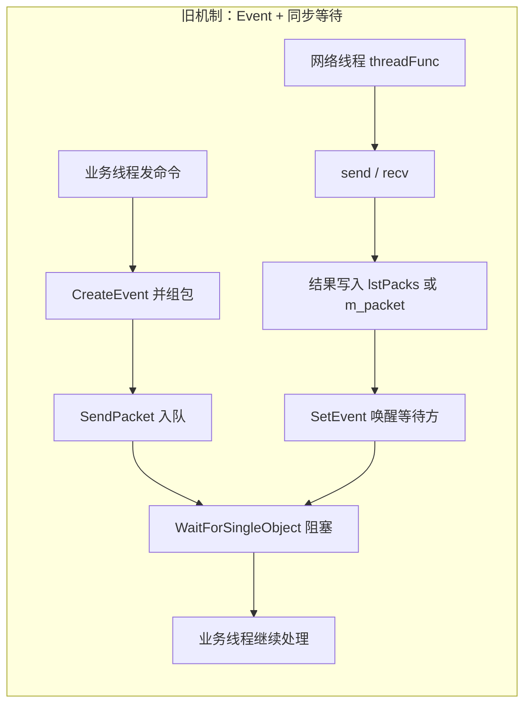
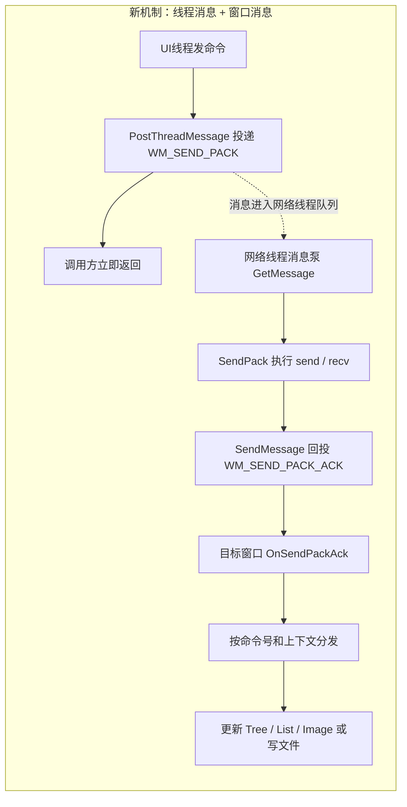

---
tags:
  - 项目/远控系统
heatmap_tracker: true
heatmap_group: 远控系统/6.网络与多线程问题
heatmap_weight: 1
git: "9b1f6ea"
git_msg: "1 重构了网络通讯机制 / 将事件机制改为消息机制"
---

# 6.7 消息机制闭环：窗口回调与上下文透传

> 基于提交 `9b1f6eab74b6b6c137f4fb769f704a47c24488c6`（2026-03-24）。这次提交不是再讨论“消息机制该不该做”，而是把上一版缺失的**窗口接收端**补了上来：`CWatchDialog` 和 `CRemoteClientDlg` 都开始接收 `WM_SEND_PACK_ACK`，`PACKET_DATA` 也新增了 `WPARAM` 上下文透传，文件树和下载流程第一次具备“请求发出 -> 网络线程收包 -> 窗口直接消费结果”的结构闭环。  
> 但当前版本的准确定位仍然不是“消息机制已经稳定可用”，而是：**结构上的闭环已经搭起来了，但 ACK 分发接线和命令分派条件写错，导致运行时闭环仍然会断在窗口回调层**。相关问题详见 [[Debug-016 消息应答接线错误与分发条件误写导致机制失效]]。

---

## 本次提交推进了什么

| 变化点 | 代码表现 | 真正含义 |
|------|------|------|
| `PACKET_DATA` 扩展上下文 | 新增 `WPARAM wParam` 字段 | 网络线程不再只知道“把包送回哪个窗口”，还知道“这个包对应哪个 UI 上下文/文件句柄” |
| `SendPacket()` / `SendCommandPacket()` 改签名 | 末尾新增 `WPARAM wParam = 0` | 文件树、下载等多包场景可以在回调里拿到 `HTREEITEM` / `FILE*` |
| `SendPack()` 改 ACK 协议 | `SendMessage(hWnd, WM_SEND_PACK_ACK, new CPacket(pack), data.wParam)` | 成功回调时，`lParam` 不再只是状态码，而是“请求上下文” |
| `CWatchDialog` 增加 `ON_MESSAGE` | `ON_MESSAGE(WM_SEND_PACK_ACK, &CWatchDialog::OnSendPackAck)` | 截图和鼠标相关 ACK 第一次有了真正的窗口消费入口 |
| `RemoteClientDlg` 增加 `OnSendPackAck()` | `case 1/2/4/1981/...` 分发到盘符、文件树、下载等逻辑 | 主界面第一次尝试把文件树和下载彻底搬到消息机制上 |
| 下载逻辑开始摆脱额外线程 | `DownFile()` 直接打开本地文件并把 `FILE*` 透传给消息机制 | 下载流程不再必须依赖旧的“下载线程 + 同步 recv” |
| 监视对话框去掉定时器刷新思路 | `SetTimer` 被注释，`OnSendPackAck()` 里直接 `StretchBlt` | 屏幕图像开始转向“包到即刷”的事件驱动模型 |

---

## 与 [[6.6 网络模块重构（线程事件机制改为消息机制）]] 的关系

上一版的核心结论是：

> Socket 层已经能发 `WM_SEND_PACK_ACK`，但窗口侧根本没人接，消息机制还停留在“底层能发、上层没人收”的半闭环状态。

本次提交正好补的是这一段：

| 维度 | `6.6` 阶段 | `6.7` 阶段 |
|------|------|------|
| ACK 接收者 | 只有 `SendMessage`，没有窗口 handler | `CWatchDialog` / `CRemoteClientDlg` 都声明并注册 `OnSendPackAck()` |
| 多包上下文 | 只能知道目标 `HWND` | 可额外带 `HTREEITEM` / `FILE*` 等业务上下文 |
| 文件树链路 | 仍主要停留在旧的 `GetPacket()` / `DealCommand()` | 开始尝试在主窗口 `OnSendPackAck()` 里直接消费 `cmd=2` |
| 下载链路 | 旧下载线程负责 `recv` + `fwrite` | 开始把 `FILE*` 交给消息回调处理 |
| 截图刷新 | 仍依赖旧的线程/状态混合逻辑 | 开始尝试在 `CWatchDialog::OnSendPackAck()` 里直接刷图 |
| 当前障碍 | 上层没有接收端 | 接收端有了，但接线和命令分派写错 |

所以这次提交的准确定位是：

> **消息机制第一次从 Socket 层真正长到了 UI 层，但 UI 层的 ACK 分发仍然不正确。**

---

## 两种机制的直观对比

### 旧机制：线程事件模型



**阻塞点**：`WaitForSingleObject`  
**结果归属**：共享 `lstPacks` / `m_packet`  
**典型问题**：调用线程被卡住，下载/截图等长操作需要专门线程兜底

### 新机制：窗口消息 + 上下文透传



**阻塞点**：业务线程不阻塞；网络线程在 `SendMessage` 时同步等待窗口处理  
**结果归属**：具体窗口自己的 `OnSendPackAck()`  
**新增能力**：可用 `context` 把 `HTREEITEM`、`FILE*` 这类请求级上下文一并送回

### 本次提交想解决的核心问题

| 问题 | 旧事件模型 | 本次消息模型 |
|------|------|------|
| 谁负责保存结果 | `lstPacks` / `m_packet` | 目标窗口自己的成员/UI 控件 |
| 谁负责继续流程 | 等待方线程被唤醒后自己继续 | 窗口收到消息后立即继续 |
| 文件树如何知道插到哪个节点 | 调用方自己记住 | `HTREEITEM` 通过 `WPARAM/LPARAM` 透传回来 |
| 下载如何知道写到哪个文件 | 下载线程自己持有 `FILE*` | `FILE*` 直接回投给窗口消息处理函数 |

---

## 核心实现

### 1. `PACKET_DATA` 新增 `wParam`：请求上下文随包一起走

> 📁 `RemoteClient/CClientSocket.h` : `PACKET_DATA` (行 178-204)  
> 📁 `RemoteClient/CClientSocket.cpp` : `SendPacket` / `SendPack` (行 122-131, 274-300)

```cpp
typedef struct PacketData
{
    std::string strData;
    UINT nMode;
    WPARAM wParam;

    PacketData(const char* pData, size_t nLen, UINT mode, WPARAM nParam = 0)
    {
        strData.resize(nLen);
        memcpy((char*)strData.c_str(), pData, nLen);
        nMode = mode;
        wParam = nParam;
    }
} PACKET_DATA;

bool CClientSocket::SendPacket(HWND hWnd, const CPacket& pack, bool isAutoClosed, WPARAM wParam)
{
    ...
    return PostThreadMessage(
        m_nThreadID,
        WM_SEND_PACK,
        (WPARAM)new PACKET_DATA(strOut.c_str(), strOut.size(), nMode, wParam),
        (LPARAM)hWnd
    );
}

void CClientSocket::SendPack(UINT nMsg, WPARAM wParam, LPARAM lParam)
{
    ...
    ::SendMessage(hWnd, WM_SEND_PACK_ACK, (WPARAM)new CPacket(pack), data.wParam);
}
```

**关键点解析**：

1. **成功路径的 `lParam` 语义变了**：上一版里 `WM_SEND_PACK_ACK` 只表达“成功/失败”。这次提交在成功时把 `data.wParam` 回填给窗口，让窗口知道“这个包是给哪个树节点/文件句柄准备的”。
2. **这是多包命令能消息化的关键一步**：没有这个上下文，窗口即使拿到 `CPacket`，也不知道要把文件信息插到哪个 `HTREEITEM` 下，也不知道下载数据应该写到哪个 `FILE*`。
3. **`WPARAM` 很适合装这类上下文**：`HTREEITEM` 和 `FILE*` 本质上都是指针/句柄，放进 `WPARAM` 不需要自己再造一层共享映射表。

### 2. 主窗口 `OnSendPackAck()`：盘符、文件树、下载开始尝试直接走消息回调

> 📁 `RemoteClient/RemoteClientDlg.cpp` : `OnSendPackAck` (行 424-535)  
> 📁 `RemoteClient/RemoteClientDlg.cpp` : `OnBnClickedBtnFileinfo` / `LoadFileInfo` (行 200-210, 238-259)

这次提交第一次把主窗口的几条核心命令放进统一的 ACK 分派函数里：

| `cmd` | 目标功能 | 成功时 `lParam` | 处理方式 |
|------|------|------|------|
| `1` | 获取盘符 | `0` | 解析驱动器字符串，重建根节点 |
| `2` | 获取目录信息 | `HTREEITEM` | 往对应树节点下插目录/文件 |
| `4` | 下载文件 | `FILE*` | 先收总长度，再持续 `fwrite()` |
| `3/7/8/9/1981` | 运行文件/锁机/删文件/测试连接 | `0` | 记录状态或打印日志 |

这意味着主窗口的设计思路已经从：

- “按钮点击 -> 同步发包 -> 当前函数继续 `GetPacket()` / `DealCommand()`”

转成了：

- “按钮点击 -> 异步发包 -> 回包时统一进入 `OnSendPackAck()` 再按命令号分派”

其中最重要的两处调用是：

```cpp
int ret = CClientController::getInstance()->SendCommandPacket(GetSafeHwnd(), 1, true, NULL, 0);

int nCmd = CClientController::getInstance()->SendCommandPacket(
    GetSafeHwnd(),
    2,
    false,
    (BYTE*)(LPCTSTR)strPath,
    strPath.GetLength(),
    (WPARAM)hTreeSelected
);
```

第二个调用把 `hTreeSelected` 一并发出，目的是让 ACK 回来时直接知道应该往哪个父节点下挂子项。

### 3. 下载链路开始脱离“下载线程自己 recv”的旧模式

> 📁 `RemoteClient/ClientController.cpp` : `DownFile` / `DownloadEnd` (行 92-125)  
> 📁 `RemoteClient/RemoteClientDlg.cpp` : `OnSendPackAck` case 4 (行 490-516)

```cpp
void CClientController::DownloadEnd()
{
    m_statusDlg.ShowWindow(SW_SHOW);
    m_remoteDlg.EndWaitCursor();
    m_remoteDlg.MessageBox(_T("下载完成！！"), _T("完成"));
}

int CClientController::DownFile(CString strPath)
{
    ...
    FILE* pFile = fopen(m_strLocal, "wb+");
    ...
    SendCommandPacket(
        m_remoteDlg,
        4,
        false,
        (BYTE*)(LPCSTR)m_strRemote,
        m_strRemote.GetLength(),
        (WPARAM)pFile
    );
}
```

这一步的设计目标很明确：

- `DownFile()` 不再自己循环 `recv`
- `FILE*` 直接跟请求一起送进消息机制
- 后续每个 `cmd=4` 的 ACK 都由主窗口 `OnSendPackAck()` 负责写盘

也就是说，下载流程开始从“**下载线程掌握 socket 和文件句柄**”转向“**网络线程掌握 socket，主窗口掌握文件句柄和 UI 状态**”。

### 4. `CWatchDialog::OnSendPackAck()`：监视窗口开始尝试“包到即刷”

> 📁 `RemoteClient/CWatchDialog.cpp` : `OnInitDialog` / `OnSendPackAck` (行 65-72, 102-149)

```cpp
BOOL CWatchDialog::OnInitDialog()
{
    CDialog::OnInitDialog();
    m_isFull = false;
    // SetTimer(0, 45, NULL);
    return TRUE;
}

LRESULT CWatchDialog::OnSendPackAck(WPARAM wParam, LPARAM lParam)
{
    ...
    switch (pPacket != NULL)
    {
    case 5:
    case 6:
        if (m_isFull)
        {
            CEdoyunTool::Bytes2Image(m_image, pPacket->strData);
            ...
            m_image.StretchBlt(...);
            m_isFull = false;
        }
        break;
    }
    return LRESULT();
}
```

从结构上看，这一步是在把监视窗口从“定时器轮询刷新”改成“网络回调直接刷新”：

- `SetTimer()` 被注释
- 图片不再等定时器检查，而是在 `WM_SEND_PACK_ACK` 到达时立刻 `Bytes2Image + StretchBlt`

这是典型的**事件驱动刷新**思路，比“定时器不停轮询是否有新图”更直接，也更符合消息机制。

---

## 为什么这次会先在 ACK 分发层出问题

> 📎 详见 [[Debug-016 消息应答接线错误与分发条件误写导致机制失效]]

本次提交虽然把窗口 handler 都写出来了，但 ACK 最关键的两步接线都写错了：

### 1. 主窗口消息映射接错了处理函数

> 📁 `RemoteClient/RemoteClientDlg.cpp` : `BEGIN_MESSAGE_MAP` (行 81-98)

```cpp
ON_MESSAGE(WM_SEND_PACK_ACK, &CWatchDialog::OnSendPackAck)
```

这里本应绑定：

```cpp
ON_MESSAGE(WM_SEND_PACK_ACK, &CRemoteClientDlg::OnSendPackAck)
```

也就是说，`RemoteClientDlg` 明明自己写了 `OnSendPackAck()`，却没有把消息接到自己这里。

### 2. 两个 handler 都把“命令号分派”写成了“布尔值分派”

> 📁 `RemoteClient/CWatchDialog.cpp` : `OnSendPackAck` (行 117)  
> 📁 `RemoteClient/RemoteClientDlg.cpp` : `OnSendPackAck` (行 440)

```cpp
switch (pPacket != NULL)
```

这里真正应该分派的是：

```cpp
switch (pPacket->sCmd)
```

或者：

```cpp
switch (head.sCmd)
```

`pPacket != NULL` 的值只有 `0/1`。这会直接导致：

- `RemoteClientDlg` 里 `switch(true)` 会误打误撞只走 `case 1`
- `cmd=2/4/1981/...` 都进不了自己的分支
- `CWatchDialog` 里 `case 5/6` 永远命不中，所以截图 ACK 根本不会刷新图像

这也是为什么这次提交的“结构闭环”已经出现，但“实际功能闭环”还没有真正跑通。

---

## 当前版本的准确结论

### 已经做对的部分

- `WM_SEND_PACK_ACK` 终于在两个窗口层面都拥有了实际的 handler 声明和注册尝试。
- `PACKET_DATA` 增加 `wParam` 透传后，消息机制第一次具备承载 `HTREEITEM`、`FILE*` 这类业务上下文的能力。
- 盘符、文件树、下载、监视图像都开始往“窗口回调直接消费 ACK”迁移，旧的同步等待思路被进一步削弱。
- 下载逻辑开始摆脱额外下载线程，方向上是正确的：网络线程只负责收包，UI/窗口负责落地结果。

### 还没做完的部分

- [[Debug-016 消息应答接线错误与分发条件误写导致机制失效]] 让 ACK 仍然不能正确分派到对应命令处理分支。
- [[Debug-015 SendPacket线程判断赋值误写]] 仍然存在，网络线程仍可能被重复创建。
- `CWatchDialog::threadWatchScreen()` 还保留着旧的 `ret == 6` / `lstPacks.front()` 逻辑，说明监视链路仍处在新旧模型混用状态。
- `OnSendPackAck()` 里收到的 `CPacket*` 没有 `delete`，当前版本仍有明确的对象泄漏风险。
- `LoadFileCurrent()` 仍然走旧的 `GetPacket()` / `DealCommand()`，文件列表链路并没有全部迁完。
- `DownloadEnd()` 使用 `SW_SHOW` 而不是 `SW_HIDE`，下载结束后的 UI 收尾逻辑仍不一致。

> 本次提交的准确定位：**消息机制第一次真正长到了窗口消费层，但仍属于“接线完成、细节未稳”的集成阶段。**

---

## Win32 / MFC / Winsock 关键机制

### 1. `ON_MESSAGE`：把自定义窗口消息接到 MFC 成员函数

```cpp
ON_MESSAGE(message_id, memberFxn)
```

| 关注点 | 当前项目里的真实含义 |
|------|------|
| `message_id` | 这里是 `WM_SEND_PACK_ACK`，属于自定义窗口消息 |
| `memberFxn` | 必须是当前窗口类自己的 `LRESULT Handler(WPARAM, LPARAM)` |
| 作用 | 让网络线程 `SendMessage` 回来的 ACK 真正进入窗口逻辑 |

如果 `ON_MESSAGE` 接错类，窗口虽然“看起来有 handler”，但消息并不会按预期被这个窗口消费。

### 2. `WPARAM` / `LPARAM`：为什么这次能装 `HTREEITEM` 和 `FILE*`

在 Win32 里：

- `WPARAM` / `LPARAM` 都是**指针宽度**的整数类型
- 32 位程序里通常是 32 位
- 64 位程序里通常是 64 位

所以这次提交可以这样做：

- `LoadFileInfo()` 把 `HTREEITEM` 放进 `WPARAM`
- `DownFile()` 把 `FILE*` 放进 `WPARAM`
- `SendPack()` 在成功 ACK 时再把这个上下文原样放进窗口消息的 `lParam`

这就是为什么本次提交不需要额外维护“请求 ID -> 上下文对象”的大映射表。

### 3. `PostThreadMessage` / `SendMessage` / `PostMessage` 的区别

| API | 是否阻塞当前调用方 | 目标 | 本项目中的用途 |
|------|------|------|------|
| `PostThreadMessage` | 否 | 线程消息队列 | UI 线程把发包任务投给网络线程 |
| `SendMessage` | 是 | 窗口过程 | 网络线程把 ACK 同步回投给目标窗口 |
| `PostMessage` | 否 | 窗口消息队列 | 当前提交没有使用，但适合不希望网络线程等待 UI 的场景 |

这一组 API 的组合正是本次提交的核心：

- **向下游**：`PostThreadMessage`，不阻塞业务线程
- **向上游**：`SendMessage`，让窗口立刻消费 ACK

### 4. `GetMessage` vs 定时器轮询

上一版已经把网络线程改成了 `GetMessage` 驱动；本次提交又在监视窗口里把 `SetTimer()` 注释掉，尝试进一步把 UI 刷新也改成“消息到达即处理”。

这体现了同一个设计方向：

- 没有任务时，不空转
- 有任务时，由消息直接驱动

---

## 易错点与调试

> [!warning] 消息机制最容易写错的地方，不是网络收包，而是“ACK 回到窗口之后，由谁处理、按什么条件分派、对象由谁释放”。

### 1. `ON_MESSAGE` 接错类

```cpp
// ❌ 错误：主窗口消息却接到了别的类的 handler
ON_MESSAGE(WM_SEND_PACK_ACK, &CWatchDialog::OnSendPackAck)

// ✅ 正确：应绑定当前类自己的处理函数
ON_MESSAGE(WM_SEND_PACK_ACK, &CRemoteClientDlg::OnSendPackAck)
```

### 2. `switch` 分派条件写成布尔值

```cpp
// ❌ 错误：只会得到 0 或 1
switch (pPacket != NULL)

// ✅ 正确：应该按命令号分派
switch (pPacket->sCmd)
```

### 3. 回调对象没人释放

```cpp
// 网络线程：
::SendMessage(hWnd, WM_SEND_PACK_ACK, (WPARAM)new CPacket(pack), data.wParam);

// ✅ 窗口处理完后必须释放
CPacket* pPacket = (CPacket*)wParam;
...
delete pPacket;
```

---

## 关联知识

- [[6.6 网络模块重构（线程事件机制改为消息机制）]] - 上一版：Socket 层消息机制骨架已搭好，但窗口侧无人接 ACK
- [[6.5 重构网络模块（线程事件机制→消息机制）]] - 同一阶段的另一篇视角笔记
- [[Debug-016 消息应答接线错误与分发条件误写导致机制失效]] - 本次提交里 ACK 分发层的关键错误
- [[Debug-015 SendPacket线程判断赋值误写]] - 仍然残留在本次提交中的线程创建判断问题
- [[2.3 设计网络传输包协议]] - `CPacket` 解析、命令号和数据载荷格式
- [[4.4 远程桌面显示功能设计与数据接收发送]] - `cmd=6` 截图链路的业务背景
- [[4.1 文件下载功能的实现]] - `cmd=4` 下载命令的业务含义与旧实现

---

## 代码索引

| 功能 | 文件 | 位置 |
|------|------|------|
| `PACKET_DATA` 新增 `wParam` | `RemoteClient/CClientSocket.h` | 178-204 |
| `SendPacket(..., WPARAM)` 新签名 | `RemoteClient/CClientSocket.cpp` | 122-131 |
| 成功 ACK 回填上下文 | `RemoteClient/CClientSocket.cpp` | 274-300 |
| Controller 透传 `wParam` | `RemoteClient/ClientController.cpp` | 85-89 |
| 下载直接交给消息机制 | `RemoteClient/ClientController.cpp` | 92-125 |
| 监视窗口 ACK handler | `RemoteClient/CWatchDialog.cpp` | 102-149 |
| 主窗口 ACK handler | `RemoteClient/RemoteClientDlg.cpp` | 424-535 |
| 主窗口消息映射接线 | `RemoteClient/RemoteClientDlg.cpp` | 81-98 |
| 文件树传 `HTREEITEM` | `RemoteClient/RemoteClientDlg.cpp` | 238-259 |
| 下载传 `FILE*` | `RemoteClient/ClientController.cpp` | 106-117 |

---

## 更新记录

| 日期 | 变更 |
|------|------|
| 2026-03-24 | 初始版本：基于提交 `9b1f6eab74b6b6c137f4fb769f704a47c24488c6`，记录消息机制从 Socket 层长到窗口 ACK 消费层的结构演进，以及 ACK 分发层的关键缺口 |
