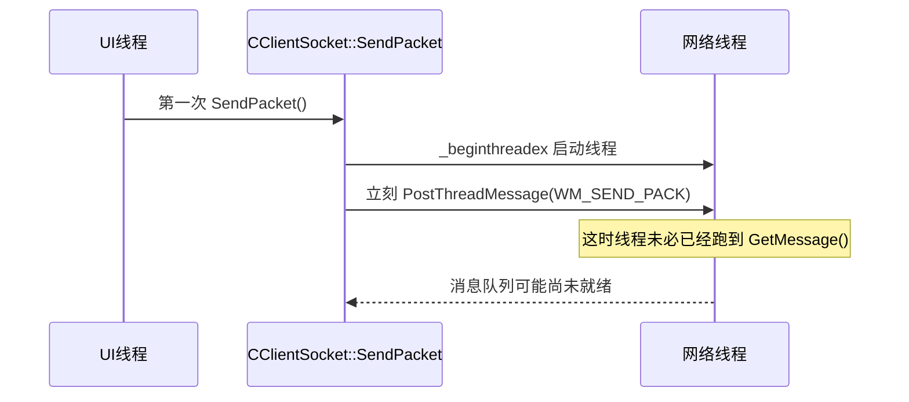
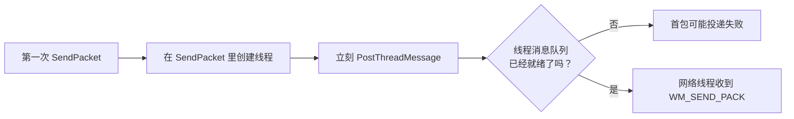
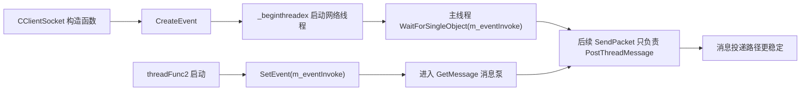

---
tags:
  - 项目/远控系统
heatmap_tracker: true
heatmap_group: 远控系统/6.网络与多线程问题
heatmap_weight: 1
git: "f8d695b"
git_msg: "1 进一步完善了网络线程的有效性，稳定性 / 2 解决了一个内存泄漏的bug"
---

# 6.8 消息机制补强：线程启动同步与ACK泄漏修复

> 基于提交 `f8d695b33bfac7eed7b496f6c6079d04efea9542`（2026-03-24）。如果说 [[6.7 消息机制闭环：窗口回调与上下文透传]] 做的是“把消息机制接到 UI 层”，那这一版做的就是“把这条链路真正扶稳”：网络线程不再等第一次发包时临时启动，而是在 `CClientSocket` 构造阶段就拉起并确认消息队列已就绪；主窗口 ACK 处理函数也终于开始按命令号分发，并把网络线程 `new` 出来的 `CPacket` 及时释放。  
> 换句话说，上一版像是刚把电路接通，但通电瞬间会闪一下、还会漏电；这一版开始补绝缘层和稳压器。相关 bug 见 [[Debug-015 SendPacket线程判断赋值误写]]、[[Debug-016 消息应答接线错误与分发条件误写导致机制失效]]、[[Debug-017 WM_SEND_PACK_ACK回调未释放CPacket导致内存泄漏]]。

---

## 这一版到底修了什么

| 变化点 | 代码表现 | 真正含义 |
|------|------|------|
| 网络线程改成“构造即启动” | `CClientSocket` 构造函数里 `CreateEvent + _beginthreadex + WaitForSingleObject` | 网络线程不再拖到第一次 `SendPacket()` 时再启动，避免首包投递时消息队列未就绪 |
| 增加启动握手事件 | `threadFunc2()` 一进入就 `SetEvent(m_eventInvoke)` | 主线程可以明确知道“消息泵已经跑起来了” |
| `SendPacket()` 删除懒启动逻辑 | 不再在 `SendPacket()` 里判断/创建线程 | 发包函数职责被收窄，只负责序列化并 `PostThreadMessage` |
| 主窗口消息映射修正 | `ON_MESSAGE(WM_SEND_PACK_ACK, &CRemoteClientDlg::OnSendPackAck)` | `WM_SEND_PACK_ACK` 终于真正交给主窗口自己的 handler 处理 |
| ACK 分发条件修正 | `switch (head.sCmd)` 替代 `switch (pPacket != NULL)` | 盘符、文件树、下载、测试连接终于按真实命令号分发 |
| 回调对象及时释放 | `CPacket head = *(CPacket*)wParam; delete (CPacket*)wParam;` | 网络线程传上来的 `new CPacket(pack)` 不再一路泄漏 |

---

## 与 [[6.7 消息机制闭环：窗口回调与上下文透传]] 的关系

上一版的核心结论是：

> 结构上的闭环已经搭起来了，但 ACK 分发接线和命令分派条件写错，导致运行时闭环仍然会断在窗口回调层。

这一版并没有再去扩展新功能，而是专门把上一版最危险的三个细节收口：

| 维度 | `6.7` 阶段 | `6.8` 阶段 |
|------|------|------|
| 网络线程启动时机 | 第一次 `SendPacket()` 时临时启动 | `CClientSocket` 构造时提前启动并等待消息泵就绪 |
| 首包投递稳定性 | 可能在消息队列未建立前就 `PostThreadMessage` | 通过 `m_eventInvoke` 显式握手，降低首包丢失风险 |
| 主窗口 ACK 接线 | `ON_MESSAGE` 接错到 `CWatchDialog` | 改回 `CRemoteClientDlg::OnSendPackAck` |
| ACK 分发条件 | `switch (pPacket != NULL)`，本质上只会得到 `0/1` | `switch (head.sCmd)`，真正按命令号分派 |
| 回调对象释放 | `new CPacket(pack)` 后无人释放 | 主窗口接到 ACK 后立即 `delete` |

所以这次提交的准确定位不是“消息机制又换了一版”，而是：

> **消息机制第一次开始具备“能稳定工作”的基础条件。**

---

## 为什么上一版看起来已经接通了，运行时却还不稳

### 问题 1：网络线程启动得太晚

上一版的思路是：

- 先调用 `SendPacket()`
- `SendPacket()` 里再看要不要启动线程
- 启动完立即 `PostThreadMessage`

这在代码层面看起来合理，但 Win32 的线程消息队列有个细节：

- **线程创建成功，不等于线程消息队列已经创建成功**
- 只有线程真正执行到 `GetMessage()` / `PeekMessage()` 之后，这个线程才算“有了消息队列”

也就是说，上一版存在一个很典型的竞态：



这就是为什么我在上一版笔记里说“结构上已经闭环，但有效性和稳定性还没真正站稳”。

### 问题 2：ACK 到主窗口之后，还是没有按命令号真正分发

上一版主窗口虽然已经写了 `OnSendPackAck()`，但有两处非常关键的细节错误：

- `ON_MESSAGE` 接错了类
- `switch` 条件写成了 `pPacket != NULL`

这就形成了一种很迷惑的现象：

- 看起来有 handler
- 看起来有 `case 1`、`case 2`、`case 4`
- 但真正运行起来，除了“碰巧等于 1”的路径外，其他分支根本进不去

### 问题 3：网络线程分配的 `CPacket` 没人回收

网络线程这边一直是这样发 ACK 的：

```cpp
::SendMessage(hWnd, WM_SEND_PACK_ACK, (WPARAM)new CPacket(pack), data.wParam);
```

也就是说：

- `CClientSocket::SendPack()` 在堆上 `new CPacket(pack)`
- 所有权交给窗口的 `OnSendPackAck()`
- 如果窗口处理完不 `delete`，这个对象就会每来一个包漏一个

这类泄漏最容易出现在：

- 文件树多包响应
- 下载多包响应
- 远程监控持续刷图

因为它们都不是“只来一包就结束”的场景。

---

## 两张图看懂这一版的修复思路

### 修复前：线程能启动，但不保证消息队列已经准备好



### 修复后：先等线程进入消息泵，再允许后续发包



---

## 核心实现

### 1. 构造阶段提前启动网络线程，并用事件确认消息泵已就绪

> 📁 `RemoteClient/CClientSocket.cpp` : `CClientSocket::CClientSocket` (行 41-65)  
> 📁 `RemoteClient/CClientSocket.cpp` : `threadFunc2` (行 254-265)  
> 📁 `RemoteClient/CClientSocket.h` : `m_eventInvoke` (行 297)

```cpp
CClientSocket::CClientSocket() :
    m_nIP(INADDR_ANY),
    m_nPort(0),
    m_sock(INVALID_SOCKET),
    m_bAutoClose(true),
    m_hThread(INVALID_HANDLE_VALUE)
{
    if (InitSockEnv() == FALSE)
    {
        ...
    }
    m_eventInvoke = CreateEvent(NULL, TRUE, FALSE, NULL);
    m_hThread = (HANDLE)_beginthreadex(NULL, 0, &CClientSocket::threadEntry, this, 0, &m_nThreadID);
    if (WaitForSingleObject(m_eventInvoke, 100) == WAIT_TIMEOUT)
    {
        TRACE("网络消息处理线程启动失败了！\r\n");
    }
    CloseHandle(m_eventInvoke);
    ...
}

void CClientSocket::threadFunc2()
{
    SetEvent(m_eventInvoke);
    MSG msg;
    while (::GetMessage(&msg, NULL, 0, 0))
    {
        ...
    }
}
```

**关键点解析**：

1. **线程创建从“发包时临时做”改成了“对象构造时先做”**  
   这一步直接把 [[Debug-015 SendPacket线程判断赋值误写]] 中那段错误逻辑整个挪走了。`SendPacket()` 不再关心线程该不该启动，也就不再有“每次发包都可能重建线程”的问题。

2. **`m_eventInvoke` 的作用不是业务同步，而是启动同步**  
   这里的 `CreateEvent / SetEvent / WaitForSingleObject` 不再像旧版本那样用于“等服务端响应”，而是用于“等网络线程进入消息泵”。这两个场景都用 Event，但语义完全不同。

3. **这其实是在修 Win32 线程消息队列的一个隐含前提**  
   `PostThreadMessage()` 只有在目标线程真正拥有消息队列时才可靠。构造阶段这段握手，就是在补这个前提。

> 📎 这一步可以看作是对 [[6.6 网络模块重构（线程事件机制改为消息机制）]] 中“首包消息队列竞态”风险的正式修补。

### 2. `SendPacket()` 终于退回到它该有的职责：序列化 + 投递

> 📁 `RemoteClient/CClientSocket.cpp` : `SendPacket` (行 129-136)

```cpp
bool CClientSocket::SendPacket(HWND hWnd, const CPacket& pack, bool isAutoClosed, WPARAM wParam)
{
    UINT nMode = isAutoClosed ? CSM_AUTOCLOSE : 0;
    std::string strOut;
    pack.Data(strOut);
    bool ret = PostThreadMessage(
        m_nThreadID,
        WM_SEND_PACK,
        (WPARAM)new PACKET_DATA(strOut.c_str(), strOut.size(), nMode, wParam),
        (LPARAM)hWnd
    );
    return ret;
}
```

这段代码看起来只是“少了几行”，但教学上非常值得强调：

- **旧写法**：`SendPacket()` 既要考虑线程有没有启动，又要发包
- **新写法**：`SendPacket()` 只做“打包并投递”

当一个函数职责缩小的时候，正确性往往会上升，因为它少做了一件最容易出竞态的事。

### 3. 主窗口 ACK 处理函数同时修了两个问题：命令分发错误 + 堆对象泄漏

> 📁 `RemoteClient/RemoteClientDlg.cpp` : `BEGIN_MESSAGE_MAP` (行 81-98)  
> 📁 `RemoteClient/RemoteClientDlg.cpp` : `OnSendPackAck` (行 433-470)

```cpp
BEGIN_MESSAGE_MAP(CRemoteClientDlg, CDialogEx)
    ...
    ON_MESSAGE(WM_SEND_PACK_ACK, &CRemoteClientDlg::OnSendPackAck)
END_MESSAGE_MAP()
```

```cpp
LRESULT CRemoteClientDlg::OnSendPackAck(WPARAM wParam, LPARAM lParam)
{
    ...
    if (wParam != NULL)
    {
        CPacket head = *(CPacket*)wParam;
        delete (CPacket*)wParam;
        switch (head.sCmd)
        {
        case 1:
            ...
        case 2:
            ...
        case 4:
            ...
        }
    }
    return 0;
}
```

**关键点解析**：

1. **`ON_MESSAGE` 终于接对了**  
   这一改直接修掉了 [[Debug-016 消息应答接线错误与分发条件误写导致机制失效]] 里最外层的“接线错误”。

2. **`switch (head.sCmd)` 才是真正的分发依据**  
   命令处理逻辑应该看包头里的 `sCmd`，而不是看“指针是不是非空”。这听上去像句废话，但实际工程里这类“一个条件写错，全体 case 形同虚设”的 bug 非常常见。

3. **先拷贝、再 delete，是这里最稳妥的写法**  
   代码不是直接拿着 `CPacket*` 在后面到处用，而是先拷贝出一个栈上的 `head`，然后马上 `delete` 原来的堆对象。  
   这有两个好处：
   - 释放责任很清晰，不会拖到某个 `case` 里忘记释放
   - 后续 `switch` 只操作栈对象，生命周期简单很多

> 📎 这里的泄漏问题详见 [[Debug-017 WM_SEND_PACK_ACK回调未释放CPacket导致内存泄漏]]

---

## Bug 修复详解

### Bug 1：`SendPacket()` 中的线程启动逻辑不稳定

> 📎 详见 [[Debug-015 SendPacket线程判断赋值误写]]

**现象**：线程可能重复创建，消息投递时机也不稳定。  
**根因**：线程启动被放在 `SendPacket()` 里，且旧代码还把判断写成了赋值表达式。

**修复前**：

```cpp
bool CClientSocket::SendPacket(...)
{
    if (m_hThread = INVALID_HANDLE_VALUE)
    {
        m_hThread = (HANDLE)_beginthreadex(...);
    }
    return PostThreadMessage(...);
}
```

**修复后**：

```cpp
CClientSocket::CClientSocket()
{
    m_eventInvoke = CreateEvent(NULL, TRUE, FALSE, NULL);
    m_hThread = (HANDLE)_beginthreadex(...);
    WaitForSingleObject(m_eventInvoke, 100);
}

void CClientSocket::threadFunc2()
{
    SetEvent(m_eventInvoke);
    while (GetMessage(...)) { ... }
}
```

**为什么这样更稳**：

1. 线程生命周期和发包生命周期被拆开了。
2. 发包函数不再掺杂线程创建逻辑。
3. `PostThreadMessage()` 的目标线程在第一次业务发包前就已经准备好。

### Bug 2：ACK 回调对象无人释放，长期运行会漏内存

> 📎 详见 [[Debug-017 WM_SEND_PACK_ACK回调未释放CPacket导致内存泄漏]]

**现象**：网络线程每处理一个成功响应，就 `new CPacket(pack)` 一次；窗口端如果不回收，就会形成持续泄漏。  
**根因**：跨线程消息传递时，对象所有权只传递了，没有闭环回收。

**修复前**：

```cpp
if (pPacket != NULL)
{
    CPacket& head = *pPacket;
    switch (pPacket != NULL)
    {
        ...
    }
}
```

**修复后**：

```cpp
if (wParam != NULL)
{
    CPacket head = *(CPacket*)wParam;
    delete (CPacket*)wParam;
    switch (head.sCmd)
    {
        ...
    }
}
```

**为什么这样是对的**：

1. 释放责任集中在 `OnSendPackAck()` 的入口，不依赖某个 `case` 分支记得手动回收。
2. 通过栈对象 `head` 继续处理逻辑，避免“删了之后还继续用原指针”的生命周期错误。

### Bug 3：主窗口 ACK 接线和分发条件终于修正

> 📎 详见 [[Debug-016 消息应答接线错误与分发条件误写导致机制失效]]

这次提交把这两个点一起修了：

- `ON_MESSAGE(WM_SEND_PACK_ACK, &CRemoteClientDlg::OnSendPackAck)`
- `switch (head.sCmd)`

这也是为什么我会把这版叫做“补强”而不是“重构”：它没有换模型，而是在把上一版已经搭好的模型真正修到能用。

---

## 当前版本的准确结论

### 已经做对的部分

- 网络线程在 `CClientSocket` 构造时就被拉起，消息泵就绪后才允许后续正常发包，首包稳定性明显增强。
- `SendPacket()` 职责收缩，发包路径比上一版更干净、更容易推理。
- 主窗口 ACK 终于接到了自己的 handler，并按 `sCmd` 正确分发。
- `WM_SEND_PACK_ACK` 成功路径中的 `CPacket*` 在主窗口里得到了释放，内存泄漏闭环第一次补上。

### 还没做完的部分

- `CWatchDialog` 那条链路这次没有同步修补，监视窗口里仍然残留 `ret == 6` / `lstPacks` 旧逻辑。
- `SendMessage(hWnd, WM_SEND_PACK_ACK, ...)` 仍然是同步回调，如果窗口线程卡住，网络线程也会一起卡住。
- `DownloadEnd()` 里对状态对话框仍然用的是 `SW_SHOW`，下载收尾的 UI 语义还不够统一。
- `PACKET_DATA::operator=` 仍然没有把 `wParam` 复制完整，这类小缺口虽然这次没炸，但后面最好补平。

> 本次提交的准确定位：**消息机制不再只是“能跑起来”，而是第一次开始具备“可以长期跑、可以连续跑”的稳定性基础。**

---

## Win32 / Winsock / MFC 关键机制

### 1. `CreateEvent` / `SetEvent` / `WaitForSingleObject`：这次用来做“启动同步”

```cpp
HANDLE CreateEvent(
    LPSECURITY_ATTRIBUTES lpEventAttributes,
    BOOL bManualReset,
    BOOL bInitialState,
    LPCTSTR lpName
);
```

| 参数/返回 | 当前项目里的意义 |
|------|------|
| `bManualReset = TRUE` | 手动复位事件，适合“线程启动完成”这种单次状态通知 |
| `bInitialState = FALSE` | 刚创建时未触发，主线程需要等待网络线程来 `SetEvent` |
| 返回值 | 成功返回事件句柄，供构造函数和网络线程共享 |

在这次提交里，这组 API 不再表示“服务端响应到了”，而是表示：

- 主线程：先等一等
- 网络线程：我已经进入消息泵了，可以发包了

这是一种非常经典的“线程启动握手”用法。

### 2. `PostThreadMessage` 为什么这次终于更可靠了

`PostThreadMessage()` 的难点从来不在函数签名，而在它有一个不显眼的前提：

- **目标线程必须已经拥有消息队列**

这次提交通过 `m_eventInvoke` 做启动握手，本质上就是在补这个前提。

### 3. 跨线程消息里的对象所有权，不能靠“默认大家都懂”

当你写下：

```cpp
::SendMessage(hWnd, WM_SEND_PACK_ACK, (WPARAM)new CPacket(pack), data.wParam);
```

就等于同时做了两件事：

1. 传递数据
2. 传递所有权

如果第二件事没写清楚，代码就算逻辑上能跑，资源管理上也一定会出问题。

这一版的真正价值就在于：**它把所有权闭环补出来了。**

---

## 易错点与调试

> [!warning] 消息机制里最难缠的 bug，往往不是 send/recv 本身，而是“线程什么时候真的准备好”和“堆对象最后由谁释放”。

### 1. 线程创建成功，不等于线程消息队列就绪

```cpp
// ❌ 错误心智：线程一创建，马上就能 PostThreadMessage
m_hThread = (HANDLE)_beginthreadex(...);
PostThreadMessage(m_nThreadID, WM_SEND_PACK, ...);

// ✅ 更稳的做法：先让线程 SetEvent，再开始正常发消息
m_eventInvoke = CreateEvent(NULL, TRUE, FALSE, NULL);
m_hThread = (HANDLE)_beginthreadex(...);
WaitForSingleObject(m_eventInvoke, 100);
```

### 2. 跨线程传指针，必须提前想好“谁 delete”

```cpp
// ❌ 错误：只 new，不约定回收者
SendMessage(hWnd, WM_SEND_PACK_ACK, (WPARAM)new CPacket(pack), ...);

// ✅ 正确：窗口 handler 立即接管并回收
CPacket head = *(CPacket*)wParam;
delete (CPacket*)wParam;
```

### 3. 让发包函数同时承担线程管理，通常会让 bug 藏得更深

```cpp
// ❌ 发包函数里顺手做线程创建，最容易把竞态带进去
bool SendPacket(...)
{
    start_thread_if_needed();
    PostThreadMessage(...);
}

// ✅ 把线程生命周期提前收口，发包函数只做发包
```

---

## 关联知识

- [[6.7 消息机制闭环：窗口回调与上下文透传]] - 上一版：窗口 ACK 入口已经出现，但接线、分发和回收都还不稳
- [[Debug-015 SendPacket线程判断赋值误写]] - 这次通过提前启动线程，等于把旧错误路径直接裁掉
- [[Debug-016 消息应答接线错误与分发条件误写导致机制失效]] - 主窗口 ACK 接线和命令号分发在本次得到修正
- [[Debug-017 WM_SEND_PACK_ACK回调未释放CPacket导致内存泄漏]] - 本次新增记录的资源管理问题
- [[6.6 网络模块重构（线程事件机制改为消息机制）]] - 更早一版里已经指出消息队列就绪竞态风险
- [[2.3 设计网络传输包协议]] - `CPacket` 的协议结构和 `sCmd` 含义

---

## 代码索引

| 功能 | 文件 | 位置 |
|------|------|------|
| 构造阶段启动网络线程 | `RemoteClient/CClientSocket.cpp` | `CClientSocket::CClientSocket` (41-65) |
| 启动握手事件 `m_eventInvoke` | `RemoteClient/CClientSocket.h` | 成员变量 (297) |
| 发包逻辑精简 | `RemoteClient/CClientSocket.cpp` | `SendPacket` (129-136) |
| 网络线程就绪通知 | `RemoteClient/CClientSocket.cpp` | `threadFunc2` (254-265) |
| 主窗口消息映射修正 | `RemoteClient/RemoteClientDlg.cpp` | `BEGIN_MESSAGE_MAP` (81-98) |
| ACK 对象释放 + 命令分发 | `RemoteClient/RemoteClientDlg.cpp` | `OnSendPackAck` (433-470) |

---

## 更新记录

| 日期 | 变更 |
|------|------|
| 2026-03-24 | 初始版本：基于提交 `f8d695b33bfac7eed7b496f6c6079d04efea9542`，记录消息线程启动同步、主窗口 ACK 修正与回调对象泄漏修复 |
