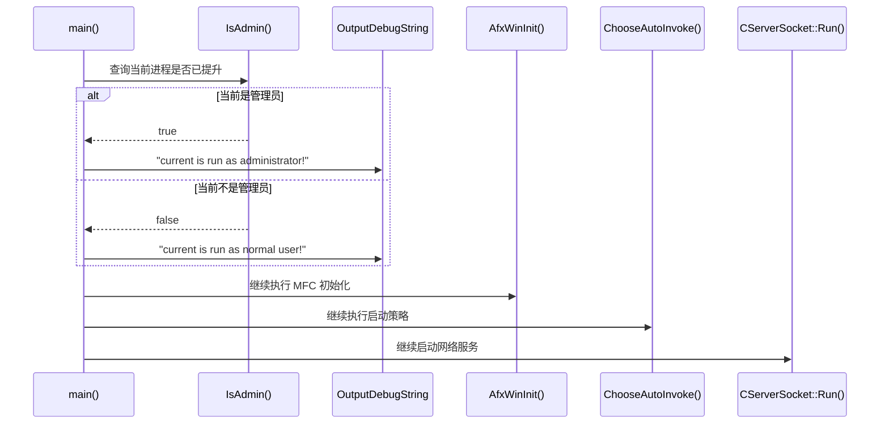

---
tags:
  - 项目/远控系统
  - Windows/UAC
  - Windows/Token
  - Windows/安全边界
heatmap_tracker: true
heatmap_group: 远控系统/7.线程同步与安全
heatmap_weight: 1
git: 993c1ab
git_msg: "1 完成功能：管理员运行权限检测 2 错误信息显示函数"
aliases:
  - 管理员身份检测
  - Admin detection before startup
  - 启动前管理员检测
---

# 7.1 管理员权限检测

> 基于提交 `993c1ab634f4b936a8fa5468db4d461bea63c604`（2026-04-01）整理。
> 这个提交第一次把“当前进程是不是管理员”从默认假设，变成了启动阶段里的显式检测步骤。
> 它还没有真正完成提权，也没有阻止普通权限进程继续启动网络服务；它做的事更像是先把这条安全边界照亮，让后续版本可以在这条边界上继续加控制逻辑。

> [!note]
> 这篇只讲“检测”和“错误可视化”，不讲“提权接力”。如果要继续看普通权限进程如何尝试拉起管理员进程，请接着看 [[7.2 管理员权限获取与提权重启]]。

---

## 这次提交到底改了什么

| 改动点 | 代码落点 | 实际含义 |
|------|------|------|
| 新增 `ShowError()` | `RemoteCtrl.cpp:95-106` | 把 `GetLastError()` 转成可读文本，输出到调试器 |
| 新增 `IsAdmin()` | `RemoteCtrl.cpp:108-131` | 显式查询当前进程令牌是否已经提升 |
| `main()` 开头新增权限判断 | `RemoteCtrl.cpp:133-145` | 程序在进入 MFC 初始化和网络服务前，先知道自己当前的权限身份 |

如果只看“用户可见结果”，这次提交最容易被低估，因为它并没有弹出新的功能界面，也没有把服务端真正切换成“管理员才能启动”。

但从架构角度看，它做了一件非常重要的事：

- 在 `CServerSocket::Run()` 之前，插入了一道新的启动前检查；
- 让“权限状态”第一次进入了主流程判断链；
- 为下一步的 [[7.2 管理员权限获取与提权重启]] 提供了落脚点。

---

## 先把启动链讲清楚

`993c1ab` 之后，`RemoteCtrl` 的启动顺序不再只是“初始化成功 -> 进入服务端循环”，而是变成了下面这样：

1. `main()` 一进入就调用 `IsAdmin()`。
2. 根据返回值打印一条调试日志：
   - 管理员：`current is run as administrator!`
   - 普通用户：`current is run as normal user!`
3. 然后程序仍然继续执行 `GetModuleHandle`、`AfxWinInit`。
4. 初始化成功后，继续执行 `ChooseAutoInvoke()` 和 `CServerSocket::Run()`。

这里最重要的一点是：

> 这个版本只做“识别”，还没有做“拦截”。

也就是说，不管 `IsAdmin()` 返回 `true` 还是 `false`，当前提交里的程序最后都会继续往服务端主循环走。权限检测在这个版本里还是一个**观测点**，不是**控制点**。



这张图故意把两条分支都汇合回了 `AfxWinInit()` 之后的公共路径，因为这正是 `993c1ab` 的真实边界：

- 它已经能看见权限差异；
- 但它还没有利用这份差异去改变服务启动资格。

---

## 与前一版相比，真正变化在哪里

| 维度 | 提交前 | `993c1ab` 之后 |
|------|------|------|
| 启动前是否知道当前权限身份 | 不知道 | 知道，且会显式检查 |
| API 失败时是否能看到系统错误 | 几乎看不到 | 至少能输出到调试器 |
| 非管理员是否会被拦下 | 不会 | 仍然不会 |
| `CServerSocket::Run()` 前是否有安全边界雏形 | 没有 | 有了，但还只是检测边界 |

所以这次提交的意义，不是“管理员机制已经完成”，而是：

> 服务端第一次开始承认“权限身份”是启动阶段里一个值得单独判断的变量。

---

## 核心实现

### 1. `ShowError()`：先把失败原因从数字变成文字

新增的 `ShowError()` 很短：

```cpp
void ShowError()
{
    LPWSTR lpMessageBuf = NULL;
    FormatMessage(
        FORMAT_MESSAGE_FROM_SYSTEM | FORMAT_MESSAGE_ALLOCATE_BUFFER,
        NULL,
        GetLastError(),
        MAKELANGID(LANG_NEUTRAL, SUBLANG_DEFAULT),
        (LPWSTR)&lpMessageBuf,
        0,
        NULL);
    OutputDebugString(lpMessageBuf);
    LocalFree(lpMessageBuf);
}
```

它做的事情可以拆成三步：

1. 读取最近一次 Win32 错误码；
2. 用 `FormatMessage` 把错误码翻译成系统文本；
3. 把文本送到 `OutputDebugString`。

这里要特别注意，`993c1ab` 里的 `ShowError()` 还**没有**弹 `MessageBox`。
所以这次所谓“错误信息显示函数”，更准确地说是**面向开发者调试输出**，不是面向最终用户的错误提示。

### 2. `IsAdmin()`：通过进程令牌判断是否已经提升

`IsAdmin()` 是这个提交真正的核心：

```cpp
bool IsAdmin()
{
    HANDLE hToken = NULL;
    if (!OpenProcessToken(GetCurrentProcess(), TOKEN_QUERY, &hToken))
    {
        ShowError();
        return false;
    }

    TOKEN_ELEVATION eve;
    DWORD len = 0;
    if (GetTokenInformation(hToken, TokenElevation, &eve, sizeof(eve), &len) == FALSE)
    {
        ShowError();
        return false;
    }
    CloseHandle(hToken);

    if (len == sizeof(eve))
    {
        return eve.TokenIsElevated;
    }
    printf("length of tokeninformation is %d\r\n", len);
    return false;
}
```

这个函数的设计思路很直接：

- 先用 `OpenProcessToken` 打开当前进程令牌；
- 再用 `GetTokenInformation(..., TokenElevation, ...)` 查询令牌提升状态；
- 返回 `TOKEN_ELEVATION::TokenIsElevated`。

在这个项目语境里，它解决的不是“能不能连网”，而是“当前这个进程接下来准备进入自启动和网络服务时，身份是不是符合作者的预期”。

### 3. `main()`：权限检测第一次进入主流程

`main()` 里新增的是这一段：

```cpp
if (IsAdmin())
{
    OutputDebugString(L"current is run as administrator!\r\n");
}
else
{
    OutputDebugString(L"current is run as normal user!\r\n");
}
```

这段代码放置的位置非常关键。
它出现在 `GetModuleHandle(nullptr)` 和 `AfxWinInit(...)` 之前，也就是说：

- 权限判断发生得非常早；
- 它不依赖 MFC UI 初始化；
- 它把“权限状态”放到了整个服务端生命周期的最前面。

但同时也要看清它在这个提交里的局限：

- 管理员分支只打印日志；
- 普通用户分支也只打印日志；
- 两个分支之后，程序还是继续往后执行。

因此，`993c1ab` 还没有形成“管理员才允许进入服务”的真正门禁，它只是把这道门的轮廓先画出来了。

---

## 这里涉及到的 Win32 API

| API | 在本项目里的作用 | 为什么要理解它 |
|------|------|------|
| `OpenProcessToken` | 打开当前进程令牌 | 没有令牌，就无从判断当前权限身份 |
| `GetTokenInformation` | 读取 `TokenElevation` | 这是“是不是管理员/是否已提升”的直接依据 |
| `FormatMessage` | 生成系统错误文本 | 避免排查失败时只看到一个模糊的 `false` |
| `OutputDebugString` | 把结果写到调试输出 | 这个提交里所有错误和权限状态，基本都靠它来观察 |

在这次提交里，最值得建立的直觉是：

- `IsAdmin()` 不是去查“用户组名是不是管理员”；
- 它查的是“当前进程令牌是不是已经提升”。

这对 UAC 语境下的 Windows 程序非常关键，因为“当前账户有管理员身份”和“当前这个进程正以已提升令牌运行”不是一回事。

---

## 容易忽略的坑

> [!warning]
> `993c1ab` 把检测链搭起来了，但它留下来的几个细节坑，恰恰也是后面必须继续演进的原因。

### 1. “检测失败”和“不是管理员”都会返回 `false`

`IsAdmin()` 里无论是：

- `OpenProcessToken` 失败；
- `GetTokenInformation` 失败；
- 真的不是管理员；
- `len` 不符合预期；

最后都会落成 `false`。

这意味着调用方在当前版本里其实分不清：

- 当前只是普通用户；
- 还是检测逻辑本身出了错。

也正因为如此，`main()` 里的日志分支虽然看起来是“普通用户 vs 管理员”，本质上却把“检测异常”也折叠进了“普通用户”那一边。

### 2. `GetTokenInformation` 失败路径会漏掉 `CloseHandle`

当前代码里：

```cpp
if (GetTokenInformation(...) == FALSE)
{
    ShowError();
    return false;
}
CloseHandle(hToken);
```

如果 `GetTokenInformation` 失败，函数会直接返回，`hToken` 没有被关闭。
这说明当前版本虽然把权限检测能力补上了，但失败路径资源释放还没有完全收尾。

### 3. `ShowError()` 只写调试输出，对用户几乎不可见

这次提交里 `ShowError()` 还不会弹窗。
如果程序不是在调试器环境下运行，用户通常看不到这些错误文本。

所以这个版本更像是“开发调试辅助”，还不是“产品级错误反馈”。
这也是为什么后续 `49d8651` 会继续把 `MessageBox` 补进来。

### 4. 权限检测已经前置，但服务启动资格还没被收紧

这是 `993c1ab` 最容易让人误判的一点：

- 检测位置已经很靠前；
- 但结果还没有真正参与控制流。

因此，在这个版本里，普通权限进程依然会走到：

- `ChooseAutoInvoke()`
- `CServerSocket::Run()`

所以这篇 `7.1` 最适合被理解成：

> 管理员启动链的“检测版”，而不是“执行版”。

真正把这条检测边界升级成控制边界的，是后面的 [[7.2 管理员权限获取与提权重启]]。

---

## 它和 [[6.15 通过 Startup 文件夹实现开机自启]]、[[7.2 管理员权限获取与提权重启]] 的关系

和 [[6.15 通过 Startup 文件夹实现开机自启]] 的关系是：

- `6.15` 关心的是“后续登录时怎么自动出现”；
- `7.1` 关心的是“在进入这条自启动路径之前，当前进程到底是什么权限身份”。

和 [[7.2 管理员权限获取与提权重启]] 的关系是：

- `7.1` 先解决“看见状态”；
- `7.2` 再解决“根据状态决定谁继续往后跑”。

如果把它们串成一条演进线，可以这么理解：

1. `6.15` 已经把自启动策略切到 Startup 文件夹；
2. `7.1` 又在它前面补了一道管理员检测；
3. `7.2` 再把这道检测升级成真正的启动门禁。

---

## 代码索引

| 功能点 | 文件 | 位置 |
|------|------|------|
| 自启动路径写入 | `RemoteCtrl/RemoteCtrl/RemoteCtrl.cpp` | `WriteStartupDir`（`56-66`） |
| 启动前自启动策略 | `RemoteCtrl/RemoteCtrl/RemoteCtrl.cpp` | `ChooseAutoInvoke`（`68-93`） |
| 错误可视化 | `RemoteCtrl/RemoteCtrl/RemoteCtrl.cpp` | `ShowError`（`95-106`） |
| 管理员状态检测 | `RemoteCtrl/RemoteCtrl/RemoteCtrl.cpp` | `IsAdmin`（`108-131`） |
| 主流程里的权限日志分支 | `RemoteCtrl/RemoteCtrl/RemoteCtrl.cpp` | `main`（`133-183`） |

---

## 关联笔记

- [[6.15 通过 Startup 文件夹实现开机自启]] - 说明管理员检测之后，程序仍会进入的那条自启动路径
- [[7.2 管理员权限获取与提权重启]] - `7.1` 的直接后续版本，把“检测”推进成“控制”
- [[6.5 重构网络模块（线程事件机制→消息机制）]] - 对比“真正进入服务端主循环之后”，网络与消息层是如何继续演进的

---

## 更新记录

| 日期 | 变更 |
|------|------|
| 2026-04-02 | 重写 `7.1`：基于 `993c1ab` 单独整理管理员权限检测与错误可视化，并与 `7.2` 做清晰分工 |
