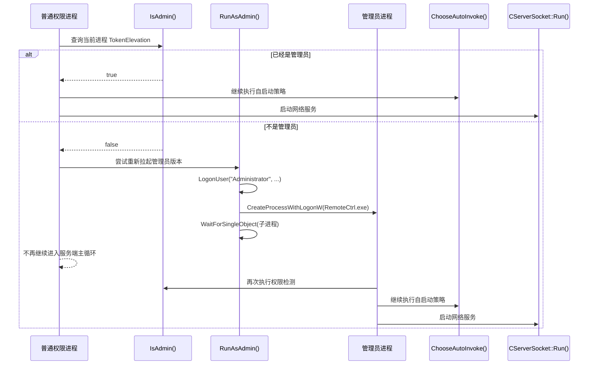

---
tags:
  - 项目/远控系统
  - Windows/UAC
  - Windows/Token
  - Windows/进程创建
  - Windows/安全边界
heatmap_tracker: true
heatmap_group: 远控系统/7.线程同步与安全
heatmap_weight: 1
git: 49d8651
git_msg: "1 管理员权限的获取"
aliases:
  - 管理员权限获取与提权重启
  - Elevation bootstrap and admin relaunch
  - 管理员提权接力
---

# 7.2 管理员权限获取与提权重启

> 基于提交 `993c1ab634f4b936a8fa5468db4d461bea63c604` 和 `49d8651f5879603bb8762563d7659a4b0ced234a`（2026-04-01）整理。
> 这两个提交应该合起来看：`993c1ab` 先把“当前进程是不是管理员”从隐式假设变成显式检测，`49d8651` 再把“如果不是管理员，就尝试重新拉起管理员进程”的执行链补上。
> 它真正改变的不是 socket 协议，也不是线程函数本身，而是 **谁有资格继续进入 `CServerSocket::Run()`** 这道启动前安全边界。

> [!note]
> 这一节放在“线程同步与安全”下面，是因为它在网络线程和命令处理逻辑启动前，先做了一次 **进程级的安全接力**：普通权限进程负责检测和尝试拉起，高权限进程才允许继续进入后续的自启动与网络服务阶段。

---

## 这两个提交一起改了什么

| 提交 | 新增/变化的核心 | 实际含义 |
|------|------|------|
| `993c1ab` | `ShowError()`、`IsAdmin()`，以及 `main()` 里的权限日志 | 先建立“看见当前权限状态”的能力 |
| `49d8651` | `ShowError()` 增加弹框，新增 `RunAsAdmin()`，`main()` 对非管理员分支提前返回 | 把权限检查变成真正的启动门禁，而不只是调试输出 |

如果只看 `993c1ab`，程序即使发现自己不是管理员，也还是会继续往下执行 `ChooseAutoInvoke()` 和 `CServerSocket::Run()`。
到了 `49d8651`，非管理员分支才第一次真正被拦下来：它会先尝试拉起新的管理员进程，然后当前进程不再继续进入服务端主循环。

---

## 先把整条启动链讲清楚

把这两个提交合并起来之后，`RemoteCtrl` 的启动顺序已经不是“初始化完成就直接开网络服务”，而是下面这条更长的链：

1. `main()` 完成 `AfxWinInit()`。
2. 调用 `IsAdmin()` 判断当前令牌是否已提升。
3. 如果已经是管理员，继续执行 [[6.15 通过 Startup 文件夹实现开机自启]] 里的 `ChooseAutoInvoke()`。
4. 如果不是管理员，就调用 `RunAsAdmin()` 试图重新拉起一个管理员版本的 `RemoteCtrl.exe`。
5. 只有管理员路径才允许继续进入 `CServerSocket::Run()`，后面的网络监听、命令分发和线程逻辑才会真正开始。



这张图最关键的一点不是“新开了一个进程”，而是 **网络服务的启动资格被前置到管理员身份之后**。
从这一刻开始，`ChooseAutoInvoke()` 和 `CServerSocket::Run()` 都不再是无条件执行的，而是依赖前面的权限门禁是否通过。

---

## 核心实现

### 1. `ShowError()` + `IsAdmin()`：先把权限状态看清楚

`993c1ab` 先补了一层最基础的观察能力。它不再默认“当前就是管理员”，而是显式去读当前进程令牌：

```cpp
if (!OpenProcessToken(GetCurrentProcess(), TOKEN_QUERY, &hToken))
{
    ShowError();
    return false;
}
if (GetTokenInformation(hToken, TokenElevation, &eve, sizeof(eve), &len) == FALSE)
{
    ShowError();
    return false;
}
return eve.TokenIsElevated;
```

这里真正关键的 Win32 语义是：

- `OpenProcessToken`：拿到当前进程的访问令牌。
- `GetTokenInformation(..., TokenElevation, ...)`：查询这个令牌是否已经被提升。
- `FormatMessage`：把 `GetLastError()` 转成可读错误字符串，交给 `OutputDebugString` 和 `MessageBox` 输出。

这一步的价值，不是“多了一个布尔值”，而是把启动前的权限状态从**隐式假设**变成了**显式分支条件**。

### 2. `RunAsAdmin()`：把“普通用户继续运行”改成“普通用户先让位”

`49d8651` 真正让权限检测有了行为后果。新的 `RunAsAdmin()` 做了三件事：

1. 先尝试 `LogonUser(L"Administrator", ...)`；
2. 再调用 `CreateProcessWithLogonW(...)` 创建新的 `RemoteCtrl.exe`；
3. 当前进程用 `WaitForSingleObject(pi.hProcess, INFINITE)` 等待子进程结束。

这说明当前设计不是“在原进程内原地提权”，而是想做一个**双进程接力模型**：

- 普通权限进程负责发现“自己不够格”；
- 新拉起的管理员进程负责真正进入服务端主循环；
- 原进程理论上只承担一次启动中转的角色。

这和线程同步里的“谁先跑、谁能继续往后跑”非常像，只不过这里同步的对象不是两个线程，而是**两个权限不同的进程分支**。

### 3. `main()`：管理员检测终于成了真正的启动门

这次最关键的代码变化其实在 `main()`：

```cpp
if (IsAdmin())
{
    OutputDebugString(L"current is run as administrator!\r\n");
}
else
{
    OutputDebugString(L"current is run as normal user!\r\n");
    RunAsAdmin();
    return nRetCode;
}

CCommand cmd;
ChooseAutoInvoke();
int ret = CServerSocket::getInstance()->Run(&CCommand::RunCommand, &cmd);
```

对比两个提交可以看到一个很重要的演进：

- `993c1ab` 里，非管理员路径只是打印日志，然后仍然继续进入服务端流程。
- `49d8651` 里，非管理员路径会先执行 `RunAsAdmin()`，随后直接 `return`，不再继续进入 `ChooseAutoInvoke()` 和 `CServerSocket::Run()`。

这意味着权限检测终于从“观察逻辑”变成了“控制逻辑”。

### 4. 它和 [[6.14 启动权限请求与开机自启]] / [[6.15 通过 Startup 文件夹实现开机自启]] 的关系

`6.14` 和 `6.15` 讲的是“服务端如何在后续登录中自动出现”，重点是**持久化策略**；
这一节讲的是“服务端在进入那套持久化策略之前，是否已经处于被允许的权限身份”，重点是**启动前安全边界**。

把三篇笔记连起来看，当前版本的启动顺序已经变成：

`AfxWinInit -> IsAdmin / RunAsAdmin -> ChooseAutoInvoke -> CServerSocket::Run`

也就是说，`ChooseAutoInvoke()` 不再是最靠前的前置逻辑了。
在它前面又多出了一层“权限检查/进程接力”门禁。

---

## 涉及到的 Win32 API

| API | 在本项目里的作用 | 这次为什么重要 |
|------|------|------|
| `OpenProcessToken` | 打开当前进程令牌 | 让程序第一次能显式知道自己是不是管理员 |
| `GetTokenInformation(TokenElevation)` | 读取令牌提升状态 | 决定是否允许当前进程继续走服务端启动链 |
| `FormatMessage` | 生成系统错误文本 | 让权限/登录失败不再只剩一个模糊的失败结果 |
| `LogonUser` | 尝试拿到指定账户的登录令牌 | 这是 `RunAsAdmin()` 的第一步 |
| `CreateProcessWithLogonW` | 以指定账户身份创建新进程 | 这是“管理员进程接棒”的核心 API |
| `WaitForSingleObject` | 等待新进程结束 | 说明当前设计不是立即退出，而是阻塞式等待接力结果 |

---

## 当前版本还没闭环的地方

> [!warning]
> 这两个提交把“权限门禁”这件事显式写进了启动链，但它们离一个真正稳定的管理员启动方案还有明显距离。

### 1. 这不是标准的 UAC 提权路径

当前代码不是让“当前用户弹出 UAC 对话框后提升自己”，而是尝试直接：

- 登录一个名为 `Administrator` 的账户；
- 再用那个账户去创建新进程。

这和常见的 `ShellExecute(..., "runas", ...)` 思路不是一回事。
它强依赖目标机器存在可用的 `Administrator` 账户、对应密码与登录策略也满足要求；而当前代码把域和密码都传成了 `NULL`，成功条件非常苛刻。

另外，当前代码虽然先 `LogonUser` 拿到了 `hToken`，但实际创建进程时调用的却是 `CreateProcessWithLogonW`，之前拿到的 token 并没有真正参与创建过程。这说明实现还处在 `CreateProcessWithTokenW` 和 `CreateProcessWithLogonW` 两种方案之间的中间态。

### 2. `STARTUPINFO` 没有补 `cb`

`RunAsAdmin()` 里有：

```cpp
STARTUPINFO si = { 0 };
PROCESS_INFORMATION pi = { 0 };
```

但没有看到：

```cpp
si.cb = sizeof(si);
```

对 `CreateProcessWithLogonW` 这类 API 来说，这个字段本来就是调用契约的一部分。
少了它，这条提权启动链本身就可能直接失败。

### 3. 新进程路径依赖当前工作目录，而不是模块真实路径

当前代码用的是：

```cpp
GetCurrentDirectory(MAX_PATH, sPath);
CString strCmd = sPath;
strCmd += _T("\\RemoteCtrl.exe");
```

这拿到的是**当前工作目录**，不是当前模块自己的路径。
如果程序未来从快捷方式、脚本或其他目录启动，这个拼出来的 `RemoteCtrl.exe` 就不一定指向真正的可执行文件。

### 4. 管理员身份与 Startup 安装路径没有完全对齐

[[6.15 通过 Startup 文件夹实现开机自启]] 里留下的 Startup 目标路径还是硬编码的：

`C:\\Users\\49522\\AppData\\Roaming\\Microsoft\\Windows\\Start Menu\\Programs\\Startup\\RemoteCtrl.exe`

但 `49d8651` 又试图把后续服务端运行身份切到 `Administrator`。
这就带来了一个语义错位：

- 运行身份想切到管理员；
- 持久化目标却还绑定在旧的普通用户目录。

也就是说，这条“管理员进程接力链”和上一版“按用户 Startup 目录持久化”的设计，目前还没有真正协同一致。

### 5. 当前进程不是“让位退出”，而是“阻塞等待”

`RunAsAdmin()` 最后调用了：

```cpp
WaitForSingleObject(pi.hProcess, INFINITE);
```

这意味着普通权限进程不会在拉起子进程后立刻退出，而是会一直等到子进程结束。
如果管理员子进程真的进入了长时间运行的网络服务，那么原进程也会长期挂在等待状态里。
所以这更像“阻塞式父子进程接力”，而不是“无缝交棒”。

---

## 这一版真正带来的结构性变化

把这两个提交一起看，它们真正带来的不是“管理员功能终于完成了”，而是下面这件更基础的事：

- 远控服务不再默认任何权限身份都可以直接启动。
- 启动路径第一次被拆成了“检测 -> 判断 -> 接力 -> 再进入网络服务”。
- `CServerSocket::Run()` 之前多出了一层明确的安全边界。

也正因为如此，这一节更适合放在“线程同步与安全”下面。
它讨论的不是 mutex、event 或 critical section，而是**在更前面的启动阶段，谁可以继续把后面的线程和网络服务真正跑起来**。

---

## 代码索引

| 功能点 | 文件 | 位置 |
|------|------|------|
| Startup 持久化路径 | `RemoteCtrl/RemoteCtrl/RemoteCtrl.cpp` | `WriteStartupDir`（`56-66`） |
| 启动前自启动策略 | `RemoteCtrl/RemoteCtrl/RemoteCtrl.cpp` | `ChooseAutoInvoke`（`68-93`） |
| 系统错误可视化 | `RemoteCtrl/RemoteCtrl/RemoteCtrl.cpp` | `ShowError`（`95-106`） |
| 管理员状态检测 | `RemoteCtrl/RemoteCtrl/RemoteCtrl.cpp` | `IsAdmin`（`108-131`） |
| 管理员进程拉起 | `RemoteCtrl/RemoteCtrl/RemoteCtrl.cpp` | `RunAsAdmin`（`133-167`） |
| 启动安全门与服务入口 | `RemoteCtrl/RemoteCtrl/RemoteCtrl.cpp` | `main`（`169-214`） |

---

## 关联笔记

- [[6.14 启动权限请求与开机自启]] - 更早一版的权限/持久化引导，重点是机器级安装思路
- [[6.15 通过 Startup 文件夹实现开机自启]] - 把持久化策略切到用户 Startup 文件夹的版本
- [[6.5 重构网络模块（线程事件机制→消息机制）]] - 对比“进程已经成功启动之后”，网络与消息分发层是怎么演进的

---

## 更新记录

| 日期 | 变更 |
|------|------|
| 2026-04-01 | 初始版本：合并分析 `993c1ab` 和 `49d8651`，聚焦管理员检测、提权接力与启动前安全边界 |
