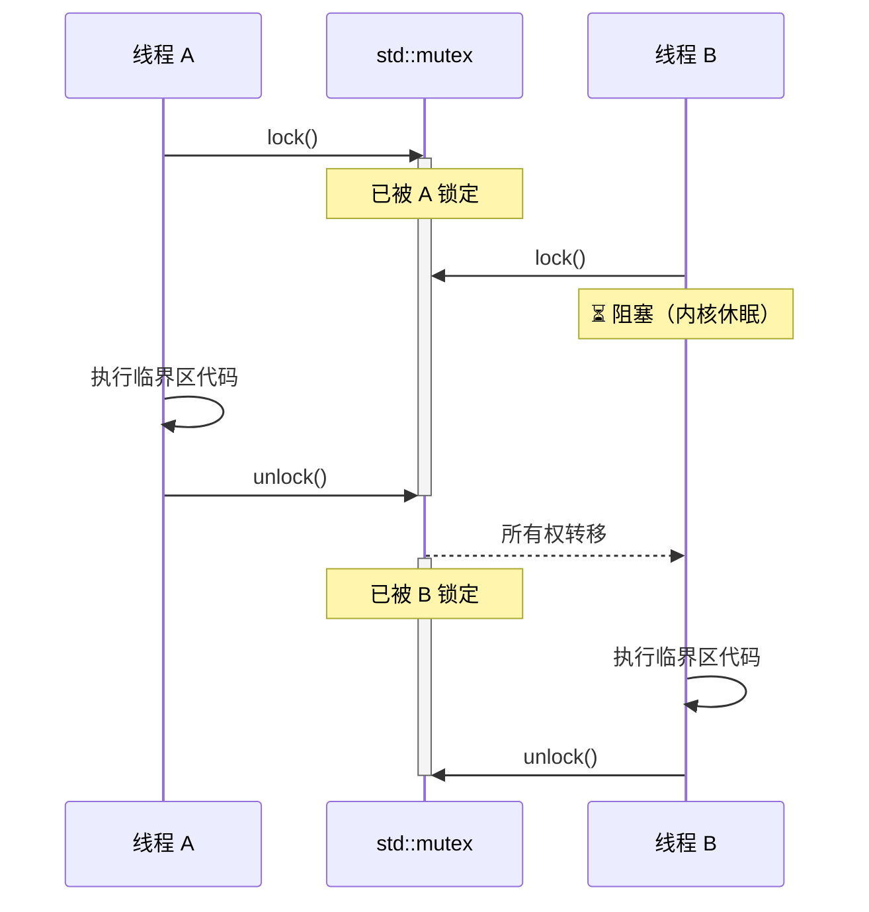
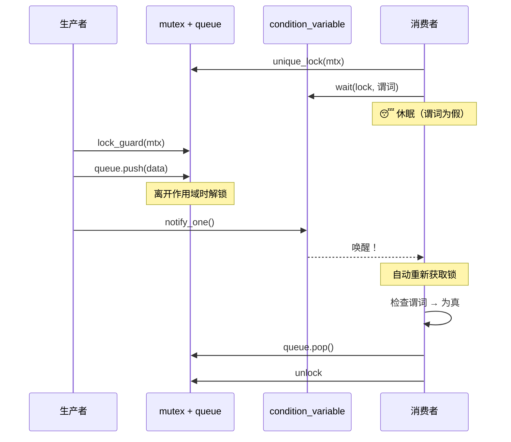
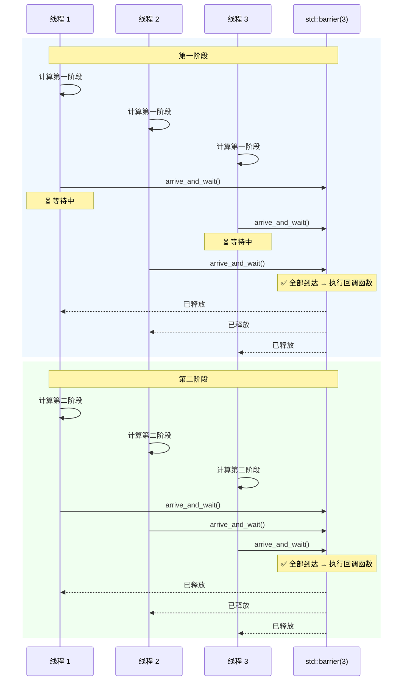
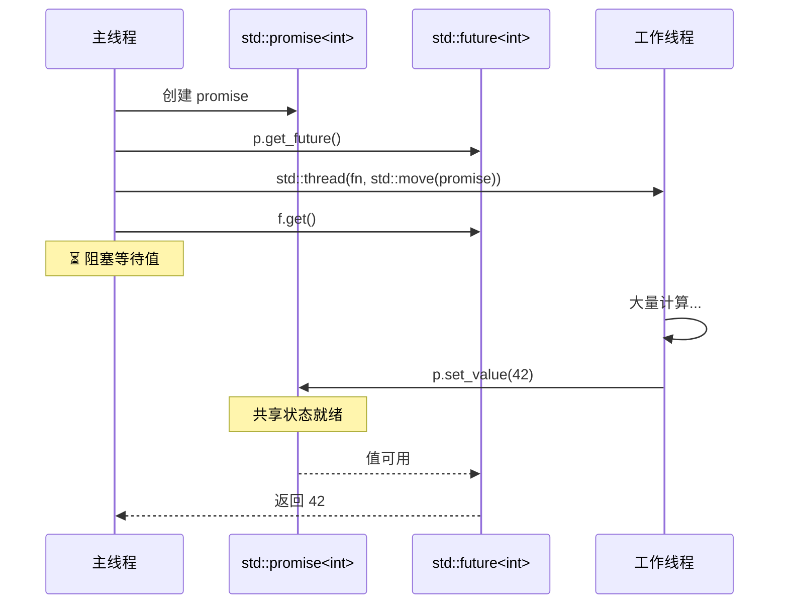
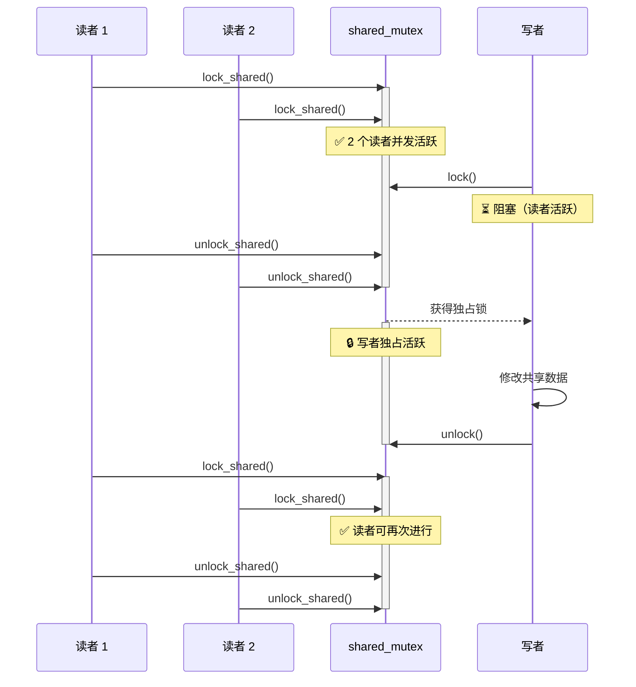

# C++ 线程数据同步 - 全面复习

Modern C++（C++11 至 C++23）提供了 **9 大类**线程数据同步机制，分为三个层次：**阻塞式**、**无锁**和**高层抽象**。

---

## 1. 架构总览

![[1 1.svg|1278]]

---

## 2. 分类详解

### 2.1 互斥量（Mutex）家族

最基础的同步原语。互斥量提供**独占所有权**：同一时刻只有一个线程可以持有锁。

| 类型 | 可重入 | 超时 | 共享 | 引入版本 |
|------|--------|------|------|----------|
| `std::mutex` | 否 | 否 | 否 | C++11 |
| `std::recursive_mutex` | **是** | 否 | 否 | C++11 |
| `std::timed_mutex` | 否 | **是** | 否 | C++11 |
| `std::shared_mutex` | 否 | 否 | **是** | C++17 |
| `std::shared_timed_mutex` | 否 | **是** | **是** | C++14 |

**优点：**
- 语义简单清晰，易于理解
- 操作系统级别的公平调度（取决于平台）
- 与所有 RAII 锁封装兼容
- 默认正确；基本的 `std::mutex` 很难被意外误用

**缺点：**
- 竞争时需要内核系统调用；上下文切换开销重
- 持有多个互斥量时存在死锁风险（可用 `std::scoped_lock` 缓解）
- `recursive_mutex` 开销约为普通 mutex 的 2 倍，通常是设计异味
- 实时系统上存在优先级反转风险
- 不能跨进程使用

```cpp
// 最佳实践：始终使用 RAII 封装
std::mutex mtx;
{
    std::lock_guard lock(mtx);  // C++17 起支持 CTAD
    // 临界区
}

// 多个互斥量：使用 scoped_lock 避免死锁
std::scoped_lock lock(mtx1, mtx2, mtx3);
```

#### Mermaid：互斥量加锁/解锁时序



---

### 2.2 RAII 锁封装

本身不是同步原语，但是**正确使用互斥量的关键工具**。

| 封装类                 | 延迟加锁 | 超时  |  共享   | 多互斥量  | 引入版本  |
| ------------------- | :--: | :-: | :---: | :---: | ----- |
| `lock_guard<M>`     |  否   |  否  |   否   |   否   | C++11 |
| `unique_lock<M>`    |  是   |  是  |   否   |   否   | C++11 |
| `shared_lock<M>`    |  是   |  是  | **是** |   否   | C++14 |
| `scoped_lock<M...>` |  否   |  否  |   否   | **是** | C++17 |

**使用场景：**
- **`lock_guard`**：简单的作用域加锁，无需额外功能
- **`unique_lock`**：需要延迟加锁、超时加锁，或需传入 `condition_variable::wait()`
- **`shared_lock`**：读写模式（`shared_mutex`）的读者端
- **`scoped_lock`**：同时锁定**多个**互斥量（内部通过 `std::lock()` 保证无死锁）

---

### 2.3 条件变量

允许线程**等待某个条件为真**，避免忙等待。

| 类型 | 搭配使用 | 引入版本 |
|------|---------|----------|
| `condition_variable` | 仅 `std::unique_lock<std::mutex>` | C++11 |
| `condition_variable_any` | 任意 `Lockable` 类型 | C++11 |

**优点：**
- 高效的等待/通知机制：等待期间不消耗 CPU
- 可与任意谓词组合使用
- 天然适合生产者-消费者、事件循环、线程池

**缺点：**
- **虚假唤醒**：必须始终使用谓词形式 `cv.wait(lock, pred)`
- 需要与互斥量和共享状态配合使用
- `condition_variable_any` 有内部加锁的额外开销
- `notify_one` 与 `notify_all` 的选择容易引发细微 bug

```cpp
std::mutex mtx;
std::condition_variable cv;
std::queue<Task> queue;

// 生产者
{
    std::lock_guard lock(mtx);
    queue.push(task);
}
cv.notify_one();

// 消费者
std::unique_lock lock(mtx);
cv.wait(lock, [&]{ return !queue.empty(); });  // 处理虚假唤醒
auto task = queue.front();
queue.pop();
```

#### Mermaid：条件变量生产者-消费者时序



---

### 2.4 信号量（C++20）

**基于计数**的同步原语。信号量维护一个内部计数器：`acquire()` 将其减一（为 0 时阻塞），`release()` 将其加一。

| 类型 | 计数范围 | 等价物 | 引入版本 |
|------|---------|--------|----------|
| `counting_semaphore<N>` | 0..N | 通用信号量 | C++20 |
| `binary_semaphore` | 0..1 | `counting_semaphore<1>` | C++20 |

**优点：**
- 无所有权概念，简单信号场景比互斥量更轻量
- 可由**不同线程** release（释放）
- 天然适合资源池、限流、生产者-消费者
- `binary_semaphore` 可替代 `condition_variable` 实现简单信号模式

**缺点：**
- 无所有权追踪，调试更困难
- 标准库无 RAII 封装
- 不能与 `std::lock_guard` 或 `std::unique_lock` 配合使用
- 误用会导致计数不平衡的细微 bug

**与 Mutex 的区别：** 互斥量有所有权，同一线程加锁和解锁。信号量没有所有权，任意线程均可 release。互斥量保护**数据**；信号量控制**访问计数**。

---

### 2.5 屏障与门闩（C++20）

**阶段同步**：让 N 个线程在某个同步点等待，直到所有线程都到达。

| 类型 | 可复用 | 完成回调 | 引入版本 |
|------|--------|---------|----------|
| `std::latch` | **否**（一次性） | 否 | C++20 |
| `std::barrier` | **是**（多阶段） | 是 | C++20 |

**优点：**
- 比手动使用原子量加条件变量计数清晰得多
- `barrier` 支持阶段间的完成回调函数
- `latch` 可由任意线程多次递减

**缺点：**
- 参与者数量在构造时固定
- 较新，库和工具链支持可能有限
- 调试阶段同步问题本身较为复杂

```cpp
// Latch：等待 N 个任务完成
std::latch done(3);
for (int i = 0; i < 3; ++i) {
    pool.submit([&]{ do_work(); done.count_down(); });
}
done.wait();  // 阻塞直到计数降为 0

// Barrier：反复阶段同步
auto on_phase_done = []() noexcept { merge_results(); };
std::barrier sync(num_threads, on_phase_done);
// 在每个线程中：
while (has_work()) {
    do_phase_work();
    sync.arrive_and_wait();  // 阶段间同步
}
```

#### Mermaid：屏障阶段同步时序



---

### 2.6 原子操作

在硬件层面通过 CPU 原子指令实现的**无锁**（有时是无等待）同步。

| 类型 | 无锁保证 | 引入版本 |
|------|---------|----------|
| `std::atomic<T>` | 整数/指针类型通常是 | C++11 |
| `std::atomic_flag` | **始终**无锁（保证） | C++11 |
| `std::atomic_ref<T>` | 与 `atomic<T>` 相同 | C++20 |
| `std::atomic<std::shared_ptr<T>>` | 由实现定义 | C++20 |

**关键操作：** `load`、`store`、`exchange`、`compare_exchange_weak/strong`、`fetch_add`、`fetch_sub`、`fetch_and/or/xor`、`wait/notify_one/notify_all`（C++20）。

**优点：**
- 无内核转换；低竞争下速度通常快几个数量级
- 不会死锁
- 无等待算法（如原子计数器）可提供硬实时保证
- 无锁数据结构的基础构建块

**缺点：**
- 正确推理**极其**困难（内存序、ABA 问题）
- 仅限可平凡复制且适合硬件原子宽度的类型
- `compare_exchange_weak` 可能虚假失败，需用循环
- 无锁**不等于**无等待；CAS 循环在高竞争下可能饥饿
- 跨缓存行的伪共享会严重损害性能；必要时使用 `alignas(64)`

```cpp
// 简单原子计数器
std::atomic<int> counter{0};
counter.fetch_add(1, std::memory_order_relaxed);

// CAS 模式（无锁栈压栈）
void push(Node* new_node) {
    new_node->next = head.load(std::memory_order_relaxed);
    while (!head.compare_exchange_weak(
        new_node->next, new_node,
        std::memory_order_release,
        std::memory_order_relaxed));
}

// 使用 atomic_flag 实现自旋锁
class Spinlock {
    std::atomic_flag flag = ATOMIC_FLAG_INIT;
public:
    void lock()   { while (flag.test_and_set(std::memory_order_acquire)); }
    void unlock() { flag.clear(std::memory_order_release); }
};
```

---

### 2.7 内存序

控制原子操作在线程间**可见性**的顺序。C++ 内存模型定义了从弱到强的一系列选项。

| 内存序 | 保证 | 使用场景 |
|--------|------|---------|
| `relaxed` | 仅原子性，无顺序保证 | 计数器、统计 |
| `consume` | 数据依赖顺序（实践中已基本弃用） | 极少推荐 |
| `acquire` | 此后的读操作能看到对应 `release` 之前的写 | 锁获取 |
| `release` | 此前的写操作在对应 `acquire` 之后可见 | 锁释放 |
| `acq_rel` | 同时具备 acquire 和 release | 读-改-写操作 |
| `seq_cst` | 全局全序（默认） | 更易保证正确性 |

> **经验法则：** 从 `seq_cst`（默认）开始。只有在性能分析证明有必要、且能形式化推理正确性时，才考虑放宽内存序。

---

### 2.8 Future / Promise / Async

线程间的**一次性**异步值传递。

| 组件 | 角色 | 引入版本 |
|------|------|----------|
| `std::promise<T>` | 写端（生产者设置值或异常） | C++11 |
| `std::future<T>` | 读端（消费者获取值，未就绪时阻塞） | C++11 |
| `std::shared_future<T>` | 同一值的多个消费者 | C++11 |
| `std::async(policy, fn)` | 启动异步任务，返回 future | C++11 |
| `std::packaged_task<F>` | 包装可调用对象并提供 future | C++11 |

**优点：**
- 线程间简洁的一次性值传递
- 通过 `promise::set_exception` 实现跨线程异常传播
- `std::async` 配合 `launch::async` 提供简单的异步并发

**缺点：**
- 仅能使用一次；future/promise 对不可复用
- `std::async` 配合 `launch::deferred` 可能永远不并行执行
- 来自 `std::async` 的 `std::future` 析构函数可能阻塞
- 新的执行模型出现前，不支持 `.then()` 等续延操作
- 无法干净地取消正在进行的异步任务

#### Mermaid：Future / Promise 异步时序



---

### 2.9 `call_once` / `once_flag`

线程安全的**一次性初始化**。恰好一个线程执行可调用对象；其他线程阻塞等待。

```cpp
std::once_flag flag;
Connection* conn;

Connection* get_connection() {
    std::call_once(flag, []{
        conn = new Connection("host:port");
    });
    return conn;
}
```

**优点：**
- 比双重检查锁定更简单、更正确
- 首次调用后开销接近零
- 异常安全：若可调用对象抛出异常，另一个线程会重试

**缺点：**
- 仅能使用一次
- 不可重置；不存在 `once_flag::reset()`
- 若大量线程竞争首次调用，内部同步仍可能阻塞

---

### 2.10 `thread_local`

通过给每个线程独立副本，**完全避免同步**。

```cpp
thread_local std::vector<int> cache;  // 每个线程拥有自己的 cache
```

**优点：**
- 零同步开销；无竞争，无锁
- 非常适合每线程的缓存、分配器、随机数状态和错误码

**缺点：**
- 数据不共享，不能用于线程间通信
- 生命周期绑定到线程；在线程退出时清理
- 内存占用增加（N 个线程 × 对象大小）
- 在线程池中可能出乎意料，因为状态会在任务间持久存在

---

## 3. 综合对比矩阵

| 机制 | 开销 | 可扩展性 | 竞争代价 | 复杂度 | 主要使用场景 |
|------|:----:|:--------:|:--------:|:------:|-------------|
| `mutex` | 中 | 低 | 内核休眠 | 低 | 通用临界区 |
| `recursive_mutex` | 高 | 低 | 内核休眠 | 低 | 递归加锁（通常是设计异味） |
| `shared_mutex` | 中 | 中-高 | 读者并发 | 中 | 读多写少场景 |
| `condition_variable` | 中 | 中 | 内核休眠 | 中 | 生产者-消费者、事件等待 |
| `semaphore` | 中-低 | 中 | 内核休眠 | 中 | 资源池、信号 |
| `latch` | 中 | 中 | 内核休眠 | 低 | 等待 N 个任务完成 |
| `barrier` | 中 | 中 | 内核休眠 | 中 | 阶段同步 |
| `atomic<T>` | **极低** | **极高** | 自旋/CPU 消耗 | **高** | 计数器、标志、无锁数据结构 |
| `future/promise` | 中 | 低 | 内核休眠 | 低 | 一次性异步结果 |
| `call_once` | 低 | 高 | 仅首次调用 | 低 | 单例/惰性初始化 |
| `thread_local` | **无** | **极高** | **无** | 低 | 每线程状态 |

---

## 4. `shared_mutex` 读写时序



---

## 5. 决策流程图：如何选择合适的同步机制


![[gemini-svg (22).svg|921]]
---

## 6. 核心要点

1. **默认选择：** `std::mutex` + `std::lock_guard`——简单、正确、易于理解。
2. **读多写少：** 读者使用 `std::shared_mutex` + `std::shared_lock`。
3. **极致吞吐：** 简单共享状态用 `std::atomic<T>`；无锁结构用 CAS（仅限专家）。
4. **生产者-消费者：** 使用带谓词的 `std::condition_variable`；禁止裸 `wait()`。
5. **阶段同步：** C++20 中用 `std::barrier`（可复用）或 `std::latch`（一次性）。
6. **一次性异步结果：** `std::future` / `std::promise`。
7. **避免共享：** 每个线程可保留独立副本时，使用 `thread_local`。
8. **内存序：** 从 `seq_cst` 开始，仅在性能分析和形式化推理后才考虑放宽。
9. **始终使用 RAII：** 正常代码路径中避免手动 `.lock()` / `.unlock()`。
10. **多个互斥量：** 使用 `std::scoped_lock` 防止死锁。
