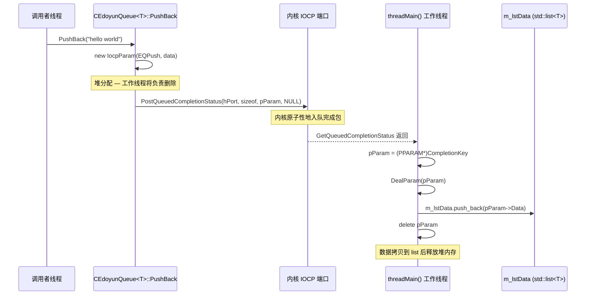
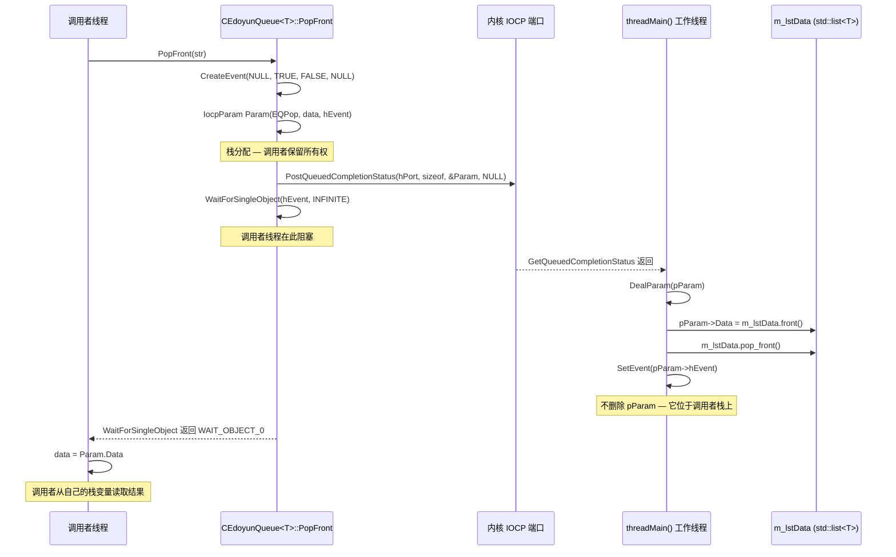

> **主题**: 本文档记录了 `CEdoyunQueue<T>` 的设计与实现，这是一个线程安全的队列模板类，使用 Windows I/O 完成端口（IOCP）作为其同步骨架。内核本身代替用户态互斥锁来序列化所有队列操作。
> 相关笔记: [[7.4 线程同步方式分析]] · [[7.5.0 IOCP 简介]] · [[7.6 RemoteCtrl 线程退出、队列增长与内存生命周期]] · [[7.7 CEdoyunQueue 迁移、模板实例化与仅运行时 Bug]]

---

## 1. 本次变更

IOCP 队列工作跨越了三次提交：

| 提交 | SHA | 变更内容 |
|--------|-----|---------------|
| 原始 IOCP 实验 | `7c646042` | 在 `RemoteCtrl.cpp` 中手动调用 `PostQueuedCompletionStatus`，仅支持 push，存在若干 Bug（`_kbhit` 判断反转、与局部变量同作用域内调用 `_endthread`） |
| Bug 修复 + 类骨架 | `9cb60ac3` | 修复内存泄漏和逻辑错误；在 `RemoteClient` 中创建 `CEdoyunQueue` 类声明（方法体不完整） |
| 完成模板类 | `c6fa8056` | 完整的 `CEdoyunQueue<T>` 模板，包含 `PushBack`/`PopFront`/`Size`/`Clear`，迁移至 `RemoteCtrl`，集成到 `main()` |

`CEdoyunQueue<T>` 在 `c6fa8056` 时**尚未完成**的事项：
- 尚未接入实际的远控服务器循环（`main()` 中的 `CServerSocket::Run` 路径仍被注释）
- 没有队列大小限制——如果 push 速率超过 pop 速率，可能导致无限增长

---

## 2. 与之前版本的关系

| 维度 | 原始 IOCP 实验 (`7c646042`) | CEdoyunQueue\<T\> 封装 (`c6fa8056`) |
|-----------|----------------------------------|----------------------------------------|
| 队列存储 | `threadmain()` 内部的局部 `std::list<std::string>` | 类成员 `m_lstData` |
| Push API | 直接 `new IOCP_PARAM` + `PostQueuedCompletionStatus` | `PushBack(const T& data)` — 封装了分配和投递 |
| Pop API | 基于回调（`cbFunc`），发射后不管 | 同步 `PopFront(T& data)`，带事件信号 |
| 关闭方式 | 手动投递哨兵 + `WaitForSingleObject(hIOCP)`（错误的句柄） | 析构函数投递哨兵 + `WaitForSingleObject(m_hThread)` |
| 线程入口 | 传递 IOCP 句柄给线程 | 传递 IOCP 句柄但 `threadEntry` 将其强转为 `this*`（分析见 [[7.7 CEdoyunQueue 迁移、模板实例化与仅运行时 Bug|7.7]]） |
| 析构安全 | 在与局部变量同作用域内调用 `_endthread()` — 可能跳过析构函数 | 分离 `threadEntry`/`threadMain`；`m_lock` 原子守卫 |
| 模板支持 | 未模板化，硬编码 `std::string` | `template<class T>`，支持任意可拷贝类型 |


![[图片/SVG/7.5-lock-free-queue-based-on-completion-port-compare.svg|997]]


---

## 3. 主流程

### 3.1 PushBack 流程



### 3.2 PopFront 流程



关键设计洞察：**PushBack 是异步的**（调用者不等待），而 **PopFront 是同步的**（调用者在事件上阻塞，直到工作线程处理请求并发送信号）。

---

## 4. 核心实现

### 4.1 IocpParam — 消息信封

```cpp
typedef struct IocpParam
{
    // ===== 1. 此结构体是"消息"，在 IOCP 队列中传递 =====
    // 每个队列操作 (push, pop, size, clear) 都被编码为 IocpParam
    // 并通过 CompletionKey 投递到完成端口。

    size_t nOperator;   // 哪个操作: EQPush, EQPop, EQSize, EQClear
    T Data;             // 负载 — 携带 push/pop 的实际数据
    HANDLE hEvent;      // 用于同步操作的事件句柄 (pop, size)
                        // 对于发射后不管的操作为 NULL (push, clear)

    IocpParam(int op, const T& data, HANDLE hEve = NULL)
    {
        nOperator = op;
        Data = data;
        hEvent = hEve;
    }
    IocpParam()
    {
        nOperator = EQNone;
    }
} PPARAM;
```

**双重所有权模型** — 这是最重要的设计细节：

| 操作 | 分配方式 | 谁删除？ | 原因 |
|-----------|-----------|-------------|------|
| `EQPush` | `new IocpParam` (堆) | 工作线程（`DealParam` 中 `delete pParam`） | 调用者发射后不管 |
| `EQClear` | `new IocpParam` (堆) | 工作线程（`DealParam` 中 `delete pParam`） | 调用者发射后不管 |
| `EQPop` | `IocpParam Param(...)` (栈) | 无人 — 析构函数自动运行 | 调用者在事件上等待，从自己的栈读取结果 |
| `EQSize` | `IocpParam Param(...)` (栈) | 无人 — 析构函数自动运行 | 调用者在事件上等待，从自己的栈读取结果 |

**风险点**：如果工作线程意外地对栈分配的 `EQPop` 参数调用 `delete`，程序将因无效释放而崩溃。

### 4.2 构造函数 — 创建 IOCP 队列和工作线程

```cpp
CEdoyunQueue()
{
    // ===== 1. 初始化析构守卫 =====
    m_lock = false;     // std::atomic<bool> — 防止析构期间的新操作

    // ===== 2. 创建纯 IOCP 队列 (无 I/O 设备关联) =====
    m_hCompletionPort = CreateIoCompletionPort(
        INVALID_HANDLE_VALUE,   // 无文件/套接字 — 纯队列模式
        NULL,                   // 创建新端口 (非附加到现有端口)
        NULL,                   // 无默认完成键
        1                       // 允许 1 个并发线程操作此端口
    );

    // ===== 3. 启动工作线程 =====
    m_hThread = INVALID_HANDLE_VALUE;
    if (m_hCompletionPort != NULL)
    {
        m_hThread = (HANDLE)_beginthread(
            &CEdoyunQueue<T>::threadEntry,
            0,                          // 默认栈大小
            m_hCompletionPort           // ⚠ 风险: 传递 IOCP 句柄，但 threadEntry
                                        //   将其强转为 CEdoyunQueue<T>*
                                        //   完整调试故事见 [[7.7]]
        );
    }
}
```

**整体职责**：设置 IOCP 内核对象并派生专用工作线程来处理所有队列操作。

**API 解释**：使用 `INVALID_HANDLE_VALUE` 调用 `CreateIoCompletionPort` 创建"纯"完成端口——不绑定到任何套接字或文件句柄。第四个参数 `1` 表示最多只有一个线程可以主动出队，这提供了天然的序列化。

**风险点**：`_beginthread` 的第三个参数传递 `m_hCompletionPort`（一个 `HANDLE` 值），但 `threadEntry` 将其强转为 `CEdoyunQueue<T>*`。这是 [[7.7 CEdoyunQueue 迁移、模板实例化与仅运行时 Bug]] 中记录的 Bug。

### 4.3 PushBack — 异步入队

```cpp
bool PushBack(const T& data)
{
    // ===== 1. 堆分配消息信封 =====
    IocpParam* pParam = new IocpParam(EQPush, data);

    // ===== 2. 如果正在析构则提前退出 =====
    if (m_lock)
    {
        delete pParam;      // 清理 — 如果不能投递则不要泄漏
        return false;
    }

    // ===== 3. 投递到内核队列 =====
    bool ret = PostQueuedCompletionStatus(
        m_hCompletionPort,
        sizeof(PPARAM),             // dwNumberOfBytesTransferred — 携带结构体大小
        (ULONG_PTR)pParam,          // CompletionKey — 携带指向我们参数的指针
        NULL                        // lpOverlapped — 未使用
    );

    // ===== 4. 处理投递失败 =====
    if (ret == false)
        delete pParam;              // 投递失败 — 调用者仍拥有内存

    return ret;
}
```

**输入**：`T` 的常量引用（要入队的数据）。
**输出**：成功投递到 IOCP 返回 `true`，否则返回 `false`。
**关键步骤**：分配 → 检查析构锁 → 投递 → 失败时清理。
**风险点**：在 `m_lock` 检查和 `PostQueuedCompletionStatus` 调用之间存在 TOCTOU（检查时使用/使用时检查）窗口。如果析构函数在这两行之间设置 `m_lock = true`，投递可能成功但工作线程可能已退出。

### 4.4 PopFront — 带事件信号的同步出队

```cpp
bool PopFront(T& data)
{
    // ===== 1. 创建手动重置事件用于同步 =====
    HANDLE hEvent = CreateEvent(NULL, TRUE, FALSE, NULL);
    //                          ^      ^     ^
    //                          |      |     初始状态：无信号
    //                          |      手动重置（SetEvent 后保持有信号）
    //                          默认安全描述符

    // ===== 2. 栈分配消息信封 =====
    IocpParam Param(EQPop, data, hEvent);
    // 注意: Param 位于此线程的栈上 — 工作线程绝不能删除它

    // ===== 3. 如果正在析构则提前退出 =====
    if (m_lock)
    {
        if (hEvent) CloseHandle(hEvent);
        return false;
    }

    // ===== 4. 投递 pop 请求到 IOCP 队列 =====
    bool ret = PostQueuedCompletionStatus(
        m_hCompletionPort,
        sizeof(PPARAM),
        (ULONG_PTR)&Param,         // ⚠ 传递栈变量的地址
        NULL
    );
    if (ret == false)
    {
        CloseHandle(hEvent);
        return false;
    }

    // ===== 5. 阻塞直到工作线程处理此请求 =====
    ret = WaitForSingleObject(hEvent, INFINITE) == WAIT_OBJECT_0;

    // ===== 6. 从栈变量拷贝结果 =====
    if (ret)
    {
        data = Param.Data;          // 工作线程将前端元素写入 Param.Data
    }
    return ret;
}
```

**整体职责**：向工作线程发送"pop"请求并阻塞，直到工作线程出队前端元素并将其写回调用者的 `Param.Data`。

**为什么使用事件信号？** 调用者需要*同步*获取结果，但所有队列访问都通过单个工作线程序列化。事件桥接了这个差距：调用者投递请求，然后在 `WaitForSingleObject` 上睡眠。工作线程处理请求，写入结果，并调用 `SetEvent` 唤醒调用者。

**风险点**：通过 `CompletionKey` 传递的 `&Param` 地址指向此线程的栈。如果此函数在工作线程处理请求之前返回（例如由于超时或早期错误），工作线程将解引用悬垂的栈指针。

### 4.5 DealParam — 工作端调度器

```cpp
void DealParam(PPARAM* pParam)
{
    switch (pParam->nOperator)
    {
    case EQPush:
        // ===== Push: 拷贝数据到内部 list，然后释放堆参数 =====
        m_lstData.push_back(pParam->Data);
        delete pParam;                      // 由 PushBack 堆分配 — 工作线程拥有所有权
        break;

    case EQPop:
        // ===== Pop: 提取前端元素，信号通知等待的调用者 =====
        if (m_lstData.size() > 0)
        {
            pParam->Data = m_lstData.front();
            m_lstData.pop_front();
        }
        if (pParam->hEvent != NULL)
        {
            SetEvent(pParam->hEvent);       // 唤醒调用者线程
        }
        // ⚠ 不要删除 pParam — 它位于调用者的栈上
        break;

    case EQSize:
        // ===== Size: 将计数写入 nOperator，信号通知调用者 =====
        pParam->nOperator = m_lstData.size();   // 复用 nOperator 字段作为返回值
        if (pParam->hEvent != NULL)
        {
            SetEvent(pParam->hEvent);
        }
        // ⚠ 不要删除 pParam — 由 Size() 栈分配
        break;

    case EQClear:
        // ===== Clear: 清空 list，释放堆参数 =====
        m_lstData.clear();
        delete pParam;                      // 由 Clear 堆分配 — 工作线程拥有所有权
        break;

    default:
        OutputDebugStringA("未知操作符!\r\n");
        break;
    }
}
```

**关键设计规则**：带 `hEvent` 的操作（Pop, Size）由调用者栈分配 — 工作线程必须信号事件但绝不能 `delete` 参数。不带 `hEvent` 的操作（Push, Clear）由堆分配 — 工作线程必须在处理后 `delete`。

### 4.6 threadMain — The Worker Loop

```cpp
void threadMain()
{
    DWORD dwTransferred = 0;
    PPARAM* pParam = NULL;
    ULONG_PTR CompletionKey = 0;
    OVERLAPPED* pOverlapped = NULL;

    // ===== 1. Main processing loop — blocks on the IOCP queue =====
    while (GetQueuedCompletionStatus(
        m_hCompletionPort,
        &dwTransferred,
        &CompletionKey,
        &pOverlapped,
        INFINITE))                  // Block forever until a packet arrives
    {
        // ===== 2. Check for shutdown sentinel =====
        if ((dwTransferred == 0) || (CompletionKey == NULL))
        {
            printf("thread is prepare to exit!\r\n");
            break;                  // Exit the main loop
        }

        // ===== 3. Dispatch the operation =====
        pParam = (PPARAM*)CompletionKey;
        DealParam(pParam);
    }

    // ===== 4. Drain loop — process any remaining items after shutdown signal =====
    while (GetQueuedCompletionStatus(
        m_hCompletionPort,
        &dwTransferred,
        &CompletionKey,
        &pOverlapped,
        0))                         // Timeout = 0 — return immediately if empty
    {
        if ((dwTransferred == 0) || (CompletionKey == NULL))
        {
            printf("thread is prepare to exit!\r\n");
            continue;               // Skip additional sentinels
        }
        pParam = (PPARAM*)CompletionKey;
        DealParam(pParam);
    }

    // ===== 5. Close the completion port =====
    CloseHandle(m_hCompletionPort);
}
```

**整体职责**：这是序列化所有队列操作的单个工作线程。它阻塞在 `GetQueuedCompletionStatus` 上等待工作，通过 `DealParam` 处理每个项，并在关闭期间排空剩余项。

**排空循环**（第二个 `while`）：关闭哨兵打破主循环后，内核 FIFO 队列中可能仍有项。排空循环使用超时 `0`（非阻塞）来处理所有剩余项，确保不会泄漏堆分配的参数。

### 4.7 析构函数 — 安全关闭

```cpp
~CEdoyunQueue()
{
    // ===== 1. 防止重入并阻止新操作 =====
    if (m_lock) return;             // 已经在析构
    m_lock = true;                  // 原子标志 — PushBack/PopFront/Size/Clear 将退出

    // ===== 2. 在清空成员之前保存句柄 =====
    HANDLE hTemp = m_hCompletionPort;

    // ===== 3. 投递关闭哨兵 =====
    PostQueuedCompletionStatus(m_hCompletionPort, 0, NULL, NULL);
    // dwTransferred=0, CompletionKey=NULL — 触发 threadMain 中的 break

    // ===== 4. 等待工作线程完成 =====
    WaitForSingleObject(m_hThread, INFINITE);

    // ===== 5. 清理 =====
    m_hCompletionPort = NULL;
    CloseHandle(hTemp);
}
```

**风险点**：这里的 `CloseHandle(hTemp)` 关闭了 IOCP 句柄，但 `threadMain()` 也在其循环结束时调用 `CloseHandle(m_hCompletionPort)`。这是一个**双重关闭 Bug** — 同一个句柄被关闭两次。第二次关闭操作在已无效的句柄上，这在 Windows 上是未定义行为（通常静默但可能损坏句柄表）。

---

## 5. IOCP 前置知识

关于 IOCP 是什么、解决什么问题、四步生命周期、常用 API 与典型应用场景，建议先阅读 [[7.5.0 IOCP 简介]]。那篇笔记把 `7.5` 中偏通用的 IOCP 背景独立拆了出来，这样本文可以更聚焦在 `CEdoyunQueue<T>` 的实现本身。

这里仅保留两个与当前实现直接相关的点。

### 5.1 纯队列 vs 网络 I/O 模式

`CreateIoCompletionPort` 有两种不同的使用模式：

| 模式 | FileHandle 参数 | 使用场景 |
|------|---------------------|----------|
| **纯队列** | `INVALID_HANDLE_VALUE` | 线程安全消息传递，任务分发（`CEdoyunQueue` 使用的模式） |
| **I/O 关联** | 套接字或文件 `HANDLE` | 高性能网络服务器，重叠文件 I/O |

在网络 I/O 模式下，当异步 I/O 操作完成时，OS 会自动投递完成包；在纯队列模式下，只有显式调用 `PostQueuedCompletionStatus` 才会产生完成包。

### 5.2 NumberOfConcurrentThreads

`CreateIoCompletionPort` 的第四个参数控制内核允许从等待列表并发运行的线程数：

```cpp
CreateIoCompletionPort(INVALID_HANDLE_VALUE, NULL, NULL, 1);
//                                                       ^
//                                         一次只允许 1 个线程活跃
```

- `1` 表示即使有多个线程在等待，内核也只会唤醒一个线程，这也是 `CEdoyunQueue` 能天然串行化队列操作的原因之一。
- `0` 表示“让系统按 CPU 核心数决定并发值”，这更常见于真正的网络服务器线程池。
- 它限制的是**并发活跃线程数**，不是你总共能创建多少个线程。

---

## 6. Bug 和已知问题

Bug 详情已推送到各自笔记。仅简要结论：

| Bug | 根本原因 | 笔记 |
|-----|-----------|------|
| `_endthread()` 销毁局部变量 | 工作线程在与 `std::list` 容器相同作用域内退出，可能跳过析构函数 | [[7.6 RemoteCtrl 线程退出、队列增长与内存生命周期]] |
| `void*` 线程参数不匹配 | 构造函数传递 `m_hCompletionPort` 但 `threadEntry` 强转为 `CEdoyunQueue<T>*` | [[7.7 CEdoyunQueue 迁移、模板实例化与仅运行时 Bug]] |
| 模板迁移标识符错误 | 移动后未更新旧字段名（`lstString`、`SQClear`、`strData`） | [[7.7 CEdoyunQueue 迁移、模板实例化与仅运行时 Bug]] |
| 双重 `CloseHandle` | 析构函数关闭 `hTemp` 且 `threadMain` 关闭 `m_hCompletionPort` — 同一个句柄 | 存在于 `c6fa8056`，尚未修复 |
| 队列无限增长 | `m_lstData` 无大小限制 — 如果 push 速率 > pop 速率，内存无限增长 | 设计限制，尚未处理 |

---

## 7. 当前版本结论

**已完成**：
1. `CEdoyunQueue<T>` 提供了围绕 IOCP-as-queue 模式的清晰 RAII 封装
2. Push 是异步的（发射后不管），Pop/Size 是同步的（通过事件阻塞）
3. 双重所有权模型（堆用于 push/clear，栈用于 pop/size）在正常路径下正确管理内存
4. `threadMain` 中的排空循环确保关闭期间不会泄漏堆分配的参数
5. `m_lock` 原子标志防止析构期间的新操作

**尚未解决**：
1. 构造函数的 `_beginthread` 参数 Bug（传递 IOCP 句柄，`threadEntry` 强转为 `this*`）
2. IOCP 句柄上的双重 `CloseHandle`（析构函数 + `threadMain`）
3. 该类尚未集成到实际的服务器循环（`CServerSocket::Run` 被注释）
4. 没有队列大小限制 — 可能无限增长
5. push/pop 方法中 `m_lock` 检查和 `PostQueuedCompletionStatus` 之间的 TOCTOU 窗口

---

## 8. 使用的 Win32 / C++ 机制

### CreateIoCompletionPort

创建或关联完成端口。使用 `INVALID_HANDLE_VALUE` 时，创建不绑定到任何 I/O 设备的"纯"内核队列。返回指向内核对象的 `HANDLE`。

### PostQueuedCompletionStatus / GetQueuedCompletionStatus

生产者/消费者 API 对。`Post` 原子性地入队完成包（携带 `dwTransferred`、`CompletionKey`、`OVERLAPPED*`）。`Get` 出队，如果为空则阻塞。两者都由内核序列化 — 不需要用户态锁。

### CreateEvent / SetEvent / WaitForSingleObject

用于同步的 pop/size 操作。调用者创建手动重置事件（初始无信号），通过 `IocpParam::hEvent` 传递，并在 `WaitForSingleObject` 上阻塞。工作线程在处理后调用 `SetEvent`，唤醒调用者。

### _beginthread / _endthread

CRT 线程创建。`_beginthread` 用 `void*` 参数启动新线程。`_endthread` 终止调用线程 — 但它**不保证** C++ 栈展开（可能跳过局部对象的析构函数）。这就是为什么代码将 `threadEntry`（调用 `_endthread`）与 `threadMain`（拥有局部变量）分离。

### std::atomic\<bool\>

`m_lock` 使用 `std::atomic<bool>` 作为析构守卫。它提供无需显式互斥锁的顺序一致读写。用于信号"此队列正在关闭 — 拒绝新操作。"

---

## 9. 架构图

以下 SVG 展示了 `CEdoyunQueue<T>` 的内部结构以及数据如何通过内核 IOCP 端口流动：


![[图片/SVG/7.5-lock-free-queue-based-on-completion-port-architecture.svg]]


---

## 10. 代码索引

| 文件 | 关键符号 |
|------|-------------|
| `RemoteCtrl/RemoteCtrl/CEdoyunQueue.h` | `CEdoyunQueue<T>`, `IocpParam` (PPARAM), `PushBack`, `PopFront`, `Size`, `Clear`, `threadEntry`, `threadMain`, `DealParam`, `m_lstData`, `m_hCompletionPort`, `m_hThread`, `m_lock` |
| `RemoteCtrl/RemoteCtrl/RemoteCtrl.cpp` | `main()` — 实例化 `CEdoyunQueue<std::string>`，每 1300 ms 调用 `PushBack`，每 2000 ms 调用 `PopFront` |

---

## 相关笔记

- [[7.4 线程同步方式分析]] — 更广泛的同步上下文
- [[7.6 RemoteCtrl 线程退出、队列增长与内存生命周期]] — 原始 IOCP 实验的 Bug
- [[7.7 CEdoyunQueue 迁移、模板实例化与仅运行时 Bug]] — 模板迁移和 `void*` 参数崩溃
