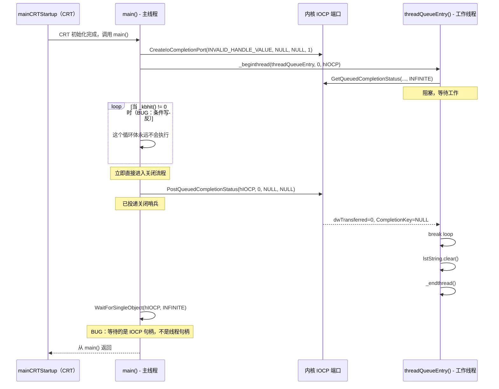

> **主题**：本文分析 `RemoteCtrl.cpp` 中第一次 IOCP 实验（提交 `7c646042`）。内容涵盖执行模型、仅 Push 的队列行为、`_endthread()` 的析构问题，以及调试过程中发现的内存生命周期风险。
> 相关笔记：[[7.5.1 基于完成端口的无锁队列]] · [[7.7 CEdoyunQueue 迁移、模板实例化与仅在运行期出现的 bug|7.7 CEdoyunQueue 迁移、模板实例化与仅在运行期出现的 bug]] · [[7.4 线程同步方式分析]]
> 范围：本文刻意不讨论 `x64` 与 `x86` 子系统问题，以及模板迁移主题（见 [[7.7 CEdoyunQueue 迁移、模板实例化与仅在运行期出现的 bug|7.7]]）。

---

## 1. 这次改了什么

提交 `7c646042` 在 `RemoteCtrl.cpp` 中加入了一个独立的 IOCP 实验。这**不是**远控服务器循环的一部分，而是一个将 IOCP 用作线程安全队列的概念验证。

| 变更 | 代码 | 实际含义 |
|--------|------|-------------|
| 新增 `IOCP_PARAM` 结构体 | `struct IocpParam { nOperator, strData, cbFunc }` | IOCP 队列的消息封套 |
| 工作线程函数 | `threadQueueEntry()` + `threadmain()` | 队列的消费端，处理 push/pop/clear |
| 仅 Push 的主循环 | `while (_kbhit() != 0)` + `PostQueuedCompletionStatus` | 演示 IOCP 投递，但循环条件**写反了** |
| 回调函数 | `func(void* arg)` | 预期的 Pop 处理器，但此版本实际上从未被调用 |
| 关闭哨兵 | `PostQueuedCompletionStatus(hIOCP, 0, NULL, NULL)` | 标准 IOCP 退出信号 |

---

## 2. 与前一版的关系

在这个提交之前，`RemoteCtrl.cpp` 里只有 `CServerSocket::Run` 服务器循环和自动调用对话框。这是代码库**第一次**在网络 I/O 之外试验 IOCP。

这个实验验证了 [[7.4 线程同步方式分析]] 中的概念，具体来说，就是 IOCP 是否能替代 mutex + condition variable 来做线程间通信。答案是可以，但最初实现里有几个 bug，它们在提交 `9cb60ac3` 中被修正了（见 [[7.7 CEdoyunQueue 迁移、模板实例化与仅在运行期出现的 bug|7.7]]）。

---

## 3. 执行模型

### 3.1 线程生命周期



### 3.2 关于执行模型的几个关键纠正

一个常见的混淆点是：

- `main()` 并不会“返回到主线程”——`main()` 本身就是主线程
- `main()` 返回到的是调用它的 CRT 入口例程 `mainCRTStartup`
- `threadQueueEntry()` 运行在 `_beginthread` 创建出的**独立线程**上
- `_endthread()` 只结束工作线程，不结束整个进程

---

## 4. 核心实现

### 4.1 IOCP_PARAM —— 消息封套

```cpp
typedef struct IocpParam
{
    // ===== 这个结构体携带一次队列操作所需的全部信息 =====
    int nOperator;              // 是哪种操作：IocpListPush、IocpListPop、IocpListEmpty
    std::string strData;        // 负载字符串
    _beginthread_proc_type cbFunc;  // Pop 操作使用的回调函数
                                    // 类型是 void(*)(void*)，与 _beginthread 签名匹配

    // ===== 带参构造函数 =====
    IocpParam(int op, const char* sData, _beginthread_proc_type cb = NULL)
    {
        nOperator = op;
        strData = sData;
        cbFunc = cb;            // ⚠ 如果为 NULL，Pop 时不会触发回调
    }

    IocpParam()
    {
        nOperator = -1;         // 非法操作符哨兵
    }
} IOCP_PARAM;
```

**与后续 `CEdoyunQueue::IocpParam` 的对比**：原版用 `cbFunc`（回调指针）来做 Pop 通知，后续版本则改用 `hEvent`（Win32 事件句柄）。回调方案是 fire-and-forget，事件方案则允许同步等待。

### 4.2 threadQueueEntry + threadmain —— 工作者一侧

在 `7c646042` 的初始版本里，代码采用了**双函数拆分**的结构：

```cpp
void threadmain(HANDLE hIOCP)
{
    // ===== 1. 本地容器活在这个函数自己的栈帧里 =====
    std::list<std::string> lstString;

    DWORD dwTransferred = 0;
    ULONG_PTR CompletionKey = 0;
    OVERLAPPED* pOverlapped = NULL;
    int count = 0, count0 = 0, total = 0;

    // ===== 2. 主循环：阻塞在 IOCP 上，并分发操作 =====
    while (GetQueuedCompletionStatus(hIOCP, &dwTransferred,
           &CompletionKey, &pOverlapped, INFINITE))
    {
        // ===== 3. 检查关闭哨兵 =====
        if (dwTransferred == 0 || (CompletionKey == NULL))
        {
            printf("thread is prepare to exit!\r\n");
            break;
        }

        IOCP_PARAM* pParam = (IOCP_PARAM*)CompletionKey;

        if (pParam->nOperator == IocpListPush)
        {
            // ===== Push 操作：追加到本地链表 =====
            lstString.push_back(pParam->strData);
            printf("push size %d %p\r\n", lstString.size(), pOverlapped);
            count0++;
        }
        else if (pParam->nOperator == IocpListPop)
        {
            // ===== Pop 操作：取出队头并调用回调 =====
            printf("%p size=%d \r\n", pParam->cbFunc, lstString.size());
            std::string str;
            if (lstString.size() > 0)
            {
                str = lstString.front();
                lstString.pop_front();
            }
            if (pParam->cbFunc)
            {
                pParam->cbFunc(&str);   // 把局部字符串的地址传给回调
                // ⚠ 风险：回调绝不能 delete 它——这是栈变量
            }
            count++;
        }
        else if (pParam->nOperator == IocpListEmpty)
        {
            lstString.clear();
        }

        // ===== 4. 每个 IOCP_PARAM 都是生产者在堆上分配的 =====
        delete pParam;
        printf("total %d\r\n", ++total);
    }

    lstString.clear();      // 退出前显式清理
    printf("thread exit count %d count0 %d \r\n", count, count0);
}

void threadQueueEntry(HANDLE hIOCP)
{
    // ===== 包装函数：先调用 threadmain，再结束线程 =====
    threadmain(hIOCP);
    _endthread();
    // 通过拆成两个函数，lstString（位于 threadmain 中）
    // 能在 _endthread() 被调用之前，先正常析构。
}
```

**为什么双函数拆分很重要**：在更早的一个未提交版本里，`_endthread()` 是在拥有 `lstString` 的**同一个函数内部**调用的。由于 `_endthread()` 会立即终止线程而不返回，这个函数里局部对象的 C++ 析构函数可能根本不会运行。拆分之后，`threadmain()` 可以正常返回（析构触发），然后 `threadQueueEntry()` 再调用 `_endthread()`。

### 4.3 main() —— 生产者一侧

```cpp
int main()
{
    if (!CEdoyunTool::Init()) return 1;

    // ===== 1. 创建 IOCP 队列 =====
    HANDLE hIOCP = CreateIoCompletionPort(INVALID_HANDLE_VALUE, NULL, NULL, 1);

    // ===== 2. 启动工作线程 =====
    HANDLE hThread = (HANDLE)_beginthread(
        (void(*)(void*))threadQueueEntry,   // 线程入口函数
        0,                                   // 默认栈大小
        hIOCP                                // 传入 IOCP 句柄
    );

    printf("press any key to exit...\r\n");

    ULONGLONG tick0 = GetTickCount64();

    // ===== 3. BUG：_kbhit() != 0 的意思是“已经有键被按下” =====
    // 正确意图应当是 _kbhit() == 0（“还没有按键”）
    // 用 != 0 会导致循环体在启动时永远不执行，因为一开始并没有按键
    while (_kbhit() != 0)
    {
        if (GetTickCount64() - tick0 > 1300)
        {
            // 由于条件写反，这个 Push 根本不会发生
            IOCP_PARAM* pParam = new IOCP_PARAM(IocpListPush, "hello", NULL);
            PostQueuedCompletionStatus(hIOCP, sizeof(IOCP_PARAM),
                (ULONG_PTR)pParam, NULL);
            tick0 = GetTickCount64();
        }
        Sleep(1);
    }

    // ===== 4. 投递关闭哨兵 =====
    PostQueuedCompletionStatus(hIOCP, 0, NULL, NULL);

    // ===== 5. BUG：等待的是 IOCP 句柄，不是线程句柄 =====
    WaitForSingleObject(hIOCP, INFINITE);
    // 应该是：WaitForSingleObject(hThread, INFINITE);
    // IOCP 句柄在“等待线程结束”这个意义上并不是可等待对象

    printf("exit done!\r\n");
}
```

**这一版里的 bug**：

| Bug | 行 | 正确修复 |
|-----|------|-------------|
| 循环条件写反 | `while (_kbhit() != 0)` | 应当写成 `_kbhit() == 0` |
| 等待目标错误 | `WaitForSingleObject(hIOCP, ...)` | 应等待 `hThread`，不是 `hIOCP` |
| 没有检查 IOCP 创建错误 | `CreateIoCompletionPort` 之后 | 应检查 `hIOCP != NULL` |

### 4.4 func() —— Pop 回调

```cpp
void func(void* arg)
{
    // ===== Pop 回调：接收一个字符串指针 =====
    std::string* pstr = (std::string*)arg;
    if (pstr != NULL)
    {
        printf("pop from list:%s \r\n", pstr->c_str());
        // ⚠ 不要 delete pstr —— 它是局部变量的地址
        //    位于 threadmain() 内部，不是堆分配
    }
    else
    {
        printf("list is empty,no data!\r\n");
    }
}
```

**所有权规则**：回调拿到的是 `&str`，其中 `str` 是 `threadmain()` 内部的局部 `std::string`。回调必须把它当成借用引用来使用——读取没问题，`delete` 会破坏栈。

---

## 5. 内存生命周期分析

这部分调试深挖已移至 [[Debug-025 IOCP实验内存生命周期与队列增长]]。

![[Debug-025 IOCP实验内存生命周期与队列增长#内存生命周期分析]]

---

## 6. Bug 总结

| Bug | 类别 | 根因 | 修复于 |
|-----|----------|-----------|----------|
| `_kbhit() != 0`（条件写反） | 逻辑错误 | 循环体根本不会执行——不会发生 Push | `9cb60ac3` |
| `WaitForSingleObject(hIOCP)` | 句柄错误 | 等待的是 IOCP 句柄，不是线程句柄 | `9cb60ac3` |
| `_endthread()` 与局部对象处于同一作用域 | 内存生命周期 | 有跳过局部 C++ 对象析构函数的风险 | 通过双函数拆分修复（在 `7c646042` 中已存在） |
| 没有检查 `PostQueuedCompletionStatus` 失败 | 失败路径泄漏 | 如果 Post 失败，`new IOCP_PARAM` 会泄漏 | `c6fa8056` |
| 仅 Push 行为 | 设计缺口 | 主循环里根本不会投递 Pop 操作 | `c6fa8056`（`CEdoyunQueue` 增加了 `PopFront`） |

---

## 7. 结论

1. **`mainCRTStartup` 才是真正的入口点**；`main()` 运行在主线程上，返回后会回到 `mainCRTStartup`，由 CRT 做清理。
2. **`_kbhit() != 0` 这个 bug** 会导致 Push 循环根本不执行；观察到的 `count0 = 0` 输出是由时机造成的（在 1300 ms 超时之前就按键了），不是系统不稳定。
3. **`_endthread()` 的析构问题** 确实存在，但已经通过双函数拆分规避了。经验就是：绝不要在拥有非平凡析构函数 C++ 局部对象的作用域里调用 `_endthread()`。
4. **`WaitForSingleObject(hIOCP)`** 是错误的——IOCP 句柄不是线程句柄。正确调用应当是 `WaitForSingleObject(hThread, INFINITE)`。
5. **当前实验只有 Push**——它展示了 IOCP 投递机制，但没有测试完整的 Push/Pop 周期。完整周期是在提交 `c6fa8056` 的 `CEdoyunQueue` 中才到位的（见 [[7.5.1 基于完成端口的无锁队列|7.5]]）。

这些 bug 都在下一个提交里被处理了：[[7.7 CEdoyunQueue 迁移、模板实例化与仅在运行期出现的 bug|7.7]]。

---

## 8. 代码索引

| 文件（在提交 `7c646042` 时） | 关键符号 |
|-----|-------------|
| `RemoteCtrl/RemoteCtrl/RemoteCtrl.cpp` | `IOCP_PARAM`, `IocpListPush`/`IocpListPop`/`IocpListEmpty`, `threadmain(HANDLE)`, `threadQueueEntry(HANDLE)`, `func(void*)`, `main()` |
