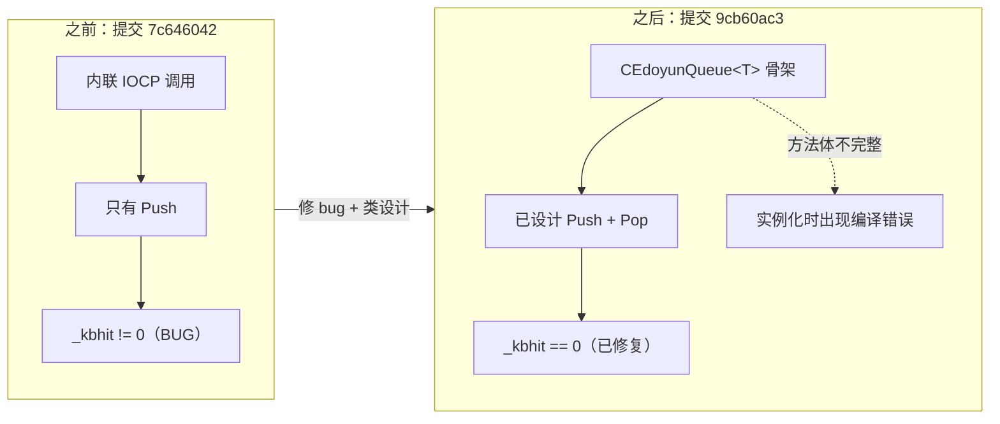
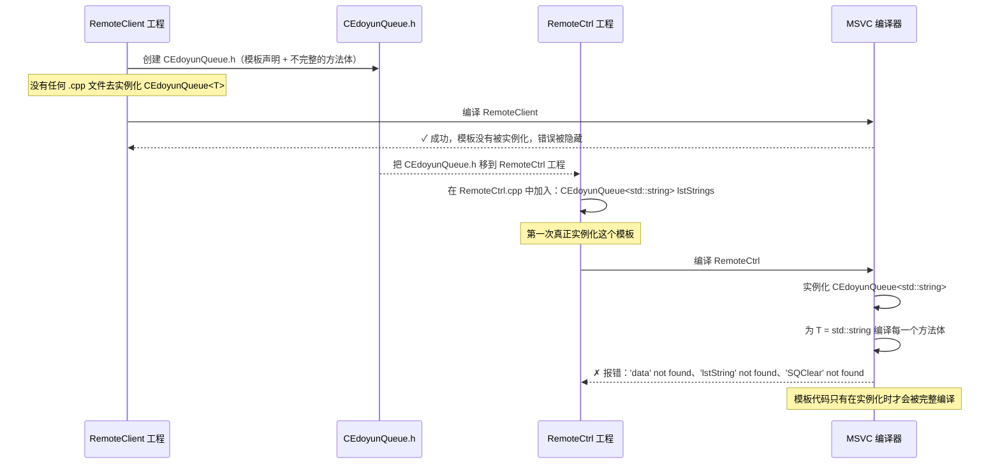
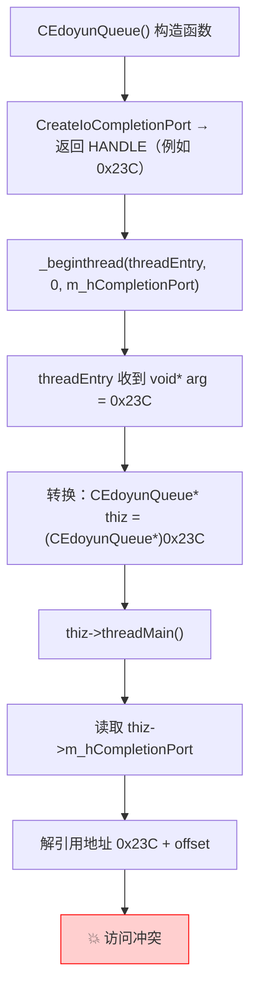

> **主题**：本文记录 `CEdoyunQueue.h` 从 `RemoteClient` 移到 `RemoteCtrl` 时发生的调试链，解释为什么标识符错误只会在实例化之后出现，以及为什么即使线程参数契约在语义上已经损坏，程序仍然可以编译成功。
> 相关笔记：[[7.5.1 基于完成端口的无锁队列]] · [[7.6 RemoteCtrl thread exit, queue growth, and memory lifetime|7.6 RemoteCtrl 线程退出、队列增长与内存生命周期]]
> 范围：本文不再重复 [[7.6 RemoteCtrl thread exit, queue growth, and memory lifetime|7.6]] 中已经讨论过的关闭哨兵、队列增长和内存生命周期分析。

---

## 1. 这次改了什么

提交 `9cb60ac3` 修复了原始实验（`7c646042`）中的 bug，并引入了 `CEdoyunQueue` 类的骨架：

| 变更 | 代码体现 | 实际含义 |
|--------|-------------------|--------------|
| 修复写反的循环条件 | `_kbhit() != 0` → `_kbhit() == 0` | Push 循环现在真的会执行 |
| 增加 IOCP 创建错误检查 | 在 `CreateIoCompletionPort` 之后加上 `if (hIOCP == INVALID_HANDLE_VALUE \|\| hIOCP == NULL)` | 防止使用无效句柄 |
| 拆分线程函数 | `7c646042` 中已经拆分过，但这次清理了 `threadmain` 内部实现 | 确保 `_endthread()` 不会跳过析构函数 |
| 创建 `CEdoyunQueue.h` | 含有 `PushBack`/`PopFront`/`Size`/`Clear` 声明的模板类 | 在这个提交里方法体**还不完整** |
| 重构 `IocpParam` | `strData` → `Data`，新增 `hEvent`，操作枚举改为 `EQPush`/`EQPop`/`EQSize`/`EQClear` | 为通过事件信号实现同步 pop 做准备 |
| 分离 push/pop 计时器 | `tick0` 负责 push（1300 ms），`tick` 负责 pop（2000 ms） | Push 和 Pop 现在按彼此独立的时间间隔运行 |

---

## 2. 与前一版的关系

| 维度              | 提交 `7c646042`（原始实验）                    | 提交 `9cb60ac3`（修 bug + 骨架）                         |     |
| --------------- | -------------------------------------- | ------------------------------------------------- | --- |
| 循环条件            | `_kbhit() != 0`，写反了，循环根本不跑             | `_kbhit() == 0`，正确                                |     |
| IOCP 错误检查       | 没有，直接盲用句柄                              | 检查 `INVALID_HANDLE_VALUE` 和 `NULL`                |     |
| 队列抽象            | `main()` 里直接写内联 IOCP 调用                | 声明了 `CEdoyunQueue<T>` 类（但方法体还没实现）                 |     |
| Pop 机制          | 基于回调（`cbFunc`）                         | 基于事件（`hEvent`），已经设计但还不能工作                         |     |
| 关闭时的等待          | `WaitForSingleObject(hIOCP, ...)`，句柄错了 | 这个提交里还没修（在 `c6fa8056` 中修复）                        |     |
| `IocpParam` 字段名 | `nOperator`、`strData`、`cbFunc`         | `nOperator`、`Data`、`hEvent`                       |     |
| 队列头文件的位置        | 还不存在独立文件                               | `RemoteClient/CEdoyunQueue.h`（之后又移到 `RemoteCtrl`） |     |



---

## 3. 迁移链

`CEdoyunQueue.h` 头文件最初创建于 `RemoteClient` 工程，之后被移动到 `RemoteCtrl`。下面这条链解释了为什么错误只会在移动之后出现：



**关键规则**：头文件中的模板定义**不会在抽象层面被完整编译**。编译器只会检查基础语法（括号是否匹配、关键字是否合法），它**不会**去解析依赖名，也不会在具体类型触发实例化之前检查成员访问。这就是为什么一个损坏的模板头文件可以在项目里安静地躺很多天都不报错，直到有人写出 `CEdoyunQueue<std::string>`。

---

## 4. 核心实现

### 4.1 不完整的 CEdoyunQueue.h（提交 `9cb60ac3` 时）

在这个提交里，类已经有了声明，但**方法体还不完整**：

```cpp
template<class T>
class CEdoyunQueue
{
    // ===== IOCP 队列的操作码 =====
    enum { EQNone, EQPush, EQPop, EQSize, EQClear };

    typedef struct IocpParam
    {
        size_t nOperator;       // 是哪种操作
        T Data;                 // 负载（由 strData 重命名而来）
        HANDLE hEvent;          // 同步操作使用的事件（这个版本新增）

        IocpParam(int op, const T& data, HANDLE hEve = NULL)
        {
            nOperator = op;
            Data = data;        // ⚠ 有些方法体里仍然在引用 "strData"
            hEvent = hEve;
        }
    } PPARAM;

public:
    bool PushBack(const T& data);       // 已声明，但方法体不完整
    bool PopFront(T& data);             // 已声明，但方法体不完整
    size_t Size();                      // 已声明，但方法体不完整
    bool Clear();                       // 已声明，但方法体不完整

private:
    static void threadEntry(void* arg); // 线程入口点
    void threadMain();                  // 工作循环
    void DealParam(PPARAM* pParam);     // 分发器，方法体仍使用旧名字

    std::list<T> m_lstData;             // 内部存储（由 lstString 重命名而来）
    HANDLE m_hCompletionPort;
    HANDLE m_hThread;
};
```

**问题**：类的设计已经采用了新名字（`Data`、`m_lstData`、`EQClear`），但方法体里仍然保留着原型代码中的旧名字。

### 4.2 修过的 RemoteCtrl.cpp（提交 `9cb60ac3` 时）

这次对原始实验做的主要修复如下：

```cpp
int main()
{
    if (!CEdoyunTool::Init()) return 1;

    // ===== 修复 1：创建 IOCP 后做错误检查 =====
    HANDLE hIOCP = CreateIoCompletionPort(INVALID_HANDLE_VALUE, NULL, NULL, 1);
    if (hIOCP == INVALID_HANDLE_VALUE || hIOCP == NULL)
    {
        printf("CreateIoCompletionPort failed!\r\n");
        return 1;       // 句柄无效时不要继续执行
    }

    HANDLE hThread = (HANDLE)_beginthread(
        (void(*)(void*))threadQueueEntry, 0, hIOCP);

    printf("press any key to exit...\r\n");
    ULONGLONG tick0 = GetTickCount64(), tick = GetTickCount64();

    // ===== 修复 2：改正循环条件 =====
    while (_kbhit() == 0)      // 原来是：_kbhit() != 0（写反了）
    {
        // ===== 使用独立计时器做 Push =====
        if (GetTickCount64() - tick0 > 1300)
        {
            IOCP_PARAM* pParam = new IOCP_PARAM(IocpListPush, "hello", NULL);
            PostQueuedCompletionStatus(hIOCP, sizeof(IOCP_PARAM),
                (ULONG_PTR)pParam, NULL);
            tick0 = GetTickCount64();
        }

        // ===== 使用独立计时器做 Pop（本提交新增） =====
        if (GetTickCount64() - tick > 2000)
        {
            IOCP_PARAM* pParam = new IOCP_PARAM(IocpListPop, "", func);
            PostQueuedCompletionStatus(hIOCP, sizeof(IOCP_PARAM),
                (ULONG_PTR)pParam, NULL);
            tick = GetTickCount64();
        }

        Sleep(1);
    }

    // 关闭哨兵
    PostQueuedCompletionStatus(hIOCP, 0, NULL, NULL);
    WaitForSingleObject(hIOCP, INFINITE);   // ⚠ 这里依然是错的，应该等 hThread
}
```

---

## 5. 编译期标识符错误

当 `CEdoyunQueue.h` 被移动到 `RemoteCtrl`，并且 `RemoteCtrl.cpp` 实例化了 `CEdoyunQueue<std::string>` 之后，编译器报出了若干个 `identifier not found` 错误。这些错误**不是随机的**，而是一份迁移一致性报告：

| 错误 | 旧名字（原型阶段） | 新名字（模板类阶段） | 根因 |
|-------|---------------------|--------------------------|------------|
| `'data' not found` | `data`（局部变量） | `Data`（`IocpParam` 成员） | 方法体引用了尚未完成的重构残留 |
| `'lstString' not found` | `lstString`（局部 `std::list<std::string>`） | `m_lstData`（类成员 `std::list<T>`） | 旧原型时期的词汇没有转换成基于成员的访问方式 |
| `'SQClear' not found` | `SQClear`（旧枚举名） | `EQClear`（新枚举名） | 只改了一半，`switch case` 没和枚举同步 |
| `'strData' not found` | `strData`（旧字段名） | `Data`（新字段名） | `IocpParam` 结构体名字改了，但方法体里的引用没更新 |

**关键洞见**：每一个错误都指向同一个根因，也就是这个头文件只是**部分完成了迁移**，从原型词汇迁到了模板类词汇，但那些不完整的方法体里仍然保留着旧名字。

---

## 6. 运行期桥接 bug：`void*` 线程参数

把所有编译错误修完之后，代码可以顺利构建了。但它**会在运行时崩溃**。

### 6.1 这个 bug

构造函数把错误的值传给了 `_beginthread`：

```cpp
// ===== 在构造函数里 =====
CEdoyunQueue()
{
    m_hCompletionPort = CreateIoCompletionPort(INVALID_HANDLE_VALUE, NULL, NULL, 1);
    m_hThread = (HANDLE)_beginthread(
        &CEdoyunQueue<T>::threadEntry,
        0,
        m_hCompletionPort       // ⚠ BUG：这里传的是 IOCP HANDLE 值
                                //   （例如 0x23C，一个很小的整数）
    );
}

// ===== 在线程入口里 =====
static void threadEntry(void* arg)
{
    CEdoyunQueue<T>* thiz = (CEdoyunQueue<T>*)arg;
    //                       ^^^^^^^^^^^^^^^^^^^^^^^^
    //  这个转换把 HANDLE 值（0x23C）解释成了一个对象指针
    //  这是一个假的 this 指针，它并不指向有效内存

    thiz->threadMain();
    //  这里会解引用这个假指针，去访问 m_hCompletionPort
    //  → 访问冲突
    _endthread();
}
```

**正确修复**（应当传 `this`，而不是 `m_hCompletionPort`）：
```cpp
m_hThread = (HANDLE)_beginthread(
    &CEdoyunQueue<T>::threadEntry,
    0,
    this        // 传入队列对象指针，这样 threadEntry 才能调用 threadMain()
);
```

### 6.2 为什么编译器抓不住它

编译器看到的是：
- `_beginthread(proc, stacksize, void* arg)`，它接受任何指针大小的值
- `threadEntry(void* arg)`，它也接收任何指针大小的值
- `(CEdoyunQueue<T>*)arg`，把 `void*` 转回对象指针在语法上永远合法

编译器**没有办法知道** `arg` 应当是对象指针，还是句柄值。这是生产者端（调用 `_beginthread`）和消费者端（`threadEntry` 方法体）之间的一个**语义契约**，而 `void*` 会抹掉全部类型信息。

### 6.3 崩溃路径



### 6.4 调试器中的症状

在 Visual Studio 调试器里，症状是：

```
this = 0x000000000000023C
```

这个值**小得离谱**，根本不可能是一个合法的堆对象地址。x64 Windows 上正常的堆地址通常长得像 `0x000001A234560000`。像 `0x23C` 这样的值看起来更像一个内核句柄，因为它**本来就是**。

崩溃表面上出现在 `threadMain()` 里的 `GetQueuedCompletionStatus(...)` 附近，但真正的根因更早，出在线程参数契约，也就是 `_beginthread` 和 `threadEntry` 之间的接口约定。

---

## 7. 模板实例化：为什么错误会一直藏到真正使用时

### 7.1 两阶段查找规则

C++ 模板使用两阶段名字查找：

| 阶段 | 发生时机 | 检查内容 |
|-------|------|----------------|
| **阶段 1**（定义时） | 编译器第一次看到模板定义时 | 语法、非依赖名（不依赖 `T` 的名字） |
| **阶段 2**（实例化时） | 使用具体类型时（例如 `CEdoyunQueue<std::string>`） | 依赖名（依赖 `T` 的名字）、完整语义检查 |

这就是为什么 `CEdoyunQueue.h` 可以待在 `RemoteClient` 工程里而不报错，因为**那个工程里没有任何 `.cpp` 文件真正实例化这个模板**。编译器只跑了阶段 1 检查，因此漏掉了那些损坏的标识符引用。

### 7.2 一个两层调试框架

当一个模板头文件被移动之后开始报错时，把问题拆成两层来看：

**第 1 层：编译期迁移错误**
- 方法体里是否还残留旧标识符？
- 枚举名和字段名在声明与使用之间是否一致？
- 成员容器（`m_lstData`）是否和旧的局部容器（`lstString`）混淆了？
- 这是不是这个头文件第一次从真实的 `.cpp` 文件里被实例化？

**第 2 层：运行期桥接错误**
- 究竟是什么值通过线程 API 的 `void*` 参数传过去了？
- 这个参数语义上应该是句柄、裸指针，还是 `this` 对象？
- 静态线程入口是否以与生产者端一致的方式重新解释了这个参数？
- 调试器里显示的 `this` 值是否看起来真实（落在堆地址区间，而不是一个很小的整数）？

**常见错误**：把所有第 1 层错误修完之后，就假定代码已经正确，尽管第 2 层（运行期桥接）在语义上仍然是坏的。当 `void*` 线程参数参与其中时，构建成功**并不能**证明语义正确。

---

## 8. 结论

1. **行尾规范化提示**（CRLF/LF 对话框）只是一个干扰项，不是根因。换行格式不会影响标识符名字。
2. **编译错误来自不完整的迁移**，旧原型名（`lstString`、`SQClear`、`strData`）在类重构为新名字（`m_lstData`、`EQClear`、`Data`）之后，仍然残留在方法体里。
3. **模板头文件会把错误藏到实例化时才暴露出来**。一个头文件可以在项目里待很多天，看起来“完全正常”，只有当具体类型（比如 `std::string`）触发了阶段 2 查找时，错误才会浮出水面。
4. 当 `void*` 线程参数参与其中时，**构建成功并不能证明代码正确**。编译器无法验证 `_beginthread` 和线程入口函数之间的语义契约。
5. **`GetQueuedCompletionStatus` 附近的访问冲突**，根因其实是一个假的 `this` 指针，也就是构造函数传了 `m_hCompletionPort`（像 `0x23C` 这样的句柄值），但调用点本来期待的是对象指针。
6. **调试器提示**：如果 `this` 的值只有几百这样的小整数（例如 `0x23C`），那它几乎肯定是一个句柄或者小整数，而不是合法的堆地址。这会立刻提示你去看参数传递 bug。
7. **这个提交里的类仍然只是骨架**，方法体还没有完全实现，所以 `main()` 依旧直接走原始 IOCP 路径。完整实现会在提交 `c6fa8056` 时到来（见 [[7.5.1 基于完成端口的无锁队列|7.5]]）。

---

## 9. 代码索引

| 文件（在提交 `9cb60ac3` 时） | 关键符号 |
|-----|-------------|
| `RemoteCtrl/RemoteClient/CEdoyunQueue.h` | `CEdoyunQueue<T>`（类骨架）、`IocpParam` / `PPARAM`、`EQPush`/`EQPop`/`EQSize`/`EQClear`、`threadEntry`、`threadMain`、`DealParam` |
| `RemoteCtrl/RemoteCtrl/RemoteCtrl.cpp` | `main()`（修复 `_kbhit`、增加错误检查）、`threadmain`、`threadQueueEntry`、`IOCP_PARAM` |
| 历史参考 | `RemoteCtrl/RemoteClient/CEdoyunQueue.h` → 之后在提交 `c6fa8056` 中移动到 `RemoteCtrl/RemoteCtrl/CEdoyunQueue.h` |
