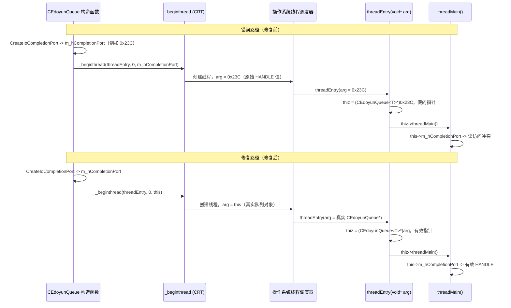

# 7.8 _beginthread 参数不匹配与假的 this 指针

> **摘要**：这篇笔记记录了 `CEdoyunQueue<T>` 里一个非常具体的运行时 bug。工作线程是用 `_beginthread` 启动的，但第三个参数传的是 `m_hCompletionPort`，而 `threadEntry(void* arg)` 却把同一个值当成 `CEdoyunQueue<T>*` 来解释。这个不匹配制造了一个假的 `this` 指针，并且在线程一尝试访问队列成员时就触发了读访问冲突。这个版本也覆盖了同一次提交里引入的析构函数双重关闭竞争修复，以及性能测试框架。
> 相关笔记：[[7.5.1 基于完成端口的无锁队列]] | [[7.6 RemoteCtrl 线程退出、队列增长与内存生命周期]] | [[7.7 CEdoyunQueue 迁移、模板实例化与仅在运行期出现的 bug]]
> 配套调试笔记：[[Debug-025 _beginthread argument mismatch creates a fake this pointer|Debug-025 _beginthread 参数不匹配会制造假的 this 指针]]

> [!info] 通过 GitHub API 的回退分析
> 本地 git 仓库在预期路径（`D:\c++\project\remote_ctl\...`）不可用。这次分析改为回退到 **GitHub MCP API**（通过 git credential-manager 完成认证），从 [hosendovebelva-boop/newremoteCtrl](https://github.com/hosendovebelva-boop/newremoteCtrl) 获取提交 `cb2e4cad` 及其父提交 `c6fa805`。文件内容是根据 API 返回的两个快照手动做 diff 得到的。

---

## 1. 这次提交改了什么

| #   | 文件                                   | 改动                                                   | 类别         |
| --- | ------------------------------------ | ---------------------------------------------------- | ---------- |
| 1   | `CEdoyunQueue.h` - 构造函数              | `_beginthread` 参数从 `m_hCompletionPort` 改为 `this`     | Bug 修复（核心） |
| 2   | `CEdoyunQueue.h` - 析构函数              | 在 `CloseHandle` 前增加 `NULL` 保护，防止双重关闭竞争               | 安全修复       |
| 3   | `CEdoyunQueue.h` - `threadMain()` 尾部 | 裸 `CloseHandle` 改为 swap-and-null 模式                  | 安全修复       |
| 4   | `CEdoyunQueue.h` - drain 循环          | 新增 `printf("%08X", pParam)`，用于诊断陈旧指针                 | 调试辅助       |
| 5   | `CEdoyunQueue.h` - 其他位置              | 在 `DealParam`、`PushBack`、`Clear` 中加入被注释掉的 `printf`   | 调试辅助       |
| 6   | `RemoteCtrl.cpp` - 新增 `test()`       | 性能基准：push 1 秒 -> size -> pop 1 秒 -> 与 `std::list` 对比 | 测试         |
| 7   | `RemoteCtrl.cpp` - `main()`          | 循环执行 `test()` 100 次做压力测试                             | 测试         |

---

## 2. 上下文

这个队列实现围绕以下几个部分构建：

- 一个 `CEdoyunQueue<T>` 对象
- 一个保存在 `m_hCompletionPort` 里的 IO 完成端口
- 一个由 `_beginthread` 创建的工作线程
- 一个后面会调用 `thiz->threadMain()` 的静态线程入口

这个设计只有在线程参数能够保留所属队列对象身份时才成立。

在这个 bug 里，这个约定被破坏了。

---

## 3. 错误的约定

旧的构造函数是这样启动线程的：

```cpp
// ===== BUG：传入的是 IOCP 句柄，而不是队列对象 =====
// _beginthread 的第三个参数是一个 void*，本来用于给新线程
// 携带上下文。这里它携带的是 m_hCompletionPort（一个 HANDLE），
// 但 threadEntry 期待的是一个 CEdoyunQueue<T>* 指针。
m_hThread = (HANDLE)_beginthread(
    &CEdoyunQueue<T>::threadEntry,
    0,
    m_hCompletionPort   // <-- 错误：这是 HANDLE，不是队列指针
);
```

但静态入口函数期待的却完全不是这个东西：

```cpp
static void threadEntry(void* arg)
{
    // ===== 把 arg 当成队列对象来解释 =====
    // 这个转换在语法上是合法的（void* -> 任意指针），
    // 但如果 arg 实际上装的是一个 HANDLE 值，那么语义上就是错的。
    CEdoyunQueue<T>* thiz = (CEdoyunQueue<T>*)arg;
    thiz->threadMain();   // 崩溃：thiz 指向的是无意义的东西
    _endthread();
}
```

所以生产者一侧和消费者一侧对 `arg` 的含义并不一致：

- 生产者一侧的含义："这是 IOCP 句柄"
- 消费者一侧的含义："这是队列对象"

这种不一致就是整个 bug。

---

## 4. 运行时失败链路：时序图

下面这个图追踪了参数是如何穿过线程创建边界的。先是**错误路径**（HANDLE 被误解释），然后是**修复路径**（`this` 被正确转发）。



---

## 5. 为什么局部变量看起来正常，但成员会崩

这一部分在调试时很容易看错。

当崩溃发生在 `threadMain()` 里时，调试器可能会显示：

- `dwTransferred` 看起来正常
- `CompletionKey` 看起来正常
- `pOverlapped` 看起来正常
- 但 `this` 看起来很可疑，有时会是像 `0x23C` 这样很小的值

这种现象是说得通的。

局部变量活在当前线程栈上，所以即使对象上下文是错的，它们仍然可以被创建出来。

成员变量不一样：

- `m_hCompletionPort` 不是被直接读取的
- 它是通过 `this->m_hCompletionPort` 读取的

所以如果 `this` 是假的，那么每一次成员访问都会变得不安全，即使周围的代码看起来完全正常。

这就是为什么崩溃看起来像是发生在 `GetQueuedCompletionStatus` 处，尽管更深层的问题并不是 API 调用本身。真正的问题是：用于取出该调用句柄参数的对象指针本身就是无效的。

---

## 6. 为什么编译器不会阻止它

这个 bug 能干净地通过编译，是因为 `_beginthread` 使用了一个 `void*` 桥接。

从编译器的视角看：

- `_beginthread` 接受一个指针大小的参数
- `threadEntry` 接受一个指针大小的参数
- 把 `void*` 转成 `CEdoyunQueue<T>*` 在语法上是合法的

编译器无法验证的是语义约定：

- `arg` 里装的是不是句柄
- `arg` 里装的是不是 `this`
- 双方对它的含义是否一致

所以这段代码在类型上足够兼容，可以通过编译；但在语义上又足够错误，因此会在运行时立刻崩溃。

---

## 7. 修复

本地修复把构造函数改成传 `this`，而不是 `m_hCompletionPort`：

```cpp
// ===== FIX：传队列对象，不传 IOCP 句柄 =====
// 现在 _beginthread 携带的是 threadEntry 所期待的 CEdoyunQueue<T>*。
// IOCP 句柄本来就已经保存在 m_hCompletionPort 里了，工作线程在拿到
// 有效的 this 指针之后，会通过 thiz->m_hCompletionPort 来访问它。
m_hThread = (HANDLE)_beginthread(
    &CEdoyunQueue<T>::threadEntry,
    0,
    this    // <-- 正确：队列对象本身
);
```

现在这个约定是一致的：

- `_beginthread` 传入队列对象
- `threadEntry` 接收队列对象
- `thiz->threadMain()` 运行在真实对象上
- 成员访问使用的是有效的 `this`

这并不能解决后续所有队列 bug，但它确实去掉了这个假的 `this` 崩溃。

---

## 8. 析构函数双重关闭竞争修复

`_beginthread` 参数修好以后，队列终于能活过启动阶段，这时第二个问题就暴露出来了：**析构函数和 `threadMain` 都在关闭 `m_hCompletionPort`**，从而形成双重关闭竞争。

### 8.1 旧的析构函数（c6fa805）

```cpp
~CEdoyunQueue()
{
    if (m_lock) return;
    m_lock = true;
    // ===== 旧模式：无条件关闭 =====
    // 先保存一份句柄副本，投递关闭哨兵，等待工作线程，
    // 然后关闭句柄。但 threadMain 在结尾也会调用
    // CloseHandle(m_hCompletionPort)。
    HANDLE hTemp = m_hCompletionPort;
    PostQueuedCompletionStatus(m_hCompletionPort, 0, NULL, NULL);
    WaitForSingleObject(m_hThread, INFINITE);
    m_hCompletionPort = NULL;
    CloseHandle(hTemp);   // <-- 如果 threadMain 已经关闭，这里可能双重关闭
}
```

旧的 `threadMain` 尾部是这样的：

```cpp
// ===== 旧的 threadMain 尾部：裸 CloseHandle =====
// 直接关闭完成端口。但析构函数在 WaitForSingleObject 返回后
// 也会关闭它，因此会发生双重关闭。
CloseHandle(m_hCompletionPort);
```

**问题**：`WaitForSingleObject` 返回后（也就是 `threadMain` 已经结束），析构函数会对一个已经被 `threadMain` 关闭过的句柄再次调用 `CloseHandle(hTemp)`。这是未定义行为，Windows 可能返回错误，更糟的是，这个句柄值可能已经被回收并重新指向另一个内核对象了。

### 8.2 新的析构函数（cb2e4cad）

```cpp
~CEdoyunQueue()
{
    if (m_lock) return;
    m_lock = true;
    // ===== 新模式：先投递哨兵，等待，然后按条件关闭 =====
    PostQueuedCompletionStatus(m_hCompletionPort, 0, NULL, NULL);
    WaitForSingleObject(m_hThread, INFINITE);
    // threadMain 已经对 m_hCompletionPort 做了 swap-and-null，
    // 所以这个检查可以防止双重关闭。
    if (m_hCompletionPort != NULL)
    {
        HANDLE hTemp = m_hCompletionPort;
        m_hCompletionPort = NULL;
        CloseHandle(hTemp);
    }
}
```

新的 `threadMain` 尾部是这样的：

```cpp
// ===== 新的 threadMain 尾部：swap-and-null 模式 =====
// 在关闭之前先把 m_hCompletionPort 置空，这样析构函数里的
// NULL 检查就能看到它，并跳过多余的 CloseHandle。
HANDLE hTemp = m_hCompletionPort;
m_hCompletionPort = NULL;      // 告诉析构函数："我已经关过了"
CloseHandle(hTemp);
```

### 8.3 为什么 swap-and-null 有效

时序由 `WaitForSingleObject` 保证：

1. `threadMain` 运行 drain 循环，然后执行 `m_hCompletionPort = NULL; CloseHandle(hTemp);`
2. 线程退出（在 `threadEntry` 里通过 `_endthread()`）
3. 析构函数里的 `WaitForSingleObject(m_hThread, INFINITE)` 返回
4. 析构函数检查 `m_hCompletionPort`，它已经是 `NULL` 了，因此会跳过 `CloseHandle`

这不是一个无锁竞争，`WaitForSingleObject` 充当了完整的内存屏障。到析构函数读取 `m_hCompletionPort` 的时候，工作线程的写入已经保证可见了。

---

## 9. 性能测试框架

构造函数改为传递 `this` 以后，队列终于能活过启动阶段，并运行得足够久，从而暴露出后续阶段的行为。同一个提交还把旧的交互式 `_kbhit()` 测试循环换成了结构化的性能基准测试。

### 9.1 旧的测试循环（c6fa805） 

```cpp
// ===== 旧版：交互式、无计时、靠人工观察 =====
// 每 1300ms push 一次，每 2000ms pop 一次，按键后退出。
// 无法测吞吐量，只能验证基本的 push/pop 能不能工作。
while (_kbhit() == 0)
{
    if (GetTickCount64() - tick0 > 1300)
    {
        lstStrings.PushBack("hello world");
        tick0 = GetTickCount64();
    }
    if (GetTickCount64() - tick > 2000)
    {
        std::string str;
        lstStrings.PopFront(str);
        tick = GetTickCount64();
    }
    Sleep(1);
}
```

### 9.2 新的 `test()` 函数（cb2e4cad）

```cpp
// ===== 新版：带基线对比的计时基准测试 =====
void test()
{
    CEdoyunQueue<std::string> lstStrings;
    ULONGLONG tick0 = GetTickCount64(), tick = GetTickCount64(), total = GetTickCount64();

    // 阶段 1：持续 push 1 秒
    while (GetTickCount64() - total <= 1000)
    {
        lstStrings.PushBack("hello world");
        tick0 = GetTickCount64();
    }
    size_t count = lstStrings.Size();
    printf("lstStrings done!size %d\r\n", count);

    // 阶段 2：持续 pop 1 秒
    total = GetTickCount64();
    while (GetTickCount64() - total <= 1000)
    {
        std::string str;
        lstStrings.PopFront(str);
        tick = GetTickCount64();
    }
    printf("lstStrings done!size=%d\r\n", count - lstStrings.Size());
    lstStrings.Clear();

    // 阶段 3：基线 - 原生 std::list push 1 秒
    std::list<std::string> lstData;
    total = GetTickCount64();
    while (GetTickCount64() - total <= 1000)
    {
        lstData.push_back("hello world!");
    }
    count = lstData.size();
    printf("lstData push done!size = =%d\r\n", lstData.size());

    // 阶段 4：基线 - 原生 std::list pop 250ms
    total = GetTickCount64();
    while (GetTickCount64() - total <= 250)
    {
        if (lstData.size() > 0)
            lstData.pop_front();
    }
    printf("exit pop done!size=%d\r\n", (count - lstStrings.Size()) * 4);
}
```

这个基准设计里的关键观察点：

- `CEdoyunQueue` 的 **push 吞吐** 要经过 `PostQueuedCompletionStatus`（每个元素一次内核切换），预期会比原生 `std::list::push_back` 慢
- **pop 吞吐** 更慢，因为每次 `PopFront` 都会创建事件、向 IOCP 投递、阻塞在 `WaitForSingleObject`，然后再读取结果，大约是 push 的 4 倍内核切换
- 原生 `std::list` 基线提供了一个没有额外开销的对照组，用来量化 IOCP 队列每次操作的成本
- `main()` 会运行 `test()` 100 次，用来压力测试句柄泄漏、内存增长，以及重复构造/析构周期下析构函数是否正确

### 9.3 测试方法

这次提交在 `main()` 上方有这样一段注释：

```cpp
/*
1. Bug 测试 / 功能测试              <- 它到底能不能工作？
2. 关键因素测试                      <- 内存泄漏、稳定性、条件情况
    （内存泄漏、运行稳定性、条件情况）
3. 压力测试（可靠性测试）            <- 100 次循环：重复使用还能活吗？
4. 性能测试                          <- 吞吐量与基线对比
*/
```

这套测试框架就是之前笔记里提到的那些“后续输出”（例如 `lstStrings done!size ...`）的来源。

---

## 10. 可复用的教训

只要一个静态线程入口后面要这样做：

```cpp
thiz->memberFunction();
```

传进线程的参数就必须表示所属对象。

如果这个参数装的反而是：

- 一个 `HANDLE`
- 一个类似整数的 token
- 某个无关但大小正好相同的负载

那么线程入口就可能静默制造出一个假的 `this` 指针，而崩溃会看起来像一次普通的成员访问失败。

对 C 风格线程 API，一定要同时核对这个约定的两边：

1. 传进线程的到底是什么值
2. 入口函数内部是怎么解释这个值的

另外，如果工作线程和析构函数都有可能关闭同一个句柄，就要使用 **swap-and-null 模式**（`hTemp = member; member = NULL; CloseHandle(hTemp)`），并且在另一边加上 `NULL` 保护，防止双重关闭。

---

## 11. 代码索引

- `RemoteCtrl/RemoteCtrl/CEdoyunQueue.h`
  - 构造函数 - `_beginthread` 参数修复（传 `this`，不传 `m_hCompletionPort`）
  - `~CEdoyunQueue()` - 带 `NULL` 保护的析构函数 `CloseHandle`
  - `threadEntry(void* arg)` - 静态入口，把 `arg` 转成 `CEdoyunQueue<T>*`
  - `threadMain()` - 工作循环 + drain 循环 + swap-and-null 句柄关闭
  - `DealParam()` - 操作分发（push/pop/size/clear）
- `RemoteCtrl/RemoteCtrl/RemoteCtrl.cpp`
  - `test()` - 性能基准测试（push 1 秒、pop 1 秒、`std::list` 基线）
  - `main()` - 调用 `test()` 的 100 次压力循环

---

## 12. 结论

这不是 IOCP bug，也不是 `GetQueuedCompletionStatus` bug。

这是一个线程参数约定 bug：

- `_beginthread` 传的是句柄
- `threadEntry` 期待的是对象指针
- 这个句柄被重新解释成了 `this`
- 工作线程随后通过这个假的对象去读成员，于是崩溃

同一次提交还修复了一个**析构函数双重关闭竞争**：`threadMain` 和 `~CEdoyunQueue` 都在关闭 `m_hCompletionPort`。`threadMain` 里的 swap-and-null 模式，加上析构函数里的 `NULL` 保护，一起消除了这个竞争。

最后，旧的交互式测试循环被替换成了**结构化的性能基准测试**，它既能把 IOCP 队列的吞吐量和原生 `std::list` 基线做对比，也能在 100 次迭代里对构造/析构做压力测试。
