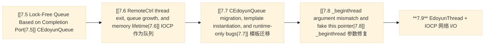

# 7.9 EdoyunThread 分发模型与 IOCP 网络编程启动骨架

> **总结**：提交 `23a26763` 引入了两个主要新增项。第一，`EdoyunThread`，这是一个围绕 `std::atomic<ThreadWorker>` 构建的通用线程包装器，它允许调用方在不重启线程的情况下，把任务替换进一个正在运行的线程中。第二，第一个真正的 IOCP 网络 I/O 骨架：一个绑定到完成端口的监听套接字、通过 `AcceptEx` 投递异步 accept 完成事件，以及一个 `CONTAINING_RECORD` 分发循环。这两部分都是有意搭建的脚手架，`DispatchWorker()` 还是空的，socket 处理分支也还是桩代码，但整体架构已经建立起来了。
> 相关笔记：[[7.5 Lock-Free Queue Based on Completion Port|7.5 基于完成端口的无锁队列]] · [[7.6 RemoteCtrl thread exit, queue growth, and memory lifetime|7.6 RemoteCtrl 线程退出、队列增长与内存生命周期]] · [[7.7 CEdoyunQueue migration, template instantiation, and runtime-only bugs|7.7 CEdoyunQueue 迁移、模板实例化与仅在运行期出现的 bug]] · [[7.8 _beginthread argument mismatch and fake this pointer|7.8 _beginthread 参数不匹配与伪 this 指针]]

---

## 1. 本次提交改了什么

| # | 文件 | 变更 | 类别 |
|---|------|------|------|
| 1 | `EdoyunThread.h`（新） | `ThreadFuncBase`、`ThreadWorker`、`EdoyunThread`、`EdoyunThreadPool` | 新特性 |
| 2 | `EdoyunThread.cpp`（新） | 桩文件，只包含 `#include "pch.h"` 和 `#include "EdoyunThread.h"` | 新文件 |
| 3 | `RemoteCtrl.cpp` | `iocp()`：重叠套接字 + `AcceptEx` + GQCS 分发循环 | 新特性 |
| 4 | `RemoteCtrl.cpp` | 移除旧的 `test()` / 压测循环；`main()` 现在调用 `iocp()` | 重构 |
| 5 | `ServerSocket.h` | `DealCommand()` 中接收大小的一个小类型修正 | 修复 |

---

## 2. 与前一版本的关系

7.5 到 7.8 这些提交构建并调试了 `CEdoyunQueue<T>`：把 IOCP 当作一个由内核管理的**应用层队列**来做 push/pop/size/clear，并没有真实的 socket。本次提交带来了两个彼此独立的变化：一个会替代临时 `_beginthread` 调用的**通用线程类**，以及**第一次真正的 IOCP 网络 I/O**，也就是把监听套接字关联到完成端口，并通过 `AcceptEx` 投递异步 accept。

<svg xmlns="http://www.w3.org/2000/svg" viewBox="0 0 960 640" width="960" height="640">
  <defs>
    <marker id="arr" viewBox="0 0 10 10" refX="8" refY="5" markerWidth="6" markerHeight="6" orient="auto-start-reverse">
      <path d="M2 1L8 5L2 9" fill="none" stroke="context-stroke" stroke-width="1.5" stroke-linecap="round" stroke-linejoin="round"/>
    </marker>
  </defs>
  <rect width="100%" height="100%" fill="#e7e1d5"/>
  <rect x="15" y="20" width="440" height="600" rx="12" fill="#FEF2F2" stroke="#E74C3C" stroke-width="2"/>
  <text x="235" y="43" text-anchor="middle" dominant-baseline="central" font-family="system-ui,sans-serif" font-size="13" font-weight="700" fill="#E74C3C">旧：把 IOCP 当作队列（CEdoyunQueue）</text>
  <g><rect x="155" y="60" width="160" height="44" rx="8" fill="#E6F1FB" stroke="#185FA5" stroke-width="0.5"/><text x="235" y="82" text-anchor="middle" dominant-baseline="central" font-family="system-ui,sans-serif" font-size="14" font-weight="500" fill="#0C447C">调用线程</text></g>
  <path d="M235,104 L235,173" stroke="#185FA5" stroke-width="1.5" fill="none" marker-end="url(#arr)"/>
  <text x="248" y="139" text-anchor="start" dominant-baseline="central" font-family="system-ui,sans-serif" font-size="10" fill="#185FA5">PostQueuedCompletionStatus()</text>
  <g><rect x="125" y="175" width="220" height="44" rx="8" fill="#E6F1FB" stroke="#185FA5" stroke-width="0.5"/><text x="235" y="197" text-anchor="middle" dominant-baseline="central" font-family="system-ui,sans-serif" font-size="14" font-weight="500" fill="#0C447C">内核 IOCP 队列</text></g>
  <path d="M235,219 L235,288" stroke="#534AB7" stroke-width="1.5" fill="none" marker-end="url(#arr)"/>
  <g><rect x="100" y="290" width="270" height="56" rx="8" fill="#EEEDFE" stroke="#534AB7" stroke-width="0.5"/><text x="235" y="312" text-anchor="middle" dominant-baseline="central" font-family="system-ui,sans-serif" font-size="14" font-weight="500" fill="#3C3489">工作线程</text><text x="235" y="330" text-anchor="middle" dominant-baseline="central" font-family="system-ui,sans-serif" font-size="11" font-weight="400" fill="#534AB7">GetQueuedCompletionStatus</text></g>
  <path d="M235,346 L235,413" stroke="#534AB7" stroke-width="1.5" fill="none" marker-end="url(#arr)"/>
  <g><rect x="127" y="415" width="216" height="44" rx="8" fill="#E1F5EE" stroke="#0F6E56" stroke-width="0.5"/><text x="235" y="437" text-anchor="middle" dominant-baseline="central" font-family="system-ui,sans-serif" font-size="14" font-weight="500" fill="#085041">DealParam() 分发</text></g>
  <g><rect x="35" y="525" width="390" height="60" rx="8" fill="#F1EFE8" stroke="#5F5E5A" stroke-width="0.5"/><text x="235" y="547" text-anchor="middle" dominant-baseline="central" font-family="system-ui,sans-serif" font-size="12" font-weight="500" fill="#444441">IOCP = 应用层队列</text><text x="235" y="565" text-anchor="middle" dominant-baseline="central" font-family="system-ui,sans-serif" font-size="11" font-weight="400" fill="#5F5E5A">没有真实的 socket I/O</text></g>
  <rect x="505" y="20" width="440" height="600" rx="12" fill="#F0FDF4" stroke="#27AE60" stroke-width="2"/>
  <text x="725" y="43" text-anchor="middle" dominant-baseline="central" font-family="system-ui,sans-serif" font-size="13" font-weight="700" fill="#27AE60">新：把 IOCP 用于网络 I/O</text>
  <g><rect x="665" y="60" width="120" height="44" rx="8" fill="#E6F1FB" stroke="#185FA5" stroke-width="0.5"/><text x="725" y="82" text-anchor="middle" dominant-baseline="central" font-family="system-ui,sans-serif" font-size="14" font-weight="500" fill="#0C447C">客户端</text></g>
  <path d="M725,104 L725,173" stroke="#E67E22" stroke-width="1.5" stroke-dasharray="6,4" fill="none" marker-end="url(#arr)"/>
  <text x="737" y="139" text-anchor="start" dominant-baseline="central" font-family="system-ui,sans-serif" font-size="10" fill="#E67E22">TCP 连接</text>
  <g><rect x="605" y="175" width="240" height="56" rx="8" fill="#EEEDFE" stroke="#534AB7" stroke-width="0.5"/><text x="725" y="197" text-anchor="middle" dominant-baseline="central" font-family="system-ui,sans-serif" font-size="14" font-weight="500" fill="#3C3489">WSASocket + AcceptEx</text><text x="725" y="215" text-anchor="middle" dominant-baseline="central" font-family="system-ui,sans-serif" font-size="11" font-weight="400" fill="#534AB7">重叠套接字</text></g>
  <path d="M725,231 L725,298" stroke="#E67E22" stroke-width="1.5" stroke-dasharray="6,4" fill="none" marker-end="url(#arr)"/>
  <text x="737" y="265" text-anchor="start" dominant-baseline="central" font-family="system-ui,sans-serif" font-size="10" fill="#E67E22">I/O 完成事件</text>
  <g><rect x="618" y="300" width="214" height="44" rx="8" fill="#E6F1FB" stroke="#185FA5" stroke-width="0.5"/><text x="725" y="322" text-anchor="middle" dominant-baseline="central" font-family="system-ui,sans-serif" font-size="14" font-weight="500" fill="#0C447C">内核 IOCP 端口</text></g>
  <path d="M725,344 L725,403" stroke="#534AB7" stroke-width="1.5" fill="none" marker-end="url(#arr)"/>
  <g><rect x="575" y="405" width="300" height="56" rx="8" fill="#EEEDFE" stroke="#534AB7" stroke-width="0.5"/><text x="725" y="427" text-anchor="middle" dominant-baseline="central" font-family="system-ui,sans-serif" font-size="14" font-weight="500" fill="#3C3489">工作线程（GQCS）</text><text x="725" y="445" text-anchor="middle" dominant-baseline="central" font-family="system-ui,sans-serif" font-size="11" font-weight="400" fill="#534AB7">CONTAINING_RECORD → COverlapped</text></g>
  <g><rect x="525" y="525" width="390" height="60" rx="8" fill="#F1EFE8" stroke="#5F5E5A" stroke-width="0.5"/><text x="725" y="547" text-anchor="middle" dominant-baseline="central" font-family="system-ui,sans-serif" font-size="12" font-weight="500" fill="#444441">IOCP = 异步网络 I/O 完成</text><text x="725" y="565" text-anchor="middle" dominant-baseline="central" font-family="system-ui,sans-serif" font-size="11" font-weight="400" fill="#5F5E5A">绑定 socket；真实 TCP 流量</text></g>
</svg>



---
## 3. EdoyunThread 类结构

<svg xmlns="http://www.w3.org/2000/svg" viewBox="0 0 880 480" width="880" height="480">
  <defs>
    <marker id="arr2" viewBox="0 0 10 10" refX="8" refY="5" markerWidth="6" markerHeight="6" orient="auto-start-reverse">
      <path d="M2 1L8 5L2 9" fill="none" stroke="context-stroke" stroke-width="1.5" stroke-linecap="round" stroke-linejoin="round"/>
    </marker>
  </defs>
  <rect width="100%" height="100%" fill="#e7e1d5"/>
  <text x="440" y="22" text-anchor="middle" dominant-baseline="central" font-family="system-ui,sans-serif" font-size="15" font-weight="600" fill="#444441">EdoyunThread 类结构</text>
  <g><rect x="40" y="50" width="280" height="60" rx="8" fill="#E6F1FB" stroke="#185FA5" stroke-width="0.5"/><text x="180" y="72" text-anchor="middle" dominant-baseline="central" font-family="system-ui,sans-serif" font-size="14" font-weight="500" fill="#0C447C">ThreadFuncBase</text><text x="180" y="91" text-anchor="middle" dominant-baseline="central" font-family="system-ui,sans-serif" font-size="11" font-weight="400" fill="#185FA5">（类型擦除基类）</text></g>
  <g><rect x="490" y="50" width="350" height="80" rx="8" fill="#EEEDFE" stroke="#534AB7" stroke-width="0.5"/><text x="665" y="78" text-anchor="middle" dominant-baseline="central" font-family="system-ui,sans-serif" font-size="14" font-weight="500" fill="#3C3489">ThreadWorker</text><text x="665" y="98" text-anchor="middle" dominant-baseline="central" font-family="system-ui,sans-serif" font-size="11" font-weight="400" fill="#534AB7">thiz: ThreadFuncBase* &#xB7; func: FUNCTYPE</text></g>
  <path d="M490,80 L322,80" stroke="#185FA5" stroke-width="1.5" fill="none" marker-end="url(#arr2)"/>
  <text x="406" y="67" text-anchor="middle" dominant-baseline="central" font-family="system-ui,sans-serif" font-size="10" fill="#185FA5">持有 ThreadFuncBase*</text>
  <g><rect x="490" y="210" width="350" height="80" rx="8" fill="#E1F5EE" stroke="#0F6E56" stroke-width="0.5"/><text x="665" y="238" text-anchor="middle" dominant-baseline="central" font-family="system-ui,sans-serif" font-size="14" font-weight="500" fill="#085041">EdoyunThread</text><text x="665" y="258" text-anchor="middle" dominant-baseline="central" font-family="system-ui,sans-serif" font-size="11" font-weight="400" fill="#0F6E56">m_worker: atomic&lt;ThreadWorker&gt;</text></g>
  <path d="M665,210 L665,130" stroke="#534AB7" stroke-width="1.5" fill="none" marker-end="url(#arr2)"/>
  <text x="677" y="170" text-anchor="start" dominant-baseline="central" font-family="system-ui,sans-serif" font-size="10" fill="#534AB7">包含 atomic&lt;ThreadWorker&gt;</text>
  <g><rect x="490" y="375" width="350" height="60" rx="8" fill="#FAEEDA" stroke="#854F0B" stroke-width="0.5"/><text x="665" y="397" text-anchor="middle" dominant-baseline="central" font-family="system-ui,sans-serif" font-size="14" font-weight="500" fill="#633806">EdoyunThreadPool</text><text x="665" y="416" text-anchor="middle" dominant-baseline="central" font-family="system-ui,sans-serif" font-size="11" font-weight="400" fill="#854F0B">vector&lt;EdoyunThread&gt;</text></g>
  <path d="M665,375 L665,290" stroke="#0F6E56" stroke-width="1.5" fill="none" marker-end="url(#arr2)"/>
  <text x="677" y="333" text-anchor="start" dominant-baseline="central" font-family="system-ui,sans-serif" font-size="10" fill="#0F6E56">包含 N 个 EdoyunThread</text>
</svg>

### ThreadFuncBase —— 类型擦除根

```cpp
class ThreadFuncBase {};
typedef int (ThreadFuncBase::* FUNCTYPE)();
```

`FUNCTYPE` 是 `ThreadFuncBase` 的成员函数指针类型。因为它定义在这个特定的基类上，**任何继承自 `ThreadFuncBase` 的类**，它的方法都可以被转换成 `FUNCTYPE`。这个基类本身是空的，它唯一的作用就是提供一个统一的类型锚点，这样来自不同派生类的方法指针，无论具体调用方类型是什么，都可以统一存成同一种 `FUNCTYPE`。

### ThreadWorker —— 可调用包装器

```cpp
class ThreadWorker
{
public:
    ThreadWorker() :thiz(NULL), func(NULL) {}
    ThreadWorker(ThreadFuncBase* obj, FUNCTYPE f) :thiz(obj), func(f) {}

    int operator()()
    {
        // ===== 通过基类指针调用已经保存的成员函数 =====
        // 'if (this)' 是一种 C 风格防御式判断。合法的 C++ 对象不会有
        // 空 this 指针，但这里它和 IsValid() 的契约是配套的。
        if (this)
            return (thiz->*func)();   // 分发：在 thiz 上调用 func
        return -1;
    }

    bool IsValid()
    {
        // 对象指针和函数指针都必须非空
        return (thiz != NULL) && (func != NULL);
    }
private:
    ThreadFuncBase* thiz;   // 持有对象，类型被擦除成基类
    FUNCTYPE func;          // 成员函数指针，以基类 PMF 形式表达
};
```

**整体职责**：`ThreadWorker` 是一个自包含的任务单元，它把一个对象和它的某个成员函数打包成了一个可复制的值，这个值可以被存进 `std::atomic<T>`，并通过 `operator()()` 被分发执行。

**为什么使用成员函数指针设计而不是 `std::function`**：`std::function` 和 lambda 不是平凡可复制类型，这会违反 `std::atomic<T>` 对 TriviallyCopyable 的要求（见第 6 节）。通过 `ThreadFuncBase*` 擦除具体类型，再存一个统一的 `FUNCTYPE` 指针，这一对成员就变成了两个裸指针。这种方式开销很小，同时允许进行原子存储。

---

## 4. EdoyunThread 生命周期

### Start / Stop / IsValid

```cpp
bool Start()
{
    // ===== 在线程启动之前先设置运行标志 =====
    // 工作循环会检查 m_bStatus。先把它设好，可以保证循环
    // 不会在还没真正进入之前就直接退出。
    m_bStatus = true;

    // ===== 启动线程 —— 传入的是 'this'，不是句柄 =====
    // 从 [[7.8 _beginthread argument mismatch and fake this pointer|7.8]] 得到的教训：
    // _beginthread 的第三个参数必须是拥有该线程的对象。
    m_hThread = (HANDLE)_beginthread(&EdoyunThread::ThreadEntry, 0, this);

    // ===== 校验 —— 但这里 IsValid() 的逻辑是反的（见易错点 §1） =====
    // 对一个刚启动且仍在运行的线程来说，WaitForSingleObject(timeout=0)
    // 会返回 WAIT_TIMEOUT，所以 IsValid() 会返回 false，接着 m_bStatus
    // 会被错误清掉，导致线程在第一次循环检查时就退出。
    if (!IsValid())
    {
        m_bStatus = false;
    }
    return m_bStatus;
}

bool IsValid()
{
    if (m_hThread == NULL || m_hThread == INVALID_HANDLE_VALUE)
        return false;
    // ⚠ Bug：WAIT_OBJECT_0 表示线程已经结束，不是正在运行。
    // 正确逻辑：return WaitForSingleObject(m_hThread, 0) != WAIT_OBJECT_0;
    return WaitForSingleObject(m_hThread, 0) == WAIT_OBJECT_0;
}

bool Stop()
{
    if (m_bStatus == false)
        return true;
    m_bStatus = false;                         // 通知循环退出
    WaitForSingleObject(m_hThread, INFINITE);  // 阻塞等待线程结束
    // ⚠ Bug：这里缺少返回值，bool Stop() 直接从末尾落空返回。
}
```

### 工作循环 —— 原子分发核心

```cpp
private:
    virtual void ThreadWorker()
    {
        // ===== 主分发循环 —— 在线程整个生命周期内持续运行 =====
        while (m_bStatus)
        {
            // ===== 1. 原子读取当前任务 =====
            // m_worker 随时可能被其他线程通过 UpdateWorker() 修改。
            // std::atomic::load() 提供顺序一致性的保证。
            ::ThreadWorker worker = m_worker.load();

            if (m_worker.load().IsValid())
            {
                int ret = worker();   // 调用任务函数

                if (ret != 0)
                {
                    CString str;
                    str.Format(_T("thread found warning code %d\r\n"), ret);
                    OutputDebugString(str);
                }
                if (ret < 0)
                {
                    // ===== 返回负值 = 任务要求把自己移除 =====
                    // 存回一个默认的（无效的）ThreadWorker，把槽位清空。
                    m_worker.store(::ThreadWorker());
                }
            }
            else
            {
                // ===== 当前没有任务：主动让出 CPU，避免 100% 空转 =====
                Sleep(1);
            }
        }
    }

    static void ThreadEntry(void* arg)
    {
        // ===== 从 _beginthread 过渡到虚函数循环的静态桥接函数 =====
        // arg = 'this'，在 Start() 中传得是正确的，不再是 7.8 里的 bug。
        EdoyunThread* thiz = (EdoyunThread*)arg;
        if (thiz)
            thiz->ThreadWorker();
        _endthread();   // 循环返回后，线程干净退出
    }
```

**关键设计**：`m_worker` 是 `std::atomic<::ThreadWorker>`。调用方可以从任意线程调用 `UpdateWorker()`；循环则在每一轮都调用 `m_worker.load()`。这里不需要互斥锁，原子变量本身就提供了跨线程可见性保证。空闲时，线程每轮睡眠 1 ms，而不是持续空转。

### 时序图

```mermaid
%%{init: {'theme':'base','themeVariables': {'background': '#e7e1d5'}}}%%
sequenceDiagram
    participant Caller as 调用线程
    participant ET as EdoyunThread
    participant OS as 操作系统线程
    participant Loop as ThreadWorker 循环

    Caller->>ET: Start()
    ET->>ET: m_bStatus = true
    ET->>OS: _beginthread(ThreadEntry, 0, this)
    OS->>Loop: ThreadEntry(arg=this) → ThreadWorker()
    Note over Loop: while(m_bStatus): load() → Sleep(1) [尚无任务]

    Caller->>ET: UpdateWorker(worker)
    ET->>Loop: m_worker.store(worker) [atomic]
    Note over Loop: load() → IsValid() → worker() → ret 检查

    Caller->>ET: Stop()
    ET->>Loop: m_bStatus = false
    ET->>OS: WaitForSingleObject(m_hThread, INFINITE)
    Note over Loop: 循环条件失败 → ThreadWorker() 返回
    OS->>OS: _endthread()
    OS-->>ET: WaitForSingleObject 返回
```

### EdoyunThreadPool —— 线程池包装层

```cpp
bool Invoke()
{
    bool ret = true;
    for (size_t i = 0; i < m_threads.size(); i++)
    {
        if (m_threads[i].Start() == false)
        {
            ret = false;
            break;   // 第一个失败点：不再继续启动更多线程
        }
    }
    // ===== 全成全败式回滚 =====
    // 只要有任何线程启动失败，就把之前成功启动的都停掉。
    // 避免出现“线程池只启动了一半”却悄悄丢任务的情况。
    if (ret == false)
    {
        for (size_t i = 0; i < m_threads.size(); i++)
            m_threads[i].Stop();
        return ret;
    }
    // ⚠ Bug：成功路径上缺少 return true。
}

int DispatchWorker(const ThreadWorker& worker)
{
    // ⚠ 尚未实现 —— 函数体是空的。
    // 预期行为：找到一个空闲的 EdoyunThread，并对它调用 UpdateWorker()。
}
```

`Invoke()` 里的全成全败回滚，和 [[2.2 Network Programming Architecture Design|2.2]] 中 `CHelper` RAII 守卫的防御式模式是一样的。如果资源获取只成功了一部分，那么在返回错误之前，要先把已经成功的部分完整撤销。

---
## 5. IOCP 网络 I/O 链路

`iocp()` 函数取代了旧的 `CEdoyunQueue` 测试框架。这是项目里第一次把 IOCP 接到一个真实的 TCP socket 上，而不是仅仅把它当成纯应用层队列来用。

```mermaid
%%{init: {'theme':'base','themeVariables': {'background': '#e7e1d5'}}}%%
sequenceDiagram
    participant Main as main()
    participant IO as iocp()
    participant WS as Winsock / OS
    participant K as 内核 IOCP 端口
    participant Loop as GQCS 循环

    Main->>IO: iocp()
    IO->>WS: WSASocket(WSA_FLAG_OVERLAPPED) → sock
    IO->>K: CreateIoCompletionPort(INVALID_HANDLE_VALUE, NULL, sock, 4) → hIOCP
    IO->>WS: WSASocket(WSA_FLAG_OVERLAPPED) → client [为 AcceptEx 预先创建]
    IO->>K: CreateIoCompletionPort((HANDLE)sock, hIOCP, 0, 0) [关联 sock]
    IO->>WS: bind + listen 到 :9527
    IO->>WS: AcceptEx(sock, client, buf, ..., &overlapped.m_overlapped)
    Note over WS: 异步：立即返回；客户端连接时投递完成事件
    WS-->>K: I/O 完成事件 (m_operator = 1, Accept)

    loop GQCS 分发
        Loop->>K: GetQueuedCompletionStatus(hIOCP, ..., &pOverlapped, INFINITE)
        K-->>Loop: pOverlapped → CONTAINING_RECORD → COverlapped*
        Loop->>Loop: switch(pO->m_operator) case 1 → Accept 处理分支（桩代码）
    end
```

### COverlapped —— 分发封套

```cpp
class COverlapped
{
public:
    OVERLAPPED m_overlapped;   // ← 必须位于一个已知偏移处（最好就是第一个成员）
                               //   这样 CONTAINING_RECORD 的指针运算才是有效的
    DWORD m_operator;          // 1 = Accept  2 = Send  3 = Recv
    char m_buffer[4096];       // 此次 I/O 操作使用的数据缓冲区

    COverlapped()
    {
        m_operator = 0;
        memset(&m_overlapped, 0, sizeof(m_overlapped));   // 清零 OVERLAPPED 字段
        memset(m_buffer, 0, sizeof(m_buffer));
    }
};
```

当操作系统发出一个 I/O 完成事件时，它返回的是一个 `LPOVERLAPPED`。`CONTAINING_RECORD(ptr, COverlapped, m_overlapped)` 本质上执行的是 `(COverlapped*)((char*)ptr - offsetof(COverlapped, m_overlapped))`，也就是通过嵌入成员反推出父结构体，从而访问 `m_operator` 和 `m_buffer`。

### iocp() —— 完整初始化与事件循环

```cpp
void iocp()
{
    // ===== 1. 创建重叠套接字 =====
    // 普通的 socket() 不能配合 AcceptEx 或任何重叠 I/O 使用。
    // 想让套接字支持异步操作，必须带上 WSA_FLAG_OVERLAPPED。
    SOCKET sock = WSASocket(AF_INET, SOCK_STREAM, 0, NULL, 0, WSA_FLAG_OVERLAPPED);
    if (sock == INVALID_SOCKET) { CEdoyunTool::ShowError(); return; }

    // ===== 2. 创建 IOCP 端口（第一次调用：只创建，不关联设备） =====
    // 第一个参数用 INVALID_HANDLE_VALUE = “创建一个新端口，先不要关联设备”。
    // 并发提示值 = 4：最多允许 4 个线程同时从队列里取完成事件。
    HANDLE hIOCP = CreateIoCompletionPort(INVALID_HANDLE_VALUE, NULL, sock, 4);

    // ===== 3. 预先创建 AcceptEx 需要的 accept socket =====
    // 和 accept() 不同，AcceptEx 不会帮你创建客户端 socket。
    // 调用方必须提前建好，再把它传进去。
    SOCKET client = WSASocket(AF_INET, SOCK_STREAM, 0, NULL, 0, WSA_FLAG_OVERLAPPED);

    // ===== 4. 把监听 socket 关联到 IOCP（第二次调用：做关联） =====
    // 还是同一个 API，只是第一个参数不同。一旦关联成功，后续在 'sock' 上的
    // 每一次异步操作（AcceptEx、WSASend、WSARecv），它的完成通知都会投递到 hIOCP。
    CreateIoCompletionPort((HANDLE)sock, hIOCP, 0, 0);

    // ===== 5. bind 和 listen =====
    sockaddr_in addr;
    addr.sin_family = PF_INET;
    addr.sin_addr.s_addr = inet_addr("0.0.0.0");
    addr.sin_port = htons(9527);
    bind(sock, (sockaddr*)&addr, sizeof(addr));
    listen(sock, 5);

    // ===== 6. 投递异步 accept =====
    COverlapped overlapped;
    overlapped.m_operator = 1;   // 标记：这次完成事件 = Accept

    // ⚠ Bug：这里的 memset 虽然只写 sizeof(OVERLAPPED) 字节，
    // 但起始地址是整个 COverlapped 结构体的开头，而不是嵌入的 OVERLAPPED 成员。
    // 这会把上面刚设好的 m_operator 也悄悄清零回 0。
    // 正确写法：memset(&overlapped.m_overlapped, 0, sizeof(OVERLAPPED))
    // 而且构造函数里本来就已经清零过了，这一行本身也属于重复操作。
    memset(&overlapped, 0, sizeof(OVERLAPPED));

    DWORD received = 0;
    // AcceptEx：异步 accept。立即返回 FALSE 是正常的（WSA_IO_PENDING）。
    // 客户端真正连上来时，完成事件会被投递到 hIOCP。
    // 这里请求 0 字节数据，只接收连接，不顺手接第一段业务数据。
    if (AcceptEx(sock, client, overlapped.m_buffer, 0,
                 sizeof(sockaddr_in) + 16, sizeof(sockaddr_in) + 16,
                 &received, &overlapped.m_overlapped) == FALSE)
    {
        CEdoyunTool::ShowError();
    }

    // ===== 未来 Send / Recv 的占位桩代码 =====
    overlapped.m_operator = 2;
    WSASend();   // ⚠ 缺少所有必需参数 —— 这里只是结构占位
    overlapped.m_operator = 3;
    WSARecv();   // ⚠ 缺少所有必需参数 —— 这里只是结构占位

    // ===== 7. GQCS 分发循环 =====
    while (true)
    {
        LPOVERLAPPED pOverlapped = NULL;
        DWORD transferred = 0;
        DWORD key = 0;

        // 一直阻塞，直到任何一个关联到 hIOCP 的 socket 上出现 I/O 完成。
        if (GetQueuedCompletionStatus(hIOCP, &transferred, &key,
                                      &pOverlapped, INFINITE))
        {
            // ===== 通过嵌入的 OVERLAPPED 反推出父 COverlapped =====
            // 指针运算本质上是：(COverlapped*)((char*)pOverlapped
            //                     - offsetof(COverlapped, m_overlapped))
            COverlapped* pO = CONTAINING_RECORD(pOverlapped, COverlapped, m_overlapped);

            switch (pO->m_operator)
            {
            case 1:   // Accept 完成 —— 目前还是桩代码，尚未实现
                break;
            default:
                break;
            }
        }
    }
}
```

**为什么 `CreateIoCompletionPort` 要调用两次**：这个 Win32 API 用同一个函数同时承载两种操作：
1. **创建**（第一个参数传 `INVALID_HANDLE_VALUE`）—— 新建一个内核端口。
2. **关联**（第一个参数传真实 socket 句柄）—— 把一个 socket 绑定到已有端口上。

这种“两次调用”的模式，是所有 IOCP 网络服务器的标准写法。[[7.5 Lock-Free Queue Based on Completion Port|7.5]] 里的 `CEdoyunQueue` 模式只用到了第一次调用，它从来没有绑定过真实的 I/O 设备。

**`AcceptEx` 和 `accept()` 的区别**：`accept()` 会阻塞调用线程，直到有客户端连接。`AcceptEx` 则是把操作投递出去，然后立刻返回。之后 GQCS 循环会从一个统一的事件驱动分发点处理**所有**完成事件（accept、send、recv），而不需要给每一个连接单独配一个线程。

---
## 6. std::atomic<ThreadWorker> —— 平凡可复制约束

`m_worker` 被声明成 `std::atomic<::ThreadWorker>`。C++ 标准要求 `std::atomic<T>` 里的 `T` 必须是 **TriviallyCopyable**，也就是不能有用户自定义的拷贝构造、拷贝赋值运算符或析构函数。

现在这版 `ThreadWorker` 同时具备下面两项：

```cpp
ThreadWorker(const ThreadWorker& worker)             // 用户自定义拷贝构造 → 不是平凡可复制
{ thiz = worker.thiz; func = worker.func; }

ThreadWorker& operator=(const ThreadWorker& worker)  // 用户自定义拷贝赋值 → 不是平凡可复制
{ if (this != &worker) { thiz = worker.thiz; func = worker.func; } return *this; }
```

MSVC 可能不会报错（把它当扩展处理），但按标准来说这是未定义行为。正确修复方式是删掉这两个用户自定义操作。因为成员本来就只是两个裸指针，编译器自动生成的平凡拷贝在行为上和它们完全一致，而且才是标准正确的：

```cpp
// 删掉这两个。编译器会自动生成与上面等价的平凡拷贝。
// ThreadWorker(const ThreadWorker&)            = default;  → trivially copyable ✓
// ThreadWorker& operator=(const ThreadWorker&) = default;  → trivially copyable ✓
```

---

## 7. Win32 与 Winsock API 参考

这里列的是本次提交新引入的 API。已经在 [[7.5 Lock-Free Queue Based on Completion Port|7.5]] 和 [[7.8 _beginthread argument mismatch and fake this pointer|7.8]] 讲过的 IOCP 与线程 API，这里不重复展开。

| API | 作用 | 关键区别 |
|-----|------|----------|
| `WSASocket(AF_INET, SOCK_STREAM, 0, NULL, 0, WSA_FLAG_OVERLAPPED)` | 创建重叠套接字 | `socket()` 不能用于 `AcceptEx` 或任何异步 I/O |
| `CreateIoCompletionPort(INVALID_HANDLE_VALUE, NULL, key, N)` | 创建新的 IOCP 端口 | 同一个 API，不同的第一个参数代表“创建”还是“关联” |
| `CreateIoCompletionPort((HANDLE)sock, hIOCP, 0, 0)` | 把套接字关联到端口 | 之后 `sock` 上的所有异步操作，完成事件都会投递到 `hIOCP` |
| `AcceptEx(listen, accept, buf, 0, addrlen+16, addrlen+16, &bytes, &ol)` | 异步 TCP accept | `accept` socket 必须由调用方预先创建；完成事件通过 IOCP 送达 |
| `GetQueuedCompletionStatus(hIOCP, &bytes, &key, &pOL, INFINITE)` | 取出 I/O 完成事件 | `pOL` 是 `LPOVERLAPPED`，要通过 `CONTAINING_RECORD` 反推出父结构体 |
| `CONTAINING_RECORD(ptr, type, field)` | 从成员指针恢复父结构体 | `(type*)((char*)(ptr) - offsetof(type, field))`，也就是指针运算 |
| `std::atomic<T>::store(val)` / `.load()` | 原子任务切换 | 默认是 `seq_cst`，足够安全地支持跨线程 `UpdateWorker()` |

---

## 8. 易错点与调试

### 1. `IsValid()` 逻辑是反的

`WaitForSingleObject(handle, 0)` 在目标线程**已经退出**（句柄已触发）时返回 `WAIT_OBJECT_0`，在线程还在运行时返回 `WAIT_TIMEOUT`。当前代码却把 `WAIT_OBJECT_0` 当成“健康运行”的信号，这正好和真实语义相反。结果就是：`Start()` 刚启动完线程，那个仍在运行的新线程会让 `IsValid()` 返回 `false`，继而把 `m_bStatus = false`，于是线程在第一次循环检查时就直接退出。

```cpp
// 错误 —— 这等于“线程结束了才算有效”：
return WaitForSingleObject(m_hThread, 0) == WAIT_OBJECT_0;
// 正确 —— 线程还活着（还没触发）才算有效：
return WaitForSingleObject(m_hThread, 0) != WAIT_OBJECT_0;
```

### 2. `std::atomic<ThreadWorker>` —— 类型不是平凡可复制

第 6 节已经解释过。MSVC 虽然能编过去，但按 C++ 标准这是未定义行为。应当移除 `ThreadWorker` 里的用户自定义拷贝构造和拷贝赋值。

### 3. `memset(&overlapped, 0, sizeof(OVERLAPPED))` 会把 `m_operator` 冲掉

`COverlapped` 的构造函数本来就已经把所有成员清零了。`iocp()` 里的这个 `memset` 本意是重新清空嵌入的 `OVERLAPPED` 子成员，但它的目标地址是整个结构体开头，于是会悄悄把上一行刚设好的 `m_operator = 1` 也一起清掉。

```cpp
// 错误 —— 会清掉整个 COverlapped 开头区域里的内容，包括 m_operator：
memset(&overlapped, 0, sizeof(OVERLAPPED));
// 正确 —— 只针对嵌入的 OVERLAPPED 子成员：
memset(&overlapped.m_overlapped, 0, sizeof(OVERLAPPED));
```

### 4. `WSASend()` / `WSARecv()` 在没有参数的情况下被调用

这两个位置只是给未来发送和接收操作留的标记。现在这种写法缺少必需参数，实际上并不能编译通过，它们只是纯结构性的占位桩代码。

### 5. `DispatchWorker()` 是空的

`EdoyunThreadPool::DispatchWorker()` 没有函数体。线程池现在可以启动和停止线程，但还不能把任务真正分发给它们。

### 6. `Invoke()` 和 `Stop()` 缺少返回值

`Invoke()` 在失败路径上会返回 `ret`，但成功路径会从函数末尾直接落空，没有 `return true`。`Stop()` 也被声明成 `bool`，但在 `WaitForSingleObject` 之后没有返回值。这两处都会导致未定义行为；MSVC 通常会返回 0 或某个上一次计算后遗留在寄存器里的值。

---

## 9. 结论

| 项目 | 状态 |
|------|------|
| `EdoyunThread` 线程抽象 | ✅ 架构已建立；`IsValid()` 逻辑 bug 仍待修复 |
| `EdoyunThreadPool` 池管理 | ✅ 启停流程可用；`DispatchWorker()` 为空 |
| `std::atomic<ThreadWorker>` 分发 | ⚠ `T` 不是平凡可复制类型；MSVC 能编过，但违反标准 |
| IOCP 重叠套接字初始化 | ✅ `WSASocket` + `CreateIoCompletionPort` ×2 + `AcceptEx` 已接通 |
| AcceptEx 完成事件分发 | ✅ GQCS 循环 + `CONTAINING_RECORD` 分发骨架已就位 |
| `WSASend` / `WSARecv` 处理分支 | ❌ 只有桩代码，尚未实现 |
| `DispatchWorker()` | ❌ 尚未实现 |

`EdoyunThread` 是将来会真正运行网络服务器 IOCP 工作循环的线程类。下一次提交很可能会把 `EdoyunThreadPool` 接进 `iocp()` 函数里，用基于线程池的并发分发来替代当前这个单线程的 GQCS 循环。

---

## 10. 代码索引

| 文件 | 关键符号 |
|------|----------|
| `RemoteCtrl/RemoteCtrl/EdoyunThread.h` | `ThreadFuncBase`（空基类）、`FUNCTYPE`（成员函数指针 typedef）、`ThreadWorker`（`operator()()`、`IsValid()`）、`EdoyunThread`（`Start()`、`Stop()`、`IsValid()`、`UpdateWorker()`、`ThreadWorker()` 循环、`ThreadEntry()`）、`EdoyunThreadPool`（`Invoke()`、`Stop()`、`DispatchWorker()`） |
| `RemoteCtrl/RemoteCtrl/EdoyunThread.cpp` | 桩文件，只包含 `#include "pch.h"` 和 `#include "EdoyunThread.h"` |
| `RemoteCtrl/RemoteCtrl/RemoteCtrl.cpp` | `COverlapped`（`m_overlapped`、`m_operator`、`m_buffer`）、`iocp()`（`WSASocket`、`CreateIoCompletionPort` ×2、`AcceptEx`、GQCS 循环、`CONTAINING_RECORD` 分发）、`main()`（转调到 `iocp()`） |
