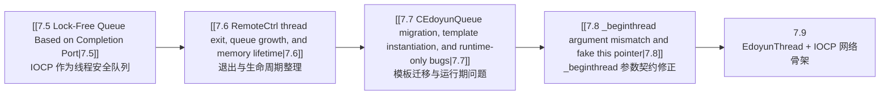
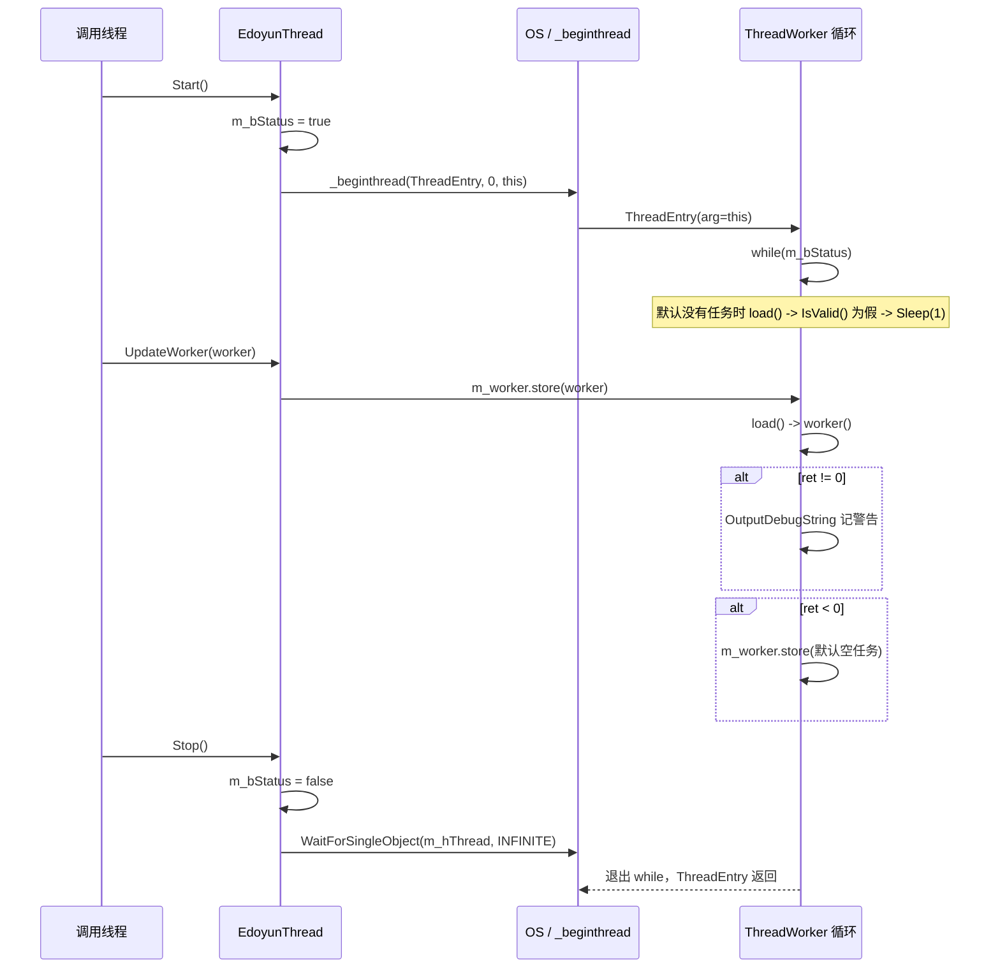
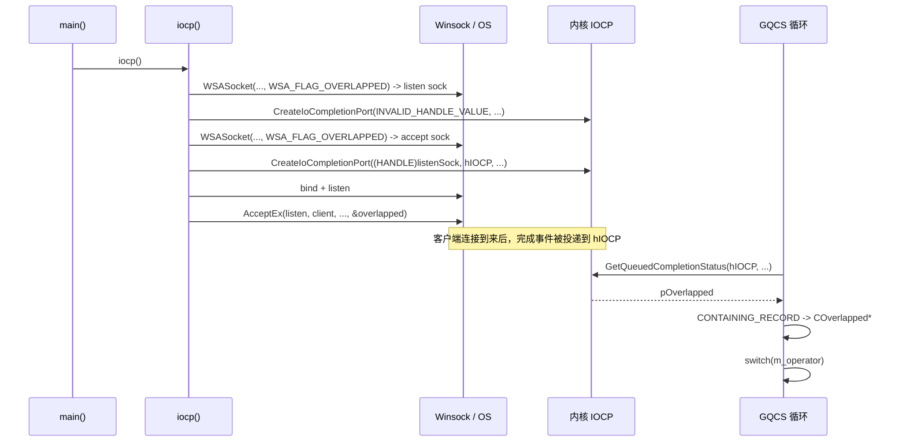

# 7.9 EdoyunThread 调度模型与 IOCP 网络编程启动骨架

> [!summary]
> 这一节对应的提交，不是在“把 IOCP 网络服务器彻底做完”，而是在做两件更基础、也更关键的准备工作。第一，项目里第一次出现了 `EdoyunThread` / `EdoyunThreadPool` 这样的通用线程抽象，不再把线程函数都写成一次性的 `_beginthread` 实验代码。第二，`RemoteCtrl.cpp` 也第一次把 IOCP 从“应用层线程安全队列”推进到“真实 socket 的异步网络 I/O 骨架”：`WSASocket`、`CreateIoCompletionPort`、`AcceptEx`、`GetQueuedCompletionStatus` 已经串起来了，但 `WSASend` / `WSARecv` 仍然只是占位，accept 完成后的后续处理也还没有落地。  
> 换句话说，这一节的主线不是“IOCP 服务器已经写完”，而是“线程调度抽象 + IOCP 网络骨架已经搭起来了”。

> 关联笔记：[[7.5 Lock-Free Queue Based on Completion Port]] · [[7.6 RemoteCtrl thread exit, queue growth, and memory lifetime]] · [[7.7 CEdoyunQueue migration, template instantiation, and runtime-only bugs]] · [[7.8 _beginthread argument mismatch and fake this pointer]]

---

## 1. 本次提交推进了什么

这次真正影响 7.9 的，是下面几处源码变化：

| # | 文件 | 变化 | 性质 |
|---|------|------|------|
| 1 | `EdoyunThread.h` | 新增 `ThreadFuncBase`、`ThreadWorker`、`EdoyunThread`、`EdoyunThreadPool` | 新机制 |
| 2 | `EdoyunThread.cpp` | 新增源文件，占位式包含头文件 | 工程接线 |
| 3 | `RemoteCtrl.cpp` | 删掉旧的 `CEdoyunQueue` 压测主流程，新增 `iocp()` 网络骨架 | 主体重构 |
| 4 | `RemoteCtrl.vcxproj` / `.filters` | 把 `EdoyunThread` 加入工程 | 工程接线 |
| 5 | `ServerSocket.h` | `WSAStartup(MAKEWORD(1, 1))` 升到 `MAKEWORD(2, 0)` | Winsock 版本准备 |

这一组改动背后的核心意思很明确：

1. **线程不再只是“临时起一个函数跑一下”**，而是开始被抽象成“可持续存活的线程 + 可替换的任务槽”。
2. **IOCP 不再只被当作队列机制实验**，而是开始被真正绑定到 socket，进入网络 I/O 语境。
3. **这一版仍然是 bootstrap**。骨架已经能看出方向，但还不是可用的完整网络服务器。

---

## 2. 与前一版的关系：从 IOCP 队列到 IOCP 网络 I/O

[[7.5 Lock-Free Queue Based on Completion Port]] 到 [[7.8 _beginthread argument mismatch and fake this pointer]] 这几节，主要围绕的是 `CEdoyunQueue<T>`：把 IOCP 当成一个**内核帮助我们串行化任务的应用层队列**。  
而 7.9 这次往前迈的一步，是把 IOCP 重新放回它更典型的定位：**网络 I/O 完成端口**。

下面这张 SVG 应该先把“旧模型”和“新模型”一眼看清。

![[7_9_1.svg]]

再把章节推进关系放成一张简单的流程图，会更容易看懂这一步为什么一定发生在 7.9：



上面两张图想表达的其实只有一句话：  
**7.5~7.8 把“队列实验”做顺了，7.9 才有资格开始把 IOCP 真正接到 socket 上。**

---

## 3. EdoyunThread 家族结构

`EdoyunThread` 这一组类型的设计思路，不是“线程池已经完成”，而是先把最底层的抽象拆出来：

- `ThreadFuncBase`：给成员函数指针一个统一基类。
- `ThreadWorker`：把“对象 + 成员函数”打包成一个可调用任务。
- `EdoyunThread`：持有一个长期存活的线程和一个原子任务槽。
- `EdoyunThreadPool`：用 `vector<EdoyunThread>` 作为池的外壳。

先看结构图。

![[7_9_2.svg]]

### 3.1 `ThreadFuncBase` 与 `FUNCTYPE`

```cpp
class ThreadFuncBase {};
typedef int (ThreadFuncBase::* FUNCTYPE)();
```

这一小段看起来不起眼，但它决定了 `ThreadWorker` 的整个类型系统。

它的目的不是给 `ThreadFuncBase` 本身增加能力，而是做一个**统一的成员函数签名锚点**。  
只要别的类继承自 `ThreadFuncBase`，那么它的某个 `int Xxx::Func()` 成员函数，就有机会被转成这个统一的 `FUNCTYPE` 形式保存下来。

这里真正解决的问题是：  
**我要怎样把“不同对象上的成员函数”塞进同一个轻量任务槽里，而不用立刻引入 `std::function` 或复杂的回调层。**

### 3.2 `ThreadWorker` —— 把“对象 + 成员函数”打包成任务

```cpp
class ThreadWorker
{
public:
    ThreadWorker() :thiz(NULL), func(NULL) {}
    ThreadWorker(ThreadFuncBase* obj, FUNCTYPE f) :thiz(obj), func(f) {}

    ThreadWorker(const ThreadWorker& worker)
    {
        thiz = worker.thiz;
        func = worker.func;
    }

    ThreadWorker& operator=(const ThreadWorker& worker)
    {
        if (this != &worker)
        {
            thiz = worker.thiz;
            func = worker.func;
        }
        return *this;
    }

    int operator()()
    {
        // ===== 真正的任务调用入口 =====
        // 只要对象指针和成员函数指针都准备好了，
        // 这里就会把 thiz 当作调用对象，去执行成员函数。
        if (this)
        {
            return (thiz->*func)();
        }
        return -1;
    }

    bool IsValid()
    {
        // ===== 一个任务是否可执行，不看别的，只看两件事 =====
        // 1. 有没有对象
        // 2. 有没有成员函数
        return (thiz != NULL) && (func != NULL);
    }

private:
    ThreadFuncBase* thiz;
    FUNCTYPE func;
};
```

这一段代码在系统里的角色，可以概括成一句话：

> `ThreadWorker` 不是线程，它只是线程将来要执行的“任务描述”。

它和普通函数指针最大的不同是，这里绑定的是**对象实例上的成员函数**。  
也就是说，线程并不是“拿到一个函数地址就直接调”，而是拿到一对信息：

- `thiz`：到底要在哪个对象上调用。
- `func`：调用这个对象的哪个成员函数。

这就是后面 `EdoyunThread` 能做“线程不重建，只换任务”的前提。

### 3.3 这一组类型的系统意义

到这里先不要急着看 `Start()` 和 `Stop()`。  
先把整体关系吃透：

- `ThreadWorker` 负责描述“做什么”。
- `EdoyunThread` 负责描述“谁来持续运行、不断检查是否有任务”。
- `EdoyunThreadPool` 负责把多个 `EdoyunThread` 组织起来。

所以它和 [[7.5 Lock-Free Queue Based on Completion Port]] 那种“所有请求都先扔到 IOCP 队列里排队”不是同一条路线。  
7.5 更像“**有队列就投递**”，7.9 这里更像“**有长期线程，就往线程的任务槽里换任务**”。

---

## 4. `EdoyunThread` 生命周期：启动、取任务、执行、退出

### 4.1 `Start()` / `IsValid()` / `Stop()`

下面这一段，是整个线程抽象最核心的生命周期入口。

```cpp
bool Start()
{
    // ===== 1. 先把运行标志置为 true =====
    // 线程函数一旦跑起来，会立刻检查 m_bStatus。
    // 所以这里必须先置 true，再真正启动线程。
    m_bStatus = true;

    // ===== 2. 把 this 作为线程上下文传给 _beginthread =====
    // 这正是 [[7.8 _beginthread argument mismatch and fake this pointer|7.8]]
    // 里修过的那条经验：线程入口最后要拿回“所属对象”。
    m_hThread = (HANDLE)_beginthread(&EdoyunThread::ThreadEntry, 0, this);

    // ===== 3. 启动后立即检查句柄状态 =====
    // 但这里的 IsValid() 语义其实写反了，见后文“坑点”。
    if (!IsValid())
    {
        m_bStatus = false;
    }
    return m_bStatus;
}

bool IsValid()
{
    if (m_hThread == NULL || (m_hThread == INVALID_HANDLE_VALUE))
        return false;

    // ===== 当前实现的问题点 =====
    // WaitForSingleObject(handle, 0) 返回 WAIT_OBJECT_0，
    // 往往表示线程已经结束（句柄进入 signaled 状态），
    // 不是“线程还活着”。
    return WaitForSingleObject(m_hThread, 0) == WAIT_OBJECT_0;
}

bool Stop()
{
    if (m_bStatus == false)
        return true;

    // ===== 先发退出信号，再等待线程真正退出 =====
    m_bStatus = false;
    WaitForSingleObject(m_hThread, INFINITE);

    // ===== 这里少了 return =====
    // 函数声明是 bool，但成功路径没有显式返回值。
}
```

这一段代码要分成两层理解。

#### 第一层：设计意图本身是对的

作者想做的是一个很典型的长期工作线程模型：

1. `Start()` 负责创建线程，并把对象自己传进线程入口。
2. 线程入口拿回 `this`，进入循环。
3. `Stop()` 只负责改标志并等待退出，不强杀线程。

这个方向本身没有问题，而且比前几节里那些临时线程函数更成熟。

#### 第二层：当前实现里埋着一个会立刻影响行为的判断错误

`IsValid()` 当前写成：

```cpp
return WaitForSingleObject(m_hThread, 0) == WAIT_OBJECT_0;
```

这在语义上是可疑的。  
对于线程句柄来说，`WAIT_OBJECT_0` 更接近“线程已经结束，句柄已经 signaled”，而不是“线程正在健康运行”。

这会带来一个非常要命的连锁效果：

- `Start()` 成功创建线程后，立刻调用 `IsValid()`。
- 如果 `IsValid()` 把“已结束”当成“有效”，那判定逻辑就反了。
- 结果就是 `m_bStatus` 很可能被错误清掉，线程刚起就准备退。

这也是为什么这一节必须把“新抽象已经出现”和“当前代码还不能完全相信”同时写出来。

### 4.2 真正执行任务的循环

```cpp
virtual void ThreadWorker()
{
    while (m_bStatus)
    {
        // ===== 每次循环都从原子变量里取当前任务 =====
        // 这说明设计目标不是“排队多个任务”，
        // 而是“始终只有一个当前任务槽”。
        ::ThreadWorker worker = m_worker.load();

        if (m_worker.load().IsValid())
        {
            int ret = worker();

            // ===== 非 0 返回值：记日志 =====
            if (ret != 0)
            {
                CString str;
                str.Format(_T("thread found warning code %d\r\n"), ret);
                OutputDebugString(str);
            }

            // ===== 负值：当前任务自我失效，线程把任务槽清空 =====
            if (ret < 0)
            {
                m_worker.store(::ThreadWorker());
            }
        }
        else
        {
            // ===== 没有任务时不做忙等，睡 1ms =====
            Sleep(1);
        }
    }
}

static void ThreadEntry(void* arg)
{
    // ===== 静态线程入口负责把 void* 还原回对象 =====
    EdoyunThread* thiz = (EdoyunThread*)arg;
    if (thiz)
    {
        thiz->ThreadWorker();
    }
    _endthread();
}
```

这段代码的系统性含义非常重要，不能只当成“一个 while 循环”。

#### 它不是任务队列，而是任务槽

这一点和前面的 `CEdoyunQueue<T>` 完全不同。

`CEdoyunQueue<T>` 的思路是：

- 多个请求都能压进队列。
- 工作线程一个一个取。

而 `EdoyunThread` 这里的思路是：

- 线程长期活着。
- 外部通过 `m_worker.store(...)` 替换“当前任务”。
- 线程循环里反复看这个任务槽有没有任务。

所以这更像：

> **线程常驻，任务可替换。**

#### 这也解释了为什么它需要 `std::atomic`

因为 `UpdateWorker()` 很可能是在另一个线程里调用的：

```cpp
void UpdateWorker(const ::ThreadWorker& worker = ::ThreadWorker())
{
    m_worker.store(worker);
}
```

也就是说：

- 调用者线程在写 `m_worker`
- 工作线程在读 `m_worker`

如果这里没有原子语义，最直接的问题就是“一个线程刚写到一半，另一个线程正好读”。  
作者显然就是想避免这一层同步问题，所以选择了 `std::atomic<ThreadWorker>`。

#### 但这又引出下一个系统级问题

`std::atomic<T>` 在标准层面要求 `T` 是 **TriviallyCopyable**。  
而当前 `ThreadWorker` 明确自己写了拷贝构造和赋值运算符，这让它在标准语义上不再是平凡可拷贝类型。

这意味着：

- 设计方向：想做一个无锁任务槽。
- 现实实现：类型本身又不完全满足标准 `atomic<T>` 的要求。

所以 7.9 这一步真正值得记住的不是“它已经完美实现了无锁调度”，而是：

> 它已经把调度模型的形状搭出来了，但类型设计还需要再收一遍。

### 4.3 线程生命周期时序图



从这张时序图可以看出，`EdoyunThread` 当前更接近“**可热切换任务的单线程执行器**”，而不是传统意义上“把很多任务排队分发”的线程池工作单元。

### 4.4 `EdoyunThreadPool` 目前做到了哪一步

```cpp
bool Invoke()
{
    bool ret = true;

    for (size_t i = 0; i < m_threads.size(); i++)
    {
        if (m_threads[i].Start() == false)
        {
            ret = false;
            break;
        }
    }

    // ===== 只要有一个线程启动失败，就把前面成功启动的全部停掉 =====
    // 这是一个典型的“全有或全无”回滚思路。
    if (ret == false)
    {
        for (size_t i = 0; i < m_threads.size(); i++)
        {
            m_threads[i].Stop();
        }
        return ret;
    }

    // ===== 成功路径少了 return true =====
}

int DispatchWorker(const ThreadWorker& worker)
{
    // ===== 这里还是空的 =====
    // 说明线程池外壳有了，但“任务路由到哪一个线程”还没有实现。
}
```

这段代码说明得很直接：

- 线程池的“**启动 / 回滚 / 停止**”外壳已经有了。
- 线程池最关键的“**如何分配任务**”还没写。

所以 7.9 不能写成“线程池已经完成”，更准确的说法应该是：

> **线程池的资源管理壳子已经出现，但调度策略仍然为空。**

---

## 5. `iocp()`：真正把 IOCP 接到网络 socket 上

如果说 `EdoyunThread` 是这次提交在线程抽象上的“骨架”，那么 `iocp()` 就是它在网络编程上的“骨架”。

这一节最重要的，不是记住某一行 API，而是看清整条链：

1. 先创建支持 overlapped 的 socket。
2. 再创建 IOCP 端口。
3. 再把 listen socket 关联到这个端口。
4. 再发起 `AcceptEx`。
5. 最后用 `GetQueuedCompletionStatus` 阻塞等待完成事件。

### 5.1 整体事件链



这张图最核心的认识，是：

> 以前 IOCP 队列里装的是“我自己塞进去的任务包”；  
> 现在 IOCP 端口里等的是“内核替我投递的网络完成事件”。

### 5.2 `COverlapped` —— 完成事件的父对象包装

```cpp
class COverlapped
{
public:
    OVERLAPPED m_overlapped;
    DWORD m_operator;
    char m_buffer[4096];

    COverlapped()
    {
        m_operator = 0;
        memset(&m_overlapped, 0, sizeof(m_overlapped));
        memset(m_buffer, 0, sizeof(m_buffer));
    }
};
```

这段结构体的设计非常典型，它不是随便包了一层，而是在为 `CONTAINING_RECORD` 做准备。

系统完成 I/O 以后，`GetQueuedCompletionStatus` 还给你的，主要是：

- 完成字节数
- CompletionKey
- `LPOVERLAPPED`

可是真正的业务代码通常不满足于只拿到裸的 `OVERLAPPED*`，它还想知道：

- 这是 accept 还是 recv 还是 send？
- 这次 I/O 对应的缓冲区在哪里？
- 这次事件对应的是哪个业务上下文？

于是就有了这种写法：

- 把 `OVERLAPPED` 嵌进自己的结构体。
- 再额外放 `m_operator`、`m_buffer` 这些业务字段。
- 等完成后通过 `CONTAINING_RECORD` 从 `OVERLAPPED*` 反推出整个父对象。

所以 `COverlapped` 的角色，可以直接理解成：

> **一次异步 I/O 操作的上下文对象。**

### 5.3 `iocp()` —— 带分段注释的完整骨架

```cpp
void iocp()
{
    // ===== 1. 创建支持 overlapped 的监听 socket =====
    // 普通 socket() 在这里不是重点，真正关键的是：
    // 这个 socket 必须能参与异步 I/O，所以要用 WSASocket + WSA_FLAG_OVERLAPPED。
    SOCKET sock = WSASocket(AF_INET, SOCK_STREAM, 0, NULL, 0, WSA_FLAG_OVERLAPPED);
    if (sock == INVALID_SOCKET)
    {
        CEdoyunTool::ShowError();
        return;
    }

    // ===== 2. 先创建一个 IOCP 端口 =====
    // 这是 CreateIoCompletionPort 的“创建模式”：
    // 第一个参数给 INVALID_HANDLE_VALUE，表示现在只是要创建端口，
    // 还不是把某个具体的 socket 绑上去。
    //
    // 这里第三个参数写了 sock，但在“创建模式”下并不是这一步的核心。
    // 真正重要的是：得到 hIOCP 这个完成端口句柄。
    HANDLE hIOCP = CreateIoCompletionPort(INVALID_HANDLE_VALUE, NULL, sock, 4);

    // ===== 3. 预创建 AcceptEx 需要的 client socket =====
    // 这和 accept() 很不一样。
    // accept() 是系统帮你返回一个新连接 socket；
    // AcceptEx 要求你先准备好接收用的 socket，再把它交给 API。
    SOCKET client = WSASocket(AF_INET, SOCK_STREAM, 0, NULL, 0, WSA_FLAG_OVERLAPPED);

    // ===== 4. 把监听 socket 关联到已有的完成端口 =====
    // 这是 CreateIoCompletionPort 的“关联模式”：
    // 第一个参数这次不再是 INVALID_HANDLE_VALUE，而是一个真实的 socket 句柄。
    CreateIoCompletionPort((HANDLE)sock, hIOCP, 0, 0);

    // ===== 5. 绑定地址并开始监听 =====
    sockaddr_in addr;
    addr.sin_family = PF_INET;
    addr.sin_addr.s_addr = inet_addr("0.0.0.0");
    addr.sin_port = htons(9527);

    bind(sock, (sockaddr*)&addr, sizeof(addr));
    listen(sock, 5);

    // ===== 6. 构造一次 AcceptEx 所需的重叠上下文 =====
    COverlapped overlapped;
    overlapped.m_operator = 1;   // 1 代表 accept

    // ===== 这里的写法“当前能工作，但容易误读” =====
    // 因为 m_overlapped 恰好是第一个成员，所以从 &overlapped 开始、
    // 清 sizeof(OVERLAPPED) 个字节，当前布局下等价于只清 m_overlapped。
    // 它不会清掉后面的 m_operator。
    //
    // 但表达上不够精确，更推荐写成：
    // memset(&overlapped.m_overlapped, 0, sizeof(OVERLAPPED));
    memset(&overlapped, 0, sizeof(OVERLAPPED));

    char buffer[4096] = "";
    DWORD received = 0;

    // ===== 7. 发起异步 accept =====
    // 注意：对 overlapped I/O 而言，AcceptEx 返回 FALSE 并不一定表示失败。
    // 很常见的一种情况是：
    //   返回 FALSE
    //   WSAGetLastError() == WSA_IO_PENDING
    // 这其实表示“操作已经成功挂起，等待未来完成”。
    //
    // 当前代码只要看到 FALSE 就 ShowError，这会把正常的 pending 路径也当成错误。
    if (AcceptEx(sock, client, overlapped.m_buffer, 0,
                 sizeof(sockaddr_in) + 16, sizeof(sockaddr_in) + 16,
                 &received, &overlapped.m_overlapped) == FALSE)
    {
        CEdoyunTool::ShowError();
    }

    // ===== 8. 为未来的 send / recv 留了位置，但当前还是空桩 =====
    overlapped.m_operator = 2;
    WSASend();

    overlapped.m_operator = 3;
    WSARecv();

    // ===== 9. 进入完成端口分发循环 =====
    while (true)
    {
        LPOVERLAPPED pOverlapped = NULL;
        DWORD transferred = 0;
        DWORD key = 0;

        // INFINITY 是浮点常量，不是 Win32 等待常量。
        // 这里想表达的其实是 INFINITE。
        if (GetQueuedCompletionStatus(hIOCP, &transferred, &key, &pOverlapped, INFINITY))
        {
            // ===== 从成员指针反推整个上下文对象 =====
            // pOverlapped 指向的是 COverlapped 里的 m_overlapped 成员，
            // 所以要通过 CONTAINING_RECORD 拿回父对象。
            COverlapped* pO = CONTAINING_RECORD(pOverlapped, COverlapped, m_overlapped);

            switch (pO->m_operator)
            {
            case 1:
                // ===== Accept 完成后的处理目前还没写 =====
                // 后续真正要做的事情应该包括：
                // 1. 取出 client 连接上下文
                // 2. 把已连接 socket 接到后续收发链路
                // 3. 再次投递下一次 AcceptEx
                break;

            default:
                break;
            }
        }
    }
}
```

### 5.4 这段代码在系统层面到底说明了什么

上面那一大段代码，如果只逐行解释，很容易看得很散。  
所以这里必须再做一次系统性收束。

#### 第一，`CreateIoCompletionPort` 为什么调用两次

这不是重复，而是两个阶段：

1. **创建阶段**  
   `CreateIoCompletionPort(INVALID_HANDLE_VALUE, NULL, ..., 4)`  
   目的是先拿到一个 IOCP 端口句柄。

2. **关联阶段**  
   `CreateIoCompletionPort((HANDLE)sock, hIOCP, 0, 0)`  
   目的是把真实的 listen socket 绑到这个端口上。

所以这一个 API，其实被用成了两种模式。  
这也是 IOCP 初学者最容易误解的点之一。

#### 第二，`AcceptEx` 和 `accept()` 的思想完全不一样

`accept()` 的思路是：

- 线程在这里阻塞。
- 有客户端连进来以后，函数直接返回新 socket。

`AcceptEx` 的思路是：

- 先把“accept 这件事”投递出去。
- 当前线程不在这里等连接本身，而是等“完成事件”。
- 真正的处理入口转移到 `GetQueuedCompletionStatus` 循环。

所以 7.9 的真正转变，并不是“把 `accept` 换成 `AcceptEx`”这么简单，而是：

> **把连接建立这件事，也纳入了统一的完成端口事件驱动模型。**

#### 第三，当前代码已经进入 IOCP 网络模型，但还没有跑完整个闭环

目前还缺至少这几步：

- `WSASend` / `WSARecv` 还是空桩。
- `AcceptEx` 完成后没有真正处理 accept 成功链路。
- 连接完成后也没有把收发 socket 纳入完整的上下文对象管理。
- 通常还要继续补“再次投递下一次 accept”的循环逻辑。

所以这里一定要把“已经进入新模型”和“还只是骨架”同时写清楚。

---

## 6. `std::atomic<ThreadWorker>`：这个设计为什么值得单独说

`EdoyunThread` 里最有野心的一行，其实是这句：

```cpp
std::atomic<::ThreadWorker> m_worker;
```

它代表的设计目标非常鲜明：

- 不用 mutex
- 不用条件变量
- 不用任务队列
- 只用一个原子任务槽，在不同线程之间做任务热替换

这在概念上很漂亮，但实现上有一个绕不过去的标准约束：

> `std::atomic<T>` 要求 `T` 满足平凡可拷贝（TriviallyCopyable）一类的条件。

而当前 `ThreadWorker` 明确自己写了：

- 拷贝构造函数
- 赋值运算符

这会让它在标准意义上不再是“平凡可拷贝”类型。  
因此这段代码至少存在两层风险：

1. **标准层面的不合规**  
   按标准去看，这样的 `atomic<ThreadWorker>` 写法是可疑的。

2. **编译器实现差异**  
   某些实现可能直接拒绝，某些实现可能放过去，但行为保证并不稳。

所以这一节最好的写法，不是简单说“这是 bug”，而是更准确地写成：

> 这是一个很有代表性的设计尝试：想做无锁任务槽；但为了让这个任务槽真正站得住，`ThreadWorker` 的类型性质还要继续收束。

---

## 7. Win32 / Winsock / C++ 关键机制

### 7.1 本节新增 API 速查表

| API / 机制 | 在本提交里的作用 | 这里最该记住的点 |
|---|---|---|
| `WSASocket(..., WSA_FLAG_OVERLAPPED)` | 创建可参与异步 I/O 的 socket | 不是普通 `socket()` 语义，重点是让后续 `AcceptEx` / `WSARecv` / `WSASend` 有 overlapped 能力 |
| `CreateIoCompletionPort` | 创建完成端口、关联 socket | 同一个 API 有“创建模式”和“关联模式”两种用法 |
| `AcceptEx` | 发起异步 accept | 不是阻塞等返回，而是把 accept 完成事件交给 IOCP |
| `GetQueuedCompletionStatus` | 从完成端口取完成事件 | 这里是新网络模型真正的分发入口 |
| `CONTAINING_RECORD` | 从 `OVERLAPPED*` 反推父对象 | 这是异步 I/O 上下文结构最常见的取回方式 |
| `_beginthread` | 启动 CRT 线程 | 第三个参数的语义契约必须和线程入口一致，7.8 已经专门踩过这个坑 |
| `WaitForSingleObject` | 等线程退出 | 用在线程句柄上时，要分清楚“signaled”代表线程已经结束 |

### 7.2 `AcceptEx` 与 `accept()` 的教学版比较

| 维度 | `accept()` | `AcceptEx` |
|---|---|---|
| 调用方式 | 当前线程直接阻塞 | 先发起请求，未来再收完成事件 |
| 返回时机 | 连接建立以后立刻返回 | 可能先返回 pending，完成以后由 IOCP 通知 |
| 线程模型 | 往往一个线程阻塞在这里 | 更适合统一接入完成端口事件循环 |
| 与 IOCP 的关系 | 不是天然完成端口风格 | 本来就是为重叠 I/O / 完成端口链路准备的 |

### 7.3 `INFINITE` 与 `INFINITY` 不能混

代码里这句：

```cpp
GetQueuedCompletionStatus(..., INFINITY)
```

会触发一个很典型的“名字看起来差不多，但语义根本不同”的问题：

- `INFINITE` 是 Win32 等待 API 里的“无限等待”
- `INFINITY` 是浮点语义的正无穷常量

这也是构建日志里出现从 `float` 到 `DWORD` 转换 warning 的原因之一。  
这种问题特别适合记进远控项目的“易错点”：  
**很多 API 问题不是大错，而是看起来像对、其实名字写错。**

### 7.4 `WSAStartup` 升到 2.0 的意义

`ServerSocket.h` 里：

```cpp
if (WSAStartup(MAKEWORD(2, 0), &data) != 0)
```

这个变化本身不大，但它说明一件事：

> 项目已经在为更现代的 Winsock 使用场景收口，不再停留在旧版兼容姿势上。

它和 `iocp()` 的引入是同方向的：  
都在告诉我们，项目已经开始从“同步 socket 实验”走向“异步 Winsock / IOCP 模型”。

---

## 8. 当前版本的坑点、构建阻塞与未完成项

这一节不写成 `Debug-XXX`，因为这次提交的主线仍然是**新机制出现**；  
但下面这些点又必须写，否则会把 7.9 写得过于乐观。

### 8.1 `IsValid()` 语义疑似反了

最重要的一点已经在上面讲过。  
当前实现把线程句柄进入 `WAIT_OBJECT_0` 当成“有效”，这是非常值得警惕的。

### 8.2 `Stop()` 和 `Invoke()` 成功路径都缺返回值

这类问题不花哨，但非常典型：

- 函数声明是 `bool`
- 某些路径 `return true`
- 成功路径却直接跑到函数结尾

这种问题经常在“代码结构先搭出来”的阶段出现，也非常适合在后续 debug 笔记里作为检查清单保留下来。

### 8.3 `WSASend()` / `WSARecv()` 仍然是空桩，已经直接体现在构建日志里

这不是推测，而是构建日志里已经出现了对应错误。  
所以这次提交不能被描述成“网络收发已经进入实现阶段”，更准确的说法是：

> send / recv 的位置已经预留，但代码本体还没写。

### 8.4 `inet_addr` 已经触发弃用错误

这一点同样是构建日志直接给出的。  
它说明当前 `iocp()` 甚至还没完成“编译层面的现代化收口”。

### 8.5 `GetQueuedCompletionStatus(..., INFINITY)` 写法不对

这个点上面已经解释过，本质是等待常量写错。  
虽然是 warning，但它直接暴露出这段骨架还处在“先把链路拼出来，再慢慢收口”的阶段。

### 8.6 `AcceptEx(FALSE)` 并不总是失败，当前判断会把 pending 也当成错误

这是 overlapped I/O 最重要的语义点之一。

当前代码：

```cpp
if (AcceptEx(...) == FALSE)
{
    CEdoyunTool::ShowError();
}
```

问题在于：

- 对于异步发起型 API，`FALSE + WSA_IO_PENDING` 可能是正常路径。
- 当前写法没有区分“真实错误”和“已成功挂起，等待未来完成”。

这会让调试体验变得非常误导：  
看起来像“accept 失败了”，其实只是 accept 已经进入异步等待。

### 8.7 连接完成后的后续链路还没写

现在 `switch (pO->m_operator)` 里只有：

- `case 1:` 留空

这意味着 accept 完成以后至少还没有做这些关键动作：

- 已连接 socket 的上下文收口
- 关联后续收发
- 再次投递新的 accept
- 真正进入多连接循环

所以 7.9 这一步最合适的定位，是：

> **网络 I/O 完成端口的门已经推开了，但还站在门口。**

---

## 9. 当前版本的准确结论

| 项目 | 当前状态 |
|---|---|
| `ThreadWorker` 任务包装思路 | ✅ 已出现，方向清楚 |
| `EdoyunThread` 长期线程 + 原子任务槽模型 | ✅ 已成形，但有效性判断存在明显隐患 |
| `EdoyunThreadPool` 外壳 | ✅ 已出现，但任务分发函数仍为空 |
| IOCP 与真实 socket 绑定 | ✅ 已开始，不再只是应用层队列实验 |
| `AcceptEx` 完成事件分发入口 | ✅ 已出现，`GetQueuedCompletionStatus` + `CONTAINING_RECORD` 链路成立 |
| `WSASend` / `WSARecv` | ❌ 仍是占位 |
| Accept 完成后的完整收发闭环 | ❌ 尚未实现 |
| 当前提交的整体定位 | ✅ 启动骨架 / bootstrap，而不是成品 |

如果把 7.9 用一句话收束，我会写成：

> 这次提交真正完成的，不是“IOCP 服务器”，而是“为 IOCP 服务器准备了线程抽象和网络启动骨架”。

---

## 10. 代码索引

| 文件 | 本节重点 |
|---|---|
| `RemoteCtrl/RemoteCtrl/EdoyunThread.h` | `ThreadFuncBase`、`FUNCTYPE`、`ThreadWorker`、`EdoyunThread::Start/Stop/IsValid/UpdateWorker/ThreadWorker/ThreadEntry`、`EdoyunThreadPool::Invoke/Stop/DispatchWorker` |
| `RemoteCtrl/RemoteCtrl/EdoyunThread.cpp` | 仅工程接线，占位源文件 |
| `RemoteCtrl/RemoteCtrl/RemoteCtrl.cpp` | `main()`、`COverlapped`、`iocp()`、`GetQueuedCompletionStatus` 分发循环 |
| `RemoteCtrl/RemoteCtrl/ServerSocket.h` | `WSAStartup(MAKEWORD(2, 0))`，说明 Winsock 版本准备在收口 |

---

## 11. 更新记录

- 7.9：记录 `EdoyunThread` 调度抽象的首次出现，以及项目从 IOCP 队列实验过渡到 IOCP 网络 I/O 启动骨架的关键一步。
