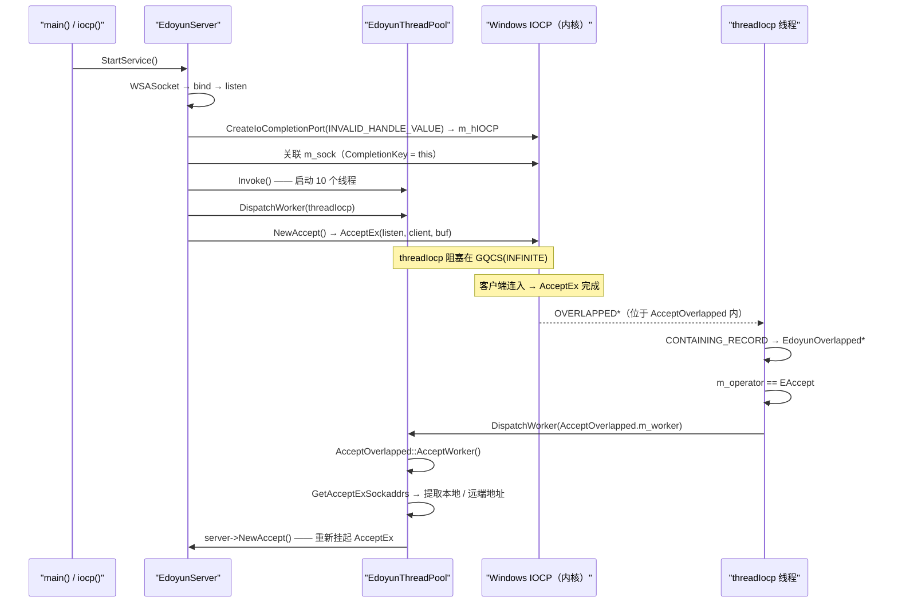

---
tags:
  - Remote Control System
  - cpp
  - windows
  - IOCP
  - network-server
  - thread-pool
  - AcceptEx
git: "newremoteCtrl 00bdf97"
created: 2026-04-13
updated: 2026-04-14
aliases:
  - 8.1 EdoyunServer
  - 8.1 IOCP server architecture
  - 8.1 IOCP 服务器架构
  - 8.1 EdoyunServer 初版设计
---

# 8.1 IOCP 服务器架构：EdoyunServer 初版设计

> **摘要**：提交 `00bdf97` 把 [[7.9 EdoyunThread Dispatch Model and IOCP Network Programming Bootstrap|7.9]] 里裸露的 IOCP 套接字骨架收进了一个完整类中：`EdoyunServer` 负责监听套接字、IOCP 句柄、线程池和客户端映射。`AcceptOverlapped<EAccept>` 专门处理 `AcceptEx` 完成事件。`EdoyunThreadPool::DispatchWorker()` 也在这次提交里补齐了实现，而 `Recv` / `Send` / `Error` 处理器仍然是 `//TODO`。

---

## 1. 本次提交改了什么

| 文件 | 变更 | 新增内容 |
|------|------|----------|
| `EdoyunServer.h` | +265（新建） | `EdoyunServer`、`EdoyunOverlapped`、按操作类型拆分的 overlapped 模板、`EdoyunClient` |
| `EdoyunServer.cpp` | +50（新建） | `AcceptOverlapped<EAccept>::AcceptWorker()`、`EdoyunClient` 构造函数 |
| `EdoyunThread.h` | +68 / −19 | `EdoyunThreadPool::DispatchWorker()` 得到实现；`FUNCTYPE` 强转修正 |
| `RemoteCtrl.cpp` | +9 | `main()` → `iocp()` → `EdoyunServer server; server.StartService()` |
| `CEdoyunQueue.h` | +1 / −1 | 小幅调整 |

**提交类型**：新功能。无需单独记录 Debug 日志。

---

## 2. 旧方案与新方案对比

![[图片/SVG/8.1-IOCP-Server-Architecture-—-EdoyunServer-Initial-Design-01.svg|867]]

**关键行为差异**：
- **旧方案**（提交 23a26763，[[7.9 EdoyunThread Dispatch Model and IOCP Network Programming Bootstrap|7.9]] §5）：套接字初始化、`AcceptEx` 和 `GQCS` 分发全都挤在一个函数里，现在已经被注释掉。
- **新方案**：`EdoyunServer` 把职责拆开了，启动逻辑放在 `StartService()`，IOCP 分发放在 `threadIocp()`，accept 完成后的处理放在 `AcceptOverlapped<EAccept>::AcceptWorker()`。

---

## 3. 主流程

`AcceptEx` 会先向内核投递一个异步 accept。客户端连上来以后，IOCP 端口唤醒 `threadIocp`，再由线程池把任务分发给 `AcceptWorker`。`AcceptWorker` 取出地址信息后，会立刻重新挂起下一次 `AcceptEx`，因此内核里始终只保留一个待完成的 accept。



**对比 [[7.9 EdoyunThread Dispatch Model and IOCP Network Programming Bootstrap|7.9]]**：7.9 里 `GQCS` 循环和 `switch` 分发直接写在 `iocp()` 里；现在 `threadIocp()` 被收进类成员函数，再通过线程池调度，每种操作类型也都有自己的 overlapped 类和专属 worker 回调。

---

## 4. 核心实现

### 4.1 `EdoyunServer::StartService()`：完整的服务器启动流程

```cpp
bool StartService()
{
    // ===== 1. 创建重叠套接字 =====
    // AcceptEx 只能和带 WSA_FLAG_OVERLAPPED 的套接字一起使用。
    // 参见 [[7.9 EdoyunThread Dispatch Model and IOCP Network Programming Bootstrap|7.9]] §7
    CreateSocket(); // WSASocket(AF_INET, SOCK_STREAM, 0, NULL, 0, WSA_FLAG_OVERLAPPED)

    if (bind(m_sock, (sockaddr*)&m_addr, sizeof(m_addr)) == -1) { closesocket(m_sock); return false; }
    if (listen(m_sock, 3) == -1) { closesocket(m_sock); return false; }

    // ===== 2. 创建 IOCP 端口（两次调用模式） =====
    // 第一次：INVALID_HANDLE_VALUE 表示“新建端口，此时还没有设备关联上来”
    // concurrency=4 表示同一时刻最多允许 4 个线程并发执行完成回调
    m_hIOCP = CreateIoCompletionPort(INVALID_HANDLE_VALUE, NULL, 0, 4);

    // 第二次：把监听套接字关联到端口上；CompletionKey = (ULONG_PTR)this
    // 非 0 的 key 让 threadIocp 的保护判断能确认服务器指针有效
    CreateIoCompletionPort((HANDLE)m_sock, m_hIOCP, (ULONG_PTR)this, 0);

    // ===== 3. 启动线程池，并投递 IOCP worker 线程 =====
    m_pool.Invoke();
    m_pool.DispatchWorker(ThreadWorker(this, (FUNCTYPE)&EdoyunServer::threadIocp));

    // ===== 4. 先把第一发 AcceptEx 投出去 =====
    // 如果没有这次预投递，客户端连进来也不会触发任何完成事件
    if (!NewAccept()) return false;
    return true;
}
```

**职责**：一次调用里完成服务器的完整初始化。  
**风险**：如果线程池已经启动，但 `NewAccept()` 随后失败，`threadIocp` 会永久阻塞在 `GQCS` 上，因为当前版本没有任何路径可以把已经跑起来的线程池停下来。

---

### 4.2 `EdoyunServer::NewAccept()`：投递一次 `AcceptEx`

```cpp
bool NewAccept()
{
    // ===== 1. 预先创建 accept 套接字 =====
    // AcceptEx 不会帮你创建套接字，调用方必须提前提供。
    // EdoyunClient 的构造函数内部会调用 WSASocket(WSA_FLAG_OVERLAPPED)。
    PCLIENT pClient(new EdoyunClient());

    // ===== 2. 把 shared_ptr 回填到 overlapped 对象里 =====
    // AcceptWorker 之后要靠 m_client 调用 GetAcceptExSockaddrs
    pClient->setOverlapped(pClient); // 把 ACCEPTOVERLAPPED.m_client 关联回 pClient

    // ===== 3. 注册到客户端映射表 =====
    m_client.insert({ *pClient, pClient }); // *pClient → operator SOCKET()

    // ===== 4. 用运算符重载写法投递 AcceptEx =====
    // EdoyunClient 提供了 4 个类型转换运算符，所以 AcceptEx 的 4 个参数
    // 都能写成 *pClient。它会根据参数位置分别解析成不同类型：
    //   *pClient → SOCKET（accept 套接字）   *pClient → PVOID（缓冲区）
    //   *pClient → LPDWORD（received）       *pClient → LPOVERLAPPED
    if (!AcceptEx(m_sock, *pClient, *pClient, 0,
                  sizeof(sockaddr_in) + 16, sizeof(sockaddr_in) + 16,
                  *pClient, *pClient))
    { return false; }
    return true;
}
```

**运算符重载设计**：写法很紧凑，但可读性偏差。读者必须知道每个参数位置会触发哪个转换运算符，才能真正看懂这里到底传了什么。

---

### 4.3 `EdoyunServer::threadIocp()`：IOCP 分发（单次处理一个事件）

```cpp
int threadIocp()
{
    DWORD tranferred = 0;
    ULONG_PTR CompletionKey = 0;
    OVERLAPPED* lpOverlapped = NULL;

    if (GetQueuedCompletionStatus(m_hIOCP, &tranferred, &CompletionKey,
                                  &lpOverlapped, INFINITE))
    {
        if (tranferred > 0 && CompletionKey != 0) // key == 0 表示关闭哨兵
        {
            // ===== 从嵌入的 OVERLAPPED 里反推出 EdoyunOverlapped =====
            // CONTAINING_RECORD: (EdoyunOverlapped*)((char*)lpOverlapped - offsetof(...))
            // 之所以安全，是因为 m_overlapped 是 EdoyunOverlapped 的第一个成员。
            EdoyunOverlapped* pOv = CONTAINING_RECORD(lpOverlapped,
                                                       EdoyunOverlapped, m_overlapped);
            // ===== 按操作类型路由，再把任务交给线程池 =====
            switch (pOv->m_operator)
            {
            case EAccept: m_pool.DispatchWorker(((ACCEPTOVERLAPPED*)pOv)->m_worker); break;
            case ERecv:   m_pool.DispatchWorker(((RECVOVERLAPPED*)pOv)->m_worker);   break;
            case ESend:   m_pool.DispatchWorker(((SENDOVERLAPPED*)pOv)->m_worker);   break;
            case EError:  m_pool.DispatchWorker(((ERROROVERLAPPED*)pOv)->m_worker);  break;
            }
        }
        else { return -1; } // 传输字节为 0 且 key 为空时，线程池不再重复调度
    }
    return 0;
}
```

**为什么只处理一轮**：`EdoyunThread` 外层会在 `while(m_bStatus)` 里不断把它当作 `worker()` 调用，所以这里每次只处理一个完成事件，返回后再由外层循环继续调度。  
**风险**：`DispatchWorker()` 在所有线程都忙的时候会返回 `−1`。这里完全没有检查返回值，所以线程池一旦饱和，完成事件会被静默丢弃。

---

### 4.4 `AcceptOverlapped<EAccept>::AcceptWorker()`：处理连接并重新挂起 `AcceptEx`

```cpp
template<EdoyunOperator op>
int AcceptOverlapped<op>::AcceptWorker()
{
    INT lLen = 0, rLen = 0;

    // ===== 1. 检查传输字节数，确认这次连接确实有效 =====
    // m_client->operator LPDWORD() → &m_received；再解两次引用才能拿到值
    if (*(LPDWORD)*m_client.get() > 0)
    {
        // ===== 2. 从 AcceptEx 缓冲区里解析出地址 =====
        // AcceptEx 会把本地和远端 sockaddr 都写进同一块缓冲区。
        // GetAcceptExSockaddrs 负责把它们拆出来；在调用它之前不能直接用 getpeername。
        GetAcceptExSockaddrs(
            *m_client,                               // operator PVOID() → buffer ptr
            0,                                       // dwReceiveDataLength = 0
            sizeof(sockaddr_in) + 16,
            sizeof(sockaddr_in) + 16,
            (sockaddr**)m_client->GetLocalAddr(), &lLen,
            (sockaddr**)m_client->GetRmoteAddr(), &rLen
        );

        // ===== 3. 重新挂起下一次 AcceptEx =====
        // 这是一个自续链：内核里始终只维持 1 个待完成的 AcceptEx。
        // 如果 NewAccept() 失败（例如套接字耗尽），服务端会静默停止接收新连接。
        if (!m_server->NewAccept()) return -2;
    }
    return -1; // 返回负数，告诉线程池清空这个 worker 槽位
}
```

**链式模式**：一次完成事件，对应补发一次新的 `AcceptEx`。真正的生产级服务器通常会同时投递 N 个 `AcceptEx` 用来扛突发连接，这个版本还只是最基础的一发一续。

---

### 4.5 `EdoyunThreadPool::DispatchWorker()`：这次终于有实现了

在 [[7.9 EdoyunThread Dispatch Model and IOCP Network Programming Bootstrap|7.9]] 里，`DispatchWorker()` 还是空函数。这次提交把它补成了下面这样：

```cpp
int DispatchWorker(const ThreadWorker& worker)
{
    int index = -1;
    m_lock.lock(); // 用 std::mutex 保护“扫描空闲线程”这一步
    for (size_t i = 0; i < m_threads.size(); i++)
    {
        if (m_threads[i]->IsIdle())
        {
            m_threads[i]->UpdateWorker(worker); // 原子地把任务塞给这个线程
            index = i;
            break; // 谁先空闲就先用谁
        }
    }
    m_lock.unlock();
    return index; // -1 表示 10 个线程都忙，调用方必须处理
}
```

**风险**：调用方 `threadIocp` 没有检查返回值，所以当所有线程都忙时，完成事件会被直接丢掉。

---

## 5. 结论

| 项目 | 状态 |
|------|------|
| `EdoyunServer` 类骨架 | ✅ `bind` / `listen` / IOCP / `AcceptEx` 全部接通 |
| `EdoyunThreadPool::DispatchWorker()` | ✅ 已实现（[[7.9 EdoyunThread Dispatch Model and IOCP Network Programming Bootstrap\|7.9]] 里还是空的） |
| `AcceptEx` 完成链 | ✅ `AcceptWorker` → `GetAcceptExSockaddrs` → `NewAccept()` |
| `RecvOverlapped::RecvWorker()` | ❌ `//TODO` |
| `SendOverlapped::SendWorker()` | ❌ `//TODO` |
| `ErrorOverlapped::ErrorWorker()` | ❌ `//TODO` |
| 优雅停机 | ❌ `EdoyunServer` 还没有停止路径 |
| 线程池饱和处理 | ⚠ `threadIocp` 忽略了 `DispatchWorker(−1)` 的返回值 |

---

## 6. 本笔记新增的 Win32 / Winsock API

已经在 [[7.9 EdoyunThread Dispatch Model and IOCP Network Programming Bootstrap|7.9]] 解释过的 API（`WSASocket`、`CreateIoCompletionPort`、`AcceptEx`、`GQCS`、`CONTAINING_RECORD`）这里不再重复。

| API | 作用 | 关键点 |
|-----|------|--------|
| `GetAcceptExSockaddrs(buf, 0, addrlen+16, addrlen+16, &local, &llen, &remote, &rlen)` | 从 `AcceptEx` 缓冲区里解析本地和远端地址 | 在调用它之前，不能对 `AcceptEx` 刚完成的套接字直接使用 `getpeername` |
| `setsockopt(sock, SOL_SOCKET, SO_REUSEADDR, ...)` | 允许服务端重启后重新绑定同一个端口 | 如果没有它，端口可能仍停留在 `TIME_WAIT`，导致 `bind()` 失败 |

---

## 7. 代码索引

| 符号 | 文件 | 角色 |
|------|------|------|
| `EdoyunServer` | `EdoyunServer.h` | 服务端主类 |
| `EdoyunOverlapped` | `EdoyunServer.h` | 基类：`OVERLAPPED` + 操作类型 + 缓冲区 + `ThreadWorker` |
| `EdoyunOperator` | `EdoyunServer.h` | 枚举：`ENone / EAccept / ERecv / ESend / EError` |
| `AcceptOverlapped<EAccept>` | `EdoyunServer.h/cpp` | Accept 完成处理器；`AcceptWorker()` |
| `RecvOverlapped<ERecv>` | `EdoyunServer.h` | Recv 处理器桩代码 |
| `SendOverlapped<ESend>` | `EdoyunServer.h` | Send 处理器桩代码 |
| `EdoyunClient` | `EdoyunServer.h/cpp` | 客户端套接字封装；为 `AcceptEx` 提供类型转换运算符 |
| `EdoyunThreadPool::DispatchWorker` | `EdoyunThread.h` | 寻找空闲线程并分配 `ThreadWorker` |
