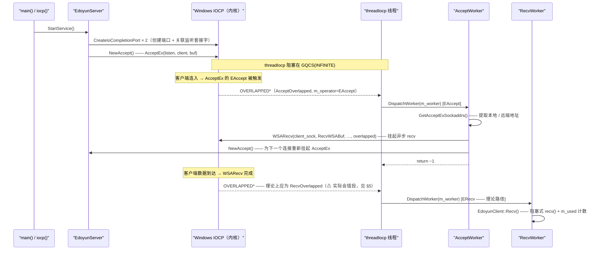

---
tags:
  - Remote Control System
  - cpp
  - windows
  - IOCP
  - WSARecv
  - recv
  - AcceptEx
git: "remoteCtrl 9ffe8b0"
created: 2026-04-14
updated: 2026-04-14
aliases:
  - 8.2 IOCP recv chain
  - 8.2 WSARecv
  - 8.2 IOCP 接收链
  - 8.2 AcceptWorker 接入 WSARecv
---

# 8.2 IOCP 接收链：AcceptWorker 接上 WSARecv

> **摘要**：提交 `9ffe8b0` 把 `AcceptWorker` 延伸成一条真正的接收起点：在提取完客户端地址后，立刻挂起异步 `WSARecv`。`EdoyunClient` 新增了独立的接收 / 发送 overlapped 对象（`m_recv`、`m_send`）以及基于 `WSABUF` 的缓冲区。`RecvOverlapped::RecvWorker()` 也终于有了实现，它会转调 `EdoyunClient::Recv()`。不过第 5 节也指出了 3 个结构性 bug，所以这条 recv 链虽然“接上了”，但运行时还不能真正稳定工作。

---

## 1. 本次提交改了什么

| 文件 | 变更 | 新增内容 |
|------|------|----------|
| `EdoyunServer.h` | +35 / −94 | `EdoyunOverlapped` 新增 `WSABUF m_wsabuffer`；`EdoyunClient` 新增 `RecvWSABuffer()`、`SendWSABuffer()`、`flags()`、`Recv()`、私有成员 `m_recv` / `m_send` / `m_used`；`RecvOverlapped::RecvWorker()` 得到实现；`RecvOverlapped::m_client` 被补上 |
| `EdoyunServer.cpp` | +121 / −4 | `AcceptWorker` 在 `GetAcceptExSockaddrs` 之后调用 `WSARecv`；新增 `RecvOverlapped` / `SendOverlapped` 构造函数；`setOverlapped` 把 recv + send 也接进来；`RecvWSABuffer()` / `SendWSABuffer()` 得到实现 |

**提交类型**：新功能（recv 链已经接上）。无需单独记录 Debug 日志。

---

## 2. 旧方案与新方案对比

![[图片/SVG/8.2-IOCP-Recv-Chain-—-AcceptWorker-Wires-WSARecv-01.svg|836]]

**关键行为差异**：
- **旧方案**（[[8.1 IOCP Server Architecture — EdoyunServer Initial Design|8.1]]）：`AcceptWorker` 只负责提取地址、重新挂起 `AcceptEx`，然后直接返回。被 accept 下来的客户端套接字从未拿到一个待完成的 recv，所以服务端在结构上就“听不见”客户端后续发送的数据。
- **新方案**：地址提取完成后，`AcceptWorker` 会先调用 `WSARecv` 给客户端套接字挂起一个异步 recv，再重新挂起 `AcceptEx`。当数据到达时，IOCP 会通知 `threadIocp`，理论上再分发到 `RecvWorker`。但当前实现还有 3 个 bug，会让这条链在实践中跑不通，见 §5。

---

## 3. 主流程

每个客户端现在会产生两次异步完成：第一次是 accept 完成，用来把 recv 挂起来；第二次是 recv 完成，用来触发 `RecvWorker`。`NewAccept()` 依然和 8.1 一样，在任意时刻只让内核里保留一个待完成的 `AcceptEx`。



**对比 [[8.1 IOCP Server Architecture — EdoyunServer Initial Design|8.1]]**：8.1 里的 `AcceptWorker` 在 `NewAccept()` 之后就直接返回，没有把 recv 挂起来；现在 `WSARecv` 被插进了“地址提取”和“重新挂起 AcceptEx”之间，于是同一个完成回调里就把接收链也接上了。

---

## 4. 核心实现

### 4.1 `AcceptOverlapped::AcceptWorker()`：Accept 完成后立刻挂起 `WSARecv`

```cpp
template<EdoyunOperator op>
int AcceptOverlapped<op>::AcceptWorker()
{
    INT lLength = 0, rLength = 0;

    // ===== 1. 防御判断：AcceptEx 出错时可能以 0 字节完成 =====
    if (*(LPDWORD)*m_client.get() > 0)
    {
        // ===== 2. 从 AcceptEx 的“双地址缓冲区”里拆出地址 =====
        // 布局和 GetAcceptExSockaddrs 的语义在
        // [[8.1 IOCP Server Architecture — EdoyunServer Initial Design|8.1]] §4.4 已经讲过，这里不重复。
        GetAcceptExSockaddrs(
            *m_client, 0,
            sizeof(sockaddr_in) + 16, sizeof(sockaddr_in) + 16,
            (sockaddr**)m_client->GetLocalAddr(), &lLength,
            (sockaddr**)m_client->GetRmoteAddr(), &rLength
        );

        // ===== 3. 挂起异步 WSARecv —— 把客户端状态切到“等待数据” =====
        // m_client->RecvWSABuffer()  →  &m_recv->m_wsabuffer  （RECVOVERLAPPED 的 WSABUF）
        // *m_client as LPDWORD       →  &m_received           （接收字节数输出）
        // &m_client->flags()         →  &m_flags              （WSA recv flags 输入/输出）
        // *m_client as LPOVERLAPPED  →  &m_overlapped->m_overlapped（⚠ 是 ACCEPT 的 overlapped，不是 RECV，见 §5）
        int ret = WSARecv(
            (SOCKET)*m_client,
            m_client->RecvWSABuffer(), 1,
            *m_client,
            &m_client->flags(),
            *m_client,   // 实际解析到 EdoyunClient::operator LPOVERLAPPED() → ACCEPT overlapped
            NULL
        );
        if (ret == SOCKET_ERROR && (WSAGetLastError() != WSA_IO_PENDING))
        {
            //TODO: error
        }

        // ===== 4. 重新挂起 AcceptEx —— 维持“内核里始终有一个待完成 accept” =====
        if (!m_server->NewAccept()) return -2;
    }
    return -1; // 返回负数，告诉 EdoyunThread 循环清空这个 worker 槽位
}
```

**职责**：完成 accept 握手（地址提取完毕）后，再做两件事：给已接受的客户端套接字挂一个异步 `WSARecv`，并给监听套接字再补发一个新的 `AcceptEx`。  
**输入**：`m_client`（由 `NewAccept` 预先填好的 `EdoyunClient` shared_ptr）、`m_server`（指回 `EdoyunServer` 的反向指针）。  
**风险**：这里传给 `WSARecv` 的 `OVERLAPPED` 指针是错的，详细见 §5 ⚠。这会让 recv 完成事件在 `threadIocp` 里被错误路由。

---

### 4.2 `RecvOverlapped::RecvOverlapped()`：构造函数

```cpp
template<EdoyunOperator op>
inline RecvOverlapped<op>::RecvOverlapped()
{
    // ===== 1. 设定操作类型，并绑定 worker 回调 =====
    m_operator = op;   // 实例化成 RECVOVERLAPPED 时，op = ERecv
    m_worker = ThreadWorker(this, (FUNCTYPE)&RecvOverlapped<op>::RecvWorker);

    // ===== 2. 把 OVERLAPPED 头清零 =====
    // 任何 WSA 重叠 I/O 之前，这一步都是必须的。
    memset(&m_overlapped, 0, sizeof(m_overlapped));

    // ===== 3. 分配 256 KB 内部缓冲区 =====
    m_buffer.resize(1024 * 256);
    // ⚠ 这里并没有初始化 m_wsabuffer.buf 和 .len。
    //   WSARecv 会把这个 WSABUF 当成写入目标；如果 .buf 没有初始化，
    //   收到的数据就会被写到一块随机地址上。
    //   完整影响见 §5 ⚠。
}
```

---

### 4.3 `RecvOverlapped::RecvWorker()`：完成回调

```cpp
template<EdoyunOperator op>
int RecvOverlapped<op>::RecvWorker()
{
    // ===== 转调 EdoyunClient::Recv() =====
    // EdoyunClient::Recv() 会再次调用阻塞式 recv()，把数据读进 m_buffer
    // （也就是客户端对象自己的 accept 阶段缓冲区，而不是 m_wsabuffer）。
    // 按正确的 IOCP 设计，WSARecv 完成后，数据本来就应该已经躺在
    // m_wsabuffer 里了，不需要再额外做一次 recv()。
    // 所以这里要么是过渡性简化，要么就是另一个设计疏漏。
    int ret = m_client->Recv();
    return ret;
}
```

**职责**：当 `threadIocp` 取到一个 `ERecv` 完成事件时，由它继续处理数据，把待处理字节读入缓冲区并推进使用量。  
**风险**：它在一个重叠套接字上再次调用阻塞式 `recv()`。如果当前并没有可立即读取的数据（例如 `WSABUF` 根本没初始化好，或者 recv 实际上没有正确挂起），这个线程池线程就会被无限期卡住。

---

### 4.4 `EdoyunClient`：新增的 Recv / Send 基础设施

这次有 3 处变化，让 `EdoyunClient` 终于能分别保存独立的 recv 和 send 操作：

```cpp
// ===== 新增的私有成员（EdoyunServer.h） =====
std::shared_ptr<RECVOVERLAPPED> m_recv;   // 每个 recv 都有自己独立的 OVERLAPPED + WSABUF
std::shared_ptr<SENDOVERLAPPED> m_send;   // 每个 send 都有自己独立的 OVERLAPPED + WSABUF
size_t m_used;  // 记录 m_buffer 里已经填入了多少字节

// ===== 新增的访问器 =====
LPWSABUF RecvWSABuffer();              // 返回 &m_recv->m_wsabuffer
LPWSABUF SendWSABuffer();              // 返回 &m_send->m_wsabuffer
DWORD& flags() { return m_flags; }    // WSARecv / WSASend 的 lpFlags 参数
```

```cpp
// ===== setOverlapped：现在会把 3 个 overlapped 全部接回客户端（EdoyunServer.cpp） =====
void EdoyunClient::setOverlapped(PCLIENT& ptr)
{
    // ===== 让每个 overlapped 都能反向拿到所属客户端 =====
    // 以前只有 m_overlapped（AcceptOverlapped）会被接好。
    // 现在 m_recv 和 m_send 也都保存了同一个 shared_ptr，
    // 这样它们各自的 worker 回调就能访问套接字、缓冲区和地址信息。
    m_overlapped->m_client = ptr;
    m_recv->m_client = ptr;
    m_send->m_client = ptr;
}
```

```cpp
// ===== EdoyunClient::Recv()：阻塞式 recv 路径（EdoyunServer.h） =====
int Recv()
{
    // ===== 从 m_buffer 当前已使用位置继续往后读 =====
    // m_buffer 是 EdoyunClient 构造函数里分配的 1 KB 缓冲区。
    // 它和 m_recv->m_wsabuffer（IOCP 那边真正面对 WSARecv 的缓冲区）不是同一个东西。
    int ret = recv(m_sock, m_buffer.data() + m_used, m_buffer.size() - m_used, 0);
    if (ret <= 0) return -1;
    m_used += (size_t)ret;
    // TODO: Analyze the data —— 解析 CPacket 头、提取命令
    return 0;
}
```

**为什么是 3 个 `shared_ptr`**：`AcceptEx`、`WSARecv`、`WSASend` 这三种重叠操作，都需要自己的 `OVERLAPPED` 结构，而且这个结构的地址必须稳定，这样 `threadIocp` 才能靠 `CONTAINING_RECORD` 准确还原出具体是哪种 overlapped 类型。它们最终共享的是同一个 `PCLIENT` 反向指针，用来访问同一套 socket 和缓冲区。

---

## 5. 结论

| 项目 | 状态 |
|------|------|
| `AcceptWorker` → `WSARecv` 挂起动作 | ✅ 已在地址提取后立刻接上 |
| `RecvOverlapped::RecvWorker()` | ✅ 已实现，会转调 `EdoyunClient::Recv()` |
| `setOverlapped` 把 `m_recv` 和 `m_send` 接回客户端 | ✅ 3 个 overlapped 都已经能关联到 client |
| `Recv()` 里的数据解析 | ❌ `// TODO: Analyze the data` |
| `SendWorker()` | ❌ `// TODO` 桩代码 |
| `ErrorWorker()` | ❌ `// TODO` 桩代码 |
| 优雅停机 | ❌ `EdoyunServer` 还没有停止路径 |
| **Bug**：`WSARecv` 把 `*m_client` 当成 `LPOVERLAPPED` 传进去，实际会解析到 `EdoyunClient::operator LPOVERLAPPED()`，也就是 `&m_overlapped->m_overlapped`（属于 `AcceptOverlapped`，`m_operator == EAccept`）。数据到达后，`threadIocp` 里的 `CONTAINING_RECORD` 会把它还原成 `AcceptOverlapped`，于是分发到 `AcceptWorker`，而不是 `RecvWorker`。这里应该传 `&m_recv->m_overlapped`。 | ⚠ `OVERLAPPED` 用错，recv 完成被错投到 `AcceptWorker` |
| **Bug**：`RecvOverlapped::RecvOverlapped()` 没有初始化 `m_wsabuffer.buf` / `.len`。而 `WSARecv` 恰恰会把这块 `WSABUF` 当成写入目标，所以收到的数据会被写到一块随机地址上。 | ⚠ `WSABUF` 未初始化，属于 UB，第一次 recv 就很可能崩 |
| **Bug**：`AcceptEx` 完成后，没有对新接受的套接字调用 `SO_UPDATE_ACCEPT_CONTEXT`。少了这一步，继承自监听套接字的上下文和 IOCP 关联并没有被正式建立，在某些 Windows 版本上，后续的重叠 I/O（包括 `WSARecv`）可能会静默失败。 | ⚠ 缺少 `SO_UPDATE_ACCEPT_CONTEXT` |

---

## 6. 本笔记新增的 Win32 / Winsock API

| API | 作用 | 关键点 |
|-----|------|--------|
| `WSARecv(sock, lpBuffers, dwBufferCount, lpBytesRecvd, lpFlags, lpOverlapped, NULL)` | 在重叠套接字上投递一个异步 recv；数据到达后，IOCP 会带着你传入的 `OVERLAPPED*` 发出完成通知 | `lpOverlapped` 必须指向 **recv overlapped 对象内部的那个 `OVERLAPPED`**。如果传成别的 `OVERLAPPED`（例如 accept 的那个），`threadIocp` 里的 `CONTAINING_RECORD` 就会还原出错误类型，并分发到错误的 worker |
| `setsockopt(sock, SOL_SOCKET, SO_UPDATE_ACCEPT_CONTEXT, (char*)&listenSock, sizeof(SOCKET))` | 让新接受的套接字继承监听套接字的上下文属性，包括 IOCP 相关状态 | 应该在 `AcceptWorker` 里、任何 `WSARecv` / `WSASend` 之前调用；缺少它时，部分 Windows 构建上的重叠 I/O 可能直接失败 |

---

## 7. 代码索引

| 符号 | 文件 | 角色 |
|------|------|------|
| `AcceptOverlapped<EAccept>::AcceptWorker()` | `EdoyunServer.cpp` | Accept 完成处理器；现在会在重新挂起 `AcceptEx` 之前先挂起 `WSARecv` |
| `RecvOverlapped<ERecv>::RecvOverlapped()` | `EdoyunServer.cpp` | 构造函数；分配 256 KB `m_buffer`（⚠ `m_wsabuffer` 仍未初始化） |
| `RecvOverlapped<ERecv>::RecvWorker()` | `EdoyunServer.h` | Recv 完成处理器；转调 `EdoyunClient::Recv()` |
| `SendOverlapped<ESend>::SendOverlapped()` | `EdoyunServer.cpp` | 构造函数；分配 256 KB `m_buffer`（`SendWorker` 仍是 TODO） |
| `EdoyunClient::RecvWSABuffer()` | `EdoyunServer.cpp` | 返回 `&m_recv->m_wsabuffer`，作为 `WSARecv` 的 `lpBuffers` |
| `EdoyunClient::SendWSABuffer()` | `EdoyunServer.cpp` | 返回 `&m_send->m_wsabuffer`，留给后续 `WSASend` 使用 |
| `EdoyunClient::flags()` | `EdoyunServer.h` | 返回 `m_flags` 的引用，作为 `WSARecv` 的 `lpFlags` |
| `EdoyunClient::Recv()` | `EdoyunServer.h` | 用阻塞式 `recv()` 读入 `m_buffer`，并推进 `m_used`；后续还要继续做协议解析 |
| `EdoyunClient::setOverlapped()` | `EdoyunServer.cpp` | 把 `m_overlapped`、`m_recv`、`m_send` 全部接回所属 `PCLIENT` |
| `EdoyunClient::m_used` | `EdoyunServer.h` | 记录多次 `Recv()` 之后 `m_buffer` 已填充的字节数 |
| `EdoyunOverlapped::m_wsabuffer` | `EdoyunServer.h` | 基类新增的 `WSABUF` 字段，`RecvWSABuffer()` / `SendWSABuffer()` 都靠它工作 |
