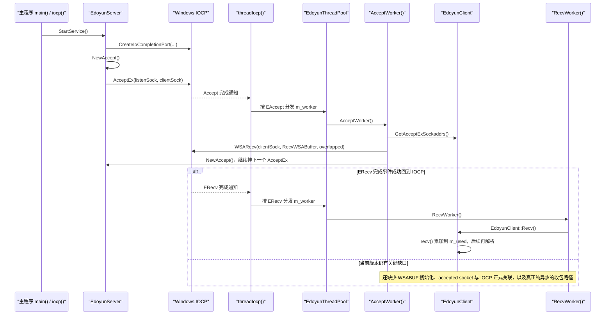

---
tags:
  - Remote Control System
  - cpp
  - windows
  - IOCP
  - network-server
  - WSARecv
  - AcceptEx
  - RecvOverlapped
git: "newremoteCtrl 9ffe8b0"
created: 2026-04-14
updated: 2026-04-14
aliases:
  - 8.2 IOCP 接收链路
  - 8.2 EdoyunServer recv
  - 8.2 AcceptEx 后接收
---

# 8.2 IOCP 接收链路补全：AcceptEx 后投递 WSARecv 与 RecvOverlapped

> **摘要**：这次提交把 [[8.1 IOCP Server Architecture — EdoyunServer Initial Design|8.1]] 中“只处理 `AcceptEx` 完成”的 IOCP 骨架，推进到了“`AcceptEx` 完成后立即投递 `WSARecv`，并让 `ERecv` 完成事件第一次拥有明确处理入口”的阶段。  
> `EdoyunClient` 开始真正持有接收相关状态：`m_recv`、`m_send`、`m_flags`、`m_used`，`setOverlapped()` 也从只绑定 accept 扩展为同时绑定 accept / recv / send。  
> 但一定要看清楚：这还不是成熟的 IOCP 收包闭环。当前实现里 `RecvWorker()` 最后仍回落到同步 `recv()`，`WSABUF` 的 `buf/len` 在这次提交里没有看到明确初始化，accepted socket 也没有看到重新关联到 IOCP 的代码。因此更准确的说法是：**接收链路已经接上线，但还没有彻底走稳。**

> **说明**：你指定的 gitid 是 `9ffe8b0`。公开镜像里能直接看到的 `newremoteCtrl` 同主题提交显示为另一枚 hash，但关键代码内容对应同一轮“recv 接线”演进；本文按 `9ffe8b0` 记述。

---

## 1. 本次提交推进了什么

对本章真正有解释价值的，主要还是 `EdoyunServer.cpp` 与 `EdoyunServer.h` 这两份源码。


| 文件 | 这次真正改了什么 | 对 8.2 的意义 |
|------|------------------|---------------|
| `EdoyunServer.cpp` | `AcceptWorker()` 中新增 `WSARecv(...)`；补出 `RecvOverlapped` / `SendOverlapped` 构造；`StartService()`、`threadIocp()` 从头文件挪到 `.cpp` | 让“接入完成 → 投递接收 → 等待下一次完成”的链路第一次成形 |
| `EdoyunServer.h` | `EdoyunOverlapped` 新增 `m_client` / `m_wsabuffer`；`EdoyunClient` 新增 `m_recv`、`m_send`、`m_flags`、`m_used`、`Recv()`、`RecvWSABuffer()` 等；`RecvWorker()` 不再是 `//TODO` | 让客户端对象开始真正承担“接收状态 + 接收入口”的职责 |

**这次提交的准确定位**：它不是“完整功能完成”，也不是“单纯 bug 修复”，而是一次非常典型的 **机制推进型提交**：把 8.1 里停在 `AcceptEx` 的架子，往真实的接收链路又推了一大步。

---

## 2. 与 8.1 的关系

[[8.1 IOCP Server Architecture — EdoyunServer Initial Design|8.1]] 已经做完了三件很重要的事：

1. 把 [[7.9 EdoyunThread Dispatch Model and IOCP Network Programming Bootstrap|7.9]] 里散落在 `iocp()` 函数中的骨架，收敛成 `EdoyunServer` 类。
2. 把 `AcceptEx`、`threadIocp()`、线程池派发等“服务器框架层”整理出来。
3. 让 `EAccept` 这条完成事件真正能跑起来。

但 8.1 仍然停在一个明显的空档上：

- **连接能接进来**
- **地址能取出来**
- **下一个 `AcceptEx` 也能继续挂上**
- **可是这个新连接之后要怎么开始收包，还没有真正接上**

8.2 的价值，正好就是把这条空档补上：

- 在 `AcceptWorker()` 里，连接一旦建立，马上就投递 `WSARecv`
- `EdoyunClient` 开始真正保存“这个连接的接收状态”
- `threadIocp()` 里原本就有的 `ERecv` 分支，终于第一次有机会接到真正的接收完成事件

所以本章的核心问题不是“服务器怎么启动”，而是：

> **新连接建立以后，接收链路到底是怎么第一次被接上的？**

---

## 3. 旧机制 vs 新机制、

![[8_2_IOCP_recv_flow_CN.svg|858]]
![[8.2 IOCP 接收链路演进.svg]]
![[图片/SVG/8.2-IOCP-Recv-Chain-—-AcceptWorker-Wires-WSARecv-01.svg|836]]

![[9ffe8b0_recv_commit_analysis.svg]]
直接看图，8.1 和 8.2 的本质差别只有一句话：

- **8.1**：完成了一次 accept，但没有把“这个 client 下一步怎么收包”继续交给内核
- **8.2**：在 `AcceptWorker()` 内立即补发 `WSARecv`，让接收完成事件第一次有了回到 `threadIocp()` 的机会

这就是“IOCP 接收链路补全”的真正含义。

---

## 4. 端到端主链路

下面这张 Mermaid 图，按时间顺序把 8.2 想做的事情串起来：



这张图最重要的不是最后那句 `recv()`，而是中间这一跳：

> **`AcceptWorker()` 现在不再只负责“收尾 AcceptEx”，还负责“把下一步接收请求投递出去”。**

一旦你看懂这点，就知道 8.2 相比 8.1 的阶段性突破到底在哪里。

---

## 5. 核心实现

### 5.1 `AcceptOverlapped<EAccept>::AcceptWorker()`：这次提交最关键的函数

下面是按项目真实代码加注释后的版本：

```cpp
template<EdoyunOperator op>
int AcceptOverlapped<op>::AcceptWorker()
{
    INT lLength = 0, rLength = 0;

    // ===== 1. 只有 AcceptEx 确实收到了连接，才继续后续链路 =====
    if (*(LPDWORD)*m_client.get() > 0)
    {
        // ===== 2. 从 AcceptEx 提供的缓冲区里拆出本地/远端地址 =====
        GetAcceptExSockaddrs(*m_client, 0,
            sizeof(sockaddr_in) + 16, sizeof(sockaddr_in) + 16,
            (sockaddr**)m_client->GetLocalAddr(), &lLength,
            (sockaddr**)m_client->GetRmoteAddr(), &rLength
        );

        // ===== 3. 这次提交最关键的一步：在新连接上立即投递一次 WSARecv =====
        int ret = WSARecv((SOCKET)*m_client, m_client->RecvWSABuffer(), 1,
            *m_client, &m_client->flags(), *m_client, NULL);

        // ===== 4. 对 overlapped I/O 来说，WSA_IO_PENDING 表示“请求已经交给内核” =====
        if (ret == SOCKET_ERROR && (WSAGetLastError() != WSA_IO_PENDING))
        {
            // TODO: error
        }

        // ===== 5. 再补挂一个 AcceptEx，保证服务器继续接下一个连接 =====
        if (!m_server->NewAccept())
        {
            return -2;
        }
    }
    return -1;
}
```

**这段代码在整个系统里的职责**很明确：  
它不再只是“接入完成后的收尾函数”，而是变成了 **accept 与 recv 之间的桥接点**。

这也是 8.2 的关键设计变化：

- **8.1 的 `AcceptWorker()`** 只做两件事：取地址、继续挂下一个 `AcceptEx`
- **8.2 的 `AcceptWorker()`** 在这两步之间又插入了一件更关键的事：**给新连接投递第一次 `WSARecv`**

从系统层面理解，这意味着：

1. `AcceptEx` 负责“把连接接进来”
2. `AcceptWorker()` 负责“把这个连接切换到接收阶段”
3. 后面的 `threadIocp()` / `ERecv` / `RecvWorker()` 才有机会真正参与

也就是说，**8.2 第一次把“接入阶段”和“收包阶段”连在了一起**。

---

### 5.2 `RecvOverlapped` 与 `EdoyunClient::Recv()`：接收入口终于不再是 TODO

先看这次新增或补全的关键代码：

```cpp
template<EdoyunOperator op>
inline RecvOverlapped<op>::RecvOverlapped()
{
    m_operator = op;
    m_worker = ThreadWorker(this, (FUNCTYPE)&RecvOverlapped<op>::RecvWorker);
    memset(&m_overlapped, 0, sizeof(m_overlapped));
    m_buffer.resize(1024 * 256);
}

int RecvWorker()
{
    int ret = m_client->Recv();
    return ret;
}

int Recv()
{
    int ret = recv(m_sock, m_buffer.data() + m_used, m_buffer.size() - m_used, 0);
    if (ret <= 0) return -1;
    m_used += (size_t)ret;
    // TODO: Analyze the data
    return 0;
}
```

这段代码说明了两件事。

**第一，`ERecv` 分支终于开始有“真正要执行的东西”了。**

在 8.1 里，`threadIocp()` 的 `switch (m_operator)` 其实已经为 `ERecv` 预留了分支，但当时 `RecvWorker()` 还是一个空壳。  
到了 8.2，这个空壳第一次被接到 `EdoyunClient::Recv()` 上，意味着：

- `ERecv` 不再只是架构预留位
- 它开始拥有真实的“收包入口”

**第二，这个入口仍然是过渡态，不是最终态。**

这里最值得警惕的一点是：

- 表面上用了 `WSARecv`
- 但真正进入 `RecvWorker()` 后，又调用了同步 `recv()`

这说明当前版本还没有把“重叠 I/O 完成通知”与“实际数据缓冲管理”彻底统一起来。  
所以 8.2 的准确定位应该是：

> **接收事件的调度入口开始成立，但真正成熟的 IOCP 收包模型还没有定型。**

---

### 5.3 `EdoyunClient`：客户端对象开始真正承担接收状态

8.2 里另一个非常关键的变化，是 `EdoyunClient` 不再只是“一个被 accept 出来的 socket 外壳”，而是开始承担接收链路所需的状态与对象。

```cpp
EdoyunClient::EdoyunClient()
    :m_isbusy(false), m_flags(0),
    m_overlapped(new ACCEPTOVERLAPPED()),
    m_recv(new RECVOVERLAPPED()),
    m_send(new SENDOVERLAPPED())
{
    m_sock = WSASocket(PF_INET, SOCK_STREAM, 0, NULL, 0, WSA_FLAG_OVERLAPPED);
    m_buffer.resize(1024);
    memset(&m_laddr, 0, sizeof(m_laddr));
    memset(&m_raddr, 0, sizeof(m_raddr));
}

void EdoyunClient::setOverlapped(PCLIENT& ptr)
{
    m_overlapped->m_client = ptr;
    m_recv->m_client = ptr;
    m_send->m_client = ptr;
}

LPWSABUF RecvWSABuffer()
{
    return &m_recv->m_wsabuffer;
}

DWORD& flags() { return m_flags; }
```

这段代码说明项目设计已经明显往“**一个 client 对应一组收发状态对象**”的方向走了。

可以把它理解成下面这层关系：

- `EdoyunClient` 持有 socket、本地/远端地址、主数据缓冲区
- `ACCEPTOVERLAPPED` 负责接入完成
- `RECVOVERLAPPED` 负责接收完成
- `SENDOVERLAPPED` 预留给发送完成
- `setOverlapped()` 负责把这些 overlapped 对象都回绑到同一个 `PCLIENT`

这一步非常重要，因为它解决了一个架构问题：

> **当某个完成事件回到线程池时，处理函数如何重新找到“它到底属于哪个 client”？**

8.2 给出的答案就是：  
**把 `PCLIENT` 明确放进 overlapped 对象里，并在 client 构造阶段把几类 overlapped 全部绑好。**

这是后面继续做收发、断线、资源回收时的基础。

---

## 6. Win32 / Winsock 关键机制

本章不再重复 8.1 里已经讲过的整体启动流程，而是只抓 8.2 新增的 API 语义。

| API / 机制 | 在 8.2 里扮演什么角色 | 学习时最该注意什么 |
|------------|------------------------|--------------------|
| `AcceptEx` | 异步接入新连接 | 它只是“把连接接进来”，并不等于后续接收链路已经自然成立 |
| `GetAcceptExSockaddrs` | 从 AcceptEx 缓冲区里解析地址 | 这是 accept 完成后的地址整理步骤，不负责真正收包 |
| `WSARecv` | 把一次接收请求交给内核 | 返回 `SOCKET_ERROR` 且错误码为 `WSA_IO_PENDING` 时，通常表示“异步请求已成功挂起” |
| `GetQueuedCompletionStatus` | 从 IOCP 取回某次异步完成 | 它返回的是“某个 overlapped 操作完成了”，不是自动替你解析协议 |
| `recv` | 当前版本里仍被 `RecvWorker()` 调用 | 放在这里说明项目还处在过渡期，真正纯 IOCP 化的接收处理还没完全统一 |

对初学者来说，这一章最容易混淆的一点是：

> **“我已经调了 `WSARecv`” 不等于 “我的收包模型已经完整了”。**

真正完整的 IOCP 收包模型，至少还要同时满足这些条件：

- 接收缓冲区对象是正确初始化的
- client socket 的完成事件会稳定回到同一个 IOCP
- 完成事件回来后，处理逻辑不再偷偷回退到同步 `recv()`
- 数据分包、粘包、协议解析、再次投递下一次接收，都有稳定流程

8.2 明显还没有全部做到，但它已经把第一根主线拉起来了。

---

## 7. 当前版本尚未闭环的点

这一节非常重要，因为它决定你以后调试时会不会走弯路。

### 7.1 `WSABUF` 在这次提交里没有看到明确初始化

代码里虽然新增了：

```cpp
WSABUF m_wsabuffer;
LPWSABUF RecvWSABuffer() { return &m_recv->m_wsabuffer; }
```

但在这次提交涉及的构造函数里，只看到了：

- `memset(&m_overlapped, 0, sizeof(m_overlapped));`
- `m_buffer.resize(1024 * 256);`

并没有看到类似下面这样的初始化：

```cpp
m_wsabuffer.buf = m_buffer.data();
m_wsabuffer.len = (ULONG)m_buffer.size();
```

这意味着 `WSARecv` 拿到的 `WSABUF` 很可能还没有进入可靠可用状态。  
这是当前版本最值得优先警惕的实现缺口之一。

### 7.2 在这次提交里，没有看到 accepted socket 被重新关联到 IOCP

`StartService()` 里能看到的是监听 socket 被关联到 `m_hIOCP`：

```cpp
CreateIoCompletionPort((HANDLE)m_sock, m_hIOCP, (ULONG_PTR)this, 0);
```

但在这次提交涉及的 `NewAccept()` / `AcceptWorker()` 代码里，没有看到对 `*pClient` 或 `*m_client` 再次执行 `CreateIoCompletionPort((HANDLE)clientSocket, ...)`。

这会带来一个非常现实的问题：

> **即使你投递了 `WSARecv`，这个 client socket 的后续完成事件能不能稳定回到当前 IOCP，代码里暂时看不出来。**

所以 8.2 的图里我才会把它写成“接收链路已经接线，但还没彻底走稳”。

### 7.3 `RecvWorker()` 里最终仍调用同步 `recv()`

从设计味道上看，这说明当前版本还处在“半异步、半过渡”的阶段。

也就是说：

- 外层事件调度已经在往 IOCP 模式靠
- 但真正处理数据的地方，还没有完全变成“围绕完成事件与缓冲区状态展开”的纯异步模型

这不是说它一定完全不能工作，而是说：

> **它还不是最终想要的那个 IOCP 接收架构。**

这个判断非常重要，因为它会影响你后续写协议解析、断线回收、再次投递 `WSARecv` 的位置。

### 7.4 `m_used` 在构造函数初始化列表里没有看到初始化

`Recv()` 里直接用了：

```cpp
m_buffer.data() + m_used
m_buffer.size() - m_used
```

但构造函数初始化列表里有：

- `m_isbusy(false)`
- `m_flags(0)`
- `m_overlapped(...)`
- `m_recv(...)`
- `m_send(...)`

却没有看到 `m_used(0)`。

这会导致第一次 `Recv()` 时，`m_used` 的初值不明确，轻则读写偏移异常，重则直接造成非常难查的内存访问问题。  
从调试优先级看，这也是应该最早补上的一个点。

---

## 8. 当前版本的准确结论

读完整个 9ffe8b0 后，我认为这次提交最准确的结论有四条：

1. **它已经不是“只有 AcceptEx 的骨架”了。**  
   新连接建立后，代码开始主动投递第一次 `WSARecv`。

2. **`ERecv` 分支第一次拥有了真实处理入口。**  
   `RecvOverlapped` 与 `EdoyunClient::Recv()` 之间的桥已经搭起来了。

3. **它仍然是过渡态实现，而不是完整成品。**  
   `WSABUF` 初始化、client socket 的 IOCP 关联、同步 `recv()` 回退、协议解析等问题都还在。

4. **从学习顺序上看，这一版非常有价值。**  
   因为它刚好处在“从 accept 骨架过渡到真实 recv 链路”的关键阶段，最适合用来理解 IOCP 服务器是怎样一步步长出来的。

所以，给这章取名为“**IOCP 接收链路补全**”是合适的；  
如果把它写成“**IOCP 收包完全实现**”，那就会把现状写过头。

---

## 9. 代码索引

### 本章重点文件

- `RemoteCtrl/RemoteCtrl/EdoyunServer.cpp`
- `RemoteCtrl/RemoteCtrl/EdoyunServer.h`

### 本章重点函数 / 成员

- `AcceptOverlapped<EAccept>::AcceptWorker()`
- `RecvOverlapped<ERecv>::RecvWorker()`
- `EdoyunClient::Recv()`
- `EdoyunClient::setOverlapped()`
- `EdoyunClient::RecvWSABuffer()`
- `EdoyunClient::flags()`
- `EdoyunServer::threadIocp()`
- `EdoyunServer::NewAccept()`

### 推荐连读顺序

1. 先读 [[7.9 EdoyunThread Dispatch Model and IOCP Network Programming Bootstrap|7.9]]
2. 再读 [[8.1 IOCP Server Architecture — EdoyunServer Initial Design|8.1]]
3. 最后读本章 8.2

这样你会很容易看出来：

- 7.9 解决的是“IOCP 骨架有没有”
- 8.1 解决的是“服务器类与 Accept 链路能不能立住”
- 8.2 解决的是“Accept 完成之后，接收链路第一次怎么被接上”

---

## 10. 更新记录

- **2026-04-14**：基于 `newremoteCtrl 9ffe8b0` 补写 8.2，主题为 `AcceptEx` 之后的 `WSARecv` 投递与 `RecvOverlapped` 接线。
