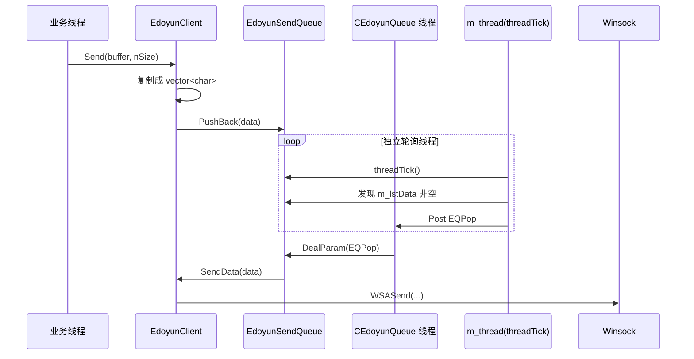
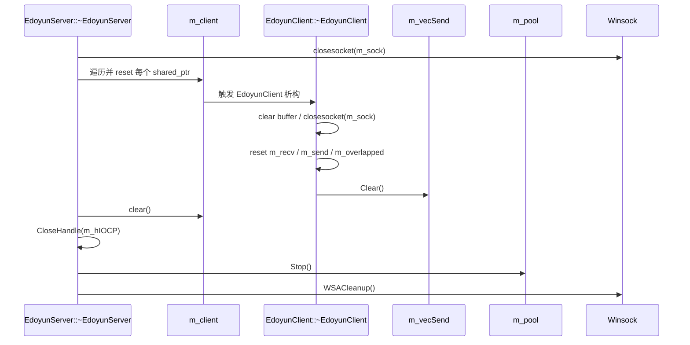

---
tags:
  - Remote Control System
  - cpp
  - windows
  - IOCP
  - network-server
  - send-queue
  - thread-pool
  - WSASend
  - VLD
git: "newremoteCtrl 08e2ca6"
git_msg: "1. Solve the compilation issue 2. Resolve the crash issue 3. Address the memory leak issue (introduce vld)"
created: 2026-04-17
updated: 2026-04-17
aliases:
  - 8.3 EdoyunSendQueue
  - 8.3 发送队列与所有权收口
  - 8.3 VLD 接入
---

# 8.3 EdoyunSendQueue 发送队列雏形、所有权收口与 VLD 接入

> **总结**：提交 `08e2ca6` 不是单纯把几个编译错误补掉，而是把 `EdoyunServer` 这条 IOCP 服务器线往“能编译、少崩溃、开始能查泄漏”的方向推进了一步。  
> 这一版最关键的三个变化是：  
> **第一**，`CEdoyunQueue<T>` 被改成可继承基类，并派生出 `EdoyunSendQueue<T>`，发送开始有了“先排队，再尝试发送”的后台模型。  
> **第二**，`EdoyunOverlapped` 不再持有 `PCLIENT`，而只借用 `EdoyunClient*`，真正的对象所有权统一收口到 `EdoyunServer::m_client`。  
> **第三**，`EdoyunThread` 修正了 7.9 里最明显的线程有效性判断问题，同时项目接入了 VLD（Visual Leak Detector），内存泄漏第一次开始变成可观测问题。  
> 但这还不是“发送链路已经完整闭环”的版本：`SendData()` 还没有把排队出来的 `data` 真正绑定到 `WSABUF`，`Recv()` 仍然走同步 `recv()`，而且 `EdoyunSendQueue` 内部还埋着新的死锁和竞态风险。

> 关联笔记：[[7.5 Lock-Free Queue Based on Completion Port]] · [[7.9 EdoyunThread Dispatch Model and IOCP Network Programming Bootstrap]] · [[8.1 IOCP Server Architecture — EdoyunServer Initial Design]]

---

## 1. 本次提交推进了什么

对比上一公开线 `7c13dc1 -> 08e2ca6`，这次一共改了 10 个文件，真正驱动 8.3 主线的主要是下面几组：

| 文件 | 变化方向 | 这次真正推进的点 |
|---|---|---|
| `CEdoyunQueue.h` | 大改 | `CEdoyunQueue<T>` 改成可继承基类，新增 `EdoyunSendQueue<T>` |
| `EdoyunServer.h` / `EdoyunServer.cpp` | 大改 | `EdoyunClient` 接入发送队列，`EdoyunOverlapped::m_client` 改成借用指针，`EdoyunServer` 新增析构和显式释放 |
| `EdoyunThread.h` | 继续修正 | `IsValid()` 语义从 7.9 的错误判定改回 `WAIT_TIMEOUT = 线程仍在运行`，`m_worker` 改成 `atomic<ThreadWorker*>` |
| `RemoteCtrl/framework.h` / `RemoteCtrl.vcxproj` / manifest | 调试支撑 | 接入 VLD，用来观察泄漏 |
| `RemoteClient.vcxproj` / `RemoteClientDlg.cpp` | 联调便利性 | 客户端切到 `MultiByte`，默认地址改到 `127.0.0.1`，方便本机测试 |

这说明 `08e2ca6` 是一个很典型的 **mixed commit**：  
既在补 **编译 / 崩溃 / 泄漏观测**，也在继续往前推进 **发送队列与对象生命周期结构**。

---

## 2. 与上一版的关系

如果说 [[8.1 IOCP Server Architecture — EdoyunServer Initial Design]] 的重点是把 `EdoyunServer + IOCP + threadIocp + typed overlapped` 这个服务器骨架立起来，那么 8.3 做的事情更像是一次“结构收口”：

1. **发送不再准备直接裸调 `WSASend`**，而是先引入 `EdoyunSendQueue<std::vector<char>>`，把“业务线程发起发送”和“真正尝试发送”拆成两步。
2. **overlapped 对客户端对象不再拥有所有权**。以前 `AcceptOverlapped` / `RecvOverlapped` / `SendOverlapped` 内部保存的是 `PCLIENT`，现在只剩 `EdoyunClient*` 借用指针，真正拥有者统一是 `EdoyunServer::m_client`。
3. **线程有效性、析构释放、泄漏观测开始被正式纳入设计考虑**。这也是为什么这一版虽然功能没有完全做完，但工程稳定性明显比 8.1 更像“真实工程代码”。

下面这张 SVG 先把 8.1 到 8.3 的大方向变化拉平看一遍。

![[8.3_architecture_comparison.svg]]

---

## 3. 新的静态架构与所有权结构

8.3 最重要的变化不是某一个单独 API，而是 **“谁拥有对象、谁只是借用对象”** 被重新分清了。

- `EdoyunServer::m_client` 现在是客户端对象的**真正拥有者**。
- `EdoyunClient` 作为客户端包装对象，**拥有**三个 overlapped 成员和一个发送队列成员。
- `AcceptOverlapped / RecvOverlapped / SendOverlapped` 不再保存 `shared_ptr`，只保存 `EdoyunClient*` 借用指针。
- `EdoyunSendQueue` 自己内部又带了一条 `EdoyunThread`，并通过 `m_base + m_callback` 反向回调 `EdoyunClient::SendData()`。

也就是说，8.3 试图把“资源真正归谁管”和“执行时临时引用谁”分成两层。

![[8.3_ownership_structure.svg]]

---

## 4. 线程与时序链路

### 4.1 发送路径：先入队，再尝试发包



这条链路的设计意图很明确：  
**把“业务代码说我要发”** 和 **“真正触发 WSASend”** 分开。  
这样以后不管是限速、重试、半包发送、发送状态机，理论上都可以挂在 `EdoyunSendQueue` 这一层，而不是让每个业务点都直接碰 socket。

### 4.2 释放路径：Server 先清 map，Client 再析构成员



这条链路说明 8.3 已经开始认真处理“对象离场顺序”。  
但它还不是一个完全安全的释放顺序，因为当前代码里 **`CloseHandle(m_hIOCP)` 发生在 `m_pool.Stop()` 之前**，这对仍然可能阻塞在 `GetQueuedCompletionStatus` 的线程来说并不稳，后面会在 pitfalls 里展开。

---

## 5. 核心实现

### 5.1 `EdoyunThread` —— 从 7.9 的错误判定往前修一层

下面这段代码最值得关注的不是“多了个线程类”，而是它终于开始把“线程还活着”和“线程已经退出”分开判断了。

```cpp
class EdoyunThread
{
public:
    EdoyunThread()
    {
        // ===== 1. 初始状态 =====
        // 这一版新增了 m_bStatus = false 和 m_worker.store(NULL)，
        // 不再像 7.9 那样把未初始化状态直接带进线程生命周期。
        m_hThread = NULL;
        m_bStatus = false;
        m_worker.store(NULL);
    }

    bool Start()
    {
        // ===== 2. 先设运行标记，再启动线程 =====
        m_bStatus = true;
        m_hThread = (HANDLE)_beginthread(&EdoyunThread::ThreadEntry, 0, this);

        // ===== 3. 启动后立刻校验线程句柄状态 =====
        // 这里的语义和 7.9 最大不同：IsValid() 不再把 WAIT_OBJECT_0
        // 误判成“线程还活着”。
        if (!IsValid())
        {
            m_bStatus = false;
        }
        return m_bStatus;
    }

    bool IsValid()
    {
        if (m_hThread == NULL || (m_hThread == INVALID_HANDLE_VALUE))
            return false;

        // ===== 4. 关键修正 =====
        // WAIT_TIMEOUT 代表句柄尚未 signaled，也就是线程还在运行。
        return WaitForSingleObject(m_hThread, 0) == WAIT_TIMEOUT;
    }

    bool Stop()
    {
        if (m_bStatus == false)
            return true;

        // ===== 5. 先通知线程退出，再等 1 秒 =====
        m_bStatus = false;
        DWORD ret = WaitForSingleObject(m_hThread, 1000);

        // ===== 6. 超时后硬终止 =====
        // 这是一个“先让它别卡死”的工程化处理，但并不优雅。
        if (ret == WAIT_TIMEOUT)
        {
            TerminateThread(m_hThread, -1);
        }

        // ===== 7. 清掉当前 worker 指针 =====
        UpdateWorker();
        return ret == WAIT_OBJECT_0;
    }

    void UpdateWorker(const ::ThreadWorker& worker = ::ThreadWorker())
    {
        // ===== 8. 如果当前保存的是旧任务对象，先删掉 =====
        if (m_worker.load() != NULL && (m_worker.load() != &worker))
        {
            ::ThreadWorker* pWorker = m_worker.load();
            m_worker.store(NULL);
            delete pWorker;
        }

        // ===== 9. 避免重复写入同一地址 =====
        if (m_worker.load() == &worker)
            return;

        // ===== 10. 空 worker 表示清槽 =====
        if (!worker.IsValid())
        {
            m_worker.store(NULL);
            return;
        }

        // ===== 11. 保存一份新的任务副本 =====
        m_worker.store(new ::ThreadWorker(worker));
    }

private:
    virtual void ThreadWorker()
    {
        // ===== 12. 线程主循环 =====
        while (m_bStatus)
        {
            if (m_worker.load() == NULL)
            {
                Sleep(1);
                continue;
            }

            ::ThreadWorker worker = *m_worker.load();
            if (worker.IsValid())
            {
                // ===== 13. 再次确认线程尚未退出 =====
                if (WaitForSingleObject(m_hThread, 0) == WAIT_TIMEOUT)
                {
                    int ret = worker();

                    if (ret != 0)
                    {
                        CString str;
                        str.Format(_T("thread found warning code %d\r\n"), ret);
                        OutputDebugString(str);
                    }

                    // ===== 14. 负值返回视为“该任务结束” =====
                    if (ret < 0)
                    {
                        m_worker.store(NULL);
                    }
                }
            }
            else
            {
                Sleep(1);
            }
        }
    }

    static void ThreadEntry(void* arg)
    {
        EdoyunThread* thiz = (EdoyunThread*)arg;
        if (thiz)
        {
            thiz->ThreadWorker();
        }
        _endthread();
    }

private:
    HANDLE m_hThread;
    bool m_bStatus;
    std::atomic<::ThreadWorker*> m_worker;
};
```

**整体职责**：`EdoyunThread` 不是普通“一次性线程函数包装器”，它更像一个**长期存活、可热切换任务的执行槽位**。  

**系统意义**：  
在 7.9 里，项目已经提出了“线程抽象 + worker 分发”这个方向，但当时 `IsValid()` 把 `WAIT_OBJECT_0` 当成线程仍在运行，导致刚启动线程就可能被判成无效。这一版最重要的修正，就是终于承认 **`WAIT_TIMEOUT` 才表示线程尚未退出**。  

不过，这段代码还远远没到“成熟线程池”的程度：

- `Stop()` 里直接调用 `TerminateThread`，只是为了避免卡死，不是理想的协作式退出。
- `UpdateWorker()` 改成了 `atomic<ThreadWorker*>`，但生命周期管理完全靠手工 `new/delete`，并不轻松。
- 线程主循环里调用 `WaitForSingleObject(m_hThread, 0)` 去判断自己是否活着，这在语义上也比较别扭。

也就是说，8.3 只是把 7.9 最明显的 bug 往前修了一层，还没把线程抽象做成最终版。

---

### 5.2 `CEdoyunQueue<T>` → `EdoyunSendQueue<T>` —— 从通用队列走向“发送队列子类”

8.3 里 `CEdoyunQueue<T>` 最大的结构变化，是它不再自己把 `DealParam()` 固定死了，而是把这件事交给子类去定制。于是 `EdoyunSendQueue<T>` 才有机会出现。

```cpp
template<class T>
class CEdoyunQueue
{
public:
    CEdoyunQueue()
    {
        // ===== 1. 依旧是 IOCP 纯队列模型 =====
        m_lock = false;
        m_hCompletionPort = CreateIoCompletionPort(INVALID_HANDLE_VALUE, NULL, NULL, 1);
        m_hThread = INVALID_HANDLE_VALUE;

        if (m_hCompletionPort != NULL)
        {
            m_hThread = (HANDLE)_beginthread(
                &CEdoyunQueue<T>::threadEntry,
                0, this);
        }
    }

    virtual ~CEdoyunQueue()
    {
        // ===== 2. 基类析构改成 virtual =====
        // 这是 8.3 非常关键的一个工程化修正：
        // 以后子类（比如 EdoyunSendQueue）通过基类指针析构时，才能完整释放。
        if (m_lock) return;
        m_lock = true;
        PostQueuedCompletionStatus(m_hCompletionPort, 0, NULL, NULL);
        WaitForSingleObject(m_hThread, INFINITE);

        if (m_hCompletionPort != NULL)
        {
            HANDLE hTemp = m_hCompletionPort;
            m_hCompletionPort = NULL;
            CloseHandle(hTemp);
        }
    }

    bool PushBack(const T& data)
    {
        IocpParam* pParam = new IocpParam(EQPush, data);
        if (m_lock)
        {
            delete pParam;
            return false;
        }

        bool ret = PostQueuedCompletionStatus(
            m_hCompletionPort, sizeof(PPARAM), (ULONG_PTR)pParam, NULL);

        if (ret == false)
            delete pParam;
        return ret;
    }

protected:
    // ===== 3. 改成纯虚函数 =====
    // 基类只保留“排队和线程模型”，具体 push/pop/clear 到底怎么处理，
    // 交给子类。
    virtual void DealParam(PPARAM* pParam) = 0;

    virtual void threadMain()
    {
        DWORD dwTransferred = 0;
        PPARAM* pParam = NULL;
        ULONG_PTR CompletionKey = 0;
        OVERLAPPED* pOverlapped = NULL;

        while (GetQueuedCompletionStatus(
            m_hCompletionPort,
            &dwTransferred,
            &CompletionKey,
            &pOverlapped,
            INFINITE))
        {
            if ((dwTransferred == 0) || (CompletionKey == NULL))
            {
                printf("thread is prepare to exit!\r\n");
                break;
            }

            pParam = (PPARAM*)CompletionKey;
            DealParam(pParam);
        }

        while (GetQueuedCompletionStatus(
            m_hCompletionPort,
            &dwTransferred,
            &CompletionKey,
            &pOverlapped, 0))
        {
            if ((dwTransferred == 0) || (CompletionKey == NULL))
            {
                printf("thread is prepare to exit!\r\n");
                continue;
            }

            pParam = (PPARAM*)CompletionKey;
            DealParam(pParam);
        }

        HANDLE hTemp = m_hCompletionPort;
        m_hCompletionPort = NULL;
        CloseHandle(hTemp);
    }

protected:
    std::list<T> m_lstData;
    HANDLE m_hCompletionPort;
    HANDLE m_hThread;
    std::atomic<bool> m_lock;
};

template<class T>
class EdoyunSendQueue : public CEdoyunQueue<T>, public ThreadFuncBase
{
public:
    typedef int (ThreadFuncBase::* EDYCALLBACK)(T& data);

    EdoyunSendQueue(ThreadFuncBase* obj, EDYCALLBACK callback)
        : CEdoyunQueue<T>(), m_base(obj), m_callback(callback)
    {
        // ===== 4. 除了基类自己的 queue 线程，再多起一条 m_thread =====
        // 这条线程不直接处理队列，而是周期性 tick。
        m_thread.Start();
        m_thread.UpdateWorker(
            ::ThreadWorker(this, (FUNCTYPE)&EdoyunSendQueue<T>::threadTick));
    }

    virtual ~EdoyunSendQueue()
    {
        m_base = NULL;
        m_callback = NULL;
        m_thread.Stop();
    }

protected:
    bool PopFront()
    {
        // ===== 5. PopFront 不再是“同步取值” =====
        // 这里直接往同一个 IOCP 队列里投递 EQPop 请求，
        // 真正弹出动作还是在基类线程里做。
        typename CEdoyunQueue<T>::IocpParam* Param =
            new typename CEdoyunQueue<T>::IocpParam(CEdoyunQueue<T>::EQPop, T());

        if (CEdoyunQueue<T>::m_lock)
        {
            delete Param;
            return false;
        }

        bool ret = PostQueuedCompletionStatus(
            CEdoyunQueue<T>::m_hCompletionPort,
            sizeof(Param),
            (ULONG_PTR)Param,
            NULL);

        if (ret == false)
        {
            delete Param;
            return false;
        }
        return ret;
    }

    int threadTick()
    {
        // ===== 6. 这条额外线程只负责“发现有数据就触发一次 EQPop” =====
        if (WaitForSingleObject(CEdoyunQueue<T>::m_hThread, 0) != WAIT_TIMEOUT)
            return 0;

        if (CEdoyunQueue<T>::m_lstData.size() > 0)
        {
            PopFront();
        }
        return 0;
    }

    virtual void DealParam(typename CEdoyunQueue<T>::PPARAM* pParam) override
    {
        switch (pParam->nOperator)
        {
        case CEdoyunQueue<T>::EQPush:
            CEdoyunQueue<T>::m_lstData.push_back(pParam->Data);
            delete pParam;
            break;

        case CEdoyunQueue<T>::EQPop:
            if (CEdoyunQueue<T>::m_lstData.size() > 0)
            {
                pParam->Data = CEdoyunQueue<T>::m_lstData.front();

                // ===== 7. 回调真正的宿主对象（这里是 EdoyunClient）=====
                if ((m_base->*m_callback)(pParam->Data) == 0)
                    CEdoyunQueue<T>::m_lstData.pop_front();
            }
            delete pParam;
            break;

        case CEdoyunQueue<T>::EQSize:
            pParam->nOperator = CEdoyunQueue<T>::m_lstData.size();
            if (pParam->hEvent != NULL)
                SetEvent(pParam->hEvent);
            break;

        case CEdoyunQueue<T>::EQClear:
            CEdoyunQueue<T>::m_lstData.clear();
            delete pParam;
            break;
        }
    }

private:
    ThreadFuncBase* m_base;
    EDYCALLBACK m_callback;
    EdoyunThread m_thread;
};
```

**整体职责**：  
`CEdoyunQueue<T>` 现在只负责“IOCP 队列骨架 + 线程骨架”，而 `EdoyunSendQueue<T>` 才真正决定“这个队列是拿来干什么的”。  

**系统意义**：  
这一步非常关键，因为它把原来 7.x 那套“线程安全队列实验”第一次真正嫁接到了网络发送链路里。以前 `CEdoyunQueue<T>` 只是一个并发实验品；到 8.3，它终于被用来承接真实业务 —— 也就是发送缓冲排队。

**但这里埋了三个很大的风险**：

1. `threadTick()` 直接在额外线程里读 `m_lstData.size()`，而 `m_lstData` 真正修改发生在基类 queue 线程里，这里没有额外同步。
2. `PopFront()` 里 `sizeof(Param)` 取到的是**指针大小**，不是结构体大小，只是刚好当前代码并不真正使用这个 `dwTransferred`。
3. 最大的问题是：`DealParam(EQPop)` 在基类 queue 线程里同步调用 `SendData()`，而 `SendData()` 里面又会反过来调用 `m_vecSend.Size()`，这会向**同一个 completion port** 再投递一个 `EQSize` 并等待结果，形成自锁。后面 pitfalls 里会单独说。

也就是说，8.3 把“发送先排队”这个架子搭出来了，但并没有把队列回调闭环做安全。

---

### 5.3 `EdoyunClient::Send()` / `SendData()` —— 发送入口有了，但真正 payload 还没接上

```cpp
int EdoyunClient::Send(void* buffer, size_t nSize)
{
    // ===== 1. 先复制一份用户数据 =====
    // 这样调用者返回以后，发送层仍然有自己的数据副本。
    std::vector<char> data(nSize);
    memcpy(data.data(), buffer, nSize);

    // ===== 2. 把数据压进发送队列 =====
    // 成功只代表“已经入队”，不代表已经发出。
    if (m_vecSend.PushBack(data))
    {
        return 0;
    }
    return -1;
}

int EdoyunClient::SendData(std::vector<char>& data)
{
    // ===== 3. 当前实现只是“准备尝试发”，还没把 data 真正绑定到 WSABUF =====
    if (m_vecSend.Size() > 0)
    {
        int ret = WSASend(
            m_sock,
            SendWSABuffer(),
            1,
            &m_received,
            m_flags,
            &m_send->m_overlapped,
            NULL);

        if (ret != 0 && (WSAGetLastError() != WSA_IO_PENDING))
        {
            CEdoyunTool::ShowError();
            return -1;
        }
    }
    return 0;
}
```

**整体职责**：  
`Send()` 负责接收业务数据并把它们变成队列元素；`SendData()` 才是“真正试图进入 Winsock 发送层”的地方。  

**系统意义**：  
这说明 8.3 试图把发送做成一个两段式模型：

- 前段：业务线程说“我要发”
- 后段：后台发送队列决定“现在尝试发一次”

这比“谁想发谁就直接 `WSASend`”更适合真实工程。

**但当前代码还没有完成两件决定性的事**：

1. `SendData(std::vector<char>& data)` 明明收到了出队的真实 payload，结果完全没用这个 `data`。
2. `SendWSABuffer()` 只是返回 `&m_send->m_wsabuffer`，但这版代码里并没有把 `m_wsabuffer.buf` / `m_wsabuffer.len` 正式指向 `data` 或 `m_buffer`。

所以这一版的发送链路更准确的说法是：  
**“发送入口和发送调度结构已经搭起来了，但数据还没有真正装配到 Winsock 发送缓冲里。”**

---

### 5.4 `EdoyunServer` —— 初始化、完成端口分发与析构释放开始收口

```cpp
bool EdoyunServer::StartService()
{
    // ===== 1. 创建监听 socket，并在内部补上 WSAStartup =====
    CreateSocket();

    if (bind(m_sock, (sockaddr*)&m_addr, sizeof(m_addr)) == -1)
    {
        closesocket(m_sock);
        m_sock = INVALID_SOCKET;
        return false;
    }

    if (listen(m_sock, 3) == -1)
    {
        closesocket(m_sock);
        m_sock = INVALID_SOCKET;
        return false;
    }

    // ===== 2. 创建 IOCP，并把监听 socket 关联进去 =====
    m_hIOCP = CreateIoCompletionPort(INVALID_HANDLE_VALUE, NULL, 0, 4);
    if (m_hIOCP == NULL)
    {
        closesocket(m_sock);
        m_sock = INVALID_SOCKET;
        m_hIOCP = INVALID_HANDLE_VALUE;
        return false;
    }

    CreateIoCompletionPort((HANDLE)m_sock, m_hIOCP, (ULONG_PTR)this, 0);

    // ===== 3. 启动线程池，并投递 threadIocp worker =====
    m_pool.Invoke();
    m_pool.DispatchWorker(ThreadWorker(this, (FUNCTYPE)&EdoyunServer::threadIocp));

    // ===== 4. 预投递第一个 AcceptEx =====
    if (!NewAccept()) return false;
    return true;
}

void EdoyunServer::CreateSocket()
{
    // ===== 5. 这版终于把 WSAStartup 放进 server 路径里 =====
    // 这样 server 自己就能保证 socket 环境，而不用赌外部一定先初始化好了。
    WSADATA WSAData;
    WSAStartup(MAKEWORD(2, 2), &WSAData);

    m_sock = WSASocket(AF_INET, SOCK_STREAM, 0, NULL, 0, WSA_FLAG_OVERLAPPED);
    int opt = 1;
    setsockopt(m_sock, SOL_SOCKET, SO_REUSEADDR, (const char*)&opt, sizeof(opt));
}

int EdoyunServer::threadIocp()
{
    DWORD tranferred = 0;
    ULONG_PTR CompletionKey = 0;
    OVERLAPPED* lpOverlapped = NULL;

    // ===== 6. 从 completion port 取出一个事件 =====
    if (GetQueuedCompletionStatus(m_hIOCP, &tranferred, &CompletionKey, &lpOverlapped, INFINITE))
    {
        // ===== 7. 这版不再要求 transferred > 0 才分发 =====
        // 只要 CompletionKey 不为 0，就继续走对象分派。
        if (CompletionKey != 0)
        {
            EdoyunOverlapped* pOverlapped =
                CONTAINING_RECORD(lpOverlapped, EdoyunOverlapped, m_overlapped);

            switch (pOverlapped->m_operator)
            {
            case EAccept:
            {
                ACCEPTOVERLAPPED* pOver = (ACCEPTOVERLAPPED*)pOverlapped;
                m_pool.DispatchWorker(pOver->m_worker);
            }
            break;

            case ERecv:
            {
                RECVOVERLAPPED* pOver = (RECVOVERLAPPED*)pOverlapped;
                m_pool.DispatchWorker(pOver->m_worker);
            }
            break;

            case ESend:
            {
                SENDOVERLAPPED* pOver = (SENDOVERLAPPED*)pOverlapped;
                m_pool.DispatchWorker(pOver->m_worker);
            }
            break;
            }
        }
        else
        {
            return -1;
        }
    }
    return 0;
}

bool EdoyunServer::NewAccept()
{
    // ===== 8. 新建一个客户端包装对象 =====
    PCLIENT pClient(new EdoyunClient());

    // ===== 9. 把 overlapped 里的 m_client 全部改成借用 ptr.get() =====
    pClient->setOverlapped(pClient);

    // ===== 10. 真正所有权统一落在 m_client 这张表里 =====
    m_client.insert(std::pair<SOCKET, PCLIENT>(*pClient, pClient));

    // ===== 11. 预投递下一次 AcceptEx =====
    if (!AcceptEx(m_sock,
        *pClient,
        *pClient,
        0,
        sizeof(sockaddr_in) + 16, sizeof(sockaddr_in) + 16,
        *pClient, *pClient))
    {
        TRACE("%d\r\n", WSAGetLastError());
        if (WSAGetLastError() != WSA_IO_PENDING)
        {
            closesocket(m_sock);
            m_sock = INVALID_SOCKET;
            m_hIOCP = INVALID_HANDLE_VALUE;
            return false;
        }
    }
    return true;
}

EdoyunServer::~EdoyunServer()
{
    // ===== 12. 显式释放 server 自己持有的资源 =====
    closesocket(m_sock);

    std::map<SOCKET, PCLIENT>::iterator it = m_client.begin();
    for (; it != m_client.end(); it++)
    {
        it->second.reset();    // 触发每个 EdoyunClient 析构
    }
    m_client.clear();

    CloseHandle(m_hIOCP);
    m_pool.Stop();
    WSACleanup();
}
```

**整体职责**：  
这几段代码共同定义了 8.3 服务器端的生命周期：**启动、接收、分发、释放**。  

**系统意义**：  
这次提交真正重要的是两点：

1. `CreateSocket()` 自己补了 `WSAStartup`，意味着 server 路径终于不再依赖外面“碰巧有人先初始化好 Winsock”。
2. `NewAccept()` 通过 `ptr.get()` 把 overlapped 对 client 的引用统一改成借用关系，而 `m_client` map 成为真正拥有者，这样析构链路也终于有地方可以收口。

但当前释放顺序还不理想：  
`CloseHandle(m_hIOCP)` 发生在 `m_pool.Stop()` 之前，仍然可能让阻塞在线程池里的 IOCP worker 面对一个已经被关掉的 completion port。也就是说，这一版开始认真写析构了，但还没把释放顺序完全打磨到安全状态。

---

## 6. Win32 / Winsock / C++ 机制说明

### 6.1 为什么 `EdoyunOverlapped::m_client` 要从 `PCLIENT` 改成 `EdoyunClient*`

如果 overlapped 里直接存 `PCLIENT`：

- 每个 `AcceptOverlapped` / `RecvOverlapped` / `SendOverlapped` 都会额外增加客户端对象的 `shared_ptr` 引用计数。
- 对象释放时，谁最后持有它，谁最后释放它，会变得更难一眼看清。
- 一旦释放顺序没设计好，很容易出现“server 以为客户端已经不归自己管了，但 overlapped 还在偷偷持有”的状态。

改成 `EdoyunClient*` 以后，语义就清楚很多：

- **拥有者**：`EdoyunServer::m_client`
- **借用者**：各种 overlapped 对象
- **释放入口**：server 清 map，client 析构，overlapped 只是跟着 client 一起被 reset

这不是说原始指针更安全，而是说：  
**当所有权模型已经明确时，借用指针反而更能把设计意图表达清楚。**

### 6.2 `CreateIoCompletionPort` 还是同一个两阶段语义

8.3 里这点没有变：

1. `CreateIoCompletionPort(INVALID_HANDLE_VALUE, NULL, 0, 4)` —— 创建 completion port
2. `CreateIoCompletionPort((HANDLE)m_sock, m_hIOCP, (ULONG_PTR)this, 0)` —— 把监听 socket 绑定进 port

这和 [[7.9 EdoyunThread Dispatch Model and IOCP Network Programming Bootstrap]]、[[8.1 IOCP Server Architecture — EdoyunServer Initial Design]] 一脉相承。区别不在 API 本身，而在**CompletionKey 和 Overlapped 对象的生命周期开始变得更工程化**。

### 6.3 `WSARecv` / `WSASend` 的真正关键不只是调用成功

在 IOCP 里，真正重要的是三件事：

1. 传入的 socket 必须是 overlapped socket。
2. `WSABUF` 的 `buf / len` 必须在整个异步 I/O 生命周期内保持有效。
3. 完成以后要通过 completion port 回到正确的 `OVERLAPPED` 所属对象。

8.3 现在只做到了第 1 点和第 3 点的一部分，第 2 点其实还没做好，这也是为什么“发送结构已经搭出来，但数据还没真正发出去”。

### 6.4 VLD 接入意味着“开始能看见泄漏”

这次提交把 VLD 接进了工程：

```cpp
// framework.h
#include <vld.h>
```

并且 `vcxproj` 里补了 include 路径、lib 路径和 debug information 配置。  
这件事的工程意义其实很大，因为在 7.x 和 8.1 阶段，很多“像是泄漏”的问题只能靠肉眼推测；而从 8.3 开始，至少调试版已经有工具可以辅助判断哪条释放路径没走完。

---

## 7. 当前版本的关键问题与 pitfalls

### 7.1 `m_used`、`m_received` 没有初始化

`EdoyunClient` 构造函数里初始化了 `m_isbusy(false)`、`m_flags(0)`，但没有初始化 `m_used` 和 `m_received`。这会直接影响：

- `Recv()` 里 `m_buffer.data() + m_used`
- `AcceptEx` / `WSARecv` / `WSASend` 通过 `operator LPDWORD()` 取到的 `m_received`

这类 bug 的危险在于：**代码能编译，也不一定马上崩，但行为不可信。**

### 7.2 `WSABUF` 还没有真正绑定 payload

这一版的 `RecvWSABuffer()` / `SendWSABuffer()` 只是把 `m_wsabuffer` 的地址返回出去，但代码里没有明确把：

- `m_wsabuffer.buf`
- `m_wsabuffer.len`

初始化成当前有效数据缓冲。因此 `WSARecv` / `WSASend` 虽然已经进入代码路径，但“发什么、收在哪里”仍然不完整。

### 7.3 `RecvWorker()` 走到 `Recv()` 以后又调用同步 `recv()`

当前路径其实是：

- Accept 完成后预投递 `WSARecv`
- completion 回来后 `threadIocp()` 分派 `RecvWorker()`
- `RecvWorker()` 再调用 `EdoyunClient::Recv()`
- `Recv()` 里面还是 `recv()`

这说明当前版本把 **“完成端口事件到业务解析”** 接上了，但并没有完全转成“纯 overlapped + completion payload 驱动”的模型，仍然夹着同步接收。

### 7.4 `EdoyunSendQueue::threadTick()` 跨线程直接看 `m_lstData.size()`

`m_lstData` 真正受控线程是 `CEdoyunQueue<T>::threadMain()`；而 `threadTick()` 跑在额外的 `m_thread` 里。现在它直接：

```cpp
if (CEdoyunQueue<T>::m_lstData.size() > 0)
```

这意味着发送队列为了“偷看一下是否有数据”，绕开了自己的 completion port 串行化模型，属于明显的竞态入口。

### 7.5 `SendData()` 很可能在同一队列线程里自锁

这是当前版本最危险也最容易忽视的问题。

链路是这样的：

1. `threadTick()` 投递 `EQPop`
2. `CEdoyunQueue<T>::threadMain()` 处理 `EQPop`
3. `EdoyunSendQueue::DealParam(EQPop)` 调用 `(m_base->*m_callback)(pParam->Data)`
4. 这个回调就是 `EdoyunClient::SendData(data)`
5. `SendData()` 里又调用 `m_vecSend.Size()`
6. `Size()` 会向**同一个 completion port** 再投递 `EQSize` 并等待事件返回

问题是：处理 `EQPop` 的就是那条 queue 线程本身。它现在正在同步执行 `SendData()`，却又在 `SendData()` 里阻塞等待自己去处理 `EQSize`。  
这会形成**同队列线程对自己发同步请求并等待自己处理**的自锁。

这说明 8.3 的发送队列设计思想是对的，但当前实现还没有避开“队列线程内部重入调用自己”的风险。

### 7.6 `EdoyunServer::~EdoyunServer()` 的释放顺序还不稳

当前顺序是：

1. `closesocket(m_sock)`
2. reset / clear `m_client`
3. `CloseHandle(m_hIOCP)`
4. `m_pool.Stop()`
5. `WSACleanup()`

更稳妥的思路通常应该是：

- 先通知 worker 停止
- 唤醒阻塞点
- 等线程退出
- 最后再关 handle / cleanup

也就是说，这一版已经有了析构，但**析构顺序还不是最终版**。

### 7.7 `TerminateThread` 只是救火，不是理想方案

`EdoyunThread::Stop()` 里：

```cpp
if (ret == WAIT_TIMEOUT)
    TerminateThread(m_hThread, -1);
```

这类处理常见于“先别卡死”的阶段，但它的问题也很明显：

- 线程可能来不及释放局部资源
- 锁、状态、任务对象可能被中途打断
- 它会让很多“偶现资源问题”变得更难复现

所以这更像 8.3 的**工程止血措施**，不是线程模型的最终答案。

---

## 8. 当前版本的准确结论

| 项目 | 当前状态 |
|---|---|
| `EdoyunThread` 启动有效性判断 | ✅ 比 7.9 明显正确，至少不再把“线程运行中”判成失效 |
| `CEdoyunQueue<T>` 基类抽象 | ✅ 已完成，从“具体队列”变成了“可派生队列骨架” |
| `EdoyunSendQueue<T>` 发送队列结构 | ✅ 架子已搭出 |
| `EdoyunClient::Send()` 入队模型 | ✅ 已有 |
| `SendData()` 真正发送 payload | ❌ 还未闭环 |
| `WSABUF` 缓冲绑定 | ❌ 还未闭环 |
| Overlapped 对 Client 的借用关系 | ✅ 已收口 |
| `EdoyunServer` 析构释放路径 | ⚠ 有了，但顺序仍需继续修 |
| 泄漏观测（VLD） | ✅ 已接入调试工程 |
| 发送队列线程安全与回调重入 | ⚠ 结构已出现，但当前实现仍有明显竞态 / 自锁风险 |

一句话概括 8.3：

> **这不是“发送已经做好”的版本，而是“发送结构、所有权边界、线程修正、泄漏观测终于开始成形”的版本。**

---

## 9. 代码索引

| 文件 | 关键符号 |
|---|---|
| `RemoteCtrl/RemoteCtrl/CEdoyunQueue.h` | `CEdoyunQueue<T>`、`IocpParam`、`DealParam(PPARAM*)`、`threadMain()`、`EdoyunSendQueue<T>`、`threadTick()` |
| `RemoteCtrl/RemoteCtrl/EdoyunServer.h` | `EdoyunOverlapped`、`EdoyunClient`、`AcceptOverlapped`、`RecvOverlapped`、`SendOverlapped`、`EdoyunServer` |
| `RemoteCtrl/RemoteCtrl/EdoyunServer.cpp` | `AcceptOverlapped<op>::AcceptWorker()`、`EdoyunClient::Send()`、`EdoyunClient::SendData()`、`EdoyunServer::StartService()`、`CreateSocket()`、`threadIocp()`、`NewAccept()`、析构函数 |
| `RemoteCtrl/RemoteCtrl/EdoyunThread.h` | `ThreadWorker`、`EdoyunThread::Start()`、`IsValid()`、`Stop()`、`UpdateWorker()`、`ThreadWorker()`、`EdoyunThreadPool::DispatchWorker()` |
| `RemoteCtrl/RemoteCtrl/framework.h` | `#include <vld.h>` |
| `RemoteCtrl/RemoteCtrl/RemoteCtrl.vcxproj` | VLD include / lib 路径、调试信息配置 |
| `RemoteCtrl/RemoteClient/RemoteClientDlg.cpp` | 默认服务器地址改为 `127.0.0.1` |
| `RemoteCtrl/RemoteClient/RemoteClient.vcxproj` | `CharacterSet` 改为 `MultiByte`，并加入 `_WINSOCK_DEPRECATED_NO_WARNINGS`、`_CRT_SECURE_NO_WARNINGS` |
