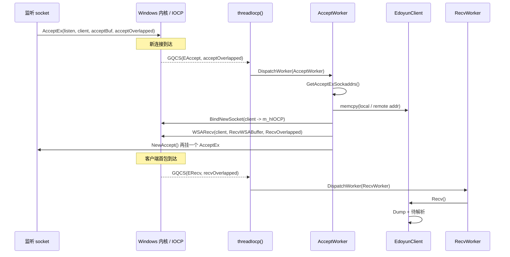
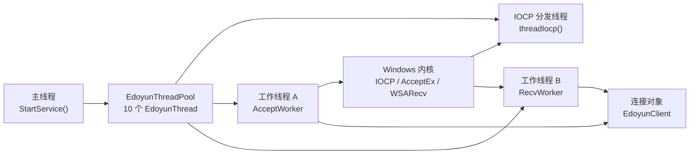

---
tags:
  - 远控系统
  - cpp
  - windows
  - IOCP
  - AcceptEx
  - WSARecv
  - bugfix
git: "newremoteCtrl b5dc1dc"
created: 2026-04-18
updated: 2026-04-18
aliases:
  - 8.4 note
  - 8.4 IOCP 服务端首次收包闭环修正
---
****
# 8.4 IOCP 服务端首次收包闭环修正

> **一句话结论**：`b5dc1dc` 不再只是“`AcceptEx` 完成后顺手挂一个 `WSARecv`”的半成品，而是把 **accept 出来的 client socket 绑定到业务 IOCP**、把 **第一次收包改成 recv 专用 `OVERLAPPED`**、并修掉 **线程任务对象在 `ret < 0` 分支的泄漏点**。  
> 这让 `AcceptEx -> EAccept -> AcceptWorker -> BindNewSocket -> WSARecv -> ERecv -> RecvWorker` 这条链路第一次真正连起来了。  
> 但它还不是稳定版：`WSABUF` 初始化、`m_used` 初始化、发送数据装填、优雅关闭等问题仍然没有补齐。

## 1. 本次提交推进了什么

这次提交是**机制补全 + bug 修正**的混合型提交，重点不在于“再加一个新类”，而在于把 8.1 阶段那套 `EdoyunServer` 初版骨架，往“真正能接住第一次 IOCP 收包完成事件”的方向推进了一步。

可以把它理解成四个关键动作：

1. **Accept 完成后，先把新 socket 显式绑定进 `m_hIOCP`。**  
   这一步由新增的 `EdoyunServer::BindNewSocket(SOCKET s)` 完成。没有这一步，后面挂出去的 `WSARecv` 即便完成，也不一定会按预期回到当前这套业务 IOCP 分发链路里。

2. **第一次 `WSARecv` 不再复用 accept 用的 `OVERLAPPED`。**  
   旧写法把 `*m_client` 同时当作 `LPDWORD` 和 `LPOVERLAPPED` 传给 `WSARecv`，本质上还是在借用 accept 那一套上下文。  
   现在改成了 `RecvOverlapped()`，意味着 `EAccept` 和 `ERecv` 至少在对象层面开始分家。

3. **地址信息不再直接把 `sockaddr**` 指向 `EdoyunClient` 成员。**  
   新代码先用 `plocal/premote` 接住 `GetAcceptExSockaddrs()` 的结果，再 `memcpy` 回 `m_laddr / m_raddr`。  
   这让“地址属于谁”这件事更清楚：地址最终归 `EdoyunClient` 持有，而不是悬在 accept 缓冲区解释逻辑里。

4. **线程任务在 `ret < 0` 时，真的释放旧 `ThreadWorker`。**  
   旧逻辑只把 `m_worker.store(NULL)`，这会留下堆上的旧任务对象。  
   本次提交先取旧指针，再 `delete pWorker`，把这类泄漏补掉了。

## 2. 与前一版的关系

这篇笔记直接承接 [[8.1 IOCP Server Architecture — EdoyunServer Initial Design|8.1]] 的 `EdoyunServer` 初版骨架。

8.1 解决的是：**服务器类、IOCP 句柄、线程池、`AcceptOverlapped`、`threadIocp()` 这些大骨架已经搭起来了。**

而这一版要回答的是另一个更具体的问题：

> **“Accept 完成以后，第一次真正的 recv 完成事件，能不能沿着这套 IOCP 分发结构走回来？”**

本次提交给出的答案是：

- **比 8.1 更进一步了：可以看到明确的 `ERecv` 路由意图。**
- **但还不能说收包系统已经稳定完成。**

因为它只是把**首次收包的通路**补起来了，并没有把**收包缓冲、解析、后续再次投递、发送闭环、关闭回收**一起做完。

## 3. 旧机制 vs 新机制

下图专门对比 **08e2ca6 之前** 和 **b5dc1dc 之后** 的结构差异。

![[8.4 note architecture.svg]]

### 这一张图想表达的重点

左边不是说“以前完全不能用”，而是说：

- accept 完成以后，确实已经会尝试挂 `WSARecv`
- 但是**socket 绑定、recv 上下文、线程任务释放**都还不扎实

右边则表示：

- `AcceptWorker` 现在先补 `BindNewSocket`
- 再通过 `RecvOverlapped()` 发起第一次异步收包
- 当 `WSARecv` 完成后，`threadIocp()` 才有机会按 `ERecv` 分发到 `RecvWorker`

也就是说，这次提交修的不是“UI 层面的 bug”，而是 **IOCP 服务端闭环里最关键的一段中继链**。

## 4. 端到端链路：Accept 之后第一次收包是怎么走的



### 这一段链路最重要的新增点

不是 `RecvWorker()` 这个函数名本身，而是两件更底层的事：

第一，**accepted socket 被正式挂到业务 IOCP 上了**。  
第二，**recv 事件终于有了自己的 `OVERLAPPED` 身份**。

这两个动作合在一起，才意味着“以后内核把 recv 完成事件投回来时，当前这套 `switch (m_operator)` 才知道该走 `ERecv` 这条支路”。

## 5. 线程视角：谁在等待，谁在处理，谁在回收



这里要特别注意一个现实：

- 线程池大小虽然是 `10`
- 但 `StartService()` 里目前只显式 `DispatchWorker` 了一次 `threadIocp()`
- 后面两条再派发 `threadIocp()` 的语句还是注释状态

所以当前模型更像是：

- **1 条 IOCP 分发线程**
- **若干条执行具体任务的池线程**

这不是错，但它说明目前还不是“多分发线程并行吃 completions”的最终形态。

## 6. 核心实现

### 6.1 `AcceptWorker()`：本次提交真正的核心

下面这段代码就是这次提交最关键的机制落点。

```cpp
template<EdoyunOperator op>
int AcceptOverlapped<op>::AcceptWorker()
{
    INT lLength = 0, rLength = 0;

    // ===== 1. 不再依赖“收到字节数 > 0”来判断 accept 是否有效 =====
    // AcceptEx 这里的 dwReceiveDataLength 传的是 0，
    // 所以 accept 成功并不等于“已经收到了业务数据”。
    if (m_client->GetBufferSize() > 0)
    {
        // ===== 2. 从 AcceptEx 的地址缓冲区里拆出本地 / 对端地址 =====
        sockaddr* plocal = NULL, * premote = NULL;
        GetAcceptExSockaddrs(*m_client, 0,
            sizeof(sockaddr_in) + 16, sizeof(sockaddr_in) + 16,
            (sockaddr**)&plocal, &lLength,
            (sockaddr**)&premote, &rLength);

        // ===== 3. 地址正式写回 EdoyunClient，自此由连接对象持有 =====
        memcpy(m_client->GetLocalAddr(), plocal, sizeof(sockaddr_in));
        memcpy(m_client->GetRmoteAddr(), premote, sizeof(sockaddr_in));

        // ===== 4. 关键修正：把 accept 出来的 client socket 绑进业务 IOCP =====
        m_server->BindNewSocket(*m_client);

        // ===== 5. 关键修正：第一次 WSARecv 使用 recv 专用 OVERLAPPED =====
        int ret = WSARecv((SOCKET)*m_client,
            m_client->RecvWSABuffer(),
            1,
            *m_client,
            &m_client->flags(),
            m_client->RecvOverlapped(),
            NULL);

        if (ret == SOCKET_ERROR && (WSAGetLastError() != WSA_IO_PENDING))
        {
            TRACE("ret = %d error %d\r\n", ret, WSAGetLastError());
        }

        // ===== 6. 继续补挂下一个 AcceptEx，保持 accept 链不断 =====
        if (!m_server->NewAccept())
        {
            return -2;
        }
    }

    return -1;
}
```

**这段代码在整个系统里的职责**，不是“处理业务包”，而是完成 **连接对象的正式入场**：

- 把地址信息落进 `EdoyunClient`
- 把 socket 纳入 `m_hIOCP`
- 把第一次异步收包挂出去
- 再补挂一个新的 `AcceptEx`

所以它是 **Accept 阶段和 Recv 阶段之间的桥**。

### 6.2 `threadIocp()`：现在终于能把 `ERecv` 分流出去

```cpp
int EdoyunServer::threadIocp()
{
    DWORD tranferred = 0;
    ULONG_PTR CompletionKey = 0;
    OVERLAPPED* lpOverlapped = NULL;

    if (GetQueuedCompletionStatus(m_hIOCP, &tranferred, &CompletionKey, &lpOverlapped, INFINITE))
    {
        if (CompletionKey != 0)
        {
            // ===== 1. 从裸 OVERLAPPED 反推出完整的 EdoyunOverlapped 对象 =====
            EdoyunOverlapped* pOverlapped =
                CONTAINING_RECORD(lpOverlapped, EdoyunOverlapped, m_overlapped);

            TRACE("pOverlapped->m_operator %d \r\n", pOverlapped->m_operator);

            // ===== 2. 回填 server 指针，后续 worker 才能继续调 server 方法 =====
            pOverlapped->m_server = this;

            // ===== 3. 按操作类型，把任务再丢给线程池里的执行线程 =====
            switch (pOverlapped->m_operator)
            {
            case EAccept:
                m_pool.DispatchWorker(((ACCEPTOVERLAPPED*)pOverlapped)->m_worker);
                break;
            case ERecv:
                m_pool.DispatchWorker(((RECVOVERLAPPED*)pOverlapped)->m_worker);
                break;
            case ESend:
                m_pool.DispatchWorker(((SENDOVERLAPPED*)pOverlapped)->m_worker);
                break;
            case EError:
                m_pool.DispatchWorker(((ERROROVERLAPPED*)pOverlapped)->m_worker);
                break;
            }
        }
        else
        {
            return -1;
        }
    }

    return 0;
}
```

这段代码说明当前项目的方向已经很明确了：

- **IOCP 线程只负责收 completion 和分流**
- **真正干活的是池里的 worker**

这比“所有事情都在一个 `while(GetQueuedCompletionStatus)` 里直接做完”更接近可扩展结构。

### 6.3 `EdoyunThread`：这次提交顺手补掉的泄漏点

```cpp
if (ret < 0)
{
    // Memory leak point (fixed)
    ::ThreadWorker* pWorker = m_worker.load();
    m_worker.store(NULL);
    delete pWorker;
}
```

这段改动虽然很小，但特别值得记下来，因为它属于远控项目里最容易被忽略的一类 bug：

- 任务失败时
- 线程似乎“空闲了”
- 但堆上那份旧任务对象还没释放

这种问题不会马上让你编译报错，也不一定第一时间崩溃，但它会在长时间运行、频繁投递任务时慢慢积累。

## 7. Win32 / Winsock 关键机制

### 7.1 为什么 `BindNewSocket()` 很关键

`CreateIoCompletionPort((HANDLE)s, m_hIOCP, (ULONG_PTR)this, 0)` 这次不是“创建新端口”，而是**把一个已经存在的 socket 关联到已有的 IOCP**。

也就是说：

- `m_hIOCP` 是同一个 completion port
- 新 accept 出来的 client socket 现在正式归它管
- 后续 `WSARecv / WSASend` 的完成事件，才有机会投递回这条 IOCP 分发链

如果少了这一步，`AcceptEx` 虽然成功了，但“这个新连接是否真正进入你的业务 IOCP 体系”这件事并不清楚。

### 7.2 为什么 `GetAcceptExSockaddrs()` 后要 `memcpy`

`GetAcceptExSockaddrs()` 给你的不是“全新分配的一份地址对象”，而是**accept 缓冲区里某两段区域的解释结果**。

所以这次改成：

- 先取 `plocal / premote`
- 再 `memcpy` 到 `EdoyunClient` 自己的 `m_laddr / m_raddr`

本质上是在把“地址的最终所有权”交给连接对象，而不是继续依赖 accept 缓冲区的临时布局。

### 7.3 为什么 `RecvOverlapped()` 比 `*m_client` 更重要

旧写法：

- `WSARecv(..., *m_client, ..., *m_client, NULL)`

虽然编译能过，但语义上很混：  
同一个 `EdoyunClient` 同时扮演了

- `LPDWORD`
- `LPWSAOVERLAPPED`

两个角色。

本次改成 `RecvOverlapped()` 以后，最起码做对了一件大事：

> **Accept 完成对象** 和 **Recv 完成对象** 开始分家了。

对于 IOCP 来说，这不是代码整洁问题，而是**事件路由身份**问题。

## 8. 当前版本仍然不稳定的点

这次提交把大方向修正了，但从当前代码状态看，下面这些点仍然没有真正完成。

### 8.1 `WSABUF` 还看不到初始化

当前我们能看到：

- `RecvWSABuffer()` 只是返回 `&m_recv->m_wsabuffer`
- `SendWSABuffer()` 只是返回 `&m_send->m_wsabuffer`
- `RecvOverlapped` / `SendOverlapped` 构造里只 `resize(m_buffer)`，没看到把 `m_wsabuffer.buf / len` 指向这块缓冲区

这意味着“异步收发的缓冲描述符”这一层，至少在当前三个核心文件里还没有补完整。

### 8.2 `m_used` 还没有初始化

`EdoyunClient::Recv()` 里直接用了：

```cpp
recv(m_sock, m_buffer.data() + m_used, m_buffer.size() - m_used, 0);
```

但当前构造函数初始化列表里只看到 `m_isbusy(false)`、`m_flags(0)`，没有看到 `m_used(0)`。

这类问题特别危险，因为它可能不是“稳定复现的立刻崩”，而是随机偏移、随机长度、随机读写异常。

### 8.3 `RecvWorker()` 仍然是“IOCP 完成后再同步 recv 一次”的混合语义

现在 `ERecv` 分支最后调用的是：

```cpp
int ret = m_client->Recv();
```

而 `Recv()` 内部又是普通 `recv()`。

这说明当前版本虽然**把 recv completion 事件路由通了**，但“真正消费哪块数据”这件事仍然带有明显的过渡态特征：

- 理想的 IOCP 收包逻辑，通常会围绕那次已投递的 `WSARecv` 缓冲区工作
- 当前代码却又回到同步 `recv()` 里去读

所以这更像是“把收包链路搭起来了”，还不是“把 IOCP 收包语义彻底做对了”。

### 8.4 发送链路仍然是 stub

`SendData()` 虽然调用了 `WSASend`，但当前这份代码里还看不到：

- `m_send->m_wsabuffer` 的 `buf / len` 装填
- `SendWorker()` 的真正逻辑

所以发送仍然不能算完成。

### 8.5 IOCP 分发线程目前还是单点

`StartService()` 里只实际派发了一次 `threadIocp()`。  
后面两条额外派发的语句还在注释里。

这意味着当前结构更偏向：

- 一个 completion 分发入口
- 多个线程池 worker 去处理 accept / recv / send

能工作，但还不是多分发线程的最终版。

## 9. 当前版本的准确结论

| 项目 | 状态 | 说明 |
|---|---|---|
| `AcceptEx` → `AcceptWorker` | ✅ | 已可通过 `EAccept` 分发 |
| 新连接 socket 绑定到 `m_hIOCP` | ✅ | `BindNewSocket()` 已补上 |
| 第一次 `WSARecv` 改用 recv 专用 `OVERLAPPED` | ✅ | `RecvOverlapped()` 已出现 |
| `ERecv` 路由到 `RecvWorker` | ✅ | `threadIocp()` 已有 `case ERecv` |
| 线程任务失败后的 worker 泄漏 | ✅ | `ret < 0` 分支已 `delete pWorker` |
| `WSABUF` 初始化完整 | ❌ | 当前核心文件里还看不到 |
| `m_used` 初始化 | ❌ | 当前构造函数里没补 |
| 真正纯 IOCP 语义的收包处理 | ⚠️ | 现在还是 completion 后再进 `recv()` |
| 发送闭环 | ❌ | `SendWorker()` 仍是 stub |
| 多 `threadIocp` 并行分发 | ⚠️ | 当前只显式派发了一次 |
| 优雅关闭 / 错误回收 | ⚠️ | 还看不到完整收尾逻辑 |

## 10. 代码索引

| 符号 | 文件 | 作用 |
|---|---|---|
| `AcceptOverlapped::AcceptWorker()` | `EdoyunServer.cpp` | accept 完成后的核心桥接逻辑 |
| `EdoyunServer::BindNewSocket()` | `EdoyunServer.cpp/.h` | 把 accepted socket 关联到已有 `m_hIOCP` |
| `EdoyunClient::RecvOverlapped()` | `EdoyunServer.cpp/.h` | 暴露 recv 专用 `OVERLAPPED` |
| `EdoyunClient::SendOverlapped()` | `EdoyunServer.cpp/.h` | 暴露 send 专用 `OVERLAPPED` |
| `EdoyunServer::threadIocp()` | `EdoyunServer.cpp` | completion 分发入口 |
| `EdoyunClient::Recv()` | `EdoyunServer.cpp` | 当前版本的收包处理函数 |
| `ThreadWorker(void* obj, FUNCTYPE f)` | `EdoyunThread.h` | 更宽松的任务对象包装构造 |
| `EdoyunThread::ThreadWorker()` | `EdoyunThread.h` | 线程内部任务执行与释放逻辑 |
| `EdoyunThreadPool::DispatchWorker()` | `EdoyunThread.h` | 找空闲线程并投递任务 |

## 11. 关联笔记

- [[8.1 IOCP Server Architecture — EdoyunServer Initial Design|8.1 初版 EdoyunServer 骨架]]
- [[7.8 _beginthread argument mismatch and fake this pointer|7.8 `_beginthread` 参数错配与伪 this 指针]]
- [[7.6 RemoteCtrl thread exit, queue growth, and memory lifetime|7.6 线程退出、队列增长与对象生命周期]]

## 12. 更新记录

- **2026-04-18**：根据 `newremoteCtrl` 的公开线提交 `b5dc1dc`，补写本篇 8.4 笔记。
- 本篇重点记录的是 **IOCP 服务端在 accept 后第一次收包闭环上的修正**，而不是 UI、协议或客户端功能。
