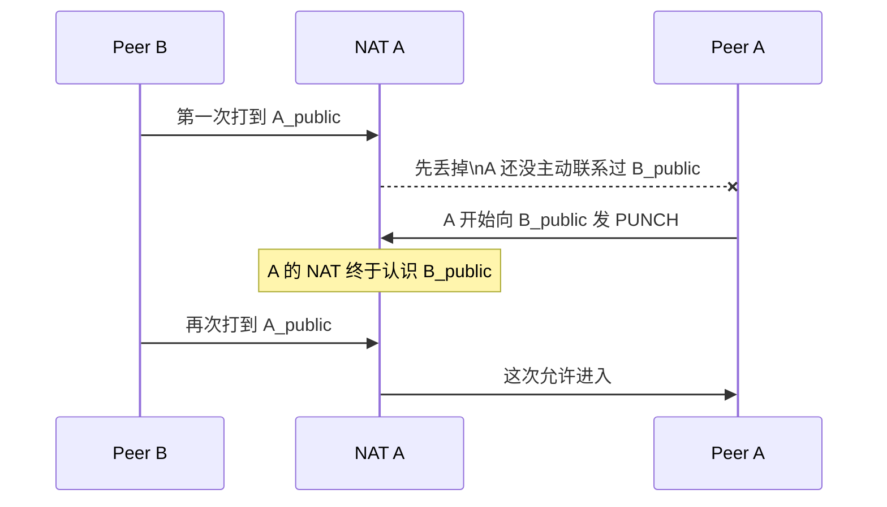

> [!abstract] 一句话先记住
> UDP 穿透不是"强行打开 NAT"，而是让通信双方先各自向外发包，借此在各自 NAT 上留下可回流的状态，然后再从同一个 UDP socket 几乎同时朝对方的公网地址发包，把直连路径"碰"出来。

在远控场景里，控制端和被控端经常都不直接暴露在公网，而是各自躲在路由器后面。路由器做的事情叫 **NAT（网络地址转换）**：它让内网里的多台设备共用一个公网 IP，但代价是外面主动进来的包会被默认拦截——路由器不知道该把包交给内网哪一台。

所以两端想要绕过服务器直接通信，核心难点不是"知不知道对方 IP"，而是 **NAT 愿不愿意把这个包放进来**。

# 1. 先看全流程：UDP 穿透到底在干什么

先别急着记术语，把 UDP 穿透看成 4 步：

1. A 和 B 都先用自己的 UDP socket 去联系一个公网引介服务器。
2. 服务器分别看到 A 和 B 在公网侧长什么样，然后把双方的公网地址交换给对方。
3. A 和 B 再从 **同一个本地 socket** 几乎同时朝对方公网地址发 `PUNCH` 包。
4. 两边 NAT 都被"碰开"以后，后续数据就直接 A <-> B 走，不再经过服务器。

![[9_1_2.svg]]

这张图里最应该盯住的不是服务器，而是中间那一步：**双方都要主动向对端发包**。服务器只是做引介，真正把路打通的是两边自己的出站包。

如果你只想先记住最短版本，可以记成一句话：

**先交换公网地址，再让双方同时主动发包，谁也别等谁先来找自己。**

参考：[RFC 5128](https://www.rfc-editor.org/rfc/rfc5128)

# 2. 为什么一定要复用同一个 UDP socket

第 1 节第 3 步特别强调了"同一个本地 socket"，这不是编码风格的问题，而是直接决定打洞能不能成功。要理解为什么，先看 NAT 实际上怎么记录连接。

![[9_1_1.svg]]

这张图展示的是 **NAT 映射（mapping）** 的本质：

- 你的程序在内网里实际用的是一个本地端点，比如 `192.168.1.10:50000`。
- 当它第一次向公网发包时，NAT 会给它分配一个公网侧的 `IP:port`，比如 `198.51.100.8:62000`。
- 公网服务器真正看到的不是你的私网地址，而是这个公网侧地址。

NAT 记住的是"哪个内部 `IP:port` 对应哪个公网 `IP:port`"。这就叫一条映射记录。

所以打洞时为什么一定要用同一个 socket？

- 步骤 1：你用这个 socket 联系引介服务器，服务器看到的是它对应的公网映射地址，比如 `198.51.100.8:62000`，并把这个地址告诉对端。
- 步骤 3：你还要用**同一个 socket** 向对端发 `PUNCH`。因为只有这样，出去的包在 NAT 上的公网号码牌才和步骤 1 一致，对端才能打中正确的入口。

如果你换了本地端口，对 NAT 来说就是另一个内部端点，会产生新的映射记录，对端原来拿到的地址就失效了。

**误区**：很多人以为只要还是同一台机器，换个本地端口也无所谓。其实不是。对 NAT 来说，端口变了，往往就是另一条会话。

参考：[RFC 4787](https://www.rfc-editor.org/rfc/rfc4787.html)

# 3. 为什么有时能打通，有时完全打不通

现在你知道了：要用同一个 socket，服务器会交换彼此的公网映射地址。但即便地址拿到了，有时怎么打都打不通——因为"知道往哪打"和"NAT 真的放进来"是两回事。

这里要把两个独立的问题分开看：

- **映射（Mapping）**：我从公网看起来是谁？公网号码牌稳不稳定？
- **过滤（Filtering）**：别人能不能从公网回来找我？

前者决定"服务器告诉出去的地址靠不靠谱"，后者决定"拿着这个地址能不能真的找到你"。

## 3.1 映射：决定你的公网号码牌稳不稳定

![[9_1_4.svg]]

映射行为分三种，越往下对打洞越不利：

- **Endpoint-Independent Mapping（EIM）**：同一个内部 socket，不管去找谁，公网号码牌尽量都不变。最利于打洞。
- **Address-Dependent Mapping（ADM）**：只要目标 IP 换了，公网号码牌就可能变。
- **Address and Port-Dependent Mapping（APDM）**：目标的 IP 或端口任一变化，公网号码牌都可能跟着变。最难打。

为什么 EIM 更友好？因为打洞时你会先联系服务器，再去联系对端——这两个目标不同。如果 NAT 一换目标就换公网端口（ADM/APDM），服务器告诉出去的公网地址在你真正去打洞时就已经变了，对端当然打不中。

**从工程角度看：映射稳定不稳定，决定了"服务器告诉出去的地址靠不靠谱"。**

## 3.2 过滤：决定谁能回来找你

![[9_1_5.svg]]

过滤说的不是"你对外长什么样"，而是"谁有资格给你发包进来"。同样分三档，越往下越严格：

- **Endpoint-Independent Filtering（EIF）**：你只要对外发过包，任何外部地址都更容易被放进来。最宽松。
- **Address-Dependent Filtering（ADF）**：只有你之前联系过的那个外部 IP 才能回来找你。
- **Address and Port-Dependent Filtering（APDF）**：只有你之前联系过的那个精确 `IP:port` 才被放进来。最严格。

这就是为什么"知道地址"还不够。对方 NAT 很可能在说：

**"你虽然知道我要找谁，但我还没见过你，所以我先不放你进来。"**

过滤越严格，打洞越难。尤其是 APDF，你需要先让对端也向你发过包，NAT 才认得你。一开始那几个 `PUNCH` 被丢掉，反而是正常现象——这就是为什么双方要几乎同时发包。

## 3.3 为什么双方要几乎同时发 `PUNCH`

把映射和过滤结合起来，"双方同时"这个要求就好理解了：



核心结论是：

**双方都必须先主动留下出站痕迹，NAT 才更可能允许对方的回包进来。** 只有一方发包是不够的，另一方的 NAT 永远没见过对端，就会持续丢包。

所以真实程序里常见的做法不是"只发一个 `PUNCH` 就等结果"，而是：

- 双方拿到对端地址后立刻开始发，不要等对方先来找自己。
- 连续发多次——因为前几包很可能在对端 NAT 建立好状态之前就已经被丢掉了。
- 一旦真正收到来自对端的包，就以那个"实际收到的源地址"为准继续通信。

还有一个边界情况值得知道：如果两个端点在 **同一个 NAT 后面**，打洞时会用到各自的公网映射地址。此时 NAT 能不能把"发往自己公网地址的包"再绕回内网，叫 **hairpinning（回环）**。支持得好，同一路由器下的两个 peer 也能用公网地址互通；支持不好，就可能出现"明明在同一个路由器后面，反而打不通"的情况。

参考：[RFC 4787](https://www.rfc-editor.org/rfc/rfc4787.html)、[RFC 5128](https://www.rfc-editor.org/rfc/rfc5128)

# 4. NAT、STUN、ICE、TURN 到底各管什么

前三节把打洞的底层机制讲完了：NAT 造成阻塞，映射决定地址稳不稳，过滤决定谁能进来，双方同时发包才能互相"认识"。现实中，这套机制有一套标准术语和协议体系来实现它。你可以先把它们翻成一句话：

**NAT 制造问题，STUN 帮你看清自己，ICE 负责试路，TURN 负责兜底。**

![[9_1_3.svg]]

分别看：

- **NAT**：路由器做地址翻译。它让内网端点不能天然被公网直接找到。
- **STUN**：像照镜子。你去问 STUN 服务器"你看到我是哪个公网 `IP:port`？"，服务器照实告诉你——这就是发现公网映射地址的标准方式。
- **ICE**：像总调度员。它把各种候选地址（直连、NAT 映射、TURN 中继）组织起来做连通性检查，从中挑出真正能通的一条路。
- **TURN**：像中继站。直连实在打不通时，让 TURN 服务器代替双方转发数据。

这也顺手澄清两个常见误区：

- **误区 1：STUN 就等于 UDP 穿透。**
  不是。STUN 只是帮你发现公网映射地址的工具，本身不负责打洞决策，也不保证能直连。
- **误区 2：服务器把地址一交换，事情就结束了。**
  也不是。地址交换只是开始，真正的难点在后面的映射稳定性检查和双向打洞。

什么时候必须退回 TURN？

- 一侧或两侧 NAT 的映射/过滤太严格，双方怎么试都建立不起稳定直连。
- 你的业务更在意"必通"而不是"尽量省服务器流量"。

所以现代工程里更常见的不是"手写裸打洞"，而是走 **ICE + STUN + TURN** 这套完整体系：能直连就直连，直连失败再中继。

参考：[RFC 8445](https://www.rfc-editor.org/rfc/rfc8445.html)、[RFC 8489](https://www.rfc-editor.org/rfc/rfc8489.html)、[RFC 8656](https://www.rfc-editor.org/rfc/rfc8656.html)

# 5. 看代码前，先记住这 5 个观察点

> [!tip]
> 下面的代码是"学习版引介 + 裸打洞"骨架，不是完整商用方案。你先带着这 5 个观察点去看，代码就不会只剩下语法细节。

1. **注册、打洞、通信必须共用同一个本地 UDP socket。**（对应第 2 节）
2. **拿到对端地址后，不要只发一包，要连续发一串 `PUNCH`。**（对应第 3.3 节）
3. **一旦真正收到对端的包，后续最好以"实际收到的源地址"为准。**（NAT 实际分配的端口和预期可能有细微偏差）
4. **打通以后也别忘了 keepalive，否则 NAT 映射会超时。**（这段代码暂未实现）
5. **这只是教学版骨架；真实系统还要考虑鉴权、重传、超时、失败回退 TURN。**（对应第 4 节）

如果你能把这 5 个点从代码里认出来，这篇笔记的主线其实就已经吃透了。

# 6. 附录

## 6.1 附录 A：引介服务器

这段代码只做一件事：**谁来注册，就记录服务器真实看到的源地址；当房间里有两个人时，把双方的公网端点互相告诉对方。**

```cpp
// ===== 学习版 UDP 引介服务器 =====
// 协议：
//   Peer -> Server : "REG <room> <peer_id>"
//   Server -> Peer : "PEER <ip> <port> <peer_id>"
//
// 说明：
// 1) 这里只做"引介/交换公网端点"，不是标准 STUN 服务器。
// 2) 真实系统还要做鉴权、过期清理、重传、TURN fallback 等。

#include <arpa/inet.h>
#include <netinet/in.h>
#include <sys/socket.h>
#include <unistd.h>

#include <cstring>
#include <iostream>
#include <sstream>
#include <string>
#include <unordered_map>
#include <vector>

struct PeerInfo {
    std::string peer_id;
    sockaddr_in observed_addr{}; // 服务器看到的公网地址
};

static std::string to_ip(const sockaddr_in& addr) {
    char buf[INET_ADDRSTRLEN] = {0};
    inet_ntop(AF_INET, &addr.sin_addr, buf, sizeof(buf));
    return buf;
}

static void send_text(int sock, const sockaddr_in& to, const std::string& s) {
    sendto(sock, s.data(), s.size(), 0,
           reinterpret_cast<const sockaddr*>(&to), sizeof(to));
}

int main() {
    int sock = socket(AF_INET, SOCK_DGRAM, 0);
    if (sock < 0) {
        std::cerr << "socket() failed\n";
        return 1;
    }

    sockaddr_in bind_addr{};
    bind_addr.sin_family = AF_INET;
    bind_addr.sin_addr.s_addr = htonl(INADDR_ANY);
    bind_addr.sin_port = htons(40000);

    if (bind(sock, reinterpret_cast<sockaddr*>(&bind_addr), sizeof(bind_addr)) < 0) {
        std::cerr << "bind() failed\n";
        return 1;
    }

    // room -> peers
    std::unordered_map<std::string, std::vector<PeerInfo>> rooms;

    char buf[1024];
    while (true) {
        sockaddr_in from{};
        socklen_t from_len = sizeof(from);
        ssize_t n = recvfrom(sock, buf, sizeof(buf) - 1, 0,
                             reinterpret_cast<sockaddr*>(&from), &from_len);
        if (n <= 0) continue;
        buf[n] = '\0';

        std::istringstream iss(buf);
        std::string cmd, room, peer_id;
        iss >> cmd >> room >> peer_id;

        if (cmd != "REG" || room.empty() || peer_id.empty()) {
            continue;
        }

        auto& peers = rooms[room];

        // 更新或插入
        bool updated = false;
        for (auto& p : peers) {
            if (p.peer_id == peer_id) {
                p.observed_addr = from;
                updated = true;
                break;
            }
        }
        if (!updated) {
            peers.push_back(PeerInfo{peer_id, from});
        }

        std::cout << "[REG] room=" << room
                  << " peer=" << peer_id
                  << " observed=" << to_ip(from) << ":" << ntohs(from.sin_port)
                  << "\n";

        // 演示起见：房间里正好两个 peer 就互相告知
        if (peers.size() == 2) {
            const auto& a = peers[0];
            const auto& b = peers[1];

            std::string msg_to_a = "PEER " + to_ip(b.observed_addr) + " " +
                                   std::to_string(ntohs(b.observed_addr.sin_port)) +
                                   " " + b.peer_id;

            std::string msg_to_b = "PEER " + to_ip(a.observed_addr) + " " +
                                   std::to_string(ntohs(a.observed_addr.sin_port)) +
                                   " " + a.peer_id;

            send_text(sock, a.observed_addr, msg_to_a);
            send_text(sock, b.observed_addr, msg_to_b);

            std::cout << "[INTRODUCE] "
                      << a.peer_id << " <-> " << b.peer_id << "\n";
        }
    }

    close(sock);
    return 0;
}
```

这段服务器代码最值得你盯住的地方不是"房间管理"，而是这件事：

**服务器不相信客户端自己上报的公网地址，而是直接用 `recvfrom()` 看到的源地址和源端口，作为"当前 NAT 映射后的公网端点"。**

## 6.2 附录 B：Peer

这段代码对应的是"同一个 socket 先注册，再打洞，再通信"的最小闭环。

```cpp
// ===== 学习版 UDP 打洞 Peer =====
// 协议：
//   Peer -> Server : "REG <room> <my_id>"
//   Server -> Peer : "PEER <ip> <port> <peer_id>"
//   Peer <-> Peer  : "PUNCH <room> <my_id>"
//   Peer <-> Peer  : "PUNCH_ACK <room> <my_id>"
//   Peer <-> Peer  : "DATA <my_id> <text...>"
//
// 重点：整个流程都复用"同一个本地 UDP socket"。

#include <arpa/inet.h>
#include <netinet/in.h>
#include <sys/socket.h>
#include <unistd.h>

#include <atomic>
#include <chrono>
#include <cstring>
#include <iostream>
#include <sstream>
#include <string>
#include <thread>

static void send_text(int sock, const sockaddr_in& to, const std::string& s) {
    sendto(sock, s.data(), s.size(), 0,
           reinterpret_cast<const sockaddr*>(&to), sizeof(to));
}

static std::string endpoint_to_string(const sockaddr_in& addr) {
    char ip[INET_ADDRSTRLEN] = {0};
    inet_ntop(AF_INET, &addr.sin_addr, ip, sizeof(ip));
    return std::string(ip) + ":" + std::to_string(ntohs(addr.sin_port));
}

int main() {
    std::string server_ip = "203.0.113.10"; // 改成你的服务器
    uint16_t server_port = 40000;
    std::string room = "room1";
    std::string my_id = "A";
    uint16_t local_port = 50000;            // 固定本地端口，方便观察

    // 1) 创建"唯一的那个 UDP socket"
    int sock = socket(AF_INET, SOCK_DGRAM, 0);
    if (sock < 0) {
        std::cerr << "socket() failed\n";
        return 1;
    }

    // 2) 绑定本地端口（整个注册/打洞/通信都用它）
    sockaddr_in local{};
    local.sin_family = AF_INET;
    local.sin_addr.s_addr = htonl(INADDR_ANY);
    local.sin_port = htons(local_port);
    if (bind(sock, reinterpret_cast<sockaddr*>(&local), sizeof(local)) < 0) {
        std::cerr << "bind() failed\n";
        return 1;
    }

    // 3) 服务器地址
    sockaddr_in server{};
    server.sin_family = AF_INET;
    server.sin_port = htons(server_port);
    inet_pton(AF_INET, server_ip.c_str(), &server.sin_addr);

    // 4) 用"同一个 socket"向服务器注册
    send_text(sock, server, "REG " + room + " " + my_id);

    sockaddr_in peer_addr{};
    bool have_peer = false;
    std::atomic<bool> connected{false};

    // 5) 等服务器告诉我们对端公网地址
    char buf[2048];
    std::thread punch_thread;

    while (true) {
        sockaddr_in from{};
        socklen_t from_len = sizeof(from);
        ssize_t n = recvfrom(sock, buf, sizeof(buf) - 1, 0,
                             reinterpret_cast<sockaddr*>(&from), &from_len);
        if (n <= 0) continue;
        buf[n] = '\0';

        std::string msg(buf);
        std::istringstream iss(msg);
        std::string cmd;
        iss >> cmd;

        if (cmd == "PEER") {
            std::string ip, peer_id;
            uint16_t port = 0;
            iss >> ip >> port >> peer_id;

            peer_addr = {};
            peer_addr.sin_family = AF_INET;
            peer_addr.sin_port = htons(port);
            inet_pton(AF_INET, ip.c_str(), &peer_addr.sin_addr);

            have_peer = true;
            std::cout << "[PEER] learned peer public endpoint = "
                      << endpoint_to_string(peer_addr) << "\n";

            // 6) 开始连续发 PUNCH
            //    为什么要连续发？
            //    因为 UDP 可能丢包，而且在双方 NAT 状态真正碰开前，前几包可能被丢掉。
            punch_thread = std::thread([&]() {
                for (int i = 0; i < 40 && !connected.load(); ++i) {
                    send_text(sock, peer_addr, "PUNCH " + room + " " + my_id);
                    std::this_thread::sleep_for(std::chrono::milliseconds(200));
                }
            });
        }
        else if (cmd == "PUNCH") {
            std::string recv_room, peer_id;
            iss >> recv_room >> peer_id;

            if (recv_room == room) {
                // 收到对方 punch，就立刻回 ACK
                send_text(sock, from, "PUNCH_ACK " + room + " " + my_id);
                connected = true;
                peer_addr = from; // 以后直接以真正收到包的地址为准
                std::cout << "[CONNECTED] got PUNCH from "
                          << endpoint_to_string(peer_addr) << "\n";
            }
        }
        else if (cmd == "PUNCH_ACK") {
            std::string recv_room, peer_id;
            iss >> recv_room >> peer_id;

            if (recv_room == room) {
                connected = true;
                peer_addr = from;
                std::cout << "[CONNECTED] got PUNCH_ACK from "
                          << endpoint_to_string(peer_addr) << "\n";
            }
        }
        else if (cmd == "DATA") {
            std::string peer_id;
            iss >> peer_id;
            std::string text;
            std::getline(iss, text);
            std::cout << "[" << peer_id << "]" << text << "\n";
        }

        // 7) 一旦打通，就进入最简聊天模式
        if (connected.load()) {
            if (punch_thread.joinable()) {
                punch_thread.join();
            }

            std::cout << "Type messages. Ctrl+C to quit.\n";

            // 发送线程：仍然复用同一个 socket
            std::thread sender([&]() {
                std::string line;
                while (std::getline(std::cin, line)) {
                    send_text(sock, peer_addr, "DATA " + my_id + " " + line);
                }
            });

            // 接收循环：继续收 DATA
            while (true) {
                sockaddr_in from2{};
                socklen_t from_len2 = sizeof(from2);
                ssize_t m = recvfrom(sock, buf, sizeof(buf) - 1, 0,
                                     reinterpret_cast<sockaddr*>(&from2), &from_len2);
                if (m <= 0) continue;
                buf[m] = '\0';

                std::string msg2(buf);
                if (msg2.rfind("DATA ", 0) == 0) {
                    std::istringstream iss2(msg2);
                    std::string cmd2, peer_id2;
                    iss2 >> cmd2 >> peer_id2;
                    std::string text2;
                    std::getline(iss2, text2);
                    std::cout << "[" << peer_id2 << "]" << text2 << "\n";
                }
            }

            sender.join();
            break;
        }
    }

    close(sock);
    return 0;
}
```

读这段 peer 代码时，把第 5 节那 5 个观察点一一对上去看：

- 哪里体现了"同一个 socket"？
- 哪里体现了"连续发 `PUNCH`"？
- 哪里体现了"收到真实包后改用真实源地址"？
- keepalive 为什么还没补？
- 为什么它还不能替代完整 ICE / TURN 方案？

## 6.3 附录 C：实战记忆点

如果你要把整篇内容压缩成最后几句话，可以记成下面这组判断：

- **先注册，后交换地址，再同时发包。**
- **只知道对方公网地址，不等于一定能直连。**
- **同一个本地 socket 是前提，不是编码风格。**
- **前几包被丢掉很正常，所以要连续发 `PUNCH`。**
- **能直连就直连，直连不稳或打不通就退回 TURN。**

再压缩成一句工程化的话，就是：

**"同一个本地 UDP socket 先向外注册，拿到彼此的公网端点；双方再几乎同时朝对方发包，让 NAT 为对端建立可回流状态；能直连就直连，不行就 TURN 中继。"**
