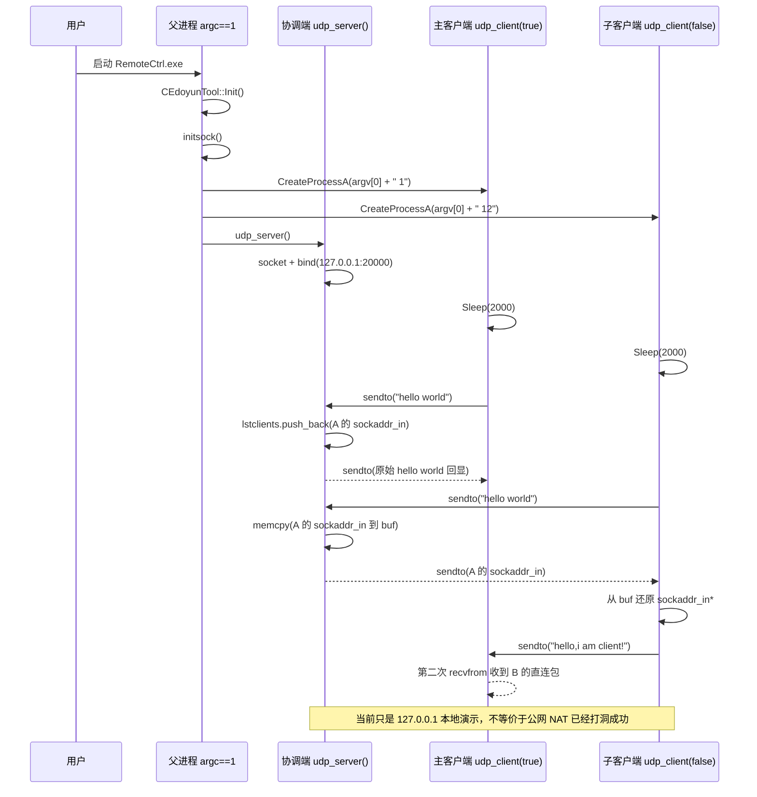

---
tags:
  - Remote Control System
  - cpp
  - windows
  - UDP
  - NAT
  - Winsock
  - git/newremoteCtrl/d33a4d0
created: 2026-04-21
updated: 2026-04-21
commit: d33a4d0
parent_commit: ffc419c
aliases:
  - 9.4 example
  - UDPHole example
  - UDP 打洞原理演示代码
---

# 9.4 example

> Summary：`d33a4d0` 把 [[9.3 UDPHole]] 中的 UDPHole 占位函数推进成一个**本地三进程 UDP 打洞原理演示**：父进程启动两个客户端进程，自己作为 `udp_server()` 绑定 `127.0.0.1:20000`；第一个客户端先注册，协调端保存它的 `sockaddr_in`；第二个客户端注册后，协调端把第一个客户端的地址发给它；第二个客户端再绕过协调端，直接向第一个客户端发送 UDP 数据包。当前版本适合说明“协调端交换地址，客户端之间直发”的基本思想，但还不是可用于公网 NAT 的完整 UDPHole 实现。

---

## 1. 本次提交推进了什么

`d33a4d0` 的提交信息是：`Completed the basic principle demonstration code for UDP hole punching`。它不是简单改日志，而是把上一节的 `udp_server()` / `udp_client()` 占位函数填成了可读的 Winsock UDP 示例。

| 文件 | 变化 | 机制意义 |
|---|---:|---|
| `RemoteCtrl/RemoteCtrl/RemoteCtrl.cpp` | `+127 / -4` | 新增 `initsock()` / `clearsock()`，实现 `udp_server()` 与 `udp_client(bool)` 的 UDP 收发、地址登记、地址回传和客户端直发。 |
| `RemoteCtrl/RemoteCtrl/framework.h` | `+1 / -1` | 把 `#include <vld.h>` 注释掉，降低示例运行时对 Visual Leak Detector 的依赖。 |

这一节的重点不是“远控主链路已经切到 UDP”，而是：项目先写了一个小型 example，用最少角色演示 UDP 打洞的核心动作。

---

## 2. 与上一节的关系

[[9.3 UDPHole]] 记录的是“进程角色骨架”：

- `argc == 1`：父进程，负责启动两个子进程，并进入 `udp_server()`。
- `argc == 2`：主客户端，调用 `udp_client(true)`。
- `argc > 2`：子客户端，调用 `udp_client(false)`。
- 当时 `udp_server()` / `udp_client()` 还没有真实 UDP 网络逻辑。

`d33a4d0` 则把“骨架”推进到“示例链路”：

1. `udp_server()` 变成一个本地协调端，绑定 `127.0.0.1:20000`。
2. `udp_client(true)` 变成主客户端：先向协调端注册，再等待对端直接发来的消息。
3. `udp_client(false)` 变成子客户端：从协调端拿到主客户端地址，然后直接向主客户端发包。
4. `framework.h` 注释掉 `vld.h`，让没有安装 VLD 的环境也更容易编译这个 example。

---

## 3. 整体结构图

![[9.4-example-address-exchange.svg|1022]]

这张图要抓住一个核心结论：**协调端不传业务数据，只帮助第二个客户端拿到第一个客户端的地址。**

在当前 example 中，真正的业务直发是最后一步：

```text
子客户端 udp_client(false)  --sendto-->  主客户端 udp_client(true)
```

这也是 UDP 打洞教学里最关键的一层：服务器只负责“介绍双方认识”，后续数据尽量让双方直接传。

---

## 4. 从启动到直发的时序



---

## 5. 核心实现一：Winsock 初始化被加进来了，但位置还不理想

本提交新增了两个很小的函数：

```cpp
void initsock()
{
    WSADATA wsa;
    WSAStartup(MAKEWORD(2, 2), &wsa);
}

void clearsock()
{
    WSACleanup();
}
```

它们的意图很清楚：在调用 `socket()`、`bind()`、`sendto()`、`recvfrom()` 之前初始化 Winsock，并在程序退出前释放 Winsock 资源。

但是当前调用位置在 `argc == 1` 的父进程分支里：

```cpp
int main(int argc, char* argv[])
{
    if (!CEdoyunTool::Init()) return 1;

    if (argc == 1)
    {
        // ...
        string strCmd = argv[0];

        // 当前只在父进程里调用
        initsock();

        strCmd += " 1";
        BOOL bRet = CreateProcessA(NULL, (LPSTR)strCmd.c_str(),
                                   NULL, NULL, FALSE, 0,
                                   NULL, wstrDir, &si, &pi);

        // ...
        udp_server();
    }
    else if (argc == 2)
    {
        udp_client();
    }
    else
    {
        udp_client(false);
    }

    clearsock();
    return 0;
}
```

这里有一个非常重要的工程含义：**Winsock 初始化不是跨进程继承的状态。** 父进程调用了 `WSAStartup()`，不代表子进程已经可以直接调用 `socket()`。而当前两个客户端进程会直接进入 `udp_client()`，在它们自己的进程里没有看到 `initsock()`。

因此，这个 example 在设计意图上已经进入 UDP 示例阶段，但在初始化位置上仍然有明显缺口。更稳的写法应该是把初始化放到角色分支之前，或者在 `udp_server()` / `udp_client()` 内部各自保证初始化成功：

```cpp
int main(int argc, char* argv[])
{
    if (!CEdoyunTool::Init()) return 1;

    if (!initsock()) return 1;

    // 再按 argc 分配角色
    // ...

    clearsock();
    return 0;
}
```

如果保留当前结构，那么调试时看到客户端 `socket()` 返回 `INVALID_SOCKET`，第一优先级就应检查：客户端进程是否真的调用过 `WSAStartup()`。

---

## 6. 核心实现二：`udp_server()` 是一个最小协调端

`udp_server()` 的职责不是转发所有数据，而是完成两件事：

1. 第一次收到客户端数据时，把这个客户端的 `sockaddr_in` 保存下来，并把消息原样回显。
2. 后续收到另一个客户端数据时，把第一个客户端的 `sockaddr_in` 作为 payload 发回去。

下面是当前版本的核心函数，注释按“本项目里这一行承担什么角色”来理解。

```cpp
void udp_server()
{
    printf("%s(%d):%s\r\n", __FILE__, __LINE__, __FUNCTION__);

    // ===== 1. 创建 UDP socket =====
    // PF_INET：IPv4；SOCK_DGRAM：数据报；protocol 传 0 让系统按类型选择 UDP。
    SOCKET sock = socket(PF_INET, SOCK_DGRAM, 0);
    if (sock == INVALID_SOCKET)
    {
        printf("%s(%d):%s ERROR(%d)!!!\r\n",
               __FILE__, __LINE__, __FUNCTION__, WSAGetLastError());
        return;
    }

    // ===== 2. 保存第一个客户端的地址 =====
    // example 只存第一个客户端，因此不是完整的多客户端房间模型。
    std::list<sockaddr_in> lstclients;

    sockaddr_in server, client;
    memset(&server, 0, sizeof(server));
    memset(&client, 0, sizeof(client));

    server.sin_family = AF_INET;
    server.sin_port = htons(20000);
    server.sin_addr.s_addr = inet_addr("127.0.0.1");

    // ===== 3. 协调端固定绑定本地端口 20000 =====
    // 这让两个客户端都能向同一个 127.0.0.1:20000 注册。
    if (bind(sock, (sockaddr*)&server, sizeof(server)) == -1)
    {
        printf("%s(%d):%s ERROR(%d)!!!\r\n",
               __FILE__, __LINE__, __FUNCTION__, WSAGetLastError());
        closesocket(sock);
        return;
    }

    std::string buf;
    buf.resize(1024 * 256);
    memset((char*)buf.c_str(), 0, buf.size());

    int len = sizeof(client);
    int ret = 0;

    while (!_kbhit())
    {
        // ===== 4. 收客户端注册包，并顺便拿到来源地址 =====
        ret = recvfrom(sock, (char*)buf.c_str(), buf.size(), 0,
                       (sockaddr*)&client, &len);

        if (ret > 0)
        {
            if (lstclients.size() <= 0)
            {
                // ===== 5. 第一个客户端：登记地址并回显 =====
                lstclients.push_back(client);

                printf("%s(%d):%s ip %08X port %d\r\n",
                       __FILE__, __LINE__, __FUNCTION__,
                       client.sin_addr.s_addr, ntohs(client.sin_port));

                ret = sendto(sock, buf.c_str(), ret, 0,
                             (sockaddr*)&client, len);

                printf("%s(%d):%s\r\n", __FILE__, __LINE__, __FUNCTION__);
            }
            else
            {
                // ===== 6. 第二个客户端：把第一个客户端地址塞进 buf =====
                memcpy((void*)buf.c_str(),
                       &lstclients.front(),
                       sizeof(lstclients.front()));

                ret = sendto(sock,
                             buf.c_str(),
                             sizeof(lstclients.front()),
                             0,
                             (sockaddr*)&client,
                             len);

                printf("%s(%d):%s\r\n", __FILE__, __LINE__, __FUNCTION__);
            }

            // CEdoyunTool::Dump((BYTE*)buf.c_str(), ret);
        }
        else
        {
            printf("%s(%d):%s ERROR(%d)!!! ret = %d\r\n",
                   __FILE__, __LINE__, __FUNCTION__,
                   WSAGetLastError(), ret);
        }
    }

    closesocket(sock);
    printf("%s(%d):%s\r\n", __FILE__, __LINE__, __FUNCTION__);
}
```

这段代码的系统意义是：协调端从 `recvfrom()` 得到“这个 UDP 包从哪里来”，然后把这个来源地址交给另一个客户端。真实 UDP 打洞的协调端也会做类似的事，只是它通常要保存会话 ID、客户端 ID、外侧地址、心跳时间、重试次数，而不是只保存 `lstclients.front()`。

---

## 7. 核心实现三：主客户端先登记，再等直连包

`udp_client(true)` 是主客户端分支。它先向协调端发一个 `hello world`，然后执行两次 `recvfrom()`：

- 第一次通常收到协调端的回显。
- 第二次等待另一个客户端直接发来的消息。

```cpp
if (ishost)
{
    printf("%s(%d):%s\r\n", __FILE__, __LINE__, __FUNCTION__);

    // ===== 1. 向协调端注册 =====
    std::string msg = "hello world!\n";
    int ret = sendto(sock,
                     msg.c_str(),
                     msg.size(),
                     0,
                     (sockaddr*)&server,
                     sizeof(server));

    printf("%s(%d):%s ret = %d\r\n",
           __FILE__, __LINE__, __FUNCTION__, ret);

    if (ret > 0)
    {
        msg.resize(1024);
        memset((char*)msg.c_str(), 0, msg.size());

        // ===== 2. 第一次接收：协调端回显 =====
        ret = recvfrom(sock,
                       (char*)msg.c_str(),
                       msg.size(),
                       0,
                       (sockaddr*)&client,
                       &len);

        printf("host %s(%d):%s ERROR(%d)!!! ret = %d\r\n",
               __FILE__, __LINE__, __FUNCTION__,
               WSAGetLastError(), ret);

        if (ret > 0)
        {
            printf("%s(%d):%s ip %08X port %d\r\n",
                   __FILE__, __LINE__, __FUNCTION__,
                   client.sin_addr.s_addr, ntohs(client.sin_port));
            printf("%s(%d):%s msg = %d\r\n",
                   __FILE__, __LINE__, __FUNCTION__, msg.size());
        }

        // ===== 3. 第二次接收：等待子客户端直连过来 =====
        ret = recvfrom(sock,
                       (char*)msg.c_str(),
                       msg.size(),
                       0,
                       (sockaddr*)&client,
                       &len);

        printf("host %s(%d):%s ERROR(%d)!!! ret = %d\r\n",
               __FILE__, __LINE__, __FUNCTION__,
               WSAGetLastError(), ret);

        if (ret > 0)
        {
            printf("%s(%d):%s ip %08X port %d\r\n",
                   __FILE__, __LINE__, __FUNCTION__,
                   client.sin_addr.s_addr, ntohs(client.sin_port));
            printf("%s(%d):%s msg = %s\r\n",
                   __FILE__, __LINE__, __FUNCTION__, msg.c_str());
        }
    }
}
```

主客户端的关键点在第二次 `recvfrom()`。如果子客户端真的拿到了主客户端地址并发包成功，主客户端这里收到的数据来源就不再是协调端，而是子客户端。也就是说，example 想证明的是：**协调端返回地址后，双方不需要再通过协调端中转业务数据。**

---

## 8. 核心实现四：子客户端拿地址后直接向主客户端发包

`udp_client(false)` 是子客户端分支。它向协调端注册后，预期收到的 payload 不再是普通字符串，而是服务端塞进去的 `sockaddr_in` 原始内存。

```cpp
else
{
    printf("%s(%d):%s\r\n", __FILE__, __LINE__, __FUNCTION__);

    // ===== 1. 向协调端注册 =====
    std::string msg = "hello world!\n";
    int ret = sendto(sock,
                     msg.c_str(),
                     msg.size(),
                     0,
                     (sockaddr*)&server,
                     sizeof(server));

    printf("%s(%d):%s ret = %d\r\n",
           __FILE__, __LINE__, __FUNCTION__, ret);

    if (ret > 0)
    {
        msg.resize(1024);
        memset((char*)msg.c_str(), 0, msg.size());

        // ===== 2. 接收协调端返回的主客户端 sockaddr_in =====
        ret = recvfrom(sock,
                       (char*)msg.c_str(),
                       msg.size(),
                       0,
                       (sockaddr*)&client,
                       &len);

        printf("client %s(%d):%s ERROR(%d)!!! ret = %d\r\n",
               __FILE__, __LINE__, __FUNCTION__,
               WSAGetLastError(), ret);

        if (ret > 0)
        {
            sockaddr_in addr;
            memcpy(&addr, msg.c_str(), sizeof(addr));

            // 当前代码直接把字符串缓冲区解释成 sockaddr_in*
            sockaddr_in* paddr = (sockaddr_in*)msg.c_str();

            printf("%s(%d):%s ip %08X port %d\r\n",
                   __FILE__, __LINE__, __FUNCTION__,
                   paddr->sin_addr.s_addr, ntohs(paddr->sin_port));

            // ===== 3. 直发给主客户端 =====
            msg = "hello,i am client!\r\n";
            ret = sendto(sock,
                         (char*)msg.c_str(),
                         msg.size(),
                         0,
                         (sockaddr*)paddr,
                         sizeof(sockaddr_in));

            printf("client %s(%d):%s ERROR(%d)!!! ret = %d\r\n",
                   __FILE__, __LINE__, __FUNCTION__,
                   WSAGetLastError(), ret);
        }
    }
}
```

这一段就是本提交标题里“basic principle demonstration”的核心。它不再只是客户端都向服务器发包，而是出现了“客户端 B 拿到客户端 A 地址后直接向 A 发包”。

不过要注意：把 `sockaddr_in` 原始内存直接发给另一个进程，只适合同一平台、同一程序的演示。真正协议应该定义明确的字段，例如：

```cpp
struct PeerEndpoint
{
    uint32_t ip;   // network byte order
    uint16_t port; // network byte order
};
```

然后用固定长度、固定字节序、固定消息类型来传输，而不是直接传 C++ 结构体内存。

---

## 9. Win32 / Winsock 关键机制

| API / 机制 | 当前代码里的作用 | 需要记住的点 |
|---|---|---|
| `CreateProcessA` | 父进程启动两个同名 `RemoteCtrl.exe` 子进程。 | 当前 `lpApplicationName == NULL`，命令行字符串要自己处理可执行文件路径、空格、引号和参数分隔。 |
| `WSAStartup(MAKEWORD(2,2), &wsa)` | 初始化当前进程的 Winsock 2.2 使用环境。 | 应检查返回值；每个使用 Winsock 的进程都要成功初始化。 |
| `WSACleanup()` | 释放当前进程的 Winsock 资源。 | 应与成功的 `WSAStartup()` 成对出现；当前代码没有判断是否真的初始化成功。 |
| `socket(PF_INET, SOCK_DGRAM, 0)` | 创建 IPv4 UDP socket。 | `SOCK_DGRAM` 是 UDP 数据报模型，不建立 TCP 那样的连接。 |
| `sockaddr_in` | 保存 IPv4 地址族、IP、端口。 | 端口要用 `htons()` 转成网络字节序，打印时用 `ntohs()` 转回来。 |
| `bind()` | 协调端把 socket 固定到 `127.0.0.1:20000`。 | 服务端通常需要显式绑定；客户端一般可以让 `sendto()` 触发隐式绑定。 |
| `sendto()` | 向指定 `sockaddr_in` 发送一个 UDP datagram。 | `sendto()` 成功只代表数据交给本机协议栈，不代表对端一定收到。 |
| `recvfrom()` | 接收 UDP datagram，并拿到来源地址。 | 默认阻塞；如果没有包到来，线程会卡在这里，`_kbhit()` 不会被继续检查。 |
| `closesocket()` | 关闭 UDP socket。 | 关闭 socket 不是关闭进程；只是释放这个网络端点。 |
| `Sleep(2000)` | 客户端粗略等待协调端先绑定端口。 | 这是演示级同步，不是可靠的启动顺序控制。 |

---

## 10. 易错点与当前版本结论

这一提交是机制推进，不是专门的 bug fix，所以这里先把问题作为主笔记里的 pitfalls 记录，不单独拆成 `Debug-XXX`。

### 10.1 客户端进程没有显式调用 `WSAStartup()`

`initsock()` 当前只在 `argc == 1` 分支调用。子进程进入 `udp_client()` 之前没有对应初始化。由于 Winsock 初始化是进程级要求，建议把 `initsock()` 移到所有角色分支之前，并检查返回值。

### 10.2 第二个子进程不一定会进入 `udp_client(false)`

父进程第一次拼接：

```cpp
strCmd += " 1";
```

第二次又拼接：

```cpp
strCmd += "2";
```

如果原命令是：

```text
RemoteCtrl.exe 1
```

第二次会变成：

```text
RemoteCtrl.exe 12
```

这通常仍然只有一个额外参数，所以 `argc` 仍可能是 2，第二个子进程也会进入 `udp_client(true)`，而不是 `udp_client(false)`。如果目标是进入第三个分支，应该产生两个额外参数，例如：

```text
RemoteCtrl.exe 1 2
```

或者更清晰地使用角色名：

```text
RemoteCtrl.exe --role peer
```

### 10.3 第二次 `CreateProcessA` 的返回值没有被保存

当前代码第二次调用：

```cpp
CreateProcessA(NULL, (LPSTR)strCmd.c_str(), NULL, NULL,
               FALSE, 0, NULL, wstrDir, &si, &pi);

if (bRet)
{
    CloseHandle(pi.hThread);
    CloseHandle(pi.hProcess);
    udp_server();
}
```

`if (bRet)` 判断的仍然是第一次创建是否成功。更稳的写法应该是：

```cpp
bRet = CreateProcessA(...);
if (bRet)
{
    CloseHandle(pi.hThread);
    CloseHandle(pi.hProcess);
    udp_server();
}
```

### 10.4 `CreateProcessA(NULL, commandLine, ...)` 对路径空格很敏感

当 `lpApplicationName` 为 `NULL` 时，系统会从命令行第一个 token 解析可执行文件。如果 `argv[0]` 的路径里有空格，但命令行没有加引号，解析就可能失败或指向错误程序。当前 example 用 `(LPSTR)strCmd.c_str()` 直接传入，属于演示代码可接受、工程代码需要修正的写法。

### 10.5 `127.0.0.1` 不是公网 NAT 环境

当前协调端固定：

```cpp
server.sin_addr.s_addr = inet_addr("127.0.0.1");
```

这说明示例跑在本机 loopback 上。它能证明“地址交换 + 直发”的程序形态，但不能证明公网 NAT、对称 NAT、防火墙、端口保活都已经处理完。

### 10.6 直接写 `std::string::c_str()` 缓冲区不稳

代码多处这样写：

```cpp
memset((char*)msg.c_str(), 0, msg.size());
recvfrom(sock, (char*)msg.c_str(), msg.size(), 0, ...);
```

这在现代 C++ 里不建议。更清晰的写法是使用 `std::vector<char>`，或者在可修改字符串缓冲区语义明确的标准版本中使用 `msg.data()` / `&msg[0]`。

### 10.7 `recvfrom()` 是阻塞点

`udp_server()` 外层用了：

```cpp
while (!_kbhit())
{
    recvfrom(...);
}
```

但如果没有 UDP 包到来，线程会阻塞在 `recvfrom()`，并不会继续回到 `_kbhit()` 检查键盘输入。教学 example 可以接受；真正服务端应考虑非阻塞 socket、`select()` / `WSAEventSelect()`、IOCP，或者独立退出事件。

---

## 11. 如果下一步要把 example 推向真实 UDPHole

下一步不应该急着接远控命令，而应先把 UDPHole 的实验协议补稳：

1. **修正角色启动**：让第二个子进程明确进入 peer 分支，例如 `--role host` / `--role peer`。
2. **每个进程独立初始化 Winsock**：检查 `WSAStartup()` 返回值，只在成功后调用 UDP API。
3. **把 `127.0.0.1` 换成真实协调端地址**：服务端可绑定 `INADDR_ANY`，客户端配置公网协调端 IP。
4. **定义协议包**：不要裸传 `sockaddr_in`，而是定义消息类型、版本、客户端 ID、IP、端口、时间戳。
5. **增加双方同时探测**：A 和 B 拿到对方地址后都持续 `sendto()`，不是只让 B 发一次。
6. **增加超时、重试、心跳**：UDP 可能丢包，NAT 映射也可能超时。
7. **增加日志与状态机**：把“注册成功、收到对端地址、开始 punch、收到直连包”明确记录下来。
8. **区分 example 与远控主链路**：在 UDPHole 稳定前，不要直接把控制命令、文件传输、桌面流量压到这个实验分支上。

---

## 12. 关联知识

- [[9.3 UDPHole]]：上一节记录的是 UDPHole 的进程角色骨架。
- [[2.1 网络编程基本设计]]：网络初始化、socket 基本概念可以回到这里复习。
- [[2.2 网络编程架构设计]]：远控主链路的整体网络模型。
- [[8.1 IOCP Server Architecture — EdoyunServer Initial Design]]：当前 UDPHole example 之外，项目原 TCP/IOCP 服务端模型的参考入口。

---

## 13. 代码索引

| 位置 | 内容 | 本笔记关注点 |
|---|---|---|
| `RemoteCtrl/RemoteCtrl/RemoteCtrl.cpp:63-72` | `initsock()` / `clearsock()` | Winsock 初始化和释放。 |
| `RemoteCtrl/RemoteCtrl/RemoteCtrl.cpp:76-123` | `main(argc, argv)` | 父进程、主客户端、子客户端的角色分配。 |
| `RemoteCtrl/RemoteCtrl/RemoteCtrl.cpp:176-230` | `udp_server()` | 协调端绑定、接收注册、保存首个客户端地址、向第二个客户端返回地址。 |
| `RemoteCtrl/RemoteCtrl/RemoteCtrl.cpp:232-302` | `udp_client(bool ishost)` | 主客户端注册并等待直连包；子客户端取地址并直发主客户端。 |
| `RemoteCtrl/RemoteCtrl/framework.h:13` | `//#include <vld.h>` | 暂时取消 VLD 头文件依赖。 |

---

## 14. 当前版本的准确结论

`d33a4d0` 已经把 UDPHole 从“只有进程骨架”推进到“能说明原理的本地 example”。从架构含义上看，这是一个很重要的过渡：项目开始把协调端、主客户端、子客户端放到同一个可执行文件里，通过不同参数模拟三个角色，并用 UDP `sendto()` / `recvfrom()` 跑通地址交换思路。

但这仍然不是完整 UDP 打洞功能。当前版本还需要先修正子进程 Winsock 初始化、命令行参数分支、`CreateProcessA` 返回值检查、原始结构体传输和阻塞退出问题。只有这些基础问题稳定后，才适合继续引入真实公网协调端、双向 punch、心跳与远控业务包承载。

---

## 15. 更新记录

- 2026-04-21：基于 `newremoteCtrl` 最新提交 `d33a4d0` 创建，记录 UDPHole example 的本地三进程地址交换链路。
