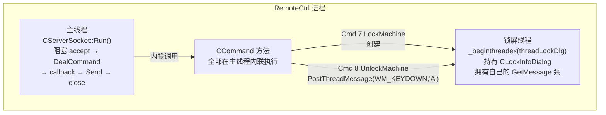
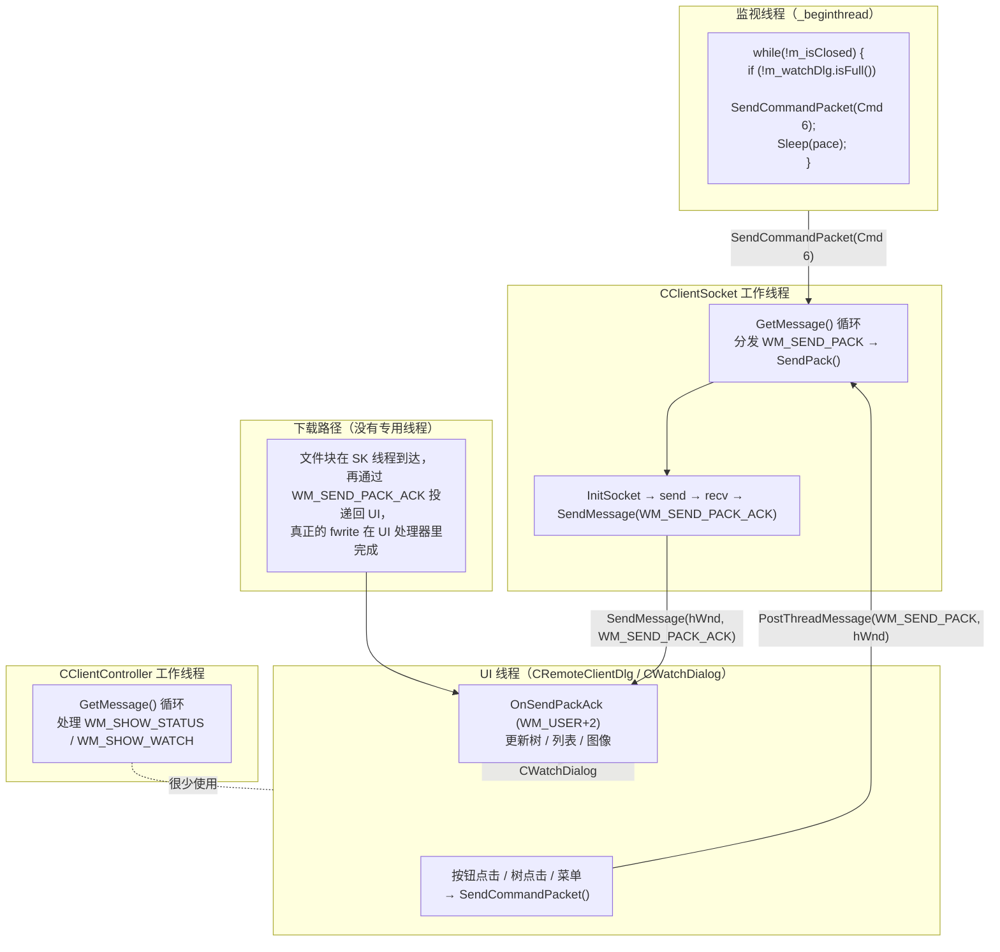
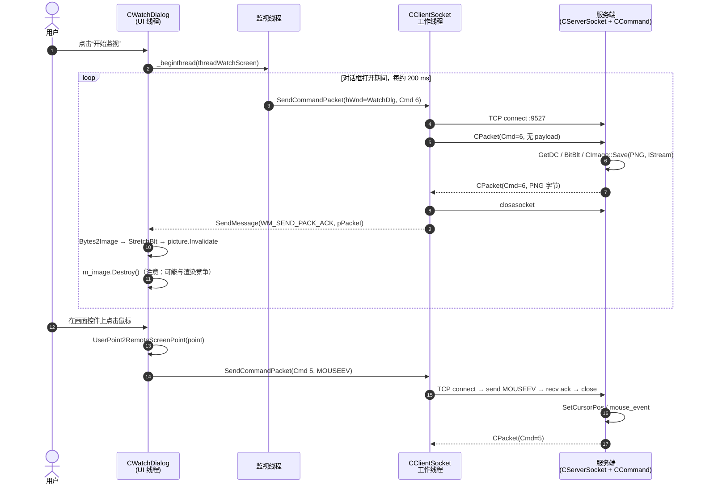

# RemoteCtrl - 系统化学习笔记

> 目标提交：`3ea00ff3f8f255b36010e0558edb2a3932e1c2c7`（作者标注为“基本完成，但还有一些 bug 和优化项”）。
> 范围：一个基于 Windows + MFC + Winsock 的经典客户端 / 服务端远控系统学习型 Demo。
> 读者：已经读过代码、但希望从“工程导师”视角理解其架构、线程、网络、文件传输、缺陷与未来演进方向的 C++ / Windows 学习者。

---

## 0. 开始之前，先确认几个硬事实

这个仓库里实际上有 **两层代码**：

1. **已经完成的经典层**（也就是“功能完整”的远控实现）
   - MFC 对话框客户端 + 同步式 Winsock 1.1 服务端。真正实现 9 个命令（盘符、目录、运行、下载、鼠标、屏幕、锁屏、解锁、删除）的，就是这一层。主要位于 `ServerSocket.h`、`Command.h/.cpp`、`Packet.h`、`CClientSocket.*`、`ClientController.*`、`CRemoteClientDlg`、`CWatchDialog`。

2. **正在进行中的重写脚手架**
   - 这是作者并行搭建的一套更专业的 IOCP / 异步框架：`ESocket`、`ENetWork`、`EdoyunServer`、`EdoyunThread`、`CEdoyunQueue`。它 **还没有真正接到产品逻辑里**；`RemoteCtrl.cpp` 的 `main()` 目前实际调用的是 `udp_server()` / `udp_client()`，它们只是为打洞准备的 UDP *实验代码*，并不是真正的命令路径。真正启动 TCP 服务端的入口，在 `main()` 底部是被注释掉的。

> **教学提示**：这种“双轨并存”在真实学习项目里非常常见。作者先做出一套可工作的同步版本，再把它往事件驱动方向重构。两套代码一起读非常有价值，因为你既能看到同步版 *做不到什么*（单客户端、阻塞、没有背压），也能看到 *为什么* 要开始加 IOCP 版本。

---

## 1. 架构总览

### 1.1 系统架构（SVG）

![[图片/SVG/最终版-01.svg]]

### 1.2 心智模型

- **一条命令 = 一条 TCP 连接。** 客户端在每次 `SendPack()` 内部都会调用 `CClientSocket::InitSocket()`，写入一个带帧的数据包，读取回复，然后立刻关闭连接。这种设计不常见，但同步模型非常简单。代价是每条命令都要承担一次握手延迟。
- **服务端是单客户端、同步式的。** `CServerSocket::Run()` 就是一条大的 `while(true)` 循环：`accept → DealCommand → callback → Send → CloseClient`。没有并发，没有线程池。
- **屏幕监视循环由客户端主动轮询。** `CClientController::threadWatchScreen()` 每约 200 ms 发起一次 Cmd 6 请求；服务端每次都返回一张 PNG 编码的整屏截图。

---

## 2. 源码树速览

```text
RemoteCtrl/
├── RemoteCtrl/                  # --- 服务端（被控机器） ---
│   ├── RemoteCtrl.cpp           # main()；当前运行的是 UDP 实验，TCP 路径被注释
│   ├── ServerSocket.h           # CServerSocket 单例，listen(9527)，阻塞 accept
│   ├── ServerSocket.cpp         # 静态成员；退出时触发 CHelper 析构
│   ├── Packet.h                 # CPacket（0xFEFF 帧）、MOUSEEV、FILEINFO
│   ├── Command.h                # 10 个命令处理器（屏幕、文件、鼠标、锁屏，…）
│   ├── Command.cpp              # 在 CCommand 构造函数里建立 cmd→成员函数 map
│   ├── LockInfoDialog.h/.cpp    # LockMachine 线程用的轻量 MFC 对话框
│   ├── EdoyunTool.h             # IsAdmin / RunAsAdmin / WriteStartupDir / WriteRegisterTable
│   ├── --- 新框架（未使用，开发中） ---
│   ├── ESocket.h                # RAII socket 封装 + EBuffer、ESockaddrIn、ETYPE
│   ├── ENetWork.h/.cpp          # EServer + EServerParameter（回调驱动的 TCP/UDP）
│   ├── EdoyunThread.h           # EdoyunThread、EdoyunThreadPool、ThreadWorker（成员函数指针）
│   ├── CEdoyunQueue.h           # 基于 IOCP 的线程安全队列，EdoyunSendQueue 带回调
│   ├── EdoyunServer.h/.cpp      # IOCP 服务端脚手架：AcceptEx/WSARecv/WSASend、按操作区分的 overlapped
│   └── ESocket.cpp              # （桩文件）
└── RemoteClient/                # --- 客户端（控制端） ---
    ├── RemoteClient.cpp/.h      # MFC CWinApp，InitInstance()
    ├── RemoteClientDlg.*        # 主界面：盘符 / 目录树、文件列表、右键菜单
    ├── CClientSocket.h/.cpp     # TCP 客户端单例 + 自带消息泵工作线程
    ├── ClientController.h/.cpp  # 单例外观：承载 3 个对话框，拥有 watch 线程
    ├── CWatchDialog.*           # 远程桌面查看器 + 鼠标事件来源
    ├── StatusDlg.*              # 小型进度对话框
    └── EdoyunTool.h             # （客户端侧桩文件）
```

---

## 3. 网络协议深挖

### 3.1 数据包格式（SVG 位 / 字节图）

![[图片/SVG/最终版-02.svg]]

```cpp
// Packet.h —— 把原始字节解析成 packet 的构造函数（服务端）
CPacket(const BYTE* pData, size_t& nSize)
{
    size_t i = 0;
    for (; i < nSize; i++) {                       // (1) 同步扫描 0xFEFF
        if (*(WORD*)(pData + i) == 0xFEFF) {
            sHead = *(WORD*)(pData + i);
            i += 2; break;
        }
    }
    if (i + 4 + 2 + 2 > nSize) { nSize = 0; return; } // (2) 固定头部字节还不够

    nLength = *(DWORD*)(pData + i); i += 4;
    if (nLength + i > nSize)      { nSize = 0; return; } // (3) body 还不完整——继续等更多数据

    sCmd = *(WORD*)(pData + i); i += 2;
    if (nLength > 4) {                                   // (4) 取出 payload（不含 2B cmd + 2B sum）
        strData.resize(nLength - 4);
        memcpy((void*)strData.c_str(), pData + i, nLength - 4);
        i += nLength - 4;
    }
    sSum = *(WORD*)(pData + i); i += 2;

    WORD sum = 0;                                        // (5) 校验 checksum
    for (size_t j = 0; j < strData.size(); j++)
        sum += BYTE(strData[j]) & 0xFF;
    nSize = (sum == sSum) ? i : 0;                       // 成功时 nSize = 实际消费的字节数
}
```

### 3.2 为什么这个设计值得学

| 技术 | 为什么有价值 |
|---|---|
| **魔数头 `0xFEFF`** | 当 TCP 把多个包粘在一起（粘包 / Nagle）或者收到了垃圾字节时，必须依靠它重新同步。 |
| **payload 前的长度前缀** | 解析器不需要先读完整 payload，就能判断缓冲区里是不是已经有一条完整消息。这是教科书级的 length-prefixed framing。 |
| **`nSize` 作为 in/out 参数** | 一个很巧的单函数 API：既表达 *“我成功解析了 N 个字节，调用者把它们丢掉”*，又表达 *“我还需要更多数据”*（`nSize=0`）。没有异常，也不需要额外返回码。 |
| **简易 checksum** | 足以抓住单字节损坏，而且刻意保持简单。它不是 TLS/HMAC 的替代品。 |
| **`#pragma pack(1)`** | 防止编译器填充，让内存布局和线上布局严格一致。 |

### 3.3 协议局限（到了生产环境会出问题的点）

1. **没有版本字段** —— 未来的你无法在不打断旧客户端的前提下扩展 packet 格式。
2. **没有 per-request id / correlation** —— 因为命令都是通过 *一次性* socket 完成，所以暂时不需要；但这也反过来把架构锁死在 one-shot 拓扑上。
3. **checksum 只是简单加和** —— 两个字节若以等量相反方式翻转，仍然能通过校验。实验环境够用，敌对网络下不行。
4. **协议头在两处重复定义** —— `RemoteCtrl/Packet.h` 和 `RemoteClient/CClientSocket.h` 都有一份，任何改动都必须改两遍。`ProjectGuide.md` 已经点出了这个问题。

---

## 4. 线程模型

### 4.1 服务端线程拓扑



关键性质：

- 在锁屏对话框关闭之前，服务端实际上只有 **一个工作线程**。这是刻意设计的——作者自己也知道风险；`ProjectGuide.md` 里就写了：“The server currently handles a single controller at a time.”
- **锁屏对话框由它自己的线程持有**，因为它内部跑的是阻塞式 `GetMessage` 循环，而且必须在发起该命令的栈帧结束之后继续存活。解锁通过跨线程 `PostThreadMessage` 完成，这是正确的 Windows 用法——你不能从当前线程安全地对另一个线程拥有的对话框直接 `SendMessage`，否则可能死锁。

### 4.2 客户端线程拓扑



这里最关键的设计点，是 **两个彼此解耦的消息循环**（`CClientSocket::threadFunc2`、`CClientController::threadFunc`）：都由 `GetMessage` 驱动，都像单线程 actor。命令通过 `PostThreadMessage` 被 *投递* 进去；回复则通过 `SendMessage(WM_SEND_PACK_ACK)` 被 *同步送回* 原始 HWND。这个模式非常干净——没有锁，所有权完全由“哪个线程在消费消息队列”来隐式表达。

### 4.3 屏幕监视时序（端到端）



---

## 5. 文件传输 —— Cmd 4（下载）的解剖

下载流程是整个系统里最容易出 bug 的部分，因为它是唯一一个 **一次请求会产生 N 个响应包** 的流程。

### 5.1 时序

```mermaid
sequenceDiagram
    autonumber
    participant UI as CRemoteClientDlg<br/>(UI)
    participant CTL as CClientController
    participant SK as CClientSocket 线程
    participant SV as 服务端（DownloadFile）
    participant FS as 远端文件系统

    UI->>CTL: DownFile(remotePath)
    CTL->>UI: 打开 CFileDialog → localPath
    CTL->>UI: fopen(localPath, "wb+") → FILE*
    CTL->>SK: SendCommandPacket(hWnd=UI, Cmd=4, bAutoClose=false,<br/>data=remotePath, wParam=(FILE*)pFile)
    SK->>SV: connect → send(Cmd 4 + path)
    SV->>FS: fopen_s(path,"rb"); _ftelli64 → total size
    SV-->>SK: CPacket(Cmd 4, 8 字节 little-endian 大小)
    loop 直到 fread 返回 < 1024
        SV->>FS: fread(1024)
        SV-->>SK: CPacket(Cmd 4, chunkBytes)
    end
    loop 每收到一次 ack
        SK-->>UI: SendMessage(WM_SEND_PACK_ACK, pPacket, FILE*)
        UI->>UI: UpdateDownloadFile(strData, pFile)<br/>(第一条 ack = 文件大小，后续 = fwrite)
    end
    UI->>UI: fclose(pFile); DownloadEnd()
```

### 5.2 下载代码，带注释

```cpp
// Command.h —— 服务端
int DownloadFile(std::list<CPacket>& lstPacket, CPacket& inPacket)
{
    std::string strPath = inPacket.strData;
    long long   data    = 0;                          // 文件大小，8 字节
    FILE*       pFile   = nullptr;
    if (fopen_s(&pFile, strPath.c_str(), "rb") != 0) {
        lstPacket.push_back(CPacket(4, (BYTE*)&data, 8));  // size=0 => 客户端提示“无法读取”
        return -1;
    }

    fseek(pFile, 0, SEEK_END);
    data = _ftelli64(pFile);                          // 64 位感知；处理 >2GB 文件很关键
    lstPacket.push_back(CPacket(4, (BYTE*)&data, 8)); // 第一个 packet = 文件大小
    fseek(pFile, 0, SEEK_SET);

    char buffer[1024];
    size_t rlen = 0;
    do {
        rlen = fread(buffer, 1, 1024, pFile);
        lstPacket.push_back(CPacket(4, (BYTE*)buffer, rlen));  // 修复：原来发的是 &data
    } while (rlen >= 1024);                                    // 修复：原来写成 rlen > 1024（off-by-one）
    fclose(pFile);
    return 0;
}
```

这段函数的注释里直接点出了两个关键修复：

1. **buffer 变量用错了** —— 原代码压入的是 `(BYTE*)&data`（也就是大小字段的地址），而不是 `(BYTE*)buffer`，结果下载下来的文件会变成不断重复的 8 字节大小值。
2. **循环条件 off-by-one** —— `rlen > 1024` 会在最后一块正好等于 1024 字节时提前终止，造成丢数据或过早结束。正确条件是 `rlen >= 1024`；只有短读（`< 1024`）才意味着 EOF。

### 5.3 客户端重组

```cpp
// RemoteClientDlg.cpp —— 每收到一个 chunk 的 WM_SEND_PACK_ACK 都会触发
void CRemoteClientDlg::UpdateDownloadFile(const std::string& strData, FILE* pFile)
{
    static LONGLONG length = 0, index = 0;  // 跨 chunk 的函数级静态状态
    if (length == 0) {                       // 第一条 ack = 8 字节大小
        length = *(long long*)strData.c_str();
        if (length == 0) {
            AfxMessageBox("The file length is zero or the file cannot be read!!!");
            CClientController::getInstance()->DownloadEnd();
        }
    }
    else if (length > 0 && index >= length) { // 保险网
        fclose(pFile); length = 0; index = 0;
        CClientController::getInstance()->DownloadEnd();
    }
    else {
        fwrite(strData.c_str(), 1, strData.size(), pFile);
        index += strData.size();
        if (index >= length) {               // 正常完成
            fclose(pFile); length = 0; index = 0;
            CClientController::getInstance()->DownloadEnd();
        }
    }
}
```

**关于 `static` 的教学点**：一旦你想支持第二个并发下载，这种函数作用域的 `static length/index` 就会变得非常危险——因为它本质上是一份跨调用存活的全局状态。更干净的设计，是把它们放进一个 per-download 结构体里，并通过 `wParam` 和 `FILE*` 一起传递。

---

## 6. 这个代码库里值得学的技巧

下面这些，是我认为一个初级 C++ 工程师读这个仓库时真正应该带走的模式。

### 6.1 单例 + 嵌套静态 `CHelper` 自动释放

```cpp
// ServerSocket.h（CClientSocket.h、CClientController.h 里也是同样模式）
class CServerSocket {
public:
    static CServerSocket* getInstance() {
        if (m_instance == NULL) m_instance = new CServerSocket();
        return m_instance;
    }
private:
    static void releaseInstance() { /* delete m_instance; */ }
    static CServerSocket* m_instance;

    // 嵌套 helper：它的析构函数会在静态存储期结束时触发
    class CHelper {
    public:
        CHelper()  { CServerSocket::getInstance(); }
        ~CHelper() { CServerSocket::releaseInstance(); }
    };
    static CHelper m_helper;   // 这个定义强制了 CHelper 的生命周期
};
```

- 如果你 *只* 调用 `getInstance()`，那么 `m_instance` 会泄漏。这里的技巧在于：`m_helper` 是一个 *静态对象*，因此它的析构函数会在程序退出时运行，进而调用 `releaseInstance()` 把单例删掉。你就得到了“懒创建 + 可预测的退出清理”，不需要手写 `atexit` 或智能指针。
- 一个典型陷阱是：如果别的静态对象在它自己的析构函数里又去调用 `CServerSocket::getInstance()`，销毁顺序就是未定义的（经典的 *static destruction order fiasco*）。在现代 C++ 里，更推荐 `Meyer's singleton`（函数内静态）。这份代码采用的是更老的写法——教学上很有意思，但要知道它的坑。

### 6.2 用成员函数指针 map 做命令分发

```cpp
// Command.cpp
struct { int nCmd; CMDFUNC func; } data[] = {
    {1,   &CCommand::MakeDriverInfo},
    {2,   &CCommand::MakeDirectoryInfo},
    ...
    {1981,&CCommand::TestConnect},
    {-1,  NULL}
};
for (int i = 0; data[i].nCmd != -1; i++)
    m_mapFunction.insert({ data[i].nCmd, data[i].func });

int CCommand::ExcuteCommand(int nCmd, ...) {
    auto it = m_mapFunction.find(nCmd);
    if (it == m_mapFunction.end()) return -1;
    return (this->*it->second)(lstPacket, inPacket);  // 调用成员函数指针
}
```

对比几种写法：

| 方案 | 查找成本 | 可扩展性 | 备注 |
|---|---|---|---|
| `switch/case` | 编译器给力时可通过 jump table 达到 O(1) | 必须改中央 `switch`，很容易产生合并冲突 | 当命令数 ≤ 5 时很好用 |
| `if/else if` | O(n) | 和 `switch` 类似，但更差 | 不建议 |
| `std::map<int, member-fn>` | O(log n) | 增加命令只需加一行 | 扩展性好，但缓存不友好 |
| `std::unordered_map<int, member-fn>` | 平均 O(1) | 同上 | 常数因子通常更好 |

这个项目选择 `map`，是因为命令数量在持续增长；作者甚至还留了提示性注释解释原因。若是生产项目，我会更倾向 `std::unordered_map`。

### 6.3 收件箱就是 Windows 消息队列的工作线程

```cpp
// CClientSocket.cpp
void CClientSocket::threadFunc2() {
    SetEvent(m_eventInvoke);                      // 告诉构造函数“线程已经活了”
    MSG msg;
    while (::GetMessage(&msg, NULL, 0, 0)) {      // 单线程 actor
        TranslateMessage(&msg);
        DispatchMessage(&msg);
        if (m_mapFunc.find(msg.message) != m_mapFunc.end())
            (this->*m_mapFunc[msg.message])(msg.message, msg.wParam, msg.lParam);
    }
}
// 生产者调用：PostThreadMessage(m_nThreadID, WM_SEND_PACK, (WPARAM)pData, (LPARAM)hWnd);
```

这是 Windows 上一个非常优秀的、无锁的线程间通信模式：

- 每条消息都携带一个堆分配的 payload（`PACKET_DATA*`），其所有权转移给工作线程。
- 回复通过 `SendMessage(hWnd, WM_SEND_PACK_ACK, ...)` 回到 UI，这样 MFC 能正常把它路由到对话框的消息映射里。
- `SetEvent(m_eventInvoke)` 解决了经典竞态：生产者可能在线程真正进入 `GetMessage` 之前就开始投递消息。构造函数在返回前会调用 `WaitForSingleObject(m_eventInvoke, 100)`，确保线程已经就绪。

### 6.4 带 fluent 参数对象的回调式服务端

```cpp
// ENetWork.h
EServerParameter param("127.0.0.1", 20000, ETYPE::ETypeUDP);
param << RecvFromCB << SendToCB << (short)20001;      // 按类型分派 setter
// 等价于：param.m_recvfrom = RecvFromCB; …
```

通过重载 `operator<<`，让编译器根据传入类型决定要给哪个成员赋值——这是 builder 模式的一种紧凑替代。要说明的是：它很“巧”，但不太符合主流 API 风格；如果是正式接口，我更希望看到 `.OnRecvFrom(...)` 这种更容易搜索的写法。

### 6.5 IOCP 脚手架：重写方向是对的

`EdoyunServer`（虽然还没接进 `main()`，但代码已经写了很多）展示了正确的“每个 CPU 一条线程 + 每个操作一个 OVERLAPPED + completion port”模型：

- `EdoyunClient` 持有三个 `std::shared_ptr<EdoyunOverlapped>`：accept / recv / send。每一个都继承自 `EdoyunOverlapped`，因此在 `GetQueuedCompletionStatus` 里通过 `CONTAINING_RECORD(lpOverlapped, EdoyunOverlapped, m_overlapped)` 就能回到具体对象。
- `EdoyunThreadPool` 通过 `DispatchWorker(ThreadWorker)` 派发任务，由空闲线程捡走执行。
- `CEdoyunQueue` 自己就是基于 IOCP 的：push / pop / size / clear 这些操作本身也是“发给队列线程的消息”，由 completion port 顺序串行化，因此完全不需要 mutex。很优雅。
- `EdoyunSendQueue` 把队列和回调绑定起来，每个 tick 只排出一个元素——这是经典的 producer / consumer 非阻塞工作流。

如果我是作者，这一块会是我最重点投入继续学习的部分：它是未来多客户端、高吞吐版本的骨架。

---

## 7. Bug 和粗糙边 —— 还真正悬而未决的点

下面这些问题，要么是我从作者的 TODO / 注释里看到的，要么是我把代码和设计对照后自己读出来的。既然作者已经明确说 commit `3ea00ff` “还有一些 bug 和优化”，把这些点挑出来，其实就是这篇笔记最核心的产出。

### 7.1 高严重度

| # | 位置 | 问题 | 为什么它是坏的 |
|---|---|---|---|
| B1 | `RemoteCtrl.cpp` `main()` | 真正的服务端根本没有被启动。当前只运行 `udp_server()` / `udp_client()`；原本的 `CServerSocket::getInstance()->Run(...)` 代码块被注释掉了。 | 这意味着整个“产品”流程现在其实是死的，除非你把那段注释恢复回来。这是第一个必须修掉或在文档里明确写出的点。 |
| B2 | `CClientSocket::DealCommand()` | 有一个 `static size_t index = 0;` —— 这是 **函数作用域静态变量**。一旦它被设成 > 0，就会在后续所有调用中一直保留。另外作者自己还写了 TODO，说“多线程发送命令可能冲突”。 | 在重试 / 重连场景里，残留的 `index` 会导致解析失步；而且它也不是线程安全的。 |
| B3 | `CServerSocket::DealCommand()` | 每条命令都 `new char[4 MB]`，返回前 `delete[]`。但在“包不完整，需要继续 `recv`”的路径里，函数会直接落出去；当 `recv<=0` 时返回 `-1`。那些部分包（此时 `m_packet.sCmd == 0`，因为解析返回的 `len=0`）被丢弃了，buffer 也被释放了，却从来没有把后续 `recv` 结果追加到尾部。 | 实际上，凭借 4 MB buffer + 每次 `recv` 往往就能收全一包，这段代码“通常看起来能跑”。但 **真正负责把多次 `recv` 拼起来的代码路径其实是坏的**：循环里用了 `index += len; len = index;`，随后不管 `len` 是否为 0，都 `delete[] buffer; return m_packet.sCmd;`，这反而阻止了积累。也就是说，一旦一个 packet 被 TCP 分段，这条消息就会直接丢掉。 |
| B4 | `Command.h` 里的 `LockInfoDialog` 线程 | 锁屏线程持有的是 `CCommand dlg` 成员里的对话框指针，并且在线程内部调用 `dlg.Create(...)`。MFC 对话框必须由创建它的线程持有，这里本身是对的。但 `UnlockMachine` 用的是 `PostThreadMessage(threadid, WM_KEYDOWN, 0x41, 0)`；由于锁屏线程里确实在跑 `GetMessage`，所以这也能工作。**问题是**：如果控制端连续发两次 Cmd 7，第二次不会再新建线程（因为用 `dlg.m_hWnd == NULL` 作为保护），但旧线程里的对话框其实已经销毁，`m_hWnd` 却没有被重置，检查就会误判为“锁屏还在”。 | `m_hWnd` 必须在销毁时重置为 `NULL`，否则锁屏状态机会卡住。 |
| B5 | `Command.h` 中的 `MouseEvent` 分发 | `0x21`、`0x22`、`0x24`（双击）这些 case 会 **直接落入** 单击分支，因为它们在进入 `0x11` / `0x12` / `0x14` 之前没有 `break;`。结果一次双击会发出 4 组 down / up，而不是 2 组。 | 现象上会像“闪动式双击”，甚至变成“双重双击”。应当给每个双击分支补上 `break;`，或者重构整个 `switch`。 |
| B6 | `CWatchDialog::OnSendPackAck` 里的 Cmd 6 处理 | 处理器在 `StretchBlt` 之后立刻调用 `m_image.Destroy()`。从“`StretchBlt` 已经把内容拷到屏幕 DC”这个角度看似乎没问题；但 `CImage` 本质上是 GDI 对象，如果底层复制还没完全刷完，就把源位图销毁，会出现竞争。 | 以当前约 200 ms 的轮询频率，大多数时候看不出来；一旦负载高，就会出现偶发的闪烁 / 撕裂。 |
| B7 | `CClientController::threadWatchScreen` | 节流逻辑用两个 `GetTickCount64()` 做差值，但如果上一次 RTT 已经超过 200 ms，就可能完全不 sleep，随后连续开火；同时 UI 线程没有给它任何背压。如果 UI 线程卡住（例如用户打开一个很大的目录），socket 线程会持续往自己的队列里堆新的 `WM_SEND_PACK`，内存就会涨。 | 这是一个典型的“生产者快于消费者”的无界队列问题。 |
| B8 | `RemoteClientDlg.cpp` 的 `OnBnClickedBtnFileinfo` | 代码写的是 `if (ret == 0) AfxMessageBox("Command processing failed!!!");` —— 但 `SendCommandPacket` 返回的是 `bool`（`true==1`，`false==0`），所以现在“成功 / 失败”的语义很容易被反着理解；真实的失败值其实就是 `false`。 | 这是一个轻度逻辑反转 bug，在失败时的表现会让用户感到混乱。 |
| B9 | `Packet.h` vs `CClientSocket.h` 的重复定义 | 存在两份 **略有差异** 的 `CPacket` 定义（客户端那份在构造函数里多了一行 `TRACE("%s\r\n", strData.c_str() + 12);`，当 `strData.size() < 13` 时会越界读）。任何协议变更都必须同时改两处。 | 这会长期制造维护风险，而且客户端那份已经埋了一个越界读。 |
| B10 | `CClientSocket.cpp` 的 `Dump()` | 写成了 `strOut += '/n';` —— 这是斜杠加字母 n，不是换行转义。调试 hexdump 的分隔符本身就是错的。 | 调试输出会被破坏，定位协议问题时很烦。 |

### 7.2 中严重度

| # | 位置 | 问题 |
|---|---|---|
| M1 | `CClientController::getInstance` | `m_mapFunc` 的插入逻辑写在 `getInstance` 里，而且发生在 `m_instance = new ...` 之后。若有并发首次调用，就会对 map 产生竞争。今天之所以没爆，是因为 MFC 基本会先在 UI 线程上创建它，但这个设计很脆。 |
| M2 | `PACKET_DATA::operator=` | 少了 `return *this;` —— 返回值未定义。 |
| M3 | `CClientSocket::SendPack` | `recv` 失败后，外围仍然是 `while (m_sock != INVALID_SOCKET)`。虽然内部路径会 `CloseSocket(); ::SendMessage(...);`，最终因为 `m_sock` 变成 `INVALID_SOCKET` 而退出，但没有显式 `break`，逻辑非常绕。 |
| M4 | `CServerSocket::operator=` | 声明了赋值运算符，却没有 `return *this`。`CClientSocket::operator=` 也是同样问题。若真的被用到，就是 UB。 |
| M5 | `MakeDriverInfo` 里的 `_chdrive` | 为了列盘符，顺手把 **服务端进程的当前工作目录** 改掉了。之后任何相对路径逻辑都会受影响。 |
| M6 | `MakeDirectoryInfo` | 同样问题：`_chdir(strPath)` 直接改 CWD，后续命令会静默继承这个状态。更好的写法是用显式路径调用 `FindFirstFile`，而不是基于 CWD 的 `_findfirst("*")`。 |
| M7 | `SendScreen` | 在某些配置下，`BitBlt` + `SRCCOPY` 抓不到带 layered / composited 的窗口。更重要的是，这段代码用了 `GlobalAlloc` + `CreateStreamOnHGlobal(TRUE)`，其中 `TRUE` 代表 `IStream` 负责自动释放 `HGLOBAL`；但后面又在 `pStream->Release()` 之后手动 `GlobalFree(hMem)`，这会变成双重释放。今天不一定立刻崩，是因为 `Release()` 已经使 `hMem` 失效，但这绝对是 bug 温床。 |
| M8 | `DeleteLocalFile` | 先用 `MultiByteToWideChar` 把路径转成宽字符 `sPath`，然后却又完全不用它，直接调用 `DeleteFileA(strPath.c_str())`。转换代码成了死代码。而且更严重的是：它没有检查这个路径是否位于“允许删除的根目录”之内——只要服务端有权限，任意绝对路径都能删。 |

### 7.3 外观问题 / 设计异味

- `threadLockDlgMain` 里有一行 `TRACE("msg:%08X lparam:%08X\r\n", msg.message, msg.wParam, msg.lParam);` —— 传了三个参数，却只有两个格式占位符。
- `CClientSocket::InitSocket` 里硬编码的 `"127.0.0.1"` 会把 UI 写进去的 `m_nIP` 覆盖掉，所以对话框里的 IP 地址控件其实只是摆设。
- `INVOKE_PATH_T` 把作者用户名硬编码成 `C:\Users\49522\...\Startup\RemoteCtrl.exe`。这只在作者自己的机器上可移植。

---

## 8. 优化路线图（如果这个项目继续演进）

### 8.1 架构

1. **一条长连接 + 请求 id，替代 one-shot 连接。** 在 `CPacket` 里加 `WORD sReqId`，客户端维护一个 `map<reqId, continuation>`。这样可以消灭每条命令的 TCP 握手成本，对屏幕轮询尤其重要。
2. **把 IOCP 重写真正接完。** `EdoyunServer` 已经把 AcceptEx / WSARecv / WSASend 接好了；缺的只是把今天阻塞式 `DealCommand` 所做的“协议解析 + 命令分发”替换进去。做完以后，服务端就自然变成多客户端。
3. **抽一个共享 `protocol/` 库** 给两个工程共用，只保留一份 `CPacket` 和一套命令 id / 结构体定义。这样就能彻底消灭 B9。

### 8.2 屏幕流

- 把“每 200 ms 发一张全屏 PNG”改成像 VNC 一样的 **脏矩形 + 关键帧**：先发一次全屏，后续发 XOR diff；PNG 太慢而且无损，换成 JPEG（质量 70）或 H.264 / AV1，收益会非常大。
- 在 Windows 8+ 上改用 `DirectX Duplication API`（DXGI）而不是 GDI `BitBlt`。这样可以在 GPU 侧抓帧，60fps 是现实可行的。
- 每隔 N 秒发一张关键帧，中间只发增量；客户端只有在持有最近关键帧时，才能正确渲染增量。
- 把“采集 / 编码 / 发送”彻底解耦：一个线程负责采集，一个线程负责编码，一个线程负责发送。出现背压时直接丢帧，而不是让缓冲无限涨。

### 8.3 文件传输

- 在 packet payload 里增加 per-download **request id / transfer id**，移除 `UpdateDownloadFile` 里的静态 `length` / `index`。
- 使用 **更大的 chunk（例如 64 KB）** —— 现在 1 KB 一块，1 MB 文件要发约 1000 个 packet，每个包都有额外开销。
- 明确发送一个最终的 “EOF” 包，而不是完全依赖 `index >= length`；这样短读恢复也更好做。
- 加断点续传：请求里带 offset，服务端用 `fseek` 跳转。

### 8.4 安全（这个项目是学习 Demo，但如果未来真要发出去）

- 加 **TLS**（SChannel / OpenSSL）。当前的加法 checksum 根本不能提供真正防护。
- 加 **认证** —— 最少也该有一个预共享密钥交换；更好的是客户端证书。
- 加 **路径沙箱** —— 现在 `RunFile` / `DeleteLocalFile` 都接受任意绝对路径。
- 给锁屏 / 解锁命令加 **限流**；现在如果持续狂发 Cmd 7，很容易把服务端状态机卡住（见 B4）。

### 8.5 工程质量

- **把生成产物从提交里删掉**（`Debug/`、`.aps` 已经进来了，应该加到 `.gitignore`）。
- **给 `CPacket` 解析加单元测试**：用截断流 / 损坏流去 fuzz 它。它是协议最热、最关键的一层，现在却完全没测试。
- **把单例改成 Meyer 风格**（`static CServerSocket inst; return &inst;`），避免 `CHelper` + 销毁顺序那套舞蹈。
- **把两个消息循环工作线程抽成一个可复用的 `MessageActor<T>` 模板** —— `CClientSocket` 和 `CClientController` 的模式几乎一模一样。
- **给工程打开 `/permissive-` / `/W4`** —— 第 7 节里很多问题都应该直接变成编译器警告。

---

## 9. 给学习者的推荐阅读顺序

如果你打算按顺序读这个代码库，我会建议：

1. `Packet.h` —— 先把线上协议看懂。剩下所有东西，本质上都只是“往 payload 里放什么”。
2. `ServerSocket.h` + `Command.h/.cpp` —— 先感受同步式的 `accept→parse→dispatch→send` 大循环。
3. `CClientSocket.h/.cpp` —— 再去看不对称的客户端，以及 `PostThreadMessage` 驱动的 actor 模式。
4. `ClientController.h/.cpp` + `RemoteClientDlg.cpp` —— 把 UI 行为和 `SendCommandPacket` 连接起来。
5. `CWatchDialog.cpp` —— 看屏幕轮询 + 坐标映射（`UserPoint2RemoteScreenPoint`）这一套。
6. `Command.h` 里的 `DownloadFile` + 客户端的 `UpdateDownloadFile` —— 看流式响应模式。
7. `EdoyunThread.h` + `CEdoyunQueue.h` —— 看作者正在搭的新式并发原语。
8. `EdoyunServer.h/.cpp` —— IOCP 脚手架，这是最能体现项目未来方向的部分。

---

## 10. 这里出现的一些实用惯用法词汇表

| 符号 | 含义 |
|---|---|
| `_beginthreadex(NULL, 0, &X::threadEntry, this, 0, &id)` | 比 `_beginthread` 更安全 —— 它会返回一个可以 `WaitForSingleObject` 的句柄；`threadEntry` 是 `static __stdcall`，通过 `this` 参数再跳回实例方法。 |
| `PostThreadMessage(tid, WM_USER+1, w, l)` | 往某个线程自己的 MSG 队列里投一条消息，不需要窗口句柄。这里把它当成一个无锁邮箱。 |
| `SendMessage(hWnd, WM_USER+2, w, l)` | 阻塞到目标窗口的消息处理函数返回；跨线程时仍然安全，因为 Windows 会把它封送到窗口所属线程。 |
| `GetQueuedCompletionStatus` + `CONTAINING_RECORD` | 标准 IOCP 模式：从原始 `OVERLAPPED` 完成通知里找回你真正的强类型对象。 |
| `_findfirst / _findnext` 配合 `intptr_t hfind` | 这是正确的 64 位句柄大小。原代码早期用过 `int hfind` —— 在 x64 下会发生静默截断。 |
| `CImage::Save(IStream*, ImageFormatPNG)` | 用 GDI+ 编码器把图像直接写进 `HGLOBAL` 上的 `IStream`，是一种很紧凑的内存 PNG 编码方式。 |
| `ClipCursor` + `ShowCursor(FALSE)` + 隐藏 `Shell_TrayWnd` | 锁屏对话框采用的“屏幕锁定”技巧；并不复杂，本质就是限制输入并隐藏壳层元素，直到解锁键到达。 |

---

*学习笔记结束。已于 2026-04-22 对照 commit `3ea00ff` 校验。*
