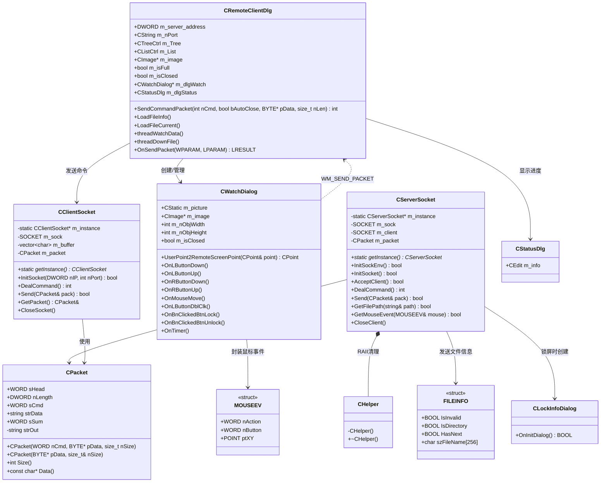
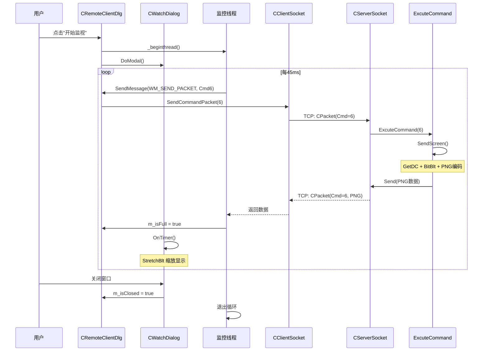
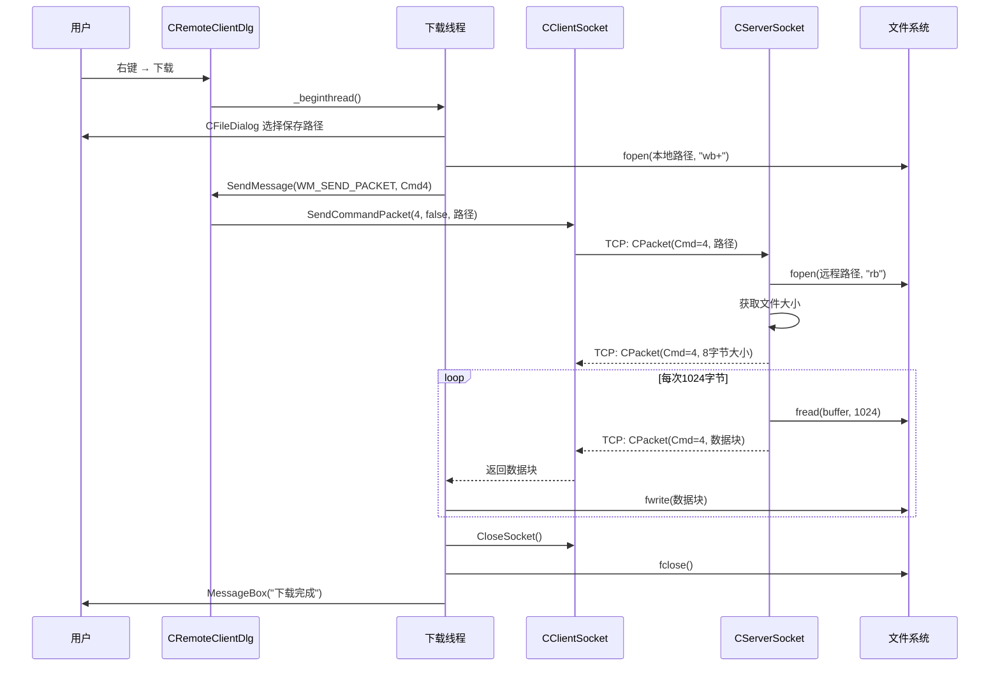
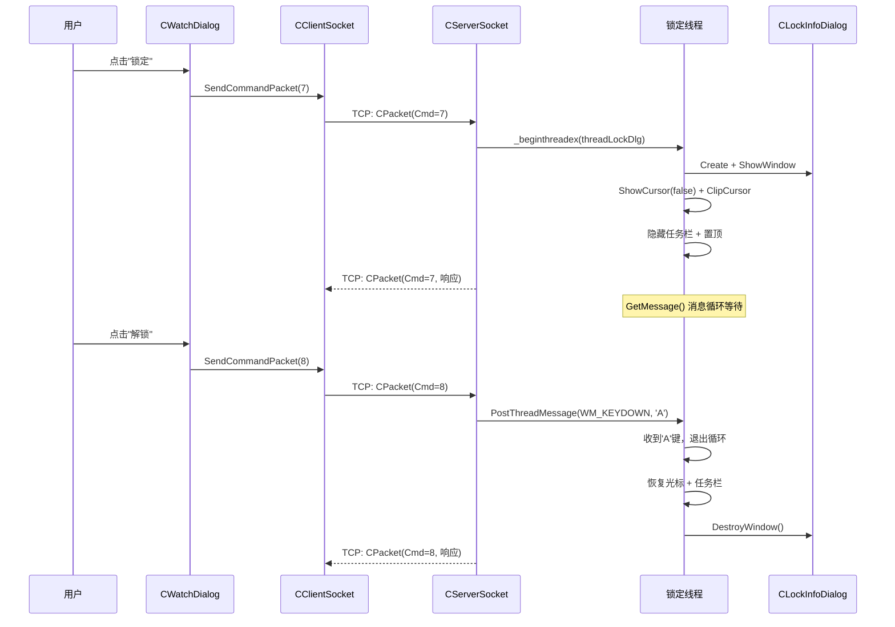
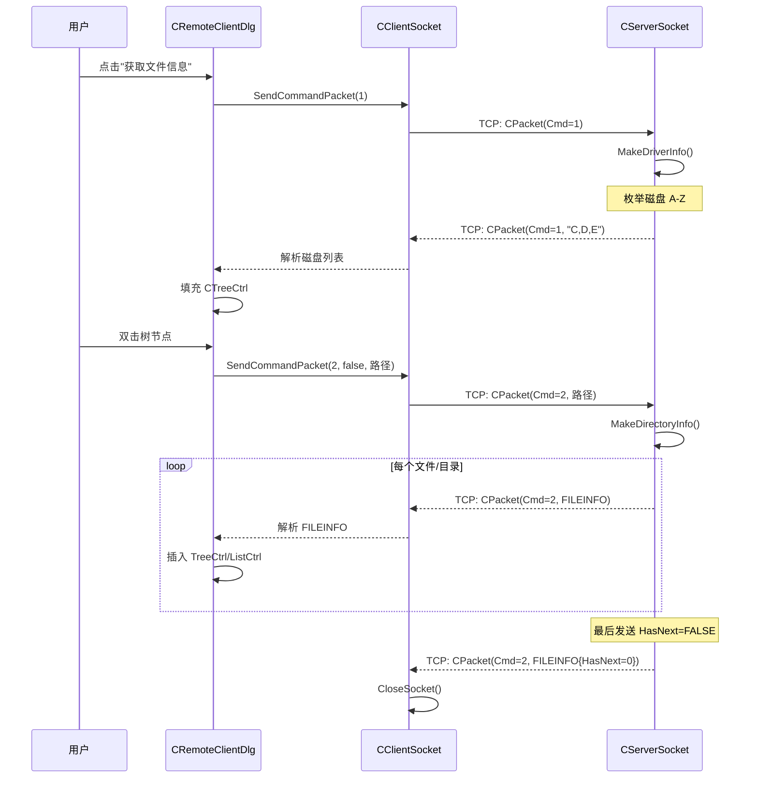
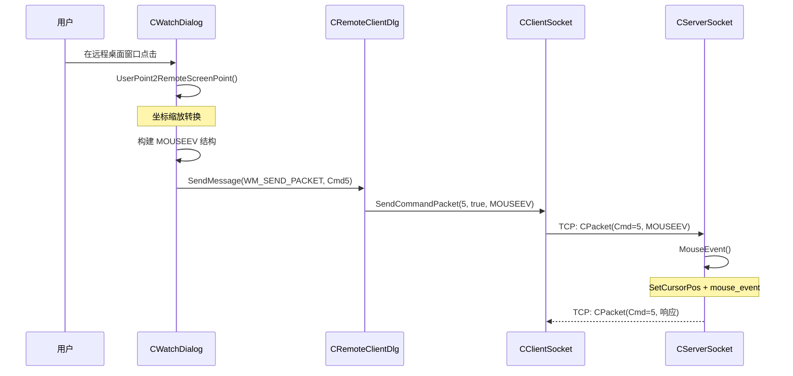

# 远控系统技术文档

## 一、项目概述

基于 Windows 平台的远程控制系统，采用 Client-Server 架构，使用 MFC 构建 UI，Winsock 实现网络通信。

| 项目 | 描述 |
|------|------|
| **RemoteCtrl** | 服务端（被控端），运行在目标机器，监听 9527 端口 |
| **RemoteClient** | 客户端（控制端），MFC 对话框应用，用于远程控制 |

---

## 二、功能列表

| 命令ID | 功能名称 | 描述 | 请求数据 | 响应数据 |
|--------|----------|------|----------|----------|
| 1 | 获取磁盘分区 | 枚举所有可用磁盘 | 无 | `"C,D,E,..."` |
| 2 | 获取目录列表 | 列出指定目录内容 | 路径字符串 | 多个 FILEINFO |
| 3 | 运行文件 | 远程执行指定文件 | 文件路径 | 无 |
| 4 | 下载文件 | 从服务端下载文件 | 文件路径 | 文件大小(8B) + 数据块 |
| 5 | 鼠标控制 | 远程控制鼠标事件 | MOUSEEV 结构 | 无 |
| 6 | 屏幕截图 | 获取远程桌面画面 | 无 | PNG 图像流 |
| 7 | 锁定机器 | 锁定被控端输入 | 无 | 无 |
| 8 | 解锁机器 | 解锁被控端输入 | 无 | 无 |
| 9 | 删除文件 | 删除远程文件 | 文件路径 | 无 |
| 1981 | 连接测试 | 心跳/测试连接 | 无 | 无 |

---

## 三、系统架构图

```
┌─────────────────────────────────────────────────────────────────────────┐
│                        RemoteClient (控制端)                             │
│  ┌─────────────────┐  ┌─────────────────┐  ┌─────────────────┐          │
│  │CRemoteClientDlg │  │  CWatchDialog   │  │   CStatusDlg    │          │
│  │  主界面/文件浏览  │  │ 远程桌面/鼠标控制  │  │    进度显示      │          │
│  └────────┬────────┘  └────────┬────────┘  └─────────────────┘          │
│           │                    │                                         │
│           └──────────┬─────────┘                                         │
│                      ▼                                                   │
│           ┌─────────────────────┐                                        │
│           │   CClientSocket     │ (Singleton)                            │
│           │   - 4MB 缓冲区       │                                        │
│           │   - CPacket 协议    │                                        │
│           └──────────┬──────────┘                                        │
└──────────────────────┼───────────────────────────────────────────────────┘
                       │ TCP Port 9527
                       ▼
┌──────────────────────┼───────────────────────────────────────────────────┐
│           ┌──────────┴──────────┐                                        │
│           │   CServerSocket     │ (Singleton)                            │
│           │   - 阻塞式监听       │                                        │
│           │   - CPacket 解析    │                                        │
│           └──────────┬──────────┘                                        │
│                      ▼                                                   │
│           ┌─────────────────────┐                                        │
│           │   ExcuteCommand()   │ 命令分发器                              │
│           └──────────┬──────────┘                                        │
│  ┌────┬────┬────┬────┼────┬────┬────┬────┬────┐                         │
│  │Cmd1│Cmd2│Cmd3│Cmd4│Cmd5│Cmd6│Cmd7│Cmd8│Cmd9│                         │
│  │磁盘 │目录│运行 │下载 │鼠标│屏幕 │锁定 │解锁│删除 │                         │
│  └────┴────┴────┴────┴────┴────┴────┴────┴────┘                         │
│                        RemoteCtrl (被控端)                               │
└──────────────────────────────────────────────────────────────────────────┘
```

---

## 四、UML 类图



---

## 五、网络协议

### 5.1 数据包格式

```
┌────────┬────────┬────────┬─────────────┬──────────┐
│ Header │ Length │Command │    Data     │ Checksum │
│  2B    │  4B    │  2B    │   N bytes   │   2B     │
│ 0xFEFF │        │        │             │ Σ(Data)  │
└────────┴────────┴────────┴─────────────┴──────────┘
```

| 字段 | 大小 | 说明 |
|------|------|------|
| Header | 2 bytes | 魔数 `0xFEFF`，标识包起始 |
| Length | 4 bytes | 数据长度 = sizeof(data) + 4 (含 Command 字段) |
| Command | 2 bytes | 操作类型 ID |
| Data | N bytes | 可变长度负载 |
| Checksum | 2 bytes | 所有 Data 字节之和 (WORD) |

**总包大小**: `nLength + 6` 字节

### 5.2 校验和算法

```cpp
sSum = 0;
for (size_t i = 0; i < strData.size(); i++) {
    sSum += BYTE(strData[i]) & 0xFF;
}
```

---

## 六、核心数据结构

### 6.1 鼠标事件 (MOUSEEV)

```cpp
typedef struct MouseEvent {
    WORD nAction;    // 0=单击, 1=双击, 2=按下, 3=释放
    WORD nButton;    // 0=左键, 1=右键, 2=中键, 4=无按键, 8=移动
    POINT ptXY;      // 坐标 (x, y)
} MOUSEEV;
// 共 12 字节
```

### 6.2 文件信息 (FILEINFO)

```cpp
typedef struct file_info {
    BOOL IsInvalid;       // 路径无效标志
    BOOL IsDirectory;     // -1=未知, 0=文件, 1=目录
    BOOL HasNext;         // 0=无更多, 1=有后续
    char szFileName[256]; // 文件/目录名
} FILEINFO;
// 共 268 字节 (pragma pack(1))
```

---

## 七、核心调用链

### 7.1 远程桌面监控调用链

```
用户点击"开始监视"
    │
    ▼
CRemoteClientDlg::OnBnClickedBtnStartWatch()
    ├── m_isClosed = false
    ├── _beginthread(threadEntryForWatchData, 0, this)  → 启动监控线程
    │       │
    │       ▼
    │   threadWatchData() [独立线程循环]
    │       ├── Sleep(45)                               → 45ms 刷新间隔
    │       ├── SendMessage(WM_SEND_PACKET, 6<<1|1)
    │       │       │
    │       │       ▼
    │       │   OnSendPacket() [消息处理]
    │       │       │
    │       │       ▼
    │       │   SendCommandPacket(6, true)
    │       │       ├── CClientSocket::InitSocket()
    │       │       ├── CPacket pack(6, NULL, 0)
    │       │       ├── pClient->Send(pack)             → TCP 发送
    │       │       └── pClient->DealCommand()          → 等待响应
    │       │               │
    │       │               ▼ [=== 网络传输 ===]
    │       │
    │       │   Server 端:
    │       │   DealCommand() → ExcuteCommand(6) → SendScreen()
    │       │       ├── GetDC(NULL)                     → 获取屏幕DC
    │       │       ├── BitBlt()                        → 截取屏幕
    │       │       ├── CImage::Save(IStream*, PNG)     → 编码PNG
    │       │       └── Send(CPacket(6, pngData, size)) → 发送
    │       │               │
    │       │               ▼ [=== 网络传输 ===]
    │       │
    │       ├── 解析PNG数据 → m_image
    │       ├── m_isFull = true                         → 通知UI线程
    │       └── 循环...
    │
    └── CWatchDialog::DoModal()                         → 显示监控窗口
            │
            ▼
        OnTimer(45ms) [UI线程定时器]
            ├── 检查 m_isFull
            ├── StretchBlt(m_image → 窗口)              → 缩放显示
            └── m_isFull = false
```

### 7.2 文件浏览调用链

```
用户点击"获取文件信息"
    │
    ▼
CRemoteClientDlg::OnBnClickedBtnFileinfo()
    └── SendCommandPacket(1, true)
            ├── CClientSocket::InitSocket(IP, Port)
            ├── CPacket pack(1, NULL, 0)
            ├── pClient->Send(pack)                     → TCP 发送
            └── pClient->DealCommand()                  → 等待响应
                    │
                    ▼ [=== 网络传输 ===]

    Server 端:
    DealCommand() → ExcuteCommand(1) → MakeDriverInfo()
        ├── 枚举磁盘 A-Z (_chdrive)
        ├── 拼接字符串 "C,D,E"
        └── Send(CPacket(1, result, size))
                │
                ▼ [=== 网络传输 ===]

    Client 端:
    解析 "C,D,E" → 填充 CTreeCtrl 磁盘节点
    │
    ▼
用户双击树节点
    │
    ▼
CRemoteClientDlg::OnNMDblclkTreeDir() → LoadFileInfo()
    ├── 从树结构构建完整路径
    ├── SendCommandPacket(2, false, pathData, pathLen)
    │       └── bAutoClose = false, 保持连接
    │               │
    │               ▼ [=== 网络传输 ===]
    │
    │   Server 端:
    │   ExcuteCommand(2) → MakeDirectoryInfo()
    │       ├── _chdir(路径)
    │       ├── _findfirst() / _findnext()
    │       ├── 每个文件: Send(CPacket(2, &fileinfo, sizeof))
    │       └── 最后一个: fileinfo.HasNext = FALSE
    │
    └── 循环 DealCommand() 直到 HasNext == FALSE
        ├── 目录 → 插入 CTreeCtrl
        └── 文件 → 插入 CListCtrl
```

### 7.3 文件下载调用链

```
用户右键文件 → "下载"
    │
    ▼
CRemoteClientDlg::OnDownloadFile()
    ├── _beginthread(threadEntryForDownFile, 0, this)
    │       │
    │       ▼
    │   threadDownFile() [独立线程]
    │       ├── CFileDialog 选择保存路径
    │       ├── fopen(localPath, "wb+")
    │       ├── 构建远程文件完整路径
    │       ├── SendMessage(WM_SEND_PACKET, 4<<1|0, path)
    │       │       │
    │       │       ▼
    │       │   SendCommandPacket(4, false, pathData, pathLen)
    │       │               │
    │       │               ▼ [=== 网络传输 ===]
    │       │
    │       │   Server 端:
    │       │   ExcuteCommand(4) → DownloadFile()
    │       │       ├── fopen(remotePath, "rb")
    │       │       ├── _ftelli64() 获取文件大小
    │       │       ├── Send(CPacket(4, &size, 8))      → 发送大小
    │       │       └── while 循环:
    │       │           ├── fread(buffer, 1, 1024, fp)
    │       │           └── Send(CPacket(4, buffer, rlen))
    │       │
    │       ├── 接收文件大小 (首个8字节)
    │       ├── while(received < fileSize)
    │       │   ├── pClient->DealCommand()
    │       │   └── fwrite(data, 1, len, localFile)
    │       │
    │       └── fclose() & CloseSocket()
    │
    └── m_dlgStatus.ShowWindow()                        → 显示进度
```

### 7.4 鼠标控制调用链

```
用户在监控窗口点击鼠标
    │
    ▼
CWatchDialog::OnLButtonDown(nFlags, point)
    ├── UserPoint2RemoteScreenPoint(point, rect)
    │       ├── 获取控件坐标和窗口坐标
    │       ├── 计算相对位置
    │       └── 缩放到远程分辨率:
    │           remoteX = point.x * m_nObjWidth / dialogWidth
    │           remoteY = point.y * m_nObjHeight / dialogHeight
    │
    ├── 构建 MOUSEEV 结构
    │       ├── nAction = 0 (单击)
    │       ├── nButton = 0 (左键)
    │       └── ptXY = 转换后坐标
    │
    └── SendMessage(WM_SEND_PACKET, 5<<1|1, &mouseEvent)
            │
            ▼
        OnSendPacket() → SendCommandPacket(5, true, &event, sizeof(MOUSEEV))
                │
                ▼ [=== 网络传输 ===]

        Server 端:
        ExcuteCommand(5) → MouseEvent()
            ├── 解析 MOUSEEV 结构
            ├── SetCursorPos(ptXY.x, ptXY.y)            → 移动光标
            └── mouse_event(MOUSEEVENTF_LEFTDOWN | UP)   → 模拟点击
```

### 7.5 锁机/解锁调用链

```
用户点击"锁定"
    │
    ▼
CWatchDialog::OnBnClickedBtnLock()
    └── SendMessage(WM_SEND_PACKET, 7<<1|1, NULL)
            │
            ▼ [=== 网络传输 ===]

    Server 端:
    ExcuteCommand(7) → LockMachine()
        └── _beginthreadex(threadLockDlg)               → 创建锁定线程
                ├── CLockInfoDialog::Create()
                ├── ShowWindow(SW_SHOW) 全屏
                ├── ShowCursor(false)                    → 隐藏光标
                ├── ClipCursor(1x1 rect)                → 冻结光标
                ├── 隐藏任务栏 (Shell_TrayWnd)
                ├── SetWindowPos(TOPMOST)                → 窗口置顶
                └── GetMessage() 消息循环等待

用户点击"解锁"
    │
    ▼
CWatchDialog::OnBnClickedBtnUnlock()
    └── SendMessage(WM_SEND_PACKET, 8<<1|1, NULL)
            │
            ▼ [=== 网络传输 ===]

    Server 端:
    ExcuteCommand(8) → UnlockMachine()
        └── PostThreadMessage(threadId, WM_KEYDOWN, 0x41, 0)
                │
                ▼
            锁定线程收到 'A' 键消息
                ├── ClipCursor(NULL)                     → 恢复光标
                ├── ShowCursor(true)                     → 显示光标
                ├── 恢复任务栏
                ├── DestroyWindow()
                └── _endthreadex(0)
```

---

## 八、时序图

### 8.1 远程桌面监控



### 8.2 文件下载



### 8.3 锁定与解锁



### 8.4 文件浏览



### 8.5 鼠标远程控制



---

## 九、线程模型

### 9.1 服务端线程模型

```
┌─────────────────────────────────────────────┐
│               主线程 (Main Thread)           │
│                                             │
│  while(true) {                              │
│      AcceptClient();    // 阻塞等待连接       │
│      DealCommand();     // 阻塞等待命令       │
│      ExcuteCommand();   // 处理命令          │
│      CloseClient();     // 关闭连接          │
│  }                                          │
└───────────────────┬─────────────────────────┘
                    │ Cmd 7 (锁定时创建)
                    ▼
┌─────────────────────────────────────────────┐
│              锁定线程 (Lock Thread)          │
│                                             │
│  _beginthreadex(threadLockDlg)              │
│  ├─ 创建全屏覆盖窗口 CLockInfoDialog        │
│  ├─ 冻结鼠标/隐藏光标/隐藏任务栏             │
│  └─ GetMessage() 消息循环等待 'A' 键         │
└─────────────────────────────────────────────┘
```

### 9.2 客户端线程模型

```
┌─────────────────────────────────────────────┐
│               主UI线程 (Main Thread)         │
│                                             │
│  ├─ MFC 消息循环 + 事件处理                  │
│  ├─ 定时器刷新 (OnTimer)                     │
│  └─ 处理子线程的 WM_SEND_PACKET 消息         │
└────────┬────────────────────────┬───────────┘
         │                        │
         ▼                        ▼
┌─────────────────────┐  ┌─────────────────────┐
│  监控线程 (Watch)    │  │  下载线程 (Download) │
│                     │  │                     │
│  while(!m_isClosed) │  │  ├─ 接收文件大小     │
│  {                  │  │  └─ while 循环:      │
│    Sleep(45ms);     │  │      DealCommand()  │
│    请求 Cmd 6;       │  │      fwrite()      │
│    m_isFull = true; │  │                     │
│  }                  │  │                     │
└─────────────────────┘  └─────────────────────┘

同步机制:
├─ m_isFull   (bool) → 监控线程通知UI线程刷新
├─ m_isClosed (bool) → UI线程通知监控线程退出
└─ SendMessage        → 跨线程调用主线程方法
```

---

## 十、设计模式

| 模式 | 应用位置 | 说明 |
|------|----------|------|
| **单例模式 (Singleton)** | CServerSocket, CClientSocket | 全局唯一网络连接实例，通过 `getInstance()` 获取 |
| **命令分发 (Command Dispatcher)** | `ExcuteCommand()` | switch/case 根据命令ID分发到对应处理函数 |
| **观察者模式 (Observer)** | m_isFull 标志 + OnTimer | 监控线程生产数据，UI线程定时消费 |
| **RAII** | CHelper 辅助类 | CServerSocket 内部类，析构时自动释放单例和 Winsock 资源 |
| **二进制协议 (Binary Protocol)** | CPacket | `#pragma pack(1)` 紧凑内存布局，序列化/反序列化 |

---

## 十一、文件结构

```
RemoteCtrl/
├── RemoteCtrl/                  # 服务端 (被控端)
│   ├── RemoteCtrl.cpp           # 主入口 + 9种命令处理器 (555行)
│   ├── ServerSocket.h           # TCP服务器 + CPacket协议定义
│   ├── ServerSocket.cpp         # Socket 实现
│   ├── LockInfoDialog.h/cpp     # 锁屏UI覆盖层
│   └── RemoteCtrl.vcxproj
│
├── RemoteClient/                # 客户端 (控制端)
│   ├── RemoteClientDlg.h/cpp    # 主UI：文件浏览 + 线程管理 (627行)
│   ├── CWatchDialog.h/cpp       # 远程桌面 + 鼠标控制 (~280行)
│   ├── CClientSocket.h/cpp      # TCP客户端 + CPacket协议
│   ├── StatusDlg.h/cpp          # 进度对话框
│   └── RemoteClient.vcxproj
│
├── RemoteCtrl.sln               # VS 2022 Solution 文件
└── CLAUDE.md                    # 项目说明文档
```

---

## 十二、已修复的 Bug

| Bug | 原因 | 修复方案 |
|-----|------|---------|
| 64位句柄截断 | `_findfirst` 返回 `intptr_t`，用 `int` 存储导致截断 | 使用 `intptr_t hfind` |
| 文件下载不完整 | `rlen > 1024` 判断逻辑错误，永远为假 | 改为 `rlen >= 1024` |
| 连接意外断开 | 无条件调用 `CloseSocket()` | 添加 `bAutoClose` 条件控制 |
| 监视窗口崩溃 | 反复打开时 CImage 资源未正确释放 | 正确管理 CImage 生命周期 |
| 回车键关闭对话框 | MFC 默认按钮行为 | 重写 `PreTranslateMessage` |
| 鼠标坐标偏移 | 坐标转换未考虑控件偏移和缩放比 | 完善 `UserPoint2RemoteScreenPoint` |
| 解锁命令号错误 | 服务端应答时命令号写错 | 修正为 Cmd 8 |

---

## 十三、已知问题与改进建议

| 问题 | 描述 | 建议改进 |
|------|------|---------|
| **紧耦合** | 网络通信直接调用 UI 方法 | 引入消息队列或回调接口解耦 |
| **单客户端** | 阻塞式只能处理一个连接 | 使用 select/IOCP 多路复用 |
| **无加密** | 明文 TCP 传输 | 添加 TLS/SSL 加密层 |
| **无认证** | 任意客户端可连接 9527 端口 | 添加口令/证书认证机制 |
| **竞态条件** | `m_isFull` / `m_isClosed` 无锁访问 | 使用互斥锁或 `std::atomic` |
| **缓冲区限制** | 4MB 固定大小可能溢出 | 动态扩展或分块处理 |
| **硬编码解锁键** | 锁定线程硬编码 0x41 ('A') | 改为可配置或使用专用解锁协议 |

---

## 十四、Windows API 依赖

| 模块 | API | 用途 |
|------|-----|------|
| **Winsock** | `WSAStartup`, `socket`, `bind`, `listen`, `accept`, `connect`, `recv`, `send` | 网络通信 |
| **GDI+/CImage** | `GetDC`, `BitBlt`, `StretchBlt`, `CImage::Save/Load` | 屏幕截图与显示 |
| **MFC** | `CDialog`, `CTreeCtrl`, `CListCtrl`, `CEdit`, `CStatic` | UI 框架 |
| **Win32** | `SetCursorPos`, `mouse_event`, `ClipCursor`, `ShowWindow`, `ShowCursor` | 鼠标/窗口控制 |
| **文件系统** | `_findfirst`, `_findnext`, `fopen`, `fread`, `fwrite`, `_ftelli64` | 文件操作 |
| **线程** | `_beginthread`, `_beginthreadex`, `PostThreadMessage`, `GetMessage` | 多线程 |

---

## 十五、相关笔记

- [[2.1 网络编程基本设计]] - Winsock 初始化、socket/bind/listen/accept
- [[2.2 网络编程架构设计]] - CServerSocket 单例模式、CHelper 自动释放
- [[2.3 设计网络传输包协议]] - CPacket 完整实现、协议格式、粘包处理
- [[2.4 获取磁盘分区信息]] - GetLogicalDriveStrings、命令处理框架
- [[2.5 获取指定文件目录下的文件和文件夹]] - _findfirst/_findnext、FILEINFO
- [[2.6 文件打开与下载]] - 分块传输、线程模式
- [[2.7 鼠标消息处理]] - MOUSEEV 结构、坐标转换
- [[2.8 屏幕截屏与发送]] - GetDC/BitBlt、CImage PNG编码
- [[2.9 机器锁定解锁]] - CLockInfoDialog、ClipCursor、任务栏隐藏
