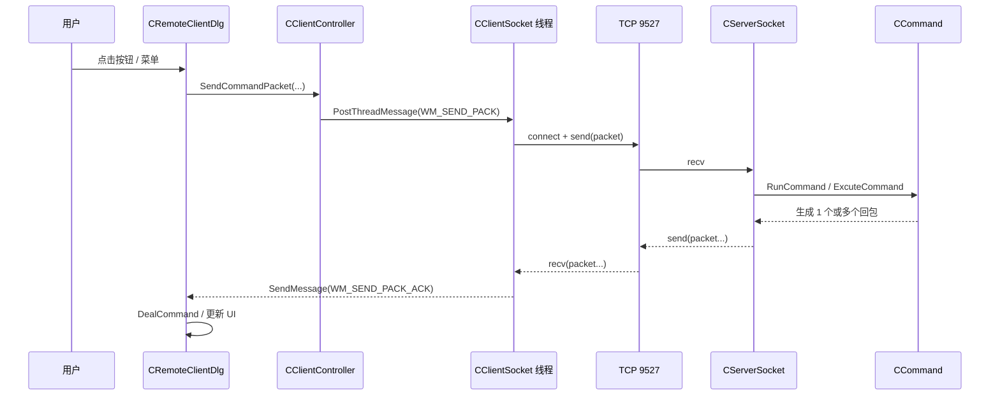
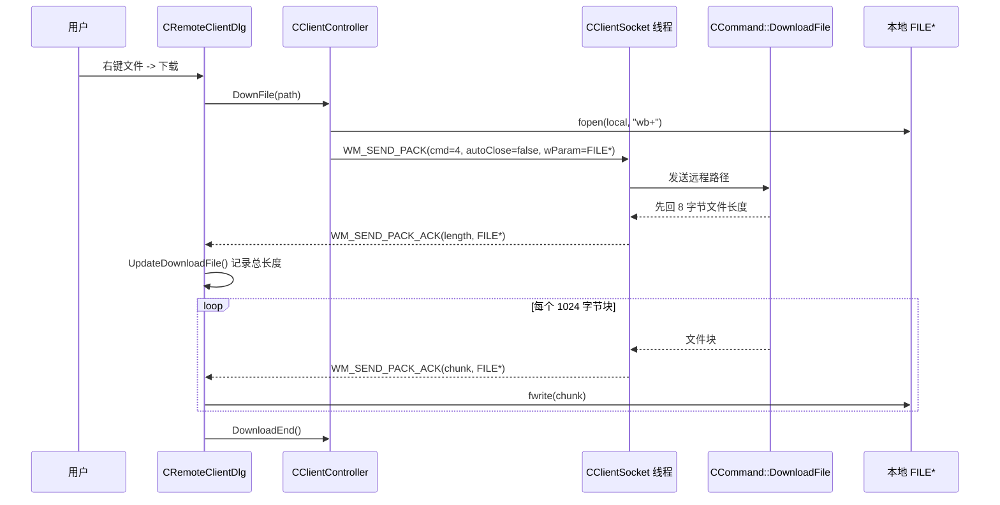
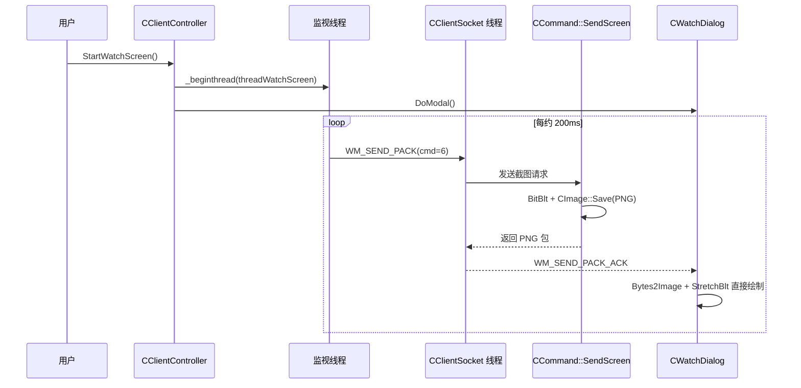

---
tags:
  - Remote Control System
  - cpp
  - windows
  - review
  - architecture
  - thread
  - network
created: 2026-04-22
updated: 2026-04-22
git: "91e9798"
git_msg: "1. Completed the basic principle demonstration code for UDP hole punching"
aliases:
  - 远控系统最终版总览
  - RemoteCtrl final overview
---

# 远控系统最终版全景复盘

> 先给结论：这份“最终版”不是一套已经收尾的统一架构，而是 **经典 TCP 远控主线 + IOCP 重构实验线 + UDP 穿透演示线** 三条线并存的学习型代码库。真正功能最完整、最值得逐段吃透的是经典 TCP 主线；IOCP 线的价值在于并发模型和所有权实验；UDP 线的价值在于说明项目在最后阶段把入口切到了新的研究方向。
> 关联细分笔记：[[2.1 网络编程基本设计]] · [[2.3 设计网络传输包协议]] · [[2.6 文件打开与下载]] · [[2.8 屏幕截屏与发送]] · [[2.9 远控架构和基本设计 - 总结]] · [[7.9 EdoyunThread 调度模型与 IOCP 网络编程启动骨架]] · [[8.1 IOCP Server Architecture — EdoyunServer Initial Design]] · [[8.2 IOCP Recv Chain — AcceptWorker Wires WSARecv]] · [[9.3 UDPHole]]

![[图片/SVG/remotectrl-final-overview-01.svg]]

## 1. 这份“最终版”现在到底是什么状态

| 观察项 | 当前状态 | 我对它的判断 |
|---|---|---|
| 经典 TCP 远控主线 | 功能最完整 | 已经形成完整的控制端/被控端/协议/命令分发/功能处理链，最适合系统学习。 |
| IOCP 重构实验线 | 半成品实验 | 架子已经搭起来，能学到 AcceptEx、完成端口、任务分发、发送队列，但还没有取代主线。 |
| UDP 穿透演示线 | 当前默认入口 | `main(argc, argv)` 已经切到 UDP 多角色骨架，但真实 NAT 洞穿、信令与健壮性还没补齐。 |
| 项目定位 | 学习 demo | 它的价值不是“立刻商用”，而是把 Windows/MFC/Winsock/线程/API 机制串成一个可观察的案例。 |
| 本机构建现状 | 受环境阻塞 | 我实测 `Debug|x64` 构建卡在 `Path/PATH` 重复环境变量，MSBuild 在启动 `CL.exe` 前就报错，暂时不是源码语法错误。 |

我建议把这份项目当成“阶段成果的合集”来看，而不是当成“一套最终定型产品”来看。这样很多看上去“不统一”的地方就能读懂了：它不是乱，而是多次学习与重构痕迹都被保留下来了。

## 2. 项目结构应该怎么读

先看目录职责：

| 位置 | 角色 | 阅读重点 |
|---|---|---|
| `RemoteCtrl/RemoteClient/` | 控制端 | MFC UI、命令发起、下载状态、截图显示、鼠标映射、锁机按钮。 |
| `RemoteCtrl/RemoteCtrl/` | 被控端 | 阻塞式 TCP 服务端、协议解析、命令分发、文件/屏幕/鼠标/锁机处理。 |
| `RemoteCtrl/RemoteCtrl/Edoyun*.h/.cpp` | IOCP 实验线 | 完成端口、AcceptEx、工作线程封装、发送队列、重叠结构体生命周期。 |
| `RemoteCtrl/RemoteCtrl/RemoteCtrl.cpp` | 当前统一入口 | 需要同时看“注释掉的旧主线”和“当前默认的 UDP 分支”。 |
| `6.项目/远控系统/` | 知识库 | 阶段性机制拆解笔记比源码更容易讲清“为什么这样写”。 |

推荐阅读顺序：

1. 先把经典 TCP 主线吃透。
2. 再去看 IOCP 线如何尝试升级并发模型。
3. 最后回头看 UDP 线，理解为什么项目在最后把默认入口切到了新的实验方向。

![[图片/SVG/remotectrl-final-architecture-02.svg]]

## 3. 经典 TCP 主线：这才是最值得反复学习的一条线

### 3.1 协议层怎么写

核心协议在 `RemoteCtrl/RemoteCtrl/Packet.h:7` 一带，客户端在 `RemoteCtrl/RemoteClient/CClientSocket.h:15` 一带又复制了一份同构实现。包格式很简单：

- `WORD sHead = 0xFEFF`：包头魔数，用来在字节流里找起点。
- `DWORD nLength`：从命令字到校验和的长度。
- `WORD sCmd`：命令号。
- `strData`：变长载荷。
- `WORD sSum`：一个很轻量的字节和校验。

这段实现最值得学的地方不是“协议设计得多高级”，而是它把最核心的三个问题都碰到了：

- **如何在 TCP 字节流里切包**：构造函数 `CPacket(const BYTE* pData, size_t& nSize)` 会先扫包头，再根据 `nLength` 判断包是否收全。
- **如何处理半包**：如果没收够，直接把 `nSize` 置 0，让上层继续等更多字节。
- **如何把结构化命令变回字节流**：`Data()` 把头、长度、命令、数据、校验和重新拼起来。

这套协议的教学价值很高，因为它把“粘包/半包/二进制协议/校验”这几件最基础的网络编程问题都落到了一个足够短的小类里。

但它也有明显工程短板：

- 协议代码在客户端和服务端各复制一份，后续改字段时非常容易不同步。
- 校验和过弱，只能挡很初级的数据错误，不能防篡改。
- 使用 `#pragma pack(1)`、裸指针强转和结构体内存布局，平台耦合很重。
- 没有版本字段，没有请求 ID，也没有真正的错误码语义。

### 3.2 服务端网络链怎么组织

服务端主循环在 `RemoteCtrl/RemoteCtrl/ServerSocket.h:25` 附近，组织方式非常直接：

1. `InitSocket(port)` 做 `bind + listen`。
2. `AcceptClient()` 阻塞等连接。
3. `DealCommand()` 在连接上收一条命令。
4. 回调 `CCommand::RunCommand()` 做命令分发。
5. 把回包列表逐个 `send` 回去。
6. `CloseClient()` 结束本次会话。

这个设计最适合教学的点是：**层次非常干净**。

- `CServerSocket` 只关心 socket 生命周期、收包、发包、连接关闭。
- `CCommand` 只关心命令语义和具体功能。
- `SOCKET_CALLBACK` 把“网络层”与“业务层”用一个非常轻的接口接上了。

也正因为这样，你读 `ServerSocket` 时不容易被业务逻辑打断；读 `Command` 时也不容易被 socket 细节打断。这种分层对初学阶段特别友好。

### 3.3 客户端链怎么组织

控制端不是直接在每个对话框里乱调 socket，而是形成了三层：

- **UI 层**：`CRemoteClientDlg`、`CWatchDialog`、`CStatusDlg`
- **协调层**：`CClientController`
- **网络层**：`CClientSocket`

`CClientController` 的价值在于把“命令发起”和“线程编排”集中起来。`CClientSocket` 的价值在于把 `PostThreadMessage -> SendPack -> WM_SEND_PACK_ACK` 这一套 Windows 消息驱动的异步通信过程封装掉。

这条链里很值得学习的一点是：**它没有让子线程直接去乱碰 MFC UI，而是尽量通过消息把结果弹回窗口线程**。对于 Win32/MFC 项目，这是一种非常有现实感的做法。

但这条链也有一个重要现象：**同步风格和异步风格并存**。

- `WM_SEND_PACK_ACK` 是新一些的异步 ACK 路线。
- `LoadFileCurrent()` 又还保留了直接 `SendCommandPacket()` 后立刻 `DealCommand()` 的旧式同步读包路线。

这说明项目处在“重构过渡态”，不是彻底统一过的最终产品态。

## 4. 线程调度：谁在阻塞，谁在发消息，谁在收 ACK

这个项目真正有价值的地方之一，是它把“Windows 桌面程序里的多线程协作”暴露得很清楚。

| 线程 | 所属 | 职责 | 观察重点 |
|---|---|---|---|
| 服务端主线程 | `RemoteCtrl` | `accept -> recv -> dispatch -> send -> close` | 简单、稳定，但吞吐量低，只适合单连接 demo。 |
| 锁机线程 | `CCommand::threadLockDlgMain()` | 创建全屏锁定对话框、隐藏任务栏、限制鼠标、跑消息循环 | 很适合学习 `PostThreadMessage`、`GetMessage`、UI 线程归属。 |
| 客户端 UI 线程 | `RemoteClient` | 持有所有对话框和控件 | MFC 程序里一切 UI 最终都要回到这里。 |
| 客户端 socket 消息线程 | `CClientSocket::threadFunc2()` | 接收 `WM_SEND_PACK`，执行网络发送与 ACK 投递 | 这是客户端网络层真正的“调度中枢”。 |
| 客户端监视线程 | `CClientController::threadWatchScreen()` | 周期性请求截图 | 体现了“工作线程只负责触发，不直接碰 UI”的思路。 |

### 4.1 一次普通命令往返的线程与消息路径

### 4.2 文件下载的线程与数据流

### 4.3 远程监视的当前实现路径

这里有一个很关键的“现状判断”：**当前最终版的截图显示，已经不是早期笔记里那种 `Timer + m_isFull` 双缓冲消费模型，而是 ACK 到达后直接在 `OnSendPackAck` 里解码并绘制。** 这意味着旧笔记里的某些时序描述，阅读时要和当前代码区分开。

## 5. 网络通信、文件传输、屏幕监控分别是怎么写的

### 5.1 目录与文件浏览

这条链最典型的命令是 `1` 和 `2`：

- `Cmd 1`：服务端枚举磁盘分区，控制端生成根节点。
- `Cmd 2`：控制端传路径，服务端 `_chdir + _findfirst/_findnext` 枚举目录项，再一条条返回 `FILEINFO`。

这套写法最值得学的是：**把“目录项流”设计成多个小包，而不是一次性打一个大 JSON/大缓冲区回去**。这样更容易直观理解“流式应答”和“HasNext 收尾”。

### 5.2 文件下载

下载命令 `4` 的设计非常朴素，但教学价值很高：

1. 先发远程路径。
2. 服务端先回文件总长度（8 字节）。
3. 服务端每次 `fread(1024)`，封装成一个 `Cmd 4` 数据包回给控制端。
4. 控制端在 `UpdateDownloadFile()` 里按块 `fwrite()` 到本地文件。

它的优点是：

- 非常容易理解。
- 对新手来说，“先长度、后数据块”的思路很清晰。
- 让你自然意识到“下载状态”和“网络收包”是两个状态机。

它的短板也很明显：

- 1 KB 固定块太小，效率一般。
- 没有断点续传。
- 没有块级校验，也没有整体校验。
- 没有统一的下载上下文对象，而是直接把 `FILE*` 借消息参数传来传去。
- `UpdateDownloadFile()` 用静态 `length/index`，天然不适合并发下载。

### 5.3 屏幕监控

截图命令 `6` 的主干在 `RemoteCtrl/RemoteCtrl/Command.h:316` 附近：

- `GetDC(NULL)` 拿屏幕 DC。
- `BitBlt()` 把整屏内容拷到 `CImage`。
- `CreateStreamOnHGlobal + CImage::Save(ImageFormatPNG)` 把图像编码成 PNG 字节流。
- 再用 `CPacket(6, pData, nSize)` 把整张图发回控制端。

这条链的教学价值在于它把 **GDI 截屏、内存流、PNG 编码、网络字节流传输** 串成了一条完整链路。对 Windows 图形编程初学者来说，这比只看 API 手册有效得多。

### 5.4 鼠标控制

鼠标控制命令 `5` 把远端交互拆成两步：

1. 控制端在 `CWatchDialog` 里做坐标换算，把当前图片控件上的点击坐标映射到远端真实屏幕坐标。
2. 服务端收到 `MOUSEEV` 后，先 `SetCursorPos`，再根据 `nButton/nAction` 去决定是否触发 `mouse_event()`。

这段代码很适合拿来理解“显示坐标系”和“真实设备坐标系”不是一回事，也很适合理解“协议字段设计一旦模糊，后续事件语义会越来越难维护”。

### 5.5 锁机与解锁

锁机链最适合从 Win32 机制角度来学：

- `LockMachine()` 并不是直接在服务端主线程上弹一个对话框，而是拉起专门的锁机线程。
- 这个线程创建 `CLockInfoDialog`，把窗口设成 topmost，隐藏任务栏，`ClipCursor()` 把鼠标限制在 1x1 小矩形里，再跑自己的消息循环。
- `UnlockMachine()` 并不是直接销毁窗口，而是 `PostThreadMessage(threadid, WM_KEYDOWN, 0x41, 0)` 给那个线程发一个退出信号。

这段代码特别值得初学者反复看，因为它体现了：

- 为什么 UI 资源通常要归线程所有。
- 为什么 `PostThreadMessage` 和 `GetMessage` 的配合能构成“线程级控制通道”。
- 为什么 Win32 里的“线程、窗口、消息泵”其实是一套东西。

## 6. 这份项目里最有学习价值的技术点

我认为最值得反复拆开的，不是“功能点有多少”，而是下面这些机制：

- **自定义二进制协议**：足够小，刚好能学会切包、半包、命令字和校验。
- **阻塞式服务端到命令分发器的分层**：让你理解网络层和业务层应该怎么松耦合。
- **MFC 对话框 + 控制器 + socket 线程的协作方式**：这是很典型的 Windows 桌面程序写法。
- **文件下载状态机**：先长度、后块流，再在 UI 端做写盘和收尾。
- **GDI/CImage 截图链**：把屏幕采集、PNG 编码、网络传输串起来。
- **消息驱动的线程切换**：`PostThreadMessage`、`SendMessage`、`WM_SEND_PACK_ACK` 都很有代表性。
- **Win32 锁机机制**：`ClipCursor`、`ShowCursor`、`Shell_TrayWnd`、线程消息泵。
- **IOCP 实验线里的完成端口思维**：哪怕它没收尾，也足够让你把“阻塞 accept 服务器”和“完成端口服务器”放在同一脑图里比较。
- **UDP 分支里的角色拆分思路**：虽然还没完成真打洞，但它已经把“父进程/协调者/多客户端角色”这个实验舞台搭起来了。

## 7. IOCP 实验线：应该怎么理解它的价值

IOCP 线的关键不是“它现在能不能替代主线”，而是它把下面这些难点提前暴露出来了：

- 一个 `SOCKET` 关联到完成端口以后，I/O 完成如何通过 `OVERLAPPED` 反推出“这次操作是谁发起的”。
- `AcceptEx` 之后，为什么要补 `BindNewSocket()`，以及为什么 `RecvOverlapped`/`SendOverlapped` 需要和 client 上下文绑定。
- 为什么线程池不应该只是“创建一堆线程”，而是要有明确的任务对象与生命周期语义。
- 为什么发送队列一旦做成异步，就会立刻碰到“所有权、缓冲区、回收时机、重入”这些真正的并发问题。

如果你是从经典 TCP 主线一路读过来的，那么 IOCP 线最大的学习收益是：**你终于会意识到，并发升级不是把 `recv` 改成 `WSARecv` 这么简单，而是整个对象图、缓冲区所有权和线程协作方式都要重新设计。**

## 8. UDP 分支：它不是“完成品”，但非常值得单独讲

当前默认入口在 `RemoteCtrl/RemoteCtrl/RemoteCtrl.cpp:76` 附近，已经切到 `main(argc, argv)` 驱动的 UDP 多角色分支：

- `argc == 1`：父进程，负责再拉起两个子进程。
- `argc == 2`：主客户端。
- `argc > 2`：子客户端。

但要特别注意：**这条线现在更像“实验舞台搭建完成”，而不是“真实 UDP 打洞已经完成”。**

我对它的判断是：

- 角色分裂思路有价值。
- `CreateProcessA` 把同一个 exe 变成多个角色，这一点很适合做本地 NAT 打洞实验的前期编排。
- 但 `udp_server()` / `udp_client()` 还远没有进入完整的公网洞穿实现阶段。
- 所以阅读时应该把它当成“下一阶段研究的入口”，不是当成“现有主功能链的替代者”。

更详细的原理和代码骨架，建议直接看：

- [[9.1 UDP穿透原理]]
- [[9.2 UDP穿透]]
- [[9.3 UDPHole]]

## 9. 当前源码里还能直接看到的 bug、风险与后续优化点

下面这些是我在当前代码里直接能看到、而且值得单独记录的遗留问题。这里我把“主线问题”和“实验线问题”分开写。

### 9.1 经典 TCP 主线里的当前问题

| 位置 | 问题 | 影响 | 建议 |
|---|---|---|---|
| `Command.h:331-344` | `CreateStreamOnHGlobal(hMem, TRUE, &pStream)` 后又 `GlobalFree(hMem)`，而且 `pStream->Release()` 被无条件调用 | `SendScreen()` 存在双重释放和空指针释放风险 | 让 stream 独占 `HGLOBAL` 后，不要再手动 `GlobalFree`；同时只在 `pStream != NULL` 时 `Release`。 |
| `CWatchDialog.cpp:151-163` | `OnLButtonDblClk()` 把双击写成了 `nAction = 2` | 左键双击语义和协议定义不一致，发送出去更像“按下”而不是“双击” | 改成 `nAction = 1`。 |
| `RemoteClientDlg.cpp:220-224` | `case 7/8/9` 都共用 “File deletion completed” 提示 | 锁机、解锁、删除文件的用户提示完全混乱 | 把不同 ACK 的文案分开。 |
| `Command.h:376-384` | `DeleteLocalFile()` 先做了宽字符转换，但最终仍调用 `DeleteFileA(strPath.c_str())` | 中文/Unicode 路径删除不可靠 | 统一走宽字符路径。 |
| `Command.h:130-166` | `MakeDirectoryInfo()` 没有 `_findclose(hfind)`，并且依赖 `_chdir()` 改进程当前目录 | 有句柄泄漏风险，也让目录遍历依赖进程级全局状态 | 补 `_findclose`，并改成基于完整路径的遍历。 |
| `RemoteClientDlg.cpp:324-357` | `UpdateDownloadFile()` 用静态 `length/index` 保存状态 | 同时下载多个文件或中途异常重入会出错 | 把下载状态移入独立上下文对象。 |
| `CWatchDialog.h:32-46` + `ClientController.cpp:126-151` | `m_isFull` 在当前代码里几乎没有真正参与背压控制 | 监视线程会持续按固定节奏发请求，难以根据 UI 消费能力做节流 | 要么恢复真正的缓冲状态机，要么改成显式“上一帧 ACK 后再发下一帧”。 |
| `CClientSocket.h:196-203` | `PACKET_DATA::operator=` 没有 `return *this;` | 这是典型未定义行为，虽然现在不一定立刻炸 | 补全返回值。 |

### 9.2 经典主线里的结构性技术债

| 位置 | 技术债 | 为什么现在还能忍 | 真要收尾时必须怎么做 |
|---|---|---|---|
| `Packet.h` 与 `CClientSocket.h` | 协议定义重复两份 | demo 阶段改得不频繁，维护成本暂时可接受 | 提取共享协议头或共享静态库。 |
| `ServerSocket.h` | 单线程、单客户端、阻塞式主循环 | 代码最短、最好讲 | 如果要继续做，就要选定“长连接事件驱动”还是“IOCP 重构”。 |
| `CClientSocket.cpp` | 每次命令都重新 connect，截图也是一帧一连 | 便于理解会话边界 | 实际上会拖累监视链效率，应该有更稳定的会话模型。 |
| `RemoteClientDlg.cpp` | 同步路径和异步路径并存 | 能兼容旧代码 | 最终一定要统一成一种通信模型。 |

### 9.3 IOCP/UDP 实验线里的当前问题

| 位置 | 问题 | 影响 | 建议 |
|---|---|---|---|
| `EdoyunServer.cpp:63-74` | `EdoyunClient::m_used` 没有初始化 | `Recv()` 里缓冲区写入偏移不确定 | 构造函数显式清零。 |
| `EdoyunServer.cpp:88-105` | `WSABUF` 没看到成体系初始化 | `WSARecv/WSASend` 的实际缓冲区语义不稳定 | 在 overlapped 构造时统一设置 `buf/len`。 |
| `EdoyunServer.cpp:130-141` | `SendData()` 并没有把 `data` 真正拷进发送缓冲区 | 发送队列概念有了，但真实发送链还没闭合 | 统一发送缓冲区所有权与回收策略。 |
| `EdoyunThread.h:198-218` | `EdoyunThreadPool::Invoke()` 成功路径没有返回值 | 典型 UB | 显式 `return true;`。 |
| `RemoteCtrl.cpp:100-103` | `strCmd += "2"` 和第二次 `CreateProcessA` 结果未回写 `bRet` | UDP 角色拆分逻辑不稳，第二个子进程身份不清楚 | 改成清晰的角色参数，如 `server/host/peer`。 |

### 9.4 本机构建阻塞项

我在这次观察里实际跑了 `Debug|x64` 构建。当前这台机器上的失败点不是源码编译错误，而是：

- 环境里同时存在 `Path` 和 `PATH`
- MSBuild 在准备启动 `CL.exe` 时就报 `System.ArgumentException`
- 所以现在没法仅凭这次构建结果去判断源码是否还有新的编译错误

这件事应该单独看待：**它是当前机器环境问题，不等于项目本身一定已经编不过。**

## 10. 如果把这个项目继续收尾，我会怎么优化

如果以“把这份 demo 收成一份更像样的教学作品”为目标，而不是直接商用，我建议按下面顺序推进：

1. 先明确入口角色，把 `main()` 的 TCP/IOCP/UDP 关系讲清楚，不要再让默认入口和主功能链脱节。
2. 把客户端通信模型统一掉，结束“同步 `DealCommand()` 和异步 `WM_SEND_PACK_ACK` 并存”的过渡状态。
3. 把协议层抽成共享头文件，避免客户端和服务端各维护一份 `CPacket`。
4. 修掉截图链、下载状态机、左键双击、删除提示、Unicode 路径这些低层 bug。
5. 给监视链补节流和帧背压，避免请求队列无意义堆积。
6. 如果继续做并发升级，就明确站队 IOCP 线，不要再同时维护两套并发模型的半成品。
7. UDP 打洞最好拆成独立实验模块或独立工程，不要继续和经典 TCP 主线共用一个越来越复杂的入口文件。
8. 最后再考虑认证、日志、错误码、配置文件和更稳的状态机；否则它永远只能是“能跑的实验”，很难变成“能讲清楚的系统”。

## 11. 我最建议你反复看的代码锚点

- `RemoteCtrl/RemoteCtrl/Packet.h:7`：`CPacket`，把协议切包问题看透。
- `RemoteCtrl/RemoteCtrl/ServerSocket.h:25`：`Run()` 主循环，理解阻塞式服务端的控制骨架。
- `RemoteCtrl/RemoteCtrl/Command.h:130`：目录遍历；`177`：文件下载；`316`：截图；`348`：锁机；`361`：解锁。
- `RemoteCtrl/RemoteClient/ClientController.cpp:72`：统一发送入口；`116`：监视线程启动；`126`：监视线程节奏。
- `RemoteCtrl/RemoteClient/CClientSocket.cpp:129`：`SendPacket()`；`285`：`SendPack()`，看 ACK 回投机制。
- `RemoteCtrl/RemoteClient/RemoteClientDlg.cpp:324`：下载状态机；`360`：目录树加载；`521`：ACK 进入 UI。
- `RemoteCtrl/RemoteClient/CWatchDialog.cpp:102`：截图 ACK 到达后的直接绘制；`151` 以后：鼠标事件映射。
- `RemoteCtrl/RemoteCtrl/EdoyunServer.cpp:158`：IOCP 服务启动；`199`：完成端口收包分发；`247`：`NewAccept()`。
- `RemoteCtrl/RemoteCtrl/EdoyunThread.h:62`：线程启动；`95`：任务更新；`198`：线程池整体拉起。
- `RemoteCtrl/RemoteCtrl/RemoteCtrl.cpp:76`：当前默认入口；`176`：UDP 服务端演示；`231`：UDP 客户端演示。

## 12. 最后一句总评

如果把“是否商用”这把尺子先放下，这个项目其实非常适合拿来练习三件事：

- **怎么把 Win32/MFC/Winsock 的真实 API 串成一条完整链路**
- **怎么从一个能跑的阻塞式模型，逐步意识到并发、生命周期和所有权的复杂度**
- **怎么从传统 TCP 远控主线，继续外扩到 IOCP 和 UDP 穿透这些更难的主题**

所以这份“最终版”最有价值的地方，不是它已经没有问题了，而是它已经把真正值得学习的问题几乎都暴露出来了。
