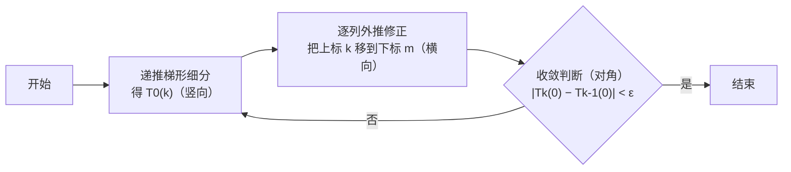

# 5.9 数值积分之龙贝格算法

> [!info] 考情（接 [[5.8.1 复化求积公式]]）
> - 龙贝格算法考频 **1/5，多为填空**：记住**变步长梯形递推公式**、**误差比 ≈ 4**、**三个外推组合式**与 **$3\varepsilon$ 停机准则**即可。
> - 它依赖的复化梯形/Simpson 误差公式见 [[5.8.1 复化求积公式]]，那部分是高频计算点。

复化公式要先定步长 $h$ 才能算，而精度要求往往无法直接换算成 $h$。龙贝格算法换个思路：**把区间不断二分，用前后两次结果之差估计误差**，差够小就停；同时让加密时复用已算过的函数值，并用外推加速收敛。

---

## 一、区间逐次分半与事后误差估计

做法：

1. 先用 2 个点算第一次梯形值 $T_n$；
2. 区间二分、加密到 $2n$ 段，算 $T_{2n}$（更精确）；
3. 用差 $T_{2n}-T_n$ 衡量误差，差小到给定程度就停。

这种「用已算出的近似值之差估误差」的做法叫**事后误差估计**，不需要真值 $I$。

---

## 二、变步长梯形递推公式（复用旧节点）

直接重算 $T_{2n}$ 要把 $2n+1$ 个点全算一遍。但二分后**旧节点仍是新网格的节点**，函数值可复用。把 $T_{2n}$ 的求和按下标奇偶拆开（偶数下标 = 老节点，奇数下标 = 新增中点）：

$$T_{2n}=\frac{b-a}{4n}\Big[f(a)+2\sum_{k=1}^{2n-1} f\!\Big(a+k\tfrac{b-a}{2n}\Big)+f(b)\Big]
=\frac{1}{2}T_n+\frac{b-a}{2n}\sum_{k=1}^{n} f\!\Big[a+(2k-1)\tfrac{b-a}{2n}\Big].$$

$$\boxed{\,T_{2n}=\frac{1}{2}T_n+\frac{b-a}{2n}\sum_{k=1}^{n} f\!\left[a+(2k-1)\frac{b-a}{2n}\right]\,}$$

即「**新梯形值 = 半个旧梯形值 + 新增中点的贡献**」，每步只算新增的 $n$ 个点，比从头重算**节省约一半运算量**。

按 $2^k$ 加密（等分数取 $1,2,4,8,\dots$）写成迭代式：

$$T_1=\frac{b-a}{2}[f(a)+f(b)],\qquad
T_{2^k}=\frac{1}{2}T_{2^{k-1}}+\frac{b-a}{2^k}\sum_{i=1}^{2^{k-1}} f\!\left[a+(2i-1)\frac{b-a}{2^k}\right].$$

用 $|T_{2^k}-T_{2^{k-1}}|<3\varepsilon$ 判停（$3\varepsilon$ 的来历见第四节）。

---

## 三、收敛速度问题：梯形递推偏慢

「迭代结果趋于稳定」即收敛，**越快稳定越好**，快慢就是收敛速度。梯形递推每加密一次要多算约一倍的点，而它收敛慢，于是运算量增长很快。

自然的想法：**能不能引入 Simpson、Cotes 之流来加速收敛？** 答案就在外推。

---

## 四、外推加速：组合 $T_n$ 与 $T_{2n}$ 得到 Simpson ⭐

### 误差比 ≈ 4

复化梯形余项 $I-T_n=-\dfrac{b-a}{12}h^2 f''(\eta)$，$h=\dfrac{b-a}{n}$。$n$ 段与 $2n$ 段相比，步长减半、误差变 $1/4$：

$$\frac{I-T_n}{I-T_{2n}}\approx 4\ \Longrightarrow\ I-T_{2n}\approx\frac13(T_{2n}-T_n).$$

### 外推公式

$$I\approx T_{2n}+\frac{1}{4-1}(T_{2n}-T_n)=\boxed{\ \frac{4}{3}T_{2n}-\frac{1}{3}T_n\ }$$

后一项 $\frac13(T_{2n}-T_n)$ 既是 $T_{2n}$ 的误差估计，又是把它修正得更准的增量。

### 这个组合恰好就是 Simpson

观察外推式的形态，把梯形表达式代回去验证（取 $n=1$，记 $m=\frac{a+b}{2}$）：

$$\tilde T=\frac43 T_2-\frac13 T_1
=\frac43\cdot\frac{b-a}{4}\big[f(a)+2f(m)+f(b)\big]-\frac13\cdot\frac{b-a}{2}\big[f(a)+f(b)\big]$$
$$=\frac{b-a}{6}\big[2f(a)+4f(m)+2f(b)-f(a)-f(b)\big]=\frac{b-a}{6}\big[f(a)+4f(m)+f(b)\big].$$

正是 **Simpson 公式**。

> [!important] Romberg 算法的基本思想
> 把梯形积分值 $T_n$ 与 $T_{2n}$ 适当组合（$\frac43 T_{2n}-\frac13 T_n$），结果就升级成 Simpson，精度更高。**适当组合前两次的求积结果以提高精度，就是 Romberg 算法的核心。**

---

## 五、三个外推组合式与龙贝格一般公式

外推依次往上做，每一级「下一级精度公式」都由本级**两次结果组合**而来：

$$S_n=\frac{4}{3}T_{2n}-\frac{1}{3}T_n\qquad(\text{复化 Simpson 由梯形组合})$$
$$C_n=\frac{16}{15}S_{2n}-\frac{1}{15}S_n\qquad(\text{复化 Cotes 由 Simpson 组合})$$
$$R_n=\frac{64}{63}C_{2n}-\frac{1}{63}C_n\qquad(\text{Romberg 由 Cotes 组合})$$

系数规律：组合式为 $\dfrac{4^m}{4^m-1}(\text{细}) -\dfrac{1}{4^m-1}(\text{粗})$，$m=1,2,3$ 分别给出 $\frac43/\frac13$、$\frac{16}{15}/\frac1{15}$、$\frac{64}{63}/\frac1{63}$。统一写成 **Romberg 求积一般公式**：

$$\boxed{\,T_m^{(k)}=\frac{4^m}{4^m-1}\,T_{m-1}^{(k+1)}-\frac{1}{4^m-1}\,T_{m-1}^{(k)}\,}$$

- 下标 $m$ = 外推次数/列号（$0$ 梯形、$1$ Simpson、$2$ Cotes、$3$ Romberg）；
- 上标 $k$ = 二分次数。

它**配合复化梯形递推**启动：

$$T_0^{(0)}=\frac{b-a}{2}[f(a)+f(b)],\qquad
T_0^{(k)}=\frac{1}{2}T_0^{(k-1)}+\frac{b-a}{2^k}\!\sum(\text{新点}).$$

对应停机准则（阈值 $=(4^m-1)\varepsilon$）：

| 级别 $m$ | 公式 | 组合式 | 停机准则 |
|---|---|---|---|
| 1 | Simpson | $\frac43 T_{2n}-\frac13 T_n$ | $\lvert T_{2n}-T_n\rvert<3\varepsilon$ |
| 2 | Cotes | $\frac{16}{15}S_{2n}-\frac1{15}S_n$ | $\lvert S_{2n}-S_n\rvert<15\varepsilon$ |
| 3 | Romberg | $\frac{64}{63}C_{2n}-\frac1{63}C_n$ | $\lvert C_{2n}-C_n\rvert<63\varepsilon$ |

---

## 六、龙贝格算法流程与 T 表

**算法步骤**：

1. 用递推的梯形公式做逐次细分，得 $T_0^{(0)},T_0^{(1)},T_0^{(2)},\dots$。上标 $k$ 是二分次数，下标 $0$ 表示尚未外推、精度最低。每次细分只新增 $2^{k-1}$ 个点：
$$T_0^{(1)}=\tfrac12 T_0^{(0)}+\tfrac{b-a}{2}\textstyle\sum(\text{1 新点}),\quad
T_0^{(2)}=\tfrac12 T_0^{(1)}+\tfrac{b-a}{4}\textstyle\sum(\text{2 新点}),\quad
T_0^{(3)}=\tfrac12 T_0^{(2)}+\tfrac{b-a}{8}\textstyle\sum(\text{4 新点}),\dots$$
2. 每多算一行就用一般公式逐列外推，**把上标的 $k$ 逐步「搬」到下标 $m$**（外推一次升一级精度）：$T_0^{(\cdot)}\to T_1^{(\cdot)}\to T_2^{(\cdot)}\to\cdots$。
3. 每轮算到对角新值 $T_k^{(0)}$，检查相邻对角差 $\bigl|T_k^{(0)}-T_{k-1}^{(0)}\bigr|$；小于要求精度就停，输出 $T_k^{(0)}$。

逐行二分、逐列外推填成三角 **T 表**：T0 列**竖向**是梯形递推（橙），**横向**是外推升阶（蓝，把上标 $k$ 搬到下标 $m$），**对角线** $T_0^{(0)},T_1^{(0)},T_2^{(0)},\dots$ 收敛极快、用相邻差做收敛判断（紫）。

![[图片/7.LLM应用/5.数值分析/7_5_9_1.svg]]

> 读图：橙箭头每下一步加密一倍节点；蓝箭头每右一步用 $T_m^{(k)}=\frac{4^m}{4^m-1}T_{m-1}^{(k+1)}-\frac{1}{4^m-1}T_{m-1}^{(k)}$ 由左侧两格组合而来；紫箭头是对角线相邻值之差，$\bigl|T_k^{(0)}-T_{k-1}^{(0)}\bigr|<\varepsilon$ 即停。

![[Pasted image 20260616144805.png]]

![[Pasted image 20260616145236.png]]

![[Pasted image 20260616145213.png]]

![[Pasted image 20260616145111.png]]

![[Pasted image 20260616145026.png]]

![[Pasted image 20260616144909.png]]

> [!example] 例题：用龙贝格算 $\displaystyle\int_0^1 x^{3/2}\,\mathrm{d}x$（准确值 $\frac25=0.4$）
> $f(x)=x^{3/2}$，$f(0)=0,\ f(0.5)=0.3535534,\ f(1)=1$。
> - 梯形起步：$T_0^{(0)}=\dfrac{1}{2}[f(0)+f(1)]=0.5$
> - 加中点：$T_0^{(1)}=\dfrac12 T_0^{(0)}+\dfrac12 f(0.5)=0.25+0.1767767=0.426777$
> - 1 阶外推：$T_1^{(0)}=\dfrac43 T_0^{(1)}-\dfrac13 T_0^{(0)}=0.402369$
> - 收敛判断：$\bigl|T_1^{(0)}-T_0^{(0)}\bigr|=0.09763$
>
> 不达标继续二分（加 $0.25,0.75$ 得 $T_0^{(2)}$，再加 $0.125,0.375,0.625,0.875$ 得 $T_0^{(3)}$），逐列外推到 $T_2^{(0)},T_3^{(0)}$。对角线很快逼近真值，约第 3 次时 $\bigl|T_3^{(0)}-T_2^{(0)}\bigr|\approx 2.5\times10^{-4}$，结果 $\approx0.4001$。
> 对比：仅外推一次的 $T_1^{(0)}=0.4024$ 已远优于梯形 $T_0^{(0)}=0.5$。

> [!tip] 复习提示
> 大题几乎不考完整 T 表手算。要点是：① 变步长梯形递推 $T_{2n}=\frac12 T_n+\dots$；② 三个外推组合式（尤其 $\frac43 T_{2n}-\frac13 T_n=S$）；③ 停机阈值 $3\varepsilon,15\varepsilon,63\varepsilon$。记牢即可应付填空。

---

> [!success] 本节要点
> - 逐次分半 + 事后误差估计：用 $T_{2n}-T_n$ 估 $I-T_{2n}$，无需真值。
> - **变步长梯形递推** $T_{2n}=\frac12 T_n+\frac{b-a}{2n}\sum f(\text{新点})$：复用旧节点，省一半计算。
> - **外推组合**：$\frac43 T_{2n}-\frac13 T_n=S$、$\frac{16}{15}S_{2n}-\frac1{15}S_n=C$、$\frac{64}{63}C_{2n}-\frac1{63}C_n=R$；一般式 $T_m^{(k)}=\frac{4^m}{4^m-1}T_{m-1}^{(k+1)}-\frac1{4^m-1}T_{m-1}^{(k)}$。
> - 龙贝格 = 递推梯形细分 + 逐列外推，对角线 $T_k^{(0)}$ 收敛快，$|T_k^{(0)}-T_{k-1}^{(0)}|<\varepsilon$ 停机。
>
> 相关：[[5.8 数值积分]]、[[5.8.1 复化求积公式]]。
