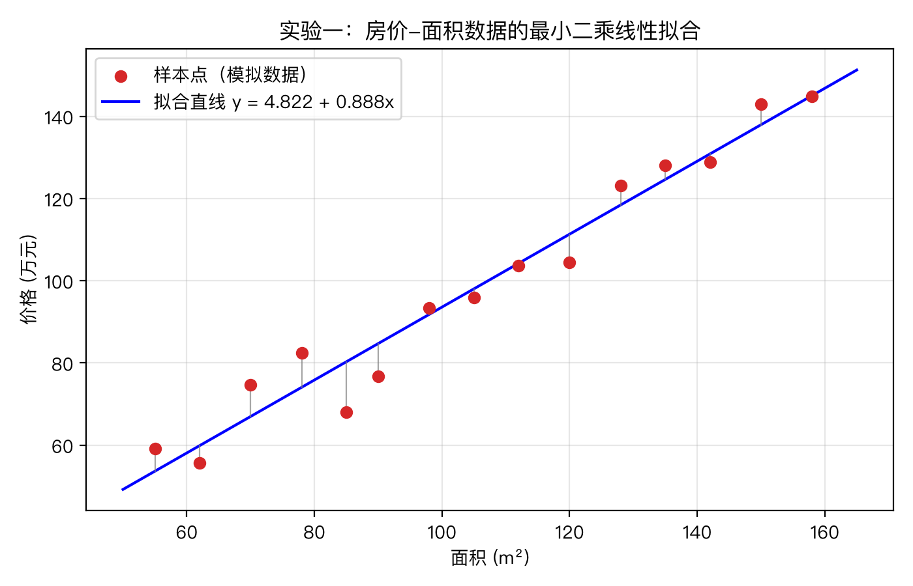
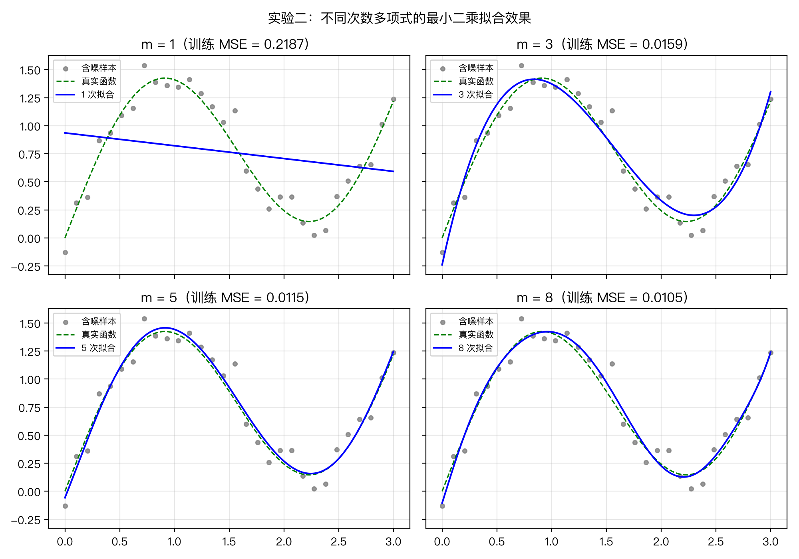
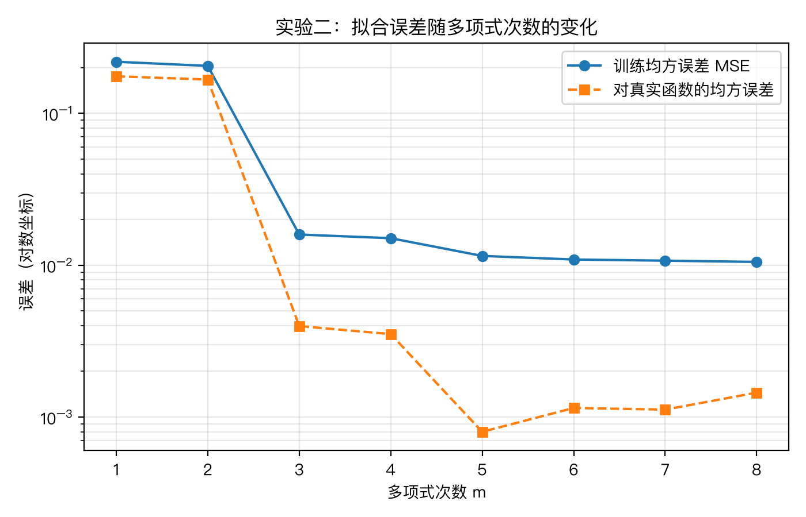
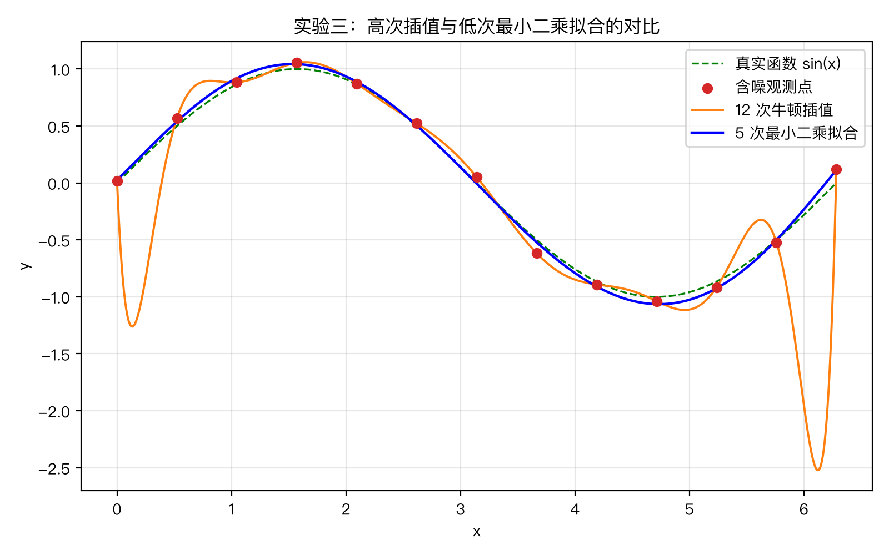
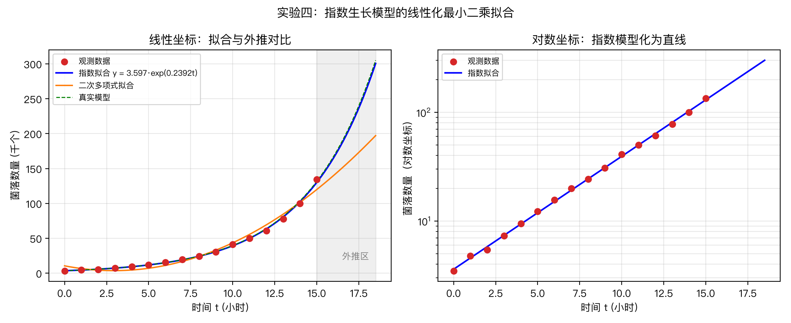
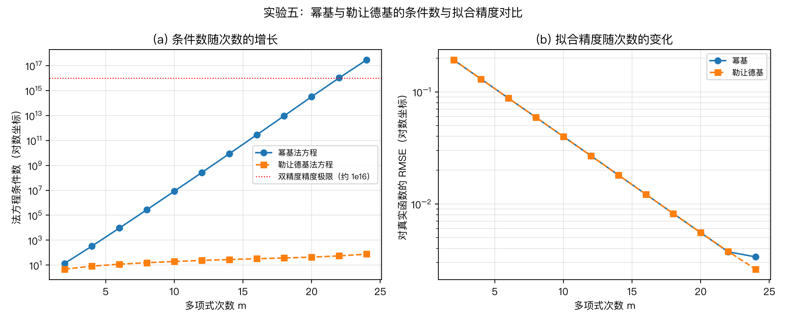
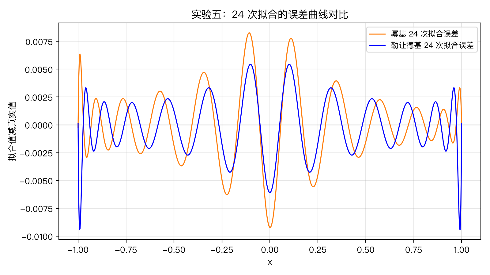

# 最小二乘法及其应用

课程：数值分析　　姓名：＿＿＿＿　　学号：＿＿＿＿　　日期：2026 年 7 月

## 摘要

观测数据含有误差，而插值方法强迫曲线通过每一个观测点，会把误差原样带进结果。最小二乘法以残差平方和最小为准则，在给定函数类中寻找整体上最接近数据的曲线，是处理含噪数据的基本工具。本文从多元函数求极值出发推导法方程，给出多项式拟合的矩阵形式与解的存在唯一性条件，用 Python 手写实现了法方程构造与列主元高斯消元求解，并完成五组数值实验：（1）对 15 组模拟房价数据作线性拟合，得到拟合直线 y = 4.8221 + 0.8876x，决定系数 0.9581；（2）比较 1 至 8 次多项式拟合，训练均方误差随次数单调下降，而对真实函数的误差在 5 次时最小，法方程条件数则从 10 的 1 次方量级增大到 10 的 13 次方量级；（3）在含噪数据上对比 12 次牛顿插值与 5 次最小二乘拟合，前者的均方根误差是后者的 12.5 倍；（4）将指数生长模型经对数变换化为线性拟合，两个参数还原的相对偏差不超过 0.4%，向后外推 3 个单位的相对误差为 1.4%，而用二次多项式直接拟合的外推误差达 31.7%；（5）在勒让德正交基下重做高次拟合，24 次拟合的法方程条件数由幂基的 2.85 × 10¹⁷ 降至 76，拟合精度继续随次数稳定提高。实验表明：数据含噪时应选用低次最小二乘拟合而非高次插值；结构正确的非线性模型经线性化后优于盲目提高多项式次数；幂基法方程随次数升高迅速病态化，高次拟合应改用正交多项式基。

**关键词**：最小二乘法；曲线拟合；法方程；列主元高斯消元；条件数；过拟合

## Abstract

Observed data carry noise, and interpolation forces the curve through every observation, carrying the noise into the result. The least squares method instead seeks, within a given function class, the curve that minimizes the sum of squared residuals. This report derives the normal equations from the stationarity conditions of a multivariate function, gives the matrix form of polynomial fitting together with the existence and uniqueness of its solution, and implements both the construction of the normal equations and their solution by Gaussian elimination with partial pivoting in Python. Five numerical experiments are carried out: (1) a linear fit to 15 simulated house-price samples, yielding y = 4.8221 + 0.8876x with a coefficient of determination of 0.9581; (2) a comparison of polynomial fits of degree 1 to 8, where the training error decreases monotonically while the error against the true function reaches its minimum at degree 5, and the condition number of the normal equations grows from the order of 10 to the order of 10^13; (3) a comparison between degree-12 Newton interpolation and a degree-5 least squares fit on noisy data, where the interpolant's root-mean-square error is 12.5 times that of the fit; (4) a log-transformed linear fit of an exponential growth model, recovering both parameters within 0.4% and extrapolating 3 units ahead with a relative error of 1.4%, against 31.7% for a direct quadratic fit; (5) a rerun of high-degree fitting under the Legendre orthogonal basis, which reduces the condition number of the degree-24 normal equations from 2.85 × 10^17 under the monomial basis to 76 while the accuracy keeps improving with the degree. The experiments show that low-degree least squares fitting should be preferred over high-degree interpolation for noisy data, that a structurally correct nonlinear model after linearization beats raising the polynomial degree, and that the normal equations under the monomial basis become severely ill-conditioned as the degree grows, so orthogonal polynomial bases should be used for high-degree fitting.

**Keywords**: least squares method; curve fitting; normal equations; Gaussian elimination with partial pivoting; condition number; overfitting

## 一、引言

### 1.1 研究背景与意义

实验和工程中得到的数据几乎总带有观测误差。若用插值方法处理这类数据，多项式被迫穿过每一个观测点，误差随之进入插值函数；节点较多时还会出现高次多项式特有的剧烈振荡[1-3]。勒让德于 1805 年首次发表最小二乘法，高斯在 1809 年的著作中将该方法与观测误差的正态分布理论联系起来，并将其用于天体轨道的计算[4]。此后两百多年，最小二乘法一直是数据拟合、参数估计和回归分析的基础，也是现代机器学习中线性回归模型的数学内核。

最小二乘法的思路是放弃"逐点通过"的要求，改为在一个较小的函数类（如低次多项式）中寻找使残差平方和最小的函数。求解归结为一个对称正定的线性方程组，即法方程，可用高斯消元法直接求解。这一过程把本课程的三部分内容串联起来：函数逼近提供准则，线性方程组数值解法提供求解手段，误差与条件数理论解释计算结果的可靠性。

### 1.2 研究内容与结构

本文的工作包括三部分。理论上，从多元函数极值条件推导一般基函数下的法方程，给出多项式拟合的矩阵形式，并证明解的存在唯一性。实现上，用 Python 手写法方程构造、列主元高斯消元与牛顿插值，不调用现成的拟合函数。实验上，设计五组实验：模拟房价数据的线性拟合、1 至 8 次多项式拟合比较、高次插值与低次拟合对比、指数生长模型的线性化拟合、勒让德正交基与幂基的条件数对比，检验方法的效果，并结合条件数理论分析幂基法方程的病态问题及其解决办法。

## 二、最小二乘法的基本理论

### 2.1 曲线拟合问题的提法

设有 n 组观测数据 (x_i, y_i)，i = 1, 2, ..., n。选定一组线性无关的基函数 φ_0(x), φ_1(x), ..., φ_m(x)（通常 m 远小于 n），在其张成的函数类中取

$$
S(x) = \sum_{j=0}^{m} a_{j} \varphi_{j}(x)
$$

曲线拟合的最小二乘问题是：确定系数 a_0, a_1, ..., a_m，使残差平方和最小，即求

$$
I(a_{0}, a_{1}, \ldots, a_{m}) = \sum_{i=1}^{n} \left( \sum_{j=0}^{m} a_{j} \varphi_{j}(x_{i}) - y_{i} \right)^{2}
$$

的最小值点。该目标函数是系数的二次函数，处处可微，最小值点必为驻点。

### 2.2 法方程的推导

对每个系数 a_k 求偏导数并令其为零：

$$
\frac{\partial I}{\partial a_{k}} = 2 \sum_{i=1}^{n} \left( \sum_{j=0}^{m} a_{j} \varphi_{j}(x_{i}) - y_{i} \right) \varphi_{k}(x_{i}) = 0
$$

交换求和次序，整理得 m + 1 个线性方程（k = 0, 1, ..., m）：

$$
\sum_{j=0}^{m} \left( \sum_{i=1}^{n} \varphi_{k}(x_{i}) \varphi_{j}(x_{i}) \right) a_{j} = \sum_{i=1}^{n} y_{i} \varphi_{k}(x_{i})
$$

这组方程称为法方程（正规方程）[1-3]。若在离散点集上定义内积，法方程恰好就是离散意义下最佳平方逼近的正交条件：残差向量与每个基函数正交。因此最小二乘拟合是最佳平方逼近在离散内积下的特例，这与连续情形的最佳平方逼近理论完全平行。

### 2.3 多项式拟合的矩阵形式与解的存在唯一性

取幂函数基 φ_j(x) = x 的 j 次幂，法方程成为

$$
\sum_{j=0}^{m} \left( \sum_{i=1}^{n} x_{i}^{j+k} \right) a_{j} = \sum_{i=1}^{n} y_{i} x_{i}^{k}
$$

引入 n × (m+1) 的设计矩阵

$$
A = \begin{pmatrix}
1 & x_{1} & \cdots & x_{1}^{m} \\
1 & x_{2} & \cdots & x_{2}^{m} \\
\vdots & \vdots & \ddots & \vdots \\
1 & x_{n} & \cdots & x_{n}^{m} \\
\end{pmatrix}
$$

则法方程可写成矩阵形式

$$
A^{T} A a = A^{T} y
$$

记 G 为法方程系数矩阵。对任意非零向量 c 有

$$
c^{T} G c = \left\| A c \right\|_{2}^{2}
$$

当节点 x_1, ..., x_n 互异且 n 大于等于 m + 1 时，A 的各列线性无关（其任意 m + 1 行构成范德蒙矩阵），上式严格大于零，G 对称正定，法方程存在唯一解，且该驻点确为残差平方和的最小值点[3,5]。

### 2.4 法方程的数值求解：列主元高斯消元法

#### 2.4.1 列主元高斯消元过程

G 是低阶稠密对称正定矩阵，本文用列主元高斯消元法求解。第 k 步消元前，先在第 k 列的第 k 行及以下元素中选取绝对值最大者所在行与第 k 行交换，再对 i 大于 k 的各行计算消元乘数并消去第 k 列：

$$
m_{ik} = \frac{a_{ik}^{(k)}}{a_{kk}^{(k)}}
$$

$$
a_{ij}^{(k+1)} = a_{ij}^{(k)} - m_{ik} a_{kj}^{(k)}
$$

消元完成后自下而上回代：

$$
x_{i} = \frac{1}{a_{ii}} \left( b_{i} - \sum_{j=i+1}^{n} a_{ij} x_{j} \right)
$$

选列主元保证消元乘数的绝对值不超过 1，抑制舍入误差的增长。对 m + 1 阶方程组，消元与回代的运算量约为 (m+1) 的 3 次方除以 3 次乘除法，本文 m 不超过 24，计算量可忽略。

#### 2.4.2 条件数与数值稳定性

法方程解的可靠性由系数矩阵的条件数刻画：

$$
\mathrm{cond}(G)_{2} = \left\| G \right\|_{2} \left\| G^{-1} \right\|_{2} = \frac{\lambda_{\max}(G)}{\lambda_{\min}(G)}
$$

条件数越大，右端项和系数的微小扰动被放大得越厉害。由于 G 等于 A 的转置乘 A，G 的条件数是 A 的条件数的平方[5-6]，这正是幂基法方程随次数升高迅速病态化的原因，实验二将给出具体数值，实验五给出改用正交基的解决办法。对病态更严重的问题，数值线性代数中的标准做法是绕开法方程，直接对设计矩阵作 QR 分解或奇异值分解[6]。

### 2.5 拟合优劣的度量

本文使用三个指标。均方误差与均方根误差衡量残差的平均大小：

$$
\mathrm{MSE} = \frac{1}{n} \sum_{i=1}^{n} \left( S(x_{i}) - y_{i} \right)^{2}
$$

$$
\mathrm{RMSE} = \sqrt{\mathrm{MSE}}
$$

决定系数衡量拟合模型对数据变差的解释比例，越接近 1 拟合越好：

$$
R^{2} = 1 - \frac{\sum_{i=1}^{n} \left( y_{i} - S(x_{i}) \right)^{2}}{\sum_{i=1}^{n} \left( y_{i} - \bar{y} \right)^{2}}
$$

实验二、三中数据由已知函数加噪声生成，因此还可以在密集网格上计算拟合曲线与真实函数之间的 RMSE，称为"对真实函数的误差"。训练误差只反映曲线贴合观测点的程度，对真实函数的误差才反映拟合是否抓住了数据背后的规律，两者的分离正是过拟合的标志。

### 2.6 与插值方法的关系

插值与拟合都是用简单函数代表数据，但约束不同。n + 1 个互异节点唯一确定一个次数不超过 n 的插值多项式，残差恒为零；最小二乘拟合用 n 远大于 m + 1 个数据点确定 m + 1 个系数，残差一般不为零。当 m + 1 恰好等于节点个数时，法方程的解就是插值多项式，拟合退化为插值。数据精确时插值合理；数据含噪时，插值把噪声当作函数值忠实复现，而最小二乘用多余的观测对噪声取平均，起到平滑作用。实验三将定量比较两者。

### 2.7 非线性模型的线性化

许多经验模型关于参数是非线性的，典型的如指数生长模型

$$
y = a e^{b x}
$$

两边取自然对数，得

$$
\ln y = \ln a + b x
$$

令 z 表示 ln y，问题化为 z 关于 x 的一次多项式拟合：解 2 阶法方程得到截距与斜率，截距取指数即还原参数 a。需要注意，线性化后最小化的是对数残差的平方和，等价于按相对误差衡量拟合好坏：观测噪声为乘性（各点相对误差水平相当）时该准则恰当；噪声为加性且数据跨越多个数量级时，对数变换会放大小观测值的权重，严格的处理是作加权最小二乘或直接求解非线性最小二乘。实验四用乘性噪声数据检验线性化方法。

## 三、数值实验

### 3.1 实验环境与实现要点

实验在 macOS（Apple Silicon）上进行，Python 3.14，NumPy 用于数组运算与条件数计算[7]，Matplotlib 用于绘图[8]。法方程构造、列主元高斯消元、牛顿插值（差商表加秦九韶求值）均为手写实现，未调用 polyfit 等现成拟合函数。随机数使用固定种子 42，全部结果可复现。完整程序见附录，运行方式为：

```bash
uv run --with numpy --with matplotlib python least_squares_experiments.py
```

### 3.2 实验一：房价与面积的线性拟合

按线性模型生成 15 组模拟数据：面积 x 取 55 至 158 平方米，价格按下式生成并保留一位小数：

$$
y_{i} = 0.82 x_{i} + 12 + \varepsilon_{i}
$$

$$
\varepsilon_{i} \sim N(0, 7^{2})
$$

数据见表 1。

**表 1　模拟房价数据（面积单位：平方米，价格单位：万元）**

| 序号 | 面积 | 价格 | 序号 | 面积 | 价格 |
|:---:|:---:|:---:|:---:|:---:|:---:|
| 1 | 55 | 59.2 | 9 | 112 | 103.7 |
| 2 | 62 | 55.6 | 10 | 120 | 104.4 |
| 3 | 70 | 74.7 | 11 | 128 | 123.1 |
| 4 | 78 | 82.5 | 12 | 135 | 128.1 |
| 5 | 85 | 68.0 | 13 | 142 | 128.9 |
| 6 | 90 | 76.7 | 14 | 150 | 142.9 |
| 7 | 98 | 93.3 | 15 | 158 | 144.8 |
| 8 | 105 | 95.9 |  |  |  |

取一次多项式拟合，由数据算出的法方程为

$$
\begin{pmatrix}
15 & 1588 \\
1588 & 182988 \\
\end{pmatrix}
\begin{pmatrix}
a_{0} \\
a_{1} \\
\end{pmatrix}
=
\begin{pmatrix}
1481.8 \\
170073.0 \\
\end{pmatrix}
$$

列主元高斯消元解得 a_0 = 4.8221，a_1 = 0.8876，即拟合直线

$$
S_{1}(x) = 4.8221 + 0.8876 x
$$

拟合的 MSE 为 34.133，RMSE 为 5.842 万元，决定系数 0.9581。散点、拟合直线与残差见图 1。



**图 1　房价数据的最小二乘线性拟合，灰色竖线段为各样本点的残差**

### 3.3 实验二：多项式次数对拟合效果的影响

以函数

$$
f(x) = \sin(2 x) + 0.5 x
$$

在区间 [0, 3] 上取 30 个等距点，加入标准差 0.15 的正态噪声作为观测数据，分别用 1 至 8 次多项式作最小二乘拟合。每个次数记录三个量：训练 MSE（对 30 个观测点）、对真实函数的 RMSE（在 600 个密集网格点上与 f 比较）、法方程系数矩阵的 2-范数条件数。结果见表 2，部分次数的拟合曲线见图 2，误差随次数的变化见图 3。

**表 2　不同次数多项式拟合的误差与法方程条件数**

| 次数 m | 训练 MSE | 对真实函数的 RMSE | 法方程条件数 |
|:---:|:---:|:---:|:---:|
| 1 | 0.2187 | 0.4189 | 1.84 × 10¹ |
| 2 | 0.2055 | 0.4086 | 5.49 × 10² |
| 3 | 0.0159 | 0.0630 | 2.43 × 10⁴ |
| 4 | 0.0151 | 0.0593 | 1.26 × 10⁶ |
| 5 | 0.0115 | 0.0283 | 7.27 × 10⁷ |
| 6 | 0.0109 | 0.0339 | 4.49 × 10⁹ |
| 7 | 0.0107 | 0.0334 | 2.93 × 10¹¹ |
| 8 | 0.0105 | 0.0380 | 2.01 × 10¹³ |



**图 2　1、3、5、8 次多项式的拟合曲线与真实函数对比**



**图 3　训练误差与对真实函数的误差随多项式次数的变化（对数坐标）**

### 3.4 实验三：高次插值与低次最小二乘拟合的对比

在区间 [0, 2π] 上取 13 个等距节点，函数值取 sin(x) 加标准差 0.08 的正态噪声。对同一组含噪数据分别作 12 次牛顿插值和 5 次最小二乘拟合。牛顿插值多项式由差商表构造：

$$
P_{12}(x) = f[x_{0}] + \sum_{k=1}^{12} f[x_{0}, x_{1}, \ldots, x_{k}] \prod_{j=0}^{k-1} (x - x_{j})
$$

最小二乘解得的 5 次拟合多项式为

$$
S_{5}(x) = 0.0250 + 0.9818 x + 0.1691 x^{2} - 0.3563 x^{3} + 0.0801 x^{4} - 0.0050 x^{5}
$$

在 800 个密集网格点上与真实函数 sin(x) 比较，两种方法的误差见表 3，曲线对比见图 4。

**表 3　插值与最小二乘拟合对真实函数的误差**

| 方法 | 多项式次数 | RMSE | 最大误差 |
|:---:|:---:|:---:|:---:|
| 牛顿插值 | 12 | 0.5257 | 2.3653 |
| 最小二乘拟合 | 5 | 0.0419 | 0.1126 |



**图 4　含噪数据上 12 次牛顿插值与 5 次最小二乘拟合的对比**

### 3.5 实验四：指数生长模型的线性化拟合与外推

模拟一次细菌培养计数实验：每小时观测一次菌落数量（单位：千个），共 16 次，数据按乘性噪声模型生成并保留两位小数：

$$
y_{i} = 3.6 e^{0.24 t_{i}} e^{\delta_{i}}
$$

$$
\delta_{i} \sim N(0, 0.04^{2})
$$

数据见表 4。

**表 4　模拟菌落计数数据（t 单位：小时，y 单位：千个）**

| t | y | t | y | t | y | t | y |
|:---:|:---:|:---:|:---:|:---:|:---:|:---:|:---:|
| 0 | 3.48 | 4 | 9.46 | 8 | 24.22 | 12 | 60.94 |
| 1 | 4.76 | 5 | 12.24 | 9 | 30.64 | 13 | 77.91 |
| 2 | 5.44 | 6 | 15.63 | 10 | 41.07 | 14 | 99.90 |
| 3 | 7.30 | 7 | 19.94 | 11 | 50.06 | 15 | 134.40 |

按 2.7 节方法对 ln y 作线性拟合，解 2 阶法方程得截距 1.2801、斜率 0.2392，还原得拟合模型

$$
S(t) = 3.5971 e^{0.2392 t}
$$

两个参数与生成模型（a 取 3.6，b 取 0.24）的相对偏差分别为 0.08% 和 0.33%。作为对照，用二次多项式直接对原始数据作最小二乘拟合。两种模型在观测区间内的误差以及向后外推 3 小时（t 取 18）的预测见表 5，真实模型在 t 取 18 时的值为 270.68。曲线对比见图 5：左图为线性坐标，灰色区域为外推区；右图为对数坐标，指数模型在其中化为直线。

**表 5　指数模型与二次多项式的拟合与外推对比**

| 模型 | 参数个数 | 观测区间 RMSE | 预测值（t = 18） | 外推相对误差 |
|:---:|:---:|:---:|:---:|:---:|
| 指数模型（线性化拟合） | 2 | 1.638 | 266.80 | 1.43% |
| 二次多项式（直接拟合） | 3 | 5.683 | 185.01 | 31.65% |



**图 5　指数生长模型的线性化最小二乘拟合与外推对比**

### 3.6 实验五：勒让德正交基与幂基的条件数对比

实验二表明幂基法方程随次数升高迅速病态化。本实验改用勒让德正交多项式作基函数，定量比较两种基底。勒让德多项式由三项递推公式生成：

$$
(k+1) P_{k+1}(x) = (2 k + 1) x P_{k}(x) - k P_{k-1}(x)
$$

其中 P_0 恒为 1，P_1 等于 x。被拟函数取龙格函数

$$
f(x) = \frac{1}{1 + 25 x^{2}}
$$

在区间 [-1, 1] 上取 81 个等距采样点，不加噪声，以排除噪声对精度比较的干扰。对 2 至 24 的每个偶数次数，分别在幂基和勒让德基下构造法方程并用同一套列主元高斯消元程序求解，记录法方程条件数与拟合曲线对真实函数的 RMSE（在 1001 个密集网格点上计算）。结果见表 6 与图 6，24 次拟合的误差曲线见图 7。

**表 6　两种基底下的法方程条件数与拟合精度**

| 次数 m | 幂基条件数 | 勒让德基条件数 | 幂基 RMSE | 勒让德基 RMSE |
|:---:|:---:|:---:|:---:|:---:|
| 2 | 1.36 × 10¹ | 4.76 | 1.93 × 10⁻¹ | 1.93 × 10⁻¹ |
| 4 | 3.37 × 10² | 8.26 | 1.30 × 10⁻¹ | 1.30 × 10⁻¹ |
| 6 | 9.41 × 10³ | 11.8 | 8.77 × 10⁻² | 8.77 × 10⁻² |
| 8 | 2.77 × 10⁵ | 15.6 | 5.92 × 10⁻² | 5.92 × 10⁻² |
| 10 | 8.46 × 10⁶ | 19.6 | 3.99 × 10⁻² | 3.99 × 10⁻² |
| 12 | 2.65 × 10⁸ | 23.7 | 2.69 × 10⁻² | 2.69 × 10⁻² |
| 14 | 8.50 × 10⁹ | 27.9 | 1.81 × 10⁻² | 1.81 × 10⁻² |
| 16 | 2.79 × 10¹¹ | 32.4 | 1.22 × 10⁻² | 1.22 × 10⁻² |
| 18 | 9.33 × 10¹² | 37.4 | 8.20 × 10⁻³ | 8.20 × 10⁻³ |
| 20 | 3.19 × 10¹⁴ | 43.9 | 5.53 × 10⁻³ | 5.53 × 10⁻³ |
| 22 | 1.02 × 10¹⁶ | 54.7 | 3.74 × 10⁻³ | 3.76 × 10⁻³ |
| 24 | 2.85 × 10¹⁷ | 76.1 | 3.36 × 10⁻³ | 2.61 × 10⁻³ |

为检验病态对系数的实际影响，另用奇异值分解绕开法方程、直接求解 24 次幂基最小二乘问题，将所得系数与高斯消元解法方程所得系数比较，两者的相对偏差（2-范数）达 65.7%。



**图 6　幂基与勒让德基的法方程条件数（左）与拟合精度（右）随次数的变化**



**图 7　24 次拟合的误差曲线对比（幂基与勒让德基）**

## 四、结果分析

### 4.1 实验一：线性拟合结果分析

线性拟合有效还原了数据的总体趋势。拟合斜率 0.8876 与生成模型的斜率 0.82 相差 0.068；按线性回归理论，该数据下斜率估计的标准差约为 0.057，偏差在一倍标准差左右，属于 15 个样本、噪声标准差 7 之下的正常抽样波动。RMSE 为 5.842 万元，小于生成噪声的标准差 7，说明拟合直线没有放大噪声。决定系数 0.9581 表明直线解释了数据约 95.8% 的变差。图 1 中残差在直线两侧大致均匀分布，无系统性弯曲，线性模型的选择与数据相符。

### 4.2 实验二：多项式次数与病态性分析

训练误差与真实误差在 5 次之后分离，法方程随次数升高急剧病态化。表 2 中训练 MSE 从 1 次的 0.2187 单调下降到 8 次的 0.0105，但对真实函数的 RMSE 在 5 次达到最小值 0.0283，6 至 8 次回升到 0.033 至 0.038。原因是多项式次数超过数据背后函数的复杂度后，多余的自由度开始追随噪声，训练误差的下降不再对应逼近质量的提高，这就是过拟合。图 2 中 1 次拟合无法表现 sin(2x) 的起伏（欠拟合），3 次已抓住主要形态，5 次与真实函数几乎重合，8 次在端点附近出现向噪声弯曲的迹象。另一方面，条件数从 1 次的 18.4 增长到 8 次的 2.01 × 10¹³，每升一次约放大两个数量级，与"G 的条件数是 A 的条件数的平方"的理论一致。双精度浮点的机器精度约为 10⁻¹⁶，条件数 10¹³ 意味着解的有效数字最多只剩 3 位左右：即使不考虑过拟合，继续升高次数在数值上也不可行。工程上应改用正交多项式基压低条件数，或绕开法方程、直接对设计矩阵作 QR 分解或奇异值分解[6]，实验五对前一方案作了定量验证。

### 4.3 实验三：插值与拟合结果分析

数据含噪时，"通过每个点"是错误的目标。12 次插值多项式忠实通过全部 13 个含噪节点，代价是节点之间剧烈振荡，图 4 中区间两端的振幅超过 1，最大误差 2.3653 是被拟函数振幅的两倍多；这与等距节点高次插值的振荡现象相互叠加。5 次最小二乘拟合不通过任何观测点，却把 RMSE 压到 0.0419，仅为插值的 8%，最大误差 0.1126 也只有插值的 5% 左右。13 个观测对 6 个系数的超定结构对噪声起了平均作用，这正是 2.6 节所述平滑效应的定量体现。

### 4.4 实验四：线性化模型结果分析

线性化把非线性拟合化为线性问题，模型结构比参数数量更重要。对数变换后 16 个数据点在半对数坐标下几乎落在一条直线上（图 5 右），线性拟合还原的参数 3.5971 和 0.2392 与生成模型的 3.6 和 0.24 相对偏差仅 0.08% 和 0.33%。两参数的指数模型在观测区间的 RMSE 为 1.638，反而低于三参数二次多项式的 5.683：二次多项式在 t 为 0 附近预测约 10.6（实际观测 3.48），呈系统性偏离，因为抛物线的形状与指数增长本质不符。差距在外推段被放大：t 取 18 时指数模型的相对误差为 1.43%，二次多项式低估 31.65%（图 5 左的灰色外推区）。此外，本实验的噪声为乘性噪声，恰好与线性化后"最小化对数残差"的准则匹配；若噪声为加性，对数变换会给小观测值过大的权重，应改用加权最小二乘或非线性最小二乘。

### 4.5 实验五：正交基结果分析

换正交基不改变拟合问题本身，却把法方程从病态变为良态。同一批数据、同一套高斯消元程序，幂基法方程的条件数每升高两次约增大 30 倍，22 次时达 1.02 × 10¹⁶，越过双精度浮点的精度极限；勒让德基的条件数全程不超过 76.1（图 6 左）。病态的直接后果落在系数上：24 次幂基下，法方程解出的系数与 SVD 直接求解所得系数的相对偏差达 65.7%，系数已无可信数字。值得注意的是，两组差异巨大的系数在采样区间内给出的拟合曲线却相当接近：病态方向上的系数扰动在区间内相互抵消，误差主要潜伏在外推、求导等对单个系数敏感的后续运算中。拟合精度方面，两种基底的 RMSE 直到 20 次完全一致，22 次起分离，24 次时幂基停在 3.36 × 10⁻³，勒让德基继续降到 2.61 × 10⁻³（图 6 右、图 7）。龙格函数本身需要 20 次以上的多项式才能把 RMSE 压到千分之三量级，说明高次拟合是合理需求；病态不在问题本身，而在幂基这个表达方式。

## 五、结论

本文推导并实现了多项式最小二乘拟合，得到以下结论：

1. 最小二乘拟合的求解归结为对称正定的法方程，节点互异且样本数不少于系数个数时解存在唯一；用列主元高斯消元求解低阶法方程稳定可靠。实验一中 15 组含噪线性数据的拟合决定系数达 0.9581。
2. 多项式次数不是越高越好。训练误差随次数单调下降，对真实函数的误差却先降后升，实验二中最优次数为 5。选择次数时应以对独立数据或真实函数的误差为准，而非训练误差。
3. 幂基法方程的条件数随次数急剧增长：实验二中 8 次拟合达 2.01 × 10¹³，实验五中 24 次拟合达 2.85 × 10¹⁷，此时法方程解出的系数与 SVD 直接解的相对偏差达 65.7%。改用勒让德正交基后条件数全程不超过 76.1，24 次拟合的精度仍在稳定改进，正交基是高次拟合的正确选择。
4. 数据含噪时最小二乘拟合优于插值：实验三中 5 次拟合对真实函数的 RMSE 仅为 12 次插值的 8%。插值适用于精确数据，拟合适用于含噪数据。
5. 结构正确的模型胜过更多的参数：实验四中两参数指数模型无论在观测区间（RMSE 1.638 对 5.683）还是外推 3 个单位处（相对误差 1.43% 对 31.65%）都优于三参数二次多项式。非线性模型经对数变换即可纳入线性最小二乘框架，但变换同时改变了误差的权重结构，使用前应确认噪声类型。

后续可在三个方向延伸：引入加权最小二乘处理精度不等的观测；不经线性化、用高斯-牛顿迭代直接求解非线性最小二乘，并与实验四的线性化结果比较；系统比较法方程、QR 分解与 SVD 三种求解途径在病态问题上的精度差异。

## 参考文献

[1] 李庆扬, 王能超, 易大义. 数值分析[M]. 第5版. 北京: 清华大学出版社, 2008.

[2] BURDEN R L, FAIRES J D. Numerical Analysis[M]. 9th ed. Boston, MA: Brooks/Cole, Cengage Learning, 2011.

[3] SAUER T. Numerical Analysis[M]. 2nd ed. Boston, MA: Pearson/Addison-Wesley, 2012.

[4] STIGLER S M. Gauss and the Invention of Least Squares[J]. The Annals of Statistics, 1981, 9(3): 465-474. DOI: 10.1214/aos/1176345451.

[5] STRANG G. Introduction to Linear Algebra[M]. 5th ed. Wellesley, MA: Wellesley-Cambridge Press, 2016.

[6] TREFETHEN L N, BAU D. Numerical Linear Algebra[M]. Philadelphia, PA: Society for Industrial and Applied Mathematics, 1997.

[7] HARRIS C R, MILLMAN K J, VAN DER WALT S J, et al. Array programming with NumPy[J]. Nature, 2020, 585: 357-362. DOI: 10.1038/s41586-020-2649-2.

[8] HUNTER J D. Matplotlib: A 2D graphics environment[J]. Computing in Science & Engineering, 2007, 9(3): 90-95. DOI: 10.1109/MCSE.2007.55.

## 附录　实验程序

完整 Python 程序如下（文件名 least_squares_experiments.py），核心算法（法方程构造、列主元高斯消元、牛顿插值、勒让德三项递推）均为手写实现，运行后自动生成全部图表与结果数据。

```python
# -*- coding: utf-8 -*-
"""
课程报告《最小二乘法及其应用》配套数值实验
实验一：一元线性拟合（模拟房价-面积数据）
实验二：不同次数多项式拟合比较（含法方程条件数分析）
实验三：高次插值与低次最小二乘拟合的对比（含噪声数据）
实验四：指数模型的线性化最小二乘拟合（模拟细菌生长数据）
实验五：勒让德正交基与幂基的法方程条件数对比
"""
import json
import math
from pathlib import Path

import numpy as np
import matplotlib
matplotlib.use("Agg")
import matplotlib.pyplot as plt
from matplotlib import font_manager

_available = {f.name for f in font_manager.fontManager.ttflist}
for _cand in ["PingFang SC", "Hiragino Sans GB", "Arial Unicode MS",
              "Heiti TC", "STHeiti", "Songti SC"]:
    if _cand in _available:
        plt.rcParams["font.sans-serif"] = [_cand]
        break
plt.rcParams["axes.unicode_minus"] = False

HERE = Path(__file__).resolve().parent
FIG = HERE / "figures"
FIG.mkdir(exist_ok=True)
rng = np.random.default_rng(42)
results = {}

def gauss_solve(A, b):
    """列主元高斯消元法求解 Ax = b"""
    A = np.array(A, dtype=float, copy=True)
    b = np.array(b, dtype=float, copy=True)
    n = b.size
    for k in range(n - 1):
        p = k + int(np.argmax(np.abs(A[k:, k])))          # 选列主元
        if abs(A[p, k]) < 1e-300:
            raise ZeroDivisionError("主元过小，方程组接近奇异")
        if p != k:
            A[[k, p]] = A[[p, k]]
            b[[k, p]] = b[[p, k]]
        for i in range(k + 1, n):                          # 消元
            m = A[i, k] / A[k, k]
            A[i, k:] -= m * A[k, k:]
            b[i] -= m * b[k]
    x = np.zeros(n)
    for i in range(n - 1, -1, -1):                         # 回代
        x[i] = (b[i] - A[i, i + 1:] @ x[i + 1:]) / A[i, i]
    return x


def normal_equations(x, y, m):
    """构造 m 次多项式拟合的法方程 G a = d"""
    s = [np.sum(x ** p) for p in range(2 * m + 1)]
    G = np.array([[s[j + k] for k in range(m + 1)] for j in range(m + 1)])
    d = np.array([np.sum(y * x ** j) for j in range(m + 1)])
    return G, d


def ls_polyfit(x, y, m):
    """最小二乘多项式拟合：返回系数 a[0..m] 与法方程系数矩阵 G"""
    G, d = normal_equations(x, y, m)
    a = gauss_solve(G, d)
    return a, G


def polyval(a, x):
    """多项式求值 p(x) = a0 + a1 x + ... + am x^m"""
    r = np.zeros_like(np.asarray(x, dtype=float))
    for c in reversed(a):
        r = r * x + c
    return r


def newton_coeffs(xs, ys):
    """牛顿插值：差商表对角线元素"""
    c = np.array(ys, dtype=float, copy=True)
    for j in range(1, len(xs)):
        c[j:] = (c[j:] - c[j - 1:-1]) / (xs[j:] - xs[:-j])
    return c


def newton_eval(c, xs, x):
    """牛顿插值多项式求值（秦九韶形式）"""
    r = np.full_like(np.asarray(x, dtype=float), c[-1])
    for k in range(len(c) - 2, -1, -1):
        r = r * (x - xs[k]) + c[k]
    return r


def fit_metrics(y, y_hat):
    res = y - y_hat
    mse = float(np.mean(res ** 2))
    ss_tot = float(np.sum((y - np.mean(y)) ** 2))
    r2 = 1.0 - float(np.sum(res ** 2)) / ss_tot
    return mse, math.sqrt(mse), r2


# ---------- 实验一：一元线性拟合（模拟房价数据） ----------
area = np.array([55, 62, 70, 78, 85, 90, 98, 105, 112, 120,
                 128, 135, 142, 150, 158], dtype=float)
price = np.round(0.82 * area + 12 + rng.normal(0, 7, area.size), 1)

a1, G1 = ls_polyfit(area, price, 1)
pred1 = polyval(a1, area)
mse1, rmse1, r2_1 = fit_metrics(price, pred1)

results["exp1"] = {
    "area": area.tolist(),
    "price": price.tolist(),
    "normal_matrix": G1.tolist(),
    "rhs": normal_equations(area, price, 1)[1].tolist(),
    "coef": [round(v, 4) for v in a1],
    "mse": round(mse1, 3),
    "rmse": round(rmse1, 3),
    "r2": round(r2_1, 4),
}

plt.figure(figsize=(7, 4.5))
plt.scatter(area, price, c="#d62728", zorder=3, label="样本点（模拟数据）")
xs = np.linspace(50, 165, 200)
plt.plot(xs, polyval(a1, xs), "b-",
         label=f"拟合直线 y = {a1[0]:.3f} + {a1[1]:.3f}x")
for xi, yi, pi in zip(area, price, pred1):
    plt.plot([xi, xi], [yi, pi], "gray", lw=0.8, alpha=0.7)
plt.xlabel("面积 (m²)")
plt.ylabel("价格 (万元)")
plt.title("实验一：房价-面积数据的最小二乘线性拟合")
plt.legend()
plt.grid(alpha=0.3)
plt.tight_layout()
plt.savefig(FIG / "fig1_linear_fit.png", dpi=200)
plt.close()

# ---------- 实验二：不同次数多项式拟合比较 ----------
def f2(x):
    return np.sin(2 * x) + 0.5 * x

x2 = np.linspace(0, 3, 30)
y2 = f2(x2) + rng.normal(0, 0.15, x2.size)
dense2 = np.linspace(0, 3, 600)

degree_stats = []
fits = {}
for m in range(1, 9):
    a, G = ls_polyfit(x2, y2, m)
    fits[m] = a
    train_mse = float(np.mean((y2 - polyval(a, x2)) ** 2))
    true_rmse = float(np.sqrt(np.mean((f2(dense2) - polyval(a, dense2)) ** 2)))
    degree_stats.append({
        "degree": m,
        "train_mse": round(train_mse, 5),
        "true_rmse": round(true_rmse, 5),
        "cond_G": float(f"{np.linalg.cond(G):.3e}"),
    })
results["exp2"] = {"noise_sigma": 0.15, "n_samples": 30,
                   "stats": degree_stats}

fig, axes = plt.subplots(2, 2, figsize=(10, 7), sharex=True, sharey=True)
for ax, m in zip(axes.ravel(), [1, 3, 5, 8]):
    ax.scatter(x2, y2, s=14, c="#7f7f7f", alpha=0.8, label="含噪样本")
    ax.plot(dense2, f2(dense2), "g--", lw=1.2, label="真实函数")
    ax.plot(dense2, polyval(fits[m], dense2), "b-", lw=1.5,
            label=f"{m} 次拟合")
    st = next(s for s in degree_stats if s["degree"] == m)
    ax.set_title(f"m = {m}（训练 MSE = {st['train_mse']:.4f}）")
    ax.grid(alpha=0.3)
    ax.legend(fontsize=8)
fig.suptitle("实验二：不同次数多项式的最小二乘拟合效果")
fig.tight_layout()
fig.savefig(FIG / "fig2_poly_degrees.png", dpi=200)
plt.close(fig)

plt.figure(figsize=(7, 4.5))
ds = [s["degree"] for s in degree_stats]
plt.semilogy(ds, [s["train_mse"] for s in degree_stats],
             "o-", label="训练均方误差 MSE")
plt.semilogy(ds, [s["true_rmse"] ** 2 for s in degree_stats],
             "s--", label="对真实函数的均方误差")
plt.xlabel("多项式次数 m")
plt.ylabel("误差（对数坐标）")
plt.title("实验二：拟合误差随多项式次数的变化")
plt.legend()
plt.grid(alpha=0.3, which="both")
plt.tight_layout()
plt.savefig(FIG / "fig2b_error_vs_degree.png", dpi=200)
plt.close()

# ---------- 实验三：高次插值 vs 低次最小二乘 ----------
def f3(x):
    return np.sin(x)

x3 = np.linspace(0, 2 * np.pi, 13)          # 13 个等距节点
y3 = f3(x3) + rng.normal(0, 0.08, x3.size)  # 加入观测噪声
dense3 = np.linspace(0, 2 * np.pi, 800)

c_newton = newton_coeffs(x3, y3)            # 12 次牛顿插值
interp_dense = newton_eval(c_newton, x3, dense3)

a3, G3 = ls_polyfit(x3, y3, 5)              # 5 次最小二乘拟合
ls_dense = polyval(a3, dense3)

truth = f3(dense3)
results["exp3"] = {
    "n_nodes": 13, "noise_sigma": 0.08,
    "interp_degree": 12, "ls_degree": 5,
    "interp_rmse": round(float(np.sqrt(np.mean((interp_dense - truth) ** 2))), 4),
    "interp_maxerr": round(float(np.max(np.abs(interp_dense - truth))), 4),
    "ls_rmse": round(float(np.sqrt(np.mean((ls_dense - truth) ** 2))), 4),
    "ls_maxerr": round(float(np.max(np.abs(ls_dense - truth))), 4),
    "ls_coef": [round(v, 5) for v in a3],
}

plt.figure(figsize=(8, 5))
plt.plot(dense3, truth, "g--", lw=1.2, label="真实函数 sin(x)")
plt.scatter(x3, y3, c="#d62728", zorder=3, label="含噪观测点")
plt.plot(dense3, interp_dense, "-", c="#ff7f0e", lw=1.4, label="12 次牛顿插值")
plt.plot(dense3, ls_dense, "b-", lw=1.6, label="5 次最小二乘拟合")
plt.xlabel("x")
plt.ylabel("y")
plt.title("实验三：高次插值与低次最小二乘拟合的对比")
plt.legend()
plt.grid(alpha=0.3)
plt.tight_layout()
plt.savefig(FIG / "fig3_interp_vs_ls.png", dpi=200)
plt.close()

# ---------- 实验四：指数模型的线性化最小二乘拟合 ----------
# 模型 y = a * exp(b x)，两边取对数化为 ln y = ln a + b x 的线性拟合
t4 = np.arange(0, 16, dtype=float)                    # 0~15 小时，16 个观测
y4 = np.round(3.6 * np.exp(0.24 * t4)
              * np.exp(rng.normal(0, 0.04, t4.size)), 2)

z4 = np.log(y4)
coef4, G4 = ls_polyfit(t4, z4, 1)                     # 对 ln y 作线性拟合
a4_fit = math.exp(coef4[0])
b4_fit = coef4[1]
exp_pred = a4_fit * np.exp(b4_fit * t4)
exp_rmse = float(np.sqrt(np.mean((exp_pred - y4) ** 2)))

p4, _ = ls_polyfit(t4, y4, 2)                         # 对照：二次多项式直接拟合
poly_pred = polyval(p4, t4)
poly_rmse = float(np.sqrt(np.mean((poly_pred - y4) ** 2)))

t_extra = 18.0                                        # 外推 3 小时
true_extra = 3.6 * math.exp(0.24 * t_extra)
exp_extra = a4_fit * math.exp(b4_fit * t_extra)
poly_extra = float(polyval(p4, t_extra))

results["exp4"] = {
    "t": t4.tolist(), "y": y4.tolist(),
    "true_a": 3.6, "true_b": 0.24, "noise_sigma": 0.04,
    "fit_ln_a": round(coef4[0], 4), "fit_a": round(a4_fit, 4),
    "fit_b": round(b4_fit, 4),
    "exp_rmse": round(exp_rmse, 3), "poly2_rmse": round(poly_rmse, 3),
    "poly2_coef": [round(v, 4) for v in p4],
    "extrapolation_t": t_extra,
    "true_extra": round(true_extra, 2),
    "exp_extra": round(exp_extra, 2),
    "exp_extra_relerr": round(abs(exp_extra - true_extra) / true_extra, 4),
    "poly_extra": round(poly_extra, 2),
    "poly_extra_relerr": round(abs(poly_extra - true_extra) / true_extra, 4),
}

fig, (axL, axR) = plt.subplots(1, 2, figsize=(11, 4.5))
dense4 = np.linspace(0, 18.5, 400)
axL.scatter(t4, y4, c="#d62728", zorder=3, label="观测数据")
axL.plot(dense4, a4_fit * np.exp(b4_fit * dense4), "b-", lw=1.6,
         label=f"指数拟合 y = {a4_fit:.3f}·exp({b4_fit:.4f}t)")
axL.plot(dense4, polyval(p4, dense4), "-", c="#ff7f0e", lw=1.4,
         label="二次多项式拟合")
axL.plot(dense4, 3.6 * np.exp(0.24 * dense4), "g--", lw=1.0, label="真实模型")
axL.axvspan(15, 18.5, color="gray", alpha=0.12)
axL.annotate("外推区", xy=(16.5, 20), fontsize=9, color="gray")
axL.set_xlabel("时间 t (小时)")
axL.set_ylabel("菌落数量 (千个)")
axL.set_title("线性坐标：拟合与外推对比")
axL.legend(fontsize=8)
axL.grid(alpha=0.3)
axR.scatter(t4, y4, c="#d62728", zorder=3, label="观测数据")
axR.plot(dense4, a4_fit * np.exp(b4_fit * dense4), "b-", lw=1.6, label="指数拟合")
axR.set_yscale("log")
axR.set_xlabel("时间 t (小时)")
axR.set_ylabel("菌落数量（对数坐标）")
axR.set_title("对数坐标：指数模型化为直线")
axR.legend(fontsize=8)
axR.grid(alpha=0.3, which="both")
fig.suptitle("实验四：指数生长模型的线性化最小二乘拟合")
fig.tight_layout()
fig.savefig(FIG / "fig4_exp_model.png", dpi=200)
plt.close(fig)

# ---------- 实验五：勒让德正交基与幂基的条件数对比 ----------
def legendre_basis(x, m):
    """按三项递推公式生成 P_0(x) ... P_m(x)，返回 n x (m+1) 矩阵"""
    x = np.asarray(x, dtype=float)
    B = np.zeros((x.size, m + 1))
    B[:, 0] = 1.0
    if m >= 1:
        B[:, 1] = x
    for k in range(1, m):
        B[:, k + 1] = ((2 * k + 1) * x * B[:, k] - k * B[:, k - 1]) / (k + 1)
    return B


def ls_fit_basis(x, y, m, basis):
    """在给定基底下作最小二乘拟合，返回系数与法方程系数矩阵"""
    B = basis(x, m)
    G = B.T @ B
    d = B.T @ y
    c = gauss_solve(G, d)
    return c, G


def runge(x):
    return 1.0 / (1.0 + 25.0 * x ** 2)


x5 = np.linspace(-1, 1, 81)                 # 81 个等距采样点（无噪声）
y5 = runge(x5)
dense5 = np.linspace(-1, 1, 1001)
truth5 = runge(dense5)

power_basis = lambda x, m: np.vander(np.asarray(x, float), m + 1,
                                     increasing=True)
basis_stats = []
curves = {}
for m in range(2, 25, 2):
    c_pow, G_pow = ls_fit_basis(x5, y5, m, power_basis)
    fit_pow = power_basis(dense5, m) @ c_pow
    c_leg, G_leg = ls_fit_basis(x5, y5, m, legendre_basis)
    fit_leg = legendre_basis(dense5, m) @ c_leg
    basis_stats.append({
        "degree": m,
        "cond_power": float(f"{np.linalg.cond(G_pow):.3e}"),
        "cond_legendre": float(f"{np.linalg.cond(G_leg):.3e}"),
        "rmse_power": float(f"{np.sqrt(np.mean((fit_pow - truth5) ** 2)):.3e}"),
        "rmse_legendre": float(f"{np.sqrt(np.mean((fit_leg - truth5) ** 2)):.3e}"),
    })
    curves[m] = (fit_pow, fit_leg)
# 系数可信度检验：24 次幂基下，法方程解与对设计矩阵直接作 SVD 最小二乘解的偏差
m_show = 24
A24 = power_basis(x5, m_show)
c24_gauss, _ = ls_fit_basis(x5, y5, m_show, power_basis)
c24_svd = np.linalg.lstsq(A24, y5, rcond=None)[0]
coef_relerr = float(np.linalg.norm(c24_gauss - c24_svd)
                    / np.linalg.norm(c24_svd))
results["exp5"] = {"n_samples": 81, "stats": basis_stats,
                   "coef_relerr_power_deg24": float(f"{coef_relerr:.3e}")}

fig, (axC, axE) = plt.subplots(1, 2, figsize=(11, 4.5))
ds5 = [s["degree"] for s in basis_stats]
axC.semilogy(ds5, [s["cond_power"] for s in basis_stats],
             "o-", label="幂基法方程")
axC.semilogy(ds5, [s["cond_legendre"] for s in basis_stats],
             "s--", label="勒让德基法方程")
axC.axhline(1e16, color="r", ls=":", lw=1, label="双精度精度极限（约 1e16）")
axC.set_xlabel("多项式次数 m")
axC.set_ylabel("法方程条件数（对数坐标）")
axC.set_title("(a) 条件数随次数的增长")
axC.legend(fontsize=8)
axC.grid(alpha=0.3, which="both")
axE.semilogy(ds5, [s["rmse_power"] for s in basis_stats],
             "o-", label="幂基")
axE.semilogy(ds5, [s["rmse_legendre"] for s in basis_stats],
             "s--", label="勒让德基")
axE.set_xlabel("多项式次数 m")
axE.set_ylabel("对真实函数的 RMSE（对数坐标）")
axE.set_title("(b) 拟合精度随次数的变化")
axE.legend(fontsize=8)
axE.grid(alpha=0.3, which="both")
fig.suptitle("实验五：幂基与勒让德基的条件数与拟合精度对比")
fig.tight_layout()
fig.savefig(FIG / "fig5_cond_compare.png", dpi=200)
plt.close(fig)

plt.figure(figsize=(8, 4.5))
plt.plot(dense5, curves[m_show][0] - truth5, "-", c="#ff7f0e", lw=1.2,
         label=f"幂基 {m_show} 次拟合误差")
plt.plot(dense5, curves[m_show][1] - truth5, "b-", lw=1.2,
         label=f"勒让德基 {m_show} 次拟合误差")
plt.axhline(0, color="gray", lw=0.8)
plt.xlabel("x")
plt.ylabel("拟合值减真实值")
plt.title(f"实验五：{m_show} 次拟合的误差曲线对比")
plt.legend(fontsize=9)
plt.grid(alpha=0.3)
plt.tight_layout()
plt.savefig(FIG / "fig6_basis_curves.png", dpi=200)
plt.close()

# ---------- 输出结果 ----------
(HERE / "results.json").write_text(
    json.dumps(results, ensure_ascii=False, indent=2), encoding="utf-8")
print(json.dumps(results, ensure_ascii=False, indent=2))
```

