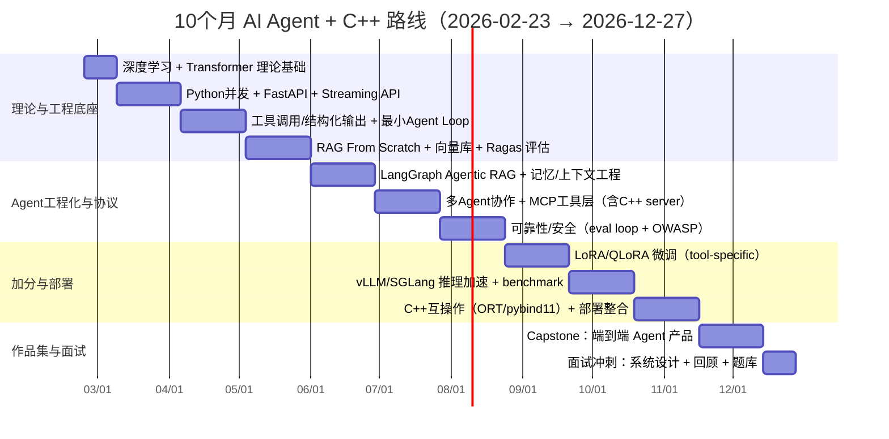

# 十个月 AI Agent + C++ 精细学习路线

## 行政摘要

本路线的核心非常清晰：先补齐 **Python 后端基础（并发/网络/FastAPI）**，再以 **LangChain + LangGraph** 作为 Agent 主线框架，配合 **RAG（All-in-RAG / LlamaIndex / RAG From Scratch）** 与 **评估（Ragas）**，之后再加分做 **微调（LoRA / LlamaFactory）**、**推理加速（vLLM / KV Cache / SGLang）**，最后用 **面试知识点（并发、SSE、STDIO、WebSocket、MCP、A2A）** 做收尾。这条路本身是合理且「可工作化」的。

我会将这条路线「工程化」到一个 **10 个月（44 周）**、由 **2026-02-23（Mon）到 2026-12-27（Sun）** 的日历式计划：
1) 每周都有明确交付物（repo / demo / 指标）
2) 从第 2 个月开始建立「固定评估集 + 回归测试」文化（RAG/Agent 最重要），并用 Ragas/LangSmith 形成 eval loop（避免只靠 vibe check）
3) C++ 不会是「旁枝」，而是三个固定落点：**（a）工具/协议层：MCP 工具服务器（stdio/HTTP, JSON-RPC）**；**（b）推理/部署层：ONNX Runtime C++ / 自托管 server**；**（c）性能敏感模组：pybind11 / C++ service**

完成后应该有一套作品集：
- 一个 production 级 **RAG Agent**（含 Ragas 指标报告）
- 一个 **多 Agent workflow**（LangGraph / AutoGen 任一）
- 一个 **C++ MCP 工具服务器**（可被 agent 通过 stdio/HTTP 调用）
- 一个 **自托管推理解决方案**（vLLM / SGLang），并有 benchmark 指标与部署方式

（可选加分）再加上 LoRA/QLoRA 小型微调与部署（vLLM per-request LoRA 或 merge）。

---

## 理论基础：深度学习与 Transformer

> 在进入 LLM 应用工程之前，必须掌握底层理论。以下是从深度学习到 Transformer 到 LLM 的知识脉络。

### 深度学习基础

#### 神经网络核心概念

| 概念 | 说明 |
|------|------|
| 前馈神经网络（FNN） | 最基础的网络结构：输入层 → 隐藏层 → 输出层，数据单向流动 |
| 激活函数 | ReLU、GELU、Sigmoid、Tanh——引入非线性，GELU 是 Transformer 中最常用的激活函数 |
| 损失函数 | 交叉熵损失（分类）、均方误差（回归）——衡量预测与真实值的差距 |
| 反向传播 | 通过链式法则计算梯度，是神经网络训练的核心算法 |
| 梯度下降 | SGD、Adam、AdamW——优化器决定如何更新权重，AdamW 是 LLM 训练的标准选择 |

#### 训练关键技术

- **正则化**：Dropout（随机丢弃神经元防止过拟合）、权重衰减（L2 正则化）
- **批归一化（Batch Norm）vs 层归一化（Layer Norm）**：Transformer 使用 Layer Norm，因为它不依赖 batch 内的统计量，适合变长序列
- **学习率调度**：Warmup + Cosine Decay 是 LLM 预训练的标准策略
- **梯度裁剪（Gradient Clipping）**：防止梯度爆炸，LLM 训练必备

#### 从 RNN/LSTM 到 Transformer 的演进

```
RNN → LSTM/GRU → Seq2Seq + Attention → Transformer
```

| 架构 | 核心思想 | 局限性 |
|------|---------|--------|
| RNN | 隐藏状态逐步传递，捕捉序列依赖 | 长距离依赖丢失（梯度消失），无法并行 |
| LSTM | 引入门控机制（遗忘门、输入门、输出门），缓解梯度消失 | 仍然是序列计算，训练速度慢 |
| Seq2Seq + Attention | Encoder-Decoder 结构，Attention 让 decoder 关注 encoder 的所有位置 | Encoder 仍是 RNN，计算瓶颈未根本解决 |
| **Transformer** | **完全抛弃 RNN，纯 Attention 机制，支持完全并行计算** | 内存随序列长度二次增长（已有多种优化） |

**为什么 Transformer 胜出？** 核心原因是 **Self-Attention 的并行性**——RNN 必须按时间步顺序计算，而 Self-Attention 可以一次性计算所有位置之间的关系，充分利用 GPU 并行能力。

### Transformer 架构详解

> 论文：*Attention Is All You Need*（Vaswani et al., 2017）

#### 整体结构

Transformer 由 **Encoder**（编码器）和 **Decoder**（解码器）两部分组成：

```
输入序列 → [Embedding + 位置编码] → Encoder (×N) → 编码表示
                                                        ↓
目标序列 → [Embedding + 位置编码] → Decoder (×N) → Linear → Softmax → 输出概率
```

- **Encoder**：由 N 个相同的层堆叠，每层包含 Multi-Head Self-Attention + Feed-Forward Network
- **Decoder**：同样 N 层堆叠，每层包含 Masked Self-Attention + Cross-Attention + Feed-Forward Network

#### 自注意力机制（Self-Attention）

Self-Attention 是 Transformer 的核心。对于输入序列中的每个 token，计算它与所有其他 token 的关联程度：

$$\text{Attention}(Q, K, V) = \text{softmax}\left(\frac{QK^T}{\sqrt{d_k}}\right)V$$

- **Q（Query）**：当前 token 的查询向量——"我在找什么"
- **K（Key）**：每个 token 的键向量——"我有什么"
- **V（Value）**：每个 token 的值向量——"我能提供什么"
- **$\sqrt{d_k}$**：缩放因子，防止点积值过大导致 softmax 梯度消失

**直觉理解**：Self-Attention 就像一个搜索引擎——Query 是搜索词，Key 是每个文档的标题，Value 是文档内容。相关性高的文档（Key 与 Query 匹配度高）会获得更大权重。

#### 多头注意力（Multi-Head Attention）

将 Q、K、V 分成 h 个头（head），每个头独立计算 Attention，最后拼接：

$$\text{MultiHead}(Q,K,V) = \text{Concat}(\text{head}_1, ..., \text{head}_h)W^O$$

**为什么需要多头？** 单头注意力只能捕捉一种关联模式。多头让模型同时关注不同类型的关系——例如一个头关注语法结构，另一个头关注语义相似性。

#### 位置编码（Positional Encoding）

Transformer 没有 RNN 的天然顺序感知，必须显式注入位置信息：

- **正弦/余弦位置编码**（原始论文）：$PE_{(pos,2i)} = \sin(pos/10000^{2i/d})$
- **旋转位置编码（RoPE）**：LLaMA 等现代 LLM 使用，将位置信息编码为旋转矩阵，支持长度外推
- **ALiBi**：直接在 Attention 分数上加入位置偏置，无需额外参数

#### 关键组件小结

| 组件 | 作用 | 关键点 |
|------|------|--------|
| Token Embedding | 将 token ID 映射为稠密向量 | 维度通常为 768/1024/4096 |
| Positional Encoding | 注入位置信息 | 现代模型多用 RoPE |
| Multi-Head Attention | 捕捉 token 间关系 | 计算复杂度 O(n²d) |
| Feed-Forward Network | 逐位置非线性变换 | 通常是两层 MLP，中间维度是 4×d |
| Layer Norm | 稳定训练 | Pre-LN（放在 Attention 之前）是现代标准 |
| Residual Connection | 缓解梯度消失 | 每个子层都有残差连接 |

### 从 Transformer 到大语言模型（LLM）

#### 三大架构变体

| 架构 | 代表模型 | 预训练任务 | 适用场景 |
|------|---------|-----------|---------|
| **Encoder-only** | BERT、RoBERTa | 掩码语言模型（MLM） | 文本分类、NER、语义相似度 |
| **Decoder-only** | GPT 系列、LLaMA、Qwen | 自回归语言模型（CLM） | 文本生成、对话、代码生成 |
| **Encoder-Decoder** | T5、BART | 序列到序列（Seq2Seq） | 翻译、摘要、问答 |

> 当前 LLM 主流是 **Decoder-only** 架构（GPT、LLaMA、Qwen、DeepSeek 等），因为自回归生成天然适配「下一个 token 预测」范式。

#### LLM 的训练流程

```
预训练（Pretraining）→ 监督微调（SFT）→ 人类反馈强化学习（RLHF/DPO）
```

1. **预训练**：在海量文本上训练「下一个 token 预测」，学习语言知识和世界知识
2. **监督微调（SFT）**：用高质量的指令-回答对训练模型遵循指令
3. **对齐（Alignment）**：
   - **RLHF**：用人类偏好训练奖励模型，再用 PPO 优化策略
   - **DPO（Direct Preference Optimization）**：直接从偏好数据优化，不需要单独的奖励模型，更简单稳定

#### LLM 推理的关键概念

| 概念 | 说明 | 工程意义 |
|------|------|---------|
| **KV Cache** | 缓存已计算的 Key/Value，避免重复计算 | 推理加速的核心手段，vLLM/SGLang 都依赖它 |
| **温度（Temperature）** | 控制输出分布的平滑程度，越高越随机 | 生产环境通常设 0~0.3 保证确定性 |
| **Top-p / Top-k 采样** | 限制采样候选集合 | 平衡生成质量与多样性 |
| **上下文窗口** | 模型能处理的最大 token 数 | 直接影响 RAG 中 context 的放置策略 |
| **Tokenization** | BPE/SentencePiece 将文本切分为 token | 理解 token 数量对成本和延迟的影响 |

#### 参数高效微调（PEFT）

全量微调 LLM 需要巨大的显存和算力，PEFT 方法通过只训练少量参数实现高效微调：

| 方法 | 原理 | 可训练参数量 |
|------|------|-------------|
| **LoRA** | 冻结原始权重，注入低秩分解矩阵 $W = W_0 + BA$（B∈R^{d×r}, A∈R^{r×k}$，r << d） | 原始模型的 0.1%~1% |
| **QLoRA** | 在 LoRA 基础上将基础模型量化为 4-bit，进一步降低显存 | 同 LoRA，但基础模型显存降低 4× |
| **Adapter** | 在 Transformer 层间插入小型适配层 | 约 3%~5% |
| **Prefix Tuning** | 在输入前添加可学习的连续前缀向量 | 约 0.1% |

> LoRA 是当前最主流的 PEFT 方法，本路线在 W25-W28 会实操。

### 这些理论如何支撑后续学习

| 理论知识 | 对应的工程应用 |
|---------|--------------|
| Self-Attention 机制 | 理解 RAG 中 context 为什么能影响输出 |
| KV Cache | 理解 vLLM/SGLang 的推理加速原理 |
| Tokenization | 估算 API 成本、设计 chunking 策略 |
| LoRA/QLoRA | 微调阶段的核心方法（W25-W28） |
| 预训练 → SFT → RLHF 流程 | 理解模型能力的来源和局限 |
| 上下文窗口 | 设计 RAG 的 retrieval + prompt 策略 |
| 解码策略（Temperature/Top-p） | 生产环境中调优生成质量 |

---

## 学习路线重点与整合策略

以下模块会原样保留，并加上「工程检查点」与「C++ 插槽」：

- **Python 后端（基础）**：Python 并发 + FastAPI。使用 `asyncio + FastAPI` 做 agent service 常见的高并发 I/O 模式，并同时补 SSE/WebSocket（流式回应、工具结果推送）
- **Agent 开发（核心）**：以 LangChain + LangGraph 为主线。用 LangGraph 的「workflow vs agent」分法做工程建模：workflow 是可预定流程，agent 是动态工具选择；这个分法对可靠性设计非常实用
- **RAG**：采用「先 from scratch（理解 chunk/index/retrieval），再上框架」的路径：
  - LlamaIndex 对 RAG 流程定义清楚：数据先被索引，query 命中最相关 context，再与 query/prompt 一起输入 LLM
  - Datawhale 的 All-in-RAG 是全栈教程，可作中文主教材
  - LangChain 的 rag-from-scratch repo 是对照参考（理解 indexing → retrieval → generation 的组合）
- **评估（Ragas）**：将 Ragas 变成「每周必跑」回归测试（RAG + agentic workflow 都可评估）
- **Agent（多 Agent / 记忆 / 上下文工程）**：
  - 用 Datawhale 的 Hello-Agents 先建立「AI native agent」心智模型（同时理解 Dify/Coze 类 workflow 平台是另一派）
  - 多 agent 实作可用 AutoGen（有 stable docs）或 LangGraph 多节点/监督者模式
  - 记忆方面，mem0 / Zep 都提供「长期记忆/上下文组装」能力，可作加分整合素材
- **微调（加分）**：LlamaFactory + LoRA。LoRA 论文提出冻结基础权重，只注入低秩分解矩阵，显著减少可训练参数；PEFT 也提供 merge/unload
- **推理加速（加分）**：vLLM、KV Cache、SGLang。vLLM 有官方 LoRA per-request 支持；SGLang 定位是高性能 serving（低延迟、高吞吐）
- **协议（MCP、A2A）**：将 MCP 放入「工具层标准化」——MCP 以 JSON-RPC 编码消息，定义 stdio 与 streamable HTTP 两种 transport；A2A（Google 提出）定位为 agent 互操作协议，补足 MCP（agent↔tool）之上的 agent↔agent 协作

---

## 十个月路线总览

### 十个月分期一览（44 周）

| 阶段 | 周次（日期） | 核心学习内容 | 阶段交付物 |
|------|-------------|-------------|-----------|
| 理论基础 | W01-W02（02-23→03-08） | 深度学习基础、Transformer 架构、LLM 原理 | 理论笔记 + Transformer 论文精读 |
| 工程底座 | W03-W06（03-09→04-05） | Python 并发、FastAPI、SSE/WS、Docker/CI | 可流式回应的 agent API 服务骨架（含测试） |
| LLM 应用底座 | W07-W10（04-06→05-03） | 工具调用/结构化输出、最小 agent loop | Tool-calling demo + 回归测试集（JSON valid rate） |
| RAG 主线 | W11-W14（05-04→05-31） | chunk/index/retrieval、向量库、RAG 评估 | RAG service + Ragas 报告（faithfulness 等） |
| Agent 工程化 | W15-W18（06-01→06-28） | LangGraph workflow+agent、Agentic RAG | Agentic RAG（会决定何时检索）+ tracing/版本对比 |
| 多 Agent + 协议 | W19-W22（06-29→07-26） | AutoGen / LangGraph 多 agent、MCP、A2A | C++ MCP 工具服务器 + 多 agent 协作 demo |
| 可靠性与安全 | W23-W26（07-27→08-23） | Ragas/LangSmith eval loop、OWASP LLM Top 10 | 可靠性仪表板 + 安全测试集 |
| 微调加分 | W27-W30（08-24→09-20） | LoRA/QLoRA、LlamaFactory、合并/回滚 | 一个 tool-specific LoRA（前后对比指标） |
| 推理加速 | W31-W34（09-21→10-18） | vLLM/SGLang serving、LoRA per-request、benchmark | 自托管推理服务 + 压测报告 |
| C++ 落地 | W35-W38（10-19→11-15） | ONNX Runtime C++、pybind11、服务整合 | C++ 推理/工具服务（可被 agent 调用） |
| Capstone | W39-W42（11-16→12-13） | 统一成产品：RAG+Tools+Memory+Eval+Deploy | 一个可 demo 的「端到端 Agent 产品」 |
| 面试冲刺 | W43-W44（12-14→12-27） | 系统设计、协议、并发、题型 | 作品集整理 + mock interview |

### Mermaid 甘特图



---

## 周历与每日节奏

### 每周投入工时建议分配

| 方案 | 适合场景 | 每周结构（建议） | 最小输出要求 |
|------|---------|----------------|-------------|
| 10h/周 | 全职 + 转型 | 平日 1h × 5 + 周末 5h | 每周 1 个可 demo 交付物 + 1 次评估跑通 |
| 20h/周 | 全职 + 高强度 | 平日 2h × 5 + 周末 10h | 每周 2 个可 demo 交付物 + 固定回归集更新 |
| 40h/周 | 全职转型/空档期 | 平日 6h × 5 + 周末 10h | 每周完整「设计→实作→测试→部署→指标」闭环 |

> 「学完两个框架就可以做项目」——前提是将 **评估与回归** 一开始就内置，否则 agent 会变成不可控。Ragas 本身就主张从 vibe check 走向系统化 evaluation loop。

### 每周固定节奏模板

- **Mon**：阅读/规格（写 `SPEC.md`：输入输出、错误处理、性能目标）
- **Tue**：核心实作（feature 的最小可用版）
- **Wed**：测试 + 评估集（新增 10-20 条回归例）
- **Thu**：重构 + 可观测（logging、trace、指标）
- **Fri**：整理 demo（README、录屏 2-3 分钟）
- **Sat/Sun**：整合 + 部署 + 压测（至少一次 p95 latency / throughput 测量）

---

## 44 周精细任务表

> 每周最少要有：一个可 demo 的输出 + 一次评估跑通（Ragas / 回归测试 / 压测任一）。

### 第一阶段：理论基础（W01-W02）

| 周次（日期） | 主题焦点 | 本周交付物 | 指标/检查点 |
|-------------|---------|-----------|------------|
| W01（02-23→03-01） | 深度学习基础 + Transformer 精读 | *Attention Is All You Need* 论文精读笔记；手推 Self-Attention 计算过程 | 能独立画出 Transformer 完整架构图 |
| W02（03-02→03-08） | LLM 原理 + 训练流程 | Decoder-only 架构笔记；预训练→SFT→RLHF 流程总结；LoRA 原理笔记 | 能解释 KV Cache、Temperature、Top-p 的工程意义 |

### 第二阶段：工程底座（W03-W06）

| 周次（日期） | 主题焦点 | 本周交付物 | 指标/检查点 |
|-------------|---------|-----------|------------|
| W03（03-09→03-15） | Repo/环境 + asyncio 入门 | FastAPI skeleton + 单测 | `/health` 稳定；测试可跑 |
| W04（03-16→03-22） | Streaming：SSE/WS | SSE 或 WS streaming endpoint | 连接稳定；无 memory leak（粗测） |
| W05（03-23→03-29） | Python 并发工程化 | timeout/retry/circuit-breaker 雏形 | tool timeout 命中率、重试成功率 |
| W06（03-30→04-05） | Docker/CI | Dockerfile + CI（lint/test） | 一键重现（clone→run） |

### 第三阶段：LLM 应用底座（W07-W10）

| 周次（日期） | 主题焦点 | 本周交付物 | 指标/检查点 |
|-------------|---------|-----------|------------|
| W07（04-06→04-12） | 结构化输出 | JSON schema 验证器 + 回归集 v1 | JSON valid rate baseline |
| W08（04-13→04-19） | Tool calling loop | tool schema + tool runner + demo | tool-call success rate |
| W09（04-20→04-26） | LangChain tools 入门 | 3 个 tools（db/search/calc） | 工具参数错误率下降 |
| W10（04-27→05-03） | 最小 Agent | 单 agent：可自己选工具解任务 | task success rate baseline |

### 第四阶段：RAG 主线（W11-W14）

| 周次（日期） | 主题焦点 | 本周交付物 | 指标/检查点 |
|-------------|---------|-----------|------------|
| W11（05-04→05-10） | RAG from scratch | ingest→embed→retrieve→answer | top-k 命中率 baseline |
| W12（05-11→05-17） | 向量库落地 | FAISS 或 pgvector（二选一） | p95 retrieval latency |
| W13（05-18→05-24） | RAG 策略（chunk/query） | 改善 chunking + rerank（可选） | 指标提升（自定） |
| W14（05-25→05-31） | RAG 评估（Ragas） | Ragas pipeline + 报告 | faithfulness / relevance 等 |

### 第五阶段：Agent 工程化（W15-W18）

| 周次（日期） | 主题焦点 | 本周交付物 | 指标/检查点 |
|-------------|---------|-----------|------------|
| W15（06-01→06-07） | LangGraph 入门 | 最小 state graph workflow | 可回放 state 变化 |
| W16（06-08→06-14） | Agentic RAG（LangGraph） | retriever tool + agent 决策 | 不必要检索率下降 |
| W17（06-15→06-21） | 记忆/上下文工程 | session memory + summarization | 长对话一致性提升 |
| W18（06-22→06-28） | Hello-Agents 精读 | 按 Hello-Agents 做一个 mini-agent | 对照自己的框架设计 |

### 第六阶段：多 Agent + 协议（W19-W22）

| 周次（日期） | 主题焦点 | 本周交付物 | 指标/检查点 |
|-------------|---------|-----------|------------|
| W19（06-29→07-05） | 多 agent pattern | supervisor/executor pattern demo | steps-to-done 下降 |
| W20（07-06→07-12） | AutoGen quickstart | 两 agent 协作解任务 | 协作成功率 |
| W21（07-13→07-19） | MCP 工具层 | Python MCP server（先跑通） | stdio 通信成功率 |
| W22（07-20→07-26） | C++ MCP server | C++ 写 MCP tool server（stdio） | 工具调用 p95 latency |

### 第七阶段：可靠性与安全（W23-W26）

| 周次（日期） | 主题焦点 | 本周交付物 | 指标/检查点 |
|-------------|---------|-----------|------------|
| W23（07-27→08-02） | Eval loop 制度化 | 固定回归集 + 版本对比 | regressions 可定位 |
| W24（08-03→08-09） | LangSmith / tracing（可选） | trace + offline eval 报告 | 每次改动可回放 |
| W25（08-10→08-16） | 安全测试基线 | prompt injection / output handling 测试集 | OWASP 用例覆盖 |
| W26（08-17→08-23） | 成本/性能治理 | 缓存/批处理策略 | 成本/延迟 baseline |

### 第八阶段：微调加分（W27-W30）

| 周次（日期） | 主题焦点 | 本周交付物 | 指标/检查点 |
|-------------|---------|-----------|------------|
| W27（08-24→08-30） | LoRA 入门 | LoRA 任务设计 + dataset 准备 | baseline vs LoRA 计划 |
| W28（08-31→09-06） | LoRA 实作 | adapter checkpoints | loss 曲线 + 行为指标 |
| W29（09-07→09-13） | 合并/回滚 | merge_and_unload / unmerge 流程 | merge 前后延迟对比 |
| W30（09-14→09-20） | LoRA 部署 | vLLM per-request LoRA（可选） | 多 adapter 切换成功率 |

### 第九阶段：推理加速（W31-W34）

| 周次（日期） | 主题焦点 | 本周交付物 | 指标/检查点 |
|-------------|---------|-----------|------------|
| W31（09-21→09-27） | vLLM serving | 自托管推理 API | tokens/s、p95 latency |
| W32（09-28→10-04） | SGLang survey | SGLang demo + 观测 | 端到端延迟对比 |
| W33（10-05→10-11） | 压测与瓶颈 | load test + profiler | throughput 提升 |
| W34（10-12→10-18） | Agent ↔ Inference 整合 | agent 走自托管推理 | 整体 p95 latency |

### 第十阶段：C++ 落地（W35-W38）

| 周次（日期） | 主题焦点 | 本周交付物 | 指标/检查点 |
|-------------|---------|-----------|------------|
| W35（10-19→10-25） | ONNX export | merged model 导出 ONNX（可选） | ONNX 推理可跑通 |
| W36（10-26→11-01） | ORT C++ 推理 | C++ inference demo（最小） | 吞吐/延迟 baseline |
| W37（11-02→11-08） | pybind11 互操作 | C++ 模组绑定 Python | 比纯 Python 快（benchmark） |
| W38（11-09→11-15） | 系统整合 | C++ 工具/推理接入 agent | end-to-end 成功率 |

### 第十一阶段：Capstone（W39-W42）

| 周次（日期） | 主题焦点 | 本周交付物 | 指标/检查点 |
|-------------|---------|-----------|------------|
| W39（11-16→11-22） | Capstone 设计 | 架构图 + SLA + threat model | 指标目标清晰 |
| W40（11-23→11-29） | Capstone 实作 | RAG+Tools+Memory | 回归集扩到 200+ |
| W41（11-30→12-06） | Capstone 可靠性 | eval loop + tracing + 监控 | regressions gate |
| W42（12-07→12-13） | Capstone 上线包装 | Docker/K8s（可选）+ demo 影片 | 一键部署/一键 demo |

### 第十二阶段：面试冲刺（W43-W44）

| 周次（日期） | 主题焦点 | 本周交付物 | 指标/检查点 |
|-------------|---------|-----------|------------|
| W43（12-14→12-20） | 作品集整合 + 系统设计 | 3-4 repos + landing README；系统设计题库 | 作品可讲故事；模拟讲解 3 次 |
| W44（12-21→12-27） | Mock interview + 最终打磨 | 2 次 mock + README/测试/benchmark 补齐 | 全部 demo 可重现 |

---

## 作品集专案与交付物

十个月最核心要构建的是「可展示、可评估、可部署」的 agent 系统。以下四个作品集项目贯穿 44 周：

### 作品一：RAG 工程专案（核心作品）

- **内容**：从零做 chunking → embedding → index → retrieval → generation，并用 FAISS/pgvector 二选一落地
  - FAISS 是高效相似度搜索/聚类库，C++ 编写、提供 Python wrappers，有 GPU 实现
  - pgvector 是 Postgres 向量相似度搜索扩展（可把向量和其他数据放在同一 DB）
- **交付物**：`rag_service`（ingest/query API）+ `eval`（Ragas 指标报告）
- **KPI**：Ragas 指标（最少 2 个）、p95 latency、top-k 命中率（自定义 ground truth）

### 作品二：Agentic RAG + Workflow 专案（LangGraph 主线）

- **内容**：用 LangGraph 将「何时检索」「何时调工具」「何时停止」变成可控 graph——建立 retriever tool，让 agent 决定是否使用
- **交付物**：`agent_graph`（state graph + retriever tool + tools）
- **KPI**：任务成功率、工具浪费率（不必要 tool calls）、平均步数（steps-to-done）

### 作品三：多 Agent + 协议专案（MCP + A2A + C++）

- **工具层**：做一个 **C++ MCP tool server**（例如：CMake/build、log 解析、FAISS 查询）
  - MCP 用 JSON-RPC、标准 transport 包括 stdio 与 Streamable HTTP
- **Agent↔Agent 层**：加入 A2A（最低能力：agent 能互相「委派任务」与「返回结果」）
  - A2A 是一个开放协议，用于 agent 互操作，补足 MCP 在 agent↔agent 层面的空白
- **交付物**：
  - `cpp_mcp_server`（stdio transport）
  - `multi_agent_demo`（agent1：planner，agent2：executor）
- **KPI**：跨 agent 任务完成率、错误隔离（某 agent failure 不拖垮整体）

### 作品四：推理加速与自托管部署专案（vLLM / SGLang）

- **vLLM**：可 per-request 高效服务 LoRA adapters 且 overhead minimal（适合多租户/多任务）
- **SGLang**：高性能 serving framework，主打低延迟高吞吐，可从单 GPU 扩到集群
- **交付物**：
  - `serve/vllm` 或 `serve/sglang`（自托管推理 API）
  - `bench/`（QPS、tokens/s、p95 latency、显存峰值）
- **KPI**：吞吐、延迟、成本（每千 token 成本/资源占用）——可以先以相对值比较（同一硬件、同一任务）

---

## C++ 互操作、推理部署与性能路线

作为 C++ 工程师，最大优势是可以把 agent 系统中「最难稳定」的部分工程化：工具层、部署层、性能层。

### 工具层（最推荐 C++ 落点）：MCP 工具标准化

MCP 将工具调用收敛成「JSON-RPC 消息 + transport（stdio/HTTP）」；C++ 做 stdio server 非常自然（读 stdin、写 stdout、做 timeout）。可以将「原本 Python agent 直接 subprocess/gRPC 调用 C++」升级成「agent ↔ MCP server」，工具就能被不同 agent 框架重用（LangGraph、AutoGen、甚至低代码平台）。

### 推理层：ONNX Runtime C++ / 自托管推理 server

- 若想把模型推理放入 C++ 服务：ONNX Runtime 提供 C/C++ API，是跨平台 inference/training accelerator
- 若想先快速自托管（更贴合 agent 场景）：vLLM / SGLang 是更工程化的 serving 路线（先 API 化，再逐步向 C++ 推理靠拢）

### Python↔C++ 互操作：pybind11

pybind11 是 header-only 库，目标是以最少 boilerplate 完成 C++↔Python 绑定。最实用落点：
- 大规模文本清洗 / chunking（CPU heavy）
- 自研索引/检索（或包装 FAISS C++）
- 高性能规则引擎（例如 schema 验证、策略路由）

### 低代码平台：Dify / Coze 的正确使用方式

- **Dify**：开源 LLM app 平台，支持 agentic workflow、RAG 等，用于快速落地 prototype
- **Coze**：提供 workflow/agent workflow 使用指南，适合用作「快速理解产品型 agent workflow」，但不建议取代核心工程能力（仍需要可测、可观测、可部署的代码系统）

---

## 评估、面试与资源

### 评估体系（Ragas 为核心，制度化执行）

- **Ragas**：帮助从 vibe checks 走向系统化 evaluation loop，提供针对 RAG 与 agentic workflows 的 metrics
- **LangSmith**：强调 offline evaluation（预上线回归）以比较版本、捕捉 regressions
- **固定追踪的最小 KPI**：
  - **RAG**：至少 2 个 Ragas 指标 + 人工抽样审核
  - **Agent**：tool-call success rate、schema-valid rate、task success rate
  - **Serving**：p95 latency、tokens/s、显存峰值

### 安全（面试和上线都需要）

OWASP Top 10 for LLM Applications 列出 prompt injection、insecure output handling、model DoS 等风险。Agent 因为有工具/行动能力，风险更大，所以要把「恶意输入回归集」内置。

### 面试知识点

- **后端**：并发/异步、线程池、消息队列、HTTP、SSE、WebSocket
  - SSE 是 EventSource 接口（server push）的一种方式，WebSocket 是 RFC 6455 定义的双向通信协议
- **大模型应用**：LangChain/LangGraph（核心）、RAG、Multi-Agent、上下文工程、记忆、评估
  - LangChain tools 是可调用函数接口，模型按上下文决定何时调用
  - LangGraph 将 workflows 与 agents 分开，方便在面试中讲清「哪些流程应该 deterministic，哪些可以 agentic」
- **协议**：MCP、A2A（近年面试加分点）
  - MCP transports（stdio / streamable HTTP）与 JSON-RPC 是可以用工程语言阐述的亮点
- **理论基础**：Transformer 架构、Self-Attention 机制、KV Cache、LoRA/QLoRA 原理、预训练→SFT→RLHF 流程

### 推荐阅读次序（与十个月计划对齐）

1. *Attention Is All You Need* + 深度学习基础（先建立理论根基）
2. Python `asyncio` + FastAPI concurrency（把服务骨架跑通）
3. 工具调用/结构化输出（建立可靠 I/O contract）
4. RAG（from scratch → All-in-RAG → LlamaIndex / LangChain）
5. LangGraph（workflow/agent patterns、agentic RAG）
6. 评估（Ragas + LangSmith）
7. 协议（MCP → A2A）
8. 推理加速（vLLM / SGLang）
9. C++ 落地（pybind11、ONNX Runtime C++）

### 官方/可信资源链接

```text
[理论基础]
(EN) Attention Is All You Need
https://arxiv.org/abs/1706.03762
(EN) The Illustrated Transformer (Jay Alammar)
https://jalammar.github.io/illustrated-transformer/
(EN) 3Blue1Brown: Neural Networks
https://www.3blue1brown.com/topics/neural-networks
(EN) Andrej Karpathy: Let's build GPT
https://www.youtube.com/watch?v=kCc8FmEb1nY
(EN) Hugging Face NLP Course
https://huggingface.co/learn/nlp-course

[Python / FastAPI / Streaming]
(EN) asyncio — Asynchronous I/O
https://docs.python.org/3/library/asyncio.html
(EN) FastAPI Concurrency and async/await
https://fastapi.tiangolo.com/async/
(EN) MDN SSE (EventSource)
https://developer.mozilla.org/en-US/docs/Web/API/Server-sent_events/Using_server-sent_events
(EN) RFC 6455 WebSocket
https://datatracker.ietf.org/doc/html/rfc6455

[LangChain / LangGraph / RAG]
(EN) LangChain Tools
https://docs.langchain.com/oss/python/langchain/tools
(EN) LangGraph workflows and agents
https://docs.langchain.com/oss/python/langgraph/workflows-agents
(EN) LangGraph Agentic RAG
https://docs.langchain.com/oss/python/langgraph/agentic-rag
(EN) rag-from-scratch repo
https://github.com/langchain-ai/rag-from-scratch
(ZH) Datawhale All-in-RAG
https://github.com/datawhalechina/all-in-rag
(ZH) Datawhale Hello-Agents
https://github.com/datawhalechina/hello-agents
(EN) LlamaIndex RAG explanation
https://developers.llamaindex.ai/python/framework/understanding/rag/

[Evaluation / Security]
(EN) Ragas docs
https://docs.ragas.io/en/stable/
(EN) LangSmith Evaluation
https://docs.langchain.com/langsmith/evaluation
(EN) OWASP Top 10 for LLM Applications
https://owasp.org/www-project-top-10-for-large-language-model-applications/

[Multi-agent / Protocols]
(EN) AutoGen docs (stable)
https://microsoft.github.io/autogen/stable//index.html
(EN) MCP transports spec (stdio / streamable HTTP; JSON-RPC)
https://modelcontextprotocol.io/specification/2025-06-18/basic/transports
(EN) Google: Agent2Agent (A2A) Protocol announcement
https://developers.googleblog.com/en/a2a-a-new-era-of-agent-interoperability/
(EN) A2A GitHub
https://github.com/a2aproject/A2A

[Fine-tuning / Inference]
(EN) LoRA paper
https://arxiv.org/abs/2106.09685
(EN) QLoRA paper
https://arxiv.org/abs/2305.14314
(EN) vLLM LoRA adapters
https://docs.vllm.ai/en/stable/features/lora.html
(EN) SGLang repo
https://github.com/sgl-project/sglang
(ZH/EN) LlamaFactory repo
https://github.com/hiyouga/LlamaFactory

[C++ interop / deployment]
(EN) pybind11 docs
https://pybind11.readthedocs.io/
(EN) ONNX Runtime C++ get started
https://onnxruntime.ai/docs/get-started/with-cpp.html
```
