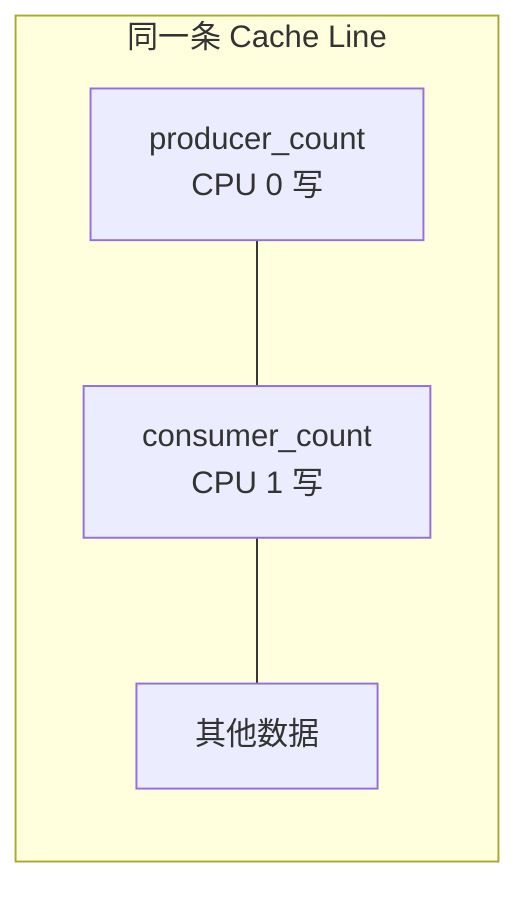
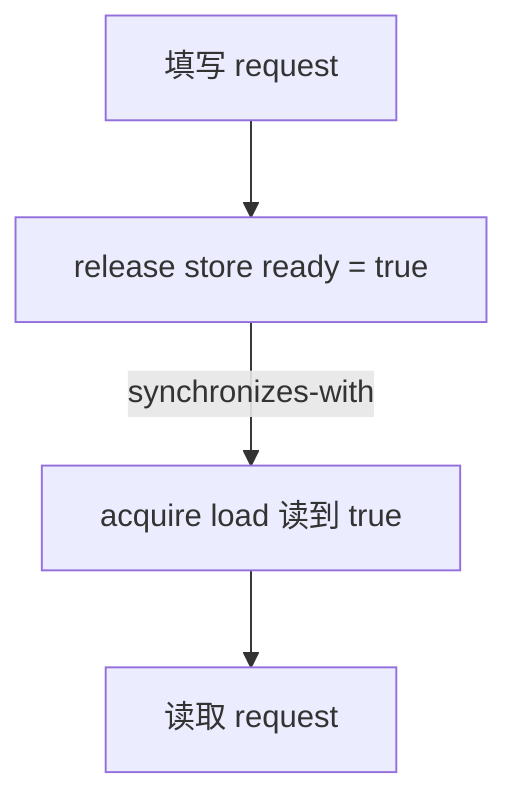
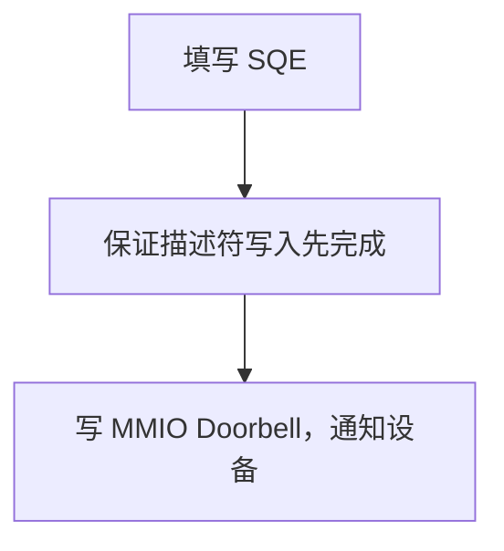

---
tags:
  - 高性能存储/数据路径硬件基础
status: active
---

# CPU Cache、Cache Line 与内存屏障

> 多核程序交换的不是一个个变量，而是一整条缓存行的所有权。内存屏障解决的也不是“把缓存写回内存”，而是约束发布与观察的先后关系。

---

## 1. 先看数据路径里的问题

假设一个线程填写请求，另一个线程轮询 `ready`：

```cpp
Request request;
std::atomic<bool> ready{false};

// 提交线程
request.opcode = read_opcode;
request.address = buffer_address;
ready.store(true, std::memory_order_release);

// 轮询线程
if (ready.load(std::memory_order_acquire)) {
    submit(request);
}
```

这里有两个不同的问题：

1. `request` 和 `ready` 落在哪些缓存行上，决定两个核心之间要搬多少数据、争夺多少次缓存行所有权；
2. `release` 与 `acquire` 规定先写请求、后发布状态。消费端读到 `true` 后，才能读取完整的请求。

前者主要影响性能，后者直接影响正确性。伪共享属于前者，错误的内存序属于后者，不能混为一谈。

![[图片/SVG/8_0_1_1.svg|900]]

---

## 2. CPU 为什么需要 Cache

CPU 执行指令的速度与访问 DRAM 的速度不在同一量级。处理器在核心和内存之间放入多级缓存，用较小、较快的存储保存近期数据。

常见层次如下：

| 层次 | 常见归属 | 特点 |
| --- | --- | --- |
| L1 Cache | 每个核心私有，通常区分指令与数据 | 容量小，离执行单元最近 |
| L2 Cache | 通常每核私有 | 比 L1 大，访问更慢 |
| LLC / L3 Cache | 多核共享或按簇共享 | 容量更大，也是跨核数据常经过的位置 |
| DRAM | 处理器外部内存 | 容量大，延迟远高于片上缓存 |

这只是常见形态，不是架构承诺。缓存级数、共享范围、包含关系都会随处理器变化。做性能分析时应查询目标机器，而不是把某款 x86 CPU 的结构当成通用结论：

```bash
lscpu -C
getconf LEVEL1_DCACHE_LINESIZE
```

`lscpu -C` 可查看 Linux 已识别的缓存层次；第二条命令可查询一级数据缓存行大小。实际支持情况取决于系统和 libc。

### 2.1 局部性

Cache 能工作，依赖两种局部性：

- **时间局部性**：刚访问过的数据，接下来还可能访问；
- **空间局部性**：访问一个地址后，附近地址也可能被访问。

顺序扫描数组通常比随机访问更友好，因为一次取回的缓存行里包含后续要用的数据。链表节点散落在堆上时，预取器较难预测下一次访问，Cache Miss 也更多。

### 2.2 Cache Miss 不只一种

分析 miss 时可以先按成因分开：

- **冷缺失**：第一次访问，缓存里本来就没有；
- **容量缺失**：工作集超过可用缓存容量；
- **冲突缺失**：多个地址映射到同一组，彼此驱逐；
- **一致性缺失**：其他核心写入同一缓存行，使本核副本失效。

前三种常从数据布局和访问顺序入手；最后一种要看线程间的共享方式。

---

## 3. Cache Line 才是传输和一致性的基本单位

CPU Cache 不按单个 `int` 搬运数据，而是按 **Cache Line** 搬运。缓存行大小由硬件决定，很多通用处理器是 64 B，但代码不应把这个数当作跨平台标准。

C++17 提供了两个实现相关的常量：

```cpp
#include <new>

std::hardware_destructive_interference_size;
std::hardware_constructive_interference_size;
```

- `hardware_destructive_interference_size`：希望避免伪共享时，可用作对象间隔；
- `hardware_constructive_interference_size`：希望一起访问的数据落得更近时，可用作布局参考。

它们是标准库针对目标平台给出的值，不保证等于处理器真实 Cache Line 大小；部分标准库或编译环境也可能不完整支持。工程代码应结合目标平台验证。

### 3.1 对齐不等于填充

`alignas` 只约束对象起始地址。若要隔开两个频繁写入的字段，还要确保每个字段占据独立的间隔：

```cpp
#include <atomic>
#include <cstdint>
#include <new>

struct alignas(std::hardware_destructive_interference_size) CounterSlot {
    std::atomic<std::uint64_t> value{0};
};

struct Counters {
    CounterSlot producer;
    CounterSlot consumer;
};
```

这里两个 `CounterSlot` 各自对齐，数组元素或相邻成员的步长也不会小于该类型的大小。只给外层 `Counters` 加一次 `alignas`，内部两个原子变量仍可能紧挨着。

---

## 4. 多核如何维护一致性

每个核心都有私有缓存。同一个物理地址可能同时出现在多个核心的 Cache 中，因此硬件需要缓存一致性协议。

MESI 是常用的心智模型：

| 状态 | 含义 |
| --- | --- |
| Modified | 本核持有唯一且已修改的副本 |
| Exclusive | 本核持有唯一、未修改的副本 |
| Shared | 多个核心可以持有只读副本 |
| Invalid | 当前副本不可再使用 |

真实处理器可能采用 MOESI、MESIF 或其他变体，互连实现也不一定是早期教材里的“共享总线”。对软件最有用的结论只有两个：

1. 多个核心读同一缓存行通常可以共享副本；
2. 某个核心要写时，需要取得该行的独占所有权，并让其他核心的副本失效。

如果两个核心轮流写同一行，所有权就会在核心之间来回转移。这种现象常被称为 **cache line bouncing**。

### 4.1 一致性不等于内存顺序

缓存一致性回答的是：对同一内存位置的写，核心最终如何形成一致观察。

内存顺序回答的是：对不同内存位置的多个读写，其他核心允许按什么顺序观察。

硬件保持缓存一致，并不代表另一个核心会按源码顺序观察到 `data = ...` 和 `ready = true`。编译器重排、乱序执行、Store Buffer 等机制仍可能改变跨线程观察顺序。发布协议因此还需要 C++ 内存模型或平台提供的屏障原语。

---

## 5. False Sharing：变量没共享，缓存行共享了

两个线程各写一个不同变量，从 C++ 对象层面看没有冲突；如果两个变量位于同一缓存行，硬件仍要在核心之间转移整行所有权。



CPU 0 写 `producer_count` 会使 CPU 1 的整行副本失效；CPU 1 接着写 `consumer_count`，又要把所有权拿回来。两个线程没有逻辑共享，却在硬件层面互相干扰，这就是伪共享。

![[图片/SVG/8_0_1_2.svg|900]]

### 5.1 常见位置

- 环形队列的 `head` 与 `tail`；
- 每线程统计数组中的相邻计数器；
- 对象池里被不同线程反复修改的相邻元数据；
- 一个热写字段与一个热读字段挤在同一行；
- 多个线程更新同一结构体中的独立状态。

### 5.2 处理办法

优先从所有权入手，而不是见到共享变量就填充：

1. **单写者**：让一个线程独占某份可变状态，其他线程通过消息传递；
2. **批量更新**：线程先更新本地计数，降低写共享行的频率；
3. **读写分离**：把频繁写入的控制字段与只读数据拆开；
4. **必要时对齐**：确认热点字段确实位于同一行后，再使用填充或 `alignas`。

填充会增大对象，可能降低缓存利用率并增加 TLB 压力。它是针对已确认热点的布局手段，不是所有并发结构的默认写法。

---

## 6. 内存屏障到底约束什么

现代系统里至少有三个排序层次：

| 层次 | 负责什么 | 常用手段 |
| --- | --- | --- |
| 编译器 | 是否移动、合并或删除内存访问 | C++ 原子语义、编译器屏障 |
| CPU | 其他核心能按什么顺序观察普通内存访问 | acquire/release、硬件 fence |
| 设备与总线 | CPU、DMA 设备和 MMIO 之间的可见与顺序 | DMA API、I/O 屏障、设备协议 |

“插入一条 fence 就全部解决”通常是错的。先确认通信双方是谁，再选对应层次的原语。

### 6.1 C++ 中优先表达发布关系

对线程间通信，优先把顺序绑定到负责发布状态的原子变量：

```cpp
#include <atomic>

struct Request {
    int opcode{};
    void* buffer{};
};

Request request;
std::atomic<bool> ready{false};

void produce() {
    request.opcode = 1;
    request.buffer = nullptr;
    ready.store(true, std::memory_order_release);
}

void consume() {
    while (!ready.load(std::memory_order_acquire)) {
        // busy polling
    }

    use(request);  // 读到 true 后，能看到 produce 对 request 的写入
}
```

当 acquire load 读到 release store 写入的值时，二者建立 `synchronizes-with`，进而形成 happens-before：



屏障的关键不是“强制所有缓存立刻写回 DRAM”，而是让这个发布顺序成立。

### 6.2 常用内存序

| 内存序 | 保证 | 适合场景 |
| --- | --- | --- |
| `relaxed` | 保证该原子对象的原子性和修改顺序，不发布其他普通内存 | 独立统计计数、无需传递数据的状态 |
| `acquire` | 后续读写不能越过该操作向前 | 消费已经发布的数据 |
| `release` | 之前读写不能越过该操作向后 | 发布已经写好的数据 |
| `acq_rel` | 同时具有 acquire 与 release 约束 | 参与发布协议的读改写操作 |
| `seq_cst` | 再要求所有顺序一致操作进入单一全局顺序 | 默认选择，便于先保证正确性 |

`relaxed` 不是“完全没有可见性”。线程仍会看到该原子对象自身修改顺序中的某个值；它缺少的是把其他普通内存读写一起发布出去的顺序保证。

不同架构生成的指令也不同。x86-64 的普通 load/store 顺序较强，某些 acquire/release 操作不需要额外 fence；AArch64 等弱内存序架构可能需要带 acquire/release 语义的指令。C++ 代码应描述所需语义，不应根据一台 x86 机器上的汇编猜测跨平台正确性。

### 6.3 `atomic_thread_fence` 不是独立的通知机制

`std::atomic_thread_fence` 只负责排序。它通常还需要原子读写作为通信载体，才能建立跨线程同步关系。

如果已有明确的发布变量，把 release/acquire 直接写在该变量上通常更容易审查：

```cpp
// 更容易看出谁在发布、谁在消费
state.store(ready, std::memory_order_release);
state.load(std::memory_order_acquire);
```

单独放一条 fence，却说不清它通过哪个原子操作与另一线程配对，是无锁代码里的危险信号。

### 6.4 `volatile` 不是线程同步

C++ 的 `volatile` 主要用于特殊内存访问语义，例如实现相关的 MMIO 场景。它不提供：

- 原子性；
- 线程间 happens-before；
- 通用的 CPU 内存屏障。

普通线程共享状态应使用 `std::atomic`、互斥量或更高层同步设施。设备寄存器也不能只靠随意转换出的 `volatile` 指针访问，应使用操作系统或驱动框架规定的 MMIO API。

---

## 7. 从 CPU 核间通信到存储数据路径

### 7.1 无锁环形队列

生产者写槽位内容，然后发布 `tail`；消费者观察 `tail` 后再读取槽位。这是典型的 release/acquire 协议。

性能上还要把生产者写的 `tail` 与消费者写的 `head` 分开。否则队列逻辑虽然无锁，两个索引仍可能在同一缓存行上来回争夺所有权。完整的队列设计见 [[17.6 并发队列：有界队列与无锁队列]]。

### 7.2 Busy Polling

轮询线程反复读取完成标志。标志未变化时，它通常在本核 Cache 中；一旦生产者或设备更新该行，轮询核需要观察新值。

因此，轮询路径要避免把无关热写字段放进完成标志所在的缓存行。否则即使没有新完成，该行也会频繁失效。中断与轮询的取舍见 [[0.6 Interrupt Busy Polling 与 Context Switch]]。

### 7.3 NVMe Doorbell

NVMe 提交路径的逻辑顺序是：



这与线程间“先写数据、再发布标志”的形状相同，但使用的原语不同。设备不是 C++ 抽象机里的线程，`std::atomic_thread_fence` 不能替代内核 DMA/I/O 屏障。驱动需要根据 DMA 一致性模型、MMIO 映射和平台规则使用 `dma_wmb()`、`wmb()`、`writel()` 等对应接口。协议细节见 [[3.2 Queue Pair 与 Doorbell]]。

### 7.4 DMA 与 RDMA

CPU Cache、DMA 引擎和 PCIe 设备之间是否硬件一致，取决于平台和映射方式。即使平台支持 coherent DMA，描述符发布、Doorbell 和完成状态仍有顺序要求；在 non-coherent DMA 平台上，还可能需要显式同步缓存。

所以要分清两类 fence：

- CPU 线程之间的 C++ 内存序；
- CPU 与设备之间的 DMA、MMIO 或 RDMA 顺序语义。

二者解决的问题形状相似，保证来源并不相同。RDMA 工作请求的顺序规则见 [[4.14 Fence 与内存可见性]]。

---

## 8. 一个可复现的伪共享实验

下面的程序让两个线程分别更新自己的计数器。两组实验只改变计数器是否隔开，原子操作都使用 `relaxed`，目的是尽量把观察重点放在缓存行所有权转移上。

```cpp
#include <atomic>
#include <chrono>
#include <cstdint>
#include <iostream>
#include <new>
#include <thread>

constexpr auto iterations = 50'000'000ULL;
constexpr auto line_size = std::hardware_destructive_interference_size;

struct alignas(line_size) PackedCounters {
    std::atomic<std::uint64_t> first{0};
    std::atomic<std::uint64_t> second{0};
};

struct alignas(line_size) CounterSlot {
    std::atomic<std::uint64_t> value{0};
};

struct SeparatedCounters {
    CounterSlot first;
    CounterSlot second;
};

template <typename First, typename Second>
auto run(First& first, Second& second) {
    const auto begin = std::chrono::steady_clock::now();

    std::thread left([&] {
        for (std::uint64_t i = 0; i < iterations; ++i) {
            first.fetch_add(1, std::memory_order_relaxed);
        }
    });

    std::thread right([&] {
        for (std::uint64_t i = 0; i < iterations; ++i) {
            second.fetch_add(1, std::memory_order_relaxed);
        }
    });

    left.join();
    right.join();

    return std::chrono::steady_clock::now() - begin;
}

int main() {
    PackedCounters packed;
    SeparatedCounters separated;

    const auto packed_time = run(packed.first, packed.second);
    const auto separated_time = run(separated.first.value, separated.second.value);

    std::cout << "packed:    "
              << std::chrono::duration<double>(packed_time).count() << " s\n";
    std::cout << "separated: "
              << std::chrono::duration<double>(separated_time).count() << " s\n";
}
```

编译并多运行几次：

```bash
g++ -std=c++20 -O2 -pthread false_sharing.cpp -o false_sharing
./false_sharing
```

实验时还要控制这些变量：

- 将两个线程固定到不同物理核心，分别测试同一 NUMA 节点与跨 NUMA 节点；
- 避免在高负载机器上只测一次；
- 记录 CPU 型号、编译器版本和频率策略；
- 用 `perf stat` 对比 `cache-misses`，条件允许时再使用处理器专有的 HITM、snoop 或 cache-to-cache 事件。

只看运行时间能发现差异，不能单独证明根因。`perf c2c` 或厂商性能分析工具能进一步定位由其他核心修改过的缓存行。不同微架构提供的事件名称不同，应以目标 CPU 的 PMU 文档为准。

---

## 9. 常见误区

> [!warning] **“使用了原子变量，所以没有伪共享”**
>
> 原子操作保证并发语义，不改变缓存行粒度。两个原子变量位于同一行时，仍可能发生 cache line bouncing。

> [!warning] **“MESI 会自动保证源码顺序”**
>
> MESI 一类协议维护缓存一致性，不替代 C++ happens-before。数据发布仍要使用正确的内存序。

> [!warning] **“屏障就是把数据刷回 DRAM”**
>
> CPU 核间同步通常依靠缓存一致性传播，不要求每次经过 DRAM。屏障的核心作用是约束观察顺序。

> [!warning] **“x86 上没出错，所以 relaxed 是对的”**
>
> 强内存序和编译器当前生成的代码可能掩盖错误。正确性必须从 C++ 内存模型证明，再看目标架构如何实现。

> [!warning] **“CPU fence 可以直接发布 DMA 描述符”**
>
> CPU 与设备通信还受 DMA 一致性、I/O 映射和总线规则约束。应使用平台指定的 DMA/MMIO API。

---

## 10. 记住这几条

1. Cache Line 是缓存传输与一致性的基本单位，变量只是语言层面的单位。
2. 多核只读共享通常便宜；多个核心反复写同一行，会产生所有权争夺。
3. False Sharing 是布局和所有权问题，原子操作不会自动消除它。
4. 缓存一致性与内存顺序是两件事。前者不能替代 release/acquire。
5. 线程、DMA 设备和 MMIO 寄存器属于不同一致性域，必须使用各自的同步原语。
6. 先用数据证明缓存行是热点，再做填充、批处理或线程所有权调整。

## 学习检查

- [x] 能解释为什么两个不同变量仍会互相拖慢
- [x] 能区分 Cache Coherence 与 Memory Ordering
- [x] 能写出 release/acquire 发布协议
- [x] 能说明 `volatile` 为什么不能替代原子操作
- [x] 能说明 CPU 核间屏障为什么不能直接替代 DMA/I/O 屏障
- [x] 能设计一组伪共享对照实验，并说明需要控制的变量

## 关联笔记

- [[17.2 原子性、可见性与内存序]]：继续学习 C++ happens-before 与各类内存序
- [[17.6 并发队列：有界队列与无锁队列]]：Cache Line 与内存序在队列中的实际应用
- [[0.5 NUMA CPU 亲和性与内存亲和性]]：缓存行跨核之外，还可能跨 NUMA 节点
- [[0.6 Interrupt Busy Polling 与 Context Switch]]：轮询如何用 CPU 时间换完成发现延迟
- [[3.2 Queue Pair 与 Doorbell]]：NVMe 描述符、Doorbell 与设备可见性
- [[4.14 Fence 与内存可见性]]：RDMA Fence 的语义边界
- [[5.12 无锁 thread-per-core 模型]]：通过单核所有权减少共享写

## 参考

- ISO C++：`std::memory_order`、`std::atomic_thread_fence`
- cppreference：`std::hardware_destructive_interference_size`
- Intel® 64 and IA-32 Architectures Software Developer’s Manual, Memory Ordering
- Arm Architecture Reference Manual, Memory Model
- Linux Kernel Documentation, *Memory Barriers* 与 *Dynamic DMA mapping Guide*
