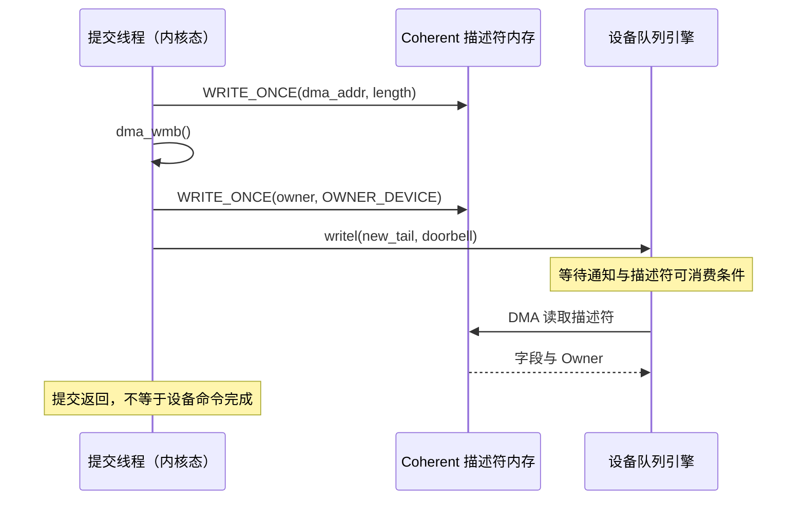
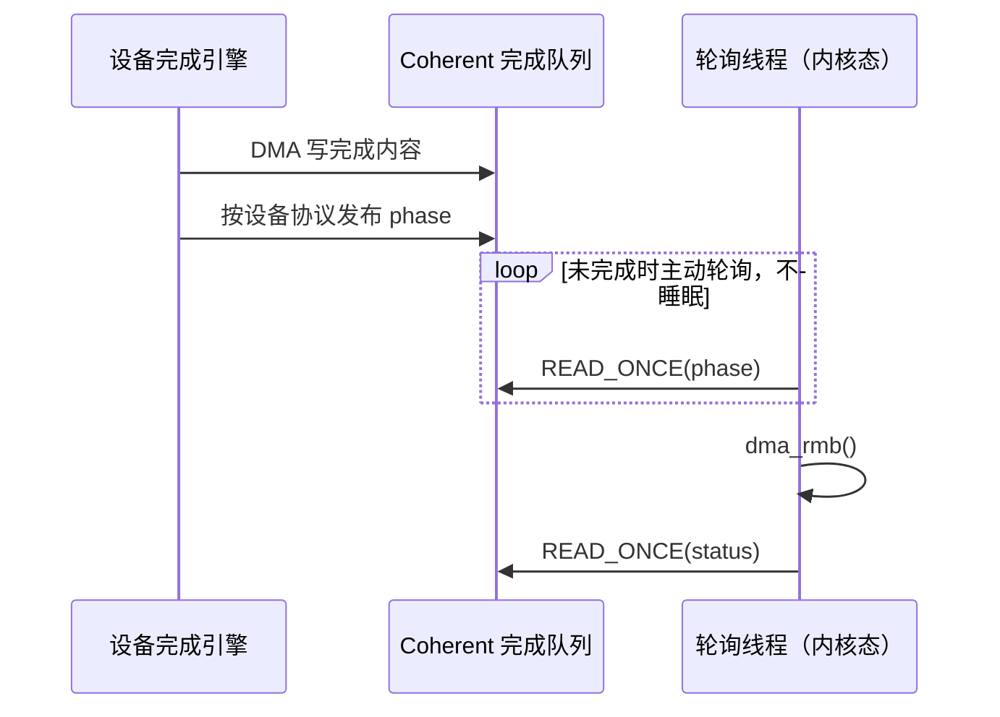

---
tags:
  - 高性能存储
  - 数据路径硬件基础
  - PCIe
  - DMA
  - GPUDirect
aliases:
  - PCIe Transaction Layer
  - PCIe TLP 与 DMA 顺序
status: active
created: 2026-09-11
updated: 2026-09-11
阅读次数: 0
---

# 0.11 PCIe Transaction Layer：TLP、Posted Write、Completion、Ordering、ACS、ATS 与设备 DMA

> **Doorbell 是通知，DMA 是设备发起的数据访问，TLP 是这些访问在 PCIe 上的事务表达；“写指令返回”“链路收妥”“读事务返回”“设备命令完成”是四件不同的事。**

本篇承接 [[0.4 PCIe BAR MMIO 与 MSI-X]] 的寄存器访问模型，把它展开为可分析的事务链。DMA 地址、映射与缓冲区生命周期沿用 [[0.3 DMA IOMMU 与 Pinned Memory]]；CPU 自身的内存顺序先看 [[0.1 CPU Cache Cache Line 与内存屏障]]。这里不再重复 BAR 枚举或 PCIe 各代带宽表，而是回答：**谁发起访问、为什么要等待、谁保证顺序，以及设备之间为什么不一定能直接通信。**

> [!info] 资料与适用范围
> 核查日期：2026-09-11。Linux 接口以官方文档为依据；TLP 教学模型参考 PCIe IP 开发者的技术说明。本文不是 PCI-SIG 规范的逐字段替代品。图中传统 TLP、DLLP、ACK/Replay 模型用于解释常见非 FLIT 路径，不把旧格式的位宽、Tag 数、CRC 或重传粒度推广到所有代际。ACS、ATS、P2P 与 GPU 同步必须结合实际平台、驱动和启用状态核对。[^tlp1][^tlp2]

---

## 1. 从软件动作翻译到 PCIe 事务

### 1.1 先区分“哪个方向的读写”

软件说“读盘”，是从应用角度描述数据方向；PCIe 说 Memory Read，则是在描述 **Requester 向某个地址请求数据**。两者不是同一层的读写。

| 软件/设备动作 | PCIe Requester | 典型事务 | 数据实际方向 |
|---|---|---|---|
| CPU 写 NVMe/NIC Doorbell | 主机侧 Root Complex 路径 | Memory Write，MWr | 主机 → 设备 BAR |
| CPU 读取设备状态寄存器 | 主机侧 Root Complex 路径 | MRd → CplD | 设备寄存器 → 主机 |
| NIC 取主机中的 TX 描述符或数据 | NIC | MRd → CplD | 主机内存 → NIC |
| NIC 把 RX 数据写入主机缓冲区 | NIC | MWr | NIC → 主机内存 |
| NVMe 执行块读，返回业务数据 | NVMe 控制器 | MWr | 控制器 → 主机内存 |
| NVMe 执行块写，读取业务数据 | NVMe 控制器 | MRd → CplD | 主机内存 → 控制器 |
| 设备发出 MSI/MSI-X 通知 | 设备 | MWr | 设备 → 平台中断地址 |

这是把设备工作流映射到事务类型的教学表，不是要求硬件对每个软件步骤都发一个独立 TLP。缓存、预取、批量 Doorbell 和设备的内联提交优化，都可能改变实际事务数。[^tlp1][^msi][^spdk]

### 1.2 “设备 DMA”不是一种叫 DMA 的特殊 TLP

在常见 PCIe DMA 路径中，设备自己充当 Requester，生成 MRd 或 MWr。主机 CPU 不负责逐字节执行拷贝，但仍参与配置队列、建立映射、发布命令、回收资源。

DMA 地址也不是把 C++ 指针强转成整数即可得到：**CPU 虚拟地址、CPU 物理地址、设备使用的 DMA/总线地址可能不同**。Linux 驱动应使用 DMA API 返回的 `dma_addr_t`；设备地址转换由平台、IOMMU 和映射方式共同决定。[^dma]

这个区分直接解释一个现象：CPU 占用率很低，不代表数据路径没有开销。流量仍可能堵在 PCIe 链路、Switch 上行、内存控制器、设备内部读请求队列或地址转换环节。

---

## 2. TLP：请求与响应的最小模型

### 2.1 三个角色与三种常见报文

**Requester** 发起请求；**Completer** 对需要响应的请求作出 Completion；Switch 根据事务路由规则转发。Memory 请求主要按地址路由，Completion 则携带返回所需的 Requester 信息。[^tlp1]

| 事务 | 请求里是否带业务数据 | 普通事务是否返回 Completion | 关键理解 |
|---|---:|---:|---|
| Memory Write | 是 | 否，属于 Posted | 不为每次写分配一个普通读式响应 |
| Memory Read | 否 | 是，成功时 CplD | 请求和返回分离 |
| Configuration Write | 是 | 是，通常 Cpl 无数据 | 不要把“所有写”都等同于 Posted |
| Configuration Read | 否 | 是，成功时 CplD | 访问的是配置空间 |
| Completion / Completion with Data | 视类型而定 | 本身是响应 | 对应此前的 Non-Posted 请求 |

`Cpl` 与 `CplD` 分别表示不带数据和带数据的 Completion。一个失败的读事务也可能返回错误状态而没有正常数据；不能只等待“某个 payload 到了”而忽略错误处理。[^tlp1]

### 2.2 阅读 TLP 时需要抓住哪些字段

不要一开始背所有 bit。先用下面几个问题解码：

| 问题 | 要看的信息 |
|---|---|
| 这是请求还是返回？读还是写？ | Fmt / Type |
| 发给哪个地址？有效字节是什么？ | Address、Length、Byte Enable |
| 谁发起的？返回给谁？ | Requester ID |
| 对应哪一个未完成请求？ | Tag，与 Requester 上下文一起理解 |
| 本次返回成功了吗？ | Completion Status |
| 这是整次读的哪一段？ | Completion Length、Byte Count、Lower Address |
| 允许哪些顺序或缓存处理方式？ | TC 与相关 Attribute，如 RO / No Snoop |

**PCIe Tag 不是 NVMe Command ID，也不是 RDMA WR ID。** 一个上层命令可以触发多笔 PCIe 请求；PCIe Requester 要维护自己的未完成事务状态。Tag 可用规模取决于代际、能力与配置，不在这里写死为 32、256 或其他固定值。[^tlp1]

---

## 3. Posted Write：省去响应，不等于“已经做完”

### 3.1 四种“完成”必须分开

![[图片/SVG/8_0_11_1.svg|900]]

**图 1：Posted / Non-Posted 对照，以及四层完成语义。** 图中的时间只表示因果，不表示真实延迟比例。

| 观察到的事件 | 能说明什么 | 不能说明什么 |
|---|---|---|
| CPU 的 `writel()` 返回 | 软件已经通过该访问接口提交写 | 设备业务命令已经执行完 |
| 某跳链路确认收妥 | 当前链路伙伴正确接收了传输 | 最终 Endpoint 已完成请求 |
| MRd 收到最后一段成功 CplD | 这笔读请求的数据返回完成 | NVMe 命令完成或数据持久化 |
| 主机按协议观察到 NVMe/NIC CQE | 对应设备协议定义的完成条件满足 | 对端应用消费、GPU Kernel 可见、磁盘持久化均自动成立 |

前两层与第三层分别属于访问提交、链路可靠性和事务响应；第四层必须回到设备协议解释。[^mmio][^tlp1][^spdk]

> [!warning] “Posted”不是 fire-and-forget 的资源管理许可
> 即使没有普通 Completion，映射也不能随意撤销、buffer 不能随意复用、设备也不能立刻断电。必须等所属设备协议的安全回收条件，而不是等 CPU 的写指令返回。[^dma]

### 3.2 没有 Completion，为什么仍会阻塞？

Posted 流量也受有限缓冲和流控约束。传统 PCIe 信用模型把 Posted、Non-Posted、Completion 的头部与数据资源分开管理，常见记法为 PH/PD、NPH/NPD、CplH/CplD。接收端缓冲不足时，上游不能无限发包；背压可以逐跳传递。[^tlp2]

因此应区分：

- **协议不要求返回普通 Completion**：Posted 的定义。
- **发送路径永不等待**：错误推论。软件写入可能受 CPU/桥/链路缓冲压力影响。
- **已返回的写不会失败**：错误推论。链路和事务错误可能通过异步错误报告呈现。[^aer]

对性能分析而言，应问“在哪一级排队”，而不是看到 `writel()` 很快就断定 PCIe 没有瓶颈。

### 3.3 Readback 为什么能用于冲刷 Posted Write

在 Linux 设备访问约定与设备支持的访问顺序下，驱动可以读取**同一设备的安全寄存器**，确保此前相关 Posted Write 已经过相应的写缓冲路径。关键是“安全”：寄存器不能有不期望的读清除、弹出 FIFO 等副作用；设备复位中的特殊情况必须按驱动和平台文档处理。[^mmio]

它不是“CPU Cache flush”，也不是“等待 NAND 完成”。对每次 Doorbell 都追加 MMIO Read，反而可能把原本可流水化的提交变成一次次往返。**只有正确性确实要求，并且设备协议明确支持，才在该位置使用 readback。**

---

## 4. Non-Posted Read：Tag、分片与在途窗口

### 4.1 一笔读不一定只返回一个包

设设备请求读取一段主机内存。Requester 发 MRd 后，可以继续提交其他独立读；各笔读靠 Tag 区分。一笔读的数据可能被拆成多个 CplD，多个不同读请求的响应也可能交错。因此设备要做的不只是“收到包”，还包括跟踪每笔请求剩余字节和错误状态。[^tlp1][^readperf]

这里容易混淆三个尺度：

| 名称 | 约束什么 | 不是什么 |
|---|---|---|
| MPS，Max Payload Size | 一个带数据 TLP 的最大 payload 配置 | 不是每个包实际一定这么大 |
| MRRS，Max Read Request Size | 单个 Memory Read Request 可请求的最大数据量 | 不是每个 Completion 的 payload 大小 |
| RCB，Read Completion Boundary | 读 Completion 拆分时的边界约束 | 不是 MPS 的别名 |

返回分片还与对齐、边界和 Completer 实现有关。**不能用“MRRS = 512 B”推出“每个 CplD 都是 512 B”。**[^readperf]

### 4.2 用一个算式理解“链路没满，为什么吞吐上不去”

对一个持续发读的 Requester，定义：

- $N$：实际能同时在途的读请求数量，而非仅配置空间声明的能力；
- $R$：每个读请求的平均有效返回字节数；
- $T$：从发出请求到释放其在途资源的平均时间；
- $B_{path}$：路径可提供的有效数据带宽。

忽略包头、分片、竞争与实现细节，一个分析用上界是：

$$
B_{read}\lesssim \min\left(B_{path},\frac{N R}{T}\right)
$$

这是依据“在途字节 ÷ 周转时间”推导的模型，不是某张网卡的参数表。假设目标是 **16 GB/s**，周转时间 **1 μs**，平均请求 **512 B**：

$$
N\gtrsim\frac{16\times10^9\times10^{-6}}{512}=31.25
$$

也就是说，理想化条件下至少需要约 32 个这样的有效在途请求；真实系统通常还要为开销和波动留余量。若路径周转时间翻倍而在途窗口不变，同一模型中的上界就减半。这个推导解释的是敏感性，不证明改大 MRRS 就能获得对应增益。

### 4.3 实际工程推论

“读慢写快”值得优先检查请求窗口、Completion 返回路径和资源回收，而不是直接判定硬件坏了。增加上层 queue depth 也不保证增加底层在途 MRd：驱动批量策略、设备取描述符方式、内部并发和数据依赖都可能成为限制。读请求流水线与具体设备表现之间的关系，需通过设备计数器和受控实验确认。[^readperf]

---

## 5. 把 NVMe 与 NIC 的数据路径真正连起来

### 5.1 一次 NVMe 块读的事务泳道

![[图片/SVG/8_0_11_2.svg|900]]

**图 2：NVMe READ 命令读取存储数据，但把数据送回主机时主要使用 PCIe Memory Write。**

以下是主机内存保存 SQ/CQ 的常见路径模型：

| 阶段 | 谁做事 | 事务视角 |
|---|---|---|
| ① 准备 | CPU 填写 SQE；数据 buffer 已映射 | CPU 普通内存写，不等于 MMIO |
| ② 发布 | CPU 按驱动同步约定更新 Doorbell | 主机侧发 MWr 到控制器 BAR |
| ③ 取命令 | 控制器取得 SQE | 控制器发 MRd，主机侧返回 CplD |
| ④ 执行 | 控制器完成存储访问 | 控制器内部工作，不是 PCIe CplD |
| ⑤ 返回数据 | 控制器写入主机 buffer | MWr，可能是多笔 |
| ⑥ 发布完成 | 控制器更新 CQE/Phase | MWr 写主机 CQ 内存 |
| ⑦ 发现完成 | 主机轮询，或由 MSI-X 唤醒处理 | 读主机内存；中断通知本身是 MWr |

该表是根据 NVMe 队列模型和 PCIe 事务语义整理的映射，省略了 PRP/SGL 获取、缓存命中、批量提交等设备细节。[^spdk][^tlp1][^msi]

**关键结论：NVMe CQE 不是 PCIe Completion TLP。** CQE 是设备写入队列内存的协议数据；PCIe Completion 则响应一笔 Non-Posted 请求。把两者混为一谈，会在抓取计数器、设计队列回收和解释超时时选错层次。

### 5.2 NVMe WRITE 与 NIC TX 的共同点

NVMe 块写、NIC 发送主机中的报文，都需要把主机的数据提供给设备。常见方式是设备 MRd 主机 buffer，随后接收 CplD。所以它们可能共享类似的 PCIe 读流水线限制。

这不表示两个设备有同样的吞吐或完全一样的 Doorbell 机制。NIC 可能使用内联数据、预取、Doorbell record 或专用的推送路径；NVMe 控制器也有自己的队列和取数策略。**把映射当分析入口，不把它当每个型号的硬件实现图。**[^tlp1][^spdk]

### 5.3 “RDMA WRITE”也不能逐字翻译成全程 PCIe MWr

以主机内存到远端主机内存的典型发送为例，可以作如下方向分解：本地 RNIC 先从本地主机取数据，经过网络协议传送，远端 RNIC 再把数据放入远端内存。这两个主机内部的访问，可能分别表现为 MRd/CplD 和 MWr。

这是跨层方向推导：网络上的 RDMA 操作名，并不规定本地取数的 PCIe 事务类型。进一步讨论 RDMA 完成语义时，还要区分本地 CQE、远端内存更新与远端应用何时消费；不能拿其中任意一个替代全部完成条件。

---

## 6. Ordering：保证顺序的不是一个万能屏障

### 6.1 五个层次，五种问题

![[图片/SVG/8_0_11_3.svg|900]]

**图 3：描述符发布与完成消费；屏障、缓存同步、MMIO 冲刷各守一条边界。**

| 层次 | 典型问题 | 应当寻找的保证 |
|---|---|---|
| 编译器与 CPU | 描述符字段能否移到通知之后？ | 内核访问原语与架构屏障 |
| CPU ↔ DMA 内存 | 一致性、缓存同步和 ownership | DMA API，coherent/streaming 规则 |
| CPU ↔ MMIO | 普通内存写与寄存器写如何排序？ | `readl/writel` 等接口的约定 |
| PCIe Fabric | 哪些事务允许越过哪些事务？ | 事务类型、排序域、TC 与 Attribute |
| 设备协议 | 哪个字段代表可消费？什么时候可复用？ | 描述符格式、Phase/Owner、CQ 协议 |

`volatile` 不建立这条完整链；C++ 的 `std::atomic_thread_fence` 也不是可移植的 DMA/MMIO 操作接口。CPU 线程同步成立，不代表设备侧的映射、缓存和协议约束已经满足。[^barriers][^dma]

### 6.2 coherent DMA 内存仍然需要发布顺序

coherent 解决的是特定 DMA 内存的可见性/一致性契约，不保证多字段的更新顺序天然符合设备协议。考虑一个**教学用、带 Owner 字段的设备描述符**：设备只有看到 Owner 交接后才消费字段。它不是 NVMe SQE 的实际格式。[^dma][^barriers]

下面是 Linux **内核 C 伪代码**，假设队列内存来自正确的 coherent DMA 分配、数据映射已经成功、字段端序符合设备规范；省略回卷、锁、DMA 错误与生命周期处理。两个阶段分别是“准备内容”和“交出所有权”。

```c
/* q->desc 是已建立 coherent DMA 映射的教学描述符。 */
WRITE_ONCE(q->desc->dma_addr, cpu_to_le64(buffer_dma));
WRITE_ONCE(q->desc->length, cpu_to_le32(length));
dma_wmb();                    /* 内容先于 Owner 对设备可见。 */
WRITE_ONCE(q->desc->owner, OWNER_DEVICE);
writel(new_tail, q->doorbell); /* 非 relaxed MMIO；遵循该设备约定。 */
```



图里的等待发生在设备端；CPU 没有因为发出 Doorbell 就等待整个命令完成。`dma_wmb()` 用来约束 DMA 共享内存更新顺序，**不是强制冲刷所有 Posted MMIO 的指令**。[^barriers][^mmio]

反方向也需要建立消费边界。以下仍是教学设备：只有设备保证内容先于完成标志发布，CPU 的 acquire 式消费才有意义。

```c
if (READ_ONCE(cqe->phase) != expected_phase)
    return false;          /* 暂无完成；稍后再 poll，不在此处睡眠。 */
dma_rmb();                 /* 先确认完成标志，再读取其保护的内容。 */
status = READ_ONCE(cqe->status);
/* streaming buffer 如需 CPU 访问，还须按 DMA API 做 sync/unmap。 */
```



CPU 不能用一个 `dma_rmb()` 修复设备自己违反发布协议的问题；它也不能代替非一致性 streaming buffer 所需的缓存同步。[^barriers][^dma]

### 6.3 RO、IDO、No Snoop：不要混成一个“乱序开关”

**Relaxed Ordering（RO）**与**ID-Based Ordering（IDO）**允许在规定条件下放松部分事务间的顺序；它们不是对任意依赖都可忽略的许可。**No Snoop**涉及缓存一致性处理属性，不等于 RO，更不等于“禁用 CPU Cache”。最终行为还取决于平台支持和配置。[^tlp2][^attrs]

这里尤其要避免三个类比错误：

1. `writel_relaxed()` 是 Linux 访问接口选择，不能机械理解为“把 TLP 的 RO 位设为 1”。
2. CPU 多个核、多个设备、不同 TC 的事务，并不存在一个全局 FIFO。
3. “先数据、后 MSI”依赖合适的排序规则和设备实现，不是因为中断天然带着一条无限强的内存屏障。[^mmio][^msi]

需要精确设计硬件排序时，应回到对应 PCIe 规范的 ordering 表与具体 IP 文档；本笔记只保留能支持软件工程判断的边界。

---

## 7. PCIe Switch 与 ACS：最短物理路径不一定是允许路径

### 7.1 P2P 到底绕过了谁？

两个 Endpoint 位于同一个 Switch 下，只能说明“存在潜在的局部路径”。是否能让某设备直接访问另一设备的资源，还需要可用地址窗口、正确路由、平台允许和驱动支持。Linux P2PDMA 对拓扑兼容性有明确检查，不能认为所有跨 Host Bridge 路径都可用。[^p2p]

P2P 常见收益是减少主机内存 staging 或不必要的上行路径，但“经过 Root Complex”不等于“CPU 执行了 memcpy”。**路由经过 CPU 所属的 I/O 硬件，与 CPU 核心参与数据拷贝，是两件事。**

![[图片/SVG/8_0_11_4.svg|900]]

**图 4：同一物理拓扑，ACS 与平台策略可能改变 Peer 流量的实际路径。** 图中的上行路径是条件示意，不保证该平台支持转回另一个 Endpoint。

### 7.2 ACS 解决隔离问题，而不是自动提高性能

ACS 是 Access Control Services。相关能力可以实施源检查、Peer Request/Completion 重定向或转发限制。某些配置会把本来能在 Switch 内交换的流量导向上游，以配合平台的隔离和检查策略。具体哪一项支持、哪一项启用，应分别看 Capability 与 Control。[^p2p][^attrs]

分析一个 GPU↔NIC 问题时，把证据分成三层：

| 层次 | 问题 | 证据 |
|---|---|---|
| 物理结构 | 两者在哪个 Switch / Root Port 下？ | `lspci -t`、平台拓扑 |
| 策略状态 | 哪些 ACS 控制真的启用了？ | 对有关桥/端口逐个读取 ACSCap / ACSCtl |
| 实际路径 | 是否 P2P、是否回退 host staging？ | 驱动日志、库诊断、双向带宽/延迟与设备计数器 |

IOMMU group 是隔离判断的线索，不是“P2P 已启用”或“性能一定好”的证明。通过 ACS override 改变软件的分组判断，也不会凭空补出不存在的硬件隔离能力。

> [!warning] 不把关闭 ACS/IOMMU 当作默认调优步骤
> 在多租户、虚拟化和不可信设备场景中，这可能破坏隔离假设。只有平台与厂商明确支持，并经过安全评估的测试环境，才讨论策略调整；本篇实验不包含 `setpci` 改寄存器或全局关闭 IOMMU。

---

## 8. ATS：设备缓存的是地址转换，不是业务数据

### 8.1 从集中转换到设备 ATC

ATS（Address Translation Services）允许兼容设备向转换服务请求映射，并在设备的 Address Translation Cache（ATC）缓存结果。它改变的是地址翻译路径，不是让设备“无需授权即可访问内存”。操作系统更改映射时，也必须处理设备侧失效，不能只刷新 CPU TLB。[^sva]

![[图片/SVG/8_0_11_5.svg|900]]

**图 5：ATS miss、ATC hit 与失效闭环。** ATC 命中不意味着业务数据在设备 Cache 中，也不意味着系统跳过所有权限检查。

可以把三个机制放进不同抽屉：

| 机制 | 主要问题 | 单独不能承诺什么 |
|---|---|---|
| ATS | 设备能否缓存转换结果？ | 不自动获得完整 pageable DMA |
| PASID | 本次访问属于哪个地址空间上下文？ | 不负责数据一致性 |
| PRI | 缺页/页面未就绪时能否提出请求？ | 不保证整个软件栈具备可恢复缺页能力 |

SVA 把设备访问与进程地址空间联系起来，需要设备、IOMMU、内核和驱动共同支持。这不是“打开 ATS，就可以把任意 malloc 指针传给旧 RNIC”。[^sva]

### 8.2 为什么“页表改了”比“缓存 miss”更危险？

miss 是性能事件；旧映射在生命周期结束后仍被设备使用，则可能成为正确性或隔离问题。分析中必须同时追踪：**新 DMA 是否已停止、旧事务是否已排空、设备转换缓存是否失效、页面何时可释放或重用**。顺序由具体 IOMMU/设备 API 契约决定，不能在应用里靠 sleep 一个经验时长替代。[^dma][^sva]

工程上更值得测的是“映射工作集变化、注册/撤销频率、地址转换 miss 与延迟是否相关”，而非笼统地问 ATS 开了能加速百分之几。

---

## 9. GPUDirect：硬件可达只是第一道门

针对 GPU↔NIC 的直接数据路径，按下面的顺序核对，比只看一张拓扑图更可靠：

| 关口 | 要证明的事情 |
|---|---|
| 拓扑 | GPU、NIC 与桥之间的路径得到平台支持 |
| 地址 | GPU 内存以该路径支持的方式注册并映射给设备 |
| 隔离与路由 | ACS/IOMMU 配置符合该设备组合的要求 |
| 软件 | 驱动与通信库真正选择了直接路径，没有意外 fallback |
| 可见性 | 依赖的数据写入与后续 CUDA 工作之间建立了正确同步 |
| 生命周期 | GPU 内存、映射与网络工作请求的回收顺序正确 |

NVIDIA 的 GPUDirect RDMA 文档对其描述的路径列出了拓扑和 IOMMU 限制，并专门讨论同步。尤其不能因为网络侧已经完成写入，就推断一个**同时运行的 GPU Kernel**必然立即看到全部新数据。要使用相应版本、设备能力所支持的 CUDA 同步/提交与通信库协议。[^gdr]

这也解释了为什么 **ATS 不是 GPUDirect 的万能通行证**：翻译、Peer 路由、GPU 内存注册和 GPU 可见性属于不同问题。不要把面向特定传统路径的 IOMMU 1:1 要求，扩张为所有新平台必须统一关闭 IOMMU 的建议。[^gdr]

---

## 10. 只读实验：先画出机器真实的事务边界

### 10.1 实验 A：建立设备—桥—NUMA 台账

以下命令只用于查询。需要实际 Linux PCIe 机器；没有设备时，只完成路径推演，不伪造输出。某些配置读取需要 root，设备名与权限错误应直接记录。

```bash
uname -r
lspci -D -t
lspci -D -nn
BDF=0000:5e:00.0  # 示例，先替换为上一步查到的真实设备。
test -d "/sys/bus/pci/devices/$BDF" || exit 1
sudo lspci -s "$BDF" -vv
cat "/sys/bus/pci/devices/$BDF/numa_node"
readlink -f "/sys/bus/pci/devices/$BDF/iommu_group"
```

这样写的目的不是一次拿到全部性能答案，而是把后续实验锁定在同一 BDF、同一链路与同一 NUMA 位置。`numa_node=-1` 表示该信息未知，不应自行解释成 NUMA 0。IOMMU group 链接不存在，也需要结合平台与 IOMMU 状态判断。

从 `lspci -vv` 提取：`LnkCap/LnkSta`、`DevCap/DevCtl` 中的 payload/read request 配置，以及设备和相关桥上的 ACS/ATS 信息。**端点只查一次不够**，拓扑路径上的桥也要逐个看。Linux PCI sysfs 接口及工具字段分别见官方说明与 pciutils。[^pcisysfs][^pciutils]

### 10.2 实验 B：记录“看到什么”，不要越级推断

如果怀疑链路错误，查询内核日志中 PCIe/AER、IOMMU 与设备超时信息：

```bash
sudo journalctl -k -b --no-pager |
  grep -Ei 'AER|PCIe Bus Error|Completion Timeout|IOMMU|DMAR|AMD-Vi'
```

日志能提供错误线索，但不能取代 TLP 分析仪。`lspci` 读取的是配置状态，并不会展示“刚才每个 Doorbell 对应了几个 TLP”。AER 没报错也不代表不存在性能瓶颈。[^aer][^pciutils]

建议产出一张手工表：BDF、驱动、NUMA、每跳链路速率/宽度、MPS/MRRS、ACS/ATS 状态、IOMMU group、观察时刻。再画出 NIC TX、NIC RX、NVMe READ、NVMe WRITE 四条方向链。

### 10.3 实验 C：有设备后再做单变量对照

不提供会写裸盘的默认命令。使用已准备的专用测试文件或测试 namespace，并显式固定读写模式、块大小、queue depth、CPU 与内存位置。GPU/NIC 测试则使用厂商支持的测试方式，先证明数据正确性，再比较带宽。

| 变化项 | 保持不变 | 希望区分的假设 |
|---|---|---|
| 小请求 → 大请求 | 同一设备/CPU/路径 | 固定事务成本是否占主导 |
| QD 逐步增加 | 块大小与 NUMA | 在途并发是否尚未填满 |
| 相邻设备 → 不同桥路径 | 相同软件与数据大小 | 拓扑/上行资源是否影响结果 |
| host buffer → GPU buffer | 请求模式与负载 | GPU 映射/直接路径是否额外受限 |

这些是实验设计，不是保证改善的配置建议。必须记录吞吐、延迟分布、错误和重试；不能仅用“最高 GB/s”判断成功。

---

## 11. 排障：从现象回到所属层

| 现象 | 可检验的候选原因 | 下一步证据 | 不应立刻做的事 |
|---|---|---|---|
| CPU 写 Doorbell 很快，设备迟迟不动 | 描述符发布错误、队列状态或通知路径问题 | 队列索引、Owner/Phase、驱动状态 | 每次提交盲加 MMIO Read |
| Device→Host 与 Host→Device 带宽悬殊 | 读窗口、Completion 路径、设备实现差异 | QD/大小扫描、链路与设备计数器 | 只看总链路标称带宽 |
| 同 Switch 的 GPU↔NIC 仍慢 | ACS 路由、注册方式或 fallback | 桥状态、库日志、对照测试 | 默认关闭隔离机制 |
| buffer 复用后偶发损坏 | 提前回收、同步遗漏、旧 DMA 未结束 | 生命周期事件与完成协议 | 用 sleep 掩盖竞态 |
| AER Completion Timeout | 某 Non-Posted 请求未按时完成等 | 请求所属设备、错误记录、恢复过程 | 把它等同于 NVMe CQ 超时 |
| 映射频繁变化时 P99 变差 | 转换 miss、失效/注册开销或其他共享开销 | 地址工作集与延迟的受控相关性 | 直接宣布“ATS 有 bug” |

表里是定位假设，不是由症状直接确定原因。优先保存证据，再做最小范围、可回滚的验证。

---

## 12. 自测：能口述这些边界才算真正掌握

**1．为什么 NVMe READ 的数据返回常是 PCIe MWr？** 读写名称的观察者不同：应用从盘读，控制器向主机内存写。看谁是 Requester，再判断事务方向。

**2．Posted Write 没有普通 Completion，为什么还要等 CQE 才复用 buffer？** Posted 只描述 PCIe 响应类型；buffer 生命周期由设备协议和 DMA 工作是否结束决定。

**3．一次 MRd 返回四个 CplD，等于四个 NVMe 命令吗？** 不等于。分片响应属于事务层，上层命令与底层请求不是一一对应。

**4．`dma_wmb()` 能代替 `dma_sync_single_for_device()` 吗？** 不能把顺序约束与 streaming DMA 的缓存/ownership 同步混为一谈。

**5．`writel()` 后读一次安全寄存器，证明 NAND 已持久化了吗？** 没有。它解决相关 MMIO 写的到达顺序，不替代存储协议的持久化条件。

**6．NIC 和 GPU 在同一 Switch 下，就一定走 P2P 吗？** 还要核对路由控制、平台兼容、内存映射和软件实际选路。

**7．ATS 与 PRI 的职责有什么区别？** 前者涉及设备缓存地址转换，后者支持发起页面请求；两者都不单独构成完整的任意 pageable DMA 方案。

**8．一个运行中的 GPU Kernel 会自动看到刚完成的 RDMA 写吗？** 不能作此保证；需要按具体 GPUDirect/CUDA 与通信库协议建立同步。

以上答案分别回到前面的事务、DMA、P2P 与 GPU 同步来源核对，而不是背“零拷贝一定更快”这样的口号。

> [!summary] 最终心智模型
> **CPU 通过内存与 MMIO 发布工作；设备通过 MRd/MWr 访问数据；PCIe 用 Completion、流控和排序规则维持事务；ACS/ATS 决定部分路由与翻译条件；CQE、缓冲区回收及 GPU/存储可见性仍由更高层协议定义。**

---

## 参考资料与核查边界

正文是独立整理与推导，图示为原创教学示意；没有将任何厂商例子当作本机实测。以下是实际查阅的公开资料，不声称读取了未访问的教材或 PCI-SIG 完整规范。在线活文档可能更新，应与目标内核和硬件版本对照。

[^tlp1]: Xillybus，*Down to the TLP: How PCI express devices talk (Part I)*，事务、Requester、Tag 与 Completion 教学。该文明确基于早期 PCIe 规范，本文不沿用其固定 Tag 数与逐位格式结论。https://xillybus.com/tutorials/pci-express-tlp-pcie-primer-tutorial-guide-1
[^tlp2]: Xillybus，*Down to the TLP: How PCI express devices talk (Part II)*，链路确认、传统流控与顺序示例；不替代新代际规范。https://xillybus.com/tutorials/pci-express-tlp-pcie-primer-tutorial-guide-2
[^readperf]: Xillybus，*Considerations for host-to-FPGA PCIe traffic*，读请求、Completion 与并发设计。正文的窗口算式与数值例子为教学推导。https://xillybus.com/tutorials/pci-express-dma-requests-completions
[^mmio]: Linux Kernel，*Bus-Independent Device Accesses*，`readl/writel`、Posted Write、readback 与访问接口边界。https://docs.kernel.org/driver-api/device-io.html
[^dma]: Linux Kernel，*Dynamic DMA mapping Guide*，CPU/DMA 地址、coherent/streaming 映射、同步与生命周期。https://docs.kernel.org/core-api/dma-api-howto.html
[^barriers]: Linux Kernel，*Linux kernel memory barriers*，DMA 与 MMIO 屏障边界。https://docs.kernel.org/core-api/wrappers/memory-barriers.html
[^msi]: Linux Kernel，*MSI Driver Guide HOWTO*，MSI/MSI-X 的 Memory Write 机制及顺序讨论。https://docs.kernel.org/PCI/msi-howto.html
[^spdk]: SPDK，*NVMe Driver*，主机队列、异步提交与轮询模型。https://spdk.io/doc/nvme.html
[^p2p]: Linux Kernel，*PCI Peer-to-Peer DMA Support*，路由、拓扑兼容与 P2PDMA 支持边界。https://docs.kernel.org/driver-api/pci/p2pdma.html
[^sva]: Linux Kernel，*Shared Virtual Addressing (SVA) with ENQCMD*，ATS、PASID、PRI 与设备翻译失效。本文没有把 ENQCMD 的特殊事务语义套到普通 Doorbell 上。https://docs.kernel.org/arch/x86/sva.html
[^gdr]: NVIDIA，*GPUDirect RDMA*，特别是 PCIe topology、IOMMUs、Synchronization and Memory Ordering；访问时页面标识为 13.4，结论依所描述平台与路径成立。https://docs.nvidia.com/cuda/gpudirect-rdma/
[^aer]: Linux Kernel，*PCI Express Advanced Error Reporting Driver Guide HOWTO*，错误报告与恢复边界。https://docs.kernel.org/PCI/pcieaer-howto.html
[^attrs]: Linux 内核 PCI 寄存器定义与 PCI 支持代码，用于核对 ACS、ATS、RO/IDO 等能力名称；行为仍需规范与平台文档确认。https://github.com/torvalds/linux/blob/master/include/uapi/linux/pci_regs.h
[^pcisysfs]: Linux Kernel，*Accessing PCI device resources through sysfs*。https://docs.kernel.org/PCI/sysfs-pci.html
[^pciutils]: pciutils，`lspci(8)` 手册与源项目；`lspci` 是配置/设备信息工具，不是事务抓包器。https://github.com/pciutils/pciutils/blob/master/lspci.man
