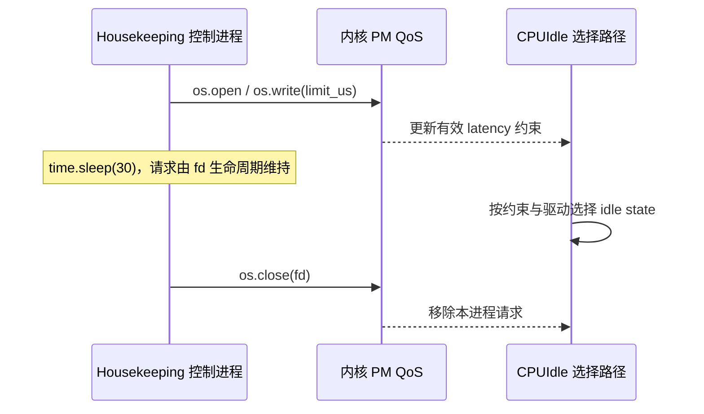
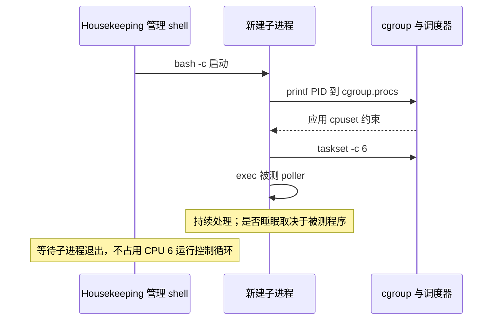

---
tags:
  - 高性能存储
  - 数据路径硬件基础
  - Linux
  - 低延迟
  - CPU隔离
aliases:
  - CPU Isolation 与低延迟系统
  - CPU 隔离与 Jitter
status: active
created: 2026-09-11
updated: 2026-09-11
阅读次数: 0
---

# 0.12 CPU Isolation 与低延迟系统：cpuset、IRQ Affinity、isolcpus、nohz_full、RCU、C-State、P-State 与 Jitter

> **低延迟调优不是让 CPU “什么也不做”，而是让关键工作在需要它的时刻获得可预测的执行条件，同时给系统维护工作留下足够资源。**

[[0.5 NUMA CPU 亲和性与内存亲和性]] 解决“线程和内存放在哪里”；[[0.6 Interrupt Busy Polling 与 Context Switch]] 解决“完成事件怎样被发现”。本篇继续问：线程固定在一个 CPU 上以后，**还有谁会抢它的执行时间，谁会拖慢它每一轮处理，以及怎样用证据区分这些原因？**

> [!info] 版本与实验范围
> 文档核查：2026-09-11。以 Linux 官方 CPU isolation、cgroup v2、NO_HZ、IRQ、CPU 电源管理与 RTLA 文档为依据。Ubuntu 的发行版名称并不能唯一确定这些能力：要检查实际内核、配置和 sysfs 文件。文中的 CPU 编号与启动参数只用于明确标注的实验机模型；没有在你的机器上执行配置或产生性能数据。[^isolation][^cgroup]

---

## 1. 先定义要减少的 Jitter

### 1.1 “平均很快”和“稳定够快”不同

设一次请求经过排队、CPU 执行、设备处理和完成发现。即使大部分请求都很快，少量 IRQ、调度等待、缺页或频率下降，也可能拖长尾部。这里把 **Jitter** 理解为相对于目标执行节奏或延迟分布的波动，而不是一个脱离测量方式的唯一数值。

测量前先写清楚三个时刻：请求什么时候进入系统、关键线程什么时候真正开始处理、响应什么时候满足上层完成条件。定时器唤醒迟到、poll loop 间隔变长和 RPC 端到端 P99，是不同指标。指标定义与分位数的基础承接 [[0.7 性能指标 IOPS 带宽 延迟 P99]]。

一个便于归因的分解是：

$$
T_{request}=T_{queue}+T_{CPU}+T_{device}+T_{discovery}+T_{other}
$$

其中 IRQ/调度噪声既可能延后开始执行，也可能中断 CPU 服务；内存带宽竞争、降频则可能拉长服务时间。**不要把各组件的 P99 相加当成端到端 P99**：同一个请求上的时长可分解，各分量的分位数却未必来自同一批请求。

### 1.2 一次短暂停顿可能留下更长的排队尾巴

用一个自定义的简化模型看这个效应。假设处理器稳定服务速率为 $\mu$，请求持续以速率 $\lambda<\mu$ 到达，一次暂停持续 $\Delta t$：

$$
Q_{extra}\approx\lambda\Delta t,
\qquad
T_{drain}\approx\frac{Q_{extra}}{\mu-\lambda}
$$

假设 $\mu=10^6$ 请求/秒、$\lambda=0.9\mu$、暂停 $10\,\mu s$，会积累约 9 个请求；恢复后仅有每秒 $10^5$ 的净清队速度，于是约需 $90\,\mu s$ 才清掉额外积压。

这是恒定服务速率、持续到达的理想模型，不是服务器实测。它说明：**高利用率下，噪声的后果不一定只等于噪声本身的持续时间。** 因此隔离实验必须同时观察业务队列和实际负载，不能只看中断计数是否下降。

---

## 2. 一张图分清“绑核”与“隔离”

![[图片/SVG/8_0_12_1.svg|900]]

**图 1：Housekeeping 与数据面分工；CPU 编号仅为单 NUMA、SMT 已关闭的八核示例。**

`taskset` / `sched_setaffinity()` 约束的是某个线程能在哪里运行；它并不自动禁止其他线程或设备 IRQ 使用同一个 CPU。隔离则需要按来源分别处理调度竞争、IRQ、tick、内核维护任务与硬件共享影响。Linux 的 CPU isolation 文档也把这几类机制分开讨论。[^affinity][^isolation]

| 机制 | 主要作用 | 不能单独解决 | 何时生效 |
|---|---|---|---|
| 线程 affinity | 限制该线程可运行的 CPU 集合 | 其他线程、IRQ、SMT 竞争 | 运行时 |
| 普通 cpuset | 层级化限制 CPU/内存节点范围 | 不自动等于独占分区 | 运行时 |
| 有效的 cpuset isolated partition | 专属 CPU 分区、取消调度负载均衡 | 不消灭所有 IRQ/内核活动 | 运行时，需内核支持 |
| `isolcpus=domain` | 从调度域隔离指定 CPU | 不是完整的噪声隔离 | 启动，不能靠运行时撤销该标志 |
| IRQ affinity / `irqaffinity=` | 指定 IRQ 目标或其默认值 | 每核定时器、全部 IPI、所有 softirq | 运行时/启动 |
| `nohz_full=` | 在条件满足时停止调度 tick | 不是禁止所有中断或系统调用 | 启动与运行条件共同决定 |
| RCU callback offload | 把回调执行转移到专门线程 | 不等于关闭 RCU | 内核配置/启动与线程放置 |
| C-State / P-State 策略 | 调整空闲唤醒与性能/功耗行为 | IRQ、CPU 竞争与完整实时保证 | 依驱动与接口而定 |

这些机制的职责分别见 affinity、cpuset、内核参数和电源文档；不要把一串参数当成不可拆解的“低延迟配方”。[^affinity][^cgroup][^params][^nohz][^idle][^freq]

### 2.1 普通 cpuset 与 isolated partition 的区别

在 cgroup v2 中，`cpuset.cpus` 是申请范围，`.effective` 是当前真正生效的范围；`cpuset.mems` 填的是**内存节点编号，不是 CPU 编号**。分区的状态通过 `cpuset.cpus.partition` 表达，可能为 `member`、`root`、`isolated`，还可能读出带原因的 invalid 状态。[^cgroup]

当前官方文档规定：**有效 isolated partition 的 CPU 不参加调度负载均衡，并从 unbound workqueues 中排除**。因此，“cpuset 只管用户线程，与 workqueue 完全无关”在这个上下文下不准确；反过来，普通 cpuset 或旧内核也不能被自动当成有同样效果的 isolated partition。[^cgroup]

这个区别直接影响验证方法：读回 `cpuset.cpus` 看见 `2-7` 不足以证明实验成功。还要核对 `.effective`、分区状态及运行时执行轨迹。

---

## 3. 先规划 CPU，再写参数

### 3.1 逻辑 CPU 不是独立物理核心

SMT 的两个逻辑 CPU 共享部分物理执行资源。把关键线程放到 CPU 6、把压测或日志线程放到它的 SMT sibling，虽然没有发生同一个逻辑 CPU 上的切换，仍可能干扰执行。CPU 编号相邻也不证明它们是同一个物理核或 NUMA 节点。[^isolation][^topology]

先查询，不猜编号。下面全部是只读命令：

```bash
uname -r
lscpu -e=CPU,CORE,SOCKET,NODE,ONLINE
numactl --hardware
cat /sys/devices/system/cpu/online
cat /sys/devices/system/cpu/cpu6/topology/thread_siblings_list
cat /sys/devices/system/cpu/cpu6/topology/physical_package_id
```

`cpu6` 只是示例，若机器不存在该 CPU，换成实际目标。记录物理核、socket、NUMA 与 sibling，才知道是否需要一起保留 sibling、调整线程布局，或在独立实验中比较关闭 SMT 的方案。不要未经评估就在共享机器全局关闭 SMT。[^topology]

### 3.2 Housekeeping 不是剩下来的边角料

Housekeeping CPU 要承接迁移过来的系统任务。若把全部 IRQ、回调、日志、内存回收与管理流量塞到一个繁忙 CPU 上，数据面可能只是从“本核被打断”变成“依赖的后台工作迟迟不完成”。Linux 官方建议至少保留 housekeeping CPU，并根据规模及 NUMA 安排更多容量。[^isolation]

可操作的规划表应包含：

| 角色 | 放置原则 | 需要验证 |
|---|---|---|
| 数据面 worker/poller | 独立物理核，匹配队列与内存节点 | 线程数与实际运行 CPU |
| 控制面/日志/指标 | 独立预算，不抢占关键核 | 高峰时是否形成排队 |
| IRQ/RCU/维护任务 | 保留足够的 housekeeping 容量 | 其 CPU 是否持续饱和 |
| 压测产生端 | 不与被测核心争抢同一瓶颈 | 自身是否限速或制造假尾延迟 |

多 NUMA 系统应先按设备与内存位置分区，再决定每个节点的 housekeeping 预算。只把线程绑核、却把主要 buffer 留在远端内存，可能掩盖隔离收益；这一步回到 [[0.5 NUMA CPU 亲和性与内存亲和性]] 的首次触碰与内存放置实验。

---

## 4. IRQ Affinity：隔离哪些中断，保留哪些路径

### 4.1 先分清 Requested 与 Effective

普通 IRQ 可以通过 `/proc/irq/<IRQ>/smp_affinity_list` 请求 CPU 集合；硬件/驱动限制会影响实际目标，应查看可用的 `effective_affinity_list`，并观察 `/proc/interrupts` 的前后增量。不能把 IRQ 的所有目标 CPU 都清空。[^irq]

下面只查询一个已经确认的 IRQ。先从设备及 `/proc/interrupts` 找到真实编号，再替换 123：

```bash
IRQ=123
cat /proc/interrupts
cat "/proc/irq/$IRQ/smp_affinity_list"
if test -r "/proc/irq/$IRQ/effective_affinity_list"; then
  cat "/proc/irq/$IRQ/effective_affinity_list"
fi
systemctl is-active irqbalance || true
```

`irqbalance` 可能重新分配 IRQ，所以一次手工设置成功不等于后面一直保持。应协调其策略或通过受管配置排除目标 CPU，而不是把“关闭服务”当作所有机器的统一答案。[^scaling]

### 4.2 Managed IRQ 不是普通可随意绑定的 IRQ

一些设备队列 IRQ 的亲和性由内核管理。对这些 IRQ，写 `/proc/irq/.../smp_affinity_list` 可能被拒绝；`isolcpus=managed_irq,...` 也只是尽力避开指定 CPU，特别受队列原有允许 CPU 集合约束。若一个队列只能落在隔离 CPU 上，它不会因为这个参数就神奇地拥有新的 housekeeping 目标。[^params]

验证不能只看启动参数：要看当前队列数、驱动的向量分配、effective affinity，以及负载下哪些 CPU 的计数真的增长。

### 4.3 只移动硬中断，为什么隔离核仍有网络 softirq？

RSS 决定硬件接收队列，RPS/RFS 还可能把后续协议处理送到其他 CPU；RPS 可以引入 IPI。因此硬件 IRQ 已移走，并不证明后续 `NET_RX` 工作也不再进入关键 CPU。XPS 影响发送队列选择，又是另一组映射。[^scaling]

使用内核网络栈时，至少一起核查 RX/TX queue、IRQ、RSS、RPS/RFS、XPS 和应用 worker。不要只画“NIC→IRQ CPU”一根箭头就宣称数据路径已经隔离。

---

## 5. Poller 与中断型应用不能套同一个方案

![[图片/SVG/8_0_12_2.svg|900]]

**图 2：同核中断处理、跨核交接与纯用户态轮询，优化的是不同成本。** 图中间隔为机制示意，不含性能预测。

### 5.1 纯用户态 poller

对于真正绕过内核热路径、持续在用户态轮询队列的 worker，让管理流量 IRQ、日志和维护任务离开该 CPU，通常是值得验证的候选方案。它的理想状态是队列与 buffer 就近、一个关键 runnable worker 持续运行、没有热路径缺页和动态分配。[^isolation]

但“CPU 使用率 100%”不能证明这一状态：那个 CPU 可能忙在中断、内核线程、空轮询，甚至是在等待共享内存带宽。必须区分 useful work 与 busy time。

### 5.2 内核 socket / 中断驱动 NVMe

如果请求必须通过内核网络栈或依赖中断完成，数据面的某些内核活动就是必要工作，不是全部都应移除的噪声。两种布局值得对照：

- IRQ/协议处理与应用靠近：可能减少跨核交接，但会占用关键 CPU 的时间。
- IRQ/协议处理与应用分开：关键线程少被直接中断，但可能增加队列交接、IPI 和缓存移动。

以上是由执行路径得到的权衡，不是“同核一定更快”或“IRQ 越远越好”的结论。网络栈官方 scaling 文档也强调队列分配、局部性和负载共同作用。[^scaling]

### 5.3 名称里有 Polling，不代表热路径全在用户态

内核 socket busy polling 仍可能在系统调用中执行网络处理；`io_uring` 的 SQPOLL 使用内核线程处理提交。这两者不能直接按 SPDK/DPDK 式的纯用户态单任务模型推导。应用线程与相应内核线程的 CPU 放置要分别观察。[^busy][^uring]

---

## 6. nohz_full、RCU 与剩余内核工作

### 6.1 nohz_full 尝试停掉的是调度 tick

`NO_HZ_IDLE` 面向空闲 CPU；`NO_HZ_FULL` 将减少 tick 的条件扩展到合适的运行状态。典型目标是 CPU 上只有一个 runnable task，主要在用户态运行，并且没有不兼容的 tick 依赖。CPU timers、某些 perf 使用方式与内核活动都可能影响这种状态。[^nohz]

**它不是“禁用此 CPU 的全部中断”。** 设备 IRQ、IPI、某些定时器与平台事件仍需独立考虑；频繁 syscall 或缺页还会进入内核并引入自己的噪声。不要把 `nohz_full=6` 读成“从此 CPU 6 不再执行内核代码”。[^isolation][^nohz]

### 6.2 RCU offload 不是把 RCU 从系统删除

RCU 的 grace period 与 callback 处理是相关但不同的环节。`rcu_nocbs=` 指定的回调卸载以及 `nohz_full` 的配套卸载，减少某些工作在关键 CPU 上执行；回调仍然需要由其他线程处理，必须给它们合理的运行位置和容量。当前 NO_HZ 文档说明，`nohz_full` CPU 的 RCU callbacks 会自动卸载，是否还需要显式 `rcu_nocbs` 应按目标内核核对，不能把重复参数当成额外优化。[^nohz][^kthreads]

### 6.3 Workqueue、per-CPU kthread 与 IPI 不归一个开关管

![[图片/SVG/8_0_12_3.svg|900]]

**图 3：把干扰按来源分层；有效 cpuset 分区、IRQ、tick 和 RCU 配置不是互相替代关系。**

需要分别看 unbound 工作与绑定到 CPU 的工作。当前 isolated partition 可以排除 unbound workqueues，但不意味着任意 per-CPU 内核线程都可搬走；某些 softirq、定时器或内核功能与当前 CPU 绑定。具体处理应按内核 per-CPU kthread 文档与实际 trace 分类，不能批量 `taskset` 所有名字里有 `kworker` 的线程。[^cgroup][^kthreads]

TLB shootdown、reschedule IPI、页表/内存管理活动以及机器固件事件也可能留下残余干扰。隔离是减少可控来源，不是保证“zero jitter”。[^isolation][^kthreads]

---

## 7. C-State、P-State：控制唤醒，不要制造热瓶颈

![[图片/SVG/8_0_12_4.svg|900]]

**图 4：空闲退出路径与运行性能路径；曲线是定性示意，不是硬件实测。**

### 7.1 C-State 回答“空闲时休息多深”

不同 idle state 有退出延迟与目标驻留时间。更深的空闲状态可能节约更多功耗，但短请求到来时可能付出更多唤醒成本；具体数值由驱动和硬件提供。[^idle]

持续忙轮询的 CPU 本身很少处于深 idle，因此不能因为“低延迟”就不加区分地禁用整机所有 C-State。混合轮询、突发负载和 package 级状态仍需分析；一次参数调整还可能影响其他核心的功耗预算。

### 7.2 P-State / CPUFreq 回答“运行时如何供给性能”

`performance` governor 并不等价于“真实频率永远固定在某个 GHz”。intel_pstate、amd_pstate、HWP/CPPC、Turbo、功率限制、温度与共享 policy 都会影响运行表现，应先查看本机的 scaling driver、policy 范围与实际性能计数。[^freq]

一个有用的实验假设是：限制 idle 深度可能减少唤醒毛刺；但持续升高功耗也可能带来温度/功率约束，随后延长 CPU 服务时间。前半段测试更快，不代表热稳定后也更快。

### 7.3 PM QoS：名字中的 DMA 不是 PCIe DMA 延迟

`/dev/cpu_dma_latency` 用于建立 CPU idle latency QoS 请求。请求随打开的文件描述符保持，关闭后撤销；它不是直接设置“DMA 传输必须在多少微秒内完成”。下面是独立实验中暂时持有请求的 Python 示例，可能需要 root 权限。[^idle]

```python
import os
import struct
import time

# 示例策略值，单位 μs；不是端到端延迟保证。
limit_us = 10
fd = os.open("/dev/cpu_dma_latency", os.O_RDWR)
try:
    payload = struct.pack("=i", limit_us)
    if os.write(fd, payload) != len(payload):
        raise OSError("PM QoS request was not fully written")
    time.sleep(30)  # 在 housekeeping CPU 上持有请求，勿占用被测核。
finally:
    os.close(fd)   # 即使发生异常也撤销本进程的请求。
```



这个例子展示的是“请求租约”，而不是精确的硬件唤醒上界。多个客户端的 QoS 请求会共同影响有效约束；应同时记录 idle residency、温度和业务分位数。[^idle]

### 7.4 读取真实 policy 与 idle state，不凭 governor 名称猜状态

下面是只读快照；在不提供 CPUFreq/CPUIdle 接口的平台上，循环会跳过缺失目录。`scaling_cur_freq` 的含义依驱动而定，不应自动当作瞬时实测频率；idle `latency`/`residency` 是驱动暴露的属性，不是本次业务请求的实测时间。[^freq][^idle]

```bash
for p in /sys/devices/system/cpu/cpufreq/policy*; do
  test -d "$p" || continue
  echo "[$p]"
  for f in affected_cpus scaling_driver scaling_governor scaling_cur_freq; do
    test -r "$p/$f" && printf '%s: %s\n' "$f" "$(cat "$p/$f")"
  done
done
CPU=6  # 替换为真实被测 CPU。
for state in /sys/devices/system/cpu/cpu$CPU/cpuidle/state*; do
  test -d "$state" || continue
  echo "[$state]"
  for f in name latency residency usage time disable; do
    test -r "$state/$f" && printf '%s: %s\n' "$f" "$(cat "$state/$f")"
  done
done
```

保存两次 `usage/time` 快照来观察测试窗口内的变化，并注明字段单位及驱动版本。若几个 CPU 共享同一个 policy，调整策略的影响范围就可能超出被测线程；这是为什么先读 `affected_cpus`，再决定是否开展独立的电源实验。

---

## 8. 一套可审查的实验配置，而不是生产复制粘贴

### 8.1 先固定实验前提

下面采用一个**假设的专用实验机**：CPU 0–7 在线，SMT 已关闭，单 NUMA 节点 0。CPU 0–1 用于 housekeeping，2–7 为数据面分区，先只在 CPU 6 放一个被测 worker。

需要同时满足：cgroup v2 已挂载、cpuset controller 可用、内核支持 isolated partition，且实验管理员拥有这部分层级的配置权。**systemd、容器编排器或其他管理器已经管理的生产层级，不应由下面的裸 sysfs 示例直接接管。** 分区创建涉及祖先与兄弟节点的资源约束，应由现有管理系统协调。[^cgroup]

### 8.2 第一步：查询内核和层级能力

以下检查只读取状态。配置文件缺失并不一定表示能力不存在，需结合发行版实际提供的内核配置来源。

```bash
stat -fc %T /sys/fs/cgroup
cat /sys/fs/cgroup/cgroup.controllers
cat /sys/fs/cgroup/cgroup.subtree_control
cat /proc/cmdline
if test -r "/boot/config-$(uname -r)"; then
  grep -E 'CONFIG_(CPUSETS|NO_HZ_FULL|RCU_NOCB_CPU|PREEMPT)' \
    "/boot/config-$(uname -r)"
fi
```

目的在于区分“配置方法不对”与“当前内核没有这项能力”。不能用最新在线文档的文件名推断一台旧 Ubuntu 内核肯定支持它。[^cgroup][^nohz]

### 8.3 第二步：只在独立测试层级建立 local isolated partition

以下是**专用测试机的 root shell 示例**，不要在未知层级执行。先保存 `cgroup.subtree_control` 的原值；新组名故意不使用 `mkdir -p`，避免无意修改一个已存在的组。示例把新组直接建在根下，避开 remote partition 的额外祖先配置，但兄弟分区冲突仍会导致失败。[^cgroup]

```bash
set -euo pipefail
ROOT=/sys/fs/cgroup
CG="$ROOT/isolated-demo"
OLD_CTL=$(cat "$ROOT/cgroup.subtree_control")
grep -qw cpuset "$ROOT/cgroup.controllers"
test ! -e "$CG"
printf '+cpuset\n' > "$ROOT/cgroup.subtree_control"
mkdir "$CG"
test -e "$CG/cpuset.cpus.partition"
printf '0\n' > "$CG/cpuset.mems"
printf '2-7\n' > "$CG/cpuset.cpus"
printf 'isolated\n' > "$CG/cpuset.cpus.partition"
```

这个组是根下的 local partition；按当前接口，未显式指定 `cpuset.cpus.exclusive` 时可按 `cpuset.cpus` 获得隐含的申请值。不要把这个简化写法无条件移到更深的 cgroup 层级。创建失败时保留错误信息，按照第 12 节撤销本次实验，不要继续移动任务。[^cgroup]

紧接着读回状态；不能把写操作成功当成性能验收。

```bash
cat "$CG/cpuset.cpus"
cat "$CG/cpuset.cpus.effective"
cat "$CG/cpuset.mems.effective"
cat "$CG/cpuset.cpus.partition"
if test -r "$CG/cpuset.cpus.exclusive.effective"; then
  cat "$CG/cpuset.cpus.exclusive.effective"
fi
if test -r "$ROOT/cpuset.cpus.isolated"; then
  cat "$ROOT/cpuset.cpus.isolated"
fi
```

在本实验模型里，应核对 CPU 集合为预期的 2–7、内存节点为 0、分区状态是有效的 `isolated`，而不是 `isolated invalid (...)`。根 cgroup 的 `cpuset.cpus.isolated` 与 `/sys/devices/system/cpu/isolated` 不是同一个接口；后者不能替代对运行时 cpuset 分区的核查。[^cgroup][^params]

### 8.4 第三步：显式放置 worker，不把控制 shell 一起搬进去

设置分区只提供可用 CPU 范围。为了测试单个关键 worker，还应显式绑定 CPU 6；如果实际应用会生成日志、管理和辅助线程，要为这些线程另行设计 affinity，不能假设“进了隔离组，所有线程都变成单线程 poller”。[^affinity][^cgroup]

下面的 `APP` 必须换成**已有、正确配置、能够正常结束**的测试程序；它不是本包提供的可执行文件。命令只移动新启动的子 shell，再用 `exec` 替换为被测程序，管理 shell 留在外部。

```bash
APP=/absolute/path/to/your_poller
CG=/sys/fs/cgroup/isolated-demo
test -x "$APP"
sudo bash -c '
  printf "%s\n" "$$" > "$1/cgroup.procs"
  exec taskset -c 6 "$2"
' _ "$CG" "$APP"
```



验收时记录被测 PID/TID 的 `Cpus_allowed_list`、实际线程 CPU 与 context-switch 计数，不只检查父进程。

### 8.5 第四步：启动参数是独立实验，不与所有变量一起改

对上述假设拓扑，一组用于理解职责的候选参数是：

```text
nohz_full=2-7 irqaffinity=0-1 isolcpus=managed_irq,2-7
```

`nohz_full` 针对 tick；`irqaffinity` 设置 IRQ 默认目标；`managed_irq` 尽力调整受管 IRQ。调度域隔离由前面的 cpuset isolated partition 负责，所以这里**没有**混入不可运行时撤销的 `isolcpus=domain`。这与当前官方建议优先采用运行时 cpuset 分区的方向一致。[^isolation][^params]

不要直接覆盖整条系统启动命令行。保留原参数和可启动的回退项，在实验窗口重启后，核对 `/proc/cmdline`、`/sys/devices/system/cpu/nohz_full` 与实际 IRQ 落点。`rcu_nocbs=2-7` 是否需要显式增加，按对应内核规则判断；重复写一遍不等于多隔离一层。[^nohz]

---

## 9. 测量：区分业务延迟、唤醒延迟和 OS Noise

### 9.1 三种测量回答三个问题

| 测量 | 回答什么 | 不应替代什么 |
|---|---|---|
| 业务端到端直方图 | 客户端实际经历了多少延迟 | 不能单独确定是哪种内核噪声 |
| timerlat | 预期定时器时刻到 IRQ/线程执行的迟到 | 不是 NVMe 或 RDMA 请求延迟 |
| osnoise / trace | 运行中受到哪些 OS 干扰 | 不是完整硬件总线性能分析 |

RTLA 的 timerlat 与 osnoise 有各自的 tracer/workload；采集本身会改变机器负载。尤其不要在保持“CPU 6 上单个 runnable poller”的实验中，再同时放一个 timerlat 测试线程，然后把结果当成原来的无干扰运行。[^timerlat][^osnoise]

### 9.2 独立运行 timerlat / osnoise

先检查本机帮助与内核功能。下面是一组**独立的、需要权限的诊断运行**，不是建议并行执行，也不是默认生产监控配置。RTLA 可能使用实时调度的测试线程，应在测试窗口运行。[^timerlat]

```bash
rtla timerlat top --help
sudo rtla timerlat top -c 6 -d 30s
rtla osnoise top --help
sudo rtla osnoise top -c 6 -d 30s
```

timerlat 的 IRQ latency 和 thread latency 是从预期定时器时刻观察的不同位置。二者之差可作为进一步定位调度/执行阶段的线索，但工具版本、线程模式和采样方法必须一起记录，不能用一列最大值直接代替整个系统的 worst-case bound。[^timerlat][^osnoisetop]

### 9.3 业务运行期间先用低干扰观察，再短窗追踪

只读的 `/proc/interrupts`、`/proc/softirqs` 快照可以提供前后增量；`perf stat` 的软件事件能帮助观察迁移、切换与缺页。注意计数范围：按进程/TID 与按 CPU 统计是不同问题，事件支持和权限也依本机而定。[^perf]

下面对一个明确的被测 PID 做短时观察。替换 12345，避免意外观察错误的进程：

```bash
PID=12345
test -d "/proc/$PID"
grep -E 'Cpus_allowed_list|Mems_allowed_list' "/proc/$PID/status"
ps -L -p "$PID" -o pid,tid,psr,comm
perf stat -p "$PID" \
  -e context-switches,cpu-migrations,page-faults -- sleep 30
```

`PSR` 是采样时看到的 CPU，不证明它整段时间从未迁移。需要区分线程时，应按目标 TID 采集或检查每个 `/proc/<PID>/task/<TID>`。若要查具体毛刺，再用有限窗口的 sched/IRQ/timer/workqueue trace；不要一上来开全量高频跟踪，把探针开销当成业务固有噪声。[^perf][^isolation]

---

## 10. 从毛刺形状到证据，而不是从形状到结论

![[图片/SVG/8_0_12_5.svg|900]]

**图 5：业务毛刺、IRQ 与 CPU 执行轨迹对齐，再执行单变量 A/B。图中数据完全是示意。**

| 现象 | 待验证的假设 | 更有判别力的证据 |
|---|---|---|
| 相对稳定周期的毛刺 | tick、定时任务、批量刷新或其他周期活动 | 同时间轴 trace；不要只凭“接近 1 ms”下结论 |
| 毛刺与 IRQ/softirq 峰值重合 | 数据面被处理路径占用 | 实际 CPU、队列/IRQ 映射、处理持续时间 |
| 线程就绪后迟迟不运行 | 调度竞争或高优先级执行者 | wakeup→switch-in 区间与当时运行线程 |
| 空闲一段时间后的第一批请求慢 | idle exit、缓存冷、频率响应等 | idle residency、频率与预热对照 |
| 长时间负载后整体变慢 | 热/功率限制，或其他稳态变化 | 温度、实际性能、吞吐和队列同步变化 |
| 没有明显 Linux IRQ 记录的大间隙 | 固件事件、虚拟化 steal、追踪盲区等 | 平台计数器、宿主机证据、更多独立观测 |
| IRQ 已移走，P99 仍然变差 | housekeeping 饱和、跨核交接或共享资源竞争 | 两侧 CPU 利用率、队列延迟、NUMA/内存证据 |

这些是候选原因，不是确定诊断。没有 IRQ trace 不能自动证明是 SMI；虚拟机内完成 vCPU affinity，也不能证明宿主物理核已被独占。

### 10.1 完成“因果验证”的最小闭环

选择一个假设，例如“管理流量 IRQ 打断 poller”。先保存原来的 affinity 与 irqbalance 策略，再只调整这一条相关路径；用相同请求率、相同队列和足够长的运行时间对照。如果毛刺下降却引入丢包或 housekeeping 饱和，不算成功。

接着恢复原配置，观察问题是否可复现。这样的 A→B→A 比“改十个参数后跑得更快”更能说明因果。实验方法与 [[0.8 Benchmark 基本方法]] 的可复现、稳态与控制变量要求一致。

---

## 11. 从实验到生产的 Benchmark Matrix

### 11.1 按层递进，不同时打开所有开关

| 阶段 | 仅新增的改变 | 验收重点 |
|---|---|---|
| A 基线 | 无 | 吞吐、P50/P99/P99.9、错误、CPU、温度 |
| B 放置 | CPU 与内存局部性 | 迁移、远端访问、队列匹配 |
| C 分区 | 有效 cpuset isolated partition | 状态、其他线程是否离开、辅助线程布局 |
| D IRQ | 按负载模式调整相关 IRQ/steering | effective 落点、两侧 CPU、交接代价 |
| E Tick/RCU | 独立启动参数实验 | tick 依赖、回调位置、维护核容量 |
| F 电源 | 一次只改一个 idle/frequency 策略 | 热稳态、唤醒毛刺、吞吐及功耗 |

每阶段都保留回滚配置。不要把“P99 降了”当唯一通过条件：业务吞吐、错误率、CPU 成本和管理可达性都需要满足约束。

### 11.2 固定请求率，比固定“尽力打满”更有解释力

隔离后系统峰值吞吐可能变化。若 A、B 都采用无限制发送，两个实验可能处在完全不同的利用率；P99 差异就同时混入了排队压力变化。

建议同时保留两组视角：**同一到达率下比较尾延迟**，以及**在同一尾延迟/错误门槛下比较可持续吞吐**。这属于实验设计，不依赖某个工具的默认报告格式。

### 11.3 样本量、遗漏与热稳态

对 $10^6$ 个样本，最慢 0.01% 只有约 100 个。P99.99 的可重复性需要更多样本、重复运行和稳定的统计口径；样本最大值只是本次观察到的最大值，不是系统的严格上界。

请求生成器也不能在系统卡住时停止计时或停止产生本应到达的请求，再用幸存样本宣布延迟正常。应记录到达模型、超时、失败和排队时间；若采用闭环负载，要明确它与实际业务到达过程的区别。首次启动、缓存预热、SSD 状态、温度稳定与背景流量也必须一并记录。

---

## 12. 必须保留的生产边界与回滚

### 12.1 这些事情不应一键完成

**不要把 `SCHED_FIFO 99` 当作 CPU 隔离的快捷方式。** 实时线程可能饿死依赖的普通线程，引入锁竞争或阻碍运维；实时调度需要完整的优先级、阻塞和资源预算设计。PREEMPT_RT 也不是“所有机器的网络 P99 自动下降”的承诺，应独立评估其工作负载效果。[^sched][^rt]

**不要让关键线程在热路径承担任意初始化。** 提前分配、首次触碰、按需要锁定内存并完成连接/队列准备；`mlock` 相关调用可能受权限和限额限制，并不代替确认所有需要的页面已准备好。少用同步日志、按请求动态分配和频繁建立/撤销映射。隔离无法补救业务自己每次处理都主动阻塞。[^isolation][^mlock]

### 12.2 回滚顺序

先让被测 workload 按应用协议停止并完成 I/O 回收，再移回需要保留的进程、确认实验 cgroup 已空。对于本篇没有子组的独立 `isolated-demo`，可以把 partition 改回 `member` 后删除组；恢复 IRQ affinity、irqbalance 与 QoS/电源设置。**不要对未知层级递归删除 cgroup。**[^cgroup]

测试组退出后，示例清理如下。这里不自动终止任意 PID，也不假定先前所有步骤都成功；先检查组存在且已空。

```bash
CG=/sys/fs/cgroup/isolated-demo
if test -d "$CG"; then
  test -z "$(cat "$CG/cgroup.procs")" || exit 1
  if test -e "$CG/cpuset.cpus.partition"; then
    printf 'member\n' > "$CG/cpuset.cpus.partition"
  fi
  rmdir "$CG"
fi
```

若本次才在父层启用 cpuset，只能在确认没有其他子组使用它后恢复父层原状态；不能把记录下来的 controller 文本直接覆盖回去，因为接口使用 `+controller/-controller` 操作。启动参数则通过保留的原始启动项回退并重启验证，不通过运行时“清空某个文件”假装撤销。[^cgroup][^params]

生产上线应先小范围灰度，同时监控分区状态变化、CPU hotplug、IRQ 迁移、温度与错误率。内核文档明确说明 cpuset partition 可能因外部资源变化而失效，因此它不是部署后永远不变的事实。[^cgroup]

---

## 13. 自测：能够用证据回答的问题

**1．`taskset -c 6` 后没有 CPU migration，是否已经隔离？** 没有。它只说明线程放置，其他线程、IRQ、SMT 和共享资源仍需排查。

**2．`cpuset.cpus=2-7` 就等于这六个 CPU 被独占？** 不等于。要区分普通 cpuset 与有效 partition，并读回 effective 集合和分区状态。

**3．为什么把所有 IRQ 移到 CPU 0 后 P99 反而变差？** 可能是 CPU 0 饱和，也可能新增跨核交接；应查实际路径和两侧排队，而不是认定 IRQ 隔离无效。

**4．`nohz_full` 是否会禁止系统调用？** 不会。系统调用仍可发生，但会进入内核并可能产生噪声或 tick 依赖；纯用户态稳态是理想目标，不是内核强制的 API 禁令。

**5．`rcu_nocbs` 是否取消 grace period？** 不是。回调卸载和 RCU 正确性机制不可混淆。

**6．为什么深 C-State 限制应单独 A/B？** 它可能帮助唤醒延迟，也可能改变功耗和热状态；持续 poller 与突发负载的收益不同。

**7．为什么不把 timerlat 与被测 poller 同时放到同一个隔离 CPU？** 测试线程和定时器会改变原本的执行条件；工具测的是另一种路径。

**8．看不到 IRQ 却有大间隙，能否直接断定 SMI？** 不能。还可能是追踪盲区、虚拟化调度或其他硬件/平台影响，需要额外证据。

> [!summary] 生产级低延迟调优的完成标准
> **先明确 SLO 与负载，再规划 CPU/NUMA 与 housekeeping；逐层处理调度、IRQ、tick、RCU 和电源；用业务尾延迟与时间对齐的证据验证；保存配置、错误与回滚路径。目标不是参数最多，而是性能、正确性和运维成本都可解释。**

---

## 参考资料与核查边界

下面是实际查阅的 Linux 接口与工具资料。配置和图示是教学整理，不是完整的发行版自动化部署方案；示例 CPU、时间窗与数值均不代表你的机器测量结果。

[^isolation]: Linux Kernel，*CPU Isolation*，Housekeeping、隔离层次、约束与调试。https://docs.kernel.org/admin-guide/cpu-isolation.html
[^cgroup]: Linux Kernel，*Control Group v2*，特别是 Cpuset Interfaces 与 partition 状态。https://docs.kernel.org/admin-guide/cgroup-v2.html
[^params]: Linux Kernel，*The kernel’s command-line parameters*，`isolcpus`、`irqaffinity`、`nohz_full`、`rcu_nocbs`。https://docs.kernel.org/admin-guide/kernel-parameters.html
[^nohz]: Linux Kernel，*NO_HZ: Reducing Scheduling-Clock Ticks*。https://docs.kernel.org/timers/no_hz.html
[^irq]: Linux Kernel，*SMP IRQ affinity*，requested CPU mask 与 IRQ 控制边界。https://docs.kernel.org/core-api/irq/irq-affinity.html
[^kthreads]: Linux Kernel，*Reducing OS jitter due to per-cpu kthreads*，softirq、RCU、定时器与内核线程。https://docs.kernel.org/admin-guide/kernel-per-CPU-kthreads.html
[^scaling]: Linux Kernel，*Scaling in the Linux Networking Stack*，RSS、RPS、RFS、XPS 与 irqbalance。https://docs.kernel.org/networking/scaling.html
[^idle]: Linux Kernel，*CPU Idle Time Management*，idle state、exit latency、PM QoS。https://docs.kernel.org/admin-guide/pm/cpuidle.html
[^freq]: Linux Kernel，*CPU Performance Scaling*，驱动、policy 与 governor 边界。https://docs.kernel.org/admin-guide/pm/cpufreq.html
[^timerlat]: Linux Kernel，*rtla-timerlat-top*，IRQ/thread timer latency、测试模式和参数；测试线程可能使用实时调度。https://docs.kernel.org/tools/rtla/rtla-timerlat-top.html
[^osnoise]: Linux Kernel，*OSNOISE Tracer*，噪声归因与采集影响。https://docs.kernel.org/trace/osnoise-tracer.html
[^osnoisetop]: Linux Kernel，*rtla-osnoise-top*，工具运行选项。https://docs.kernel.org/tools/rtla/rtla-osnoise-top.html
[^topology]: Linux Kernel，*How CPU topology info is exported via sysfs*。https://docs.kernel.org/admin-guide/cputopology.html
[^affinity]: Linux man-pages，`sched_setaffinity(2)`，线程 affinity 与 cpuset 交集。https://man7.org/linux/man-pages/man2/sched_setaffinity.2.html
[^busy]: Linux Kernel，*Networking sysctl*，`busy_read` / `busy_poll` 等内核 busy polling 接口。https://docs.kernel.org/admin-guide/sysctl/net.html
[^uring]: Linux man-pages，`io_uring_setup(2)`，`IORING_SETUP_SQPOLL` 的内核线程语义。https://man7.org/linux/man-pages/man2/io_uring_setup.2.html
[^perf]: Linux man-pages，`perf-stat(1)`，进程/线程/CPU 计数与事件范围。https://man7.org/linux/man-pages/man1/perf-stat.1.html
[^sched]: Linux man-pages，`sched(7)`，实时调度策略、优先级及资源限制。https://man7.org/linux/man-pages/man7/sched.7.html
[^rt]: Linux Kernel，*Real-time preemption*，PREEMPT_RT 的原理与语义。https://docs.kernel.org/core-api/real-time/index.html
[^mlock]: Linux man-pages，`mlock(2)`，锁页、限制与实时应用注意事项。https://man7.org/linux/man-pages/man2/mlock.2.html
