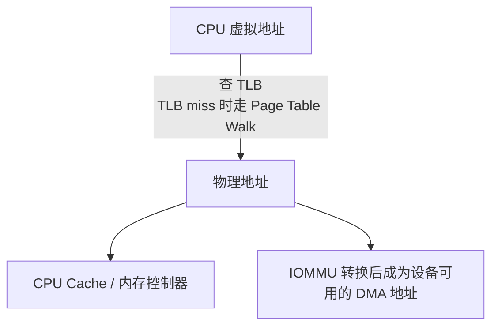
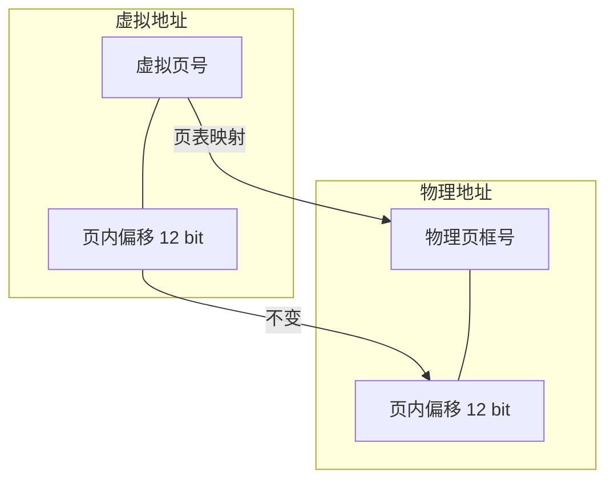
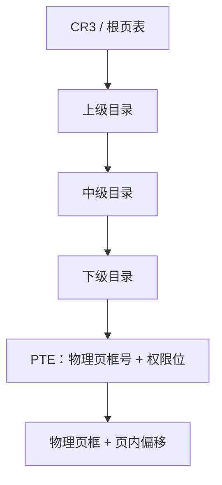
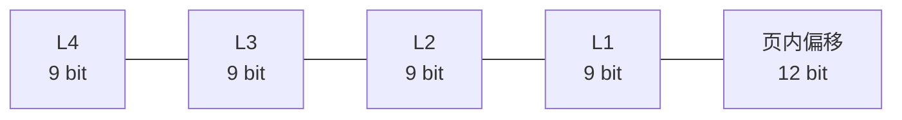
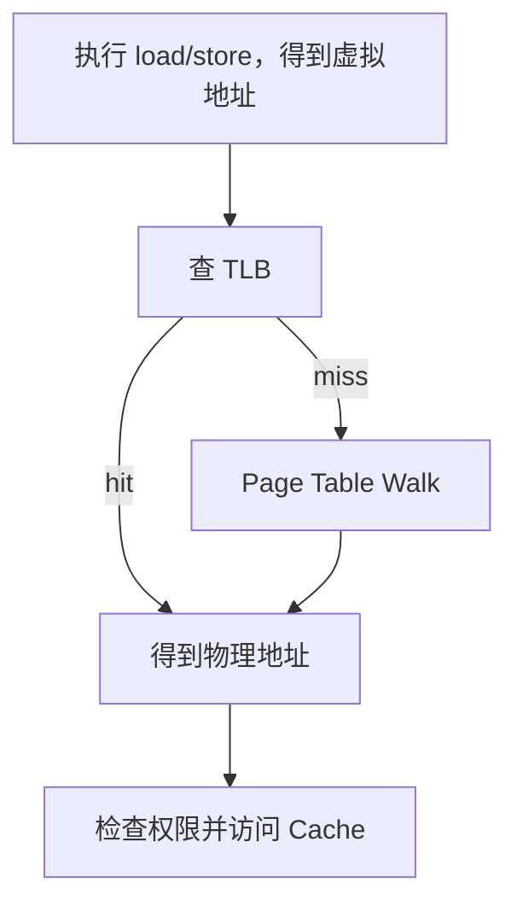
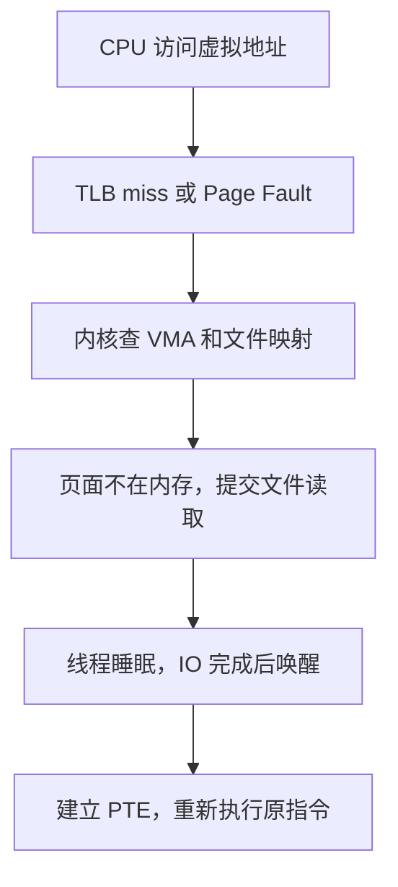
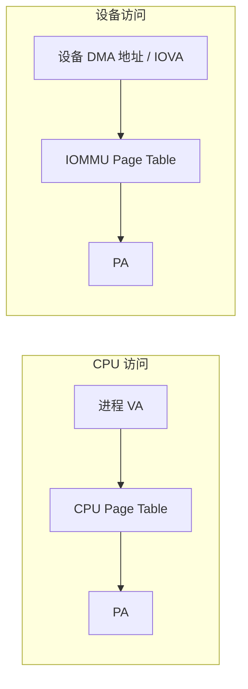
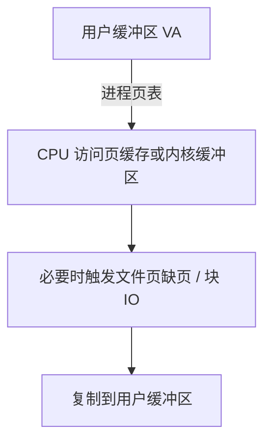

---
tags:
  - 高性能存储/数据路径硬件基础
status: active
---

# 虚拟内存、Page Table 与 TLB

> 用户态看到的是虚拟地址；CPU 访问 Cache 和内存前，还要把它翻译成物理地址。TLB 命中时这一步很快，TLB miss 或 Page Fault 时，代价会落到数据路径的延迟里。

---

## 1. 先把几种地址分开

同一个缓冲区，在不同参与者眼里可能有不同的地址：

| 地址 | 谁使用 | 含义 |
| --- | --- | --- |
| 虚拟地址（VA） | 用户进程、CPU 指令 | 进程页表中的地址，进程之间可以重复 |
| 物理地址（PA） | 内存控制器、CPU Cache 一致性域 | DRAM 的地址 |
| DMA 地址 / IOVA | PCIe 设备 | 设备通过 DMA 访问的地址；可能等于物理地址，也可能由 IOMMU 重映射 |
| 文件偏移 | 文件系统、块设备 | 文件内容在持久化介质中的逻辑位置 |

因此，不能把一个 C++ 指针直接当作设备 DMA 地址，也不能根据虚拟地址的连续性推断物理内存连续。地址转换链通常是：



[[0.1 CPU Cache Cache Line 与内存屏障]] 讨论的是地址转换完成之后，缓存行如何被访问、共享和发布；本篇先处理“这个地址到底指向哪一页”。

![[图片/SVG/8_0_2_1.svg|900]]

---

## 2. 虚拟内存解决什么问题

虚拟内存不是单纯为了“让程序拥有更大的地址空间”。它同时提供了几个边界：

- **隔离**：进程 A 的虚拟地址不能直接读写进程 B 的内存；
- **重定位**：程序可以使用稳定的虚拟地址，操作系统再决定物理页放在哪里；
- **按需分配**：只访问到的页面才真正建立映射；
- **共享与写时复制**：多个进程可以映射同一物理页，写入时再复制；
- **权限控制**：页表项可以标记可读、可写、可执行、用户态可访问等权限。

进程看到的是自己的虚拟地址空间。两个进程都使用 `0x7f...` 开头的地址，不代表它们访问同一块物理内存；它们的页表不同，转换结果也可能不同。

### 2.1 页和页框

虚拟地址空间被切成固定大小的 **page**，物理内存被切成同样大小的 **page frame**。页表负责把虚拟页号映射到物理页框号：

```text
虚拟地址 = 虚拟页号 + 页内偏移
物理地址 = 物理页框号 + 相同的页内偏移
```

以常见的 4 KiB 页面为例，页内偏移占 12 位。映射过程中变化的是页号，页内偏移保持不变。



页面大小不是固定只有 4 KiB。x86-64、AArch64 等架构还支持更大的页面，具体大小和使用条件由架构、操作系统和配置共同决定。

---

## 3. Page Table：把虚拟页映射到物理页

页表项（PTE）通常至少包含：

- 物理页框号；
- Present / Valid：映射是否存在；
- Read / Write：是否允许写入；
- Execute Disable：是否允许取指令；
- User / Supervisor：用户态还是内核态可访问；
- Accessed：是否被访问过；
- Dirty：是否发生过写入。

不同架构的字段名称和位布局不同。软件通常通过操作系统的虚拟内存接口使用这些能力，而不是直接解析硬件页表项。

### 3.1 为什么使用多级页表

如果为整个虚拟地址空间建立一张平坦页表，地址空间越大，页表本身越浪费。多数进程只使用地址空间中的少数区域，平坦结构仍然要为未使用区域预留条目。

多级页表只为实际使用到的地址范围分配下级表：



以 x86-64 的常见 4 KiB 页面和 4 级页表为例，一个虚拟地址通常可拆成：



每一级 9 位索引可以选中 512 个表项。一次完整的页表遍历可能需要访问多级页表内存，再访问目标数据，所以 CPU 不会每次都从根开始查，而是把近期翻译结果放进 TLB。

这里的位数是常见 x86-64 配置的解释模型，不是所有 CPU 的固定格式。x86-64 还存在 5 级页表；AArch64 的页表级数、地址位数和页大小也可以不同。

### 3.2 页表项不等于物理内存本身

页表只保存“虚拟页到物理页框”的关系和访问权限。它不保证：

- 相邻虚拟页对应相邻物理页；
- 进程拿到的内存一定已经驻留在 DRAM；
- 一个用户态指针能被设备直接使用；
- `malloc` 返回的内存适合做 DMA。

这些结论需要分别查看物理页驻留状态、DMA 映射、IOMMU 和设备驱动接口。

---

## 4. TLB：缓存地址翻译结果

**TLB（Translation Lookaside Buffer）** 是处理器内部用于缓存虚拟页到物理页映射的结构。它缓存的不是普通数据，而是页表遍历的结果，通常还带有权限和地址空间标识。

一次 CPU load/store 的简化流程如下：



![[图片/SVG/8_0_2_2.svg|900]]

### 4.1 TLB Hit 和 TLB Miss

- **TLB Hit**：直接拿到物理页框号，继续访问 Cache；
- **TLB Miss**：硬件页表遍历器或软件异常处理程序读取页表，找到映射后填入 TLB；
- **无效映射**：页表项不存在、权限不允许或页面尚未建立映射，触发 Page Fault。

TLB miss 的开销取决于多级页表是否在 Cache 中、页表遍历层数、硬件实现和当前内存压力。不能把某个固定纳秒数当作所有机器的结论。

数据 TLB 和指令 TLB 通常分开；不同页大小也可能使用不同的 TLB 项。一个大页覆盖的虚拟地址范围更大，所以同样的工作集需要更少的 TLB 项。

### 4.2 地址空间切换与 PCID / ASID

切换进程时，CPU 不能把进程 A 的翻译结果误用于进程 B。简单做法是切换页表根并让旧 TLB 项失效，但这样会丢掉大量可复用的翻译缓存。

部分架构提供 **ASID** 或 x86-64 的 **PCID**，给不同地址空间的 TLB 项加标签。切换地址空间后，只要标签不同，旧项就不会被错误使用，也不必全部清空。是否启用、如何使用由操作系统和 CPU 特性决定。

### 4.3 TLB Shootdown

一个进程的页表映射发生变化时，其他核心可能还缓存着旧的 TLB 项。例如内核撤销某页映射后，必须让正在运行该地址空间的其他核心丢弃旧翻译。常见做法是通过处理器间中断通知这些核心执行失效操作，这个过程称为 **TLB shootdown**。

它的成本包括：

1. 发送处理器间中断；
2. 目标核心暂停当前工作；
3. 执行 TLB invalidation；
4. 必要时等待目标核心确认。

频繁修改大量页表、频繁 `munmap`，或者多个核心同时操作共享地址空间时，shootdown 可能成为可观测的系统开销。大页减少页表项和 TLB 项数量，但并不自动消除 shootdown。

---

## 5. Page Fault：访问时才补齐映射

Page Fault 不是“程序一定崩溃”。它是 CPU 发现当前访问无法直接完成后，进入操作系统异常处理路径的统称。

### 5.1 常见类型

| 类型 | 典型情况 | 后果 |
| --- | --- | --- |
| 合法的按需分配 | 首次触碰匿名内存，页表尚未建立 | 内核分配或清零物理页，建立映射后返回 |
| 文件页调入 | `mmap` 的文件页不在内存 | 从文件或块设备读入页面，再重试指令 |
| 写时复制 | 共享页首次写入 | 分配新页，复制内容，修改当前进程映射 |
| 保护错误 | 写只读页、用户态访问内核页、执行不可执行页 | 通常向进程发送 `SIGSEGV` |
| 缺页换入 | 页面被换出到 swap | 从 swap 读回，完成映射后返回 |

合法缺页会暂停当前线程。若页面需要从存储设备读取，等待时间会远高于一次 TLB miss；如果只是分配一个已准备好的物理页，代价则不同。

所以“预先 `malloc` 了内存”不等于“每个页面都已触碰并驻留”。用户态缓冲区第一次写入时仍可能发生缺页。

### 5.2 缺页和存储 IO 的交叉

使用 `mmap` 访问文件时，第一次读取某个页面可能走到：



这条路径与显式 `read` 不同，但都可能最终读取块设备。Page Fault 由 CPU 触发，普通文件读取由系统调用触发，不能因为两者都“读了磁盘”就把它们当成同一种开销。

延迟敏感的数据路径通常会在热路径之前完成：

- 分配并触碰工作集，减少首次访问缺页；
- 预读或显式加载需要的数据；
- 避免在设备提交路径中临时分配内存；
- 对需要长期被设备访问的缓冲区使用正确的 pin / DMA 映射流程。

这些措施只能减少特定类型的缺页，不会让所有内存访问都变成物理连续，也不会替代 DMA 映射。

---

## 6. Huge Page：用更大的页覆盖更多地址

大页的核心变化是：一次页表映射覆盖更大的虚拟地址范围。

以 4 KiB 页为基准，一个 2 MiB 大页覆盖 512 个 4 KiB 页的范围。使用大页后，通常可以减少：

- 工作集需要的页表项数量；
- TLB 需要缓存的映射数量；
- 页表遍历次数；
- 某些数据路径中的地址转换压力。

代价也很明确：

- 分配和回收更困难，物理内存碎片可能导致分配失败；
- 小对象使用大页会浪费页内空间；
- 修改或拆分大页的粒度更大；
- 大页并不能消除 Cache Miss、NUMA 远端访问或设备 DMA 同步成本。

### 6.1 HugeTLB 与 THP 不是一回事

| 机制 | 管理方式 | 典型特点 |
| --- | --- | --- |
| HugeTLB | 显式预留或申请大页，使用专门的 hugepage 机制 | 行为可预测，常用于 DPDK、SPDK 等用户态数据路径 |
| THP（Transparent Huge Pages） | 内核尝试自动把普通页合并成透明大页 | 使用方便，但是否成功、何时拆分由内核和内存状态决定 |

SPDK 使用的 hugepage 还涉及用户态内存池、设备绑定和 DMA 可达性。大页只是其中一环，具体配置见 [[5.9 SPDK 环境与 HugePage]]。

### 6.2 大页不等于物理连续的万能证明

大页通常需要满足更严格的物理和对齐条件，但“申请到大页”仍不能推出：

- 任意设备都能直接访问它；
- 不需要 IOMMU 映射；
- 不需要固定页面生命周期；
- 大页一定带来性能提升。

在工作集很小、TLB 压力不高或内存分配已经是瓶颈时，大页的收益可能小于管理成本。

---

## 7. CPU 页表与 DMA/IOMMU 页表是两条路径

CPU 使用进程页表把 VA 转成 PA。设备通常不能直接理解进程的虚拟地址。设备发出的 DMA 地址可能直接进入物理地址空间，也可能先经过 IOMMU：



IOMMU 的作用包括：

- 把设备可见的 IOVA 映射到物理页；
- 限制设备只能访问被授权的内存范围；
- 支持设备地址空间隔离；
- 将离散的物理页组织成设备看到的连续 IOVA；
- 在虚拟化场景下隔离和重映射设备访问。

设备使用一个用户态虚拟地址并不代表设备会自动沿着 CPU 页表走一遍。驱动通常需要先 pin 页面，再建立 DMA 映射，并在设备完成后解除映射或归还页面。DMA 的方向、缓存一致性和 scatter-gather 细节见 [[0.3 DMA IOMMU 与 Pinned Memory]]。

### 7.1 为什么要 Pin Memory

如果设备正在 DMA，操作系统不能随意：

- 回收这几个页面；
- 把页面换出；
- 把页面迁移到另一个位置；
- 在设备还持有地址时解除映射。

因此，驱动或 RDMA 注册流程会把页面固定在内存中，并建立设备可用的地址映射。请求完成后应及时解除注册或归还 pin，长期 pin 大量内存会减少系统可回收内存，影响全机内存管理。

### 7.2 O_DIRECT 对齐的边界

`O_DIRECT` 常要求用户缓冲区地址、IO 长度或文件偏移满足文件系统和块设备的对齐约束。对齐要求不是“使用了虚拟内存就自动满足”，也不是所有文件系统都相同。

即便满足 O_DIRECT 对齐：

- 缓冲区仍然由虚拟地址表示；
- 设备仍然需要 DMA 映射；
- 物理页仍可能是离散的，由 scatter-gather 描述；
- 文件系统和设备仍可能对齐到不同粒度。

因此要把“减少页缓存拷贝”和“得到物理连续内存”分开理解。

---

## 8. 存储数据路径中的几个落点

### 8.1 普通 `read`



它的优势是接口简单、由内核管理页缓存；代价是可能发生页缓存访问、缺页和一次额外的数据复制。

### 8.2 `mmap`

文件内容映射进进程虚拟地址空间。访问某页时，CPU 先要完成 TLB 翻译；如果页未驻留，再由缺页处理路径把文件页带入内存。它减少了显式 `read` 的接口层复制，但不保证零拷贝，也不保证首次访问没有 IO 等待。

### 8.3 O_DIRECT / 注册内存

这类路径减少或绕开部分页缓存参与，但更依赖：

- 缓冲区生命周期；
- 地址、长度和偏移对齐；
- 页面是否已固定；
- DMA 映射和完成同步；
- 设备和文件系统的限制。

“零拷贝”描述的是某一段数据路径减少了 CPU 拷贝，不等于没有页表、TLB、DMA 映射或缓存一致性开销。

### 8.4 SPDK 用户态路径

SPDK 常用大页和用户态内存池，目的是让数据缓冲区具备更可控的生命周期、对齐和 DMA 映射条件，并减少内核路径上的切换。它仍然不能跳过硬件地址转换，也不能把每次 CPU 指针访问都当成设备可直接使用的地址。

这也是为什么调优 SPDK 时要同时看：

- TLB miss 和大页使用情况；
- CPU 与 SSD 的 NUMA 位置；
- IOMMU / VFIO 映射；
- 缓冲区是否在热路径首次触碰；
- Doorbell、DMA 完成和轮询的顺序。

---

## 9. 可观测性：先确认是 TLB、缺页还是 DMA

不要把所有“访问内存变慢”都归因于 TLB。可以分层观察：

```bash
# 页面大小
getconf PAGESIZE

# 系统大页和透明大页状态
cat /proc/meminfo | grep -E 'Huge|AnonHugePages'
cat /sys/kernel/mm/transparent_hugepage/enabled

# 进程的虚拟地址区域、RSS、锁定内存等
cat /proc/<pid>/smaps_rollup

# 缺页统计
perf stat -e page-faults,minor-faults,major-faults -p <pid> -- sleep 10

# TLB 事件名称随 CPU 改变，先查看本机支持的事件
perf list | grep -i tlb
```

解释这些数据时要注意：

- `minor-faults` 通常表示不需要从磁盘读取数据的缺页处理，但具体统计口径以系统实现为准；
- `major-faults` 通常涉及需要等待存储设备的页面调入；
- TLB 事件是 PMU 计数器，事件名称和含义依赖处理器；
- `/proc/<pid>/smaps_rollup` 展示的是进程内存汇总，不能直接告诉你每次 DMA 使用了哪个 IOVA。

可以设计一组对照实验：同一工作集分别使用 4 KiB 页和显式大页，固定 CPU、NUMA 节点和线程数，预先 touch 全部页面，分别记录吞吐、p99、page faults 和 TLB 相关 PMU 事件。只改一个变量，否则无法判断收益来自页大小、预热、NUMA 位置还是调度变化。

---

## 10. 常见误区

> [!warning] **“虚拟地址连续，所以物理地址也连续”**
>
> 页表可以把连续虚拟页映射到离散物理页。设备若需要连续的设备地址，应由 DMA 映射和 scatter-gather 机制处理。

> [!warning] **“TLB miss 就是 Page Fault”**
>
> TLB miss 可能通过页表遍历找到有效映射；只有映射不存在或权限不满足时，才进入 Page Fault 路径。

> [!warning] **“用了 HugePage，就没有 TLB miss”**
>
> 大页减少覆盖同一工作集所需的 TLB 项，但 TLB 仍然有限，代码仍可能发生 miss。

> [!warning] **“`malloc` 成功，设备就能 DMA”**
>
> `malloc` 只返回进程可用的虚拟地址，不负责 pin、IOMMU 映射、DMA 一致性或设备权限。

> [!warning] **“`mmap` 就是零拷贝”**
>
> `mmap` 减少了显式复制，但首次访问可能触发缺页和文件 IO，页面还要经过 CPU 的地址翻译和缓存访问。

> [!warning] **“长期 pin 内存没有副作用”**
>
> 被 pin 的页面不能被普通内存回收和迁移路径自由管理。长期、大量 pin 会挤压系统可回收内存。

> [!warning] **“所有大页机制都一样”**
>
> HugeTLB 是显式管理的预留大页，THP 是内核自动尝试使用的透明大页，申请、失败和拆分行为不同。

---

## 11. 记住这几条

1. CPU 先把虚拟地址翻译成物理地址，再访问 Cache 和内存。
2. 页表保存映射和权限，TLB 缓存近期映射，Page Fault 处理当前无法完成的访问。
3. TLB miss 不等于 Page Fault；Page Fault 也不一定意味着磁盘 IO。
4. 大页减少页表和 TLB 压力，但会增加分配、碎片和管理成本。
5. CPU 页表和 IOMMU 页表属于两条不同的地址转换路径。
6. `malloc`、`mmap`、O_DIRECT 和 HugePage 都不能单独推出“设备可以直接 DMA”。
7. 存储热路径应尽量在提交前完成页面触碰、映射和必要的 pin，避免把不可预测的缺页和映射工作放进低延迟路径。

## 学习检查

- [x] 能区分 VA、PA、DMA 地址和文件偏移
- [x] 能画出多级页表和 TLB 的基本查询路径
- [x] 能说明 TLB miss 与 Page Fault 的区别
- [x] 能区分 HugeTLB 和 THP
- [x] 能解释 Page Fault 为什么可能进入块设备 IO
- [x] 能说明 CPU 页表为什么不能直接当作设备 DMA 映射
- [x] 能设计 4 KiB 页与大页的对照实验

## 关联笔记

- [[0.1 CPU Cache Cache Line 与内存屏障]]：地址翻译完成后，缓存行、一致性与内存序如何影响并发访问
- [[0.3 DMA IOMMU 与 Pinned Memory]]：设备地址、IOMMU、固定页面和 scatter-gather
- [[0.5 NUMA CPU 亲和性与内存亲和性]]：页面所在 NUMA 节点与 CPU、设备拓扑
- [[5.9 SPDK 环境与 HugePage]]：SPDK 的大页和用户态内存环境
- [[5.6 SPDK 用户态驱动]]：用户态设备访问路径
- [[4.4 内存注册与零拷贝]]：RDMA 内存注册和 DMA 可达性

## 参考

- Linux Kernel Documentation：*Process Address Space*、*Page Tables*、*HugeTLB Pages*、*Transparent Hugepage Support*
- Linux Kernel Documentation：*Dynamic DMA mapping Guide*
- Intel® 64 and IA-32 Architectures Software Developer’s Manual：Paging、TLB 和 PCID
- Arm Architecture Reference Manual：Translation tables、TLB 和 ASID
- `man 2 mmap`、`man 2 madvise`、`man 2 mlock`
