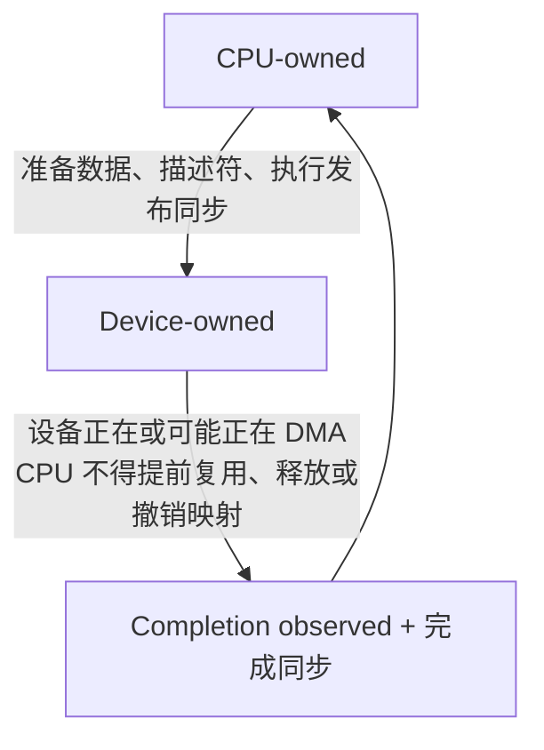
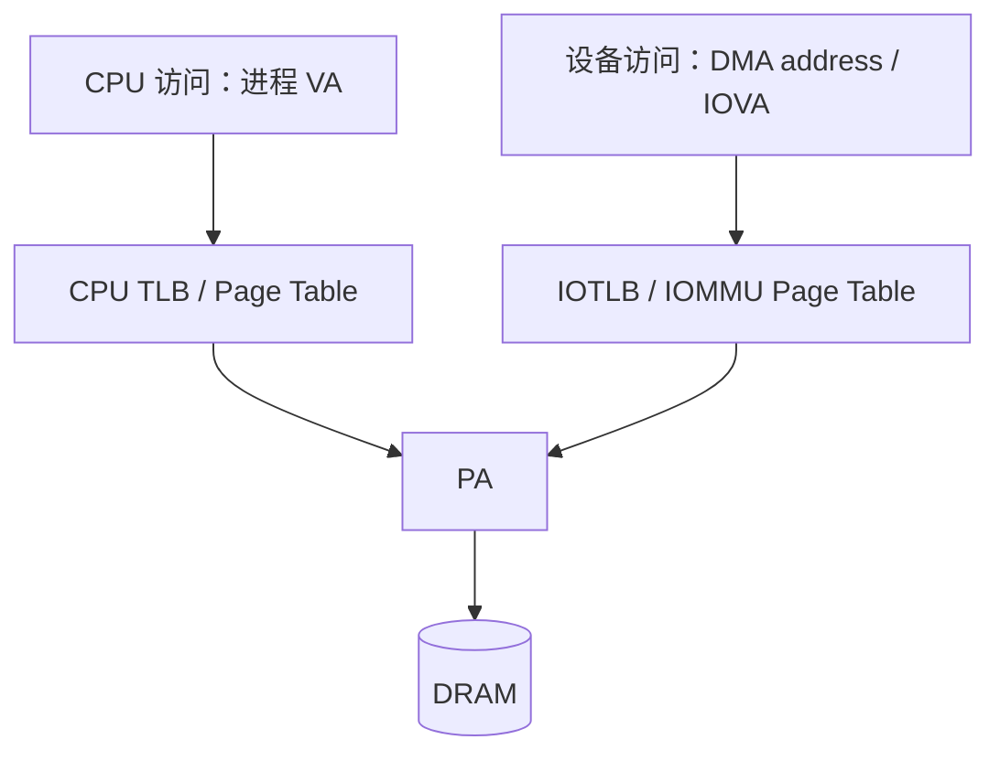
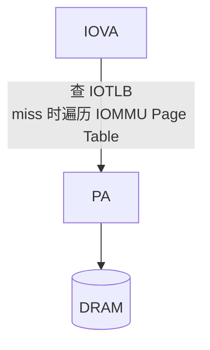
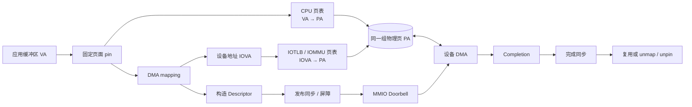
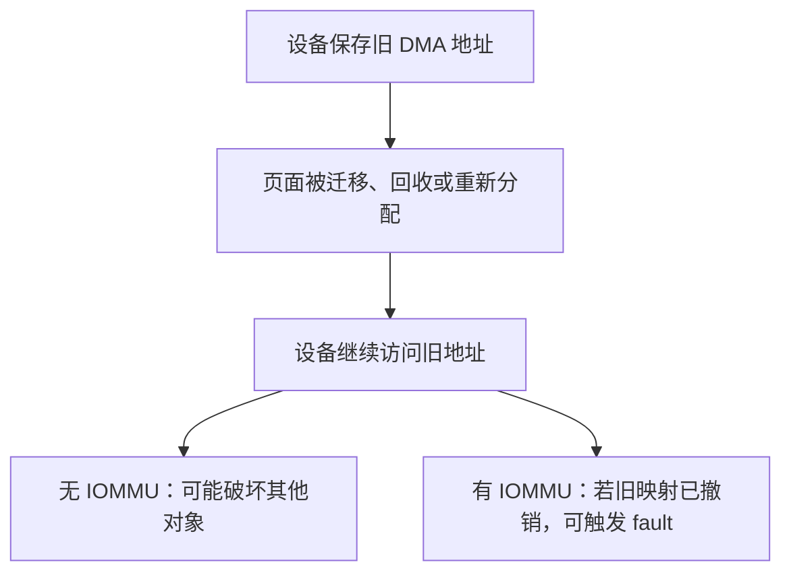
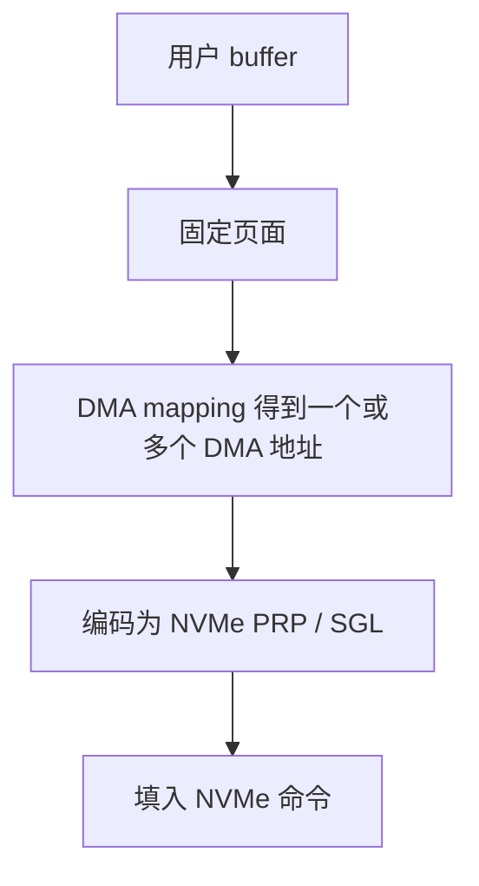

---
tags:
  - 高性能存储
  - DMA
  - IOMMU
  - 操作系统/内存管理
status: active
---

# DMA、IOMMU 与 Pinned Memory

> CPU 访问尚未驻留的页面时，可以停下来让内核处理 Page Fault；普通设备 DMA 却不会沿着进程页表触发这种缺页。设备要异步、安全地访问主机内存，软件必须提前解决四件事：**页面不能搬、设备使用什么地址、允许访问哪一段、什么时候可以重新使用缓冲区**。

前置：[[0.2 虚拟内存 Page Table 与 TLB]]（VA、PA、CPU 页表与 Page Fault）

---

## 1. DMA 解决什么问题

### 1.1 CPU copy 与 DMA

假设 NVMe SSD 要把一批数据送入主机内存。如果完全由 CPU 搬运，CPU 需要不断执行 load/store；使用 **DMA（Direct Memory Access，直接内存访问）** 后，设备中的 DMA engine 可以在总线上读写内存，CPU 不再逐字节搬运数据。

| 路径 | CPU 的工作 | 数据主体由谁搬运 | 仍然存在的代价 |
| --- | --- | --- | --- |
| CPU copy | 执行复制循环或 `memcpy` | CPU | CPU 周期、Cache 污染、内存带宽 |
| DMA | 准备请求、建立映射、发布描述符、处理完成 | 设备 DMA engine | PCIe/内存传输、地址翻译、同步与设备执行 |

DMA 省掉的是 **CPU 对数据主体的逐字节搬运**，不是让 CPU 和总线完全消失【事实】：

- CPU 或驱动仍要准备缓冲区和描述符；
- CPU 通常要用 MMIO Doorbell 通知设备；
- 设备完成后，CPU 仍要通过中断或 polling 收割完成项；
- 数据仍然物理地经过 PCIe、内存控制器或设备互连，具体拓扑见 [[3.8 PCIe 拓扑与 NUMA]]。

因此，“DMA”不等于“零 CPU”，更不等于“零物理传输”。

### 1.2 DMA Read/Write：先说清主语

本篇统一采用 **设备视角**：

| 名称 | 数据方向 | NVMe 例子 |
| --- | --- | --- |
| DMA Read | 设备从主机内存读取 | 应用写盘：NVMe 控制器读取主机写缓冲区 |
| DMA Write | 设备向主机内存写入 | 应用读盘：NVMe 控制器把读取结果写入主机缓冲区 |

这里最容易混淆的是：

> **应用执行 NVMe Read，控制器通常执行的却是对主机内存的 DMA Write。**

应用的 read/write 描述“数据对应用或存储介质的语义”，DMA Read/Write 描述“设备对内存发起什么总线操作”。阅读驱动或硬件文档时，应先确认作者采用谁的视角，不能只看 `read` 或 `write` 一个词。

---

## 2. 一次 DMA 请求中谁做什么

### 2.1 三方职责

| 参与者 | 主要职责 |
| --- | --- |
| 应用 / CPU | 准备业务数据和请求，遵守缓冲区所有权与生命周期 |
| 驱动 / 运行时 | 固定页面、建立 DMA 映射、生成 SG 与设备描述符、执行同步、回收资源 |
| 设备 | 读取描述符、发起 DMA、搬运数据、写回完成状态 |

在传统内核驱动中，中间一行主要由内核完成；在 VFIO、SPDK 等用户态驱动模型中，一部分职责移到用户态运行时和应用，但职责本身并没有消失。

### 2.2 Descriptor → Doorbell → Completion

![[图片/SVG/8_0_3_2.svg|900]]

一次简化的 DMA 生命周期如下：

1. **取得缓冲区**：分配新内存，或从预注册池借出一块空闲 buffer；
2. **固定页面**：保证设备可能访问期间，相关物理页不会被普通回收、迁移或换出；
3. **建立 DMA 映射**：为目标设备获得 DMA address / IOVA，并设置访问方向和权限；
4. **构造描述符**：填入 DMA 地址、长度、方向和控制位；
5. **发布描述符**：执行平台或 DMA API 要求的同步与屏障，使描述符先对设备可见；
6. **写 Doorbell**：通过 MMIO 通知设备有新请求；
7. **设备执行 DMA**：设备读取描述符，在总线上读写数据；
8. **设备写完成项**：写入完成状态，必要时触发 MSI-X，或等待 CPU polling；
9. **CPU 确认完成**：执行完成侧所需的顺序和 Cache 同步；
10. **归还所有权**：CPU 才能读取、修改、复用或释放 buffer；
11. **回收映射**：临时路径执行 unmap/unpin，长期注册池则保留映射供后续复用。

Doorbell 与完成通知的 PCIe 机制在 [[0.4 PCIe BAR MMIO 与 MSI-X]] 展开。这里先记住：

> Doorbell 只是在说“新描述符已经发布”，它不自动保证描述符内容先于 Doorbell 被设备观察到。

### 2.3 在途期间，buffer 归谁

可以把缓冲区看成一个所有权状态机：



“设备可能已经很快做完了”不是合法依据。只有观察到与该请求匹配的完成项，并满足 API 规定的同步条件，所有权才真正回到 CPU。

---

## 3. 两条地址翻译路径

![[图片/SVG/8_0_3_1.svg|900]]

C++ 指针是进程虚拟地址，设备描述符需要的是设备能够解释的 DMA 地址。二者经过不同的翻译系统：



### 3.1 CPU：VA → PA

CPU 用进程页表把 **VA（Virtual Address）** 翻译成 **PA（Physical Address）**。TLB miss 时可以遍历页表；映射不存在时，CPU 能触发 Page Fault，由操作系统建立映射、调页或拒绝访问。

详细的多级页表、TLB、Page Fault 和大页机制见 [[0.2 虚拟内存 Page Table 与 TLB]]。本篇只继承三条结论：

1. 用户态指针是 VA，不是设备地址；
2. VA 连续不代表 PA 连续；
3. 普通虚拟内存页面的驻留位置和生命周期可能变化。

### 3.2 设备：IOVA → PA

设备描述符中填写的通常是 **DMA address**。启用 IOMMU 翻译时，它通常表现为 **IOVA（I/O Virtual Address）**：



需要严格区分：

- **CPU 页表**服务于 CPU 的 VA→PA；
- **IOMMU 页表**服务于设备的 IOVA→PA；
- **CPU TLB**缓存 CPU 地址翻译；
- **IOTLB**缓存设备侧近期地址翻译；
- 两套页表的地址空间、权限、缓存和失效协议都不同。

IOVA 的数值在 identity mapping 或特定平台上可能恰好等于 PA，但这不代表概念相同，更不代表可以绕过 DMA API。驱动应把 DMA mapping API 返回的 DMA address 填进设备描述符，而不是擅自把用户 VA 或猜测出的 PA 填进去。

### 3.3 一张图串起地址与生命周期



图中的 pin、DMA mapping 和 descriptor 是三个不同步骤：前者稳定页面生命周期，中间步骤建立设备地址，后者把已经可用的 DMA 地址交给具体设备。

---

## 4. IOMMU、VT-d 与 SMMU

### 4.1 名称边界

- **IOMMU（Input-Output Memory Management Unit）**：设备侧地址翻译与访问控制机制的通用名称；
- **Intel VT-d**：Intel 平台与 DMA remapping、设备直通等相关的 I/O 虚拟化能力集合；
- **Arm SMMU（System Memory Management Unit）**：Arm 平台用于设备地址翻译和隔离的体系结构。

因此，VT-d 和 SMMU 是具体平台上的实现体系，不是与 IOMMU 并列的三个同级机制。

### 4.2 IOMMU 提供什么

IOMMU 的核心能力包括：

1. **地址重映射**：把设备使用的 IOVA 映射到一组可能离散的 PA；
2. **访问权限**：限制设备对映射页的读写能力；
3. **设备隔离**：为不同设备、虚拟机或租户建立不同地址空间；
4. **错误拦截**：设备访问未映射或无权限的地址时产生 IOMMU fault，而不是任由它写入其他内存。

IOMMU 通常按 **domain** 组织映射和权限。一个 domain 可以关联一个或多个设备；同一 domain 中的设备可能共享 IOVA 空间，而不同 domain 可以形成 DMA 隔离边界。

在 VFIO 场景中，用户态进程不能只因为“拿到了设备文件”就访问任意主机内存。VFIO 借助 IOMMU 把进程授权的页面映射给设备，并依赖 **IOMMU group** 判断哪些设备能够安全地作为一个隔离单元交付，详见 [[5.10 VFIO UIO 与设备绑定]]。

> [!note] IOMMU group 为什么可能包含多个设备
> PCIe bridge、设备多功能关系以及 ACS 等拓扑能力会影响事务能否被可靠隔离。如果硬件无法阻止同一路径上的设备绕过预期隔离，内核就不能假装它们是独立的安全单元。

### 4.3 三种常见工作形态

![[图片/SVG/8_0_3_4.svg|900]]

| 形态 | 地址关系 | 隔离能力 | 主要取舍 |
| --- | --- | --- | --- |
| Translated | IOVA 经 IOMMU 页表映射到 PA | 强 | 需要管理页表、IOTLB 和映射失效 |
| Identity / Passthrough | IOVA 常与 PA 使用同值关系，但仍受平台策略影响 | 依配置而定 | 可减少部分翻译压力，不等于所有隔离都存在 |
| Disabled | 设备事务直接进入平台物理地址空间 | 弱 | 配置简单，但失控设备可能访问不属于它的内存 |

不能简单总结为“关 IOMMU 一定更快”。实际成本取决于【取舍】：

- IOTLB 命中率与设备访问局部性；
- 4 KiB 页还是更大映射粒度；
- 映射是否长期复用；
- 是否在热路径频繁 map/unmap 和 invalidation；
- Root Complex、IOMMU 和设备的具体实现。

稳态 DMA 命中 IOTLB 时，并不是每个字节都执行一次完整页表遍历；但碎片化映射、随机访问和频繁失效仍可能把翻译成本暴露到吞吐与尾延迟中。

---

## 5. Pageable、Locked、Pinned、Mapped、Registered

![[图片/SVG/8_0_3_3.svg|900]]

这五个词经常一起出现，但它们解决的不是同一个问题。

| 状态 / 动作 | 它保证什么 | 是否足以让设备 DMA |
| --- | --- | --- |
| Pageable | 普通虚拟内存，可按 VM 策略回收、换出或迁移 | 否 |
| Locked | 用户请求页面保持驻留，例如 `mlock` 的语义 | 否；不自动建立设备映射 |
| Pinned | 内核为 I/O 生命周期固定物理页，阻止普通迁移、回收等破坏地址稳定性的操作 | 仍不一定；还需 DMA mapping |
| DMA-mapped | 已为特定设备建立 DMA 地址、方向和属性 | 是，但仅在映射与所有权约束内 |
| Registered | 某个子系统提前登记页面、映射、权限或设备元数据 | 取决于具体 API |

### 5.1 为什么必须 pin

设备拿到 DMA 地址后，会在未来某个异步时刻使用它。若页面在此期间被迁移、回收后重新分配，设备仍持有旧地址：



所以 pin 的正确时间边界是：

> 从设备可能开始使用该地址，到软件确认设备不再使用该地址。

这不是“分配一次就永久 pin”，也不是“提交函数返回后就能释放”。异步 I/O 必须等对应 completion。

### 5.2 四个常见误解

1. **`mlock` 不等于 DMA pin**：`mlock` 提供用户可见的驻留约束，但不会自动为某个设备建立 IOVA；
2. **pin 不等于物理连续**：一个 VA 连续的 pinned buffer 仍可能由离散物理页组成；
3. **pin 不等于 DMA map**：页面不移动只是前提，设备还需要可用地址和权限；
4. **registered 不等于通用零拷贝**：注册的具体内容由 io_uring、RDMA、CUDA、VFIO 等子系统定义。

### 5.3 长期 pin 的代价

被长期 pin 的页面不能像普通页面一样自由参与内存管理【事实】：

- 减少可回收内存；
- 阻碍页面迁移、内存规整与 NUMA balancing；
- 加重内存碎片和后续大页分配压力；
- 受到 `RLIMIT_MEMLOCK`、驱动、systemd 或容器配置限制；
- 大规模注册和反注册本身也可能带来逐页处理、映射和失效成本。

因此，高性能系统通常采用“**初始化时注册，热路径反复复用**”的内存池：

| 子系统 | 提前登记什么 | 热路径复用什么 | 特有语义 |
| --- | --- | --- | --- |
| io_uring fixed buffers | 用户页与 ring 相关元数据 | 已登记 buffer | 生命周期绑定 ring，见 [[2.4 polling 与 registered buffers]] |
| RDMA MR | 页面、NIC 翻译与权限 | lkey/rkey 和已注册区域 | PD 与远端访问权限，见 [[4.4 内存注册与零拷贝]] |
| CUDA pinned host memory | 可稳定用于设备传输的主机页 | H2D/D2H staging buffer | CUDA runtime 与设备约束，见 [[8.10 Host Device Memory 与 Pinned Memory]] |
| SPDK / VFIO | 用户态内存池与设备 DMA 映射 | IOVA 和队列内存 | IOMMU group 与用户态驱动 |

共同思想是“用冷路径注册成本换热路径复用”，但这些 API 的权限、地址格式和生命周期并不相同。本篇不虚构一个所谓“跨平台通用 DMA C++ API”。

---

## 6. Scatter-Gather：虚拟连续，物理可以离散

应用看到的连续 buffer，底层可能是三张完全不相邻的物理页：

```text
用户 VA：       [Page 0][Page 1][Page 2]   连续
物理页 PA：     [PA A]  [PA F]  [PA C]     离散
设备 IOVA：     [IOVA X ..............]    可由 IOMMU 映射为连续区间
```

设备访问离散页面通常有两种互补手段：

1. **IOMMU 重映射**：把连续 IOVA 映射到离散 PA；
2. **Scatter-Gather（SG）**：用多个“DMA 地址 + 长度”段显式描述离散区域。

二者不是互斥关系。驱动可以先把页面组织成 SG，再由 DMA mapping 层映射；映射层还可能根据物理相邻关系、IOMMU 和设备约束合并部分段。因此：

> 设备最终看到的 DMA 段数，不一定等于原始物理页数，也不一定等于映射前的 SG 条目数。

设备通常还会限制：

- 单次请求的最大段数；
- 单段最大长度；
- 地址对齐；
- 不得跨越的边界；
- 单次最大传输长度。

驱动必须使用 **DMA mapping 后的段数和地址** 构建设备描述符，不能假定“一页对应一个条目”。

### 6.1 PRP/SGL 在哪一层

NVMe 使用 PRP 或 SGL 描述命令的数据缓冲区：



PRP/SGL 消费的是已经适合设备使用的 DMA 地址。它们 **不负责 pin 用户页，也不代替 IOMMU mapping**。PRP 的页边界、列表结构与 SGL descriptor 类型见 [[3.9 PRP 与 SGL]]。

---

## 7. Cache Coherency、所有权与内存顺序

地址正确不代表数据一定可见，完成到达也不代表软件可以忽略顺序。

### 7.1 Coherent 与 non-coherent DMA

- **DMA coherent**：平台、互连和映射方式能够维护 CPU Cache 与设备访问之间所需的一致性；
- **non-coherent DMA**：软件需要在 CPU 与设备交接前后执行显式 cache clean、invalidate 或 DMA sync。

是否 coherent 取决于体系结构、设备、互连和所使用的 DMA API。不能把某个平台上的常见行为当成所有 x86、Arm、GPU 和加速器的统一规则。

常见概念边界是【实现】：

- 队列、描述符、完成项等长期共享控制结构，常使用适合一致共享的分配或映射方式；
- 大块数据 buffer 常按 streaming ownership 在 CPU 与设备之间交接；
- 具体 API 和同步原语由操作系统与驱动框架规定，不能用普通 C++ 指针操作代替。

### 7.2 两类不同的同步问题

| 问题 | 要回答什么 | 典型手段 |
| --- | --- | --- |
| Cache 可见性 | CPU 与设备是否看到同一批最新字节 | coherent mapping 或 DMA sync/cache maintenance |
| 内存顺序 | 设备会不会先看到 Doorbell，再看到尚未发布完整的描述符 | DMA/MMIO 屏障、驱动 API 规定的发布顺序 |

即使 Cache coherent，描述符发布顺序仍然必须正确；即使使用了 C++ `std::atomic` 的 acquire/release，也不能自动替代体系结构和驱动要求的 DMA/MMIO barrier。CPU 核之间的内存模型基础见 [[0.1 CPU Cache Cache Line 与内存屏障]]，设备交互还必须遵循对应 DMA API。

同样，设备写回 completion 后，CPU 需要按规定先确认完成，再读取设备写入的数据。**coherent 不等于无同步，completion 也不等于可以跳过 ownership 协议。**

---

## 8. IOMMU 的安全边界

### 8.1 IOMMU 能阻止什么

正确配置的 IOMMU 可以：

- 阻止设备访问 domain 中未映射的页面；
- 限制用户态驱动只能向设备暴露已授权内存；
- 隔离不同虚拟机、租户或设备地址空间；
- 把越界 DMA 转化为可观测的 IOMMU fault。

无 IOMMU 或缺少有效隔离时，一个错误或恶意设备使用错误地址，可能直接读写任意主机物理内存。这也是 IOMMU 不仅是“性能选项”，还是安全边界的原因。

### 8.2 IOMMU 不能保证什么

IOMMU 不是业务正确性的万能保险：

- 设备仍可以破坏已经合法映射给它的整个区域；
- 映射范围过大仍然属于过度授权；
- 同一 IOMMU group/domain 内的设备未必彼此隔离；
- stale mapping、提前复用 buffer 等生命周期错误仍可能写坏合法映射内存；
- IOMMU 不理解对象边界、协议长度和应用数据语义；
- 它也不等于 RDMA 的远端授权机制，lkey/rkey 属于另一层保护。

工程上应遵循最小权限【实践】：

1. 只映射设备当前需要的页面；
2. 访问方向与权限尽可能收窄；
3. 短期请求完成后及时撤销映射；
4. 长期池按设备、租户或保护域拆分；
5. 记录并处理 IOMMU fault，不把它当作普通性能噪声。

---

## 9. 进阶：ATS、PRI 与 PASID

现代 PCIe/IOMMU 体系还可以让设备更深地参与地址空间管理，但这些能力需要设备、Root Complex、IOMMU、固件和驱动共同支持。

| 能力 | 全称 | 解决的问题 |
| --- | --- | --- |
| ATS | Address Translation Services | 让支持的设备缓存平台提供的地址翻译，降低重复翻译压力 |
| PRI | Page Request Interface | 让支持的设备请求补齐缺失页面或映射 |
| PASID | Process Address Space ID | 让一个设备的请求区分多个进程或地址空间 |

### 9.1 ATS

ATS 允许设备缓存翻译结果，但设备侧缓存同样需要失效协议。它不是“设备直接读取 CPU TLB”，也不是绕过 IOMMU 权限检查的通行证。

### 9.2 PRI

PRI 使特定设备和操作系统能够协作处理缺失映射，是按需分页设备内存模型的基础之一。但它不代表所有 DMA 都能像 CPU 一样触发普通 Page Fault。首次访问、页面请求和恢复路径会增加不确定延迟，低延迟热路径仍需谨慎取舍。

### 9.3 PASID

PASID 在设备请求中标识地址空间，使同一设备能够区分多个进程上下文，是 SVA（Shared Virtual Addressing）等机制的重要基础。支持 PASID 不等于设备可以无条件访问整个进程地址空间，实际权限仍由平台和驱动建立。

---

## 10. 端到端案例：一次 NVMe 读

下面把全文放回真实数据路径。应用希望从 SSD 读取数据到用户 buffer：

1. 应用提交读请求，给出一个用户 VA；
2. 内核或用户态驱动确认这块 buffer 在请求期间有效；
3. 页面被临时固定，或 buffer 来自预注册内存池；
4. DMA mapping 为 NVMe 设备建立 IOVA→PA 映射；
5. 驱动根据映射后的 DMA 段构造 PRP/SGL，见 [[3.9 PRP 与 SGL]]；
6. 驱动构造 NVMe SQE，并按规定发布描述符；
7. CPU 写 Submission Queue Doorbell；
8. NVMe 控制器读取命令和 PRP/SGL；
9. 控制器从介质取出数据，对主机内存执行 **DMA Write**；
10. 控制器写入 CQE，通过 MSI-X 或 polling 告知完成，见 [[0.4 PCIe BAR MMIO 与 MSI-X]]；
11. CPU 确认完成并执行所需同步；
12. buffer 所有权回到 CPU，应用才能读取结果；
13. 临时映射执行 unmap/unpin，预注册映射则保留供后续请求复用。

这条路径同时回答了三个初学问题：

- 应用指针为什么不能直接交给设备：它是 VA，而设备需要 DMA address / IOVA；
- 为什么页面要 pin：设备异步使用地址时，物理页不能被移动或回收；
- 为什么完成项重要：它决定 buffer 何时不再属于设备。

如果数据目的地变成 GPU 显存，DMA 路径、可达性和 IOMMU/P2P 约束会进一步变化，见 [[8.2 GDS 与 cuFile]]。

---

## 11. 对照实验

通用 DMA 不能靠一个普通用户态程序完整复现。实验应选择真实子系统，并明确“能证明什么、不能证明什么”。

### 11.1 实验 A：`mlock` 只证明 locked，不证明 DMA-mapped

**目标**：观察普通匿名内存与 `mlock` 后的锁页配额变化。

**控制变量**：

- 使用同一个程序和相同分配大小；
- 固定 NUMA 节点和 CPU；
- 预先 touch 全部页面；
- 唯一变量是是否调用 `mlock`。

**观测**：

```bash
ulimit -l
grep -E 'VmLck|VmRSS' /proc/<pid>/status
grep -E 'Locked|AnonHugePages' /proc/<pid>/smaps_rollup
```

**能证明**：`mlock` 是否成功、进程锁页量和 `RLIMIT_MEMLOCK` 的影响。

**不能证明**：某个设备已经获得 IOVA、IOMMU 页表已经建立、这块内存已经注册给 RDMA/CUDA/NVMe。

### 11.2 实验 B：每次处理与预注册复用

可以选择 io_uring 普通 buffer 与 registered buffer，或 RDMA 热路径 reg/dereg 与预注册池进行对照。

| 项目 | 固定条件 / 指标 |
| --- | --- |
| 固定条件 | 同一设备、文件、I/O 大小、队列深度、线程数、CPU/NUMA 绑定、direct/buffered 模式 |
| 唯一变量 | buffer 是否预注册并复用 |
| 初始化指标 | 注册时间、注册内存量、失败码 |
| 稳态指标 | IOPS、带宽、平均延迟、p99、CPU 利用率 |
| 资源代价 | 锁页量、内存池大小、可回收内存变化 |

实验必须把“初始化阶段付出的注册成本”和“稳态热路径收益”分开报告。对应的 io_uring 机制见 [[2.4 polling 与 registered buffers]]，RDMA 机制见 [[4.4 内存注册与零拷贝]]。

### 11.3 实验 C：IOMMU translated 与 passthrough

这是需要管理员权限、重启或设备重新绑定的高级实验。至少记录：

- 内核启动参数和 IOMMU 实际工作模式；
- 设备 BDF、驱动和 VFIO 状态；
- 页面大小与映射复用策略；
- CPU、内存和设备 NUMA 节点；
- 相同 workload 下的吞吐、p99、CPU、IOMMU fault；
- map/unmap 频率与访问局部性。

> [!warning] 操作风险
> 不要为了基准测试在承载系统盘、活动文件系统或生产流量的设备上直接解绑驱动。VFIO 绑定、IOMMU group 检查和回滚步骤应在隔离设备与维护窗口中执行，具体流程见 [[5.10 VFIO UIO 与设备绑定]]。

结果不能只写“IOMMU 开启损失多少性能”。还要结合 IOTLB 命中、页粒度、访问模式和映射复用解释成本来自哪里。

---

## 12. 故障定位：按层排查

| 症状 | 可能原因 | 检查方向 |
| --- | --- | --- |
| 注册失败 `ENOMEM` / `EPERM` | `RLIMIT_MEMLOCK`、容器权限、可锁页额度不足 | `ulimit -l`、进程 limits、systemd/container 配置 |
| DMA / IOMMU fault | IOVA 未映射、权限错误、映射已撤销、设备在错误 domain | 内核日志、fault 地址、设备 BDF、映射生命周期 |
| 完成后数据仍旧或部分错误 | non-coherent 平台缺少同步，或完成顺序错误 | DMA sync、cache maintenance、completion 读取顺序 |
| 偶发静默数据损坏 | 完成前复用/free/unmap buffer | 审计所有权状态机和请求—完成匹配 |
| 大 I/O 无法提交 | SG 段数、边界、对齐或设备描述符限制 | 映射后段数、PRP/SGL 构造、设备能力 |
| 吞吐低且 p99 抖动 | 远端 NUMA、IOTLB 压力、频繁 map/unmap | 设备 NUMA、first-touch、映射复用、页粒度 |
| VFIO 无法单独交付设备 | IOMMU group 或 ACS/PCIe 拓扑限制 | group 成员、上游 bridge、ACS 能力 |
| 功能正常但访问错误内存 | 把 VA、PA、IOVA 混用 | 日志中为每个地址标明类型，不只打印十六进制数 |

推荐排查顺序：

1. buffer 生命周期和 completion 是否成立；
2. 地址类型是否混淆；
3. DMA mapping 是否存在、方向和权限是否正确；
4. SG/PRP/SGL 是否满足设备限制；
5. Cache sync、所有权和屏障是否正确；
6. IOMMU domain/group 是否正确；
7. 最后再优化 IOTLB、页粒度、NUMA 和映射复用。

先查正确性，再查性能。错误地址和提前复用导致的损坏，不能靠更大的 HugePage 或更深的队列修复。

---

## 13. 陷阱与误区

> [!warning] 1. DMA Read 就是应用调用 read
> 错。DMA Read/Write 必须先声明主语。本篇采用设备视角，所以 NVMe 应用读通常对应设备向主机内存执行 DMA Write。

> [!warning] 2. 用户指针可以直接写进设备描述符
> 错。用户指针是 VA；设备需要 DMA mapping 返回的 DMA address / IOVA。即使某台机器上数值碰巧相同，也不能依赖这种巧合。

> [!warning] 3. pinned memory 一定物理连续
> 错。pin 约束的是页面生命周期，不是物理布局。离散页面仍需 IOMMU 映射或 SG 描述。

> [!warning] 4. `mlock`、pin、DMA map、register 是同一件事
> 错。它们分别处理驻留、I/O 生命周期、设备地址和子系统元数据/权限。具体 API 可能一次组合多步，但概念不能合并。

> [!warning] 5. PRP/SGL 可以替代 pin 和 IOMMU mapping
> 错。PRP/SGL 只编码已经可供 NVMe 使用的 DMA 地址，不负责稳定用户页或建立 IOVA→PA。

> [!warning] 6. coherent DMA 不需要同步
> 错。缓存一致性只解决部分“看到哪些字节”的问题；描述符发布、Doorbell 顺序、completion 和 buffer ownership 仍必须正确。

> [!warning] 7. 设备完成前可以先复用 buffer
> 错。在途期间设备可能仍会读取或写入。提前 free、unmap 或复用会造成 fault、错误完成，甚至静默数据损坏。

> [!warning] 8. IOMMU 只是性能选项
> 错。它也是设备 DMA 的地址隔离和权限边界。关闭后，错误设备地址可能直接破坏任意主机内存。

> [!warning] 9. 开启 IOMMU 就自动安全
> 错。过大的合法映射、同 domain 内设备、stale mapping 和应用对象边界错误仍不受保护。映射范围和生命周期仍要遵循最小权限。

> [!warning] 10. 支持 PRI 就意味着所有 DMA 都能缺页
> 错。PRI 是设备、IOMMU 与操作系统协作的专门协议，需要全链路支持，也会引入缺页处理延迟。

> [!warning] 11. 长期 pin 只消耗等量内存
> 不完整。它还会影响回收、迁移、NUMA balancing、内存规整和大页分配；大规模注册必须做全机容量规划。

---

## 14. 关键结论

| 结论 | 性质 |
| --- | --- |
| DMA 省去的是 CPU 逐字节搬运，不是 CPU 提交、总线传输和完成同步 | 事实 |
| DMA Read/Write 应明确主语；NVMe 读通常对应控制器向主机执行 DMA Write | 事实 |
| CPU 使用 VA→PA，设备使用 IOVA→PA；两套页表、TLB 和权限边界不能混用 | 事实 |
| pin 固定页面生命周期，DMA map 建立设备地址；二者解决不同问题 | 事实 |
| SG 处理离散页面，IOMMU 可组织连续 IOVA；PRP/SGL 是设备命令的数据描述格式 | 事实 |
| coherent 只解决可见性的一部分，不替代所有权、完成协议和内存顺序 | 事实 |
| IOMMU 用翻译和 domain 换取隔离；成本取决于 IOTLB、页粒度和映射复用 | 事实 / 取舍 |
| 长期注册用可回收性和容量换稳态性能，应池化、限额并按最小权限映射 | 取舍 / 实践 |

---

## 15. 学习检查

- [x] 能从设备视角区分 DMA Read 与 DMA Write
- [x] 能区分 VA、PA、IOVA 和设备内部地址
- [x] 能画出 VA→PA 与 IOVA→PA 两条翻译路径
- [x] 能解释 descriptor、Doorbell、DMA、completion 的完整生命周期
- [x] 能区分 pageable、locked、pinned、DMA-mapped 和 registered
- [x] 能说明虚拟连续、物理离散与 Scatter-Gather 的关系
- [x] 能说明 PRP/SGL 为什么不能替代 pin 和 DMA mapping
- [x] 能解释 coherent 与 non-coherent DMA 的同步差异
- [x] 能说明 IOMMU domain、VFIO group 和最小权限边界
- [x] 能概述 ATS、PRI、PASID 分别解决什么问题
- [x] 能设计注册复用与 IOMMU 模式的受控实验
- [x] 能按生命周期、地址、映射、一致性、隔离、性能的顺序排查故障

---

## 关联知识

- [[0.1 CPU Cache Cache Line 与内存屏障]] - CPU 内存顺序基础，以及它与 DMA/MMIO 屏障的边界
- [[0.2 虚拟内存 Page Table 与 TLB]] - CPU 的 VA→PA、TLB 与 Page Fault
- [[0.4 PCIe BAR MMIO 与 MSI-X]] - Doorbell 发布和完成中断如何穿过 PCIe
- [[2.4 polling 与 registered buffers]] - 用预注册缓冲区摊销每笔页处理成本
- [[3.8 PCIe 拓扑与 NUMA]] - DMA 实际经过的 PCIe、内存和跨 NUMA 路径
- [[3.9 PRP 与 SGL]] - NVMe 命令如何编码已经完成 DMA 映射的数据段
- [[4.4 内存注册与零拷贝]] - RDMA MR、lkey/rkey、权限和长期注册
- [[5.10 VFIO UIO 与设备绑定]] - 用户态驱动、IOMMU group 与设备接管
- [[8.2 GDS 与 cuFile]] - DMA 目的地扩展到 GPU 显存后的直达路径
- [[8.10 Host Device Memory 与 Pinned Memory]] - CUDA pageable/pinned host memory 与 H2D/D2H

## 参考

- Linux Kernel Documentation: *Dynamic DMA mapping Guide*
- Linux Kernel Documentation: *DMA-API HOWTO*
- Linux Kernel Documentation: *pin_user_pages() and related calls*
- Linux Kernel Documentation: *VFIO - Virtual Function I/O*
- Linux Kernel Documentation: IOMMU userspace API
- Intel: *Virtualization Technology for Directed I/O Architecture Specification*
- Arm: *System Memory Management Unit Architecture Specification*
- PCI Express Base Specification：ATS、PRI、PASID
- NVM Express Base Specification：PRP、SGL 与数据指针
