---
tags:
  - 高性能存储/数据路径硬件基础
status: active
---

# PCIe、BAR、MMIO 与 MSI-X

> [[0.3 DMA IOMMU 与 Pinned Memory]] 解决了“设备如何安全访问主机内存”。本篇沿着同一笔 NVMe 请求继续追踪：CPU 如何经 BAR/MMIO 发布 Doorbell，设备完成 DMA 后，又如何用 MSI-X 把通知投递到某个 CPU。

前置：[[0.3 DMA IOMMU 与 Pinned Memory]]（DMA 地址、队列内存、发布顺序与 buffer ownership）

---

## 1. 先看全景：控制、数据与通知走不同路径

一笔 I/O 中至少有四种访问。它们都可能经过 PCIe，但发起者、目标和语义不同：

| 机制 | 发起者 | 目标 | 搬运内容 | NVMe 例子 |
| --- | --- | --- | --- | --- |
| 普通 CPU load/store | CPU | 主机 DRAM | 软件数据 | 填 SQE、读 CQE |
| DMA | 设备 | 主机内存 | 命令、完成项、业务数据 | 读 SQE、写 CQE和数据 |
| MMIO | CPU | 设备 BAR aperture | 少量控制信息 | 写 Doorbell |
| MSI-X | 设备 | 平台中断目标 | 中断消息 | 通知某个 CQ 有完成 |

最简路径如下：

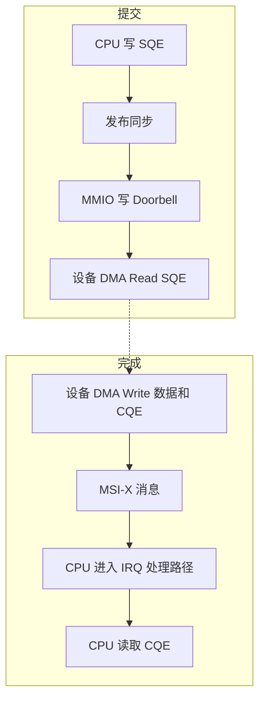

因此可以先记住一句话：

> **BAR 提供 CPU 到设备资源窗口的入口，MMIO 承担控制面通知，DMA 搬运队列与数据，MSI-X 完成设备到 CPU 的通知闭环。**

![[图片/SVG/8_0_4_1.svg|900]]

本篇不重复 NVMe 环形队列的完整协议；SQ/CQ、head/tail、phase tag 和背压见 [[3.2 Queue Pair 与 Doorbell]]。

---

## 2. PCIe 的最小心智模型

PCIe 不是一条所有设备共享的传统并行总线，而是由点对点链路和交换节点组成的分层网络。

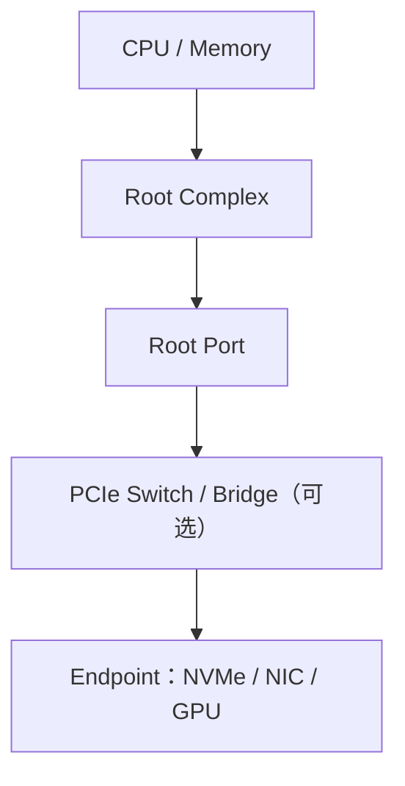

### 2.1 Root Complex、Endpoint 与 BDF

- **Root Complex（RC）**：连接 CPU/内存系统与 PCIe hierarchy；
- **Root Port**：Root Complex 向某条 PCIe 下游链路暴露的端口；
- **Switch / Bridge**：在层级中转发事务，并形成下游总线；
- **Endpoint（EP）**：NVMe SSD、NIC、GPU 等终端功能。

操作系统用 **BDF（Bus:Device.Function）** 定位一个 PCI function。例如：

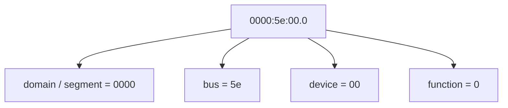

一个物理设备可以暴露多个 function。配置空间、BAR、MSI-X capability 和 Linux sysfs 目录都以具体 function 的 BDF 为索引。

PCIe lane、代际带宽、链路降速、switch oversubscription 和跨 NUMA 路径的容量账，统一交给 [[3.8 PCIe 拓扑与 NUMA]]；本篇只回答“事务如何找到设备”。

### 2.2 Configuration Space：设备的发现与配置入口

每个 PCI function 都有 **configuration space（配置空间）**，其中包含：

- Vendor ID、Device ID、Class Code；
- Command / Status；
- BAR 字段；
- Capability 和 Extended Capability 链；
- MSI/MSI-X、PCIe、AER 等能力结构。

配置空间是“这个 function 是谁、需要什么资源、支持什么能力”的元数据空间。它不等于 BAR 映射出的运行时寄存器空间。

### 2.3 事务分类只需先掌握四类

PCIe 在线路上传输的是 packet。理解本篇时，先建立以下抽象即可：

| 事务 | 典型用途 | 是否需要返回 Completion |
| --- | --- | --- |
| Configuration Read/Write | 枚举和配置 function | 都是 non-posted；Read 返回带数据的 Completion，Write 返回不带数据的 Completion |
| Memory Read | CPU 读 MMIO、设备 DMA Read | 需要 Completion Data |
| Memory Write | CPU 写 MMIO、设备 DMA Write | 通常是 posted，不返回普通 Completion |
| Message | PCIe 原生消息，例如部分错误与电源管理事件 | 是否需要响应取决于具体消息类型 |

MSI/MSI-X 虽然在软件语义上是“中断消息”，在线路上使用的是 **Memory Write Request TLP**：设备向配置好的 Message Address 写入 Message Data，而不是发送 PCIe Message Request TLP。

“posted”只表示 requester 不等待普通 Completion，并不表示设备已经处理完该请求。

---

## 3. BAR：资源窗口的声明，不是寄存器本身

**BAR（Base Address Register）** 位于 PCI configuration space。它是设备资源需求与系统地址分配的入口：设备声明需要多大的 I/O 或 memory aperture、地址类型和属性，固件或操作系统再为它分配系统地址范围。

> BAR 字段本身不是 Doorbell，也不是“一组设备寄存器”。BAR 指向的是一个 **aperture/window（地址窗口）**；窗口内部某个 offset 的语义才由设备规范定义。

![[图片/SVG/8_0_4_2.svg|900]]

一个 BAR aperture 内可能包含：

- 控制与状态寄存器；
- Doorbell；
- 设备内存窗口；
- MSI-X Table 或 PBA；
- 厂商自定义区域。

### 3.1 BAR 常见属性

| 属性 | 含义 |
| --- | --- |
| Memory BAR / I/O BAR | 资源属于内存地址空间还是传统 I/O 端口空间 |
| 32-bit / 64-bit | BAR 能表达的基址宽度；64-bit BAR 会占用相邻两个 BAR 字段 |
| Prefetchable | 该区域是否允许更积极的预取、合并等访问优化 |
| Size | aperture 所需范围，由枚举软件按规范探测并分配 |

`prefetchable` 不等于“普通可缓存 DRAM”。控制寄存器通常具有副作用，不能因为它位于 Memory BAR 就任意预取或合并访问。

### 3.2 枚举与地址分配

简化流程是：

1. 固件或 OS 枚举 PCI hierarchy，发现 BDF；
2. 读取设备资源需求；
3. 为各 BAR 分配不冲突的系统地址范围；
4. 配置 bridge window，使上游事务能够被路由到下游；
5. 将基址写入 BAR，并在合适时启用 Memory Space；
6. 驱动 claim 资源并建立 CPU 可用的 I/O 映射。

不应在活动设备上自行用配置空间写操作“实验”BAR 大小。错误写入可能让驱动失去设备或把事务路由到错误资源。

### 3.3 同一 BAR 的三种地址表示

| 表示 | 谁看到 | 含义 |
| --- | --- | --- |
| BAR resource address | 平台、PCI 资源管理 | 分配给 aperture 的系统资源区间 |
| `/sys/.../resource` 区间 | Linux 用户 | 内核公布的资源起止和 flags |
| `ioremap/pci_iomap` 或 VFIO `mmap` 后的 VA | 内核驱动或用户进程 | CPU 页表中的 I/O mapping virtual address |

这三者不能混用。尤其是：

- MMIO mapping 后的用户 VA 不是 BAR resource address；
- BAR resource address 不是普通 DRAM PA；
- 它们都不是设备访问主机内存时使用的 DMA address / IOVA。

上一章的 IOVA→PA 服务于**设备访问主机内存**；本章的 CPU VA→BAR aperture 服务于**CPU 访问设备资源**，是两条不同路径。

---

## 4. BAR 如何进入内核或用户进程

### 4.1 内核驱动的概念链

Linux PCI 驱动通常遵循下面的资源生命周期：

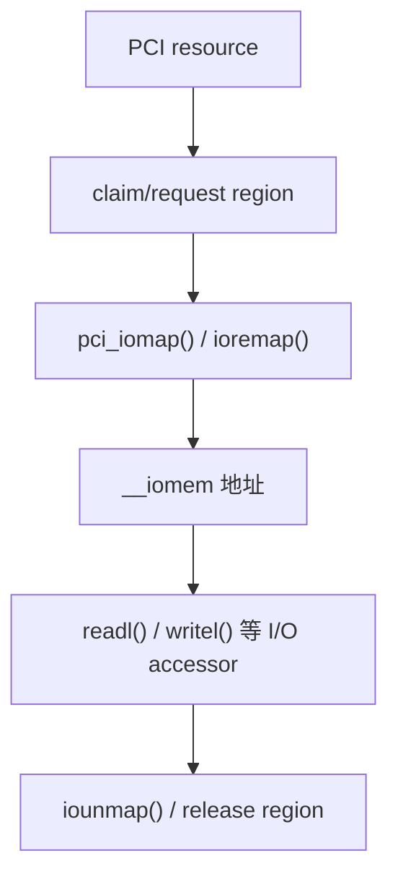

`__iomem` 用于标记这是 I/O 地址域，并帮助静态检查发现把它当普通内存指针的错误。驱动使用 `readl()`、`writel()` 等平台 accessor，是因为访问宽度、端序和 ordering 都不能只靠普通 C 赋值推断。

本篇不提供可复制的裸内核模块：不同设备寄存器的可读、可写、访问宽度和副作用必须以设备规范为准。

### 4.2 VFIO：受控地把设备区域交给用户态

VFIO 可以在设备所有权、IOMMU group 和权限约束下，把允许访问的 device region 暴露给用户进程：

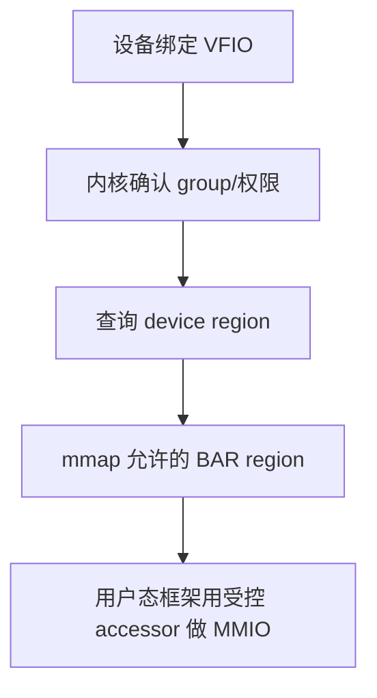

用户态驱动还可以通过 VFIO ioctl 将设备中断绑定到 eventfd。完整的解绑、绑定、group 检查和回滚见 [[5.10 VFIO UIO 与设备绑定]]；SPDK 如何组合 BAR、DMA 内存和轮询见 [[5.6 SPDK 用户态驱动]]。

### 4.3 `mmap` 后仍然不是普通 RAM

> [!warning] BAR mapping 不是普通堆内存
> 即使 VFIO `mmap` 返回了一个用户 VA，访问仍可能触发真实设备动作。读可能清除状态，写可能复位设备或启动 DMA；设备 reset/hot-unplug 后，旧映射也可能失效。

因此不能默认：

- 任意字节宽度都有效；
- 未对齐访问会被安全拆分；
- 普通 `memcpy` 或结构体赋值适用；
- `std::atomic_ref` 能为设备寄存器提供正确语义；
- 扫描未知 offset 是只读且安全的；
- 映射具有普通 cacheable RAM 的一致性和原子性。

---

## 5. MMIO：CPU load/store 如何变成设备事务

**MMIO（Memory-Mapped I/O）** 把设备资源映射到 CPU 地址空间。CPU 对该 I/O mapping 执行规定的 load/store，平台会把它转换为发往对应 Endpoint 的事务。

### 5.1 Posted Write 与 Non-posted Read

**MMIO Memory Write 通常是 posted**：写请求进入平台后，CPU/requester 不等待设备返回普通 Completion。这适合 Doorbell 这类“只需通知”的热路径。

**MMIO Memory Read 需要返回数据**：请求经过 Root Complex、可能的 bridge/switch 到达设备，再由 Completion Data 返回 CPU。它存在往返等待，通常比写更容易把设备和拓扑延迟暴露给 CPU。

但必须准确理解 posted：

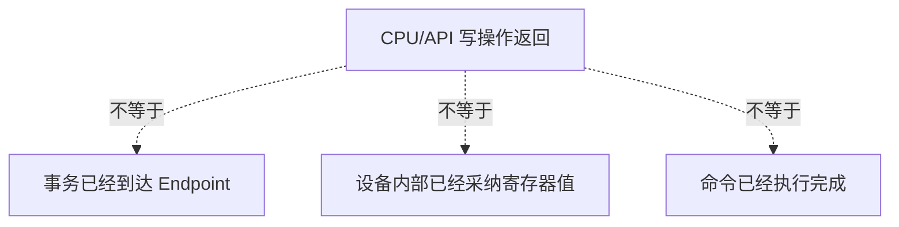

设备完成必须由协议定义的状态、CQE 或其他 completion 机制确认，不能用 `writel()` 或用户态 store 返回来判断。

MMIO 延迟随 CPU、Root Complex、PCIe 拓扑、拥塞、虚拟化、映射属性和设备实现变化。只能在目标平台实测分布，不能把某个固定纳秒或微秒值当成规范保证。

### 5.2 访问纪律

1. **宽度**：按设备规范使用规定的 8/16/32/64 位访问；
2. **对齐**：满足寄存器要求，不能假定平台会安全拆分；
3. **端序**：使用平台或框架提供的 endian-aware accessor；
4. **副作用**：识别 read-clear、write-1-to-clear、write-only 等语义；
5. **保留位**：不得随意写 1；read-modify-write 也可能因并发硬件更新而危险；
6. **原子性**：不能假定跨寄存器或错误宽度访问是原子的；
7. **生命周期**：reset、FLR、hot-unplug 和驱动切换后重新验证映射。

### 5.3 Cache 属性与 Prefetchable

设备控制寄存器通常不能像普通 write-back RAM 那样缓存。某些 prefetchable aperture 或设备内存窗口可使用更适合连续访问的映射属性；WC（write combining）也可能降低连续写的发射成本，但会让写缓冲、排空和 ordering 前提更重要。

具体映射属性必须由 OS/驱动 API 与设备规范共同决定，不能只看“这是 Memory BAR”就自行选择。

---

## 6. `volatile`、原子、fence 与设备屏障

这四类工具处理不同层次的问题：

| 手段 | 主要约束 | 不能自动保证什么 |
| --- | --- | --- |
| `volatile` | 特定实现中的可观察访问与编译器处理 | CPU/PCIe 顺序、DMA 可见性、设备完成 |
| C++ `std::atomic` | C++ 线程之间的对象访问和 happens-before | 设备寄存器副作用、I/O ordering |
| CPU memory fence | CPU 普通内存访问的体系结构顺序 | 所有 MMIO/DMA 平台语义 |
| DMA/MMIO accessor 与 barrier | CPU、设备、互连之间规定的发布和观察 | 设备已经执行命令 |

CPU 核之间的内存模型见 [[0.1 CPU Cache Cache Line 与内存屏障]]。设备不属于 C++ 抽象机里的线程，因此 `std::atomic_thread_fence` 不能单独替代内核或用户态驱动框架规定的 DMA/MMIO 原语。

### 6.1 发布 Doorbell 的正确抽象

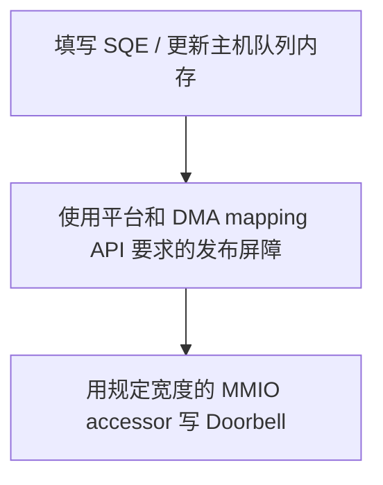

这解决的是“设备看到新 tail 时，相关 SQE 已经可读”的发布问题。

不能把 PCIe ordering 简化成“同方向 posted writes 永不重排”。可依赖顺序还受 Relaxed Ordering、No Snoop、Requester、Traffic Class、CPU memory type、bridge/Root Complex 和平台 accessor 语义影响【事实/边界】：

> 只有设备协议、PCIe attributes、平台内存模型和 OS/驱动 API 的前提共同成立，软件才能依赖相应顺序。

### 6.2 Read-back/flush 的有限作用

某些设备和平台要求通过安全寄存器 read-back、专用 flush helper 或其他 API 推进此前的 posted write。使用时必须满足：

- 被读取寄存器没有破坏性副作用；
- 手册明确规定该读能够排空所需范围；
- 只把它当作写推进或顺序机制；
- 不把 read-back 成功误认为设备命令完成。

不存在适用于所有 PCIe 设备的“随便读一个 BAR offset 就能 flush”规则。

---

## 7. NVMe：队列在 DRAM，Doorbell 在 BAR

![[图片/SVG/8_0_4_3.svg|900]]

典型 NVMe 控制器把大块共享状态放在主机内存，把少量控制入口放在 BAR：

| 对象 | 常见位置 | 访问方式 |
| --- | --- | --- |
| SQ / CQ | DMA-mapped 主机 DRAM | CPU 普通访存；控制器 DMA |
| 数据 buffer | DMA-mapped 主机内存 | 应用/CPU 与控制器 DMA |
| 控制寄存器 | NVMe BAR aperture | CPU MMIO |
| SQ Tail / CQ Head Doorbell | NVMe BAR aperture | CPU MMIO Write |

CMB 等可选能力可能让部分队列或数据位于控制器内存，因此“队列在主机 DRAM”是常见基本形态，不是对所有配置的无条件断言。

### 7.1 Doorbell 只传索引

- **SQ Tail Doorbell**：主机告诉控制器 SQ tail 已推进到哪里；
- **CQ Head Doorbell**：主机告诉控制器 CQE 已消费到哪里，可以复用相应槽位。

Doorbell 不承载 SQE/CQE 正文。命令与完成项仍通过主机队列内存交换：

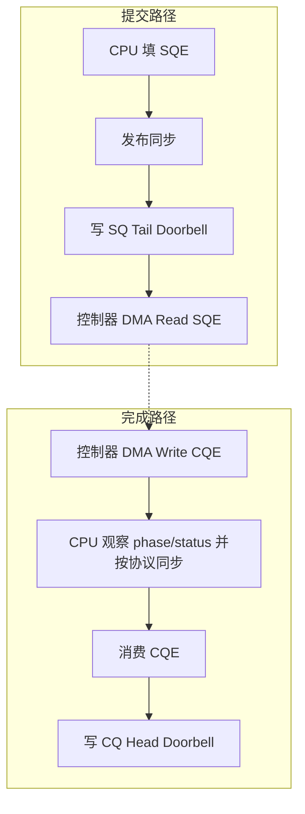

### 7.2 `CAP.DSTRD`：Doorbell 的步长

NVMe Doorbell 从 BAR aperture 的规定偏移开始，其相邻寄存器间距由 `CAP.DSTRD` 决定。用于理解的公式是：

```text
stride = 4 << CAP.DSTRD

SQ Tail Doorbell(qid)
  = 0x1000 + (2 × qid) × stride

CQ Head Doorbell(qid)
  = 0x1000 + (2 × qid + 1) × stride
```

当 `DSTRD = 0` 时，相邻 Doorbell 的间距为 4 B。注意：

- DSTRD 决定 **寄存器 offset 步长**，不是队列深度；
- Doorbell 访问宽度仍必须遵守 NVMe 规范；
- offset 算错可能敲到另一条队列或保留区域；
- 公式用于理解和审阅驱动，不是鼓励自行 mmap 活动设备后写寄存器。

### 7.3 Doorbell batching

如果连续准备 N 个 SQE，再一次把 tail 推进 N 个位置，就能把一次 MMIO 的固定成本摊给 N 条命令【取舍】。代价是第一条命令可能等待后续命令凑批，因此：

- 高负载时，合批常能降低每 I/O 的 CPU/MMIO 成本；
- 低负载或延迟敏感时，攒批会增加可见延迟；
- 最优 batch 取决于设备、队列深度、负载到达模式和目标 p99，必须实测。

部分控制器和软件栈支持 Doorbell Buffer Config / shadow doorbell，以内存中的 shadow 状态减少真实 MMIO。它是可选优化，需要控制器、驱动及 event index 协议共同支持，不能概括成“NVMe Doorbell 永远不再写 BAR”。

---

## 8. 从 INTx 到 MSI-X

### 8.1 INTx

传统 INTx 使用引脚/电平语义，通常需要共享中断，并由驱动读取设备状态判断来源、清除条件和 deassert。它适合作为历史对照，不适合大量独立队列的精细投递。

### 8.2 MSI

**MSI（Message Signaled Interrupt）** 让设备向配置好的 Message Address 发出 **Memory Write Request**，并携带 Message Data，从而触发中断，不再依赖传统中断线。它在软件语义上是一条中断消息，但在线路上不是 PCIe Message Request TLP；平台会把这次特定地址的数据写解释为中断投递，而不是普通业务数据写入 DRAM。

### 8.3 MSI-X

**MSI-X** 在 MSI 思路上提供更大的、可独立配置的向量表：

- 支持更多 message entry；
- 每个 entry 有独立的 Message Address/Data；
- 每个 entry 可独立 mask；
- Table 和 PBA 位于 BAR aperture 中；
- 多个完成队列可以选择不同 entry，从而映射到不同 IRQ/CPU。

“可以不同”不等于“一队列必有一个独占 MSI-X vector”。设备能力、驱动实际申请数、CPU 数和队列策略都可能导致多个 CQ 共享同一向量。

中断、busy polling 与 context switch 的完整成本模型见 [[0.6 Interrupt Busy Polling 与 Context Switch]]；NVMe 多队列的设备级向量调优见 [[3.12 Interrupt 与 MSI-X]]。

---

## 9. MSI-X Capability、Table 与 PBA

### 9.1 Configuration Space 中的 Capability

MSI-X capability 位于 PCI configuration space，关键内容包括：

- MSI-X Enable；
- Function Mask；
- Table Size；
- Table BIR + offset；
- PBA BIR + offset。

**BIR（BAR Indicator Register）** 指明 Table/PBA 位于哪个 BAR，offset 再定位该 aperture 中的具体区域。

### 9.2 Table Entry

每个 MSI-X Table entry 包含：

| 字段 | 含义 |
| --- | --- |
| Message Address | 设备触发该中断时使用的目标消息地址 |
| Message Data | 随消息发送、供平台中断控制逻辑解释的数据 |
| Vector Control | 包含该 entry 的 mask 控制 |

它描述“设备应向哪里写什么消息”，不是 CPU 函数指针，也不等于 Linux IRQ number。

### 9.3 PBA

**PBA（Pending Bit Array）** 是软件只读的 pending 状态：当对应 vector 被 per-vector mask 或 Function Mask 屏蔽时，设备可将待投递条件记入相应 bit。解除屏蔽后，如果 pending bit 仍置位，function 应按规范发送对应消息并清除该 bit；软件不能把 PBA 当作普通可写状态寄存器直接清零。

> [!danger] 不要直接编辑活动设备的 MSI-X Table
> 不要用 `/dev/mem`、`resourceN`、任意 BAR mapping 或配置空间写操作修改 Table。内核/VFIO 会在设备所有权、mask、interrupt remapping 和并发规则下配置它；绕过这些机制可能导致丢中断、错投递或系统不稳定。

---

## 10. MSI-X 消息如何到达 CPU

![[图片/SVG/8_0_4_4.svg|900]]

设备触发某个 MSI-X entry 时，会生成带有对应 Message Address/Data 的 PCIe Memory Write Request。平台中断控制与可选的 interrupt remapping 逻辑将其转换为 CPU 可接收的中断事件。

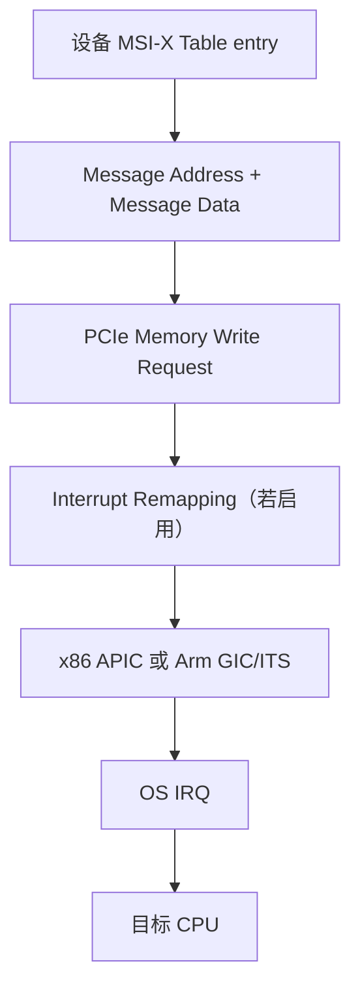

- x86 平台通常经 APIC 体系完成投递；
- 启用 VT-d interrupt remapping 时，重映射单元可以验证并转换中断目标；
- Arm 平台常由 GIC/ITS 将设备事件映射为目标中断；
- 具体地址/data 编码是架构和平台细节，不能推广成所有 PCIe 系统的固定值。

### 10.1 Interrupt remapping 不等于 DMA remapping

| 机制 | 约束对象 | 解决的问题 |
| --- | --- | --- |
| DMA remapping | 设备访问主机内存的 IOVA→PA | 设备能读写哪些页面 |
| Interrupt remapping | MSI/MSI-X 消息的投递目标 | 设备能触发哪个中断、投递给哪里 |

二者都可属于 IOMMU/平台虚拟化体系，但不是同一张页表，也不能互相替代。

### 10.2 四种“编号”必须分层

| 名称 | 所属层 | 含义 |
| --- | --- | --- |
| MSI-X entry / device vector | 设备/PCI 层 | MSI-X Table 中的一条可配置消息源 |
| Linux IRQ number | 内核抽象 | Linux 为中断源分配的标识 |
| CPU vector / INTID | 架构中断控制器 | CPU 接收侧的中断标识 |
| CPU affinity | Linux IRQ 管理层 | 允许或实际接收该 IRQ 的 CPU 集合 |

这些编号通常不相等。日志应写清“MSI-X entry 3”“Linux IRQ 142”或“CPU 6”，不能只写含义不明的“vector 3”。

### 10.3 Configured 与 Effective Affinity

- `smp_affinity_list`：允许的目标 CPU 集合；
- `effective_affinity_list`：当前真正生效的集合；
- irqbalance 可能调整普通 IRQ；
- managed IRQ 由内核与驱动管理，手动写 affinity 可能失败或不生效；
- CPU offline、cpuset 和架构限制也可能改变实际投递。

设备、内存、提交线程和中断落点怎样按 NUMA 对齐，将在 [[0.5 NUMA CPU 亲和性与内存亲和性]] 展开。

### 10.4 VFIO eventfd

VFIO 可把中断通知接到 eventfd：

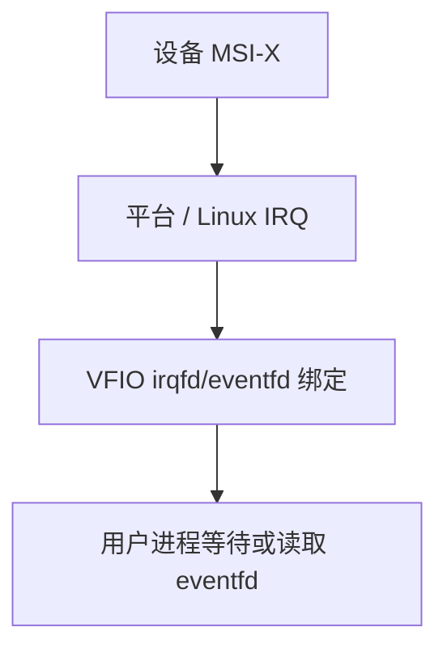

Eventfd 是内核向用户进程暴露通知的边界，不是 MSI-X Table 本身，也不会自动为 CQE 建立 C++ happens-before。用户态驱动仍需遵循设备协议和 DMA 同步规则读取完成项。

---

## 11. 一次 NVMe 请求的完整闭环

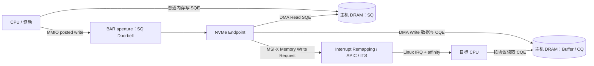

这张图中有三条不能混淆的地址路径：

1. **SQ/CQ 和数据 buffer**：设备使用 DMA address/IOVA，经 IOMMU 映射到主机物理页；
2. **BAR Doorbell**：CPU 使用 I/O mapping VA，平台把 store 路由到设备 aperture；
3. **MSI-X**：设备发出中断消息，可能经 interrupt remapping 和中断控制器到 CPU。

中断到达表示“有事件值得处理”，不能直接当作通用 C++ acquire。驱动仍须按 NVMe 协议和平台 DMA API 检查 phase/status、执行所需读取屏障，再消费 CQE 其余字段。软件也不能普遍假定一条 CQE 对 CPU 是对象级原子写入。

---

## 12. Linux 安全观察

下面的命令只读取配置和内核元数据，不访问未知 BAR offset。先用真实 BDF 替换 `<BDF>`，例如 `0000:5e:00.0`。

### 12.1 设备、BAR 与 Capability

```bash
lspci -Dnn -s <BDF>
lspci -Dvv -s <BDF>
readlink /sys/bus/pci/devices/<BDF>/driver
cat /sys/bus/pci/devices/<BDF>/resource
readlink /sys/bus/pci/devices/<BDF>/iommu_group
```

可以观察：

- 设备身份、驱动和链路能力；
- BAR resource range；
- MSI-X 是否启用、Table Size；
- Table/PBA 的 BIR 和 offset；
- 设备属于哪个 IOMMU group。

`resource` 只显示资源区间元数据。不要把读取 `resource0` 等 BAR 内容当作常规探测：寄存器读也可能有副作用。

### 12.2 MSI IRQ 与亲和性

```bash
find /sys/bus/pci/devices/<BDF>/msi_irqs -maxdepth 1 -type f -print
grep -E 'nvme|PCI-MSI' /proc/interrupts
cat /proc/irq/<IRQ>/smp_affinity_list
cat /proc/irq/<IRQ>/effective_affinity_list
```

推荐观察顺序：

1. 用 BDF 锁定 function；
2. 从 `msi_irqs` 找 Linux IRQ；
3. 用 `/proc/interrupts` 查看每 CPU 的计数增量；
4. 对照 configured/effective affinity；
5. 结合驱动队列信息判断是否共享向量，不用 IRQ 编号反猜 MSI-X entry。

> [!warning] 安全边界
> 只读 `lspci` 和 sysfs 元数据通常适合观察；`setpci` 写配置空间、`/dev/mem`、扫描 BAR、写 Doorbell 或 Table 都可能改变活动设备状态，不属于本章实验。

---

## 13. 受控实验

### 13.1 实验 A：Doorbell 合批

**目标**：观察每条命令敲一次 Doorbell 与每批 N 条敲一次的 CPU、吞吐和尾延迟差异。

应使用已有安全框架或驱动提供的 batch 参数，不编写裸 BAR 程序。具体参数需按本机 SPDK/驱动版本核对。

| 项目 | 控制方法 |
| --- | --- |
| 固定条件 | 同一设备/namespace、I/O 大小、读写模式、QD、队列数、线程、CPU/NUMA、时长和预热 |
| 唯一变量 | 提交 batch 或 Doorbell 合批阈值 |
| 测试点 | batch = 1、2、4、8 等多点 |
| 指标 | IOPS、带宽、CPU、平均延迟、p99/p99.9；可得时记录 Doorbell 次数 |

**能证明**：目标平台与 workload 下，MMIO 摊销和攒批等待的实际平衡。

**不能证明**：某个 batch 对所有设备都是最优；也不能把变化全部归因于 MMIO，框架内部调度和队列策略必须保持一致。

如果 shadow doorbell 支持情况无法确认，应保持默认，不把它混入变量。

### 13.2 实验 B：IRQ Affinity

只在非系统盘、非生产流量、可恢复的测试环境中进行：

1. 记录 BDF、驱动、IRQ、原 `smp_affinity_list`、`effective_affinity_list` 和 `/proc/interrupts` 基线；
2. 确认 IRQ 是否 managed；
3. 若内核允许，只改变一个 I/O IRQ 的 affinity；
4. 分别观察提交线程所在 CPU、同 NUMA 其他 CPU、可控远端 CPU；
5. 保持 workload 其他条件不变；
6. 记录 per-CPU IRQ 增量、IOPS、p99 和 CPU；
7. 实验结束立即恢复原 affinity；
8. managed IRQ 拒绝修改时，将其作为观察结果，不绕过内核策略。

**能证明**：当前机器上中断落点对处理路径和局部性的影响。

**不能证明**：中断一定优于或劣于 polling。两种通知策略的完整经济账见 [[0.6 Interrupt Busy Polling 与 Context Switch]]。

---

## 14. 故障定位

| 症状 | 可能原因 | 首要检查 |
| --- | --- | --- |
| Doorbell 已写但设备无进展 | SQE 未正确发布、DSTRD/offset 错、宽度错、控制器未启用 | accessor、barrier、`CAP.DSTRD`、控制器状态 |
| 偶发读到半更新状态 | 把 MMIO 当 RAM、宽度/对齐错误、DMA 读取同步不完整 | 设备规范、MMIO accessor、DMA barrier |
| MMIO 写返回但命令未完成 | 把 posted write 接受误认为设备执行 | 查 CQE/协议状态，不以写函数返回判完成 |
| MMIO Read 导致高延迟或抖动 | Read 等待 Completion，拓扑/虚拟化/拥塞变化 | profile 访问点和事务类型，实测分布 |
| 有 CQE 但没有 IRQ | MSI-X 未启用、entry/function mask、队列—向量映射或 IRQ 问题 | `lspci -vv`、`msi_irqs`、`/proc/interrupts` |
| IRQ 增长但用户进程不醒 | VFIO IRQ/eventfd 配置、fd 生命周期或消费错误 | VFIO ioctl、eventfd 绑定和读取路径 |
| IRQ 全落一个 CPU | 向量不足、多个 CQ 共享、affinity/managed policy | Table Size、申请向量数、effective affinity |
| affinity 写入失败或不生效 | managed IRQ、CPU offline、cpuset 或内核策略 | effective affinity、online CPU、驱动策略 |
| IRQ 到达后 CQE/数据仍错误 | 把 IRQ 当 acquire、缺少 DMA read barrier、协议状态读取错误 | completion 读取顺序与 DMA API |
| BAR 映射后访问异常 | region/offset 越界、错误 cache type、设备 reset/remove | region 大小、设备状态、映射生命周期 |

推荐按以下顺序排查：

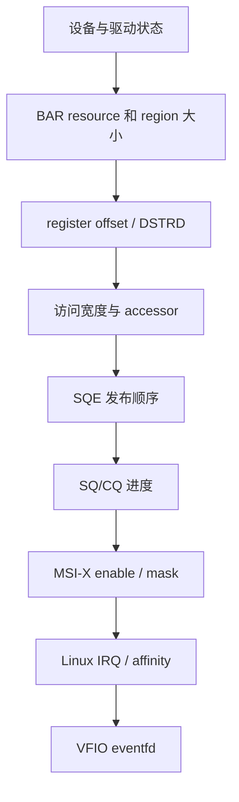

先确认控制路径正确，再讨论合批、向量数量和亲和优化。

---

## 15. 陷阱与误区

> [!warning] 1. BAR 就是一组设备寄存器
> 错。BAR 是配置空间中的资源声明和 aperture 入口；窗口内部每个 offset 的意义才由设备规范定义。

> [!warning] 2. BAR 地址可以当普通指针
> 错。必须经过 OS/驱动授权和 I/O mapping，并用符合平台与设备语义的 accessor。

> [!warning] 3. `volatile` 足以保证 Doorbell 顺序
> 错。它不替代 DMA/MMIO barrier，也不建立设备协议需要的可见性。

> [!warning] 4. `std::atomic_thread_fence` 能同步 PCIe 设备
> 错。C++ 标准规定的是抽象机中的线程与对象；设备交互还需要平台和驱动 API。

> [!warning] 5. Posted write 返回代表设备已经执行
> 错。它只说明 requester 不等待普通 Completion；命令完成必须由 CQE或协议状态确认。

> [!warning] 6. PCIe 写天然永不重排
> 过度简化。可依赖顺序受 transaction attributes、Requester、memory type、bridge、平台和 accessor 前提约束。

> [!warning] 7. 一个队列必有一个独占 MSI-X vector
> 错。向量能力与驱动申请数量有限，多个 CQ 可以共享一个 entry/IRQ。

> [!warning] 8. MSI-X vector、Linux IRQ、CPU vector 是同一个编号
> 错。它们属于设备、内核和架构中断控制器三个层次。

> [!warning] 9. 中断到达天然等于 C++ acquire
> 错。IRQ 是通知；CQE 和 DMA 数据仍需按设备协议与平台 API 同步后读取。

> [!warning] 10. CQE 一定对 CPU 原子可见
> 错。不能把任意 DMA 写当作 C++ 对象级原子发布；应先按协议检查 phase/status，再执行要求的屏障并读取其余字段。

> [!warning] 11. MMIO 延迟是固定常数
> 错。访问类型、拓扑、虚拟化和设备实现都会改变延迟，只能在目标环境实测。

> [!warning] 12. 可以手动改 MSI-X Table 调 affinity
> 错且危险。应使用 Linux IRQ 或 VFIO 接口，不直接编辑活动设备 Table。

---

## 16. 关键结论

| 结论 | 性质 |
| --- | --- |
| BAR 是配置空间中的资源声明与 aperture，不是运行时寄存器集合本身 | 事实 |
| MMIO mapping 不是普通 RAM；宽度、端序、cache 属性、顺序和副作用受设备与平台约束 | 事实 |
| Posted write 不等待普通 Completion，也不等于事务已被设备执行 | 事实 |
| `volatile`、C++ atomic、CPU fence、DMA/MMIO barrier 的作用域不同 | 事实 |
| NVMe SQ/CQ 通常在主机 DRAM，Doorbell 在 BAR；`CAP.DSTRD` 决定 Doorbell stride | 事实 |
| Doorbell batching 用更少 MMIO 换潜在攒批延迟，最优点必须实测 | 取舍 |
| MSI-X 通过 Message Address/Data 触发平台中断，Table/PBA 由受控软件管理 | 事实 |
| MSI-X entry、Linux IRQ、CPU vector/INTID 与 affinity 必须分层理解 | 事实 |
| IRQ 到达是通知，不是通用语言级 acquire，也不保证任意 CQE 对 CPU 原子可见 | 事实 / 边界 |
| BAR/MMIO、DMA 和 MSI-X 共同组成一笔请求的控制、数据与通知闭环 | 事实 / 总结 |

---

## 17. 学习检查

- [x] 能区分 Root Complex、Endpoint、BDF、configuration space 与 BAR
- [x] 能解释 BAR 为什么是 aperture，而不是寄存器本身
- [x] 能画出 BAR resource 到内核/用户 I/O mapping VA 的链路
- [x] 能解释 posted write 返回为何不代表设备执行
- [x] 能说明 MMIO 的宽度、cache 属性与访问副作用
- [x] 能区分 `volatile`、C++ atomic、CPU fence 与 DMA/MMIO barrier
- [x] 能根据 `CAP.DSTRD` 计算 NVMe Doorbell offset
- [x] 能说明 SQ/CQ、Doorbell 与数据 buffer 分别在哪里
- [x] 能比较 INTx、MSI 与 MSI-X
- [x] 能解释 MSI-X capability、Table、PBA 与 Message Address/Data
- [x] 能区分 MSI-X entry、Linux IRQ、CPU vector/INTID 与 affinity
- [x] 能解释 interrupt remapping、APIC 与 GIC ITS 的层次
- [x] 能说明 VFIO eventfd 在中断路径中的边界
- [x] 能用只读 Linux 命令观察 BAR、MSI-X、IRQ 和 affinity
- [x] 能设计 Doorbell batching 与 IRQ affinity 的受控实验
- [x] 能按层定位 Doorbell 无进展、丢中断与错投递问题

---

## 关联知识

- [[0.1 CPU Cache Cache Line 与内存屏障]] - 区分 CPU 线程内存序与 DMA/MMIO 屏障
- [[0.3 DMA IOMMU 与 Pinned Memory]] - 本章之前的 IOVA、DMA mapping 与 buffer ownership
- [[0.5 NUMA CPU 亲和性与内存亲和性]] - 设备、内存、处理线程与 IRQ 的拓扑对齐
- [[0.6 Interrupt Busy Polling 与 Context Switch]] - 完成通知方式的 CPU 与延迟取舍
- [[3.2 Queue Pair 与 Doorbell]] - NVMe SQ/CQ、phase tag、Doorbell 与背压协议
- [[3.8 PCIe 拓扑与 NUMA]] - lane、switch、链路带宽与 NUMA 数据路径
- [[3.12 Interrupt 与 MSI-X]] - NVMe 多队列向量、中断合并和调优
- [[5.6 SPDK 用户态驱动]] - BAR 与队列映射进入用户态后的实际数据路径
- [[5.10 VFIO UIO 与设备绑定]] - 设备接管、权限与 IOMMU group

## 参考

- PCI-SIG: *PCI Express Base Specification*
- NVM Express: *NVM Express Base Specification*
- Linux Kernel Documentation: *PCI Bus Subsystem* / *How To Write Linux PCI Drivers*
- Linux Kernel Documentation: *Bus-Independent Device Accesses*
- Linux Kernel Documentation: *The MSI Driver Guide HOWTO*
- Linux Kernel Documentation: *SMP IRQ affinity*
- Linux Kernel Documentation: *VFIO - Virtual Function I/O*
- Intel: *Virtualization Technology for Directed I/O Architecture Specification*
- Arm: *Generic Interrupt Controller Architecture Specification* 与 ITS 文档
