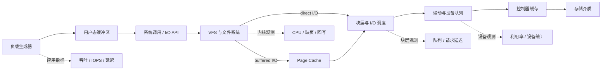
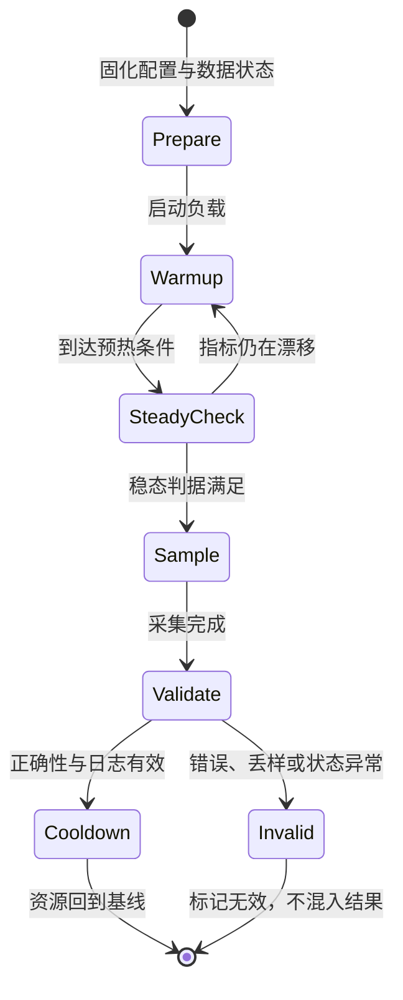

---
tags:
  - 高性能存储
  - Benchmark
  - 性能工程
status: 已完成
---

# Benchmark 基本方法

> Benchmark 不是“跑一次工具并抄下数字”，而是用可复现的实验回答一个边界清楚的问题。

## 前置

- [[0.7 性能指标 IOPS 带宽 延迟 P99]]：理解吞吐、IOPS、平均延迟和尾延迟分别描述什么。

## 1. Benchmark 究竟在回答什么

### 1.1 定义

**Benchmark（基准测试）**是在明确的系统边界、工作负载和环境约束下，通过受控实验测量系统行为，并用统计证据比较方案或发现回归的方法。

它通常回答三类问题：

1. **描述性问题**：系统在指定负载下能达到怎样的吞吐、延迟和资源占用？
2. **比较性问题**：方案 A 与方案 B 的差异是否稳定存在，代价是什么？
3. **诊断性问题**：瓶颈更可能位于应用、内核、设备还是其他共享资源？

一个孤立的“IOPS 很高”不是结论。至少还要说明：

- 测了什么对象；
- 数据经过哪些层；
- 负载如何生成；
- 数据集和介质处于什么状态；
- 指标在什么时间窗口内统计；
- 结果波动多大；
- 该结论能外推到哪些场景。

### 1.2 目标、假设与可证伪条件

实验开始前先写三句话：

- **目标**：要做决策的对象是什么？
- **假设**：预计哪个机制会导致哪个指标变化？
- **可证伪条件**：看到什么结果时，应当否定或暂不接受该假设？

示例：

> **目标**：比较同一文件系统上 buffered I/O 与 direct I/O 的随机读尾延迟。  
> **假设**：当数据集明显大于可用内存且访问随机时，buffered I/O 的首次运行会受 page cache 状态影响，跨轮次波动更大。  
> **可证伪条件**：在控制缓存状态、设备状态和后台任务后，两种模式的多轮分布没有稳定差异，或者差异来自 CPU、内存压力而非 I/O 路径。

> [!important] 先决定“如何推翻假设”
> 如果任何结果都能被解释为假设成立，那么这不是实验，只是事后讲故事。

### 1.3 系统边界与端到端观测路径

同一段数据可能经过应用缓冲区、系统调用、VFS、文件系统、page cache、块层、设备驱动、控制器缓存和存储介质。不同测试工具和选项覆盖的边界不同。



*图 1：一次文件 I/O Benchmark 的常见数据路径与观测点。实际路径由 API、文件系统、挂载参数和设备决定。*

因此，报告中必须写清：

| 边界问题 | 需要记录的内容 |
|---|---|
| 测试从哪里开始计时 | 业务请求、库调用、系统调用还是设备请求 |
| 在哪里结束计时 | 数据复制完成、系统调用返回、提交到设备，还是满足持久化语义 |
| 是否经过 page cache | buffered I/O 或 direct I/O |
| 是否包含文件系统开销 | 文件测试、块设备测试或设备内部测试 |
| 是否包含网络 | 本地盘、远端块存储、分布式文件系统 |
| 是否包含客户端排队 | 闭环负载还是开环到达模型 |
| 采集哪些旁路指标 | CPU、内存、NUMA、块层、设备、网络和错误计数 |

端到端延迟可以概念性地拆成：

$$
T_{e2e} = T_{queue,user} + T_{software} + T_{queue,device} + T_{service} + T_{durability}
$$

并非每次测试都会包含全部项。关键是声明计时边界，而不是把工具输出的 `lat` 自动解释为业务端到端延迟。

## 2. 先建立工作负载模型

Benchmark 的负载应当来自目标场景，而不是从工具参数倒推业务。一个最小工作负载模型至少包含以下维度。

### 2.1 访问模式与读写比例

- **顺序或随机**：顺序流式访问、均匀随机、热点分布、Zipf 类偏斜，含义不同。
- **读写比例**：只读、只写或混合读写；混合负载还要说明读写是否共享同一数据集。
- **覆盖范围**：整个文件、固定热点区，还是随时间移动的工作集。
- **到达模型**：
  - 闭环模型：上一个请求完成后再提交，常用于观察系统自然饱和点；
  - 开环模型：按目标速率到达，更接近存在外部请求率的服务，但过载时要特别观察排队和丢弃。

> [!warning] 协调遗漏（coordinated omission）
> 闭环生成器通常等待请求完成后才继续发送。系统若停顿 500 ms，这 500 ms 内原本按计划应到达的请求根本没有生成，直方图只记录少量“跨过停顿”的请求，因而系统性低估过载时的尾延迟。
>
> 普通闭环 fio 测试不会自动修正这种偏差。若目标是刻画给定外部到达率下的 SLO，应使用合适的开环负载模型，或在负载生成器中把计划发送时刻到实际完成时刻的排队时间计入端到端延迟。若受工具限制只能使用闭环模型，报告必须明确披露到达模型，并把结果解释为“固定并发下的完成延迟”，而不是计划到达负载下的用户延迟。

写比例可表示为：

$$
R_{write} = \frac{N_{write}}{N_{read} + N_{write}}
$$

不能只写“70/30”，还应注明是按请求数、字节数还是业务操作数计算。

### 2.2 块大小

块大小决定一次请求搬运的数据量，也影响 IOPS、带宽、放大效应和 CPU 开销。固定块大小便于归因，块大小分布则更接近真实业务。

理论关系用于检查数量级是否自洽：

$$
BW = IOPS \times B_{avg}
$$

其中平均块大小必须与统计口径一致。若工具输出明显不满足这一关系，应检查单位、读写汇总方式、压缩、缓存命中和采样窗口。

### 2.3 并发：iodepth 与 numjobs

- `iodepth`：单个 job 允许同时在途的 I/O 数量；只有异步 I/O 引擎真正支持时，设置较大值才可能形成相应并发。
- `numjobs`：并行 job 数量，通常意味着多个线程或进程各自生成负载。
- 近似总在途请求数可用于描述配置，但不能当作实际队列深度：

$$
Q_{configured} \approx iodepth \times numjobs
$$

实际在途量还受 I/O 引擎、同步语义、文件锁、内核合并、设备队列和负载生成器能力限制。提高并发通常会增加吞吐，直到某层饱和；与此同时，排队可能使尾延迟恶化。因此必须同时报告吞吐和延迟分布。

### 2.4 数据集大小与持续时间

- **数据集大小**决定工作集是否可能被 page cache、设备缓存或上层缓存容纳。
- **持续时间**应足以跨过瞬态阶段，覆盖回写、垃圾回收、压缩、检查点等周期性行为。
- 不能用“文件很大”代替记录实际大小，也不能假设“运行若干秒一定稳态”。应通过时间序列判断指标是否仍在漂移。
- 对容量型 SSD，数据集范围、已写入量和覆盖方式还会影响闪存转换层与垃圾回收状态。

### 2.5 同步与持久化语义

“写完成”至少可能表示：

1. 数据已复制到用户态或内核缓冲区；
2. `write` 已返回，但数据仍可能停留在 page cache；
3. 已执行 `fdatasync` 或 `fsync`；
4. 请求到达设备，并按设备与协议提供的 flush/FUA 语义处理；
5. 应用级事务提交完成。

`direct=1` 主要改变 page cache 路径，**不等价于数据已经持久化**。同样，测试结束时统一同步与每次操作同步也不是同一种语义。比较方案时，必须保持完成语义一致，否则得到的是“语义更弱所以更快”。

> [!warning] 正确性与性能不能分开
> 若目标系统要求崩溃后可恢复，Benchmark 必须测量满足该语义的路径；不能只测最短的提交路径，再把结果称为“持久化写延迟”。

## 3. 实验状态机：预热 → 稳态 → 采样 → 冷却

一次可靠实验不是单个命令，而是状态可检查、失败可中止的过程。



*图 2：单轮实验状态机。稳态应由可观察条件确认，而不是仅靠固定等待时间。*

### 3.1 准备阶段

1. 保存命令、工具版本、内核版本、文件系统与挂载参数。
2. 确认目标路径，检查剩余空间和权限。
3. 记录 CPU、NUMA、IRQ、频率策略及后台服务状态。
4. 建立或恢复目标数据集，记录盘状态。
5. 启动系统指标采集，确认时钟和采样周期一致。
6. 运行小规模冒烟测试，验证命令、输出和正确性检查。

### 3.2 预热阶段

预热用于排除初始化瞬态，例如：

- 文件首次分配与元数据初始化；
- page cache、TLB、代码与数据结构逐步变热；
- 线程创建、连接建立和内存分配；
- 设备从空闲状态进入活跃状态；
- SSD 后台回收开始参与；
- JIT 或动态优化系统完成初始编译。

预热数据不应直接混入正式样本。预热结束条件可以是：连续多个窗口内吞吐、延迟和队列深度不再呈单向漂移，并且设备状态符合实验定义。

### 3.3 稳态判定

**稳态不是“性能最好的一段”，而是关键状态量在统计上没有持续趋势的阶段。**

应同时观察：

- 吞吐或 IOPS 的时间序列；
- 中位延迟与高分位延迟；
- 在途请求数或队列深度；
- CPU、上下文切换和软中断；
- 脏页、回写速率或设备忙碌度；
- 温度、频率降级、SSD 垃圾回收等可获得信号。

若预热期结束后指标仍持续下降或周期性大幅摆动，应延长测试、重新定义稳态窗口，或明确报告“在本次时长内未观察到稳态”。不要截取最好看的区间。

### 3.4 采样阶段

采样阶段应固定：

- 时间窗口与采样周期；
- 负载参数；
- 统计起止点；
- 是否包含客户端排队；
- 延迟直方图精度与最高可记录范围；
- 系统旁路指标。

只保存汇总值会隐藏突发抖动。至少保留每轮汇总、固定时间粒度的时间序列，以及延迟分布或直方图。

### 3.5 冷却阶段

冷却不是为了让数字“变好”，而是避免上一轮状态无记录地污染下一轮：

- 停止负载并等待进程退出；
- 按实验语义完成必要同步；
- 等待回写和后台任务回落，或记录它们仍未回落；
- 收集错误日志、温度、设备健康和资源统计；
- 校验数据；
- 恢复下一轮规定的缓存与介质状态。

固定休眠时间只能作为流程的一部分，不能替代状态检查。

## 4. 关键记录结构

为了让“同一个命令”真正可复现，建议把记录拆成四层。

### 4.1 实验定义 ExperimentSpec

描述本轮**打算做什么**：

```yaml
experiment_spec:
  id: buffered-vs-direct-randread
  question: "在相同随机读负载下比较 buffered I/O 与 direct I/O"
  hypothesis: "两者受 page cache 影响不同"
  target: "/var/tmp/fio-bench/testfile"
  factors:
    io_mode: "buffered"
    rw: "randread"
    block_size: "${BLOCK_SIZE}"
    iodepth: "${IODEPTH}"
    numjobs: "${NUMJOBS}"
    dataset_size: "${DATASET_SIZE}"
    runtime: "${RUNTIME}"
  controlled_variables:
    - "同一主机、内核、文件系统与挂载参数"
    - "同一数据集内容与盘状态"
    - "同一 CPU/NUMA/IRQ 策略"
  stop_conditions:
    - "I/O error"
    - "数据校验失败"
    - "设备温度或健康状态越过预先规定边界"
```

### 4.2 环境快照 EnvironmentSnapshot

描述**在哪个系统上做**：

- 主机、内核、固件、fio 和依赖版本；
- CPU 型号、在线核、频率策略、NUMA 拓扑；
- 内存容量与当时可用量；
- 设备标识、逻辑/物理块大小、调度器；
- 文件系统、挂载参数、目标文件与容量占用；
- IRQ 亲和性、负载线程亲和性；
- 后台服务、容器限制、虚拟化环境；
- 测试前后的设备健康、温度与错误计数；
- Git 提交、配置文件摘要和命令行。

### 4.3 单轮记录 RunRecord

描述**实际发生了什么**：

```yaml
run_record:
  experiment_id: buffered-vs-direct-randread
  run_id: "${RUN_ID}"
  variant: "direct"
  randomized_order: "${ORDER_INDEX}"
  started_at: "${ISO8601_TIME}"
  phases:
    prepare: "${DURATION}"
    warmup: "${DURATION}"
    sample: "${DURATION}"
    cooldown: "${DURATION}"
  dataset_state_before: "preconditioned"
  cache_policy: "not-dropped"
  exit_status: "${EXIT_STATUS}"
  validity: "valid-or-invalid-with-reason"
  artifacts:
    fio_json: "fio-${RUN_ID}.json"
    system_metrics: "system-${RUN_ID}.jsonl"
    checksum_log: "verify-${RUN_ID}.log"
```

不要把失败轮次静默删除。应保留记录并标记无效原因，否则容易形成幸存者偏差。

### 4.4 样本与汇总 Sample / Summary

原始样本至少包含时间戳、操作类型、完成数、字节数和延迟分布。汇总层再计算：

- 各轮中位数；
- 四分位区间或 MAD；
- 需要时使用 bootstrap 置信区间；
- 最小值和最大值仅作异常线索，不作为稳定性证明；
- 吞吐、延迟和资源代价必须一起解释。

四分位距定义为：

$$
IQR = Q_{0.75} - Q_{0.25}
$$

中位绝对偏差定义为：

$$
MAD = median\left(\left|x_{i} - median(x)\right|\right)
$$

延迟通常偏斜且存在长尾，中位数与 IQR/MAD 往往比“平均值加标准差”更稳健。若报告置信区间，应写清计算方法、置信水平、重采样单位以及样本是“每次 I/O”还是“独立实验轮次”。大量相关联的单次 I/O 不能伪装成大量独立实验。

## 5. 变量控制与实验矩阵

### 5.1 单变量原则

一次对照只改变一个待研究因素，其余条件保持一致。例如比较 `iodepth` 时，不应同时改变块大小、job 数、数据集或同步语义。

单变量原则用于**归因**，并不意味着完整研究永远只看一个变量。真实系统存在交互作用，因此应分两步：

1. 用单变量对照理解局部因果；
2. 用预先设计的实验矩阵验证因素组合和交互。

### 5.2 实验矩阵

示例矩阵：

| 因素 | 候选水平 | 目的 |
|---|---|---|
| I/O 模式 | buffered、direct | 区分 page cache 路径 |
| 访问模式 | 顺序读、随机读、混合读写 | 覆盖典型局部性 |
| 块大小 | 由业务分布选取若干代表值 | 观察 IOPS 与带宽权衡 |
| `iodepth` | 从低并发逐步增加 | 寻找饱和点和排队代价 |
| `numjobs` | 按线程模型选取 | 观察并行提交和 CPU 竞争 |
| 数据集 | 小于、接近、大于可用缓存能力 | 识别缓存敏感性 |
| 盘状态 | 空盘、预处理盘、稳态盘 | 识别介质状态影响 |
| 同步语义 | buffered、direct、周期同步、逐次同步 | 比较前先确认语义等价性 |

矩阵规模是各维度水平数的乘积，很容易爆炸。应根据假设裁剪无意义组合，并在执行前生成唯一的组合 ID，避免漏跑或重复。

### 5.3 重复实验与随机化顺序

每个矩阵点应进行多轮独立重复。重复次数不要机械套固定值，而应根据：

- 轮间波动；
- 可接受的不确定性；
- 单轮成本；
- 决策风险；
- 是否能得到稳定的置信区间。

若 A 总在 B 前运行，结果可能混入升温、缓存、SSD 垃圾回收或后台任务的时间趋势。可采用：

- 随机打乱各 variant 的执行顺序；
- A/B 与 B/A 成对交替；
- 以“完整跑完一个随机顺序的矩阵”为一个 block，再重复多个 block。

随机种子和实际执行顺序必须归档。随机化用于打散系统性偏差，不会自动消除失控变量。

## 6. 缓存与介质状态：最常见的口径陷阱

### 6.1 Page cache 与 direct I/O

| 维度 | Buffered I/O | Direct I/O |
|---|---|---|
| 典型路径 | 经过 page cache | 尽量绕过 page cache 的数据缓存路径 |
| 读延迟 | 可能命中内存，也可能触发存储读取 | 更接近文件系统到设备的数据路径 |
| 写完成 | `write` 返回通常不代表持久化 | 绕过 page cache仍不自动等价于持久化 |
| 内存影响 | 可能产生缓存占用、脏页和回写 | 仍可能有元数据缓存、页表和其他内存开销 |
| 对齐要求 | 通常较宽松 | 常受地址、长度和偏移对齐约束 |
| 适合回答 | 应用真实使用缓存时的端到端表现 | 缩小 page cache 干扰、观察后端路径 |

这两种结果回答不同问题，不能把 direct I/O 数字称为“关闭缓存后的 buffered I/O”。Direct I/O 仍可能受到设备内部缓存、文件系统元数据、RAID 控制器和远端存储缓存影响。

### 6.2 `drop_caches` 的权限与副作用

Linux 可通过 `/proc/sys/vm/drop_caches` 请求回收干净 page cache、dentry 和 inode 缓存。该操作通常需要 root 权限，并且是**系统级影响**，可能干扰同机其他进程。

```bash
# 仅展示机制，不应在共享机器上直接执行。
# sync 会主动推动脏数据写回；drop_caches 主要回收可回收的干净缓存。
sudo sync
printf '3\n' | sudo tee /proc/sys/vm/drop_caches
```

> [!danger] 不要把它写进无保护的自动化脚本
> `drop_caches` 会改变整机缓存状态，可能制造延迟尖峰、额外 I/O 和邻居任务性能下降。应获得环境所有者授权，在隔离测试机上执行，并把执行时刻作为实验事件记录。

它也**不能等价模拟冷启动**，因为它通常不会完整重置：

- 设备、RAID 控制器或远端服务缓存；
- 进程初始化、连接建立和应用内部缓存；
- CPU cache、TLB 与 NUMA 页面放置；
- SSD 闪存转换层、垃圾回收和磨损状态；
- 内核所有数据结构与文件系统内部状态；
- 重启后服务竞争和启动顺序。

而且先执行 `sync` 本身就会改变设备状态。因此报告应写“执行了何种缓存回收操作”，而不是笼统写“模拟冷启动”。真正的冷启动若必须研究，应定义重启边界、启动流程和可观测状态，并独立实验。

### 6.3 空盘、预处理盘与稳态盘

- **空盘**：目标地址空间尚未被充分写入。写入可能享受初始空闲块，结果不代表长期运行。
- **预处理盘**：按预定方法写入过目标范围，使介质进入更接近目标使用场景的状态。必须记录写入范围、模式、次数和是否允许 TRIM/discard。
- **稳态盘**：在目标工作负载持续作用下，关键性能指标和介质内部回收行为不再呈持续趋势。稳态是观测结论，不是“预处理过”的同义词。

对文件进行覆盖与对裸设备全盘预处理影响完全不同。生产数据、分区表、文件系统和设备寿命都可能受损。

> [!danger] 裸盘预处理是破坏性操作
> 本文不给出默认裸设备写入命令。只有在专用测试设备、完成设备身份双重确认、确认无挂载和无重要数据，并经过审批后，才应使用设备级方案。

## 7. 干扰项与资源观测

### 7.1 CPU

需要关注：

- 负载生成器是否先耗尽单核；
- 用户态、系统态、软中断占比；
- CPU 频率策略、睿频、热降频；
- 上下文切换和锁竞争；
- 校验、压缩、加密是否成为瓶颈。

如果 fio 线程已占满 CPU，测到的可能是负载生成能力，而不是设备上限。此时增加 job 也可能只是增加竞争。

### 7.2 NUMA

记录并控制：

- 负载线程运行在哪个 NUMA node；
- 内存分配在哪个 node；
- 存储控制器或网卡连接到哪个 node；
- 是否发生跨节点内存访问；
- CPU 亲和性与内存策略是否每轮一致。

只绑 CPU、不控制内存放置，仍可能产生不可重复的远端访问。

### 7.3 中断

存储或网络中断若集中在与负载线程相同的 CPU，会产生竞争；若 IRQ 自动均衡策略在实验中变化，也会导致轮间差异。应记录 IRQ 亲和性和 `irqbalance` 状态。不要在不理解系统拓扑时盲目关闭服务或固定中断。

### 7.4 后台任务

常见干扰包括：

- 文件系统回写、日志提交、快照、校验和 scrub；
- RAID 重建、SSD 垃圾回收、TRIM；
- 日志轮转、备份、监控采集；
- 容器邻居、虚拟机 steal time；
- 网络重传、远端副本恢复；
- 温控风扇策略和电源管理。

不能控制的干扰项也应记录。发现异常轮次时，应根据预先规定的失效条件处理，而不是看到结果后临时删点。

## 8. 正确性校验先于性能结论

性能测试至少检查：

1. 工具进程退出状态和 I/O error；
2. 实际完成的字节数和操作数是否符合预期；
3. 读回数据是否与写入模式一致；
4. 是否发生短读、短写、超时或重试；
5. 文件大小、稀疏属性和分配方式是否符合预期；
6. 需要持久化时，是否执行了对应同步并验证恢复结果；
7. 设备和内核日志是否出现错误、reset 或降级。

fio 支持 `verify` 生成并校验数据模式。校验会消耗 CPU 和额外 I/O，因此应明确两种模式：

- **正确性轮次**：启用完整校验，确认路径正确；
- **性能轮次**：按目标语义决定是否保留校验，并单独评估校验开销。

不能因为校验影响性能就完全省略正确性验证。

## 9. fio 安全示例

### 9.1 危险边界

以下示例默认只操作专用临时目录中的**普通文件**，不使用 `/dev/nvme*`、`/dev/sd*` 等裸设备路径。

运行前必须确认：

- `${TEST_DIR}` 是允许删除的测试目录；
- `${DATASET_SIZE}` 不会耗尽文件系统空间；
- 该文件系统不是生产关键路径；
- 测试不会与其他用户共享资源；
- direct I/O 所需对齐受目标文件系统支持。

```bash
export TEST_DIR="/var/tmp/fio-bench-${USER}"
export TEST_FILE="${TEST_DIR}/testfile"
export DATASET_SIZE="<按实验设计填写，例如明显大于或小于目标缓存能力>"
export BLOCK_SIZE="<按工作负载填写>"
export IODEPTH="<按实验矩阵填写>"
export NUMJOBS="<按线程模型填写>"
export WARMUP="<按稳态判据填写>"
export RUNTIME="<按采样要求填写>"

mkdir -p -- "${TEST_DIR}"
printf 'Target file: %s\n' "${TEST_FILE}"
df -h -- "${TEST_DIR}"
```

占位符必须替换为 fio 可识别的值后再运行，例如容量值、整数和时间值。不要直接复制未替换命令。

### 9.2 创建并校验测试文件

下面先在普通文件中写入可校验数据。`end_fsync=1` 表示 job 结束时执行同步，但它不代表每次写都同步。

```bash
fio --name=prepare \
  --filename="${TEST_FILE}" \
  --size="${DATASET_SIZE}" \
  --rw=write \
  --bs="${BLOCK_SIZE}" \
  --ioengine=libaio \
  --direct=1 \
  --iodepth="${IODEPTH}" \
  --numjobs=1 \
  --verify=crc32c \
  --verify_fatal=1 \
  --end_fsync=1 \
  --group_reporting \
  --output-format=json \
  --output="${TEST_DIR}/prepare.json"
```

> [!note] 兼容性
> `libaio` 是 Linux 示例。实际环境应按内核、fio 构建和目标接口选择 I/O 引擎，并确认该引擎下 `iodepth` 确实生效。不要为了统一命令而改变被测路径。

### 9.3 随机读：预热后采样

fio 的 `ramp_time` 可用于在正式统计前运行同一负载。仍应同时保存时间序列，以确认预热后确实进入稳态。

```bash
fio --name=randread \
  --filename="${TEST_FILE}" \
  --size="${DATASET_SIZE}" \
  --rw=randread \
  --bs="${BLOCK_SIZE}" \
  --ioengine=libaio \
  --direct=1 \
  --iodepth="${IODEPTH}" \
  --numjobs="${NUMJOBS}" \
  --time_based=1 \
  --ramp_time="${WARMUP}" \
  --runtime="${RUNTIME}" \
  --group_reporting \
  --lat_percentiles=1 \
  --percentile_list=50:90:95:99:99.9 \
  --write_iops_log="${TEST_DIR}/randread" \
  --write_lat_log="${TEST_DIR}/randread" \
  --log_avg_msec=1000 \
  --output-format=json \
  --output="${TEST_DIR}/randread.json"
```

这里的分位数列表只是观测示例，不是所有业务的固定 SLO。应根据业务 SLO 和样本量选择报告分位。

### 9.4 同步语义对照

若研究同步代价，应只改变同步选项，并保持其他参数一致。以下片段展示两个待放入独立 job 的语义，不应在一次结果里混为同一方案。

```ini
; 方案 A：buffered write，结束时统一同步
[buffered_end_sync]
direct=0
end_fsync=1

; 方案 B：buffered write，每个写块后执行 fdatasync
[buffered_each_sync]
direct=0
fdatasync=1
```

第二种方案完成语义更强、同步频率更高。二者可用于研究同步策略，但不能把性能差异归因于 page cache 开关。

## 10. 一组完整对照实验

### 10.1 问题

在同一文件系统、同一随机读负载下，数据集相对内存大小如何影响 buffered I/O 与 direct I/O 的结果？

### 10.2 设计

实验因素：

- 主因素一：`direct=0` 与 `direct=1`；
- 主因素二：可被 page cache 容纳的工作集与明显超出可用缓存能力的工作集；
- 固定项：文件系统、目标设备、块大小、读写模式、`iodepth`、`numjobs`、运行时间、数据内容、CPU/NUMA 策略；
- 每个矩阵点独立重复多轮；
- 每个 block 内随机化四个组合的顺序；
- 每轮记录 page cache 操作、设备状态、CPU 和块层统计。

矩阵如下：

| 组合 | I/O 模式 | 工作集 | 主要观察 |
|---|---|---|---|
| A | buffered | 可缓存 | 热缓存命中时的端到端读延迟 |
| B | direct | 可缓存 | 绕过 page cache 后的后端路径 |
| C | buffered | 超出缓存能力 | 缓存淘汰与存储读取共同作用 |
| D | direct | 超出缓存能力 | 较少受 page cache 容量影响的后端路径 |

### 10.3 判读

1. 先检查各轮时间序列是否达到稳态。
2. 分组合报告各轮中位数及 IQR/MAD，不把所有 I/O 样本直接拼成一个“超大样本”。
3. 同时比较 IOPS、延迟分位、CPU、缺页、块层请求和设备利用情况。
4. 若 A 显著快于 B，首先确认 A 的读取是否主要命中 page cache；这不说明设备更快。
5. 若 C 与 D 接近，也不能立刻断言 page cache 无用，应检查实际缓存命中、预读、数据集访问分布和负载生成器瓶颈。
6. 结论限定在相同内核、文件系统、数据状态和负载模型内。

### 10.4 可接受的结论形式

> 在本实验边界内，小工作集的 buffered I/O 结果主要反映内存缓存路径，不能与 direct I/O 直接比较设备能力；当工作集超出缓存能力后，两种模式的差异缩小或改变。具体差异应以本次归档的分布和系统指标为准，而不是外推为固定量级。

## 11. 错误案例：把第二次运行当作“优化后快了”

### 11.1 现象

工程师先运行版本 A，再修改一行无关日志得到版本 B。B 的随机读延迟明显更低，于是报告“日志优化提升了存储性能”。

### 11.2 实际问题

- A 首次读取把文件页带入 page cache；
- B 总在 A 后执行，读取大量命中内存；
- 两轮数据集、缓存状态和执行顺序不对称；
- 只运行一次，没有离散度；
- 没有块层和缺页指标证明 I/O 真正到达设备；
- 计时只覆盖读循环，没有记录初始化和同步边界。

### 11.3 修正

1. 明确要测应用热缓存路径，还是后端存储路径；
2. 对两个版本使用相同缓存策略；
3. 随机化 A/B 顺序并做多轮重复；
4. 保存 page fault、page cache 与块层请求证据；
5. 报告中位数和离散度；
6. 若差异消失，应否定“日志优化提升存储性能”的原结论。

这个案例说明：**顺序效应足以伪造优化，重复错误实验只会得到更精确的错误答案。**

## 12. 结果归档与回归阈值

### 12.1 每次实验应归档什么

建议目录按“实验 ID / 日期 / 环境指纹 / run ID”组织，至少包含：

- 实验目标、假设、矩阵和停止条件；
- 完整命令与 fio job 文件；
- Git commit、构建选项和配置；
- 环境快照与介质状态；
- 原始 JSON、时间序列、直方图；
- 系统旁路指标和内核/设备错误日志；
- 正确性校验结果；
- 实际执行顺序、随机种子；
- 无效轮次及原因；
- 汇总脚本版本和最终报告。

只保存截图或复制终端最后几行，无法重新计算统计量，也无法审查采样窗口。

### 12.2 回归阈值

回归判定不应只写“比上次慢”。阈值应来自：

1. 历史基线的自然波动；
2. 业务 SLO 或容量预算；
3. 测试平台的测量噪声；
4. 吞吐、尾延迟和资源消耗的联合约束。

一种稳健流程：

- 固定一组金丝雀工作负载；
- 用多次基线实验建立分布；
- 预先规定绝对阈值、相对退化阈值和统计判定规则；
- 同一提交与基线在相近时间交错运行，降低环境漂移；
- 超阈值后自动重跑确认，但保留首次失败记录；
- 结合系统指标判断是代码回归还是实验环境异常。

相对变化可定义为：

$$
\Delta_{rel} = \frac{M_{candidate} - M_{baseline}}{M_{baseline}}
$$

其中指标方向必须明确：吞吐增加通常是改善，延迟增加通常是退化。不要沿用一个阈值判断方向相反的指标。

> [!important] 阈值必须在看结果前确定
> 根据候选版本的结果临时调阈值，会引入确认偏差。阈值也不应脱离平台噪声和业务风险照搬他人数字。

## 13. Benchmark 报告模板

```markdown
# Benchmark 报告：<实验名称>

## 1. 摘要
- 决策问题：
- 主要结论：
- 适用边界：
- 是否发现回归：

## 2. 目标与假设
- 目标：
- 假设：
- 可证伪条件：
- 停止条件：

## 3. 系统边界
- 计时起点与终点：
- I/O 路径：
- buffered/direct：
- 完成与持久化语义：
- 是否包含网络、客户端排队和文件系统：

## 4. 环境
- 主机、内核、工具和固件版本：
- CPU、内存与 NUMA：
- 设备、文件系统与挂载参数：
- CPU/IRQ 亲和性：
- 后台任务与隔离方式：

## 5. 工作负载
- 访问模式与读写比例口径：
- 块大小或分布：
- iodepth / numjobs：
- 数据集大小与访问范围：
- 预热、采样和冷却条件：
- 同步语义：

## 6. 数据与缓存状态
- 空盘/预处理盘/稳态盘：
- 预处理方法：
- page cache 策略：
- 是否执行 drop_caches 及其时刻：

## 7. 实验设计
- 单变量对照：
- 实验矩阵：
- 重复轮次：
- 随机化方法、随机种子与实际顺序：
- 无效样本规则：

## 8. 结果
- 每轮原始结果：
- 中位数与 IQR/MAD：
- 置信区间及计算方法：
- 延迟分布与时间序列：
- CPU、NUMA、IRQ、内存、块层和设备指标：

## 9. 正确性
- 校验方法：
- I/O error、重试、超时：
- 持久化或恢复验证：

## 10. 解释与限制
- 支持或否定假设的证据：
- 可能的混杂因素：
- 不能外推的场景：

## 11. 回归判定
- 基线：
- 预设阈值：
- 判定结果：
- 复测结果：

## 12. 归档
- 实验 ID / Git commit：
- 原始数据路径：
- 命令与配置：
- 汇总脚本版本：
```

## 14. 实践结论

1. **先写问题，再写命令**：目标、假设、边界和可证伪条件决定测试设计。
2. **先定义语义，再比较性能**：buffered、direct、异步提交和持久化完成不是同一口径。
3. **稳态必须被观测**：预热固定时长只是手段，时间序列没有持续漂移才是证据。
4. **一次只改一个归因变量**：需要研究交互时，再进入预先设计的实验矩阵。
5. **多轮独立重复并随机化顺序**：用中位数配合 IQR/MAD 或明确方法的置信区间表达不确定性。
6. **缓存与介质状态属于实验输入**：page cache、`drop_caches`、空盘、预处理盘和稳态盘必须明确记录。
7. **性能数字必须有资源证据**：CPU、NUMA、中断、回写、队列和后台任务能解释数字来自哪里。
8. **正确性失败时性能结果无效**：退出码、数据校验、错误日志和持久化语义缺一不可。
9. **保存原始数据而非只留结论**：完整归档才能复算、审计和建立回归基线。
10. **结论只在实验边界内成立**：不虚构固定硬件量级，不把单机、单盘、单负载结果泛化为普遍规律。

## 关联笔记

- [[9.1 fio Benchmark Matrix]]：将本文方法落实为系统化 fio 实验矩阵。
- [[9.7 SLO 与性能回归]]：从一次实验扩展到持续回归检测与 SLO 判定。
