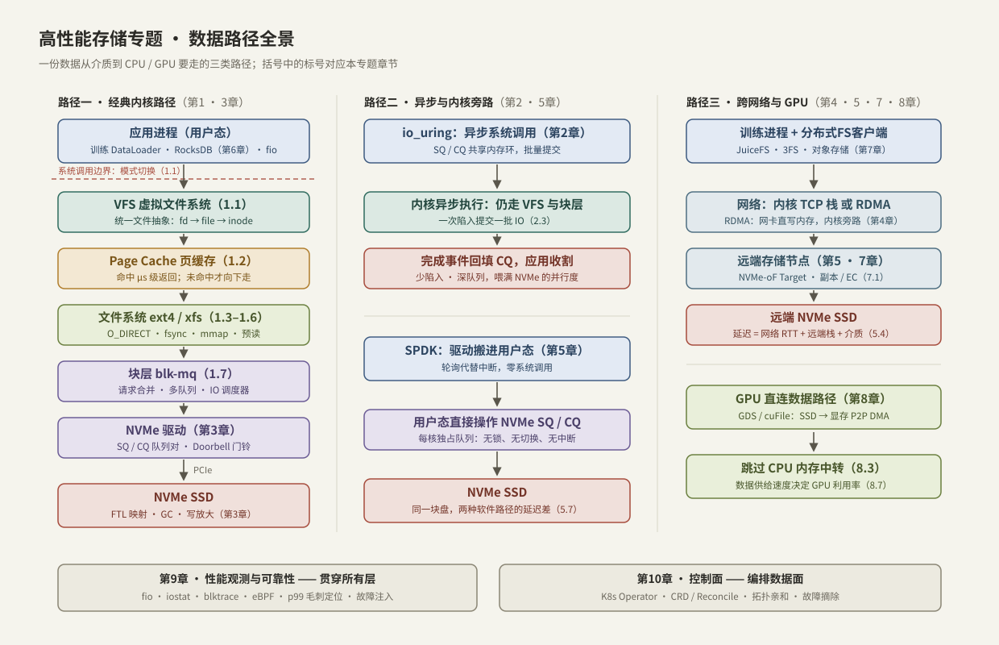

---
tags:
  - 高性能存储/总纲
---
# 高性能存储专题总纲

> 本专题回答一个问题：**一份数据从持久化介质到达计算单元（CPU / GPU），中间经过哪些层，每层花掉多少时间，哪里可以更快**。前置要求只有 C++ 多线程/多进程与基本 Linux 系统编程，不需要任何存储背景。

> [!note] 目录定位
> 这里是知识地图，不是每周待办。当前求职目标、项目上限和倒排节点见 [[00.当前执行 - C++ 到 AI Infra 存储]]；具体周任务见 [[00.存储方向阶段计划索引]]。学习时按当前主线选择章节，不需要顺序补齐本目录的全部笔记。

---

## 1. 为什么要学存储

- **问题**：GPU 是集群里最贵的资源，而训练与推理的瓶颈经常不在算力——数据集读取、checkpoint 落盘、KV Cache 换入换出，任何一环供不上数据，GPU 就在空转烧钱。
- **本质**：存储栈要调和的是**介质之间几个数量级的速度差**。整个软件栈（缓存、队列、预读、异步、旁路）都是围绕这条鸿沟设计的。

下面这张量级表是全专题的"坐标系"，后面每一章的设计取舍都可以用它解释（数字取常见数量级，具体硬件差异很大，**只用于对比，不用于精确计算**）：

| 操作 | 时间量级 | 相对直觉 |
| --- | --- | --- |
| L1 cache 访问 | ~1 ns | 眨眼 |
| DRAM 访问 | ~100 ns | 慢 100 倍 |
| 系统调用往返 | ~百 ns 到 1 μs | 与内存访问同级 |
| NVMe SSD 随机读 | ~10–100 μs | 比内存慢 2–3 个数量级 |
| 数据中心内网络 RTT | ~50–500 μs | 与 NVMe 同级——所以远端 NVMe 才可行 |
| HDD 寻道 | ~5–10 ms | 比 NVMe 又慢 2 个数量级 |

三个贯穿始终的指标：**延迟**（尤其 p99）、**吞吐**（带宽）、**IOPS**。四个通用的优化杠杆：

1. **减少拷贝**——每次内存拷贝都消耗 CPU 和内存带宽；
2. **减少切换**——系统调用、上下文切换、中断都有固定开销；
3. **加深队列**——现代 SSD 和网络靠并行喂饱，串行提交浪费设备能力；
4. **绕过慢层**——O_DIRECT 绕缓存、RDMA 绕内核协议栈、SPDK 绕整个内核、GDS 绕 CPU 内存。

---

## 2. 数据路径全景



三条路径分别对应三个阶段的学习目标：

- **路径一（经典内核路径）**：`read()` 陷入内核 → VFS 分发 → Page Cache 判命中 → 文件系统 → 块层排队 → NVMe 驱动 → SSD。这是理解一切的地基，第 0 章补硬件前提，第 1 章逐层拆解，第 3 章讲设备端。
- **路径二（异步与旁路）**：io_uring 把"每个 IO 一次系统调用"变成"一次陷入提交一批"（第 2 章）；SPDK 干脆把驱动搬进用户态，轮询代替中断（第 5 章）。**层还是那些层，省掉的是穿越层的固定开销**。
- **路径三（跨网络与 GPU）**：网络 RTT 与 NVMe 延迟同量级，于是存储可以放到远端（NVMe-oF、分布式文件系统，第 4/5/7 章）；GPU 侧则用 GDS 让数据绕过 CPU 内存直达显存（第 8 章）。

---

## 3. 章节地图

| 章 | 主题 | 回答的核心问题 | 状态 |
| --- | --- | --- | --- |
| 0 | 数据路径硬件基础 | Cache/TLB/DMA/PCIe/NUMA 与 Benchmark 方法 | 已完成 |
| 1 | Linux IO 路径 | 一次 read/write 到底经过什么？缓存何时命中、数据何时真正落盘？ | 已完成 |
| 2 | io_uring | 怎样把系统调用开销摊薄？异步 IO 与 epoll 的本质区别？ | 已完成 |
| 3 | NVMe 与 SSD | 设备端如何并行执行命令？SSD 为什么会"越用越慢"？ | 已完成 |
| 4 | RDMA 与 RoCE | 网卡如何绕过内核直接读写内存？无损网络靠什么保证？ | 已完成 |
| 5 | NVMe-oF 与 SPDK | 本地盘如何远端化？内核态与用户态路径差在哪？ | 已完成 |
| 6 | 存储引擎 | WAL/LSM 如何在"慢介质 + 会崩溃"的前提下保证不丢数据？ | 已完成 |
| 7 | 分布式存储 | 一致性/副本/故障后为何仍然正确？ | 已完成 |
| 8 | AI GPU 数据路径 | 数据怎样最快到达显存？KV Cache 分层与 GDS 回退 | 已完成 |
| 9 | 性能观测与可靠性 | 贯穿全程的工具与 p99/SLO/故障注入 | 已完成（贯穿使用） |
| 10 | 控制面（选修） | 编排、拓扑调度、故障摘除、自动 Benchmark | 已完成（选修，默认不排期） |

### 3.1 推荐学习顺序

```text
00 总纲
→ 0. 硬件与性能基础
→ 1. Linux I/O（含 fsync / Flush / 崩溃语义）
→ 3. NVMe 与 SSD
→ 2. io_uring
→ 5A. SPDK 本地路径
→ 4. RDMA / RoCE
→ 5B. NVMe-oF
→ 6. 存储引擎
→ 7. 分布式（先原理，再 3FS/Ceph/JuiceFS）
→ 8. AI GPU 数据路径
→ 9. 贯穿式性能与可靠性（从第 1 章起同步使用）
→ 10. 控制面（选修）
```

更细的入口（最小闭环）：[[0.7 性能指标 IOPS 带宽 延迟 P99]] → [[1.1 VFS 与系统调用路径]] → [[1.2 Page Cache 命中与未命中]] → [[1.3 Buffered IO 与 O_DIRECT]] → [[1.4 fsync fdatasync 与持久化语义]] → [[1.8 一次 read write 全路径图]]，然后用 [[9.1 fio Benchmark Matrix]] 亲手量一遍。

### 3.2 笔记状态约定

截至 2026-07-21，全部补缺笔记均已写完（`status: 已完成`）。本节约定仅在将来新增笔记时使用：

```yaml
---
tags:
  - 未写
  - 高性能存储
status: 未写
---
```

在 Obsidian 中可用标签 `未写` 或属性 `status: 未写` 筛选待写清单。写完后删掉 `未写` 标签并把 `status` 改为 `已完成`。

### 3.3 贯穿式工具表（不要等第 9 章）

| 学习阶段 | 同步使用的工具 |
| --- | --- |
| Linux I/O | strace、iostat、pidstat、drop_caches |
| io_uring | perf、火焰图、延迟分布 |
| NVMe | fio、nvme-cli、PCIe/NUMA 检查 |
| RDMA | ibv_devinfo、ib_write_bw、ib_send_lat |
| SPDK | spdk_perf、CPU 利用率、核绑定 |
| NVMe-oF | fio、网络计数器、P99 分解 |
| 存储引擎 | perf、iostat、WAL 延迟、Compaction Stall |
| AI 存储 | GPU 利用率、DataLoader 时间、吞吐和 TTFT |

---

## 4. 贯穿全专题的分析框架

拿到任何一个存储性能问题，按同一套动作分析：

1. **画路径**：这笔 IO 从发起到完成穿过哪些层？（用户态几层、内核几层、跨不跨网络、到不到介质）
2. **数拷贝**：数据被 CPU 搬运了几次？每次拷贝既花时间又占内存带宽。
3. **数切换**：几次系统调用、几次上下文切换、几次中断？这些是与数据量无关的固定成本，小 IO 时占比最高。
4. **看队列**：每一层都是"队列 + 调度"。吞吐、并发、延迟三者被利特尔法则锁死：`并发数 L = 吞吐 λ × 单次延迟 W`——延迟降不下去时，只能靠加深队列换吞吐（这正是 io_uring 与 NVMe 多队列的立足点）。
5. **分类陈述**：把每个结论标注为三类之一——
   - **【事实】** 协议或语义保证，如"write 返回不代表落盘"；
   - **【量级】** 硬件相关的数量级，如"NVMe 随机读几十微秒"；
   - **【取舍】** 实现选择，有代价有场景，如"用 O_DIRECT 换确定性，代价是放弃内核缓存"。

> [!tip] 学习方法
> 每章笔记都以"概念 → 边界 → 端到端路径 → 关键数据结构与状态 → 实践结论"的顺序组织。先能画出路径图，再谈优化。
>
> **每学完一个模块，至少留下**：一个可运行程序、一组对照实验、一份性能报告、一个故障案例。笔记只是输入，这四项才是求职资产。

---

## 5. 环境与写作约定

- **内核版本**：以 Linux 5.x/6.x 主线为准；依赖较新内核的概念（folio、io_uring 新特性、MGLRU 等）会标注引入版本。
- **代码风格**：Modern C++（C++17/20），RAII 管理 fd 与内存，错误用 `std::system_error` 族表达；不出现 `new/delete`、裸所有权指针与 C 风格转换。
- **术语**：首次出现给出中英对照，之后混用。常用对照：页缓存 Page Cache、脏页 dirty page、回写 writeback、预读 readahead、队列深度 queue depth (iodepth)、直接 IO Direct IO、内核旁路 kernel bypass。
- **数字**：所有性能数字默认是量级，写明"量级"或范围；精确值一律以自己机器上 fio/eBPF 实测为准。

---

## 6. 补缺清单索引（按章，均已完成，作导航用）

### 0. 数据路径硬件基础（已完成）

- [[0.1 CPU Cache Cache Line 与内存屏障]]
- [[0.2 虚拟内存 Page Table 与 TLB]]
- [[0.3 DMA IOMMU 与 Pinned Memory]]
- [[0.4 PCIe BAR MMIO 与 MSI-X]]
- [[0.5 NUMA CPU 亲和性与内存亲和性]]
- [[0.6 Interrupt Busy Polling 与 Context Switch]]
- [[0.7 性能指标 IOPS 带宽 延迟 P99]]
- [[0.8 Benchmark 基本方法]]
- [[0.9 CXL 与 DPU SmartNIC 认知速记]]（2026-07-21 新增，认知级）

### 1. Linux IO 路径（新增）

- [[1.9 ext4 XFS 日志模式基本原理]]
- [[1.10 文件数据 inode 与目录项持久化]]
- [[1.11 rename link unlink 崩溃语义]]
- [[1.12 Flush FUA Barrier 与设备易失缓存]]

### 2. io_uring（新增）

- [[2.7 SQPOLL 与 IOPOLL]]
- [[2.8 io-wq 与阻塞操作退化路径]]
- [[2.9 Linked Operations]]
- [[2.10 Timeout 与 Cancellation]]
- [[2.11 Multishot 与 Provided Buffer Ring]]
- [[2.12 内核版本功能边界]]

### 3. NVMe 与 SSD（新增）

- [[3.9 PRP 与 SGL]]
- [[3.10 Namespace]]
- [[3.11 NVMe Flush 与 FUA]]
- [[3.12 Interrupt 与 MSI-X]]
- [[3.13 Command Timeout 与 Controller Reset]]
- [[3.14 AER 异步事件]]
- [[3.15 TRIM Discard]]
- [[3.16 ZNS 选修]]

### 4. RDMA 与 RoCE（新增）

- [[4.11 RDMA CM 与连接建立]]
- [[4.12 rkey lkey 生命周期]]
- [[4.13 RDMA 操作顺序性]]
- [[4.14 Fence 与内存可见性]]
- [[4.15 Signaled Unsignaled WR]]
- [[4.16 Inline Batching 与 Doorbell 优化]]
- [[4.17 Retry RNR 与 Timeout]]
- [[4.18 多线程下 QP 使用模型]]
- [[4.19 RDMA 故障恢复与连接重建]]

### 5. NVMe-oF 与 SPDK（新增：本地 SPDK + Fabric 细节）

- [[5.9 SPDK 环境与 HugePage]]
- [[5.10 VFIO UIO 与设备绑定]]
- [[5.11 Reactor Thread 与 Poller]]
- [[5.12 无锁 thread-per-core 模型]]
- [[5.13 SPDK NVMe Driver]]
- [[5.14 JSON-RPC 控制方式]]
- [[5.15 自定义最小 bdev 模块]]
- [[5.16 Discovery Controller]]
- [[5.17 Subsystem 与 Namespace]]
- [[5.18 Queue 建立过程]]
- [[5.19 RDMA Transport 数据路径]]
- [[5.20 TCP Transport 数据路径]]
- [[5.21 Controller Loss Timeout]]
- [[5.22 网络故障与 Target 故障差异]]
- [[5.23 Target CPU NUMA NIC SSD 亲和性]]

### 6. 存储引擎（新增）

- [[6.11 MemTable Immutable 与 SST 生命周期]]
- [[6.12 Manifest 与 Version Set]]
- [[6.13 Bloom Filter 与 Block Cache]]
- [[6.14 Write Stall]]
- [[6.15 Snapshot 与 Sequence Number]]
- [[6.16 Rate Limiter 与后台任务隔离]]
- [[6.17 Recovery 路径]]
- [[6.18 WAL 回放幂等性]]

### 7. 分布式存储（新增：原理子模块）

- [[7.9 一致性模型]]
- [[7.10 Quorum 读写]]
- [[7.11 Primary-Backup 与 Multi-Raft]]
- [[7.12 Lease 与 Fencing]]
- [[7.13 幂等 重试 与请求去重]]
- [[7.14 Split Brain]]
- [[7.15 Membership 与故障检测]]
- [[7.16 数据放置与 Rebalance]]
- [[7.17 Recovery 与 Rebuild]]
- [[7.18 Backpressure 与过载保护]]
- [[7.19 副本落后与日志截断]]
- [[7.20 元数据服务高可用]]

### 8. AI GPU 数据路径（新增）

- [[8.10 Host Device Memory 与 Pinned Memory]]
- [[8.11 cudaMemcpy 与 CUDA Stream]]
- [[8.12 GPUDirect RDMA]]
- [[8.13 GDS 兼容性与回退路径]]
- [[8.14 分层缓存与 KV Cache 生命周期]]
- [[8.15 Prefix 淘汰 一致性 与故障恢复]]

### 9. 性能观测与可靠性（2026-07-21 新增）

- [[9.9 cgroup IO 隔离与多租户 QoS]]

---

## 关联知识

- [[1.1 VFS 与系统调用路径]] - 全专题的第一块软件地基
- [[0.7 性能指标 IOPS 带宽 延迟 P99]] - 全专题的指标体系
- [[4.1 打开、读取、写入、关闭]] - Linux 基础 IO API 的用法（本专题讲这些 API 之下发生的事）
