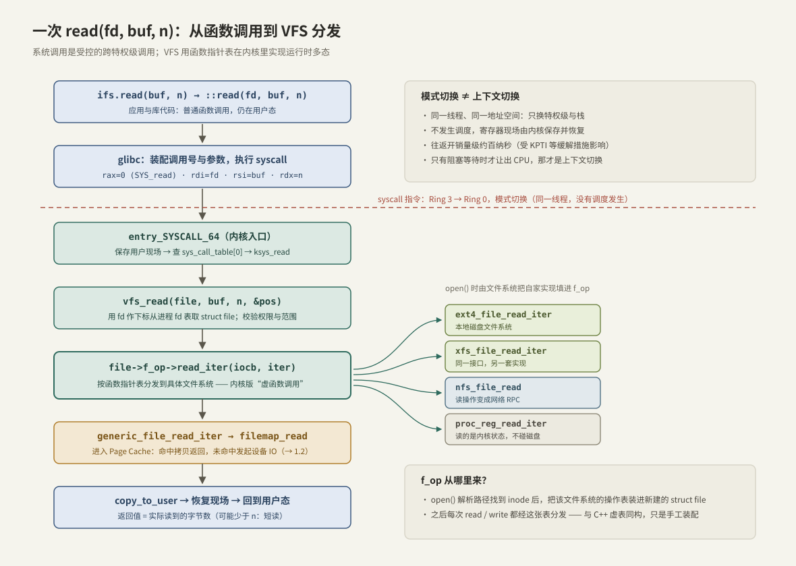
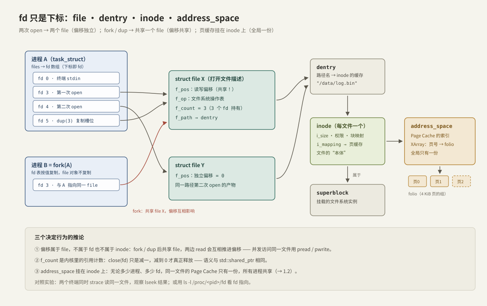
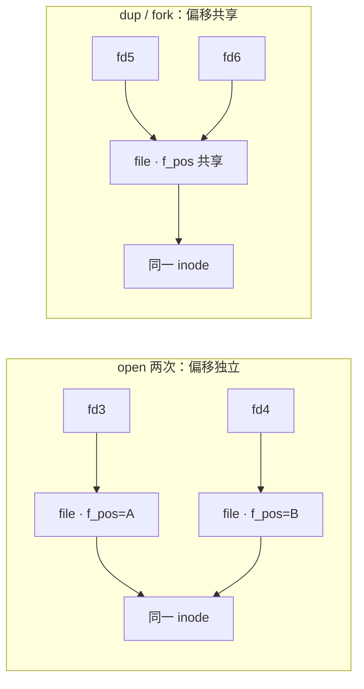

---
tags:
  - 高性能存储/Linux-IO路径
---
# VFS 与系统调用路径

> `read()` 不是普通函数调用：它跨越 CPU 特权级进入内核，由 VFS 这张"手写虚表"分发到具体文件系统。本篇讲清这条路径，以及路径上的四个核心对象——`file`、`dentry`、`inode`、`address_space`。

---

## 1. 从一行 C++ 说起

```cpp
std::ifstream in{"/data/log.bin", std::ios::binary};
in.read(buf.data(), static_cast<std::streamsize>(buf.size()));
```

这两行代码背后叠着三层身份完全不同的"调用"：

| 层 | 调用 | 运行位置 | 本质 |
| --- | --- | --- | --- |
| C++ 标准库 | `ifstream::read` | 用户态 | 普通函数调用 + 库内缓冲 |
| C 库 | glibc `read()` | 用户态 | 普通函数调用，负责装配系统调用 |
| 内核 | `sys_read` | 内核态 | **系统调用**：跨特权级的受控入口 |

搞清"哪一步还在自己进程里、哪一步进了内核"，是后面所有性能分析的前提。

---

## 2. 系统调用：受控的跨特权级调用

### 2.1 为什么必须有这道边界

**【事实】** 磁盘、网卡、内存映射表这些资源必须由内核统一仲裁，否则任何进程都能读写任意数据、破坏隔离。CPU 用特权级（x86-64 上用户态 Ring 3 / 内核态 Ring 0）强制这一点：用户态代码碰不到设备寄存器和内核内存，想要 IO，只能通过内核暴露的固定入口——系统调用。

### 2.2 机制：syscall 指令

**【实现】** x86-64 上，glibc 把系统调用号装入 `rax`（`read` 是 0），参数装入 `rdi/rsi/rdx` 等寄存器，然后执行 `syscall` 指令。CPU 切到 Ring 0，跳到内核注册好的入口 `entry_SYSCALL_64`，内核保存用户现场、按 `rax` 查 `sys_call_table` 分发。返回时恢复现场、切回 Ring 3。

### 2.3 模式切换 ≠ 上下文切换（最容易混的一点）

写多线程代码时熟悉的"上下文切换"是**换线程**：换寄存器组、可能换地址空间、走调度器。而系统调用只是**模式切换**：

- **同一个线程、同一个地址空间**，只是特权级和栈变了；
- 不经过调度器，没有别的线程插进来；
- **【量级】** 往返开销约百纳秒级（受 CPU 型号和 KPTI 等安全缓解措施影响，开启缓解后明显变贵）；
- 只有当这次系统调用**阻塞**（如读一个不在缓存里的页）时，内核才会让出 CPU——那一刻才发生真正的上下文切换。

**【取舍】** 这个固定开销解释了两条高性能路线的动机：io_uring 把一批 IO 摊进一次陷入（[[2.1 SQ CQ 模型]]），SPDK 干脆全在用户态轮询、把系统调用降为零。小 IO 越密集，这笔账越划算。

---

## 3. 一次 read() 的完整路径



按图逐步走一遍（函数名取自 Linux 5.x/6.x 主线，属**【实现】**细节，重要的是每步的职责）：

1. **glibc**：装配调用号与参数，执行 `syscall`；
2. **entry_SYSCALL_64**：保存用户现场，查表得到 `ksys_read`；
3. **`ksys_read` / `vfs_read`**：用 fd 作下标，从当前进程的 fd 表取出 `struct file`；校验它确实以可读方式打开、缓冲区范围合法；
4. **`file->f_op->read_iter(...)`**：按 `struct file` 里的**函数指针表**把调用分发给具体文件系统——ext4 走 `ext4_file_read_iter`，NFS 把读变成网络 RPC，procfs 现场生成内核状态文本；
5. **`generic_file_read_iter` → `filemap_read`**：磁盘文件系统通常委托给通用实现，进入 Page Cache 查页——命中与未命中的分岔见 [[1.2 Page Cache 命中与未命中]]；
6. **`copy_to_user`**：把数据从内核的缓存页拷贝到用户缓冲区，恢复现场返回。返回值是**实际读到的字节数，可能小于请求值**（短读，见第 7 节陷阱）。

---

## 4. VFS：内核里的运行时多态

### 4.1 动机

同一个 `read()` 要同时适配本地磁盘（ext4/xfs）、网络文件系统（NFS）、内存文件系统（tmpfs）、虚拟文件（procfs）……如果没有统一抽象，每个应用都要为每种文件系统写一套代码。VFS（Virtual File System）就是这层统一接口：**【事实】** 对上提供一致的文件语义，对下允许任意文件系统接入。

### 4.2 用 C++ 的眼睛看：这就是手写虚表

内核是 C 写的，没有 `virtual`，于是用"结构体 + 函数指针表"手工实现了同一件事：

```cpp
// 内核 file_operations 的 C++ 心智模型（示意，并非内核源码）
class FileOps {                    // ≈ struct file_operations
public:
    virtual ~FileOps() = default;
    virtual ssize_t read_iter(Kiocb& iocb, IovIter& iter) = 0;
    virtual ssize_t write_iter(Kiocb& iocb, IovIter& iter) = 0;
};

class Ext4FileOps final : public FileOps { /* ext4 的实现 */ };
class NfsFileOps  final : public FileOps { /* 读写变成网络 RPC */ };
```

**关键点**：

- `open()` 相当于工厂函数：路径解析找到 inode 后，**由文件系统把自家的操作表装进新建的 `struct file`**；
- 之后每次 `read/write` 都经 `f_op` 这张表分发——与 C++ 虚函数调用同构，只是绑定发生在 open 时、由代码手工完成；
- 一次间接跳转的代价与虚函数相同，相对设备 IO 完全可以忽略。

---

## 5. 四大核心对象与共享语义



| 对象 | 每"什么"一个 | 存什么 | 生命周期 |
| --- | --- | --- | --- |
| `struct file` | 每次 open 一个 | 读写偏移 `f_pos`、打开标志、`f_op` 操作表 | 引用计数 `f_count` 归零时释放 |
| `dentry` | 每个路径分量一个 | 路径名 → inode 的映射（dcache 缓存） | 内存紧张时可回收 |
| `inode` | 每个文件一个 | 大小、权限、块映射、`i_mapping` | 文件被引用期间驻留 |
| `superblock` | 每个挂载的文件系统一个 | 文件系统全局信息 | 挂载期间 |
| `address_space` | 每个 inode 一个 | Page Cache 索引（XArray：页号 → folio） | 随 inode |

### 5.1 三个决定行为的推论

结合已有的多进程经验，这张对象图直接推出三条**【事实】**：

1. **偏移属于 `file`，不属于 fd，更不属于文件本身。**
   同一路径 open 两次 → 两个 `file` → 两个独立偏移；`fork`/`dup` 复制的只是 fd 槽位 → 两个 fd 指向**同一个** `file` → 偏移共享，一边 read 会推进另一边。多进程/多线程并发访问同一文件时，用 `pread`/`pwrite`（带显式偏移，不碰 `f_pos`）避免竞态。



*左：两次 open 各有一份 `f_pos`；右：`dup`/`fork` 只复制 fd 槽，共享同一 `struct file`。*

2. **`f_count` 是内核里的引用计数，语义与 `std::shared_ptr` 相同。**
   `close(fd)` 只是减一；进程退出、`dup`、`fork` 都会增减它。真正的释放动作发生在计数归零那一刻。
3. **Page Cache 挂在 inode 上，不挂在 file 上。**
   无论多少进程、多少 fd 打开同一文件，缓存只有一份，所有人共享——这是 [[1.2 Page Cache 命中与未命中]] 的前提，也解释了"进程 A 读过的文件，进程 B 第一次读也是热的"。

### 5.2 路径解析与 dcache

`open("/data/logs/app.log")` 需要逐分量解析：查 `/`、查 `data`、查 `logs`……每一步都可能是一次磁盘上的目录读取。**【实现】** 内核用 dentry cache（dcache）缓存"路径分量 → inode"的映射，热路径上解析纯走内存；主线内核还实现了 RCU-walk（无锁快速路径），让并发路径解析几乎不加锁。对我们的可见后果：**open 深路径比浅路径贵、首次比再次贵**——这也是"打开一次、fd 长期持有"这种服务端惯例的依据之一。

### 5.3 多线程注意：O_CLOEXEC

**【事实】** fd 表是进程级共享资源。多线程程序里若一个线程正在 `fork`+`exec`，另一个线程刚 `open` 的 fd 会被子进程原样继承，造成 fd 泄漏到外部程序。习惯性写 `O_CLOEXEC`（open 与 exec 之间无竞态窗口的原子方案），而不是事后 `fcntl` 补设。

---

## 6. Modern C++：RAII 管理 fd

fd 是典型的"裸资源"：忘记 close 会泄漏，异常路径尤其容易漏。处理方式与内存完全一致——RAII 包一层，所有权移动、不可复制：

```cpp
#include <fcntl.h>
#include <unistd.h>

#include <cerrno>
#include <span>
#include <system_error>
#include <utility>

// 构造即持有，析构即 close —— 与 std::unique_ptr 同一思路
class UniqueFd {
public:
    UniqueFd() = default;
    explicit UniqueFd(int fd) noexcept : fd_{fd} {}

    UniqueFd(const UniqueFd&) = delete;              // fd 所有权不可复制
    UniqueFd& operator=(const UniqueFd&) = delete;

    UniqueFd(UniqueFd&& other) noexcept : fd_{std::exchange(other.fd_, -1)} {}
    UniqueFd& operator=(UniqueFd&& other) noexcept {
        if (this != &other) {
            reset();
            fd_ = std::exchange(other.fd_, -1);
        }
        return *this;
    }
    ~UniqueFd() { reset(); }

    int get() const noexcept { return fd_; }
    explicit operator bool() const noexcept { return fd_ >= 0; }

    void reset() noexcept {
        if (fd_ >= 0) {
            ::close(fd_);        // 析构路径必须 noexcept，失败也不抛
            fd_ = -1;
        }
    }

private:
    int fd_ = -1;
};

UniqueFd open_file(const char* path) {
    int fd = ::open(path, O_RDONLY | O_CLOEXEC);
    if (fd < 0) {
        throw std::system_error{errno, std::generic_category(), path};
    }
    return UniqueFd{fd};
}
```

**设计要点**：

- 移动构造用 `std::exchange` 把源对象置回 `-1`，防止双重 close；
- `close` 放在 `noexcept` 的 `reset()` 里：析构函数不能抛异常，这与 `unique_ptr` 的删除器约束一致；
- 打开失败立刻抛 `std::system_error`，把 `errno` 语义化，调用方不再需要检查返回值。

`read` 本身还有两个必须处理的语义，封装成循环：

```cpp
// read 可能被信号打断（EINTR）、可能短读：必须循环收满
std::size_t read_exact(const UniqueFd& fd, std::span<std::byte> buf) {
    std::size_t total = 0;
    while (total < buf.size()) {
        const ssize_t n = ::read(fd.get(), buf.data() + total, buf.size() - total);
        if (n < 0) {
            if (errno == EINTR) continue;    // 被信号打断：数据没丢，重试即可
            throw std::system_error{errno, std::generic_category(), "read"};
        }
        if (n == 0) break;                   // EOF：文件真的到头了
        total += static_cast<std::size_t>(n);
    }
    return total;
}
```

**关键点**：`n < 0` 且 `errno == EINTR` 是"没读成"，`n == 0` 是"没得读"（EOF），`0 < n < 请求量` 是"读了一部分"——三种情况语义完全不同，混为一谈是文件 IO 最常见的 bug 来源。

---

## 7. 观察与验证

```bash
# 看每个系统调用的耗时（-T），只跟踪打开与读取
strace -T -e trace=openat,read ./a.out

# 看进程打开的 fd 都指向什么
ls -l /proc/<pid>/fd

# dcache 是真实存在的内存对象
sudo grep dentry /proc/slabinfo
```

`strace -T` 的输出直接印证本篇的两个论断：命中缓存的 `read` 耗时微秒级，而第一次读大文件的 `read` 耗时会跳到几十微秒以上——这条分界线就是下一篇的主题。

---

## 8. 陷阱与误区

> [!warning] 常见错误
> 1. **假设 read 一定读满**：网络 fd、管道、信号打断都会短读，磁盘文件在 EOF 附近也会。永远按 `read_exact` 的方式循环。
> 2. **把系统调用当成上下文切换**："这个函数陷入内核了，所以线程被切走了"——错。不阻塞就不切换。
> 3. **以为 close(fd) 就释放了文件**：`f_count` 未归零（dup、fork、别的线程还持有）时文件依旧打开；被删除但仍被打开的文件，磁盘空间也不会释放（`df` 与 `du` 对不上的经典原因）。
> 4. **在多线程里共享 `f_pos`**：两个线程用同一 fd 裸 `read`，偏移互相踩踏。用 `pread/pwrite`。
> 5. **errno 不是全局变量**：**【事实】** 它是线程局部的，多线程下各自独立，但同一线程内会被后续调用覆盖——先保存再处理。

---

## 9. 关键结论

| 结论 | 性质 |
| --- | --- |
| 系统调用是模式切换：同线程、同地址空间，不阻塞就不发生调度 | 事实 |
| 系统调用往返 ~百 ns 级；小 IO 密集时固定开销占大头 | 量级 |
| VFS = 统一文件抽象 + f_op 函数指针分发，与 C++ 虚表同构 | 事实 / 实现 |
| 偏移属于 `struct file`：两次 open 独立，fork/dup 共享 | 事实 |
| Page Cache 挂在 inode 上，跨进程共享同一份 | 事实 |
| 并发读写同一文件用 `pread/pwrite`；open 一律带 `O_CLOEXEC` | 实践结论 |
| fd 用 RAII 封装，移动语义表达所有权转移 | 实践结论 |

---

## 关联知识

- [[1.2 Page Cache 命中与未命中]] - read 进入 `filemap_read` 之后的分岔，本篇的直接下游
- [[1.8 一次 read write 全路径图]] - 把本篇路径延伸到块层与设备的全图
- [[4.1 打开、读取、写入、关闭]] - open/read/write API 层面的基础用法
