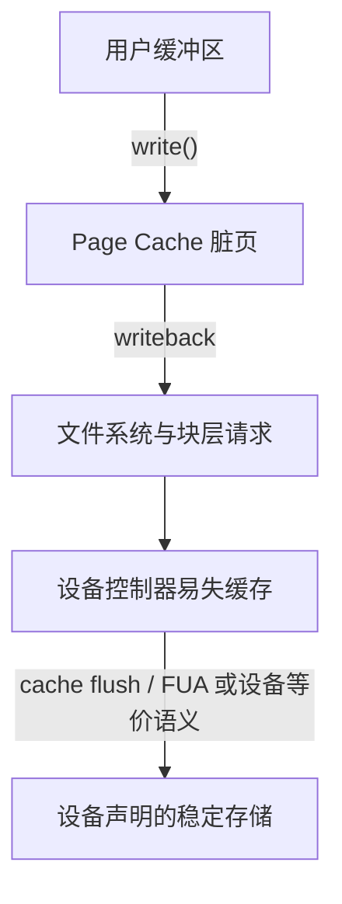
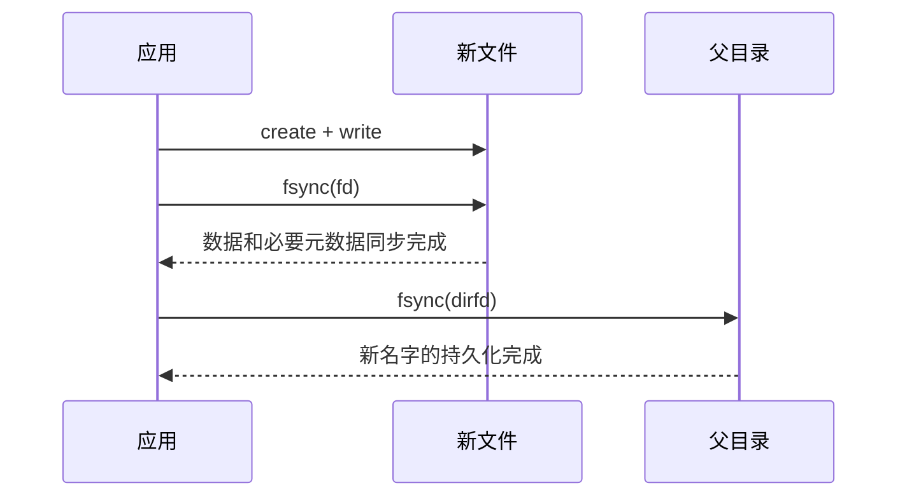

---
tags:
  - 高性能存储
  - Linux-IO路径
status: 已完成
---

# 文件数据、inode 与目录项的持久化关系

> [!abstract] 本文要回答的问题
> `write()` 返回后，文件内容、文件大小和文件名可能处于三个不同的持久化阶段。要让一次“写临时文件并替换旧文件”经得住断电，通常需要依次同步临时文件、执行 `rename()`，再同步父目录。

## 先建立对象模型

假设程序打开 `/var/lib/app/config.json`。路径中的每一级名字都由目录解释，最终得到一个 inode，再由 inode 找到文件数据：


这里有四个容易混淆的名词：

- **文件数据**：应用写入的字节，例如 JSON 文本。文件系统把它们放在一个或多个逻辑块中；很多文件系统用 extent 描述一段连续块区间。
- **inode**：文件系统中的对象记录。它保存文件类型、权限、属主、链接计数、大小、时间戳，以及定位数据所需的信息。文件名通常不在 inode 中。
- **磁盘目录项**（directory entry，常简称 dirent）：父目录里的“名字到 inode 号”的映射。`config.json → 12345` 就是一条目录项。目录本身也是一种文件，其内容由文件系统按目录格式组织。
- **VFS dentry**：Linux 内核为了加速路径查找而维护的内存对象。它缓存名字、父 dentry 和 inode 的关系。dentry 可能是“负 dentry”，表示内核最近查过这个名字，但它不存在。

> [!warning] dentry 不等于磁盘目录项
> dentry 主要是 VFS 的内存缓存对象，不是应用需要单独“刷盘”的磁盘结构。应用对目录调用 `fsync()`，目的是要求文件系统持久化该目录的命名空间修改，例如创建、删除和重命名。具体的磁盘格式由 ext4、XFS、Btrfs 或网络文件系统决定。

同一个 inode 可以有多个目录项，这就是硬链接。反过来，只有 inode 而没有任何持久化目录项时，系统重启后通常无法再通过路径找到它。一个已打开的文件即使被 `unlink()`，进程仍可通过原文件描述符访问；内核会等链接计数和打开引用都消失后再回收对象。

## 一次 write 修改了哪些状态

普通 buffered I/O 的 `write(fd, buffer, size)` 通常先把数据复制到 Page Cache，然后返回。此时可能同时出现三类脏状态：

| 对象 | 典型修改 | 为什么会脏 |
|---|---|---|
| Page Cache 中的数据页 | 新写入的文件字节 | 数据还只在内存，等待 writeback |
| inode 元数据 | `st_size`、`st_mtime`、`st_ctime`、extent 映射 | 文件变长、内容改变或新块被分配 |
| 父目录内容和元数据 | 新目录项、删除目录项、目录时间戳 | `create`、`link`、`unlink`、`rename` 改变名字集合 |

`write()` 成功只说明内核接收了这些字节，不等于设备已经持久化。后台 writeback 会在内存压力、脏页达到阈值或定时回写时提交一部分内容，但应用不能把后台回写时机当作事务提交点。

从应用到介质的路径可以粗略写成：



`fsync()` 的职责不只是启动回写。对于能正确报告完成状态的本地存储栈，它还要等待相关 I/O 完成，并在需要时处理设备易失写缓存。设备、驱动或虚拟化层如果谎报持久化完成，应用层再正确的调用顺序也无法补救。硬件层的 Flush、FUA 和 Barrier 见 [[1.12 Flush FUA Barrier 与设备易失缓存]]。

## fsync、fdatasync 和目录 fsync

### fsync 文件

`fsync(file_fd)` 要求同步该文件的脏数据和关联元数据。关联元数据包括读取这些数据所需的 inode 状态，例如文件大小和块映射。

它有一个边界：同步文件描述符指向的文件，不必然同步父目录中的名字。Linux `fsync(2)` 手册明确说明，要保证包含该文件的目录项到达持久存储，还需要对父目录文件描述符调用 `fsync()`。

因此，新建文件后只执行下面两步并不构成完整的命名持久化协议：

```text
open("report.bin", O_CREAT | O_WRONLY, 0644)
fsync(file_fd)
```

断电恢复后，数据和 inode 可能已经存在，但 `report.bin` 这个名字仍可能缺失。某些本地日志文件系统会因为事务耦合而顺带提交父目录修改，但这是具体实现产生的更强结果，不应替代显式的目录 `fsync()`。

### fdatasync 文件

`fdatasync(file_fd)` 同步文件数据，以及再次读取这些数据所必需的元数据。例如文件从 4 KiB 扩展到 8 KiB，新的 `st_size` 必须一起持久化；否则后 4 KiB 即使写到设备，重启后也无法通过正常读取取得。

仅用于展示或统计的元数据可以不在这次同步范围内，例如某些时间戳变化。这个区别是接口语义，实际文件系统可能因为日志事务粒度而写出更多元数据。不要据此假定 `fdatasync()` 每次都比 `fsync()` 少一次设备写入，性能差异要在目标文件系统和挂载参数上测量。

### fsync 目录

目录文件描述符可以这样取得：

```cpp
const int dir_fd = ::open("/var/lib/app", O_RDONLY | O_DIRECTORY | O_CLOEXEC);
```

`fsync(dir_fd)` 用来建立命名空间的持久化点。常见对应关系如下：

| 操作 | 需要持久化的对象 | 常用同步动作 |
|---|---|---|
| 创建并写入新文件 | 文件数据、inode、父目录中的新名字 | `fsync(file_fd)`，再 `fsync(parent_dir_fd)` |
| 修改已有文件内容 | 文件数据和 inode | `fsync(file_fd)` 或按语义选 `fdatasync(file_fd)` |
| 删除名字 | 父目录项、inode 链接计数等元数据 | `unlink()`，再 `fsync(parent_dir_fd)` |
| 同目录重命名 | 该目录中的旧名字和新名字 | `rename()`，再 `fsync(parent_dir_fd)` |
| 跨目录重命名 | 源目录删除、目标目录新增 | `rename()`，再同步源、目标两个目录 |

表中是面向 Linux 常见文件系统的保守应用协议。远程文件系统、叠加文件系统和 FUSE 文件系统可能不支持目录 `fsync()`，也可能返回 `EINVAL` 或具有不同的服务器端保证。可靠程序应该检查错误，不能把失败当作成功。

## 创建、删除和重命名的崩溃边界

### 创建文件

创建一个非空文件至少涉及 inode 分配、目录项插入、数据写入和块映射更新。文件系统会用锁和日志事务维护运行时及恢复后的内部一致性，但“文件系统结构没有损坏”不代表“这个文件已经按应用意图提交”。

可靠顺序是：



如果业务允许恢复后文件不存在，只要求“只要文件存在，内容就完整”，文件 `fsync()` 仍然有意义。它先把内容固定下来，再让目录项进入持久化点，避免名字已经可恢复而内容仍是未完成状态。

### unlink 删除名字

`unlink("a.log")` 删除的是父目录中的名字，并减少目标 inode 的链接计数。它不等于立刻擦除数据块：

1. 若还有其他硬链接，inode 仍可通过那些名字访问。
2. 若进程仍持有打开的文件描述符，数据仍可通过该描述符访问。
3. 只有链接和打开引用都结束后，文件系统才具备回收 inode 与数据块的条件。

若“重启后这个名字必须不存在”属于提交条件，应在 `unlink()` 成功后同步父目录。安全要求中的“删除”还可能意味着介质上的旧数据不可恢复，这属于加密擦除、TRIM 和设备数据残留问题，不是 `unlink()` 或目录 `fsync()` 的保证。

### rename 原子可见性与持久化

在同一挂载文件系统内，`rename(old, new)` 对并发路径查找提供原子名称切换：当 `new` 已存在时，观察者不会看到一个 `new` 暂时不存在的中间时刻。但是，原子可见性描述的是运行中并发观察结果；持久化描述的是断电恢复结果，两者不是同一个保证。

典型的配置文件替换协议是：

1. 在目标文件的同一目录创建临时文件。
2. 写入完整新内容。
3. `fsync()` 临时文件。
4. `rename()` 临时名字到目标名字。
5. `fsync()` 父目录。

临时文件放在同一目录，可以避免跨文件系统 `rename()` 的 `EXDEV` 错误，并让替换只涉及一个父目录。协议保证的是文件级替换，不会自动把数据库中多个文件组合成一笔原子事务。

## 日志文件系统提供什么

ext4 和 XFS 都使用日志保护元数据更新，但日志的首要目标是让崩溃恢复后文件系统结构保持可解释，而不是替应用猜测提交点。

- ext4 默认的 `data=ordered` 模式记录元数据日志，并要求相关新数据块先于那批元数据提交。它缩小了“新元数据指向未初始化数据”的窗口，但应用仍需 `fsync()` 表达持久化边界。
- ext4 的 `data=writeback` 不提供上述数据先于元数据的排序；恢复后，近期修改文件的可见区域可能含旧内容。
- ext4 的 `data=journal` 把数据和元数据都经过日志，写放大和日志带宽成本更高。它仍不意味着每次 `write()` 返回就是一次持久化提交。
- XFS 使用 Write Ahead Logging 保护元数据事务，并在 `fsync()` 等同步点强制相关日志状态到稳定存储。其内部事务、延迟日志和提交批次是实现细节，不能替代用户空间协议。

> [!note] 事实、前提与取舍
> **事实**：`fsync(file_fd)` 与 `fsync(parent_dir_fd)`覆盖的对象不同。  
> **前提**：文件系统、块层和设备正确实现并报告同步语义。  
> **取舍**：每次更新都同步目录会增加日志提交和设备 flush 次数；批量提交能摊薄成本，但会扩大掉电时可能丢失的更新窗口。

更细的 ext4/XFS 日志机制见 [[1.9 ext4 XFS 日志模式基本原理]]，系统调用差异见 [[1.4 fsync fdatasync 与持久化语义]]。

## 网络文件系统多了一段协议

在 NFS 一类远程文件系统中，Page Cache 后面不是本机块设备，而是客户端通过网络向服务器发送 WRITE、COMMIT 或协议中的等价请求：


这里要分别考虑客户端崩溃、网络中断、服务器崩溃和服务器存储掉电。应用调用 `fsync()` 时，客户端需要把相关修改推进到服务器所承诺的稳定状态；最终保证还受协议版本、客户端实现、服务器导出选项和服务器存储栈约束。例如，NFS 服务端的 `async` 导出选项允许服务器在修改进入稳定存储前回复，能降低延迟，但服务器非正常重启时可能丢失或破坏近期数据。

因此，不要把本地 ext4 上测得的崩溃结果直接套到 NFS、CephFS、SMB 或对象存储网关。先确认目标系统对文件 `fsync()`、目录 `fsync()`、原子 `rename()` 和服务器掉电的书面保证，再做端到端故障注入。

## Modern C++：原子替换一个文件

下面的 Linux 示例把文件描述符和临时文件清理都交给 RAII。为突出持久化顺序，示例固定使用一个临时名字，因此约定同一目录只有一个写者；多写者程序应使用随机且独占的临时名。

```cpp
#include <cerrno>
#include <cstddef>
#include <fcntl.h>
#include <stdexcept>
#include <string>
#include <string_view>
#include <system_error>
#include <unistd.h>

class UniqueFd {
public:
    explicit UniqueFd(int fd = -1) noexcept : fd_(fd) {}
    ~UniqueFd() { if (fd_ >= 0) ::close(fd_); }

    UniqueFd(const UniqueFd&) = delete;
    UniqueFd& operator=(const UniqueFd&) = delete;

    UniqueFd(UniqueFd&& other) noexcept : fd_(other.release()) {}
    UniqueFd& operator=(UniqueFd&& other) noexcept {
        if (this != &other) {
            if (fd_ >= 0) ::close(fd_);
            fd_ = other.release();
        }
        return *this;
    }

    [[nodiscard]] int get() const noexcept { return fd_; }

private:
    int release() noexcept {
        const int old = fd_;
        fd_ = -1;
        return old;
    }

    int fd_;
};

[[noreturn]] void throw_errno(const char* operation) {
    throw std::system_error(errno, std::generic_category(), operation);
}

void write_all(int fd, std::string_view data) {
    std::size_t offset = 0;
    while (offset < data.size()) {
        const ssize_t written = ::write(fd, data.data() + offset,
                                        data.size() - offset);
        if (written > 0) {
            offset += static_cast<std::size_t>(written);
            continue;
        }
        if (written < 0 && errno == EINTR) {
            continue;
        }
        throw_errno("write");
    }
}

class PendingTemp {
public:
    PendingTemp(int dir_fd, const char* name) : dir_fd_(dir_fd), name_(name) {}
    ~PendingTemp() {
        if (armed_) {
            ::unlinkat(dir_fd_, name_, 0);
        }
    }
    void commit() noexcept { armed_ = false; }

private:
    int dir_fd_;
    const char* name_;
    bool armed_ = true;
};

void atomic_replace(const std::string& directory,
                    const char* target_name,
                    std::string_view content) {
    UniqueFd dir(::open(directory.c_str(),
                        O_RDONLY | O_DIRECTORY | O_CLOEXEC));
    if (dir.get() < 0) throw_errno("open directory");

    constexpr const char* temp_name = ".replace.tmp";
    UniqueFd temp(::openat(dir.get(), temp_name,
                           O_WRONLY | O_CREAT | O_EXCL | O_CLOEXEC,
                           0644));
    if (temp.get() < 0) throw_errno("openat temp file");
    PendingTemp cleanup(dir.get(), temp_name);

    write_all(temp.get(), content);
    if (::fsync(temp.get()) < 0) throw_errno("fsync temp file");

    if (::renameat(dir.get(), temp_name, dir.get(), target_name) < 0) {
        throw_errno("renameat");
    }
    cleanup.commit();

    if (::fsync(dir.get()) < 0) throw_errno("fsync parent directory");
}
```

代码没有把 `close()` 当成持久化操作。析构函数中的 `close()` 也没有抛异常，因为析构期间抛异常会破坏栈展开；需要提交保证的错误已经由显式 `fsync()` 报告。实际工程还应决定权限、属主、ACL、扩展属性是否需要从旧文件复制，并处理程序上次崩溃遗留的临时文件。

## 对照实验与故障案例

### 先验证系统调用顺序

编译示例程序后，用 `strace` 检查成功路径是否包含两个不同对象上的同步调用：

```bash
strace -ff -e trace=openat,write,fsync,renameat,unlinkat,close ./atomic_replace_demo
```

预期顺序是“临时文件 `fsync` → `renameat` → 父目录 `fsync`”。`strace` 只能验证程序发出了系统调用，不能证明设备真的遵守 flush 语义。

### 故障注入要控制变量

设计三组版本，每组循环写入带递增序号和校验和的内容：

| 组别 | 文件同步 | rename 后目录同步 | 观察目标 |
|---|---:|---:|---|
| A | 无 | 无 | 记录可能出现的旧内容、缺失或不完整结果 |
| B | 有 | 无 | 检查“内容已完整，但新名字未提交”的窗口 |
| C | 有 | 有 | 检查恢复结果是否只为旧完整版本或新完整版本 |

真正测试掉电语义，需要在可丢弃的虚拟机、专用测试盘或支持故障注入的块设备上切断存储，不要在有价值的数据盘上操作。`kill -9` 只杀进程，内核 Page Cache 和后台 writeback 仍然存活，所以它不能模拟主机掉电。测试前也不能调用 `sync`，否则变量被全局回写掩盖。

一个常见故障是把“写临时文件后 rename”当成完整协议：程序先写新配置，再直接 `rename()` 覆盖旧配置。正常运行时读者只看到完整的名称切换；断电时，如果临时文件的数据尚未稳定，而目录重命名已经被日志恢复，目标名字可能指向零长度、旧块内容或不完整的新内容，具体结果取决于文件系统、日志模式和已完成的 I/O。先同步临时文件，再重命名并同步目录，才能把内容顺序与名称提交顺序明确下来。

## 结论清单

- 文件名属于父目录；inode 通常不保存文件名。
- VFS dentry 是内存路径缓存，磁盘目录项才是需要通过目录同步保护的命名空间数据。
- `write()` 返回表示数据已交给内核，不表示已经进入稳定存储。
- `fsync(file_fd)` 保护文件数据和关联元数据，但不替代父目录 `fsync()`。
- `rename()` 的原子可见性不等于断电后的持久化。
- 日志保证文件系统可恢复到一致结构，不自动提供应用事务语义。
- 正确调用顺序仍依赖驱动、设备、虚拟化层或远程服务器兑现稳定存储承诺。

## 关联笔记

- [[1.1 VFS 与系统调用路径]]
- [[1.2 Page Cache 命中与未命中]]
- [[1.4 fsync fdatasync 与持久化语义]]
- [[1.9 ext4 XFS 日志模式基本原理]]
- [[1.11 rename link unlink 崩溃语义]]
- [[1.12 Flush FUA Barrier 与设备易失缓存]]

## 参考资料

- [fsync(2), Linux man-pages](https://man7.org/linux/man-pages/man2/fsync.2.html)
- [rename(2), Linux man-pages](https://man7.org/linux/man-pages/man2/renameat.2.html)
- [Pathname lookup, Linux kernel documentation](https://docs.kernel.org/filesystems/path-lookup.html)
- [Overview of the Linux Virtual File System](https://docs.kernel.org/filesystems/vfs.html)
- [ext4 journal (jbd2), Linux kernel documentation](https://docs.kernel.org/filesystems/ext4/journal.html)
- [XFS Logging Design, Linux kernel documentation](https://docs.kernel.org/filesystems/xfs/xfs-delayed-logging-design.html)
- [nfs(5), Linux man-pages](https://man7.org/linux/man-pages/man5/nfs.5.html)

