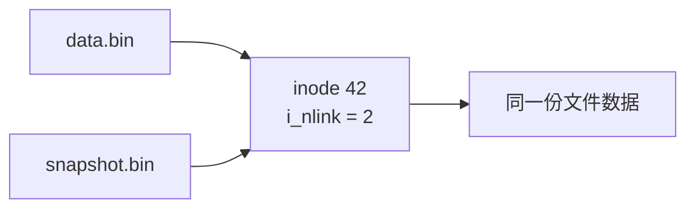
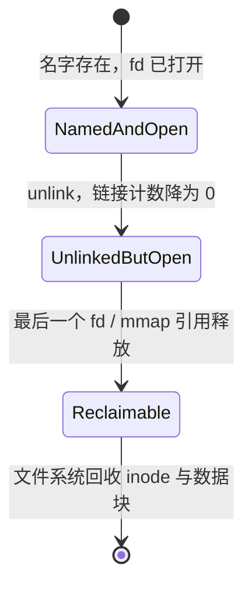
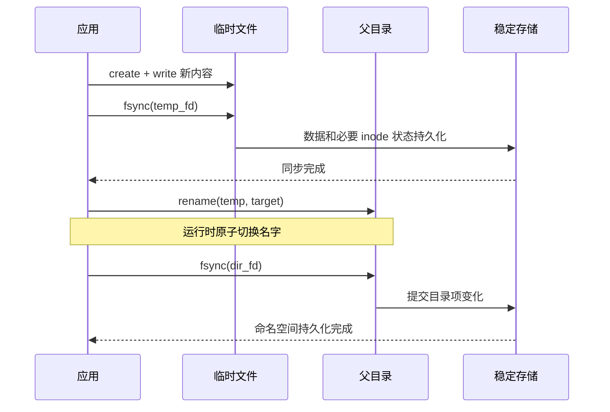

---
tags:
  - 高性能存储
  - Linux-IO
  - 文件系统
status: 已完成
---

# rename、link、unlink 的崩溃语义

> [!abstract] 本文要回答的问题
> `rename()`、`link()` 和 `unlink()`首先改变的是**文件名到 inode 的映射**，而不是文件数据本身。系统调用成功只说明命名空间修改已经在运行中的内核里生效；若要求断电重启后仍保留该结果，还要同步相应文件和父目录。经典的 `write → fsync(file) → rename → fsync(dir)`，本质是“先固定内容，再原子切换名字，最后提交名字”。

前置：[[1.1 VFS 与系统调用路径]]、[[1.4 fsync fdatasync 与持久化语义]]、[[1.10 文件数据 inode 与目录项持久化]]。

## 1. 先建立概念与讨论边界

### 1.1 文件名不是文件本体

打开 `/srv/app/config.json` 时，可以先把对象关系理解成：


核心名词如下：

| 名词 | 直白解释 | 与本文的关系 |
|---|---|---|
| **目录项**（directory entry，dirent） | 父目录中“名字 → inode 号”的记录 | `rename`、`link`、`unlink`直接修改它 |
| **inode** | 文件对象的元数据记录，通常不保存文件名 | 硬链接共享同一个 inode；其中有链接计数等状态 |
| **硬链接** | 另一个指向同一 inode 的目录项 | `link()`创建硬链接，不复制文件数据 |
| **链接计数**（link count） | 有多少个目录项指向该 inode | `link`通常加一，`unlink`通常减一 |
| **VFS dentry** | Linux 内核缓存路径分量及其 inode 关系的内存对象 | 它不是需要应用单独刷盘的磁盘目录项 |
| **文件描述符**（fd） | 进程引用一个已打开文件的整数句柄 | 名字被改掉或删掉后，已打开 fd 仍可引用原对象 |

例如，若 `a` 和 `b` 都是 inode 42 的硬链接：

```text
目录项 a ─┐
          ├──> inode 42 ───> 同一份文件数据
目录项 b ─┘
```

修改 `a` 的内容，也会通过 `b` 看到，因为它们不是两份文件。删除 `a` 只删除一个名字；只要 `b` 仍在，inode 42 就仍可通过路径访问。

> [!warning] 硬链接不是符号链接
> 硬链接直接指向同一个 inode；符号链接则是一个独立文件，其内容是一段待继续解析的路径字符串。本文的 `link()`讨论硬链接，不等同于 `symlink()`。

### 1.2 原子性、可见性与持久性是三件事

存储语义中最容易混淆的是下面三个问题：

| 属性 | 它回答的问题 | 典型例子 |
|---|---|---|
| **原子性**（atomicity） | 并发观察者会不会看到“做了一半”的中间状态？ | `rename(old, new)`替换 `new` 时，不会让 `new`经历一个必须可见的空窗期 |
| **可见性**（visibility） | 系统调用返回后，其他进程通过路径查找能看到什么？ | `rename()`返回后，新一次 `open(new)`按新命名空间查找 |
| **持久性**（durability） | 机器掉电重启后，这个结果还在不在？ | `rename()`后还需同步父目录，才能建立命名空间持久化点 |

`rename()`被称为“原子操作”，主要说的是**运行时命名空间切换**，不等于“调用返回后已经落盘”。

### 1.3 本文所说的“崩溃”分三层

| 故障 | 哪些状态还活着 | 能否检验掉电持久性 |
|---|---|---|
| 进程异常退出、`SIGKILL` | 内核、Page Cache、文件系统和设备仍运行 | **不能**；内核仍可能继续回写 |
| 内核 panic / 虚拟机硬复位 | 用户态和内核内存丢失，设备状态取决于故障方式 | 部分可以，需明确虚拟化和设备缓存行为 |
| 主机突然掉电 | DRAM 与无保护的设备易失缓存都可能丢失 | 才是典型的 crash-durability 测试 |

本文主要讨论 Linux 上本地、支持目录 `fsync()`的文件系统，并假设块层、驱动和设备诚实兑现 flush/FUA 语义。NFS、FUSE、OverlayFS 等系统可能提供不同保证，后文单独说明。

## 2. 三个系统调用到底改了什么

### 2.1 rename：移动或替换名字

```cpp
::rename("old", "new");
```

在同一挂载文件系统内，`rename()`把 `old` 这个名字移动到 `new`：

- 若 `new` 不存在，效果类似把目录项从旧位置移到新位置；
- 若 `new` 已存在，符合条件时会原子替换 `new`；
- 文件数据通常不搬家，改变的主要是目录项和相关 inode 元数据；
- 若源、目标跨越不同挂载文件系统，返回 `EXDEV`，应用必须改用“复制数据 + 同步 + 删除源”的非原子协议；
- 若 `old` 与 `new`本来就是同一 inode 的两个硬链接，调用可成功但不改变命名空间。

假设原状态是：

```text
config.json     ──> inode 10（旧内容）
.config.tmp     ──> inode 20（新内容）
```

执行同目录替换后：

```text
config.json     ──> inode 20（新内容）
.config.tmp     不存在
inode 10        链接计数减少；若仍被打开，暂不回收
```

> [!note] 运行时原子性的精确边界
> 当目标已存在时，并发路径查找不会被迫观察到“目标名字暂时不存在”。但这不是多对象事务，也不是数据库式快照隔离：已经打开旧文件的进程仍能继续读旧 inode；新的 `open()`可以得到新 inode；在竞争路径查找中也不应假定所有名字能被一次性拍成全局一致快照。

Linux 的 `renameat2()`还提供几个显式策略：

| 标志 | 语义 | 典型用途 |
|---|---|---|
| `RENAME_NOREPLACE` | 若目标已存在则失败，不覆盖 | 原子“仅当不存在时发布” |
| `RENAME_EXCHANGE` | 原子交换两个已有路径 | 双槽配置、版本切换 |
| `RENAME_WHITEOUT` | 配合联合/叠加文件系统创建 whiteout | OverlayFS 一类实现；不是普通应用的默认选择 |

这些标志是否受支持与内核、文件系统有关。它们改变运行时操作方式，**不取消目录 `fsync()`的持久化要求**。

### 2.2 link：给同一 inode 增加一个名字

```cpp
::link("data.bin", "snapshot.bin");
```

成功后，两个路径指向同一个 inode：



`link()`不复制数据，也不会产生独立快照。之后通过任一名字写文件，另一个名字都会观察到相同内容。

常见边界：

- 硬链接不能跨文件系统，否则返回 `EXDEV`；
- 普通用户通常不能为目录创建硬链接，以免破坏目录树约束；
- 目标名字必须不存在；若并发创建同名目标，只有一个调用能成功；
- inode 的最大链接数受文件系统限制，达到上限可返回 `EMLINK`；
- `linkat()`可以相对于目录 fd 操作，并能通过标志更精确地控制符号链接处理。

若希望“先在不可见状态写完，再一次性发布新文件”，Linux 的 `O_TMPFILE`可以创建一个尚无目录项的 inode，写完并同步后再通过 `linkat()`赋予名字。它适合“目标原本不存在”的发布；若要替换已有目标，通常还要先链接成临时名字，再执行 `rename()`。

### 2.3 unlink：删除名字，不等于立刻销毁文件

```cpp
::unlink("app.log");
```

`unlink()`删除父目录中的一个目录项，并减少 inode 的链接计数。它不承诺立即擦除数据块。



因此：

1. 如果还有其他硬链接，文件仍可通过其他名字打开；
2. 如果进程已经持有 fd，删除最后一个名字后仍能通过该 fd 读写；
3. 在 Linux 上，运行中的可执行文件或日志文件也可被替换/删除，旧引用继续指向旧 inode；
4. 只有链接计数为零且内核中的最后引用消失后，文件系统才具备回收对象的条件。

> [!warning] unlink 不是安全擦除
> 即使目录 `fsync()`后名字确定消失，旧数据仍可能残留在设备、快照、备份、SSD 的闪存转换层或远端副本中。安全删除属于加密擦除、密钥销毁、TRIM 和介质生命周期问题，不是 `unlink()`的语义。

## 3. 从系统调用到稳定存储的端到端路径

`rename`、`link`、`unlink`的调用路径可以抽象为：

![[图片/SVG/8_1_1_11_1.svg|900]]

各层职责不同：

| 层级 | 关键对象或动作 | 提供什么 | 不自动提供什么 |
|---|---|---|---|
| 用户态 | 路径、fd、调用顺序 | 表达应用希望的提交协议 | 不能直接控制磁盘事务 |
| VFS | `struct file`、dentry、inode、挂载信息 | 统一路径解析、权限与并发规则 | 不决定 ext4/XFS 的磁盘格式 |
| 具体文件系统 | 目录块、inode、extent、日志事务 | 维护文件系统内部一致性 | 不会自动猜出应用事务边界 |
| 块层与驱动 | bio/request、队列、完成通知 | 下发并等待 I/O | 无法修复设备谎报完成 |
| 设备 | 写缓存、FTL/介质 | 最终保存数据 | 无掉电保护的缓存仍可能丢失 |

### 3.1 关键内核数据结构

不需要记住所有字段，但要理解它们分别代表什么：

| 数据结构/状态 | 作用 | 操作影响 |
|---|---|---|
| `struct dentry` | 内存中的路径分量缓存，连接父目录、名字和 inode | rename/link/unlink 会更新或失效相关 dentry 状态 |
| `struct inode` | VFS 中的文件对象元数据 | 硬链接计数、时间戳等可能变化 |
| `struct file` | 一次打开产生的内核对象，即“打开文件描述” | 路径被删后仍可引用 inode |
| inode 的 `i_nlink` | VFS 所见的硬链接计数 | link 增加，unlink/覆盖旧目标时减少 |
| `address_space` / Page Cache | 文件数据的缓存与回写组织 | 临时文件写入先形成脏页 |
| 文件系统目录记录 | 磁盘上的名字到 inode 映射 | 三个调用都直接改变命名空间记录 |
| 文件系统日志事务 | 记录或组织元数据更新 | `fsync`可能需要等待相关事务提交 |

这些是概念层映射，不应把某个内存字段直接等同于磁盘上的固定字节布局。ext4、XFS、Btrfs 和远程文件系统的实现差异很大。

## 4. 三种操作的状态变化

### 4.1 rename 覆盖已有目标

初始状态：

| 名字 | inode | 链接计数示意 | 已打开引用 |
|---|---:|---:|---|
| `.tmp` | 20 | 1 | 写者持有 fd |
| `config` | 10 | 1 | 读者 R 已打开 |

`rename(".tmp", "config")`成功后：

| 对象 | 运行时状态 |
|---|---|
| `config` | 指向 inode 20 |
| `.tmp` | 不再存在 |
| inode 20 | 成为 `config`对应对象 |
| inode 10 | 链接计数降为 0，但读者 R 的 `struct file`仍引用它 |
| 读者 R | 继续读旧内容；不会被强制跳到新 inode |
| 新读者 | 重新 `open("config")`时取得 inode 20 |

这正是配置热更新常用 `rename()`而不是原地覆写的原因：旧读者可以完成旧版本读取，新读者得到完整的新版本。

### 4.2 link 增加名字

| 阶段 | `data` | `alias` | inode 链接计数 |
|---|---|---|---:|
| 调用前 | → inode 42 | 不存在 | 1 |
| `link()`成功后 | → inode 42 | → inode 42 | 2 |
| `unlink("data")`后 | 不存在 | → inode 42 | 1 |

注意，`alias`不是调用时内容的快照。若随后通过 `alias`写入，新旧名字所代表的仍是同一对象。

### 4.3 unlink 最后一个名字

| 条件 | `unlink()`后能否继续访问 | 何时可回收 |
|---|---|---|
| 还有硬链接 | 可通过其他路径访问 | 所有链接和打开引用都消失后 |
| 无硬链接，但仍有 fd | 可通过 fd 访问 | 最后一个 fd、映射等引用释放后 |
| 无硬链接，也无打开引用 | 无法再通过正常路径访问 | 文件系统可以回收，具体时机由实现决定 |

## 5. 崩溃窗口：系统调用成功不等于已提交

POSIX 的运行时接口语义不等于一份跨所有文件系统的掉电恢复状态表。若没有必要的同步调用，不能依赖“我在某次测试中总能看到新名字”。

### 5.1 经典原子替换协议

目标：更新 `config.json`，使重启后只能得到**旧完整版本**或**新完整版本**，不接受半截新内容。这里有一个必要前提：旧版本及其名字此前已经完成持久化提交；否则协议无法倒过来修复旧版本原本就不可靠的状态。



每一步解决不同问题：

| 步骤 | 建立的保证 | 省略后的风险 |
|---|---|---|
| 同目录创建临时文件 | 后续 `rename`不会因跨文件系统而 `EXDEV`；同目录只需同步一个父目录 | 临时文件在其他文件系统时不能原子 rename |
| 写完整内容 | 构造候选新版本 | 短写、错误未处理会主动发布残缺内容 |
| `fsync(temp_fd)` | 先固定新文件数据和关联元数据 | 名字可能恢复为新版本，但内容未稳定 |
| `rename(temp, target)` | 运行时原子替换路径 | 原地覆写会让并发读者看到更新中的内容 |
| `fsync(dir_fd)` | 持久化临时名删除、目标名替换等命名空间状态 | 掉电后的名字结果没有可移植保证，可能回到旧状态 |

> [!note] 为什么顺序不能倒过来
> 核心不变量是：**只有内容已经稳定，才允许把正式名字指向它。** `fsync(temp)`先建立内容持久化点，`rename`再发布，`fsync(dir)`最后建立名字持久化点。

### 5.2 各崩溃点的保守判断

以下结论假设本地文件系统正确实现同步语义，设备也诚实报告完成：

| 崩溃点 | 可以依赖什么 | 不能依赖什么 |
|---|---|---|
| 临时文件写完，但未 `fsync(temp)` | 运行时可通过临时 fd 读到 Page Cache 内容 | 重启后临时文件及其内容 |
| `fsync(temp)`成功，尚未 rename | 若 inode 可达，其内容已稳定 | 正式名字已更新；临时名字本身也未必持久 |
| rename 成功，尚未 `fsync(dir)` | 当前运行中的新路径查找看到新对象 | 重启后一定保持新命名空间 |
| `fsync(dir)`成功 | 正式名字的切换已建立持久化点 | 设备、虚拟化或远端服务器违约时仍无法保证 |

不能把未同步阶段写成一张“所有文件系统必然返回旧文件”的确定状态表：未建立持久化点时，恢复结果受文件系统日志、回写时序、挂载选项和已完成 I/O 影响。

### 5.3 link 的持久化协议

若源文件内容已经存在并且稳定，只想持久化增加一个硬链接：

```text
linkat(source, new_name)
fsync(new_parent_dir)
```

若新名字与源名字位于不同目录，`link()`只修改目标父目录的名字集合；保守协议至少同步新增目录项所在的目标父目录。若这一操作还和其他目录更新组合成业务协议，应分别同步所有被修改的目录，不要把单个目录 `fsync()`误当成跨目录事务。

若源文件也是刚创建并写入的，而且要求源名字与新名字在重启后都可靠存在，顺序应是：

```text
create + write source
fsync(source_fd)          # 先固定内容和必要 inode 状态
linkat(source, new_name)  # 再发布另一个名字
fsync(source_parent_dir)  # 固定刚创建的源名字
fsync(new_parent_dir)     # 固定新硬链接；同一目录时只需同步一次
```

如果协议只关心 `new_name`可靠存在，而不要求刚创建的源名字也保留，则只需同步实际承载所需最终名字的父目录。关键不是机械地“刷几个目录”，而是列出崩溃后必须保留的每个名字，并同步所有对应的父目录。

### 5.4 unlink 的持久化协议

若要求“重启后名字必须不存在”：

```text
unlinkat(parent_dir_fd, name, 0)
fsync(parent_dir_fd)
```

`unlink()`成功但目录尚未同步时，名字在当前运行系统中已经消失；掉电恢复后是否仍消失没有可移植保证。目录同步成功后，保证的是**命名空间删除已提交**，不是旧数据已从介质上擦净。

### 5.5 跨目录 rename

同一文件系统内可以把文件从目录 A 移到目录 B：

```text
renameat(dir_a, "old", dir_b, "new")
fsync(dir_a)
fsync(dir_b)
```

因为源目录删除一个名字，目标目录增加一个名字，所以两个目录都发生了持久化相关修改。应用应同步两者；若二者其实是同一目录，只需对该目录同步一次。

两个 `fsync()`不是应用层的原子双目录事务：第一个成功、第二个失败时，应用不能声称整个业务操作已经可靠提交。需要更强恢复语义时，应使用 WAL、清单文件或可重放状态机记录意图，见 [[6.1 WAL 与 Crash Consistency]]。

## 6. Modern C++：可靠替换一个文件

下面的 Linux 示例使用目录 fd 与 `*at()`系统调用，避免在多步操作中反复解析父路径；文件描述符和临时目录项都由 RAII 管理。接口约定 `target_name`是单个文件名，不包含 `/`。

```cpp
#include <atomic>
#include <cerrno>
#include <cstddef>
#include <fcntl.h>
#include <stdexcept>
#include <string>
#include <string_view>
#include <system_error>
#include <unistd.h>
#include <utility>

class UniqueFd {
public:
    explicit UniqueFd(int fd = -1) noexcept : fd_(fd) {}

    ~UniqueFd() {
        if (fd_ >= 0) {
            ::close(fd_);
        }
    }

    UniqueFd(const UniqueFd&) = delete;
    UniqueFd& operator=(const UniqueFd&) = delete;

    UniqueFd(UniqueFd&& other) noexcept : fd_(other.release()) {}

    UniqueFd& operator=(UniqueFd&& other) noexcept {
        if (this != &other) {
            if (fd_ >= 0) {
                ::close(fd_);
            }
            fd_ = other.release();
        }
        return *this;
    }

    [[nodiscard]] int get() const noexcept { return fd_; }

private:
    int release() noexcept {
        return std::exchange(fd_, -1);
    }

    int fd_;
};

[[noreturn]] void throw_errno(std::string_view operation) {
    throw std::system_error(errno, std::generic_category(),
                            std::string{operation});
}

void write_all(int fd, std::string_view content) {
    std::size_t offset = 0;

    while (offset < content.size()) {
        const ssize_t written = ::write(fd,
                                        content.data() + offset,
                                        content.size() - offset);
        if (written > 0) {
            offset += static_cast<std::size_t>(written);
            continue;
        }
        if (written < 0 && errno == EINTR) {
            continue;
        }
        if (written == 0) {
            errno = EIO;
        }
        throw_errno("write temporary file");
    }
}

struct TempFile {
    UniqueFd fd;
    std::string name;
};

TempFile create_temp_file(int dir_fd, std::string_view target_name) {
    static std::atomic<unsigned long long> sequence{0};

    for (int attempt = 0; attempt < 128; ++attempt) {
        const auto id = sequence.fetch_add(1, std::memory_order_relaxed);
        std::string name = "." + std::string{target_name} + ".tmp." +
                           std::to_string(static_cast<long long>(::getpid())) +
                           "." + std::to_string(id);

        const int raw_fd = ::openat(dir_fd, name.c_str(),
                                    O_WRONLY | O_CREAT | O_EXCL | O_CLOEXEC,
                                    0644);
        if (raw_fd >= 0) {
            return TempFile{UniqueFd{raw_fd}, std::move(name)};
        }
        if (errno != EEXIST) {
            throw_errno("openat temporary file");
        }
    }

    throw std::runtime_error("cannot allocate a unique temporary name");
}

class PendingName {
public:
    PendingName(int dir_fd, std::string name)
        : dir_fd_(dir_fd), name_(std::move(name)) {}

    ~PendingName() {
        if (armed_) {
            ::unlinkat(dir_fd_, name_.c_str(), 0);
        }
    }

    PendingName(const PendingName&) = delete;
    PendingName& operator=(const PendingName&) = delete;

    void disarm() noexcept { armed_ = false; }

private:
    int dir_fd_;
    std::string name_;
    bool armed_ = true;
};

void atomic_replace(const std::string& directory,
                    std::string_view target_name,
                    std::string_view content) {
    UniqueFd dir_fd{
        ::open(directory.c_str(), O_RDONLY | O_DIRECTORY | O_CLOEXEC)
    };
    if (dir_fd.get() < 0) {
        throw_errno("open parent directory");
    }

    TempFile temp = create_temp_file(dir_fd.get(), target_name);
    PendingName cleanup{dir_fd.get(), temp.name};

    write_all(temp.fd.get(), content);

    // 若还需设置权限、属主、ACL 或扩展属性，应在这一步之前完成。
    if (::fsync(temp.fd.get()) < 0) {
        throw_errno("fsync temporary file");
    }

    const std::string target{target_name};
    if (::renameat(dir_fd.get(), temp.name.c_str(),
                   dir_fd.get(), target.c_str()) < 0) {
        throw_errno("renameat temporary file");
    }
    cleanup.disarm();

    if (::fsync(dir_fd.get()) < 0) {
        // rename 已在运行时生效，但掉电持久性未知，不能安全地假装成功。
        throw_errno("fsync parent directory");
    }
}
```

代码中的关键点：

1. `O_EXCL`防止错误复用已有临时文件；多进程竞争时不会静默覆盖别人的临时对象。
2. `write_all()`处理短写与 `EINTR`，避免把“单次 `write`成功”误当成全部内容已写入。
3. `fsync(temp.fd)`发生在 `renameat()`之前，先建立内容持久化点。
4. `renameat()`的源和目标都相对于同一个目录 fd，因此不会跨文件系统。
5. `fsync(dir_fd)`提交名字切换。
6. 发生异常时，`PendingName`尽量删除临时名字；进程或主机突然崩溃时仍可能留下临时文件，因此启动恢复流程应识别并清理它们。
7. 文件保持打开并不妨碍 `rename()`；RAII 的目的主要是保证异常路径释放 fd，而不是要求 rename 前必须 close。

> [!warning] 替换会创建新 inode
> 上述模板不会自动继承旧目标的权限、属主、ACL、扩展属性、SELinux 标签或文件能力。若这些属性属于业务正确性，应在 `fsync(temp)`之前显式设置并检查结果。不要只复制内容就假定“整个文件完全相同”。

### 6.1 fsync 失败后的处理

若临时文件 `fsync()`失败，不能发布它；若 rename 后目录 `fsync()`失败，运行时命名空间已经变化，但掉电后状态未知。此时不能用“再调一次就算成功”掩盖第一次错误。

可靠程序通常应：

- 把同步失败上报为提交失败；
- 阻止上层确认事务成功；
- 根据业务选择停止写入、进入只读、进程退出或从 WAL/副本恢复；
- 保留足够日志，记录失败的是文件同步还是目录同步。

详细错误传播见 [[6.3 fsyncgate 与 EIO 处理]]。

## 7. O_TMPFILE：先创建无名 inode，再发布

Linux 的 `O_TMPFILE`允许在某个目录所属文件系统中创建一个没有目录项的临时 inode：

```text
openat(dir_fd, ".", O_TMPFILE | O_RDWR, mode)
write(tmp_fd, ...)
fsync(tmp_fd)
linkat(tmp_fd, "", dir_fd, "published", AT_EMPTY_PATH)
fsync(dir_fd)
```

它的优点是：

- 写入期间没有临时名字，其他进程无法靠目录扫描误读半成品；
- 进程在发布前退出时，关闭最后 fd 后对象会自动回收；
- 省去随机临时名和清理残留名的常见问题。

边界与取舍：

- 这是 Linux 特性，不是可移植 POSIX 接口；
- 文件系统必须支持 `O_TMPFILE`；
- 通过空路径执行 `linkat(..., AT_EMPTY_PATH)`是 Linux 特定用法：调用进程通常需要 `CAP_DAC_READ_SEARCH`；无该能力时，可在 `/proc`已挂载且该临时 inode允许链接的前提下，通过 `/proc/self/fd/<fd>`配合 `AT_SYMLINK_FOLLOW`发布。两条路径都应按目标内核、文件系统和安全策略实测；
- `linkat()`要求新名字不存在，不能直接覆盖已有目标；替换场景通常先链接成临时名字，再用 `rename()`覆盖目标；
- 发布后仍需 `fsync(dir_fd)`，无名创建并没有取消目录项持久化。

## 8. 文件系统、硬件与网络边界

### 8.1 日志文件系统不等于应用事务

ext4、XFS 等日志文件系统会组织元数据事务，使崩溃恢复后文件系统结构保持一致。例如它们要避免链接计数、目录项和 inode 分配状态变成无法解释的任意组合。

但“文件系统内部一致”不等于“应用最后一次更新已提交”：

- 日志可能恢复到应用操作之前的状态；
- 也可能已经包含部分未显式同步但被后台回写带出的更新；
- 应用不能把日志提交时机当成自己的提交点；
- ext4 的 `auto_da_alloc`等启发式可能缓解常见错误写法，但不应替代显式协议。

更细的日志与排序机制见 [[1.9 ext4 XFS 日志模式基本原理]]。

### 8.2 目录 fsync 是保守协议，但要检查支持情况

对 Linux 常见本地文件系统，文件 `fsync`加父目录 `fsync`是可靠更新的常用协议。但目录 `fsync()`在某些远程、叠加或用户态文件系统上可能：

- 返回 `EINVAL`或其他错误；
- 只同步到远端服务器的缓存；
- 依赖服务器配置才能进入稳定存储；
- 对 rename、硬链接或跨目录操作提供不同限制。

因此，生产系统应在实际部署的文件系统上验证能力，不能忽略目录同步错误。

### 8.3 NFS 等远程文件系统多了网络与服务器

远程路径比本地路径多出客户端协议栈、网络和服务器存储栈：


此时需要区分：

1. `rename`是否在服务器命名空间中原子；
2. 客户端何时把请求发给服务器；
3. `fsync`对应何种协议提交请求；
4. 服务器是在写入 DRAM 后应答，还是进入稳定存储后应答；
5. 服务器故障切换后，新节点是否能看到已确认状态。

网络 RTT 和副本确认还会增加同步延迟。不能把本地 ext4 上验证的结果直接推广到 NFS、CephFS、SMB、FUSE 或对象存储网关；应查阅目标系统的书面一致性与持久化保证，并做服务器掉电和网络分区测试。

### 8.4 最底层仍依赖设备兑现 flush

即使应用顺序完全正确，以下情况仍会破坏承诺：

- 存储设备谎报写入或 flush 已完成；
- RAID 控制器使用无掉电保护的写回缓存；
- 虚拟机管理器提前向客户机确认；
- 远端服务器以异步模式应答；
- 硬件或固件存在错误。

应用协议能明确“应该等待什么”，但不能让不诚实的下层凭空获得持久性。Flush、FUA 与设备缓存见 [[1.12 Flush FUA Barrier 与设备易失缓存]]。

## 9. 对照实验与故障注入

### 9.1 先用 strace 检查调用顺序

```bash
strace -ff -T \
  -e trace=openat,write,fsync,fdatasync,renameat,renameat2,linkat,unlinkat,close \
  ./atomic_replace_demo
```

原子替换的关键顺序应为：

```text
openat(temp) → write... → fsync(temp) → renameat(temp, target) → fsync(parent_dir)
```

`strace`只能证明程序发出了这些系统调用，并显示它们的返回值和耗时，不能证明设备真的遵守 flush 语义。

### 9.2 并发可见性实验

可以安排一个写进程反复生成带版本号和校验和的完整文件，再用 rename 替换；多个读进程循环执行 `open → read → verify`。

对照组：

| 组别 | 更新方式 | 预期观察 |
|---|---|---|
| A | 原地 `truncate + write` | 读者可能看到空文件、短内容或更新中的内容 |
| B | 临时文件写完后 rename，不做持久化测试 | 运行时读者应看到旧完整版本或新完整版本 |
| C | `fsync(temp) → rename → fsync(dir)`并做掉电测试 | 在前提成立时，恢复后应为旧完整版本或新完整版本 |

对每个版本写入校验和很重要：仅检查文件“存在”无法发现半写、旧数据混入或版本错配。

### 9.3 正确模拟崩溃

- `kill -9`只能模拟进程死亡，不能模拟主机掉电；
- 测试前调用 `sync`会把原本想观察的窗口刷掉；
- 应使用可丢弃虚拟机、故障注入块设备或专用测试盘；
- 分别在“文件 fsync 前后、rename 前后、目录 fsync 前后”触发故障；
- 每次恢复后记录目标文件、临时文件、inode、链接计数、内容版本和校验和；
- 对网络文件系统还应分别模拟客户端崩溃、网络中断、服务器崩溃和存储掉电。

## 10. 常见误区

> [!warning] 误区 1：rename 是原子的，所以不需要 fsync
> 原子性约束运行时观察；目录 `fsync`建立掉电后的命名空间持久化点。

> [!warning] 误区 2：fsync 新文件后，文件名也一定存在
> 文件 `fsync`主要同步文件数据和关联 inode 元数据。新名字属于父目录，还需同步父目录。

> [!warning] 误区 3：先 rename，再 fsync 新目标文件也完全等价
> 这会先把正式名字暴露给并发读者，再去固定内容，破坏“内容稳定后才发布”的清晰顺序。可靠模板应先同步临时文件。

> [!warning] 误区 4：link 相当于廉价快照
> 硬链接只是另一个名字，后续修改仍作用于同一 inode。需要不可变快照时，要依赖写时复制快照、版本文件或应用层不可变约束。

> [!warning] 误区 5：unlink 成功后文件数据已经消失
> 它只删除一个名字。其他硬链接、打开 fd、快照、备份和介质残留都可能继续保存数据。

> [!warning] 误区 6：跨文件系统 rename 失败后，复制再删仍然原子
> “复制 + fsync + unlink”包含多个可见步骤和多个崩溃窗口。若业务需要恢复，应记录状态并让操作可重试，而不是宣称它等价于 rename。

> [!warning] 误区 7：close 会自动提供持久性
> `close()`释放 fd，不隐含 `fsync()`。析构函数负责资源释放，提交保证仍必须由显式同步调用建立。

## 11. 实践决策表

| 需求 | 推荐协议 | 关键边界 |
|---|---|---|
| 修改已有文件内容，不换 inode | `write/pwrite → fsync(file)` | 并发读者可能看到原地更新过程 |
| 原子替换单个文件 | 同目录临时文件 → `fsync(temp)` → `rename` → `fsync(dir)` | 新 inode 的权限、ACL 等需显式处理 |
| 新建并可靠发布文件 | `create/write → fsync(file) → fsync(parent)` | 若要求“不覆盖”，用 `O_EXCL`或 `RENAME_NOREPLACE` |
| 为已有稳定文件增加硬链接 | `linkat → fsync(target_parent)` | 不是内容快照，不能跨文件系统 |
| 可靠删除一个名字 | `unlinkat → fsync(parent)` | 不等于安全擦除；其他引用仍可存活 |
| 跨目录 rename | `renameat → fsync(source_dir) → fsync(target_dir)` | 两次同步不是跨目录业务事务 |
| 跨文件系统移动 | 复制到目标临时文件 → 同步 → 目标 rename/目录同步 → 删除源/源目录同步 | 整体不原子，需要恢复状态机或 WAL |
| 多文件一起提交 | 清单文件、WAL、版本目录或应用事务协议 | 单次 rename 只能原子切换一个命名操作，不能自动提交任意多文件 |

## 12. 关键结论

1. 文件名属于父目录；inode 是文件对象，硬链接让多个名字共享同一 inode。
2. `rename()`原子切换运行时命名空间，但不自动保证断电后仍保留切换结果。
3. `link()`增加名字而不复制数据；`unlink()`删除名字而不一定立即销毁对象。
4. 已打开 fd 引用的是打开文件对象。路径被 rename 或 unlink 后，旧 fd 仍可继续访问原 inode。
5. `fsync(file)`和 `fsync(parent_dir)`保护的对象不同：前者固定内容与必要元数据，后者固定创建、删除、链接和重命名等名字变化。
6. 原子替换的核心顺序是：**先同步临时文件，再 rename，最后同步父目录**。
7. 跨目录 rename 要同步两个目录；跨文件系统没有等价的单次原子 rename。
8. 文件系统日志维护内部一致性，不会替应用猜测提交点；设备、虚拟化和远端服务器还必须兑现稳定存储承诺。
9. `SIGKILL`不是掉电测试。验证 crash consistency 必须控制崩溃层级，并用版本号与校验和检查恢复结果。
10. 多文件或跨文件系统事务需要 WAL、清单文件或可重放状态机，不能只靠一次 rename。

## 关联笔记

- [[1.1 VFS 与系统调用路径]]
- [[1.2 Page Cache 命中与未命中]]
- [[1.4 fsync fdatasync 与持久化语义]]
- [[1.9 ext4 XFS 日志模式基本原理]]
- [[1.10 文件数据 inode 与目录项持久化]]
- [[1.12 Flush FUA Barrier 与设备易失缓存]]
- [[6.1 WAL 与 Crash Consistency]]
- [[6.3 fsyncgate 与 EIO 处理]]

## 参考资料

- [rename(2), Linux man-pages](https://man7.org/linux/man-pages/man2/rename.2.html)
- [link(2), Linux man-pages](https://man7.org/linux/man-pages/man2/link.2.html)
- [unlink(2), Linux man-pages](https://man7.org/linux/man-pages/man2/unlink.2.html)
- [open(2), Linux man-pages：O_TMPFILE](https://man7.org/linux/man-pages/man2/open.2.html)
- [fsync(2), Linux man-pages](https://man7.org/linux/man-pages/man2/fsync.2.html)
- [Pathname lookup, Linux kernel documentation](https://docs.kernel.org/filesystems/path-lookup.html)
- [Overview of the Linux Virtual File System](https://docs.kernel.org/filesystems/vfs.html)
- [ext4 journal, Linux kernel documentation](https://docs.kernel.org/filesystems/ext4/journal.html)
- [XFS Logging Design, Linux kernel documentation](https://docs.kernel.org/filesystems/xfs/xfs-delayed-logging-design.html)
