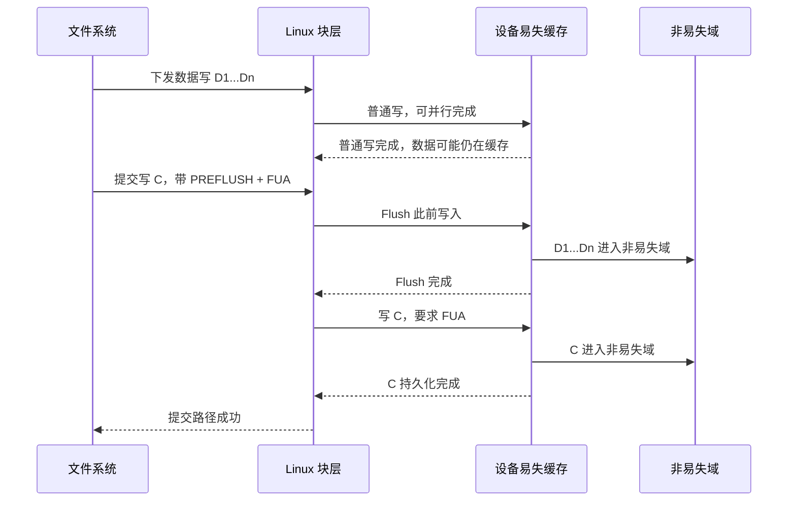
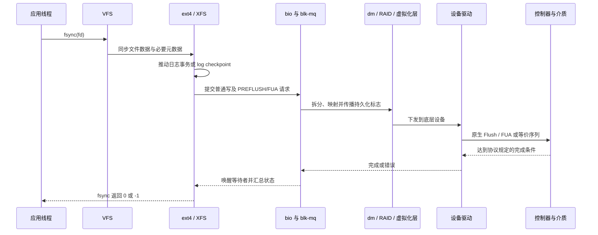
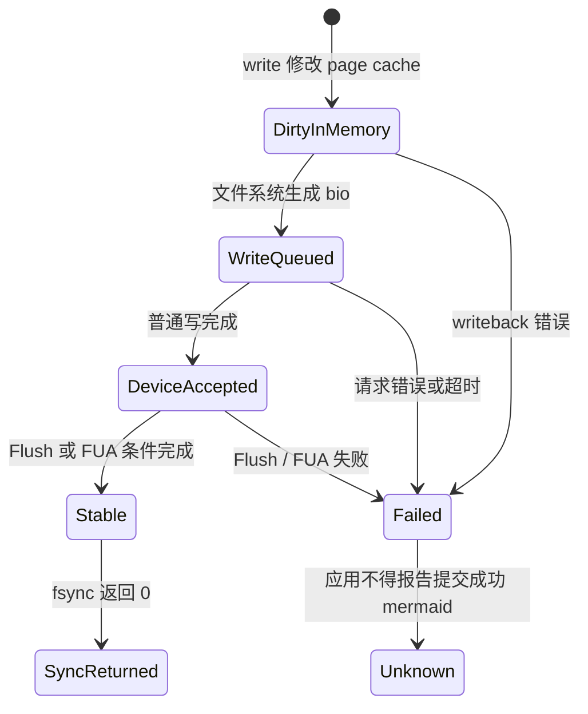

---
tags:
  - 高性能存储
  - Linux-IO路径
status: 已完成
---

# Flush、FUA、Barrier 与设备易失性缓存

> `write()` 完成只表示某一层接收了数据。只有文件系统、块层、驱动、控制器和设备都兑现同一套排序与持久化协议，`fsync()` 的成功返回才有断电后的意义。

前置：[[1.4 fsync fdatasync 与持久化语义]]（应用接口）、[[1.7 块层与 blk-mq]]（`bio` 与请求队列）、[[1.9 ext4 XFS 日志模式基本原理]]（文件系统为何需要提交顺序）。

---

## 1. 本文讨论的边界

本文聚焦 Linux 本地文件系统经过通用块层访问块设备的路径。重点不是某一种 SSD 的命令格式，而是三层之间如何传递持久化要求：

1. 文件系统决定哪些写必须先完成，哪个写代表提交点；
2. 块层用 Flush 和 FUA 表达顺序与完成条件；
3. 驱动和设备把这些要求转换成协议命令，并在数据进入非易失域后才报告成功。

这里的**非易失域**，指设备承诺在规定掉电条件下仍能保存数据的范围。它可能是磁盘介质、NAND，也可能是带掉电保护的控制器缓存。本文说“落盘”时采用这个定义，不要求数据已经写进某个具体 NAND 单元。

> [!info] 事实、前提与取舍
> - **【事实】**：由接口语义、内核协议或硬件协议规定的行为。
> - **【前提】**：结论成立所依赖的设备能力、缓存配置和故障模型。
> - **【取舍】**：在语义不变的前提下，用吞吐、延迟或硬件成本换取另一项指标。

以下内容不展开 DAX 和持久内存。DAX 绕过 page cache，持久化还涉及 CPU cache line 回写和平台 persistence domain，不能直接套用本文的块设备路径。

## 2. 先认识缓存和三种持久化原语

### 2.1 核心名词

| 名词 | 直白解释 | 它不保证什么 |
|---|---|---|
| page cache | 内核用 DRAM 缓存文件内容；普通 `write()` 通常先改这里 | 不抗内核崩溃和整机掉电 |
| 设备写缓存 | 控制器在确认写完成前暂存数据的缓存 | 易失缓存不抗设备掉电 |
| write-back | 数据进入缓存后即可报告写完成，稍后再写入非易失域 | 普通写完成不等于持久 |
| write-through | 写完成前把数据推进到设备认定的非易失域 | 不保证多次写的业务原子性 |
| PLP | Power Loss Protection，掉电保护；设备用电容等能源完成缓存中的必要写入 | 不自动解决 torn write、静默损坏或应用协议错误 |
| Flush | 要求设备把此前已接受、仍停在易失写缓存中的写入推进到非易失域 | 不会把 page cache 中尚未下发的脏页自动写出去 |
| FUA | Force Unit Access；要求指定写请求在报告完成前进入非易失域 | 不负责让更早的其他写先持久 |
| Barrier | 对写入顺序和持久化边界的要求；现代 Linux 通常用 Flush、FUA 或两者组合实现 | 不是 C++ 内存屏障，也不是一个统一的设备命令 |

### 2.2 设备写完成为什么不总等于持久

易失写缓存可以吸收突发写入、合并小写，并按设备内部最合适的顺序写介质。代价是“完成”有两种含义：

- **普通 write-back 完成**：设备已接收请求和数据，数据可能仍在设备 DRAM；
- **持久化完成**：数据已进入设备承诺抗掉电的非易失域。

【事实】文件系统不能只看普通写请求完成，就认定日志事务已经安全提交。否则设备把“提交记录”先写入介质、把它保护的数据留在易失缓存时，掉电后恢复程序会看到一个缺少 payload 的已提交事务。

### 2.3 不同故障会丢掉哪一层

| 故障 | 应用缓冲区 | page cache | 设备易失缓存 | 非易失域 |
|---|---:|---:|---:|---:|
| 进程崩溃 | 丢 | 保留 | 保留 | 保留 |
| 内核崩溃或强制重启 | 丢 | 通常丢 | 设备仍有供电时可能保留 | 保留 |
| 整机掉电，设备无 PLP | 丢 | 丢 | 丢 | 保留已完成内容 |
| 整机掉电，设备 PLP 在规格范围内工作 | 丢 | 丢 | 由设备承诺推进或保护 | 保留 |

【前提】表中的“保留”建立在硬件、固件、驱动和虚拟化层如实报告完成状态的基础上。设备若忽略 Flush，或中间层提前返回成功，上层没有办法补回已经被破坏的语义。

## 3. 从应用到介质的端到端路径


![[图片/SVG/8_1_12_2.svg|900]]

*图 3-1：七层写路径栈；fflush 只跨 A→B，fsync 从 B 等到 G；普通写可停在易失缓存 F。*

普通缓冲写的状态依次变化：

1. `write()` 把用户数据复制进 page cache，对应 folio 被标脏；
2. 文件系统为文件数据、inode、块映射和日志事务建立依赖；
3. writeback 把脏页变成 `bio`，块层再把 `bio` 合并或转换为 `request`；
4. 驱动把请求转换成 NVMe、SCSI 或 ATA 等协议命令；
5. 普通写命令完成时，数据可能只到设备易失缓存；
6. 文件系统在同步路径中加入 Flush/FUA，等待设备报告持久化条件已经满足；
7. 完成状态沿驱动、块层、文件系统返回，`fsync()` 才能返回成功。

> [!warning] “下发”不是“持久”
> `submit_bio()`、驱动敲 doorbell、设备返回普通写完成，分别只表示请求进入了下一层。持久化判断必须看该请求是否带有相应语义，以及整条设备栈是否兑现它。

## 4. Flush：清空此前的设备易失写缓存

### 4.1 `REQ_PREFLUSH` 的准确含义

Linux 文件系统把 `REQ_PREFLUSH` 放进 `bio::bi_opf`，表达：**在这个 `bio` 的数据传输开始前，先让此前已经完成的设备写进入非易失域。**

它有两种形式：

- **空 `bio` + `REQ_PREFLUSH`**：只执行一次缓存 Flush；内核代码通常通过 `blkdev_issue_flush()` 发起；
- **写 `bio` + `REQ_PREFLUSH`**：先 Flush，再执行该 `bio` 的 payload 写入。

【事实】`PRE` 很关键。`REQ_PREFLUSH` 约束的是当前 payload 之前的写，不保证当前 payload 自己在完成时已经持久。要约束当前写，还需要 FUA，或在写完成后再做一次 Flush。

### 4.2 Flush 的作用范围

Flush 处理的是目标块设备及其下层所管理的设备缓存，不处理仍留在应用缓冲区或 page cache 中的数据。因此正确顺序是：

```text
先生成并等待需要保护的数据写
    → 再发 Flush
    → Flush 成功后，此前已完成但仍在设备缓存中的相关写才越过易失缓存边界
```

Flush 往往影响同一设备上的其他写入，因为设备缓存通常不是按单个文件划分的。多个进程共享一个块设备时，一次 Flush 可能顺带推进其他进程的写。这不代表调用者获得了其他文件的业务一致性，只表示设备缓存边界是共享资源。

### 4.3 Flush 为什么产生延迟

Flush 的等待时间取决于当时需要排空的缓存内容、设备固件策略、下层队列以及远端链路。它没有可脱离硬件和负载的固定毫秒数。

```text
一次 Flush 的等待时间
≈ 更早写入的剩余服务时间
 + 控制器把缓存推进到非易失域的时间
 + 中间映射层、虚拟化层或网络的往返时间
```

【取舍】文件系统和数据库会用 group commit 让多个事务共享一次持久化边界。这样减少 Flush 次数，但事务需要等待批次形成，低负载下会增加少量排队时间。见 [[6.2 Group Commit]]。

## 5. FUA：约束当前这一个写请求

### 5.1 请求级语义

给写 `bio` 设置 `REQ_FUA` 后，完成条件变为：**该请求的数据已经进入非易失域，才能向上报告完成。**

FUA 与 Flush 的区别可以用作用对象记忆：

| 原语 | 约束对象 | 主要问题 |
|---|---|---|
| Flush / `REQ_PREFLUSH` | 此前设备已接受的写 | 先前写是否都已稳定 |
| FUA / `REQ_FUA` | 当前这个写 | 当前写完成时是否已稳定 |

FUA 不自动排序此前的普通写。假设先发数据块 `D`，再发带 FUA 的提交块 `C`，设备仍可能并行处理两者。`C` 的完成只证明 `C` 持久，不单独证明 `D` 已经先持久。

### 5.2 原生 FUA 与块层模拟

驱动通过请求队列能力告诉块层：设备是否存在 write-back 缓存，是否原生支持 FUA。当前内核用 `queue_limits` 中的 `BLK_FEAT_WRITE_CACHE` 和 `BLK_FEAT_FUA` 表达这两个能力。

对 blk-mq 驱动，通用块层可按能力采取不同路径：

- 设备原生支持 FUA：把 `REQ_FUA` 传给驱动，由协议命令携带 FUA；
- 设备有易失写缓存但不支持原生 FUA：在普通写完成后补一次 Flush，以模拟“当前写完成时已持久”；
- 设备没有易失写缓存：空 Flush 可以直接完成，payload 上不需要的持久化标志可被去掉。

【实现边界】device-mapper、软件 RAID 等 remapping driver 必须向下传播 FUA，并把上层的一次 Flush 正确转换为覆盖所有相关下层设备的 Flush。不能因为顶层 `bio` 带标志，就假设任意第三方或旧驱动一定实现正确。

## 6. Barrier：顺序要求，不是另一个 Flush

### 6.1 这个词为什么容易混乱

“Barrier”在不同上下文里有三种含义：

1. **文件系统写屏障**：要求一组写在提交写之前达到规定状态；
2. **历史块层接口**：旧内核曾用 barrier 类请求表达排序，后来由更明确的 Flush/FUA 机制承担；
3. **CPU/DMA 内存屏障**：约束 CPU 或设备观察内存访问的顺序，例如 `smp_wmb()`、`dma_wmb()`。

本文只讨论第一种。CPU 内存屏障不能把数据刷到 SSD；存储 Flush 也不能替代驱动发布 DMA 描述符时需要的内存屏障。

### 6.2 现代 Linux 如何兑现写屏障

文件系统需要保护“先写 payload，再让 commit record 成为持久提交点”这类不变量。一个常见的块层表达是把提交写标成：

```text
REQ_OP_WRITE | REQ_PREFLUSH | REQ_FUA
```

语义被拆成两半：

- `REQ_PREFLUSH`：提交写开始前，先让此前数据写稳定；
- `REQ_FUA`：提交写自身在完成前稳定。

这等价于建立以下持久化顺序：

```text
数据 D1、D2、D3
    → Flush 成功
    → 提交记录 C 写入并以 FUA 完成
    → 可以向上报告事务持久
```

如果设备不支持原生 FUA，块层或驱动可把末尾的 FUA 转成“写 C，再做一次 Flush”。最终命令序列可能不同，但上层要求不变。

### 6.3 文件系统挂载选项里的 barrier

ext4 文档仍用 `barrier` / `nobarrier` 描述是否为 JBD2 提交启用写屏障。这里的 barrier 是策略开关，实际由下层 Flush/FUA 完成。XFS 的同名挂载选项已在 Linux 4.19 移除，说明这个词不是跨文件系统稳定一致的用户接口。

> [!danger] 不要为了基准数字关闭 barrier
> 只有当整个下层路径都保证写完成即进入受保护的非易失域时，省略 Flush 才可能安全。这个前提要覆盖物理盘、RAID 控制器、device-mapper、虚拟机宿主机和远端 target。仅看到 SSD 带缓存，或仅看到某一层写着“battery-backed”，都不足以证明端到端路径安全。

## 7. 数据写与提交记录的正确时序

设 `D` 是事务数据，`C` 是“事务已提交”的日志记录。恢复代码的规则是：看到有效 `C` 就重放或接受 `D`。因此持久化协议必须保证：

```text
C 能在掉电后被观察到  ⇒  D 已经在掉电后可恢复
```

一种典型实现如下：



### 7.1 几种组合能保证什么

| 序列 | `D` 先于 `C` 持久 | 返回时 `C` 已持久 | 能作为同步提交 |
|---|---:|---:|---:|
| `write(D) → write(C)` | 否 | 否 | 否 |
| `write(D) → Flush → write(C)` | 是 | 否 | 否；返回时 `C` 仍可能易失 |
| `write(D) → write_FUA(C)` | 否 | 是 | 否；`D` 可能落后 |
| `write(D) → Flush → write_FUA(C)` | 是 | 是 | 是 |
| `write(D) → Flush → write(C) → Flush` | 是 | 是 | 是；适合无原生 FUA 的路径 |

表中的顺序是教学模型。实际文件系统会合并提交、复用已经满足的边界，或把 Flush/FUA 标志放在同一个 `bio` 上，不保证每次 `fsync()` 都能观察到一模一样的命令数量。

### 7.2 崩溃点对应的恢复状态

| 崩溃点 | 非易失域中的典型状态 | 恢复结论 |
|---|---|---|
| Flush 完成前 | `D` 可能只有一部分稳定 | 不能接受新事务 |
| Flush 完成后，`C` 持久前 | `D` 已稳定，`C` 不确定 | 没有有效 `C` 时按未提交处理，多写的 `D` 可被回收或覆盖 |
| FUA 提交写完成后 | `D` 与 `C` 都稳定 | 可以按已提交事务恢复 |
| 任一步返回 I/O 错误 | 已持久集合无法仅从返回值确定 | 同步调用失败，应用不能发布“提交成功” |

这套设计偏向“宁可丢掉尚未确认的新事务，也不能接受缺少数据的已提交事务”。它是写前日志和文件系统日志的共同基础。

## 8. `fsync()` 如何落到块层

### 8.1 分层职责

`fsync(fd)` 是用户态请求，Flush/FUA 是块层和设备原语。应用通常不直接构造 `REQ_FUA`，而是让文件系统根据自身日志协议生成正确序列。



各层承诺不同：

| 层 | 主要对象 | 负责的承诺 |
|---|---|---|
| 应用 | 文件、WAL、manifest | 决定何时需要业务提交点；检查同步错误 |
| VFS / 文件系统 | folio、inode、日志事务 | 找齐相关数据和元数据；建立恢复所需顺序 |
| 块层 | `bio`、`request`、队列能力 | 表达并转换 `REQ_PREFLUSH` / `REQ_FUA` |
| 映射层 | dm、md、虚拟块设备 | 将一次上层持久化要求传播到全部相关下层设备 |
| 驱动 / 协议 | NVMe、SCSI、ATA 命令 | 把块层语义编码为硬件命令并返回真实状态 |
| 设备 | 控制器缓存、FTL、介质 | 在协议规定的非易失条件满足后报告完成 |

### 8.2 `fsync()` 不等于固定的一条 Flush 命令

【事实】`fsync()` 要求相关文件状态可在系统崩溃或重启后取回，并等待设备报告完成。实现不要求“每次调用恰好发一条 Flush”。以下情况都会改变命令序列：

- 文件没有新的脏数据或日志事务已经由其他线程提交；
- 多个 `fsync()` 被文件系统或设备合并；
- 设备没有易失写缓存，块层可消去无意义的 Flush；
- 提交写支持原生 FUA，无需用尾部 Flush 模拟；
- 堆叠设备需要把一次上层 Flush 扩散到多个成员盘；
- 网络 target 需要在远端继续执行自己的 Flush/FUA 路径。

因此只能从 `fsync()` 的返回语义判断成功与失败，不能从“预期会看到几条硬件命令”反推所有内核实现。

## 9. 块层的关键数据结构与状态变化

### 9.1 数据结构

| 数据结构或字段 | 所在层 | 与持久化的关系 |
|---|---|---|
| `struct folio` / `address_space` | page cache | 保存文件脏数据；未写回前不受设备 Flush 影响 |
| 文件系统日志事务 / log item | ext4 JBD2、XFS 等 | 记录哪些数据和元数据必须按何种顺序提交 |
| `struct bio` | 通用块层入口 | 描述扇区范围、内存页和操作标志；`bi_opf` 可带 `REQ_PREFLUSH`、`REQ_FUA` |
| `struct request` | blk-mq / 驱动交界 | 一个或多个 `bio` 形成的设备请求；可表现为 `REQ_OP_WRITE` 或 `REQ_OP_FLUSH` |
| `struct request_queue` / `queue_limits` | 块设备能力 | 用 `BLK_FEAT_WRITE_CACHE`、`BLK_FEAT_FUA` 等能力决定传递、消去或模拟路径 |
| `struct blk_mq_hw_ctx` | blk-mq | 把请求派发给硬件队列；完成顺序本身不等于持久顺序 |
| 驱动私有命令结构 | NVMe、SCSI、ATA 驱动 | 把通用标志编码为协议命令或协议位 |

`bio` 是“要做什么”的逻辑描述，`request` 是块层准备交给驱动的调度单位。一个带 `REQ_PREFLUSH` 的 payload `bio` 在 blk-mq 路径上可以被拆为“Flush request + Write request”；一个设备不原生支持的 FUA 也可以变成“Write request + Flush request”。

### 9.2 一笔同步写的状态机

![[图片/SVG/8_1_12_1.svg|900]]



*图 9-1：主路径 DirtyInMemory → … → SyncReturned；中途失败汇入 Failed → Unknown。下方模拟各状态数据所在层（page cache / 设备易失缓存 / 非易失域）。*

状态含义：

- `DirtyInMemory`：数据还在内核 DRAM；设备完全看不到它；
- `WriteQueued`：块请求已生成或在途，崩溃后结果未定；
- `DeviceAccepted`：普通写完成，write-back 设备上仍可能易失；
- `Stable`：本次协议要求的非易失条件已经满足；
- `SyncReturned`：完成状态已经沿调用栈返回用户态；
- `Unknown`：错误发生后，应用不能仅靠重试推断哪些字节已经持久。

【事实】只有 `fsync()` / `fdatasync()` 成功返回，应用才能把相应同步点发布为成功。若返回 `EIO`、`ENOSPC` 或其他错误，文件在盘上的状态需要按失败协议处理，详见 [[6.3 fsyncgate 与 EIO 处理]]。

## 10. 硬件与协议如何实现同一语义

### 10.1 常见协议映射

| 协议族 | Flush 类机制 | FUA 类机制 | 备注 |
|---|---|---|---|
| NVMe | Flush 命令 | Write 命令中的 FUA 位 | 具体命令字段与 VWC 能力见 [[3.11 NVMe Flush 与 FUA]] |
| SCSI | SYNCHRONIZE CACHE 等 | 写命令中的 FUA 位 | 设备、HBA 和阵列都要正确传播 |
| ATA / SATA | FLUSH CACHE 类命令 | 取决于命令集、设备和驱动能力 | 不支持原生 FUA 时可用写后 Flush 兑现上层语义 |

通用块层屏蔽了多数协议差异。文件系统表达“先前写要稳定”和“当前写完成时要稳定”，驱动负责选择设备能理解的命令。

### 10.2 write-through、write-back 与 PLP

| 设备状态 | 普通写完成点 | Flush 的工作量 | 主要取舍 |
|---|---|---|---|
| write-through | 非易失域 | 通常很少或可消去 | 单次写延迟更高，语义直观 |
| write-back，无 PLP | 易失缓存 | 必须排空未持久写 | 吞吐和突发吸收更好；同步延迟受缓存债务影响 |
| write-back，有可信 PLP | 受保护缓存可属于设备承诺的非易失域 | 可能较小，仍由设备协议定义 | 需要额外硬件成本、健康监测和真实能力上报 |

【前提】“有 PLP”不是软件自行推测出的属性。要依据设备规格、控制器状态、固件和实际部署拓扑判断。RAID 卡有电池，不代表其后面的盘、写洞处理和虚拟化层都自动满足同一承诺。

### 10.3 持久化、原子写和数据完整性是三件事

- **持久化**：掉电后数据仍在；Flush/FUA 主要解决这一项和相关排序；
- **原子写**：一次写在崩溃后不会出现半旧半新；需要设备 atomic write 能力、文件系统协议或 WAL；
- **完整性**：能发现 silent corruption、torn write 或写错位置；通常依赖 checksum、版本号和恢复逻辑。

FUA 写可以已经持久，但仍可能不满足应用需要的原子粒度。相关问题见 [[6.4 Torn Write 与 Checksum]]。

## 11. 堆叠设备、虚拟机与网络存储

### 11.1 每一层都可能增加易失缓存

实际路径经常不是“文件系统直接连 SSD”：


上层 Flush 要安全，链上的每一层必须做下面两件事之一：

1. 把 Flush/FUA 继续向下传播，并等待下层成功；
2. 自己提供符合故障模型的非易失承诺，例如受保护的 write-back cache。

如果某一层收到 Flush 后立即回成功，却仍把数据留在不受保护的 DRAM，整个路径的 `fsync()` 语义就在这一层中断。

### 11.2 网络 ACK 不等于远端持久化

NVMe-oF、iSCSI、NBD 等远程块协议把块请求运过网络。网络层的 ACK 或可靠传输只证明消息被对端网络栈接收，不能证明数据已经进入远端非易失域。正确路径还要等待：

```text
本地文件系统同步请求
    → 本地块层 Flush/FUA
    → 网络传输
    → 远端 target 和后端块层
    → 远端控制器与介质满足持久化条件
    → 完成响应沿网络返回
```

因此远程持久化延迟至少包含网络 RTT 和远端 Flush/FUA 的等待。连接断开或 target failover 时，应用只能依据协议完成状态和上层副本协议判断，不能用“请求已经发出”代替提交确认。

NFS、SMB 属于远程文件协议，不走本机文件系统生成 `bio` 的同一模型。应用仍调用 `fsync()`，但持久化语义由客户端、文件协议和服务端文件系统共同兑现。

## 12. Modern C++：RAII 管生命周期，显式同步管提交

RAII 适合保证文件描述符不会泄漏，但析构函数不能安全承担“提交成功”的职责。析构函数通常不能把 `fdatasync()` 错误可靠地传给调用者，而且栈展开期间抛异常会终止进程。因此代码要把两件事分开：

- `UniqueFd` 的析构函数只负责 `close()`；
- `fdatasync_or_throw()` 是显式提交点，调用者必须处理异常。

下面示例更新一个**已经存在的普通文件**，确保内容和读取该内容所必需的元数据完成同步。若操作包含新建、`rename()` 或 `unlink()`，还要同步相应目录，见 [[1.10 文件数据 inode 与目录项持久化]] 和 [[1.11 rename link unlink 崩溃语义]]。

```cpp
#include <fcntl.h>
#include <unistd.h>

#include <cerrno>
#include <cstddef>
#include <filesystem>
#include <span>
#include <system_error>
#include <utility>

class UniqueFd {
public:
    explicit UniqueFd(int fd = -1) noexcept : fd_(fd) {}

    ~UniqueFd() {
        if (fd_ >= 0) {
            ::close(fd_);
        }
    }

    UniqueFd(const UniqueFd&) = delete;
    UniqueFd& operator=(const UniqueFd&) = delete;

    UniqueFd(UniqueFd&& other) noexcept
        : fd_(std::exchange(other.fd_, -1)) {}

    UniqueFd& operator=(UniqueFd&& other) noexcept {
        if (this != &other) {
            if (fd_ >= 0) {
                ::close(fd_);
            }
            fd_ = std::exchange(other.fd_, -1);
        }
        return *this;
    }

    [[nodiscard]] int get() const noexcept { return fd_; }

private:
    int fd_;
};

[[noreturn]] void throw_errno(const char* operation) {
    throw std::system_error{errno, std::generic_category(), operation};
}

UniqueFd open_existing_for_write(const std::filesystem::path& path) {
    const int fd = ::open(path.c_str(), O_WRONLY | O_CLOEXEC);
    if (fd < 0) {
        throw_errno("open");
    }
    return UniqueFd{fd};
}

void write_all(int fd, std::span<const std::byte> bytes) {
    std::size_t offset = 0;
    while (offset < bytes.size()) {
        const auto* data = bytes.data() + offset;
        const auto remaining = bytes.size() - offset;
        const ssize_t n = ::write(fd, data, remaining);

        if (n < 0) {
            if (errno == EINTR) {
                continue;
            }
            throw_errno("write");
        }
        if (n == 0) {
            throw std::system_error{
                EIO, std::generic_category(), "write returned zero"};
        }
        offset += static_cast<std::size_t>(n);
    }
}

void fdatasync_or_throw(int fd) {
    while (::fdatasync(fd) != 0) {
        if (errno == EINTR) {
            continue;
        }
        throw_errno("fdatasync");
    }
}

void replace_existing_contents(const std::filesystem::path& path,
                               std::span<const std::byte> bytes) {
    UniqueFd fd = open_existing_for_write(path);

    if (::ftruncate(fd.get(), 0) != 0) {
        throw_errno("ftruncate");
    }
    write_all(fd.get(), bytes);

    // 显式提交点。成功返回后，文件系统和块层负责选择 Flush/FUA 路径。
    fdatasync_or_throw(fd.get());
}
```

编译检查：

```bash
g++ -std=c++20 -Wall -Wextra -Wpedantic -c durable_file.cpp
```

> [!warning] 示例的业务边界
> 该函数原地截断并改写文件。进程在提交前崩溃时，旧版本可能已经被破坏。若业务要求“旧版本或新版本二选一”，应采用同目录临时文件、同步临时文件、`rename()`、同步父目录的协议，而不是原地覆盖。

## 13. 如何检查本机路径

### 13.1 先找出完整设备拓扑

```bash
findmnt -T /path/to/test-file -o TARGET,SOURCE,FSTYPE,OPTIONS
lsblk -o NAME,TYPE,FSTYPE,MOUNTPOINTS
lsblk -s -o NAME,TYPE,PKNAME
```

`lsblk -s` 用于向下查看依赖关系。目标可能是 dm-crypt、LVM、md RAID、虚拟磁盘或 NVMe namespace，不能只检查最上层设备名。

### 13.2 只读查看内核认知的缓存能力

把 `DEVICE` 换成已经核实的块设备名，例如 `nvme0n1` 或 `sda`：

```bash
cat /sys/block/DEVICE/queue/write_cache
cat /sys/block/DEVICE/queue/fua
```

常见输出含义：

- `write back`：内核认为设备启用了 write-back cache，因此需要正确处理 Flush；
- `write through`：内核认为普通写完成已越过易失缓存；
- `fua` 为 `1`：块驱动报告支持写请求的 FUA 标志。

某些堆叠设备不暴露全部属性，某些内核版本或驱动也可能没有对应文件。缺少属性只能说明不能从这里得出结论，不能据此认定设备安全。

> [!danger] 不要向 `queue/write_cache` 写值做试验
> Linux 内核文档明确说明：向该 sysfs 文件写值只改变**内核对设备的认知**，不一定改变设备真实状态。错误地把它改成 `write through` 会让内核停止发送必要的 Flush，而设备可能仍在 write-back 模式，结果是用更快的基准数据换来错误的持久化语义。

### 13.3 观察同步系统调用

```bash
strace -T -e trace=write,fsync,fdatasync ./your_program
```

这能确认应用是否调用同步接口、每次调用等待多久。它看不到文件系统最终用了几条设备 Flush/FUA 命令。要观察块层，应先查看目标内核提供的 block tracepoint，再选择 trace-cmd、perf 或 BPF 工具；tracepoint 名称和字段不是稳定用户 ABI。

### 13.4 对照测试思路

只在独立测试目录和非生产设备运行：

```bash
fio --name=buffered --filename=/mnt/test/flush-test.bin \
    --rw=write --bs=4k --size=1G --direct=0 --fdatasync=0

fio --name=direct-nosync --filename=/mnt/test/flush-test.bin \
    --rw=write --bs=4k --size=1G --direct=1 --fdatasync=0

fio --name=direct-sync --filename=/mnt/test/flush-test.bin \
    --rw=write --bs=4k --size=1G --direct=1 --fdatasync=1
```

控制变量包括内核、文件系统、挂载参数、设备、I/O 大小、队列深度和测试时长。应记录吞吐、平均延迟以及 p95/p99，同步测试之间还要确保前一轮写入不干扰下一轮。

预期结论不是固定倍数，而是：

- buffered 无同步可以借 page cache 提前返回；
- `O_DIRECT` 绕过 page cache，但无同步时仍不保证越过设备易失缓存；
- 每 4 KiB 做一次 `fdatasync()` 会频繁建立持久化边界，吞吐通常低于批量同步，尾延迟受 Flush 和队列状态影响。

真正验证断电语义不能靠 `kill -9`。`kill -9` 只结束进程，page cache 和设备仍工作。应在一次性虚拟机、测试镜像或专用设备上按 [[6.10 崩溃注入测试]] 设计故障点、oracle 和恢复校验。

## 14. 性能取舍

### 14.1 延迟从哪里来

一次同步操作的延迟可拆成：

```text
同步延迟
≈ 文件脏数据写回
 + 文件系统日志提交
 + 先前相关写入排空
 + Flush 或 FUA 的设备服务时间
 + 软件队列与硬件队列等待
 + 远程存储的网络 RTT 和远端处理时间
```

因此“换成 NVMe 就没有 Flush 成本”和“企业盘的 Flush 一定免费”都不是可靠结论。设备 PLP、缓存状态、队列压力、固件和工作负载会改变各项占比。

### 14.2 常用优化及其边界

| 优化 | 节省什么 | 新的取舍或前提 |
|---|---|---|
| group commit | 多个事务共享一次日志提交和持久化边界 | 单个事务要等待批次；需要明确批次失败语义 |
| 批量写后 `fdatasync()` | 减少每条记录的同步次数 | 崩溃时可能丢失尚未提交的一批记录 |
| 原生 FUA 提交写 | 避免写后全缓存 Flush | 依赖设备和驱动正确报告 FUA；此前数据仍需排序 |
| 可信 PLP 设备 | 降低易失缓存排空成本 | 硬件成本、健康监测和供应链验证 |
| 多副本远程提交 | 容忍单设备或单机故障 | 增加网络和多数派确认延迟；仍需定义副本端持久化点 |

优化目标应写成可验证的不变量。例如“事务成功返回后，任意单机掉电不丢已确认记录”，再测满足不变量时的吞吐和 p99。只比较关闭同步前后的 IOPS，比较的是两种不同语义。

## 15. 常见误区

> [!warning] `fflush()`、`std::flush` 或 `std::endl` 已经落盘
> 它们只把 C/C++ 库缓冲推进内核。后面还有 page cache、文件系统日志和设备缓存。

> [!warning] `O_DIRECT` 等于 FUA
> `O_DIRECT` 主要绕过 page cache，并对对齐和 I/O 路径施加要求。普通 direct I/O 完成后，数据仍可能在设备 write-back cache。

> [!warning] Flush 会自动处理所有脏页
> Flush 只处理已经到达目标设备缓存的写。page cache 中尚未生成块请求的数据不在其作用范围内。

> [!warning] FUA 可以单独替代 barrier
> FUA 只保证当前写完成时持久。若当前写是提交记录，还要保证此前 payload 已先持久，通常需要 preflush 或等价顺序。

> [!warning] 提交顺序等于请求完成顺序
> blk-mq 和设备可以并行处理请求，普通写的完成顺序不构成文件系统需要的持久化顺序。上层必须显式表达依赖。

> [!warning] 有 PLP 就不需要 WAL 和 checksum
> PLP 解决设备缓存的掉电风险，不提供跨多个业务对象的事务，也不自动检测 torn write 和静默损坏。

> [!warning] `fsync()` 失败后重试即可
> 失败时，部分数据可能已经持久，部分仍未完成，writeback 错误也可能已改变页状态。应用不能把一次后续成功当作原事务已经可靠提交。

## 16. 工程检查清单

### 16.1 设计阶段

- [ ] 写清故障模型：进程崩溃、内核崩溃、整机掉电、单盘故障还是机房故障。
- [ ] 找出真正的提交记录，以及它依赖的所有 payload 和元数据。
- [ ] 规定数据写、Flush、FUA/提交写的先后关系。
- [ ] 区分文件内容持久化与目录项持久化。
- [ ] 为同步失败设计停止、回滚、重建或副本切换路径。

### 16.2 部署阶段

- [ ] 从挂载点追到所有底层设备，包含 dm、RAID、虚拟化和远程 target。
- [ ] 核实 write-back、FUA、PLP 和控制器电池状态，不修改 sysfs 伪造能力。
- [ ] 确认每个映射层传播 Flush/FUA，没有开启未经证明安全的 `nobarrier`。
- [ ] 对固件、虚拟化缓存模式和云盘持久化合同做版本化记录。

### 16.3 验证阶段

- [ ] 记录 `fsync()` / `fdatasync()` 的吞吐、平均延迟和尾延迟。
- [ ] 用块层 tracing 核对 Flush/FUA 是否经过预期路径。
- [ ] 在隔离环境做崩溃注入，不用 `kill -9` 代替掉电。
- [ ] 恢复时检查业务不变量、版本号和 checksum，而不只检查文件系统能否挂载。
- [ ] 注入同步错误，确认应用不会发布“提交成功”。

## 17. 关键结论

| 结论 | 性质 |
|---|---|
| write-back 设备可在数据仍处于易失缓存时报告普通写完成 | 事实 |
| `REQ_PREFLUSH` 让当前 payload 开始前的既有写先稳定；`REQ_FUA` 让当前写在完成前稳定 | 事实 |
| Barrier 是上层的排序与持久化要求，现代 Linux 通常用 Flush/FUA 组合实现 | 事实 / 实现 |
| `PREFLUSH + FUA` 可把“先前数据稳定”和“提交写自身稳定”合并到一个提交 `bio` 的语义中 | 事实 |
| `fsync()` 是应用接口，不等于固定数量的设备 Flush 命令 | 事实 / 实现 |
| `bio::bi_opf` 传递持久化意图，`request_queue` / `queue_limits` 描述设备能力，驱动完成协议映射 | 实现 |
| O_DIRECT 绕过 page cache，但不自动绕过设备易失写缓存 | 事实 |
| PLP 可以把受保护缓存纳入设备承诺的非易失域，但不提供应用事务、原子写或 checksum | 前提 / 边界 |
| 堆叠设备和远程块存储的每一层都必须传播 Flush/FUA 或提供等价的非易失承诺 | 前提 |
| group commit、批量同步和原生 FUA 用更大的提交批次或硬件能力换取更少的持久化等待 | 取舍 |
| 同步失败后持久状态未知，应用不能报告原事务成功 | 事实 |

## 18. 关联笔记

- [[1.4 fsync fdatasync 与持久化语义]]：用户态同步接口、错误与目录同步
- [[1.7 块层与 blk-mq]]：`bio`、`request`、硬件队列和完成路径
- [[1.9 ext4 XFS 日志模式基本原理]]：提交记录为什么必须晚于受保护数据持久
- [[3.11 NVMe Flush 与 FUA]]：NVMe 命令字段、VWC 与控制器行为
- [[6.1 WAL 与 Crash Consistency]]：把持久化顺序组织成应用级恢复协议
- [[6.2 Group Commit]]：多个事务分摊一次同步成本
- [[6.3 fsyncgate 与 EIO 处理]]：同步错误为何不能靠简单重试恢复
- [[6.4 Torn Write 与 Checksum]]：持久化之外的原子性与完整性
- [[6.10 崩溃注入测试]]：用可控崩溃验证持久化不变量

## 19. 参考资料

- [Linux Kernel: Explicit volatile write back cache control](https://docs.kernel.org/block/writeback_cache_control.html)
- [Linux Kernel: Queue sysfs files](https://docs.kernel.org/5.10/block/queue-sysfs.html)
- [Linux Kernel: ext4 General Information](https://docs.kernel.org/6.18/admin-guide/ext4.html)
- [Linux Kernel: The SGI XFS Filesystem](https://docs.kernel.org/admin-guide/xfs.html)
- [Linux man-pages: fsync(2)](https://man7.org/linux/man-pages/man2/fsync.2.html)
