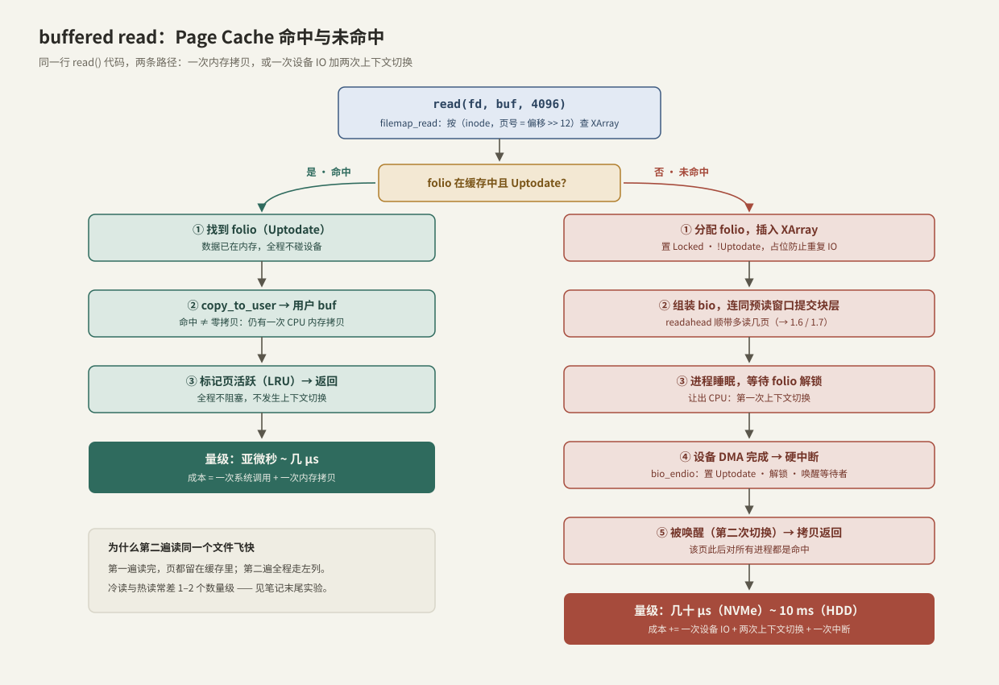
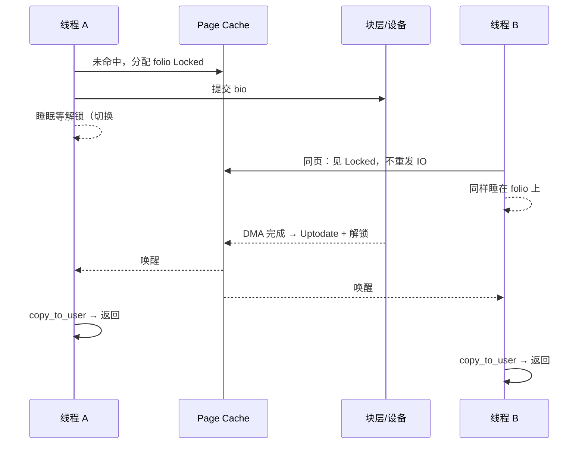
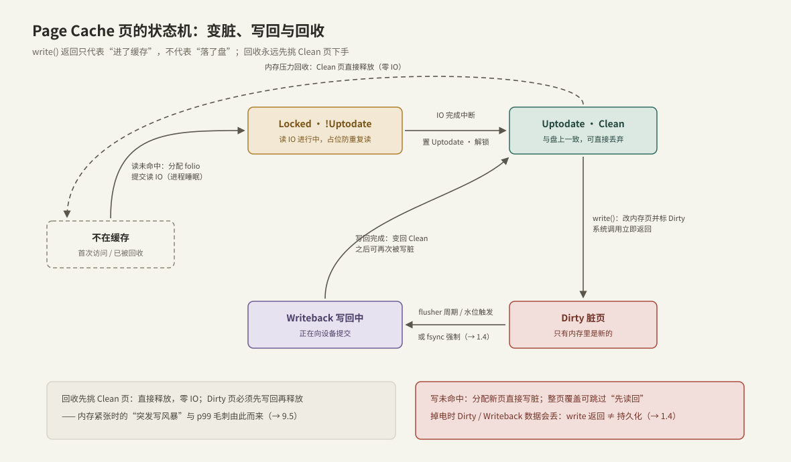

---
tags:
  - 高性能存储
  - Linux-IO路径
---
# Page Cache 命中与未命中

> "写很快"是因为根本没写盘，"读很快"是因为早就读进了内存——Page Cache 是内核用空闲内存为文件数据维护的透明缓存。命中与未命中，是同一行 `read()` 代码之间微秒与毫秒的分界线。

前置：[[1.1 VFS 与系统调用路径]]（`read` 如何走到 `filemap_read`，以及 `address_space` 挂在 inode 上这一事实）。

---

## 1. 为什么需要 Page Cache

- **问题**：DRAM 访问 ~100 ns，NVMe 随机读 ~几十 μs，差 2–3 个数量级；如果每次 `read/write` 都直达设备，任何程序都会被 IO 拖死。
- **解决**：内核把读过/写过的文件数据以页为单位留在内存里——
  - **读**：利用时间局部性（刚读过的很快再读）与空间局部性（顺序读时预取后面的页）；
  - **写**：先改内存并标记，稍后批量、合并地写回设备（延迟写）。
- **设计前提【取舍】**：空闲内存闲着也是浪费，不如全部拿来做缓存，需要时再回收。所以 Linux 上 `free` 很少、`buff/cache` 很大是**健康状态**，真正要看的是 `available`。

与熟悉的 CPU cache 对个表，帮助定位这个概念：

| | CPU cache | Page Cache |
| --- | --- | --- |
| 管理者 | 硬件，对软件透明 | 内核软件，策略可调可绕过 |
| 粒度 | cache line（64 B） | 页（4 KiB 起，folio 可更大） |
| 缓存什么 | 物理内存 | 文件/块设备数据 |
| 写策略 | 由一致性协议处理 | 显式的 dirty 标记 + 异步写回 |
| 绕过方式 | 基本不可 | `O_DIRECT`（[[1.3 Buffered IO 与 O_DIRECT]]） |

---

## 2. Page Cache 在哪里：结构

**【事实】** 每个 inode 有一个 `address_space`（1.1 已见），它就是这个文件的 Page Cache 索引：

- **键**：页号 = 文件内偏移 `>> 12`（4 KiB 页）；
- **值**：folio（一组连续物理页的管理对象；**【版本】** 5.16+ 引入，之前以单页 `struct page` 管理，6.x 起大 folio 越来越常见——本质不变：按页粒度缓存文件数据）;
- **索引结构【实现】**：XArray（基数树的现代封装），按页号 O(树高) 查找，支持 RCU 无锁读。

两个直接推论：

1. **按页对齐思考**：读 1 字节也会把整页 4 KiB 载入缓存；跨页的 8 KiB 读至少涉及两个 folio。
2. **跨进程共享**：缓存挂在 inode 上——进程 A 读热了的文件，进程 B 首次读也命中。

---

## 3. 命中与未命中：两条路径



### 3.1 命中路径（快，但不是免费）

`filemap_read` 按（inode，页号）查 XArray，folio 存在且 `Uptodate`（内容有效）：

1. 直接 `copy_to_user` 把页内容拷进用户缓冲区;
2. 标记页活跃（供 LRU 回收决策用）;
3. 返回。

**【量级】** 全程亚微秒到几微秒，不阻塞、无上下文切换。但注意两笔仍然存在的成本——**一次系统调用 + 一次 CPU 内存拷贝**。"命中 ≠ 零拷贝"：这正是 [[1.5 mmap 读路径]]（省拷贝）与 io_uring（摊薄系统调用）继续优化的空间。

### 3.2 未命中路径（一次设备 IO + 两次上下文切换）

folio 不存在（或存在但 `!Uptodate`）时：

1. **分配 folio 插入 XArray**，置 `Locked · !Uptodate`——先占位。**为什么先占位【实现】**：并发下别的线程/进程可能同时读同一页，占位保证同一页只发一次设备 IO，后来者直接睡在"等解锁"上。与 C++ 里"先放占位对象再初始化，避免重复构造"（`std::call_once` 保护的懒初始化）是同一个思路;
2. **组装 bio 提交块层**：不止读请求的那一页——readahead 会把预读窗口一起提交（顺序读时窗口逐步放大，详见 [[1.6 readahead 与 posix_fadvise]]）；bio 在块层如何排队、合并见 [[1.7 块层与 blk-mq]]；
3. **进程睡眠**等待 folio 解锁：让出 CPU，**第一次上下文切换**。这一刻起，延迟由设备决定，CPU 可以去跑别人；
4. **设备 DMA 完成 → 硬中断**：完成处理里 `bio_endio` 把 folio 置 `Uptodate`、解锁、唤醒等待者;
5. **进程被唤醒**（**第二次上下文切换**）→ `copy_to_user` → 返回。此后这一页对所有进程都是命中。

并发下同一页只打一次盘——占位锁把后来者合并到同一次 IO：



**【量级】** NVMe 几十到上百 μs，HDD 可到 10 ms 级；小 IO 下两次切换 + 中断的固定成本占比可观。

---

## 4. 写路径：延迟写与脏页

**【事实】** `write()` 的默认语义（buffered write）是：

1. `copy_from_user` 把数据拷进对应的缓存页（页不在缓存时先分配；**整页覆盖可以跳过"先从盘上读回"**，部分覆盖则可能要先读）;
2. 把 folio 标记为 `Dirty`;
3. **立即返回**——没有碰设备。

所以 `write` 的"快"是延迟写的假象，此刻数据只在内存里。真正落盘由两类机制驱动：

- **异步回写**：内核 flusher 线程周期性扫描（脏页存活超过 `dirty_expire_centisecs`，常见默认 30 s），或脏页总量越过水位——超过 `dirty_background_ratio`（常见默认 10%）后台开始写回；再超过 `dirty_ratio`（常见默认 20%）则**让继续写脏的进程原地限速**，这是"突然所有写都变慢"的经典原因之一。（比例可调，属**【取舍】**：调大吞吐更平滑，代价是崩溃丢失窗口更大、回写风暴更猛。）
- **显式持久化**：`fsync/fdatasync` 强制写回并等待完成——掉电时 `Dirty/Writeback` 中的数据会丢，**write 返回 ≠ 持久化**，持久性语义整篇展开见 [[1.4 fsync fdatasync 与持久化语义]]。

---

## 5. 一页缓存的完整生命周期



| 状态 | 含义 | 进入方式 | 离开方式 |
| --- | --- | --- | --- |
| 不在缓存 | 首次访问或已被回收 | — | 读/写未命中时分配 |
| `Locked · !Uptodate` | 读 IO 进行中，占位 | 读未命中 | IO 完成中断置 Uptodate |
| `Uptodate · Clean` | 与盘上一致 | 读入完成 / 写回完成 | 被写脏，或被回收释放 |
| `Dirty` | 只有内存里是新的 | `write()` / mmap 写 | flusher、水位、fsync 触发写回 |
| `Writeback` | 正在向设备提交 | 写回启动 | 完成后回到 Clean |

### 回收与 LRU

内存紧张时内核从 Page Cache 回收页，顺序体现一条铁律：**Clean 页直接释放（盘上有副本，零 IO），Dirty 页必须先写回**。

- **【实现】** 经典实现是 active/inactive 两级 LRU 链表，访问会把页提升到 active；6.1+ 引入 MGLRU（多代 LRU）作为更精细的替代，思想不变：估计"最近有没有用"。
- **实践后果**：内存压力大时，回收被迫先清洗大量脏页 → 突发写风暴 → 前台 IO 的 p99 毛刺（定位方法见 [[9.5 p99 毛刺定位]]）。数据库/存储引擎常用 `O_DIRECT` 自管缓存，或控制脏页水位来避开。

---

## 6. 动手实验：用 C++ 量出冷热差

复用 1.1 的 `UniqueFd/open_file`，对同一文件测三次全量顺序读：冷读（首次）、热读（缓存全命中）、`POSIX_FADV_DONTNEED` 主动驱逐后再读：

```cpp
#include <fcntl.h>
#include <unistd.h>

#include <cerrno>
#include <chrono>
#include <cstddef>
#include <iostream>
#include <vector>

// 全文件顺序读一遍，返回毫秒数（实验代码：错误处理从简）
double time_full_read(const char* path) {
    UniqueFd fd = open_file(path);
    std::vector<std::byte> buf(1 << 20);            // 1 MiB 读块
    const auto t0 = std::chrono::steady_clock::now();
    while (true) {
        const ssize_t n = ::read(fd.get(), buf.data(), buf.size());
        if (n < 0 && errno == EINTR) continue;
        if (n <= 0) break;                          // EOF 或出错即停
    }
    const auto t1 = std::chrono::steady_clock::now();
    return std::chrono::duration<double, std::milli>(t1 - t0).count();
}

int main(int, char** argv) {
    const char* path = argv[1];

    const double cold = time_full_read(path);   // 若此前没人读过 → 未命中路径
    const double hot  = time_full_read(path);   // 页已在缓存 → 命中路径

    {   // 请求内核丢弃该文件的缓存页，制造一次可复现的"冷读"
        UniqueFd fd = open_file(path);
        ::posix_fadvise(fd.get(), 0, 0, POSIX_FADV_DONTNEED);
    }
    const double evicted = time_full_read(path);

    std::cout << "cold=" << cold << " ms, hot=" << hot
              << " ms, after-DONTNEED=" << evicted << " ms\n";
}
```

**读实验结果的方法**：

- `hot` 只受内存带宽和拷贝限制；`evicted` 重新走未命中路径，受介质限制——两者之差就是 Page Cache 的价值，NVMe 上常见 1–2 个数量级；
- 第一次的 `cold` 未必真冷（文件可能早被别人读热），所以才需要 `DONTNEED` 制造可复现的冷读；
- **【事实】** `POSIX_FADV_DONTNEED` 只对 Clean 页立即生效，Dirty 页要先 `fsync` 再驱逐才干净。

配套观察工具：

```bash
free -h                                   # buff/cache 与 available
grep -E 'Cached|Dirty|Writeback' /proc/meminfo   # 缓存量、当前脏页量、正在写回量
vmtouch -v bigfile                        # 该文件有多少页在缓存里（需安装）
sudo cachestat-bpfcc 1                    # 全局命中率（bcc 工具）

# 全局清缓存（root，影响整机性能，仅实验机使用）
sync && echo 3 | sudo tee /proc/sys/vm/drop_caches
```

---

## 7. 陷阱与误区

> [!warning] 常见误读
> 1. **"内存快被 cache 吃光了"**：`buff/cache` 是可回收的，看 `available` 而不是 `free`。
> 2. **"命中了就是零拷贝"**：命中仍有一次系统调用 + 一次 `copy_to_user`。
> 3. **"write 返回了数据就安全了"**：只是进了缓存；掉电即丢，见 [[1.4 fsync fdatasync 与持久化语义]]。
> 4. **一次性扫大文件把热数据全挤出缓存**（缓存污染）：顺序扫完即弃的场景，用 `POSIX_FADV_DONTNEED` 边读边丢，或干脆 `O_DIRECT`（[[1.3 Buffered IO 与 O_DIRECT]]）。
> 5. **担心 read/write 与 mmap 不一致**：**【事实】** 两者操作的是同一份物理页（同一个 `address_space`），天然一致；需要小心的是写入的持久化时机，而不是可见性。

---

## 8. 关键结论

| 结论 | 性质 |
| --- | --- |
| Page Cache 以页（folio）为单位、按 inode 组织，跨进程共享一份 | 事实 |
| 命中：~μs 级，成本 = 系统调用 + 一次内存拷贝；命中 ≠ 零拷贝 | 事实 / 量级 |
| 未命中：一次设备 IO + 两次上下文切换 + 一次中断，延迟由介质决定 | 事实 / 量级 |
| write 默认只写缓存标脏即返回；落盘靠 flusher / 水位 / fsync | 事实 |
| 脏页水位（常见默认 10% / 20%）越限会限速前台写，是"写突然变慢"常见原因 | 实现 / 取舍 |
| 回收先丢 Clean 页；内存压力 + 大量脏页 = 写风暴与 p99 毛刺 | 事实 → 实践结论 |
| 冷热读性能差 1–2 个数量级，用 fadvise(DONTNEED) 可复现地测量 | 量级 / 实践结论 |

---

## 关联知识

- [[1.1 VFS 与系统调用路径]] - 前置：read 如何到达 filemap_read、address_space 挂在哪
- [[1.3 Buffered IO 与 O_DIRECT]] - 主动绕过本篇整套机制的方式与代价
- [[1.4 fsync fdatasync 与持久化语义]] - 脏页真正落盘的语义保证
- [[1.6 readahead 与 posix_fadvise]] - 未命中路径里预读窗口的完整策略
