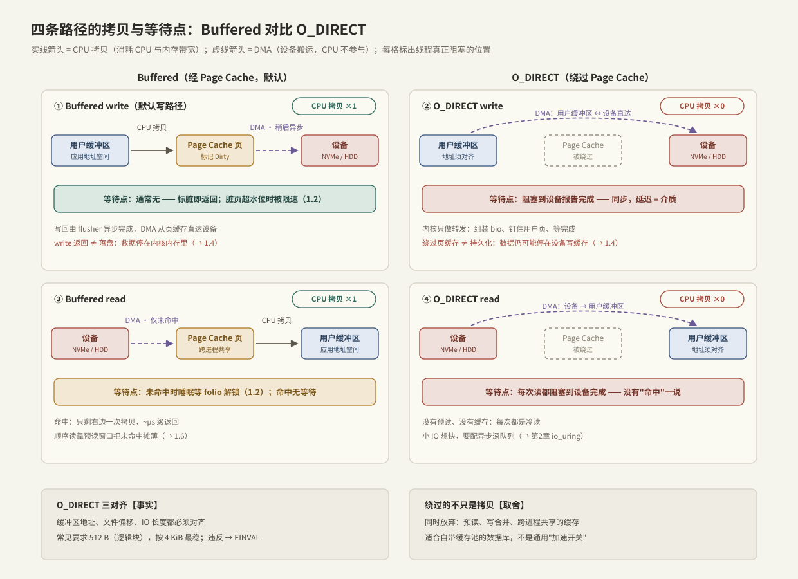

---
tags:
  - 高性能存储/Linux-IO路径
---
# Buffered IO 与 O_DIRECT

> 同一个 `read/write`，打开文件时带不带 `O_DIRECT`，走的是两条完全不同的数据通路：一条经过 Page Cache、由内核代管缓存与回写；一条让用户缓冲区与设备直接 DMA。本篇把四条路径（读/写 × 两种模式）的**每一次拷贝、每一个等待点**数清楚。

前置：[[1.1 VFS 与系统调用路径]]（数据如何进入内核）、[[1.2 Page Cache 命中与未命中]]（buffered 路径的全部细节）。

---

## 1. 先分清：谁在搬数据

路径分析里只有两种"搬运工"，成本完全不同：

| 搬运方式 | 执行者 | 成本 | 在图中的画法 |
| --- | --- | --- | --- |
| **CPU 拷贝** | CPU 执行 memcpy 类指令 | 占用 CPU 周期与内存带宽，随数据量线性增长 | 实线箭头 |
| **DMA** | 设备控制器自主搬运 | CPU 不参与，只在完成时收一个中断 | 虚线箭头 |

**【事实】** buffered IO 的"一次拷贝"指的是 CPU 在用户缓冲区与 Page Cache 之间的那一次；Page Cache 与设备之间从来都是 DMA。O_DIRECT 消掉的正是那次 CPU 拷贝——DMA 直接以用户缓冲区为源/目的地。

---

## 2. 四条路径：拷贝与等待点



### 2.1 Buffered write（默认写路径）

1. **[用户态 → 内核]** 系统调用陷入（模式切换）；
2. **[内核]** `copy_from_user`：**CPU 拷贝 ×1**，用户缓冲区 → Page Cache 页；页不在缓存时先分配（部分覆盖一页时可能还要先从盘上读回旧内容——一次隐藏的读 IO）；
3. **[内核]** 标记页 `Dirty`，**立即返回**。
4. **[硬件·稍后]** flusher 异步把脏页写回：组装 bio → 块层 → 设备 DMA 从页缓存拉数据。

- **等待点：通常没有。** 例外是脏页超过 `dirty_ratio` 水位时，内核会让继续写脏的进程原地限速（1.2 讲过的"写突然变慢"）。
- **拷贝：CPU ×1**（用户 → 页缓存），DMA ×1（页缓存 → 设备，异步、不算在调用延迟里）。
- **【事实】** 返回 ≠ 落盘，掉电丢数据，持久化要靠 [[1.4 fsync fdatasync 与持久化语义]]。

### 2.2 O_DIRECT write

1. **[用户态 → 内核]** 系统调用陷入；
2. **[内核]** 校验三对齐（见第 3 节），**钉住（pin）用户缓冲区所在物理页**，直接以它为 DMA 源组装 bio 提交块层；
3. **[硬件]** 设备 DMA 从用户缓冲区取数 → 完成中断；
4. **[内核]** 唤醒进程，返回。

- **等待点：同步阻塞到设备报告完成**——延迟就是介质延迟（NVMe 几十 μs 起）。写变"慢"了，但换来确定性：返回时数据已交给设备。
- **拷贝：CPU ×0**，DMA ×1（用户缓冲区 ↔ 设备直达）。
- **【事实】** 绕过页缓存 ≠ 持久化：数据可能还躺在**设备写缓存**里，仍需 FLUSH/FUA（→ 1.4）。
- **注意**：调用期间用户缓冲区归 DMA 使用，多线程下在完成前复用/释放该缓冲区是未定义行为——RAII 保证缓冲区生命周期覆盖整个 IO。

### 2.3 Buffered read

命中：陷入 → 查 XArray → **CPU 拷贝 ×1**（页缓存 → 用户缓冲区）→ 返回，无等待。
未命中：分配 folio → DMA（设备 → 页缓存）→ **进程睡眠等 folio 解锁**（两次上下文切换）→ 醒来后 CPU 拷贝 ×1 → 返回。完整逐步在 [[1.2 Page Cache 命中与未命中]]。

- **等待点：仅未命中时**；顺序负载下预读把未命中率压得很低（[[1.6 readahead 与 posix_fadvise]]）。
- **拷贝：CPU ×1 永远存在**——这是 buffered read 的固定税。

### 2.4 O_DIRECT read

1. 陷入 → 校验对齐 → 钉住用户缓冲区 → 提交 bio；
2. 设备 DMA **直接写进用户缓冲区** → 中断 → 唤醒 → 返回。

- **等待点：每次都阻塞到设备完成。** 没有缓存就没有"命中"，也没有预读——每次读都是冷读。
- **拷贝：CPU ×0**，DMA ×1。
- **【取舍】** 同步 O_DIRECT 小 IO 的吞吐会非常难看（每 4 KiB 都付一次完整介质延迟）；它的正确打开方式是配合异步深队列，让设备的并行度补回延迟（第 2 章 io_uring，[[2.1 SQ CQ 模型]]）。

### 2.5 汇总

| 路径 | CPU 拷贝 | 线程阻塞点 | 延迟量级 |
| --- | --- | --- | --- |
| Buffered write | 1 | 通常无（超水位限速除外） | ~μs |
| O_DIRECT write | 0 | 每次，等设备完成 | 介质延迟 |
| Buffered read 命中 | 1 | 无 | ~μs |
| Buffered read 未命中 | 1 | 睡眠等 folio（2 次上下文切换） | 介质延迟 + 切换 |
| O_DIRECT read | 0 | 每次，等设备完成 | 介质延迟 |

---

## 3. O_DIRECT 的对齐约束

**【事实】** 三个量都必须对齐，任何一个不满足，`read/write` 返回 `EINVAL`：

1. 用户缓冲区**起始地址**；
2. **文件偏移**；
3. **IO 长度**。

对齐粒度由设备与文件系统决定，常见是逻辑块 512 B；**按 4 KiB 对齐最稳**（覆盖 4Kn 盘与页大小）。查询方式：

```bash
cat /sys/block/nvme0n1/queue/logical_block_size   # 逻辑块大小
```

为什么有这个要求【实现】：DMA 以设备块为单位直达用户内存，内核不再有页缓存这层"中转站"帮你做非对齐的拼接。

---

## 4. 谁应该用 O_DIRECT：取舍分析

数据库（MySQL InnoDB、RocksDB 可选、PostgreSQL 部分场景）用它，理由是三个"内核不如我"：

1. **双重缓存浪费**【事实】：数据库自带 buffer pool，同一份数据在 buffer pool 和 Page Cache 各存一份，内存利用率减半；
2. **回收与回写时机不可控**【事实 → 痛点】：内核按自己的水位和 LRU 行事，突发写回会打出应用无法预期的 p99 毛刺；
3. **访问模式自己最清楚**【取舍】：B+ 树内部节点、LSM 的 compaction 流，哪些该缓存哪些该丢，应用比通用 LRU 判断得准。

代价是把内核免费提供的东西全部自己重做：预读、写合并、缓存、跨进程共享。所以判断标准很简单——

> [!tip] 决策规则
> **有自己的缓存层和 IO 调度就用 O_DIRECT；没有就老实用 buffered。** O_DIRECT 不是加速开关，对普通应用它几乎总是负优化。

另外两个相关标志放在 1.4 展开：`O_SYNC`/`O_DSYNC`（每次 write 附带持久化语义，与 O_DIRECT 常组合成 `O_DIRECT | O_DSYNC` 做数据库日志）。

---

## 5. 混用警告

**【事实】** 同一文件同时用 buffered 与 O_DIRECT 访问，一致性由内核"尽力而为"：O_DIRECT 写之前内核会尝试写回并失效重叠的缓存页，但与并发的 buffered 写、mmap 脏页之间存在竞态窗口，结果可能读到旧数据。规则：**一个文件选定一种模式，不要混用**（这也是 RocksDB 等在文档里明确要求的）。

**【实现差异】** 个别文件系统/场景会悄悄回退 buffered（如某些 COW 文件系统的特定配置、文件打洞区域），O_DIRECT 语义是"尽力直达"而非契约——性能敏感场景要实测验证（fio + iostat 看有没有页缓存流量）。

---

## 6. Modern C++：对齐缓冲区与 O_DIRECT 读

`std::aligned_alloc` 配 `unique_ptr` 自定义删除器，所有权语义与普通内存一致（复用 1.1 的 `UniqueFd`/`open_file` 思路）：

```cpp
#include <fcntl.h>
#include <unistd.h>

#include <cstddef>
#include <cstdlib>
#include <memory>
#include <new>
#include <system_error>

inline constexpr std::size_t kAlign = 4096;   // 4 KiB：地址/偏移/长度共用

struct FreeDeleter {
    void operator()(void* p) const noexcept { std::free(p); }
};
using AlignedBuffer = std::unique_ptr<std::byte[], FreeDeleter>;

AlignedBuffer make_aligned_buffer(std::size_t size) {
    // 【事实】aligned_alloc 要求 size 是 alignment 的整数倍
    void* p = std::aligned_alloc(kAlign, size);
    if (p == nullptr) throw std::bad_alloc{};
    return AlignedBuffer{static_cast<std::byte*>(p)};
}

// O_DIRECT 随机读：offset 与 len 必须都是 kAlign 的整数倍
std::size_t direct_pread(const char* path, std::byte* aligned_buf,
                         std::size_t len, off_t offset) {
    int raw = ::open(path, O_RDONLY | O_DIRECT | O_CLOEXEC);
    if (raw < 0) throw std::system_error{errno, std::generic_category(), path};
    UniqueFd fd{raw};

    // pread 带显式偏移：不碰 f_pos，天然线程安全（1.1）
    const ssize_t n = ::pread(fd.get(), aligned_buf, len, offset);
    if (n < 0) throw std::system_error{errno, std::generic_category(), "pread"};
    return static_cast<std::size_t>(n);
}
```

**关键点**：

- 删除器必须是 `std::free`——`aligned_alloc` 的内存不能交给 `delete[]`；
- 长度按 `kAlign` 的整数倍申请与读取，读到文件末尾时返回值会小于请求值（短读语义不变）；
- 用 `pread` 而非 `read`：O_DIRECT 常见于随机访问，显式偏移顺便解决并发问题。

---

## 7. 动手验证

```bash
# 同一块盘、同一负载，唯一变量是 direct 开关
fio --name=buf    --filename=/data/testfile --rw=randread --bs=4k \
    --iodepth=1 --numjobs=1 --size=4G --direct=0
fio --name=direct --filename=/data/testfile --rw=randread --bs=4k \
    --iodepth=1 --numjobs=1 --size=4G --direct=1

# 观察：buffered 第二遍跑分会因缓存命中飙高；direct 两遍一致
grep -E 'Cached|Dirty' /proc/meminfo    # direct 跑时 Cached 基本不动
```

预期读法：`direct=0` 重复跑，命中率上来后延迟坍缩到 μs 级；`direct=1` 每次都是介质真实延迟，可重复、可预测——**buffered 快在缓存，direct 稳在直达**，这就是两种模式的全部人格。

---

## 8. 陷阱与误区

> [!warning] 常见错误
> 1. **把 O_DIRECT 当加速开关**：没有自建缓存的应用换上它，读性能立刻塌方（没有预读、没有命中）。
> 2. **忘记三对齐**：`EINVAL` 排查半天，最后发现是 `std::vector` 的 data() 地址没对齐。
> 3. **以为 O_DIRECT 写完就安全**：设备写缓存还在，掉电照样丢（→ 1.4）。
> 4. **对同一文件混用两种模式**：一致性竞态，读到旧数据。
> 5. **同步 O_DIRECT 打小 IO 还嫌慢**：这是使用方式错误——要么加大 IO、要么上异步深队列（第 2 章）。

---

## 9. 关键结论

| 结论 | 性质 |
| --- | --- |
| buffered 的固定税：每次 read/write 一次 CPU 拷贝；DMA 只发生在页缓存与设备之间 | 事实 |
| O_DIRECT：CPU 拷贝 0 次，用户缓冲区直接做 DMA 目标，每次调用阻塞到设备完成 | 事实 |
| O_DIRECT 三对齐（地址/偏移/长度），违反 EINVAL；按 4 KiB 最稳 | 事实 |
| O_DIRECT 同时放弃预读、写合并、共享缓存——适合自带缓存池的系统 | 取舍 |
| 绕过页缓存 ≠ 持久化：设备写缓存仍需 FLUSH | 事实 |
| 同一文件不要混用两种模式 | 实践结论 |
| 小 IO + O_DIRECT 必须配异步深队列才有性能 | 实践结论 |

---

## 关联知识

- [[1.2 Page Cache 命中与未命中]] - buffered 路径的完整机制，本篇的对照组
- [[1.4 fsync fdatasync 与持久化语义]] - 两种模式共同的"最后一公里"：设备写缓存
- [[2.1 SQ CQ 模型]] - O_DIRECT 小 IO 的正确搭档：异步深队列
- [[6.9 RocksDB 关键路径]] - 真实存储引擎里两种模式的选型现场
